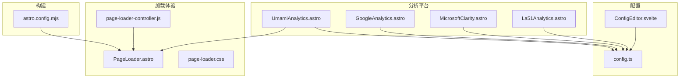
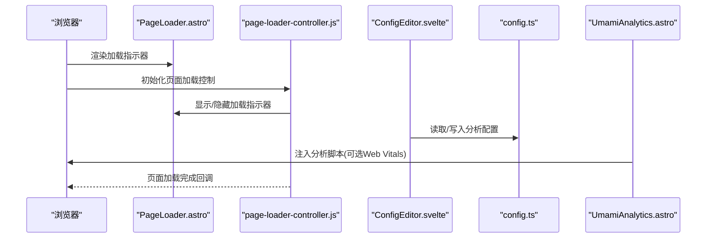
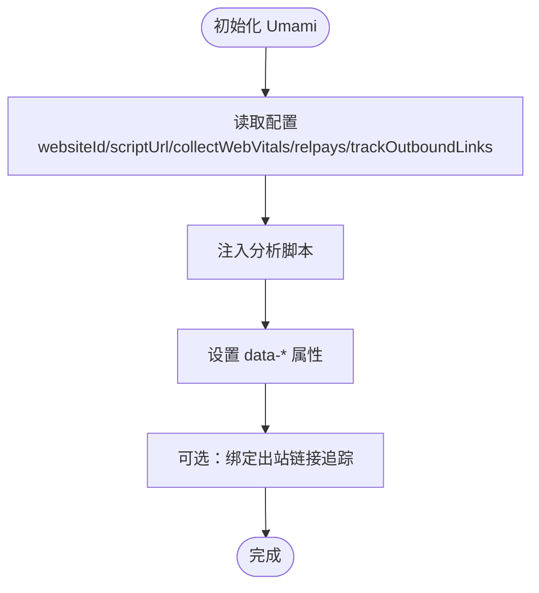
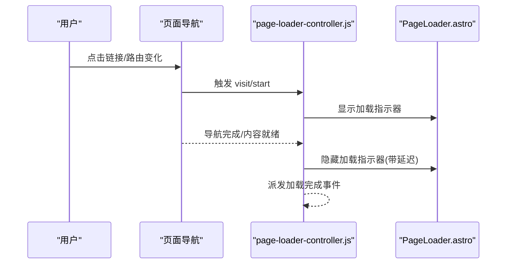
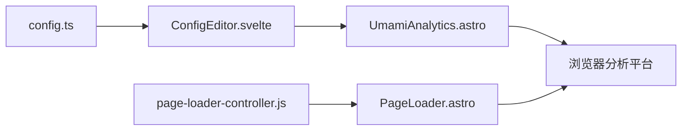

# 性能监控

<cite>
**本文档引用的文件**
- [UmamiAnalytics.astro](file://src/components/analytics/UmamiAnalytics.astro)
- [GoogleAnalytics.astro](file://src/components/analytics/GoogleAnalytics.astro)
- [La51Analytics.astro](file://src/components/analytics/La51Analytics.astro)
- [config.ts](file://src/types/config.ts)
- [ConfigEditor.svelte](file://src/components/edit/ConfigEditor.svelte)
- [page-loader-controller.js](file://src/utils/page-loader-controller.js)
- [PageLoader.astro](file://src/components/features/PageLoader.astro)
- [page-loader.css](file://src/styles/components/page-loader.css)
- [astro.config.mjs](file://astro.config.mjs)
</cite>

## 目录
1. [简介](#简介)
2. [项目结构](#项目结构)
3. [核心组件](#核心组件)
4. [架构总览](#架构总览)
5. [组件详解](#组件详解)
6. [依赖关系分析](#依赖关系分析)
7. [性能考量](#性能考量)
8. [故障排查指南](#故障排查指南)
9. [结论](#结论)
10. [附录](#附录)

## 简介
本文件面向性能监控系统的设计与落地，结合仓库中已有的分析与加载体验组件，系统性阐述页面加载性能监控的实现路径。重点覆盖以下方面：
- 关键性能指标（KPI）的测量与数据采集策略
- 页面加载时间分析机制（首字节时间、内容加载时间、交互完成时间）
- 浏览器性能API的使用、自定义指标定义与异常检测
- 性能数据可视化与趋势分析思路
- 告警机制与自动恢复策略建议
- 性能优化实践（资源压缩、缓存策略、懒加载）

说明：当前仓库未包含完整的前端性能埋点与上报链路代码，但已具备分析平台集成（Umami/Google/Microsoft Clarity）、会话回放（Umami Replays）以及页面加载指示器等基础能力。本文将基于现有组件进行扩展设计说明，并给出可落地的实施建议。

## 项目结构
围绕性能监控的关键文件主要分布在以下位置：
- 分析平台集成组件：Umami、Google、Microsoft Clarity
- 配置类型与编辑器：站点配置类型定义与可视化配置编辑器
- 页面加载控制器与加载指示器：页面切换时的加载状态管理与视觉反馈
- 构建配置：资源分包与压缩策略

图示来源
- [UmamiAnalytics.astro:1-52](file://src/components/analytics/UmamiAnalytics.astro#L1-L52)
- [GoogleAnalytics.astro](file://src/components/analytics/GoogleAnalytics.astro)
- [La51Analytics.astro](file://src/components/analytics/La51Analytics.astro)
- [config.ts:156-183](file://src/types/config.ts#L156-L183)
- [ConfigEditor.svelte:647-685](file://src/components/edit/ConfigEditor.svelte#L647-L685)
- [PageLoader.astro:1-23](file://src/components/features/PageLoader.astro#L1-L23)
- [page-loader.css:1-81](file://src/styles/components/page-loader.css#L1-L81)
- [page-loader-controller.js:139-185](file://src/utils/page-loader-controller.js#L139-L185)
- [astro.config.mjs:245-280](file://astro.config.mjs#L245-L280)

章节来源
- [UmamiAnalytics.astro:1-52](file://src/components/analytics/UmamiAnalytics.astro#L1-L52)
- [config.ts:156-183](file://src/types/config.ts#L156-L183)
- [ConfigEditor.svelte:647-685](file://src/components/edit/ConfigEditor.svelte#L647-L685)
- [PageLoader.astro:1-23](file://src/components/features/PageLoader.astro#L1-L23)
- [page-loader.css:1-81](file://src/styles/components/page-loader.css#L1-L81)
- [page-loader-controller.js:139-185](file://src/utils/page-loader-controller.js#L139-L185)
- [astro.config.mjs:245-280](file://astro.config.mjs#L245-L280)

## 核心组件
- 分析平台集成组件：负责注入第三方分析脚本、传递配置参数（如是否收集Web Vitals、会话回放采样率、隐私遮罩级别等），并可选追踪出站链接点击事件。
- 配置类型与编辑器：统一定义站点配置项，包括分析平台参数；编辑器以可视化方式生成配置对象，便于开启/关闭各项能力。
- 页面加载控制器与加载指示器：在页面跳转或内容更新时，控制加载指示器的显隐与状态，为后续性能指标采集提供统一时机。

章节来源
- [UmamiAnalytics.astro:1-52](file://src/components/analytics/UmamiAnalytics.astro#L1-L52)
- [config.ts:156-183](file://src/types/config.ts#L156-L183)
- [ConfigEditor.svelte:647-685](file://src/components/edit/ConfigEditor.svelte#L647-L685)
- [page-loader-controller.js:139-185](file://src/utils/page-loader-controller.js#L139-L185)
- [PageLoader.astro:1-23](file://src/components/features/PageLoader.astro#L1-L23)

## 架构总览
下图展示了从页面初始化到分析平台接入、再到加载体验控制的整体流程：

图示来源
- [PageLoader.astro:1-23](file://src/components/features/PageLoader.astro#L1-L23)
- [page-loader-controller.js:139-185](file://src/utils/page-loader-controller.js#L139-L185)
- [ConfigEditor.svelte:647-685](file://src/components/edit/ConfigEditor.svelte#L647-L685)
- [config.ts:156-183](file://src/types/config.ts#L156-L183)
- [UmamiAnalytics.astro:1-52](file://src/components/analytics/UmamiAnalytics.astro#L1-L52)

## 组件详解

### Umami 分析集成
- 能力概览
  - 支持开启/关闭 Web Vitals 收集
  - 支持会话回放（Replays）的开关、采样率、隐私遮罩级别、最大时长、排除选择器等参数透传
  - 可选追踪出站链接点击事件
- 参数映射
  - websiteId、scriptUrl：分析平台标识与脚本地址
  - collectWebVitals：是否采集浏览器性能指标
  - relpays.*：会话回放相关配置
  - trackOutboundLinks：是否追踪出站链接点击
- 实施要点
  - 在页面头部注入脚本，并通过 data-* 属性传递配置
  - 出站链接追踪可在脚本注入后执行一次性的事件绑定逻辑

图示来源
- [UmamiAnalytics.astro:1-52](file://src/components/analytics/UmamiAnalytics.astro#L1-L52)
- [config.ts:156-183](file://src/types/config.ts#L156-L183)
- [ConfigEditor.svelte:647-685](file://src/components/edit/ConfigEditor.svelte#L647-L685)

章节来源
- [UmamiAnalytics.astro:1-52](file://src/components/analytics/UmamiAnalytics.astro#L1-L52)
- [config.ts:156-183](file://src/types/config.ts#L156-L183)
- [ConfigEditor.svelte:647-685](file://src/components/edit/ConfigEditor.svelte#L647-L685)

### 页面加载体验与指标采集时机
- 加载指示器
  - 通过组件渲染加载动画与无障碍标签，提供视觉与可访问性反馈
  - 样式支持减少动画偏好与移动端隐藏策略
- 加载控制器
  - 在页面跳转前显示加载指示器，在跳转完成后按约定延迟隐藏
  - 提供事件派发，便于外部监听“加载完成”时机
- 指标采集时机建议
  - 使用页面加载控制器提供的“加载完成”事件作为关键指标采集的触发点
  - 结合浏览器性能 API（如 Navigation Timing、Resource Timing、LCP/FID/CLS 等）在该时刻记录 KPI

图示来源
- [page-loader-controller.js:139-185](file://src/utils/page-loader-controller.js#L139-L185)
- [PageLoader.astro:1-23](file://src/components/features/PageLoader.astro#L1-L23)
- [page-loader.css:1-81](file://src/styles/components/page-loader.css#L1-L81)

章节来源
- [PageLoader.astro:1-23](file://src/components/features/PageLoader.astro#L1-L23)
- [page-loader-controller.js:139-185](file://src/utils/page-loader-controller.js#L139-L185)
- [page-loader.css:1-81](file://src/styles/components/page-loader.css#L1-L81)

### 关键性能指标（KPI）与采集策略
- 首字节时间（TTFB）
  - 通过 Navigation Timing API 获取 responseStart 与 fetchStart 差值
  - 采集时机：页面“加载完成”事件触发时
- 内容加载时间（DOM Content Loaded / Load）
  - 使用 navigationStart、domContentLoadedEventEnd、loadEventEnd
  - 采集时机：同上
- 交互完成时间（Time to Interactive / FID/INP）
  - 使用 First Input Delay 或 Input Latency（INP）近似
  - 采集时机：用户首次交互事件发生时
- 自定义指标
  - 可定义“首屏渲染完成”、“核心资源加载完成”等业务相关指标
  - 采集时机：资源加载完成或关键渲染路径就绪时
- 数据聚合与上报
  - 建议在“加载完成”事件后批量上报，避免高频请求
  - 对异常值进行过滤（如极端超时、负值等）

章节来源
- [UmamiAnalytics.astro:1-52](file://src/components/analytics/UmamiAnalytics.astro#L1-L52)
- [page-loader-controller.js:139-185](file://src/utils/page-loader-controller.js#L139-L185)

### 性能数据可视化与趋势分析
- 仪表板建议
  - 指标面板：TTFB、FCP/LCP、FID/INP、CLS、资源体积分布
  - 时间序列：按天/小时聚合的指标趋势
  - 地域/设备细分：按国家、网络类型、操作系统等维度对比
- 可视化实现
  - 使用折线图、柱状图、热力图等展示趋势与分布
  - 提供筛选器（时间范围、地域、设备、浏览器版本）
- 瓶颈识别
  - 通过资源瀑布图定位慢资源
  - 通过 CLS/INP 聚合识别交互问题

（本节为概念性说明，无需文件引用）

### 告警机制与自动恢复策略
- 阈值设置
  - TTFB > X ms、LCP > Y s、CLS > Z、FID > W ms 等
- 异常通知
  - 基于阈值触发告警，支持邮件/IM推送
- 自动恢复
  - 对于资源加载失败场景，可启用降级策略（如回退 CDN、禁用非关键资源）
  - 对于交互延迟过高，可提示用户稍后再试或降低动画强度

（本节为概念性说明，无需文件引用）

### 性能优化实践
- 资源压缩
  - 启用构建期压缩与移除调试语句（已在构建配置中体现）
- 缓存策略
  - 静态资源长期缓存、HTML 每次校验；CDN/边缘缓存配合
- 懒加载
  - 图片与非首屏组件采用懒加载，减少初始阻塞
- 分包与按需加载
  - 通过构建配置对第三方库进行分包，按需加载

章节来源
- [astro.config.mjs:245-280](file://astro.config.mjs#L245-L280)

## 依赖关系分析
- 配置层
  - config.ts 定义分析平台参数类型
  - ConfigEditor.svelte 将配置可视化并生成配置对象
- 接入层
  - UmamiAnalytics.astro 读取配置并通过脚本属性传递给分析平台
- 体验层
  - PageLoader.astro 与 page-loader-controller.js 协作，提供统一的加载体验与采集时机

图示来源
- [config.ts:156-183](file://src/types/config.ts#L156-L183)
- [ConfigEditor.svelte:647-685](file://src/components/edit/ConfigEditor.svelte#L647-L685)
- [UmamiAnalytics.astro:1-52](file://src/components/analytics/UmamiAnalytics.astro#L1-L52)
- [page-loader-controller.js:139-185](file://src/utils/page-loader-controller.js#L139-L185)
- [PageLoader.astro:1-23](file://src/components/features/PageLoader.astro#L1-L23)

章节来源
- [config.ts:156-183](file://src/types/config.ts#L156-L183)
- [ConfigEditor.svelte:647-685](file://src/components/edit/ConfigEditor.svelte#L647-L685)
- [UmamiAnalytics.astro:1-52](file://src/components/analytics/UmamiAnalytics.astro#L1-L52)
- [page-loader-controller.js:139-185](file://src/utils/page-loader-controller.js#L139-L185)
- [PageLoader.astro:1-23](file://src/components/features/PageLoader.astro#L1-L23)

## 性能考量
- 构建期优化
  - 压缩与去调试信息，减少传输体积
  - 代码分包，避免单体 bundle 过大
- 运行期优化
  - 控制加载指示器的显示/隐藏时机，避免不必要的重绘
  - 在“加载完成”事件后进行指标采集与上报，降低对首屏的影响
- 第三方脚本
  - 分析脚本与会话回放脚本应异步加载，避免阻塞主线程

章节来源
- [astro.config.mjs:245-280](file://astro.config.mjs#L245-L280)
- [page-loader-controller.js:139-185](file://src/utils/page-loader-controller.js#L139-L185)
- [UmamiAnalytics.astro:1-52](file://src/components/analytics/UmamiAnalytics.astro#L1-L52)

## 故障排查指南
- 分析脚本未生效
  - 检查 websiteId/scriptUrl 是否正确传入
  - 确认 data-* 属性是否被正确设置
- Web Vitals 未采集
  - 确认 collectWebVitals 已开启
  - 检查浏览器兼容性与 HTTPS 环境
- 会话回放未录制
  - 检查 relpays.enabled 与采样率
  - 确认隐私遮罩级别与排除选择器未误屏蔽关键区域
- 加载指示器异常
  - 检查 page-loader-controller.js 的事件绑定与隐藏延迟
  - 确认样式在移动端与高对比度模式下的表现

章节来源
- [UmamiAnalytics.astro:1-52](file://src/components/analytics/UmamiAnalytics.astro#L1-L52)
- [config.ts:156-183](file://src/types/config.ts#L156-L183)
- [page-loader-controller.js:139-185](file://src/utils/page-loader-controller.js#L139-L185)
- [page-loader.css:1-81](file://src/styles/components/page-loader.css#L1-L81)

## 结论
本项目已具备分析平台集成与页面加载体验的基础能力。建议在此基础上补充：
- 基于“加载完成”事件的浏览器性能 API 采集与上报
- 可视化仪表盘与趋势分析
- 阈值驱动的告警与自动恢复策略
- 持续的资源压缩、缓存与懒加载优化

通过上述措施，可形成闭环的性能监控体系，持续提升用户体验与站点稳定性。

## 附录
- 相关文件清单
  - 分析平台组件：Umami、Google、Microsoft Clarity、La51
  - 配置类型与编辑器：config.ts、ConfigEditor.svelte
  - 加载体验：PageLoader.astro、page-loader.css、page-loader-controller.js
  - 构建配置：astro.config.mjs

章节来源
- [UmamiAnalytics.astro:1-52](file://src/components/analytics/UmamiAnalytics.astro#L1-L52)
- [GoogleAnalytics.astro](file://src/components/analytics/GoogleAnalytics.astro)
- [La51Analytics.astro](file://src/components/analytics/La51Analytics.astro)
- [config.ts:156-183](file://src/types/config.ts#L156-L183)
- [ConfigEditor.svelte:647-685](file://src/components/edit/ConfigEditor.svelte#L647-L685)
- [PageLoader.astro:1-23](file://src/components/features/PageLoader.astro#L1-L23)
- [page-loader.css:1-81](file://src/styles/components/page-loader.css#L1-L81)
- [page-loader-controller.js:139-185](file://src/utils/page-loader-controller.js#L139-L185)
- [astro.config.mjs:245-280](file://astro.config.mjs#L245-L280)