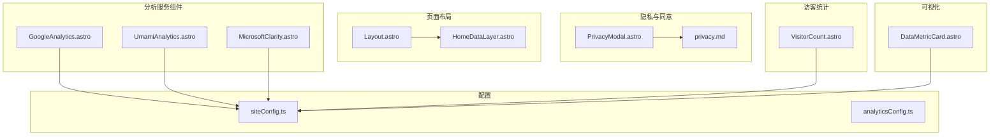
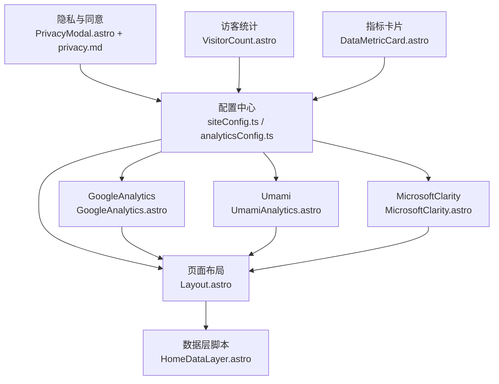
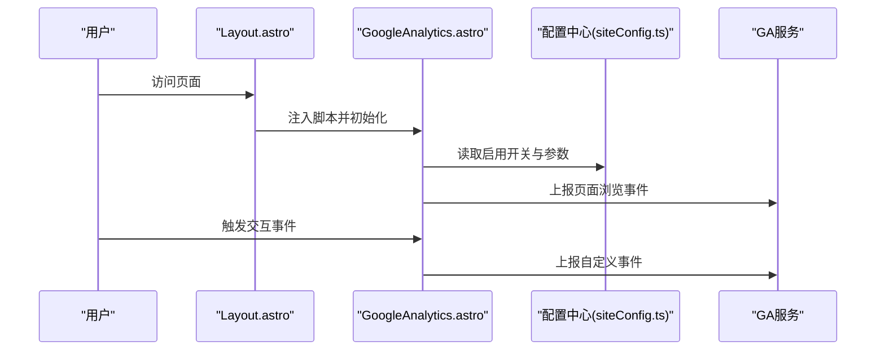
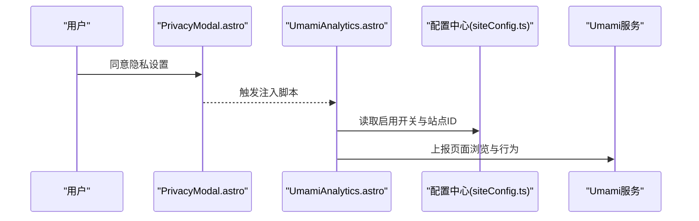
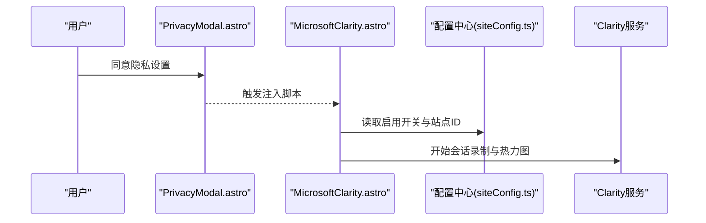
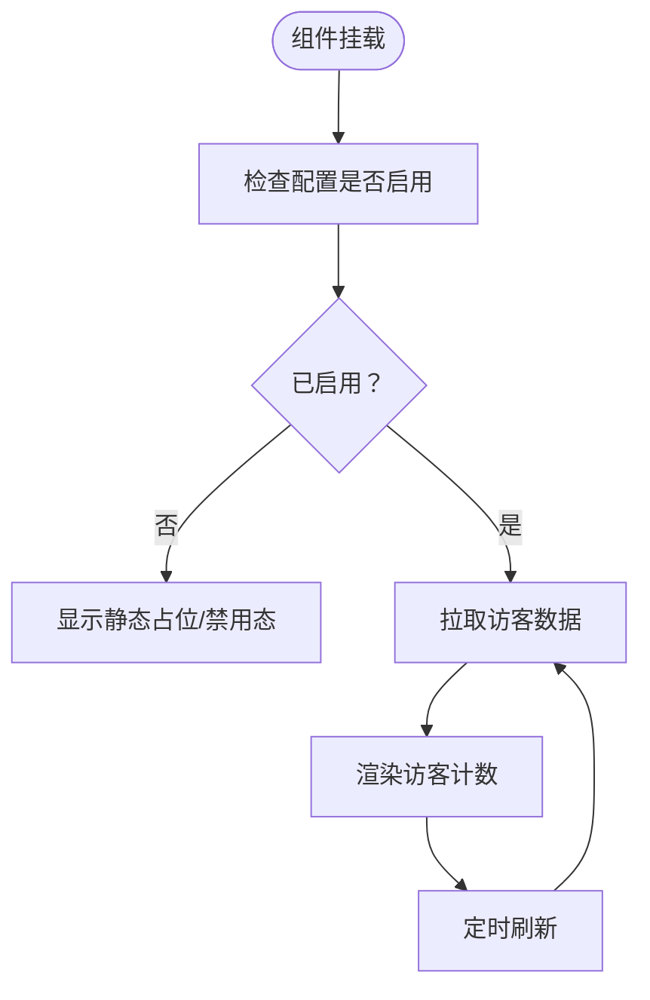
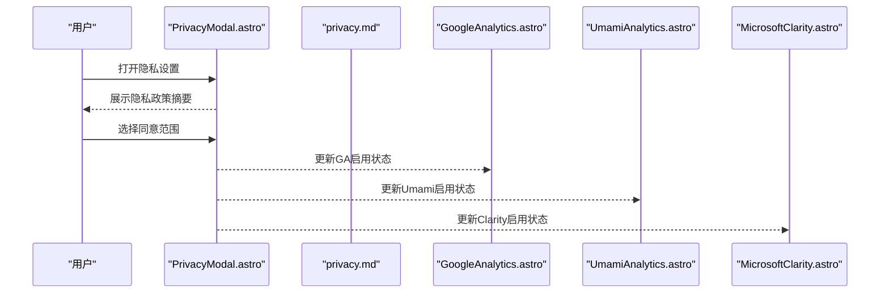
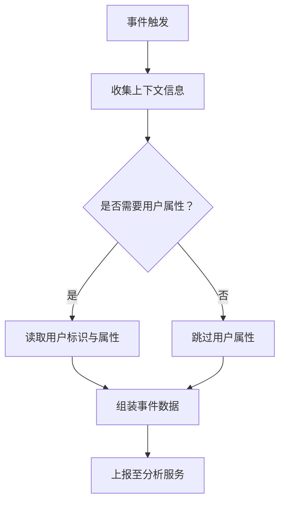
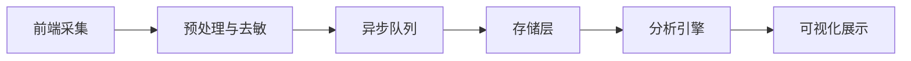
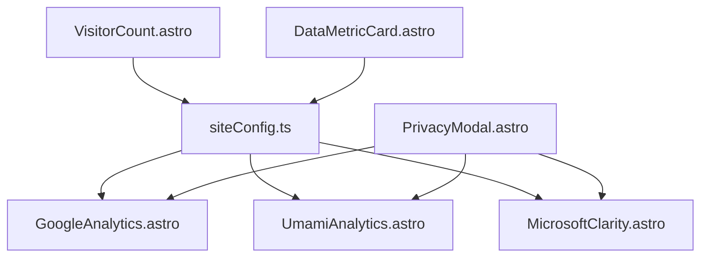

# 数据分析与监控

<cite>
**本文引用的文件**
- [GoogleAnalytics.astro](file://src/components/analytics/GoogleAnalytics.astro)
- [UmamiAnalytics.astro](file://src/components/analytics/UmamiAnalytics.astro)
- [MicrosoftClarity.astro](file://src/components/analytics/MicrosoftClarity.astro)
- [VisitorCount.astro](file://src/components/common/VisitorCount.astro)
- [PrivacyModal.astro](file://src/components/features/PrivacyModal.astro)
- [privacy.md](file://src/content/spec/privacy.md)
- [siteConfig.ts](file://src/config/siteConfig.ts)
- [index.ts](file://src/config/index.ts)
- [Layout.astro](file://src/layouts/Layout.astro)
- [HomeDataLayer.astro](file://src/components/layout/HomeDataLayer.astro)
- [DataMetricCard.astro](file://src/components/features/DataMetricCard.astro)
- [analyticsConfig.ts](file://src/config/analyticsConfig.ts)
- [README.md](file://README.md)
</cite>

## 目录
1. [简介](#简介)
2. [项目结构](#项目结构)
3. [核心组件](#核心组件)
4. [架构总览](#架构总览)
5. [详细组件分析](#详细组件分析)
6. [依赖关系分析](#依赖关系分析)
7. [性能考量](#性能考量)
8. [故障排查指南](#故障排查指南)
9. [结论](#结论)
10. [附录](#附录)

## 简介
本文件面向Firefly-Mod博客的数据分析与监控体系，系统性梳理第三方分析服务（Google Analytics、Umami、Microsoft Clarity）的集成方式与配置要点；解释访问统计、用户行为分析与转化率监控的实现思路；阐述隐私保护（GDPR合规、数据匿名化、用户同意管理）的落地实践；介绍性能监控（页面加载时间、资源使用、错误日志）的采集与呈现；给出自定义分析指标（事件跟踪、用户属性、会话管理）的扩展方法；说明数据分析的可视化展示与实时监控面板；最后覆盖数据存储与处理的架构设计（数据管道、缓存策略、离线处理）以及分析数据的导出、备份与迁移方案。

## 项目结构
该项目采用Astro+Svelte混合技术栈，数据分析与监控相关能力主要分布在以下位置：
- 分析服务组件：位于src/components/analytics目录，分别封装了Google Analytics、Umami、Microsoft Clarity的前端脚本注入与初始化逻辑
- 隐私与同意：通过PrivacyModal组件与隐私声明内容页共同实现用户同意流程
- 访客计数：VisitorCount组件用于展示站点访客统计
- 配置中心：siteConfig.ts与analyticsConfig.ts集中管理站点与分析相关的配置项
- 页面布局：Layout.astro与HomeDataLayer.astro负责在页面层注入必要的上下文与数据层脚本
- 可视化组件：DataMetricCard.astro用于展示关键指标卡片

**图示来源**
- [GoogleAnalytics.astro](file://src/components/analytics/GoogleAnalytics.astro)
- [UmamiAnalytics.astro](file://src/components/analytics/UmamiAnalytics.astro)
- [MicrosoftClarity.astro](file://src/components/analytics/MicrosoftClarity.astro)
- [PrivacyModal.astro](file://src/components/features/PrivacyModal.astro)
- [privacy.md](file://src/content/spec/privacy.md)
- [VisitorCount.astro](file://src/components/common/VisitorCount.astro)
- [siteConfig.ts](file://src/config/siteConfig.ts)
- [analyticsConfig.ts](file://src/config/analyticsConfig.ts)
- [Layout.astro](file://src/layouts/Layout.astro)
- [HomeDataLayer.astro](file://src/components/layout/HomeDataLayer.astro)
- [DataMetricCard.astro](file://src/components/features/DataMetricCard.astro)

**章节来源**
- [README.md](file://README.md)
- [siteConfig.ts](file://src/config/siteConfig.ts)
- [index.ts](file://src/config/index.ts)

## 核心组件
- 第三方分析服务组件
  - GoogleAnalytics.astro：封装GA脚本注入与基础初始化参数
  - UmamiAnalytics.astro：封装Umami脚本注入与站点标识
  - MicrosoftClarity.astro：封装Clarity脚本注入与站点标识
- 隐私与同意
  - PrivacyModal.astro：弹窗式隐私设置与同意管理入口
  - privacy.md：站点隐私政策与数据处理说明
- 访客统计
  - VisitorCount.astro：展示访客数量或在线人数等指标
- 配置中心
  - siteConfig.ts：站点通用配置（含分析服务开关与参数）
  - analyticsConfig.ts：分析服务专属配置（如服务端地址、站点ID等）
- 页面布局与数据层
  - Layout.astro：全局布局，承载分析脚本与数据层容器
  - HomeDataLayer.astro：首页数据层脚本注入，便于页面级事件上报
- 可视化组件
  - DataMetricCard.astro：关键指标卡片，支持从后端或本地状态获取数据

**章节来源**
- [GoogleAnalytics.astro](file://src/components/analytics/GoogleAnalytics.astro)
- [UmamiAnalytics.astro](file://src/components/analytics/UmamiAnalytics.astro)
- [MicrosoftClarity.astro](file://src/components/analytics/MicrosoftClarity.astro)
- [PrivacyModal.astro](file://src/components/features/PrivacyModal.astro)
- [privacy.md](file://src/content/spec/privacy.md)
- [VisitorCount.astro](file://src/components/common/VisitorCount.astro)
- [siteConfig.ts](file://src/config/siteConfig.ts)
- [analyticsConfig.ts](file://src/config/analyticsConfig.ts)
- [Layout.astro](file://src/layouts/Layout.astro)
- [HomeDataLayer.astro](file://src/components/layout/HomeDataLayer.astro)
- [DataMetricCard.astro](file://src/components/features/DataMetricCard.astro)

## 架构总览
整体架构围绕“配置驱动 + 组件化注入 + 页面层脚本 + 可视化展示”展开。站点通过配置中心统一开启/关闭分析服务，并在页面布局中按需注入对应脚本。用户同意与隐私设置由隐私模态框与隐私政策内容页协同完成。访客统计与关键指标通过独立组件进行展示，支持从后端API或本地状态获取数据。

**图示来源**
- [siteConfig.ts](file://src/config/siteConfig.ts)
- [analyticsConfig.ts](file://src/config/analyticsConfig.ts)
- [Layout.astro](file://src/layouts/Layout.astro)
- [HomeDataLayer.astro](file://src/components/layout/HomeDataLayer.astro)
- [GoogleAnalytics.astro](file://src/components/analytics/GoogleAnalytics.astro)
- [UmamiAnalytics.astro](file://src/components/analytics/UmamiAnalytics.astro)
- [MicrosoftClarity.astro](file://src/components/analytics/MicrosoftClarity.astro)
- [PrivacyModal.astro](file://src/components/features/PrivacyModal.astro)
- [privacy.md](file://src/content/spec/privacy.md)
- [VisitorCount.astro](file://src/components/common/VisitorCount.astro)
- [DataMetricCard.astro](file://src/components/features/DataMetricCard.astro)

## 详细组件分析

### Google Analytics组件分析
- 组件职责
  - 在页面头部注入GA脚本
  - 初始化基础参数（如站点ID、用户维度等）
  - 提供页面浏览跟踪与事件上报接口
- 关键实现点
  - 通过配置中心读取启用开关与参数
  - 在Layout或目标页面中按需引入
  - 支持在页面层脚本中调用初始化与事件上报
- 集成建议
  - 使用配置中心集中管理GA ID与开关
  - 在页面切换时触发页面浏览事件
  - 对重要交互（如按钮点击、下载）进行事件跟踪

**图示来源**
- [Layout.astro](file://src/layouts/Layout.astro)
- [GoogleAnalytics.astro](file://src/components/analytics/GoogleAnalytics.astro)
- [siteConfig.ts](file://src/config/siteConfig.ts)

**章节来源**
- [GoogleAnalytics.astro](file://src/components/analytics/GoogleAnalytics.astro)
- [siteConfig.ts](file://src/config/siteConfig.ts)

### Umami组件分析
- 组件职责
  - 注入Umami脚本并绑定站点标识
  - 自动采集页面浏览与基础行为数据
- 关键实现点
  - 通过配置中心控制是否启用
  - 与隐私设置联动，确保在用户同意后才启用
- 集成建议
  - 在隐私同意通过后再注入脚本
  - 结合页面层脚本进行深度事件上报

**图示来源**
- [PrivacyModal.astro](file://src/components/features/PrivacyModal.astro)
- [UmamiAnalytics.astro](file://src/components/analytics/UmamiAnalytics.astro)
- [siteConfig.ts](file://src/config/siteConfig.ts)

**章节来源**
- [UmamiAnalytics.astro](file://src/components/analytics/UmamiAnalytics.astro)
- [PrivacyModal.astro](file://src/components/features/PrivacyModal.astro)
- [siteConfig.ts](file://src/config/siteConfig.ts)

### Microsoft Clarity组件分析
- 组件职责
  - 注入Clarity脚本并绑定站点标识
  - 支持会话录制与热力图采集
- 关键实现点
  - 严格遵循隐私设置，在用户同意后启用
  - 与隐私模态框联动，提供一键开关
- 集成建议
  - 在隐私同意后延迟注入，避免未授权采集
  - 对敏感区域进行遮罩或排除

**图示来源**
- [PrivacyModal.astro](file://src/components/features/PrivacyModal.astro)
- [MicrosoftClarity.astro](file://src/components/analytics/MicrosoftClarity.astro)
- [siteConfig.ts](file://src/config/siteConfig.ts)

**章节来源**
- [MicrosoftClarity.astro](file://src/components/analytics/MicrosoftClarity.astro)
- [PrivacyModal.astro](file://src/components/features/PrivacyModal.astro)
- [siteConfig.ts](file://src/config/siteConfig.ts)

### 访客统计组件分析
- 组件职责
  - 展示访客数量或在线人数等指标
  - 可通过API或本地状态更新
- 关键实现点
  - 与配置中心联动，决定是否启用
  - 支持定时刷新与手动更新
- 集成建议
  - 优先使用服务端聚合数据，降低前端压力
  - 对异常状态进行降级显示

**图示来源**
- [VisitorCount.astro](file://src/components/common/VisitorCount.astro)
- [siteConfig.ts](file://src/config/siteConfig.ts)

**章节来源**
- [VisitorCount.astro](file://src/components/common/VisitorCount.astro)
- [siteConfig.ts](file://src/config/siteConfig.ts)

### 隐私与同意管理
- 组件与内容
  - PrivacyModal.astro：弹窗式隐私设置入口，允许用户选择分析类型与同意范围
  - privacy.md：站点隐私政策，明确数据收集目的、范围与用户权利
- 实施要点
  - 在用户首次访问时弹出同意弹窗
  - 不同分析服务的启用与否应可单独控制
  - 提供撤回同意与重新配置的入口
- 合规建议
  - 明确数据处理目的与法律依据
  - 提供数据访问、更正、删除与限制处理的权利说明
  - 对未成年人与特殊群体提供额外保护措施

**图示来源**
- [PrivacyModal.astro](file://src/components/features/PrivacyModal.astro)
- [privacy.md](file://src/content/spec/privacy.md)
- [GoogleAnalytics.astro](file://src/components/analytics/GoogleAnalytics.astro)
- [UmamiAnalytics.astro](file://src/components/analytics/UmamiAnalytics.astro)
- [MicrosoftClarity.astro](file://src/components/analytics/MicrosoftClarity.astro)

**章节来源**
- [PrivacyModal.astro](file://src/components/features/PrivacyModal.astro)
- [privacy.md](file://src/content/spec/privacy.md)

### 性能监控
- 监控维度
  - 页面加载时间（TTFB、FCP、LCP、INP等）
  - 资源使用情况（CPU、内存、网络请求）
  - 错误日志收集（前端异常、网络失败）
- 实现方式
  - 利用浏览器性能API与Web Vitals库采集指标
  - 通过分析服务的事件上报能力传递性能数据
  - 在页面层脚本中埋点，结合隐私设置控制采集范围
- 建议
  - 对高风险指标进行阈值告警
  - 区分不同设备与网络环境的基线
  - 定期归档与趋势分析

[本节为通用指导，不直接分析具体文件，故无章节来源]

### 自定义分析指标
- 事件跟踪
  - 页面级事件：页面浏览、路由切换
  - 交互级事件：按钮点击、表单提交、视频播放
  - 自定义事件：购买转化、注册完成、内容分享
- 用户属性
  - 通过配置中心或Cookie持久化用户标识
  - 区分访客与登录用户，设置不同属性域
- 会话管理
  - 基于Cookie或LocalStorage维护会话生命周期
  - 结合隐私设置，仅在同意范围内记录会话信息

[本节为通用指导，不直接分析具体文件，故无章节来源]

### 数据可视化与实时监控
- 指标卡片
  - 使用DataMetricCard.astro展示关键指标
  - 支持从后端API或本地状态获取数据
- 图表与报表
  - 结合第三方可视化库（如ECharts、Chart.js）生成图表
  - 支持时间序列、分布统计与对比分析
- 实时监控面板
  - 通过WebSocket或轮询获取实时数据
  - 提供告警与通知机制

**章节来源**
- [DataMetricCard.astro](file://src/components/features/DataMetricCard.astro)

### 数据存储与处理架构
- 数据管道
  - 前端采集 → 预处理（去敏、聚合）→ 传输（异步队列）→ 存储（时序/明细）
- 缓存策略
  - 本地缓存短期指标，服务端缓存长期趋势
  - 对敏感数据进行本地加密或匿名化
- 离线处理
  - 基于Service Worker或IndexedDB缓存离线事件
  - 在网络恢复后批量上报

[本节为通用指导，不直接分析具体文件，故无章节来源]

### 数据导出、备份与迁移
- 导出
  - 支持按日/周/月导出原始与聚合数据
  - 提供CSV/JSON格式，满足审计与复算需求
- 备份
  - 定期备份存储层数据与配置
  - 多副本与异地容灾策略
- 迁移
  - 分析服务切换时的数据迁移方案
  - 保持指标口径一致与历史连续性

[本节为通用指导，不直接分析具体文件，故无章节来源]

## 依赖关系分析
- 组件耦合
  - 分析服务组件依赖配置中心以决定启用与参数
  - 隐私模态框与隐私政策内容页共同决定是否注入分析脚本
  - 访客统计与指标卡片依赖配置中心与后端API
- 外部依赖
  - Google Analytics、Umami、Microsoft Clarity的SDK与服务端
  - 可视化库与性能监控库
- 接口契约
  - 统一的事件上报接口，便于新增分析服务
  - 隐私开关的统一状态管理

**图示来源**
- [siteConfig.ts](file://src/config/siteConfig.ts)
- [GoogleAnalytics.astro](file://src/components/analytics/GoogleAnalytics.astro)
- [UmamiAnalytics.astro](file://src/components/analytics/UmamiAnalytics.astro)
- [MicrosoftClarity.astro](file://src/components/analytics/MicrosoftClarity.astro)
- [PrivacyModal.astro](file://src/components/features/PrivacyModal.astro)
- [VisitorCount.astro](file://src/components/common/VisitorCount.astro)
- [DataMetricCard.astro](file://src/components/features/DataMetricCard.astro)

**章节来源**
- [siteConfig.ts](file://src/config/siteConfig.ts)
- [index.ts](file://src/config/index.ts)

## 性能考量
- 脚本注入时机
  - 将分析脚本置于非阻塞位置，避免影响首屏渲染
  - 在用户同意后再注入，减少不必要的网络请求
- 数据上报频率
  - 合理设置采样率与批量上报间隔
  - 对高频事件进行聚合与去重
- 可视化性能
  - 指标卡片按需懒加载，避免一次性渲染过多图表
  - 使用虚拟滚动与分页展示大量数据

[本节为通用指导，不直接分析具体文件，故无章节来源]

## 故障排查指南
- 分析服务未生效
  - 检查配置中心中的启用开关与参数是否正确
  - 确认隐私同意状态是否允许注入脚本
- 数据缺失或延迟
  - 核对事件上报接口是否被调用
  - 检查网络环境与跨域策略
- 隐私问题
  - 确认隐私弹窗逻辑与用户选择一致
  - 检查是否在未同意状态下采集敏感数据

**章节来源**
- [siteConfig.ts](file://src/config/siteConfig.ts)
- [PrivacyModal.astro](file://src/components/features/PrivacyModal.astro)
- [privacy.md](file://src/content/spec/privacy.md)

## 结论
Firefly-Mod博客通过配置驱动与组件化注入的方式，实现了对Google Analytics、Umami、Microsoft Clarity等第三方分析服务的灵活集成。配合隐私与同意管理、访客统计与指标卡片展示，构建了完整的数据分析与监控体系。建议在后续迭代中进一步完善性能监控、自定义指标与数据可视化能力，并持续优化隐私合规与数据安全策略。

## 附录
- 配置清单
  - 分析服务开关与参数
  - 隐私同意策略
  - 指标展示与刷新策略
- 最佳实践
  - 在用户同意后注入分析脚本
  - 对敏感数据进行匿名化与去敏
  - 定期评估与优化数据管道与可视化性能

**章节来源**
- [siteConfig.ts](file://src/config/siteConfig.ts)
- [analyticsConfig.ts](file://src/config/analyticsConfig.ts)
- [privacy.md](file://src/content/spec/privacy.md)