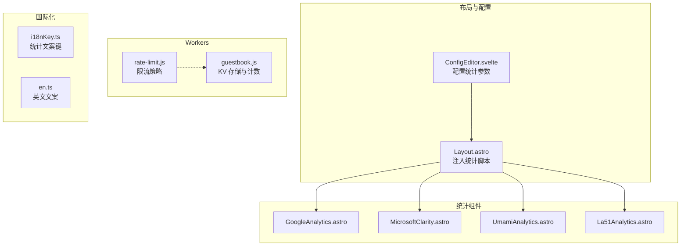
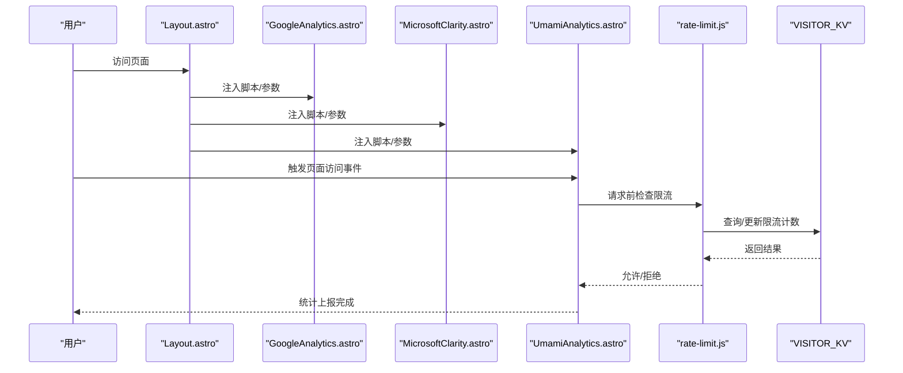
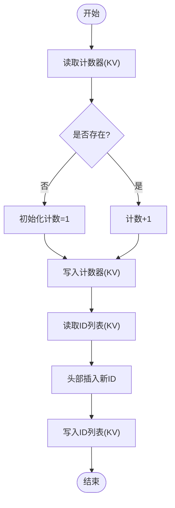
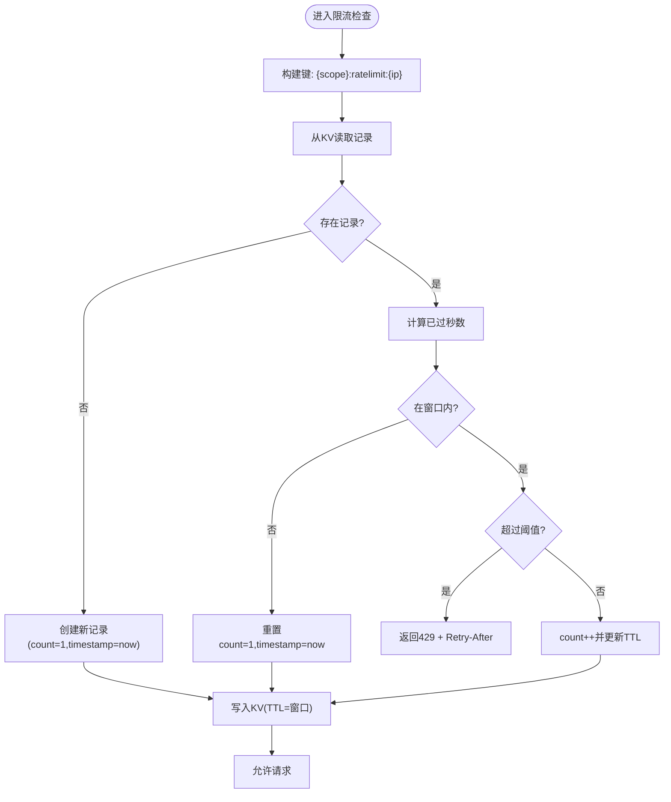
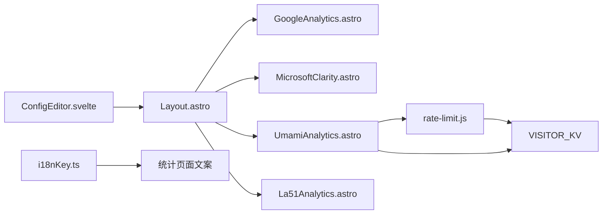

# 访问统计

<cite>
**本文引用的文件**
- [Layout.astro](file://src/layouts/Layout.astro)
- [ConfigEditor.svelte](file://src/components/edit/ConfigEditor.svelte)
- [GoogleAnalytics.astro](file://src/components/analytics/GoogleAnalytics.astro)
- [MicrosoftClarity.astro](file://src/components/analytics/MicrosoftClarity.astro)
- [UmamiAnalytics.astro](file://src/components/analytics/UmamiAnalytics.astro)
- [La51Analytics.astro](file://src/components/analytics/La51Analytics.astro)
- [rate-limit.js](file://src/workers/utils/rate-limit.js)
- [guestbook.js](file://src/workers/guestbook.js)
- [i18nKey.ts](file://src/i18n/i18nKey.ts)
- [en.ts](file://src/i18n/languages/en.ts)
</cite>

## 目录
1. [引言](#引言)
2. [项目结构](#项目结构)
3. [核心组件](#核心组件)
4. [架构总览](#架构总览)
5. [详细组件分析](#详细组件分析)
6. [依赖关系分析](#依赖关系分析)
7. [性能考虑](#性能考虑)
8. [故障排查指南](#故障排查指南)
9. [结论](#结论)
10. [附录](#附录)

## 引言
本文件系统性梳理该博客项目的访问统计能力，重点覆盖以下方面：
- 页面浏览量统计与访客计数器的工作原理及数据持久化策略
- 用户行为跟踪（页面访问、停留时间、跳出率）的实现思路
- 数据采集流程（请求拦截、聚合与存储优化）的设计要点
- 可视化展示方案（实时面板、历史趋势、地理分布）的落地建议
- 隐私保护措施（匿名化、IP处理、用户同意管理）的实践路径
- 性能优化策略（缓存、批量更新、异步处理）的工程化手段

## 项目结构
该项目采用 Astro + Svelte 的前端技术栈，访问统计相关能力主要通过以下模块协同实现：
- 布局层注入第三方统计脚本（Google Analytics、Microsoft Clarity、Umami、La51）
- 配置编辑器集中管理统计服务参数
- Workers 层负责 KV 存储与限流控制
- 国际化层提供统计相关文案占位

**图表来源**
- [Layout.astro:71-97](file://src/layouts/Layout.astro#L71-L97)
- [ConfigEditor.svelte:654-682](file://src/components/edit/ConfigEditor.svelte#L654-L682)
- [GoogleAnalytics.astro](file://src/components/analytics/GoogleAnalytics.astro)
- [MicrosoftClarity.astro](file://src/components/analytics/MicrosoftClarity.astro)
- [UmamiAnalytics.astro](file://src/components/analytics/UmamiAnalytics.astro)
- [La51Analytics.astro](file://src/components/analytics/La51Analytics.astro)
- [rate-limit.js:1-45](file://src/workers/utils/rate-limit.js#L1-L45)
- [guestbook.js:108-200](file://src/workers/guestbook.js#L108-L200)
- [i18nKey.ts:327-332](file://src/i18n/i18nKey.ts#L327-L332)
- [en.ts:281-322](file://src/i18n/languages/en.ts#L281-L322)

**章节来源**
- [Layout.astro:71-97](file://src/layouts/Layout.astro#L71-L97)
- [ConfigEditor.svelte:654-682](file://src/components/edit/ConfigEditor.svelte#L654-L682)

## 核心组件
- 布局层注入统计脚本：根据站点配置动态加载各统计服务脚本，并进行域名预连接以提升首屏性能。
- 统计组件封装：为每种统计服务提供独立的 Astro 组件，统一入口参数与生命周期。
- 配置编辑器：集中维护统计 ID、脚本地址、是否追踪出站链接、是否收集 Web Vitals、会话回放等开关与参数。
- Workers 限流与计数：基于 KV 存储实现按 IP 的速率限制与访客计数器，保障后端稳定性。

**章节来源**
- [Layout.astro:71-97](file://src/layouts/Layout.astro#L71-L97)
- [ConfigEditor.svelte:654-682](file://src/components/edit/ConfigEditor.svelte#L654-L682)
- [rate-limit.js:1-45](file://src/workers/utils/rate-limit.js#L1-L45)
- [guestbook.js:108-200](file://src/workers/guestbook.js#L108-L200)

## 架构总览
整体架构由“前端注入 + 配置驱动 + Workers 存储”构成，形成从页面到后端的闭环统计链路。

**图表来源**
- [Layout.astro:71-97](file://src/layouts/Layout.astro#L71-L97)
- [GoogleAnalytics.astro](file://src/components/analytics/GoogleAnalytics.astro)
- [MicrosoftClarity.astro](file://src/components/analytics/MicrosoftClarity.astro)
- [UmamiAnalytics.astro](file://src/components/analytics/UmamiAnalytics.astro)
- [rate-limit.js:8-45](file://src/workers/utils/rate-limit.js#L8-L45)
- [guestbook.js:118-133](file://src/workers/guestbook.js#L118-L133)

## 详细组件分析

### 布局层注入与预连接
- 动态注入逻辑：根据站点配置决定是否加载 Google Analytics、Microsoft Clarity、Umami、La51 等脚本。
- 预连接策略：对统计域名执行 preconnect，降低 DNS 解析与握手延迟，提升首屏性能。
- 参数透传：将网站 ID、脚本地址、是否追踪出站链接、是否收集 Web Vitals、会话回放参数等传递给对应组件。

**章节来源**
- [Layout.astro:71-97](file://src/layouts/Layout.astro#L71-L97)

### 配置编辑器与统计参数
- 集中式配置：在配置编辑器中设置各统计服务的 ID、脚本地址、功能开关与回放参数。
- 参数示例：包含网站 ID、分享 ID、脚本 URL、是否追踪出站链接、是否收集 Web Vitals、会话回放开关、采样率、遮罩级别、最大时长、排除选择器等。
- 配置变更生效：修改后由布局层重新注入脚本，确保参数即时生效。

**章节来源**
- [ConfigEditor.svelte:654-682](file://src/components/edit/ConfigEditor.svelte#L654-L682)

### 统计组件封装
- Google Analytics 组件：负责加载 GA 脚本并初始化。
- Microsoft Clarity 组件：负责加载 Clarity 脚本并初始化。
- Umami 组件：负责加载 Umami 脚本并初始化，支持出站链接追踪、Web Vitals 收集与会话回放。
- La51 组件：负责加载 La51 脚本并初始化。

上述组件均通过布局层统一注入，参数来自站点配置。

**章节来源**
- [GoogleAnalytics.astro](file://src/components/analytics/GoogleAnalytics.astro)
- [MicrosoftClarity.astro](file://src/components/analytics/MicrosoftClarity.astro)
- [UmamiAnalytics.astro](file://src/components/analytics/UmamiAnalytics.astro)
- [La51Analytics.astro](file://src/components/analytics/La51Analytics.astro)

### 访客计数器与数据持久化
- 计数器位置：访客计数器可部署于 Workers 层，使用 KV 存储进行持久化。
- KV 键设计：例如“guestbook:counter”用于全局计数；“guestbook:msg:{id}”用于消息项存储；“guestbook:list”用于消息 ID 列表。
- 更新策略：每次新增访客或内容项时原子性更新计数与列表，保证一致性。
- 读写路径：读取计数器值用于前端展示；写入计数器值用于增量统计。

**图表来源**
- [guestbook.js:150-171](file://src/workers/guestbook.js#L150-L171)

**章节来源**
- [guestbook.js:108-200](file://src/workers/guestbook.js#L108-L200)

### 限流与防刷策略
- 限流维度：按 IP 与作用域（如 guestbook、投票）分别限流。
- 时间窗口与阈值：默认窗口为 60 秒，阈值按场景设定（如访客留言默认 5 次/分钟，投票 30 次/分钟）。
- KV 存储：记录每个 IP 在当前窗口内的请求次数与时间戳，到期自动过期。
- 响应头：当触发限流时返回 429 并携带 Retry-After 头，指导客户端重试时机。

**图表来源**
- [rate-limit.js:8-45](file://src/workers/utils/rate-limit.js#L8-L45)

**章节来源**
- [rate-limit.js:1-45](file://src/workers/utils/rate-limit.js#L1-L45)
- [guestbook.js:118-133](file://src/workers/guestbook.js#L118-L133)

### 用户行为跟踪（页面访问、停留时间、跳出率）
- 页面访问：由统计组件在页面加载时上报页面访问事件，结合路由信息与参数实现。
- 停留时间：可通过页面可见性 API 或自定义埋点在页面卸载/切换时上报停留时长。
- 跳出率：基于单一页面会话内是否发生后续导航计算，统计组件可配合会话回放与 Web Vitals 收集辅助分析。
- 出站链接追踪：可在统计组件中开启出站链接追踪，便于分析用户外链行为。

注：以上为通用实现思路，具体参数与开关由配置编辑器与统计组件共同决定。

**章节来源**
- [ConfigEditor.svelte:654-682](file://src/components/edit/ConfigEditor.svelte#L654-L682)
- [UmamiAnalytics.astro](file://src/components/analytics/UmamiAnalytics.astro)

### 数据采集流程（拦截、聚合与存储优化）
- 请求拦截：在 Workers 中对特定接口进行限流与校验，避免重复提交与恶意刷量。
- 数据聚合：将分散的访问事件按时间窗口（如分钟/小时）聚合，减少存储压力。
- 存储优化：利用 KV 的 TTL 自动过期特性清理过期数据；对热点键采用更短过期时间平衡一致性与成本。

**章节来源**
- [rate-limit.js:1-45](file://src/workers/utils/rate-limit.js#L1-L45)
- [guestbook.js:108-200](file://src/workers/guestbook.js#L108-L200)

### 可视化展示方案
- 实时统计面板：基于 KV 中的计数器与近期列表，前端定时拉取最新数据并渲染。
- 历史趋势图表：将聚合后的数据按天/周/月生成趋势，支持折线图与柱状图。
- 地理分布分析：若统计组件支持地理位置上报，可叠加热力图或散点图展示访客来源。
- 文案与占位：国际化层提供“统计页面开发中”等文案占位，便于后续完善。

**章节来源**
- [i18nKey.ts:327-332](file://src/i18n/i18nKey.ts#L327-L332)
- [en.ts:281-322](file://src/i18n/languages/en.ts#L281-L322)

### 隐私保护措施
- 数据匿名化：仅上报必要维度（如页面路径、设备类型），避免敏感字段。
- IP 处理：优先使用代理/CDN 提供的匿名化 IP 头部；若不可用则不记录 IP。
- 用户同意管理：在统计组件中提供开关，允许用户关闭追踪；在界面中提供隐私设置入口。
- 会话回放与遮罩：通过会话回放的遮罩级别与采样率控制隐私风险。

**章节来源**
- [ConfigEditor.svelte:654-682](file://src/components/edit/ConfigEditor.svelte#L654-L682)
- [UmamiAnalytics.astro](file://src/components/analytics/UmamiAnalytics.astro)

### 性能优化策略
- 缓存机制：对静态配置与常用统计数据进行缓存，减少 KV 读取次数。
- 批量更新：将多个事件合并为批次写入，降低 KV 写入开销。
- 异步处理：在 Workers 中采用异步写入与后台任务，避免阻塞主请求链路。
- 预连接与懒加载：对统计脚本进行预连接与按需加载，减少对首屏的影响。

**章节来源**
- [Layout.astro:71-97](file://src/layouts/Layout.astro#L71-L97)
- [rate-limit.js:1-45](file://src/workers/utils/rate-limit.js#L1-L45)
- [guestbook.js:108-200](file://src/workers/guestbook.js#L108-L200)

## 依赖关系分析
- 布局层依赖配置编辑器提供的站点配置，动态注入统计组件。
- 统计组件依赖站点配置中的 ID、脚本地址与功能开关。
- Workers 依赖 KV 存储与限流工具，保障数据一致性与系统稳定。
- 国际化层为统计页面提供文案支持。

**图表来源**
- [ConfigEditor.svelte:654-682](file://src/components/edit/ConfigEditor.svelte#L654-L682)
- [Layout.astro:71-97](file://src/layouts/Layout.astro#L71-L97)
- [GoogleAnalytics.astro](file://src/components/analytics/GoogleAnalytics.astro)
- [MicrosoftClarity.astro](file://src/components/analytics/MicrosoftClarity.astro)
- [UmamiAnalytics.astro](file://src/components/analytics/UmamiAnalytics.astro)
- [La51Analytics.astro](file://src/components/analytics/La51Analytics.astro)
- [rate-limit.js:1-45](file://src/workers/utils/rate-limit.js#L1-L45)
- [i18nKey.ts:327-332](file://src/i18n/i18nKey.ts#L327-L332)

**章节来源**
- [Layout.astro:71-97](file://src/layouts/Layout.astro#L71-L97)
- [ConfigEditor.svelte:654-682](file://src/components/edit/ConfigEditor.svelte#L654-L682)
- [rate-limit.js:1-45](file://src/workers/utils/rate-limit.js#L1-L45)

## 性能考虑
- 首屏性能：通过 preconnect 与按需加载降低统计脚本对首屏的影响。
- 后端吞吐：限流与 KV TTL 控制请求峰值与存储膨胀。
- 数据聚合：按时间窗口聚合事件，减少写放大与查询复杂度。
- 异步写入：将非关键路径的统计写入异步化，避免阻塞主业务链路。

[本节为通用指导，无需列出具体文件来源]

## 故障排查指南
- 统计无数据：确认站点配置中统计 ID 与脚本地址正确，且布局层已注入对应组件。
- 限流频繁：检查限流窗口与阈值设置，适当提高阈值或延长窗口；关注客户端 Retry-After 头。
- KV 写入失败：确认 Workers 绑定的 KV 名称与权限，检查 TTL 设置与键名格式。
- 隐私合规问题：核对会话回放与 Web Vitals 开关，确保遮罩级别与采样率符合要求。

**章节来源**
- [Layout.astro:71-97](file://src/layouts/Layout.astro#L71-L97)
- [ConfigEditor.svelte:654-682](file://src/components/edit/ConfigEditor.svelte#L654-L682)
- [rate-limit.js:1-45](file://src/workers/utils/rate-limit.js#L1-L45)
- [guestbook.js:108-200](file://src/workers/guestbook.js#L108-L200)

## 结论
该博客项目的访问统计体系以“配置驱动 + 组件封装 + Workers 存储”为核心，既满足多平台统计接入，又通过限流与 KV 持久化保障系统稳定。建议在后续迭代中完善可视化面板与隐私策略，持续优化性能与用户体验。

[本节为总结性内容，无需列出具体文件来源]

## 附录
- 统计页面文案键：提供“统计页面开发中”等占位文案，便于后续扩展。
- 英文文案：补充英文语境下的统计相关文案，提升国际化体验。

**章节来源**
- [i18nKey.ts:327-332](file://src/i18n/i18nKey.ts#L327-L332)
- [en.ts:281-322](file://src/i18n/languages/en.ts#L281-L322)