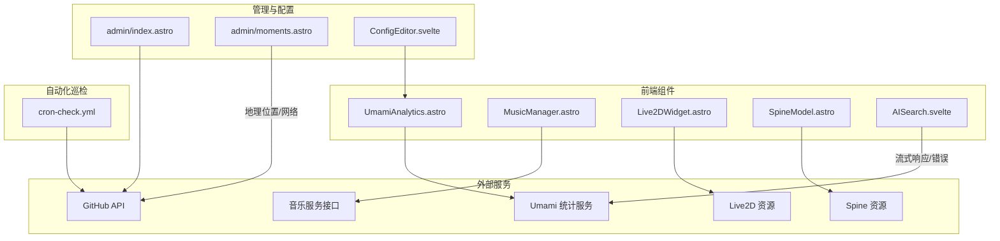
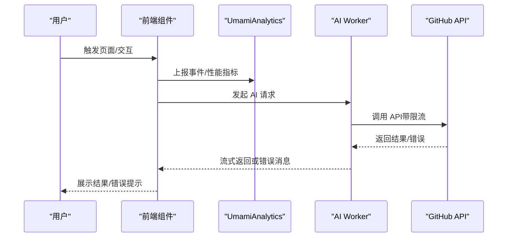
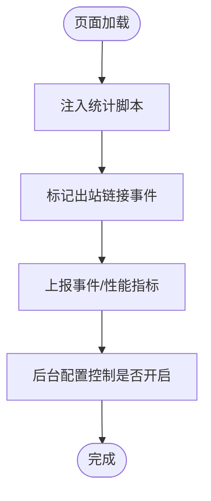
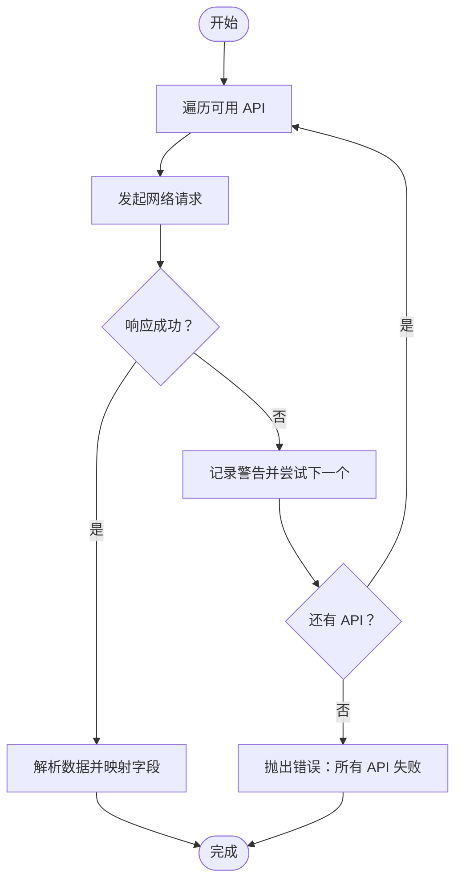
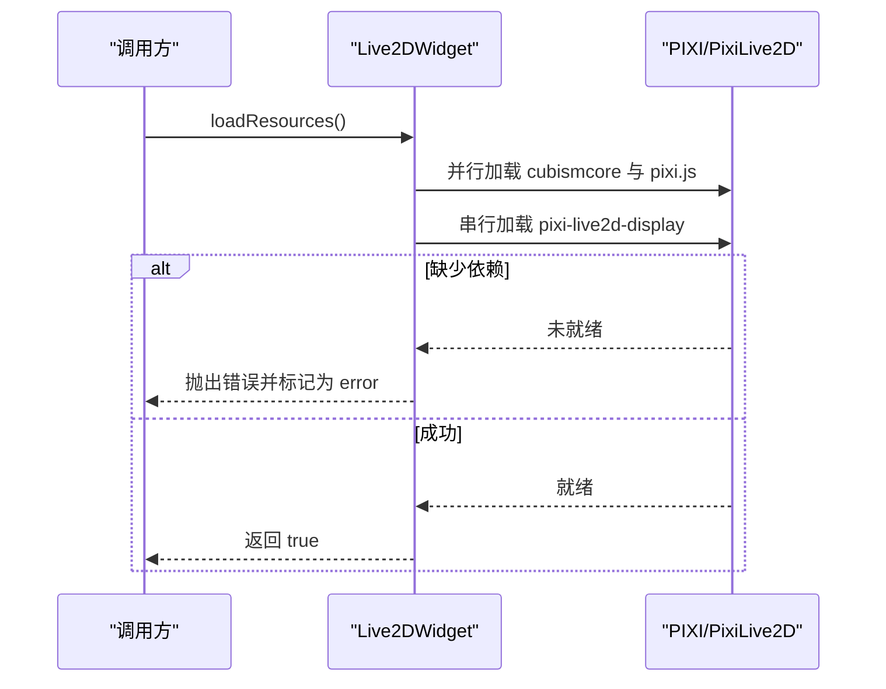
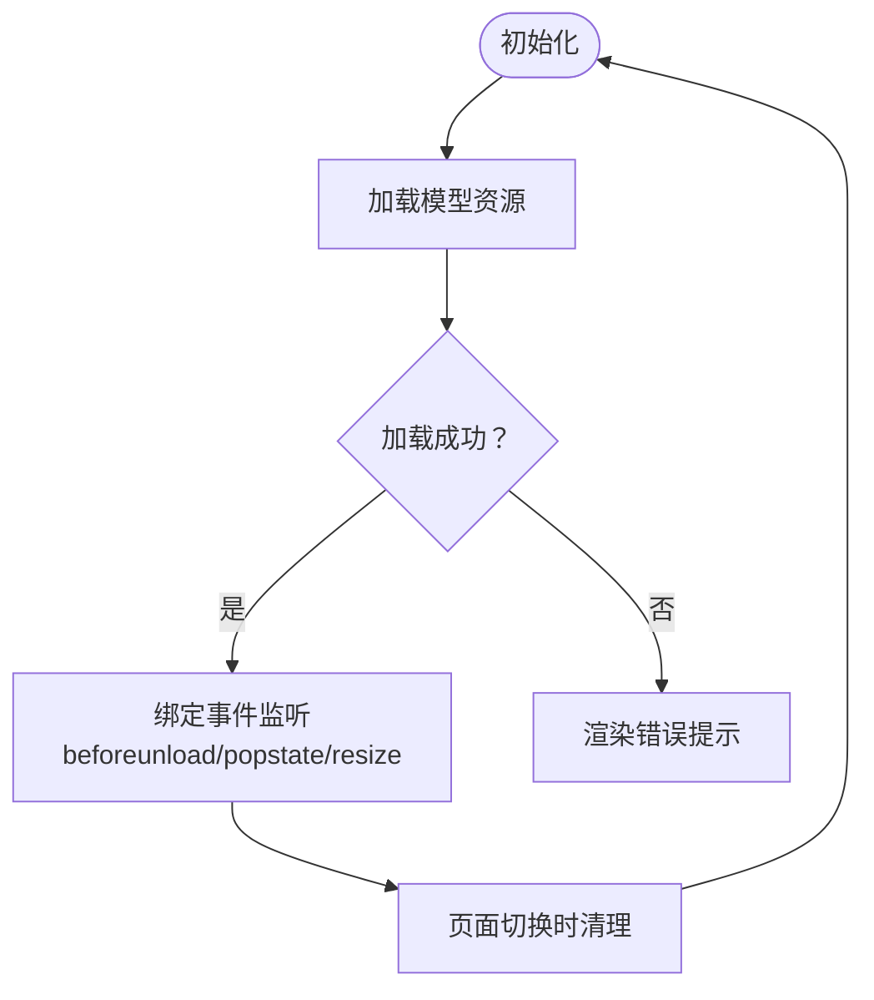
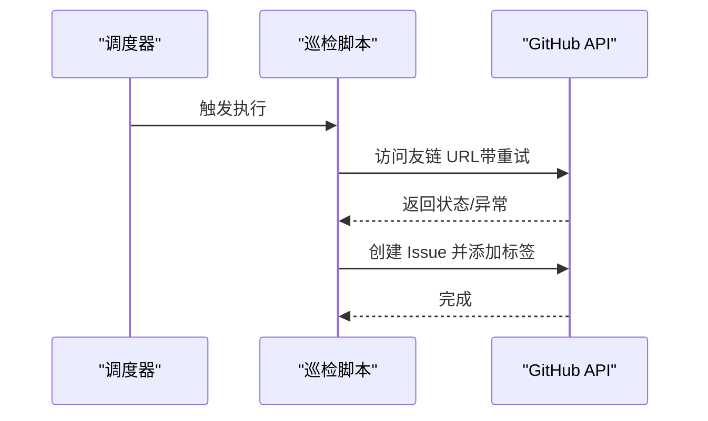
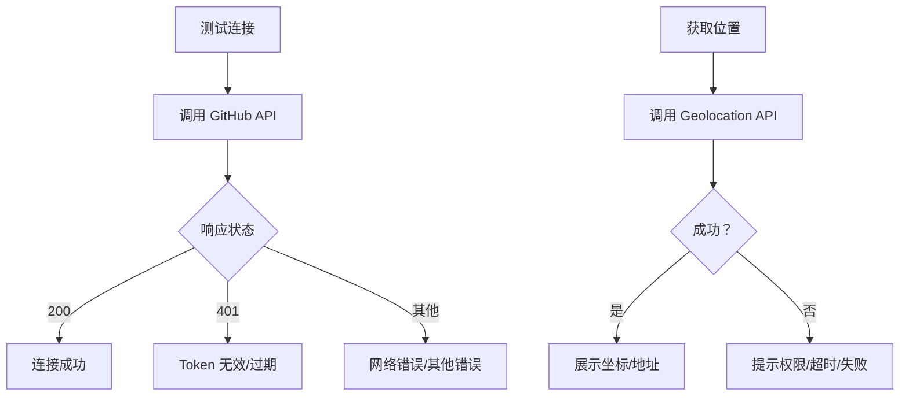
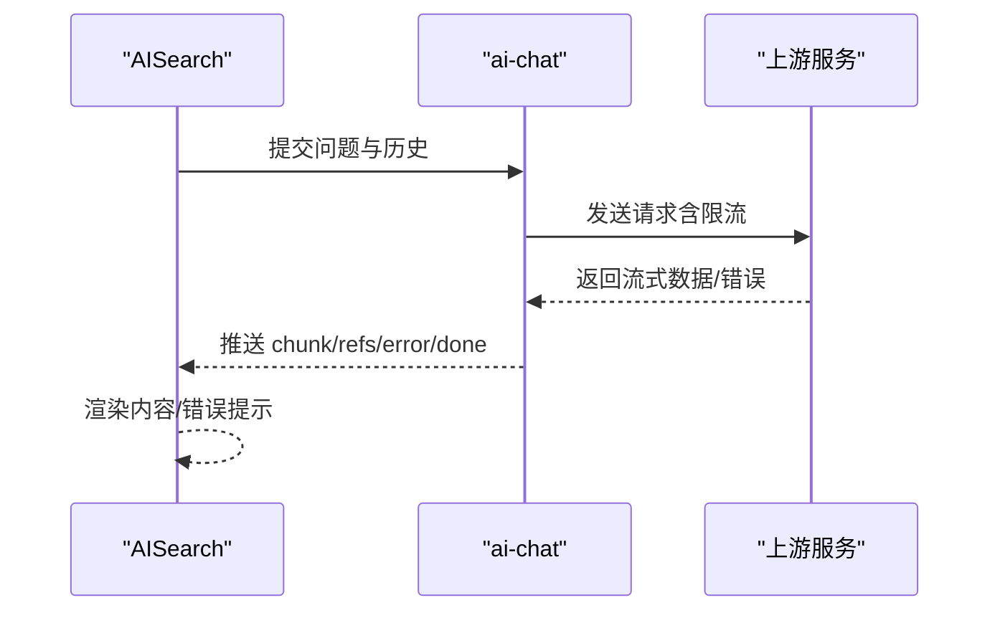
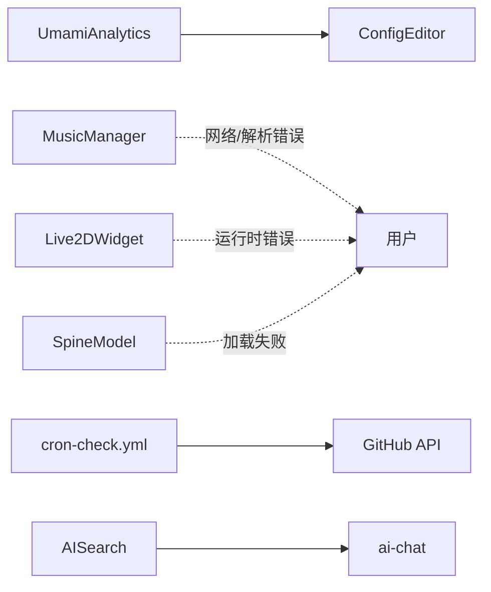

# 错误追踪

<cite>
**本文引用的文件**
- [src/components/analytics/UmamiAnalytics.astro](file://src/components/analytics/UmamiAnalytics.astro)
- [src/components/features/MusicManager.astro](file://src/components/features/MusicManager.astro)
- [src/components/features/Live2DWidget.astro](file://src/components/features/Live2DWidget.astro)
- [src/components/features/SpineModel.astro](file://src/components/features/SpineModel.astro)
- [.github/workflows/cron-check.yml](file://.github/workflows/cron-check.yml)
- [src/pages/admin/index.astro](file://src/pages/admin/index.astro)
- [src/pages/admin/moments.astro](file://src/pages/admin/moments.astro)
- [src/components/edit/ConfigEditor.svelte](file://src/components/edit/ConfigEditor.svelte)
- [src/components/controls/AISearch.svelte](file://src/components/controls/AISearch.svelte)
- [src/workers/ai-chat.js](file://src/workers/ai-chat.js)
- [public/assets/js/marked.min.js](file://public/assets/js/marked.min.js)
</cite>

## 目录
1. [简介](#简介)
2. [项目结构](#项目结构)
3. [核心组件](#核心组件)
4. [架构总览](#架构总览)
5. [详细组件分析](#详细组件分析)
6. [依赖分析](#依赖分析)
7. [性能考虑](#性能考虑)
8. [故障排查指南](#故障排查指南)
9. [结论](#结论)
10. [附录](#附录)

## 简介
本文件面向“错误追踪系统”的设计与实现，结合仓库现有能力，系统性阐述前端错误的捕获与上报、错误信息的采集与处理、数据存储与可视化、告警与修复流程等。当前项目具备基础的前端错误捕获、第三方统计埋点、资源加载失败兜底、自动化巡检与报告等能力，可作为构建完整错误追踪体系的起点。

## 项目结构
围绕错误追踪相关的关键目录与文件如下：
- 统计与埋点：src/components/analytics/*.astro（如 UmamiAnalytics）
- 前端错误捕获与资源加载失败处理：src/components/features/*.astro（如 MusicManager、Live2DWidget、SpineModel）
- 自动化巡检与告警：.github/workflows/cron-check.yml
- 管理后台与配置：src/pages/admin/*、src/components/edit/*
- AI 交互与错误反馈：src/components/controls/AISearch.svelte、src/workers/ai-chat.js
- 第三方库错误提示：public/assets/js/marked.min.js

图表来源
- [src/components/analytics/UmamiAnalytics.astro:49-76](file://src/components/analytics/UmamiAnalytics.astro#L49-L76)
- [src/components/features/MusicManager.astro:137-202](file://src/components/features/MusicManager.astro#L137-L202)
- [src/components/features/Live2DWidget.astro:194-223](file://src/components/features/Live2DWidget.astro#L194-L223)
- [src/components/features/SpineModel.astro:408-441](file://src/components/features/SpineModel.astro#L408-L441)
- [.github/workflows/cron-check.yml:1-205](file://.github/workflows/cron-check.yml#L1-L205)
- [src/pages/admin/index.astro:1612-1639](file://src/pages/admin/index.astro#L1612-L1639)
- [src/pages/admin/moments.astro:692-718](file://src/pages/admin/moments.astro#L692-L718)
- [src/components/edit/ConfigEditor.svelte:647-685](file://src/components/edit/ConfigEditor.svelte#L647-L685)
- [src/components/controls/AISearch.svelte:274-325](file://src/components/controls/AISearch.svelte#L274-L325)

章节来源
- [src/components/analytics/UmamiAnalytics.astro:49-76](file://src/components/analytics/UmamiAnalytics.astro#L49-L76)
- [src/components/features/MusicManager.astro:137-202](file://src/components/features/MusicManager.astro#L137-L202)
- [src/components/features/Live2DWidget.astro:194-223](file://src/components/features/Live2DWidget.astro#L194-L223)
- [src/components/features/SpineModel.astro:408-441](file://src/components/features/SpineModel.astro#L408-L441)
- [.github/workflows/cron-check.yml:1-205](file://.github/workflows/cron-check.yml#L1-L205)
- [src/pages/admin/index.astro:1612-1639](file://src/pages/admin/index.astro#L1612-L1639)
- [src/pages/admin/moments.astro:692-718](file://src/pages/admin/moments.astro#L692-L718)
- [src/components/edit/ConfigEditor.svelte:647-685](file://src/components/edit/ConfigEditor.svelte#L647-L685)
- [src/components/controls/AISearch.svelte:274-325](file://src/components/controls/AISearch.svelte#L274-L325)

## 核心组件
- 统计与埋点（Umami）：通过注入脚本与事件标记，实现页面浏览、出站链接点击等行为追踪；支持 Web Vitals 收集与会话回放配置。
- 资源加载失败处理：音乐播放器、Live2D、Spine 等组件在资源加载与网络请求失败时进行降级与状态反馈。
- 自动化巡检：定时对友链进行健康检查，失败时生成 Issue 并标注标签，形成闭环告警。
- 管理与配置：管理员可在后台配置统计参数与开关，便于统一治理。
- AI 交互错误反馈：AI 对话组件在流式响应中接收错误类型消息并展示，提升用户体验。

章节来源
- [src/components/analytics/UmamiAnalytics.astro:49-76](file://src/components/analytics/UmamiAnalytics.astro#L49-L76)
- [src/components/features/MusicManager.astro:137-202](file://src/components/features/MusicManager.astro#L137-L202)
- [src/components/features/Live2DWidget.astro:194-223](file://src/components/features/Live2DWidget.astro#L194-L223)
- [src/components/features/SpineModel.astro:408-441](file://src/components/features/SpineModel.astro#L408-L441)
- [.github/workflows/cron-check.yml:1-205](file://.github/workflows/cron-check.yml#L1-L205)
- [src/components/edit/ConfigEditor.svelte:647-685](file://src/components/edit/ConfigEditor.svelte#L647-L685)
- [src/components/controls/AISearch.svelte:274-325](file://src/components/controls/AISearch.svelte#L274-L325)

## 架构总览
整体以“前端组件 + 管理配置 + 自动化巡检”为主，配合第三方统计服务实现错误与异常的可观测性。

图表来源
- [src/components/analytics/UmamiAnalytics.astro:49-76](file://src/components/analytics/UmamiAnalytics.astro#L49-L76)
- [src/components/controls/AISearch.svelte:274-325](file://src/components/controls/AISearch.svelte#L274-L325)
- [src/workers/ai-chat.js:213-266](file://src/workers/ai-chat.js#L213-L266)
- [src/pages/admin/index.astro:1612-1639](file://src/pages/admin/index.astro#L1612-L1639)

## 详细组件分析

### 统计与埋点（Umami）
- 作用：注入脚本，标记出站链接事件，支持 Web Vitals 与会话回放配置。
- 错误与异常：通过事件上报与性能指标采集，间接暴露前端异常与资源加载问题。
- 配置入口：管理后台配置编辑器中可开启/关闭相关选项。

图表来源
- [src/components/analytics/UmamiAnalytics.astro:49-76](file://src/components/analytics/UmamiAnalytics.astro#L49-L76)
- [src/components/edit/ConfigEditor.svelte:647-685](file://src/components/edit/ConfigEditor.svelte#L647-L685)

章节来源
- [src/components/analytics/UmamiAnalytics.astro:49-76](file://src/components/analytics/UmamiAnalytics.astro#L49-L76)
- [src/components/edit/ConfigEditor.svelte:647-685](file://src/components/edit/ConfigEditor.svelte#L647-L685)

### 音乐播放器（MusicManager）
- 作用：从多个音乐服务接口拉取歌单与歌词，处理网络错误与解析失败。
- 错误与异常：当任一接口失败时记录警告并尝试下一个；全部失败抛出错误。
- 资源加载：歌词文本通过 fetch 获取，失败时降级为空状态。

图表来源
- [src/components/features/MusicManager.astro:137-202](file://src/components/features/MusicManager.astro#L137-L202)

章节来源
- [src/components/features/MusicManager.astro:137-202](file://src/components/features/MusicManager.astro#L137-L202)

### Live2D 小部件（Live2DWidget）
- 作用：并行加载 Live2D 依赖脚本，串行加载最终运行时；失败时记录错误状态。
- 错误与异常：若缺少运行时依赖，抛出错误并进入错误态；后续可重试加载。

图表来源
- [src/components/features/Live2DWidget.astro:194-223](file://src/components/features/Live2DWidget.astro#L194-L223)

章节来源
- [src/components/features/Live2DWidget.astro:194-223](file://src/components/features/Live2DWidget.astro#L194-L223)

### Spine 模型（SpineModel）
- 作用：统一管理事件监听与资源清理；页面切换、前进后退、窗口尺寸变化时更新显示。
- 错误与异常：加载失败时渲染错误提示；通过 AbortController 管理生命周期，避免内存泄漏。

图表来源
- [src/components/features/SpineModel.astro:408-441](file://src/components/features/SpineModel.astro#L408-L441)

章节来源
- [src/components/features/SpineModel.astro:408-441](file://src/components/features/SpineModel.astro#L408-L441)

### 自动化巡检（cron-check.yml）
- 作用：定时巡检友链，失败时生成 Issue 并标注标签，形成闭环告警。
- 错误与异常：对 HTTP 状态码与异常信息进行汇总，输出报告。

图表来源
- [.github/workflows/cron-check.yml:1-205](file://.github/workflows/cron-check.yml#L1-L205)

章节来源
- [.github/workflows/cron-check.yml:1-205](file://.github/workflows/cron-check.yml#L1-L205)

### 管理后台与配置（admin 与 ConfigEditor）
- 作用：提供测试连接、位置获取、配置开关等能力，便于运维与排障。
- 错误与异常：对网络错误与认证失败进行明确提示；地理定位失败给出用户可理解的消息。

图表来源
- [src/pages/admin/index.astro:1612-1639](file://src/pages/admin/index.astro#L1612-L1639)
- [src/pages/admin/moments.astro:692-718](file://src/pages/admin/moments.astro#L692-L718)

章节来源
- [src/pages/admin/index.astro:1612-1639](file://src/pages/admin/index.astro#L1612-L1639)
- [src/pages/admin/moments.astro:692-718](file://src/pages/admin/moments.astro#L692-L718)

### AI 搜索与错误反馈（AISearch 与 ai-chat）
- 作用：流式返回 AI 结果；当上游服务返回错误时，客户端展示错误提示。
- 错误与异常：对非 200 响应解析错误消息；对流式数据解析异常进行容错。

图表来源
- [src/components/controls/AISearch.svelte:274-325](file://src/components/controls/AISearch.svelte#L274-L325)
- [src/workers/ai-chat.js:213-266](file://src/workers/ai-chat.js#L213-L266)

章节来源
- [src/components/controls/AISearch.svelte:274-325](file://src/components/controls/AISearch.svelte#L274-L325)
- [src/workers/ai-chat.js:213-266](file://src/workers/ai-chat.js#L213-L266)

### 第三方库错误提示（marked）
- 作用：在解析异常时输出可读的错误信息，便于定位问题。
- 错误与异常：捕获异常并返回包含错误信息的 HTML 片段。

章节来源
- [public/assets/js/marked.min.js:71-74](file://public/assets/js/marked.min.js#L71-L74)

## 依赖分析
- 组件内聚与耦合
  - UmamiAnalytics 与 ConfigEditor：通过配置项解耦，降低直接依赖。
  - MusicManager、Live2DWidget、SpineModel：均独立处理自身资源加载与错误，耦合度低。
  - cron-check.yml：与 GitHub API 强耦合，但通过工作流抽象隔离业务逻辑。
- 外部依赖
  - 统计服务（Umami）、音乐服务、Live2D/Spine CDN、GitHub API。
- 循环依赖
  - 未发现明显循环依赖；各组件职责清晰。

图表来源
- [src/components/analytics/UmamiAnalytics.astro:49-76](file://src/components/analytics/UmamiAnalytics.astro#L49-L76)
- [src/components/edit/ConfigEditor.svelte:647-685](file://src/components/edit/ConfigEditor.svelte#L647-L685)
- [src/components/features/MusicManager.astro:137-202](file://src/components/features/MusicManager.astro#L137-L202)
- [src/components/features/Live2DWidget.astro:194-223](file://src/components/features/Live2DWidget.astro#L194-L223)
- [src/components/features/SpineModel.astro:408-441](file://src/components/features/SpineModel.astro#L408-L441)
- [.github/workflows/cron-check.yml:1-205](file://.github/workflows/cron-check.yml#L1-L205)
- [src/components/controls/AISearch.svelte:274-325](file://src/components/controls/AISearch.svelte#L274-L325)
- [src/workers/ai-chat.js:213-266](file://src/workers/ai-chat.js#L213-L266)

## 性能考虑
- 资源加载优化
  - 并行加载独立依赖，串行加载依赖关系强的模块，减少总等待时间。
  - 使用 AbortController 在页面切换时及时释放资源，避免内存泄漏。
- 网络请求优化
  - 对重复脚本加载进行去重判断，避免重复请求。
  - 对第三方接口采用重试与降级策略，提升稳定性。
- 统计与回放
  - Web Vitals 与会话回放在移动端可能带来额外开销，建议按需开启与采样。

## 故障排查指南
- 统计埋点问题
  - 检查配置开关与脚本注入时机；确认事件标记是否生效。
- 资源加载失败
  - 查看网络面板与控制台错误；确认 CDN 可达性与跨域设置。
- 友链巡检异常
  - 关注工作流日志中的状态码与异常信息；必要时调整重试策略与超时时间。
- AI 对话错误
  - 检查上游服务可用性与限流配置；关注流式响应解析异常。

章节来源
- [src/components/analytics/UmamiAnalytics.astro:49-76](file://src/components/analytics/UmamiAnalytics.astro#L49-L76)
- [src/components/features/MusicManager.astro:137-202](file://src/components/features/MusicManager.astro#L137-L202)
- [src/components/features/Live2DWidget.astro:194-223](file://src/components/features/Live2DWidget.astro#L194-L223)
- [src/components/features/SpineModel.astro:408-441](file://src/components/features/SpineModel.astro#L408-L441)
- [.github/workflows/cron-check.yml:1-205](file://.github/workflows/cron-check.yml#L1-L205)
- [src/components/controls/AISearch.svelte:274-325](file://src/components/controls/AISearch.svelte#L274-L325)
- [src/workers/ai-chat.js:213-266](file://src/workers/ai-chat.js#L213-L266)

## 结论
当前项目已具备前端错误捕获、资源加载失败处理、自动化巡检与配置管理的基础能力。建议在此基础上引入统一的错误上报通道、结构化日志与分类统计、可视化看板与告警策略，逐步完善错误追踪体系。

## 附录
- 数据采集清单（建议）
  - 时间戳、错误类型、URL、用户代理、页面路径、堆栈摘要、上下文信息（如用户 ID、会话 ID）、设备信息、网络状态。
- 存储与分类（建议）
  - 结构化存储：按天分区、索引错误类型与来源；分类统计：按错误类型、URL、设备、地域聚合。
- 可视化方案（建议）
  - 仪表板：错误趋势、Top N、分布热力图；根因分析：调用链与依赖关系图。
- 告警策略（建议）
  - 频率阈值：单位时间内错误数超过阈值触发；影响范围：按用户、区域、接口维度评估；自动通知：邮件/IM/工单系统联动。
- 修复流程（建议）
  - 重现：基于日志与回放复现；定位：结合堆栈与上下文信息；验证：灰度发布与回归测试；复盘：沉淀规则与知识库。