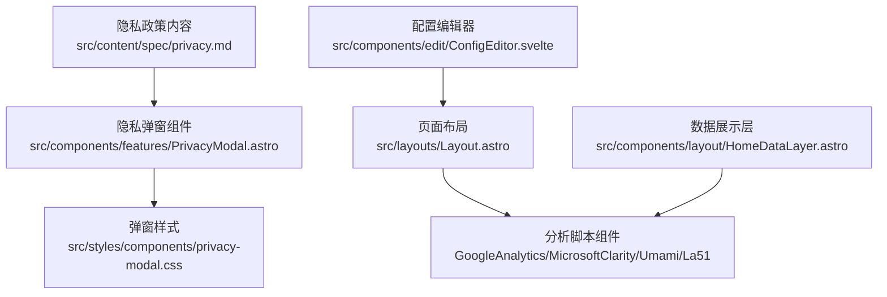
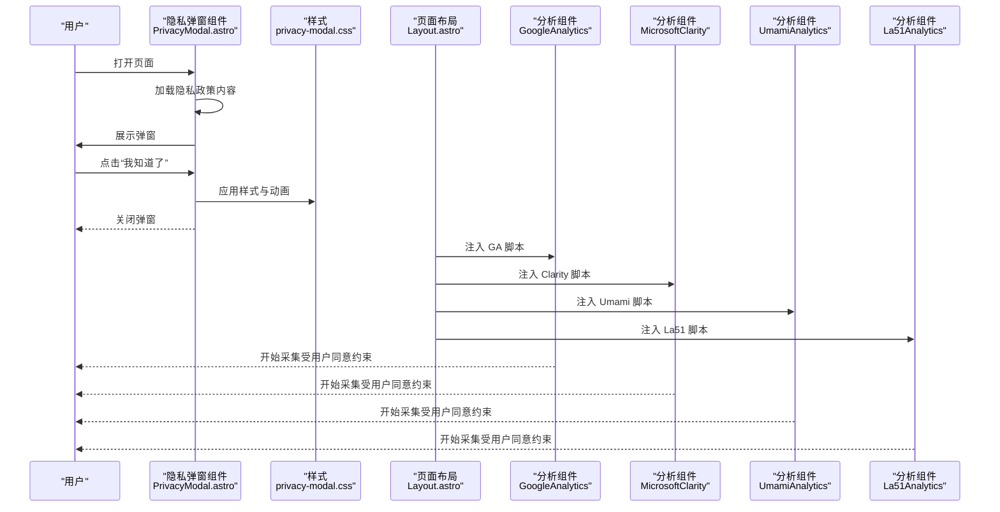
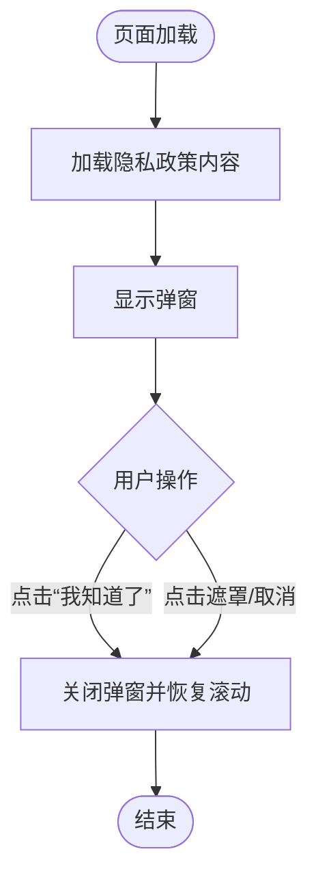
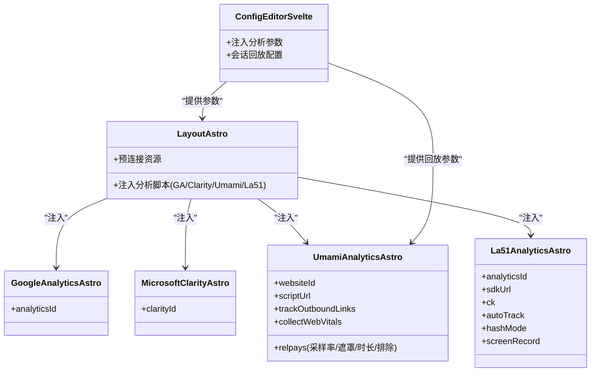
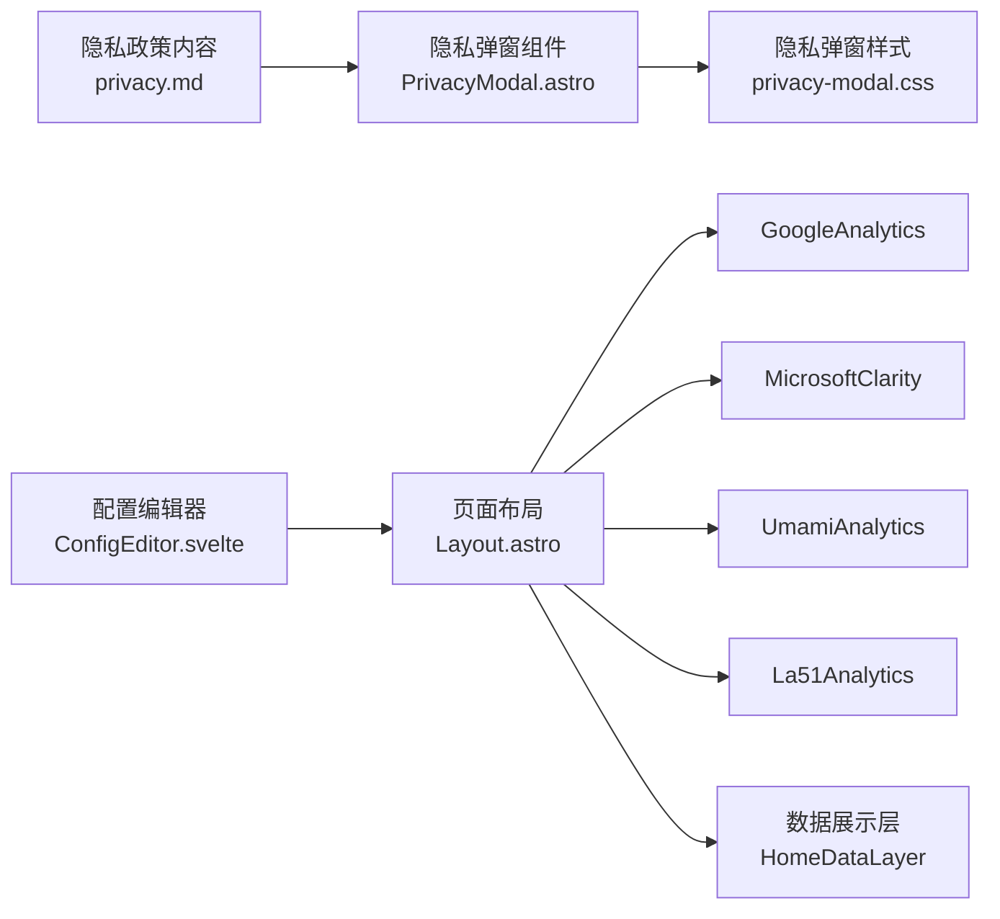

# 隐私合规

<cite>
**本文引用的文件**
- [privacy.md](file://src/content/spec/privacy.md)
- [PrivacyModal.astro](file://src/components/features/PrivacyModal.astro)
- [privacy-modal.css](file://src/styles/components/privacy-modal.css)
- [Layout.astro](file://src/layouts/Layout.astro)
- [GoogleAnalytics.astro](file://src/components/analytics/GoogleAnalytics.astro)
- [MicrosoftClarity.astro](file://src/components/analytics/MicrosoftClarity.astro)
- [UmamiAnalytics.astro](file://src/components/analytics/UmamiAnalytics.astro)
- [La51Analytics.astro](file://src/components/analytics/La51Analytics.astro)
- [ConfigEditor.svelte](file://src/components/edit/ConfigEditor.svelte)
- [HomeDataLayer.astro](file://src/components/layout/HomeDataLayer.astro)
</cite>

## 目录
1. [简介](#简介)
2. [项目结构](#项目结构)
3. [核心组件](#核心组件)
4. [架构总览](#架构总览)
5. [组件详细分析](#组件详细分析)
6. [依赖关系分析](#依赖关系分析)
7. [性能考量](#性能考量)
8. [故障排查指南](#故障排查指南)
9. [结论](#结论)
10. [附录](#附录)

## 简介
本文件面向隐私合规体系，结合仓库中的隐私政策内容与前端隐私弹窗、分析脚本集成现状，系统梳理数据收集与处理的合法性基础、用户同意与权利保障、技术实现要点（含匿名化与IP处理思路）、用户控制机制（偏好与删除/撤回流程）、隐私声明生成与维护、合规监控与改进机制，以及PIA（隐私影响评估）的实施路径。文档同时给出可视化图示，帮助非技术读者理解整体流程。

## 项目结构
围绕隐私合规的关键文件主要分布在以下区域：
- 规范与声明：src/content/spec/privacy.md
- 用户可见的隐私弹窗：src/components/features/PrivacyModal.astro 及样式 src/styles/components/privacy-modal.css
- 分析脚本集成：src/components/analytics/*.astro
- 页面布局注入：src/layouts/Layout.astro
- 配置编辑器（分析参数注入）：src/components/edit/ConfigEditor.svelte
- 数据展示层（统计来源）：src/components/layout/HomeDataLayer.astro

图表来源
- [privacy.md:1-96](file://src/content/spec/privacy.md#L1-L96)
- [PrivacyModal.astro:1-93](file://src/components/features/PrivacyModal.astro#L1-L93)
- [privacy-modal.css:1-216](file://src/styles/components/privacy-modal.css#L1-L216)
- [Layout.astro:71-97](file://src/layouts/Layout.astro#L71-L97)
- [GoogleAnalytics.astro:1-19](file://src/components/analytics/GoogleAnalytics.astro#L1-L19)
- [MicrosoftClarity.astro](file://src/components/analytics/MicrosoftClarity.astro)
- [UmamiAnalytics.astro:1-52](file://src/components/analytics/UmamiAnalytics.astro#L1-L52)
- [La51Analytics.astro:1-49](file://src/components/analytics/La51Analytics.astro#L1-L49)
- [ConfigEditor.svelte:647-730](file://src/components/edit/ConfigEditor.svelte#L647-L730)
- [HomeDataLayer.astro:42-83](file://src/components/layout/HomeDataLayer.astro#L42-L83)

章节来源
- [privacy.md:1-96](file://src/content/spec/privacy.md#L1-L96)
- [PrivacyModal.astro:1-93](file://src/components/features/PrivacyModal.astro#L1-L93)
- [privacy-modal.css:1-216](file://src/styles/components/privacy-modal.css#L1-L216)
- [Layout.astro:71-97](file://src/layouts/Layout.astro#L71-L97)
- [ConfigEditor.svelte:647-730](file://src/components/edit/ConfigEditor.svelte#L647-L730)
- [HomeDataLayer.astro:42-83](file://src/components/layout/HomeDataLayer.astro#L42-L83)

## 核心组件
- 隐私政策内容：明确收集信息类别、存储与地域、共享与披露、用户权利、变更与未成年人保护等，作为合规依据。
- 隐私弹窗：加载隐私政策内容，提供“我知道了”确认交互，控制弹窗显示/隐藏与背景溢出处理。
- 分析脚本集成：在布局中按配置注入第三方分析脚本（GA、Clarity、Umami、La51），支持会话回放与隐私遮罩等可控参数。
- 配置编辑器：集中注入分析参数（如网站ID、脚本URL、会话回放采样率、遮罩等级等），便于统一管理与最小化默认暴露。
- 数据展示层：读取分析配置并传递给前端组件，形成“统计来源—展示”的闭环。

章节来源
- [privacy.md:1-96](file://src/content/spec/privacy.md#L1-L96)
- [PrivacyModal.astro:1-93](file://src/components/features/PrivacyModal.astro#L1-L93)
- [privacy-modal.css:1-216](file://src/styles/components/privacy-modal.css#L1-L216)
- [Layout.astro:71-97](file://src/layouts/Layout.astro#L71-L97)
- [ConfigEditor.svelte:647-730](file://src/components/edit/ConfigEditor.svelte#L647-L730)
- [HomeDataLayer.astro:42-83](file://src/components/layout/HomeDataLayer.astro#L42-L83)

## 架构总览
下图展示从“隐私政策内容”到“用户交互确认”，再到“分析脚本注入与数据采集”的端到端流程。

图表来源
- [PrivacyModal.astro:1-93](file://src/components/features/PrivacyModal.astro#L1-L93)
- [privacy-modal.css:1-216](file://src/styles/components/privacy-modal.css#L1-L216)
- [Layout.astro:71-97](file://src/layouts/Layout.astro#L71-L97)
- [GoogleAnalytics.astro:1-19](file://src/components/analytics/GoogleAnalytics.astro#L1-L19)
- [MicrosoftClarity.astro](file://src/components/analytics/MicrosoftClarity.astro)
- [UmamiAnalytics.astro:1-52](file://src/components/analytics/UmamiAnalytics.astro#L1-L52)
- [La51Analytics.astro:1-49](file://src/components/analytics/La51Analytics.astro#L1-L49)

## 组件详细分析

### 隐私政策内容与弹窗
- 内容维度：涵盖信息收集类别、存储与地域、共享与披露、用户权利、变更与未成年人保护等，满足GDPR等法规对透明度与可访问性的要求。
- 弹窗交互：提供确认按钮、点击遮罩关闭、Esc取消、背景溢出控制；通过DOM事件与AbortController避免重复绑定与内存泄漏。
- 样式设计：暗色/亮色适配、动画过渡、响应式尺寸，确保良好的可读性与可用性。

图表来源
- [PrivacyModal.astro:1-93](file://src/components/features/PrivacyModal.astro#L1-L93)
- [privacy-modal.css:1-216](file://src/styles/components/privacy-modal.css#L1-L216)

章节来源
- [privacy.md:1-96](file://src/content/spec/privacy.md#L1-L96)
- [PrivacyModal.astro:1-93](file://src/components/features/PrivacyModal.astro#L1-L93)
- [privacy-modal.css:1-216](file://src/styles/components/privacy-modal.css#L1-L216)

### 分析脚本集成与用户同意
- 注入位置：在页面布局中按配置条件性注入各分析脚本，减少不必要的网络请求与数据采集。
- 参数化控制：通过配置编辑器注入网站ID、脚本URL、出站链接追踪、WebVitals采集、会话回放采样率、遮罩等级、最大时长、排除选择器等，实现最小化采集与隐私优先。
- 会话回放隐私：支持采样率、遮罩等级、最大时长、排除选择器等，降低敏感信息暴露风险。

图表来源
- [Layout.astro:71-97](file://src/layouts/Layout.astro#L71-L97)
- [ConfigEditor.svelte:647-730](file://src/components/edit/ConfigEditor.svelte#L647-L730)
- [UmamiAnalytics.astro:1-52](file://src/components/analytics/UmamiAnalytics.astro#L1-L52)
- [GoogleAnalytics.astro:1-19](file://src/components/analytics/GoogleAnalytics.astro#L1-L19)
- [MicrosoftClarity.astro](file://src/components/analytics/MicrosoftClarity.astro)
- [La51Analytics.astro:1-49](file://src/components/analytics/La51Analytics.astro#L1-L49)

章节来源
- [Layout.astro:71-97](file://src/layouts/Layout.astro#L71-L97)
- [ConfigEditor.svelte:647-730](file://src/components/edit/ConfigEditor.svelte#L647-L730)
- [UmamiAnalytics.astro:1-52](file://src/components/analytics/UmamiAnalytics.astro#L1-L52)
- [GoogleAnalytics.astro:1-19](file://src/components/analytics/GoogleAnalytics.astro#L1-L19)
- [MicrosoftClarity.astro](file://src/components/analytics/MicrosoftClarity.astro)
- [La51Analytics.astro:1-49](file://src/components/analytics/La51Analytics.astro#L1-L49)

### 数据匿名化与IP处理（策略建议）
- 匿名化：对可识别自然人的数据进行去标识化或匿名化处理，确保无法通过现有手段重新识别个人。
- IP处理：仅保留聚合统计所需的部分位段或完全去除；在服务端对IP进行哈希或掩码；避免在客户端脚本中直接暴露完整IP。
- Cookie与标识符：提供拒绝/管理选项，遵循最小化原则；对会话回放等高风险场景采用采样与遮罩。

（本节为通用合规建议，不直接对应具体源码）

### 用户控制机制（偏好管理、删除/撤回流程）
- 偏好管理：在隐私弹窗中提供“我知道了”确认；在分析组件中通过配置项控制追踪行为（如出站链接追踪、WebVitals采集、会话回放）。
- 删除与撤回：隐私政策文本明确了用户权利与删除/匿名化处理的承诺；可在应用层补充“数据删除请求”入口与处理流程（如API或工单）。

章节来源
- [privacy.md:84-96](file://src/content/spec/privacy.md#L84-L96)
- [PrivacyModal.astro:1-93](file://src/components/features/PrivacyModal.astro#L1-L93)
- [UmamiAnalytics.astro:1-52](file://src/components/analytics/UmamiAnalytics.astro#L1-L52)

### 隐私声明生成与维护
- 内容来源：以隐私政策内容为基准，定期校验与更新。
- 维护流程：在配置编辑器中统一管理分析参数，确保声明与实际采集一致；在页面布局中按需注入脚本，避免遗漏或冗余。

章节来源
- [privacy.md:1-96](file://src/content/spec/privacy.md#L1-L96)
- [ConfigEditor.svelte:647-730](file://src/components/edit/ConfigEditor.svelte#L647-L730)
- [Layout.astro:71-97](file://src/layouts/Layout.astro#L71-L97)

### 合规监控与改进机制
- 定期审查：对照隐私政策与实际实现，检查分析脚本配置与用户同意状态。
- 违规预警：对异常采集行为（如未授权回放、过度采样）建立告警阈值。
- 持续改进：根据审计结果与法规变化迭代隐私策略与技术实现。

（本节为通用合规建议，不直接对应具体源码）

### 隐私影响评估（PIA）
- 数据处理影响分析：识别并量化分析脚本带来的数据处理风险（如会话回放、WebVitals、出站追踪）。
- 风险缓解措施：采用采样、遮罩、最大时长限制、排除选择器等技术手段；在用户界面提供明确的控制与撤销路径。

（本节为通用合规建议，不直接对应具体源码）

## 依赖关系分析
- 隐私弹窗依赖隐私政策内容与样式；在页面布局中被触发显示。
- 页面布局依赖配置编辑器提供的分析参数，按条件注入分析脚本。
- 数据展示层读取分析配置，形成“来源—展示”的闭环。

图表来源
- [privacy.md:1-96](file://src/content/spec/privacy.md#L1-L96)
- [PrivacyModal.astro:1-93](file://src/components/features/PrivacyModal.astro#L1-L93)
- [privacy-modal.css:1-216](file://src/styles/components/privacy-modal.css#L1-L216)
- [ConfigEditor.svelte:647-730](file://src/components/edit/ConfigEditor.svelte#L647-L730)
- [Layout.astro:71-97](file://src/layouts/Layout.astro#L71-L97)
- [HomeDataLayer.astro:42-83](file://src/components/layout/HomeDataLayer.astro#L42-L83)

章节来源
- [Layout.astro:71-97](file://src/layouts/Layout.astro#L71-L97)
- [ConfigEditor.svelte:647-730](file://src/components/edit/ConfigEditor.svelte#L647-L730)
- [HomeDataLayer.astro:42-83](file://src/components/layout/HomeDataLayer.astro#L42-L83)

## 性能考量
- 资源预连接：在布局中对分析脚本来源进行预连接，减少首包延迟。
- 条件注入：仅在存在有效配置时注入脚本，避免无效网络请求。
- 会话回放成本：通过采样率与最大时长限制，平衡可观测性与性能/隐私成本。

章节来源
- [Layout.astro:71-97](file://src/layouts/Layout.astro#L71-L97)
- [UmamiAnalytics.astro:1-52](file://src/components/analytics/UmamiAnalytics.astro#L1-L52)
- [ConfigEditor.svelte:647-730](file://src/components/edit/ConfigEditor.svelte#L647-L730)

## 故障排查指南
- 弹窗无法关闭：检查弹窗组件事件绑定与AbortController信号，确保无重复监听。
- 分析脚本未生效：核对配置编辑器注入的ID与URL，确认页面布局已正确读取并注入。
- 会话回放异常：检查采样率、遮罩等级、最大时长与排除选择器配置，确保与隐私策略一致。

章节来源
- [PrivacyModal.astro:1-93](file://src/components/features/PrivacyModal.astro#L1-L93)
- [ConfigEditor.svelte:647-730](file://src/components/edit/ConfigEditor.svelte#L647-L730)
- [UmamiAnalytics.astro:1-52](file://src/components/analytics/UmamiAnalytics.astro#L1-L52)

## 结论
本项目已具备隐私政策内容、用户可见的隐私弹窗与分析脚本的条件化注入能力。建议在现有基础上完善用户控制（删除/撤回）、服务端数据保护（匿名化/IP处理）、PIA流程与合规监控机制，以全面满足GDPR等法规的合法性、透明度与可问责要求。

## 附录
- 隐私政策内容路径：[privacy.md:1-96](file://src/content/spec/privacy.md#L1-L96)
- 隐私弹窗组件路径：[PrivacyModal.astro:1-93](file://src/components/features/PrivacyModal.astro#L1-L93)
- 弹窗样式路径：[privacy-modal.css:1-216](file://src/styles/components/privacy-modal.css#L1-L216)
- 页面布局注入路径：[Layout.astro:71-97](file://src/layouts/Layout.astro#L71-L97)
- 分析脚本组件路径：[GoogleAnalytics.astro:1-19](file://src/components/analytics/GoogleAnalytics.astro#L1-L19)、[MicrosoftClarity.astro](file://src/components/analytics/MicrosoftClarity.astro)、[UmamiAnalytics.astro:1-52](file://src/components/analytics/UmamiAnalytics.astro#L1-L52)、[La51Analytics.astro:1-49](file://src/components/analytics/La51Analytics.astro#L1-L49)
- 配置编辑器路径：[ConfigEditor.svelte:647-730](file://src/components/edit/ConfigEditor.svelte#L647-L730)
- 数据展示层路径：[HomeDataLayer.astro:42-83](file://src/components/layout/HomeDataLayer.astro#L42-L83)