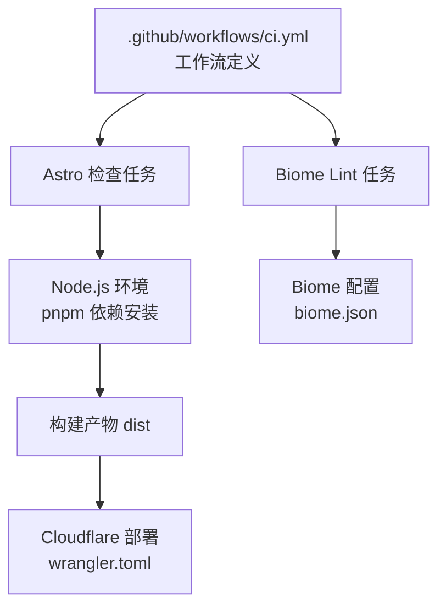
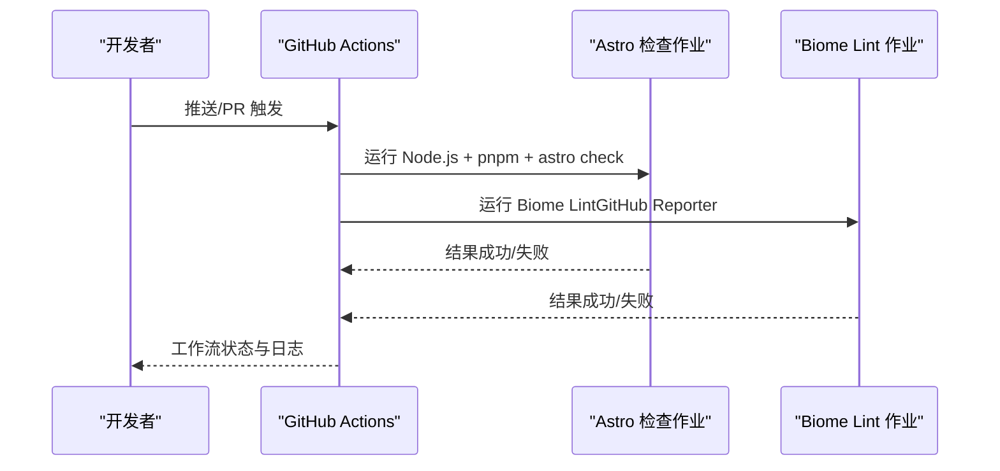
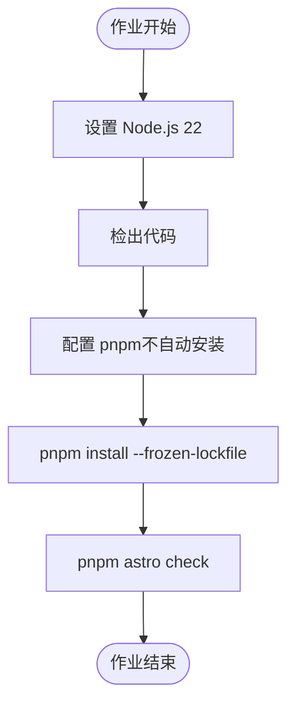
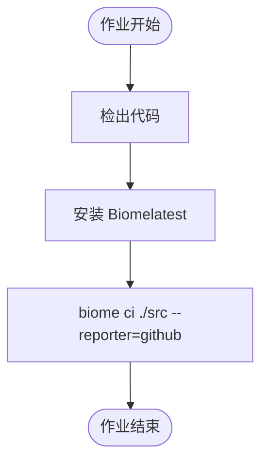
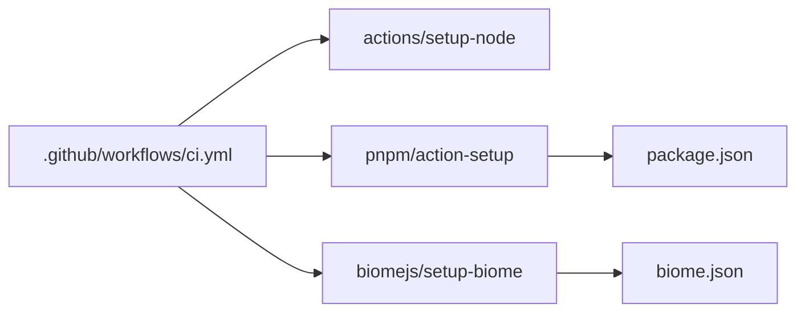

# CI/CD工作流

<cite>
**本文档引用的文件**
- [.github/workflows/ci.yml](file://.github/workflows/ci.yml)
- [biome.json](file://biome.json)
- [check_keys.cjs](file://check_keys.cjs)
- [wrangler.toml](file://wrangler.toml)
- [package.json](file://package.json)
- [README.md](file://README.md)
</cite>

## 目录
1. [简介](#简介)
2. [项目结构](#项目结构)
3. [核心组件](#核心组件)
4. [架构总览](#架构总览)
5. [详细组件分析](#详细组件分析)
6. [依赖关系分析](#依赖关系分析)
7. [性能考虑](#性能考虑)
8. [故障排除指南](#故障排除指南)
9. [结论](#结论)
10. [附录](#附录)

## 简介
本文件面向Firefly-Mod项目的持续集成与持续部署（CI/CD）工作流，系统性梳理GitHub Actions工作流配置、代码质量检查、测试与构建验证、以及多环境部署策略。文档同时解释触发条件（push、pull_request）、质量工具（Biome.js）集成方式、自定义检查脚本（check_keys.cjs）的作用边界、部署监控与日志分析方法，以及缓存、并发与资源优化实践。

## 项目结构
与CI/CD相关的关键位置与职责如下：
- 工作流定义：.github/workflows/ci.yml
- 代码质量规则：biome.json
- 自定义检查脚本：check_keys.cjs
- 部署配置：wrangler.toml
- 包管理与脚本：package.json
- 构建与部署说明：README.md

图表来源
- [.github/workflows/ci.yml:1-52](file://.github/workflows/ci.yml#L1-L52)
- [biome.json:1-66](file://biome.json#L1-L66)
- [wrangler.toml:1-35](file://wrangler.toml#L1-L35)

章节来源
- [.github/workflows/ci.yml:1-52](file://.github/workflows/ci.yml#L1-L52)
- [README.md:32-64](file://README.md#L32-L64)

## 核心组件
- 工作流触发器
  - push 到 master 分支
  - pull_request 针对 master 分支
- 并发控制
  - 使用 concurrency.group 与 cancel-in-progress: true 实现同一流水线同一引用的互斥执行
- 权限声明
  - permissions.contents: read 仅授予读取权限
- 作业划分
  - check 作业：Node.js 环境 + pnpm + Astro 类型/检查
  - quality 作业：Biome Lint，使用 GitHub 报告器

章节来源
- [.github/workflows/ci.yml:3-14](file://.github/workflows/ci.yml#L3-L14)
- [.github/workflows/ci.yml:16-52](file://.github/workflows/ci.yml#L16-L52)

## 架构总览
整体CI流程由两个并行作业组成：Astro类型与语法检查、Biome Lint。两者均在ubuntu-latest环境中运行，共享缓存与依赖安装策略。质量检查完成后，构建产物进入部署阶段（当前仓库未包含部署工作流文件，但提供了Cloudflare部署配置与说明）。

图表来源
- [.github/workflows/ci.yml:16-52](file://.github/workflows/ci.yml#L16-L52)

## 详细组件分析

### 工作流触发与并发控制
- 触发条件
  - push 事件限定在 master 分支
  - pull_request 事件限定在 master 分支
- 并发策略
  - concurrency.group 以 workflow+ref 组合命名
  - cancel-in-progress: true 在新提交到来时取消旧流水线，避免资源浪费

章节来源
- [.github/workflows/ci.yml:3-11](file://.github/workflows/ci.yml#L3-L11)

### Astro 类型与检查作业（check）
- 环境与工具链
  - Node.js 版本：22
  - 包管理：pnpm（action-setup，run_install=false）
  - 依赖安装：--frozen-lockfile 保证锁定文件一致性
- 步骤
  - checkout 仓库
  - 安装依赖
  - 运行 astro check（类型与Astro相关检查）

图表来源
- [.github/workflows/ci.yml:17-38](file://.github/workflows/ci.yml#L17-L38)

章节来源
- [.github/workflows/ci.yml:17-38](file://.github/workflows/ci.yml#L17-L38)

### Biome Lint 作业（quality）
- 工具与版本
  - biomejs/setup-biome@v2.5.0
  - version: latest
- 执行
  - biome ci ./src --reporter=github
  - 该Reporter会在PR中展示质量检查结果与建议

图表来源
- [.github/workflows/ci.yml:40-51](file://.github/workflows/ci.yml#L40-L51)
- [biome.json:1-66](file://biome.json#L1-L66)

章节来源
- [.github/workflows/ci.yml:40-51](file://.github/workflows/ci.yml#L40-L51)
- [biome.json:1-66](file://biome.json#L1-L66)

### 自定义检查脚本（check_keys.cjs）
- 作用范围
  - 用于对比两处 i18n 键集合差异，输出缺失键列表
  - 该脚本不在当前工作流中直接调用，建议作为本地开发或独立CI步骤使用
- 使用建议
  - 在本地或独立任务中运行，确保国际化键值完整性
  - 可纳入自定义质量检查流程（例如新增一个job）

章节来源
- [check_keys.cjs:1-23](file://check_keys.cjs#L1-L23)

### 多环境部署策略
- 当前仓库未包含完整的部署工作流文件，但具备以下部署基础：
  - Cloudflare Workers 配置：wrangler.toml
  - 构建命令与输出：README.md 提供了构建与部署说明
- 建议的部署策略（概念性）
  - 开发分支 → 预览环境（如Cloudflare Pages预览域）
  - 主分支 → 生产环境（如Cloudflare Pages或Workers）
  - 通过GitHub Secrets传递敏感配置（如API Token、账户ID等）
- 注意事项
  - 部署前需完成构建（pnpm build），并确保静态资源目录正确
  - 部署配置应与实际托管平台匹配

章节来源
- [README.md:32-64](file://README.md#L32-L64)
- [wrangler.toml:1-35](file://wrangler.toml#L1-L35)

## 依赖关系分析
- 工作流对工具链的依赖
  - actions/setup-node：Node.js 环境
  - pnpm/action-setup：包管理器配置
  - biomejs/setup-biome：代码质量工具
- 工具链与项目配置的耦合
  - biome.json 控制Biome规则集与忽略模式
  - package.json 定义脚本与依赖，间接影响工作流执行

图表来源
- [.github/workflows/ci.yml:21-51](file://.github/workflows/ci.yml#L21-L51)
- [biome.json:1-66](file://biome.json#L1-L66)
- [package.json](file://package.json)

章节来源
- [.github/workflows/ci.yml:21-51](file://.github/workflows/ci.yml#L21-L51)
- [biome.json:1-66](file://biome.json#L1-L66)
- [package.json](file://package.json)

## 性能考虑
- 缓存策略
  - pnpm 缓存：在本地或Runner上配置 pnpm store 缓存，减少依赖安装时间
  - Node.js 缓存：缓存 ~/.pnpm-store 与 node_modules（视Runner能力而定）
- 并发控制
  - concurrency.cancel-in-progress: true 避免长时间串行排队
- 资源限制
  - 使用 ubuntu-latest 的标准Runner，必要时可考虑更昂贵的Runner以缩短构建时间
- 任务拆分
  - 将 Astro 检查与 Biome Lint 并行执行，充分利用Runner资源

## 故障排除指南
- 工作流失败定位
  - 查看工作流日志中的具体步骤与错误码
  - Astro 检查失败通常与类型或Astro语法相关
  - Biome Lint 失败通常来自规则违反（格式、风格、正确性）
- 常见问题
  - 依赖安装失败：确认 package.json 与 pnpm-lock.yaml 一致，使用 --frozen-lockfile
  - Biome 报告器：确保在PR中启用“检查”权限，以便显示报告
  - 部署相关：如涉及Cloudflare，确认Secrets配置与wrangler.toml一致
- 日志与通知
  - 建议在工作流中增加通知步骤（如邮件或聊天通知），便于快速响应失败

## 结论
本仓库的CI工作流聚焦于Astro类型检查与Biome Lint，具备清晰的触发条件与并发控制机制。建议在现有基础上补充部署工作流（针对不同环境），完善缓存与并发策略，并将check_keys.cjs等自定义检查纳入CI矩阵，以进一步提升质量保障与交付效率。

## 附录
- 关键配置文件路径
  - 工作流：.github/workflows/ci.yml
  - 质量规则：biome.json
  - 自定义检查：check_keys.cjs
  - 部署配置：wrangler.toml
  - 构建与部署说明：README.md