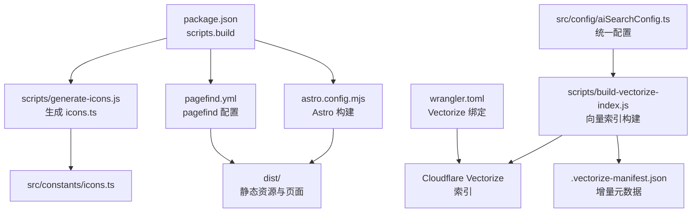
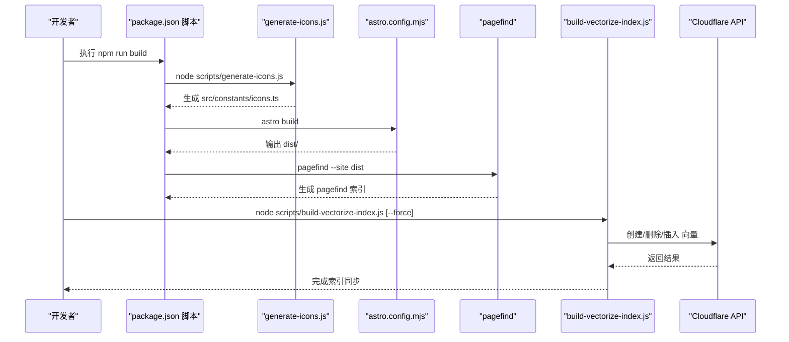
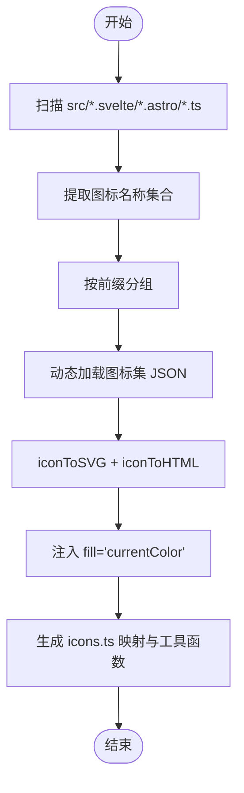
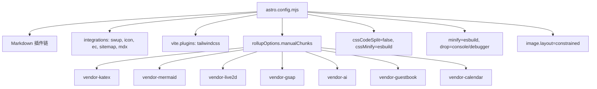
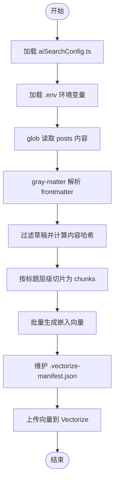
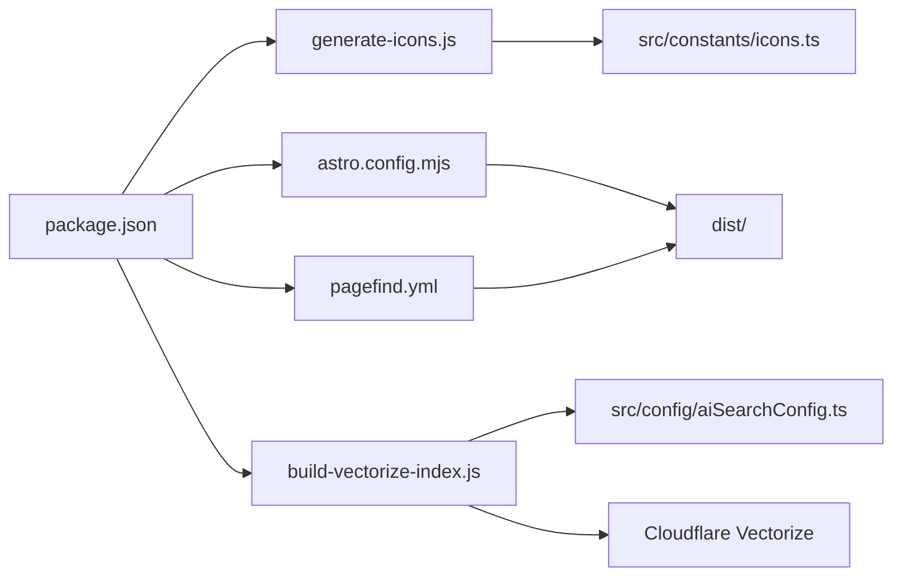

# 构建流程

<cite>
**本文引用的文件**
- [generate-icons.js](file://scripts/generate-icons.js)
- [astro.config.mjs](file://astro.config.mjs)
- [build-vectorize-index.js](file://scripts/build-vectorize-index.js)
- [package.json](file://package.json)
- [aiSearchConfig.ts](file://src/config/aiSearchConfig.ts)
- [pagefind.yml](file://pagefind.yml)
- [wrangler.toml](file://wrangler.toml)
- [icons.ts](file://src/constants/icons.ts)
- [tsconfig.json](file://tsconfig.json)
- [vercel.json](file://vercel.json)
</cite>

## 目录
1. [简介](#简介)
2. [项目结构](#项目结构)
3. [核心组件](#核心组件)
4. [架构总览](#架构总览)
5. [详细组件分析](#详细组件分析)
6. [依赖分析](#依赖分析)
7. [性能考虑](#性能考虑)
8. [故障排查指南](#故障排查指南)
9. [结论](#结论)
10. [附录](#附录)

## 简介
本文件系统性梳理 Firefly-Mod 的构建流程，聚焦三大核心阶段：
- 图标生成脚本：扫描源码中的图标使用，动态拉取图标集并生成内联 SVG 数据文件，供运行时直接使用。
- Astro 构建配置：定义 Markdown/MDX 渲染管线、集成插件、Vite/Rollup 优化策略、资源缓存与压缩等。
- 向量索引构建：将博客文章按标题层级切片，生成嵌入向量并上传至 Cloudflare Vectorize，支持全量重建与增量更新。

文档还给出构建命令执行顺序、依赖关系、输出结构、代码分割与缓存策略、性能优化建议、常见问题与调试方法，以及产物校验方式。

## 项目结构
构建相关的关键位置与职责：
- scripts/generate-icons.js：构建期图标预处理，生成 src/constants/icons.ts。
- astro.config.mjs：Astro/Vite 构建配置，含 Markdown 插件链、Rollup 分包策略、CSS/JS 压缩、缓存头策略。
- scripts/build-vectorize-index.js：向量索引构建与同步，读取 src/config/aiSearchConfig.ts 并通过 Cloudflare API 操作 Vectorize。
- package.json：统一的构建脚本入口，串联图标生成、Astro 构建与 pagefind 索引生成。
- src/config/aiSearchConfig.ts：向量搜索统一配置，包括索引名、维度、批大小等。
- pagefind.yml：pagefind 搜索索引排除规则。
- wrangler.toml：Cloudflare Workers 部署配置，声明 Vectorize 绑定。
- tsconfig.json：TypeScript 路径映射与编译目标，影响构建产物类型与模块解析。
- vercel.json：Vercel 部署配置，包含缓存头与构建命令。

**图表来源**
- [package.json:9](file://package.json#L9)
- [generate-icons.js:16](file://scripts/generate-icons.js#L16)
- [astro.config.mjs:256](file://astro.config.mjs#L256)
- [build-vectorize-index.js:65](file://scripts/build-vectorize-index.js#L65)
- [aiSearchConfig.ts:8](file://src/config/aiSearchConfig.ts#L8)
- [pagefind.yml:1](file://pagefind.yml#L1)
- [wrangler.toml:30](file://wrangler.toml#L30)

**章节来源**
- [package.json:9](file://package.json#L9)
- [astro.config.mjs:47](file://astro.config.mjs#L47)
- [generate-icons.js:14](file://scripts/generate-icons.js#L14)
- [build-vectorize-index.js:25](file://scripts/build-vectorize-index.js#L25)
- [aiSearchConfig.ts:8](file://src/config/aiSearchConfig.ts#L8)
- [pagefind.yml:1](file://pagefind.yml#L1)
- [wrangler.toml:30](file://wrangler.toml#L30)

## 核心组件
- 图标生成脚本：扫描 Svelte/Astro/TS 源文件，提取图标名称，动态加载图标集 JSON，调用 @iconify/utils 转换为内联 SVG，生成 src/constants/icons.ts，提供 getIconSvg/hasIcon/getAvailableIcons 等工具函数。
- Astro 构建配置：启用 swup SPA、astro-icon、expressive-code、sitemap、mdx 等；Markdown 插件链包含数学公式、Mermaid、PlantUML、外链、邮箱保护、自动锚点等；Vite/Rollup 侧进行 esbuild 压缩、按依赖分包、CSS 压缩与内联阈值控制。
- 向量索引构建：读取 src/content/posts 下的 md/mdx，按标题层级切片，生成嵌入向量，上传至 Cloudflare Vectorize；支持基于 .vectorize-manifest.json 的增量更新与全量重建。

**章节来源**
- [generate-icons.js:159](file://scripts/generate-icons.js#L159)
- [astro.config.mjs:66](file://astro.config.mjs#L66)
- [astro.config.mjs:182](file://astro.config.mjs#L182)
- [astro.config.mjs:256](file://astro.config.mjs#L256)
- [build-vectorize-index.js:100](file://scripts/build-vectorize-index.js#L100)
- [build-vectorize-index.js:131](file://scripts/build-vectorize-index.js#L131)
- [build-vectorize-index.js:192](file://scripts/build-vectorize-index.js#L192)
- [build-vectorize-index.js:226](file://scripts/build-vectorize-index.js#L226)

## 架构总览
下图展示从命令到产物的整体流程，包括图标生成、Astro 构建、pagefind 索引与向量索引同步。

**图表来源**
- [package.json:9](file://package.json#L9)
- [generate-icons.js:207](file://scripts/generate-icons.js#L207)
- [astro.config.mjs:47](file://astro.config.mjs#L47)
- [build-vectorize-index.js:324](file://scripts/build-vectorize-index.js#L324)

## 详细组件分析

### 图标生成脚本（generate-icons.js）
- 扫描范围与模式：遍历 src 下的 .svelte/.astro/.ts 文件，匹配多种图标使用模式（HTML 属性、JS 对象、模板字符串、函数调用等），收集唯一图标名。
- 图标集加载：根据前缀映射，定位 node_modules 中对应 @iconify-json/* 包的 icons.json，缓存于 Map，避免重复 IO。
- SVG 转换：使用 @iconify/utils 将图标数据转为 SVG HTML，确保 fill="currentColor" 以适配主题色。
- 输出文件：生成 src/constants/icons.ts，包含内联 SVG 字符串映射与工具函数，按名称排序写入，便于后续打包器树摇。
- 错误处理：对未知图标集、图标缺失、JSON 解析失败等情况输出警告并跳过，不影响整体流程。

**图表来源**
- [generate-icons.js:37](file://scripts/generate-icons.js#L37)
- [generate-icons.js:64](file://scripts/generate-icons.js#L64)
- [generate-icons.js:96](file://scripts/generate-icons.js#L96)
- [generate-icons.js:122](file://scripts/generate-icons.js#L122)
- [generate-icons.js:159](file://scripts/generate-icons.js#L159)

**章节来源**
- [generate-icons.js:18](file://scripts/generate-icons.js#L18)
- [generate-icons.js:37](file://scripts/generate-icons.js#L37)
- [generate-icons.js:64](file://scripts/generate-icons.js#L64)
- [generate-icons.js:96](file://scripts/generate-icons.js#L96)
- [generate-icons.js:122](file://scripts/generate-icons.js#L122)
- [generate-icons.js:159](file://scripts/generate-icons.js#L159)
- [icons.ts:1](file://src/constants/icons.ts#L1)

### Astro 构建配置（astro.config.mjs）
- 站点基础配置：site、base、trailingSlash。
- 图像优化：全局 constrained 布局。
- 实验特性：queuedRendering 开启，rustCompiler 关闭（跨平台稳定性优先）。
- 集成插件：swup（SPA 导航）、astro-icon（图标）、expressive-code（代码块增强）、sitemap、mdx。
- Markdown 插件链：数学公式、Mermaid、PlantUML、外链、邮箱保护、自动锚点、callouts、slug、自定义组件等。
- Vite/Rollup 优化：
  - minify: "esbuild"，移除 console 与 debugger。
  - manualChunks：对 katex、mermaid、live2d、gsap、AISearch、Guestbook、Calendar 等进行独立分包，降低首屏阻塞。
  - cssCodeSplit: false（减少 CSS 数量，便于缓存），cssMinify: "esbuild"。
  - assetsInlineLimit: 4096（小资源内联，减少请求数）。
  - onwarn：抑制特定误报警告。
- 缓存头策略：通过部署平台 headers 配置实现长期缓存与 HTML 验证策略（见 vercel.json 与 pagefind.yml）。

**图表来源**
- [astro.config.mjs:66](file://astro.config.mjs#L66)
- [astro.config.mjs:182](file://astro.config.mjs#L182)
- [astro.config.mjs:256](file://astro.config.mjs#L256)
- [astro.config.mjs:270](file://astro.config.mjs#L270)

**章节来源**
- [astro.config.mjs:47](file://astro.config.mjs#L47)
- [astro.config.mjs:182](file://astro.config.mjs#L182)
- [astro.config.mjs:256](file://astro.config.mjs#L256)
- [astro.config.mjs:270](file://astro.config.mjs#L270)

### 向量索引构建（build-vectorize-index.js）
- 配置来源：读取 src/config/aiSearchConfig.ts，支持本地 Workers AI 或第三方 embedding API；Cloudflare API 凭据来自环境变量。
- 数据准备：glob 匹配 src/content/posts 下 md/mdx，使用 gray-matter 解析 frontmatter，过滤草稿，计算内容哈希。
- 文本切片：按标题层级（# ~ ####）切分为多个片段，每个片段附加文章元信息，形成可检索单元。
- 嵌入生成：若配置了第三方 API，则调用 /v1/embeddings；否则使用 Cloudflare Workers AI；支持批量请求与延迟节流。
- 索引同步：支持全量重建（--force）与增量更新（基于 .vectorize-manifest.json）；删除旧向量、插入新向量、更新清单。
- 错误处理：对 API 响应错误抛出异常，对 404 索引删除进行容错提示。

**图表来源**
- [build-vectorize-index.js:25](file://scripts/build-vectorize-index.js#L25)
- [build-vectorize-index.js:100](file://scripts/build-vectorize-index.js#L100)
- [build-vectorize-index.js:131](file://scripts/build-vectorize-index.js#L131)
- [build-vectorize-index.js:192](file://scripts/build-vectorize-index.js#L192)
- [build-vectorize-index.js:226](file://scripts/build-vectorize-index.js#L226)
- [build-vectorize-index.js:324](file://scripts/build-vectorize-index.js#L324)

**章节来源**
- [build-vectorize-index.js:25](file://scripts/build-vectorize-index.js#L25)
- [build-vectorize-index.js:100](file://scripts/build-vectorize-index.js#L100)
- [build-vectorize-index.js:131](file://scripts/build-vectorize-index.js#L131)
- [build-vectorize-index.js:192](file://scripts/build-vectorize-index.js#L192)
- [build-vectorize-index.js:226](file://scripts/build-vectorize-index.js#L226)
- [build-vectorize-index.js:324](file://scripts/build-vectorize-index.js#L324)

## 依赖分析
- 构建命令依赖关系：
  - npm run build 顺序：generate-icons.js → astro build → pagefind。
  - npm run build-index 用于向量索引构建，可单独执行。
- 运行时依赖：
  - icons.ts 由 generate-icons.js 生成，被组件与工具模块使用。
  - 向量索引依赖 Cloudflare Vectorize 与 Workers AI/第三方 embedding API。
- 部署依赖：
  - vercel.json 定义构建命令与缓存头。
  - wrangler.toml 声明 Vectorize 绑定与 KV/Assets 配置。

**图表来源**
- [package.json:9](file://package.json#L9)
- [generate-icons.js:16](file://scripts/generate-icons.js#L16)
- [astro.config.mjs:47](file://astro.config.mjs#L47)
- [pagefind.yml:1](file://pagefind.yml#L1)
- [build-vectorize-index.js:25](file://scripts/build-vectorize-index.js#L25)
- [aiSearchConfig.ts:8](file://src/config/aiSearchConfig.ts#L8)
- [wrangler.toml:30](file://wrangler.toml#L30)

**章节来源**
- [package.json:9](file://package.json#L9)
- [package.json:18](file://package.json#L18)
- [generate-icons.js:16](file://scripts/generate-icons.js#L16)
- [build-vectorize-index.js:25](file://scripts/build-vectorize-index.js#L25)
- [wrangler.toml:30](file://wrangler.toml#L30)

## 性能考虑
- 并行构建与增量：
  - generate-icons.js：并发生成 SVG，但受磁盘 IO 限制；建议在 CI 中缓存 node_modules 与 icons.ts。
  - build-vectorize-index.js：嵌入与上传采用双层批处理（EMBED_BATCH_SIZE 与 BATCH_SIZE），并在批次间延迟，平衡吞吐与限流。
- 代码分割与缓存：
  - Rollup manualChunks 将大型库拆分为独立包，结合 CDN/边缘缓存可显著降低二次访问延迟。
  - Vite esbuild 压缩与 drop 控制生产包体积；assetsInlineLimit 控制内联阈值，减少请求数。
  - pagefind 与 vercel headers 配置实现静态资源长期缓存与 HTML 验证。
- 内存与 I/O：
  - generate-icons.js 使用 Map 缓存图标集，避免重复读取；icons.ts 以字符串映射存储，内存占用可控。
  - build-vectorize-index.js 通过 manifest 与内容哈希实现增量，避免全量重算。
- TypeScript 路径映射：
  - tsconfig.json 的路径别名与 bundler 模块解析有助于打包器更高效地解析模块，减少重复扫描。

[本节为通用性能建议，不直接分析具体文件，故无“章节来源”]

## 故障排查指南
- 图标生成失败：
  - 现象：某些图标未生成或控制台警告。
  - 排查：检查 generate-icons.js 中的图标集前缀映射与 node_modules 是否存在对应包；确认源文件中图标命名格式正确。
  - 参考：[generate-icons.js:101](file://scripts/generate-icons.js#L101)、[generate-icons.js:134](file://scripts/generate-icons.js#L134)。
- Astro 构建告警：
  - 现象：Rollup 对特定依赖出现误报或重复导入警告。
  - 处理：astro.config.mjs 的 onwarn 已屏蔽特定误报；如仍有问题，检查依赖版本与动态导入使用。
  - 参考：[astro.config.mjs:282](file://astro.config.mjs#L282)。
- pagefind 索引异常：
  - 现象：搜索结果为空或包含不应索引的内容。
  - 处理：调整 pagefind.yml 的排除选择器；确认 dist 目录结构与权限。
  - 参考：[pagefind.yml:1](file://pagefind.yml#L1)。
- 向量索引构建失败：
  - 现象：Cloudflare API 返回 401/403/404 或嵌入接口错误。
  - 处理：检查 .env 中 CLOUDFLARE_API_TOKEN、CLOUDFLARE_ACCOUNT_ID 与 AI_API_KEY；确认索引名与维度一致；必要时使用 --force 全量重建。
  - 参考：[build-vectorize-index.js:74](file://scripts/build-vectorize-index.js#L74)、[build-vectorize-index.js:214](file://scripts/build-vectorize-index.js#L214)、[build-vectorize-index.js:236](file://scripts/build-vectorize-index.js#L236)。
- 部署缓存问题：
  - 现象：静态资源未更新或 HTML 缓存过期。
  - 处理：核对 vercel.json headers 与 pagefind 缓存头；确认构建命令与输出目录。
  - 参考：[vercel.json:1](file://vercel.json#L1)。

**章节来源**
- [generate-icons.js:101](file://scripts/generate-icons.js#L101)
- [generate-icons.js:134](file://scripts/generate-icons.js#L134)
- [astro.config.mjs:282](file://astro.config.mjs#L282)
- [pagefind.yml:1](file://pagefind.yml#L1)
- [build-vectorize-index.js:74](file://scripts/build-vectorize-index.js#L74)
- [build-vectorize-index.js:214](file://scripts/build-vectorize-index.js#L214)
- [build-vectorize-index.js:236](file://scripts/build-vectorize-index.js#L236)
- [vercel.json:1](file://vercel.json#L1)

## 结论
该构建体系通过“构建期图标内联 + Astro 生产级打包 + pagefind 搜索 + Vectorize 增量向量化”的组合，实现了高性能、可维护且可扩展的前端发布链路。合理利用分包、压缩与缓存策略，可在保证体验的同时降低带宽与服务器压力。建议在 CI 中固定依赖版本、缓存 node_modules 与 icons.ts，并对向量索引构建增加监控与回滚策略。

[本节为总结性内容，不直接分析具体文件，故无“章节来源”]

## 附录
- 构建命令与用途
  - npm run build：串联图标生成、Astro 构建与 pagefind。
  - npm run icons：仅执行图标生成脚本。
  - npm run build-index：执行向量索引构建，支持 --force 全量重建。
- 输出文件与目录
  - dist/：Astro 构建产物，包含静态资源与页面。
  - src/constants/icons.ts：构建期生成的图标内联数据。
  - .vectorize-manifest.json：向量索引增量元数据。
  - pagefind 索引：位于 dist 下，供客户端搜索使用。
- 部署与缓存
  - vercel.json：定义构建命令、输出目录与缓存头。
  - wrangler.toml：声明 Vectorize 绑定与 KV/Assets。
  - pagefind.yml：定义 pagefind 排除规则。

**章节来源**
- [package.json:9](file://package.json#L9)
- [package.json:17](file://package.json#L17)
- [package.json:18](file://package.json#L18)
- [astro.config.mjs:47](file://astro.config.mjs#L47)
- [build-vectorize-index.js:65](file://scripts/build-vectorize-index.js#L65)
- [pagefind.yml:1](file://pagefind.yml#L1)
- [vercel.json:1](file://vercel.json#L1)
- [wrangler.toml:30](file://wrangler.toml#L30)