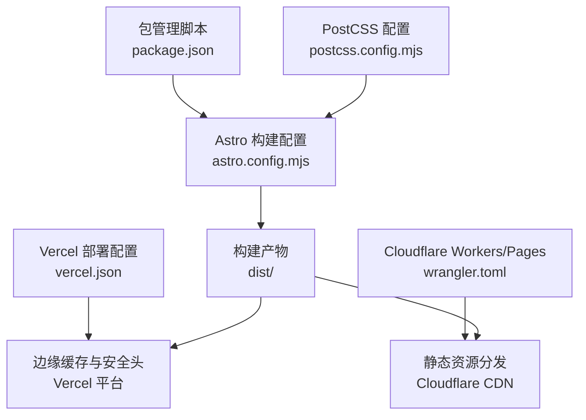
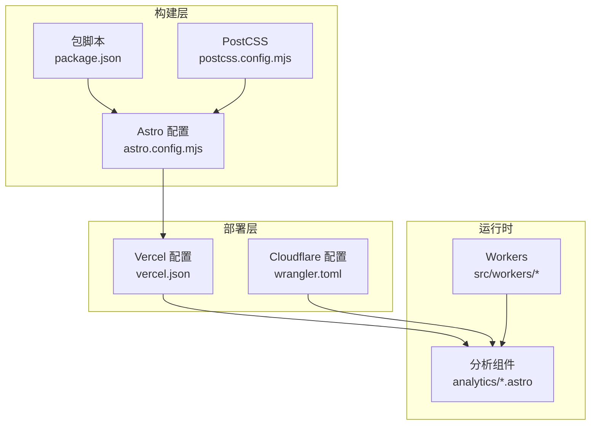
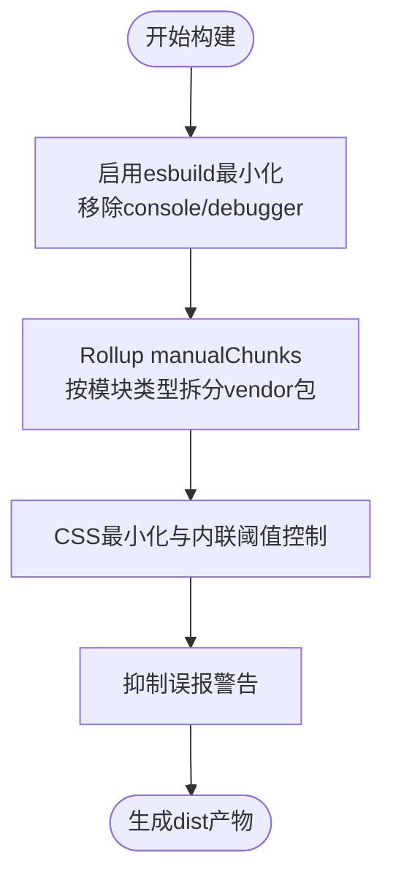
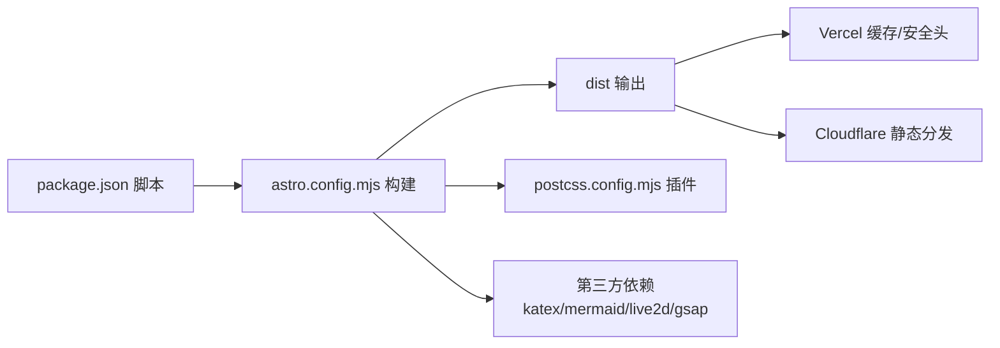

# 部署优化策略

<cite>
**本文引用的文件**
- [astro.config.mjs](file://astro.config.mjs)
- [package.json](file://package.json)
- [vercel.json](file://vercel.json)
- [wrangler.toml](file://wrangler.toml)
- [postcss.config.mjs](file://postcss.config.mjs)
- [robots.txt.ts](file://src/pages/robots.txt.ts)
- [sitemap.xml.ts](file://src/pages/rss.xml.ts)
- [rss.xml.ts](file://src/pages/rss.xml.ts)
- [favicon.ico](file://public/favicon/favicon.ico)
- [public/assets/images/loading/loading.svg](file://public/assets/images/loading/loading.svg)
- [public/fonts/AaZongYiYuan](file://public/fonts/AaZongYiYuan)
- [public/assets/js/highlight.min.js](file://public/assets/js/highlight.min.js)
- [public/assets/js/marked.min.js](file://public/assets/js/marked.min.js)
- [public/assets/css/twikoo-custom.css](file://public/assets/css/twikoo-custom.css)
- [public/assets/css/twikoo.css](file://public/assets/css/twikoo.css)
- [public/assets/css/highlight-github-dark.min.css](file://public/assets/css/highlight-github-dark.min.css)
- [src/components/features/Live2DWidget.astro](file://src/components/features/Live2DWidget.astro)
- [src/components/features/SpineModel.astro](file://src/components/features/SpineModel.astro)
- [src/components/features/music-visualizer/MusicVisualizer.svelte](file://src/components/features/music-visualizer/MusicVisualizer.svelte)
- [src/components/common/ImageWrapper.astro](file://src/components/common/ImageWrapper.astro)
- [src/utils/image-utils.ts](file://src/utils/image-utils.ts)
- [src/config/siteConfig.ts](file://src/config/siteConfig.ts)
- [src/config/fontConfig.ts](file://src/config/fontConfig.ts)
- [src/config/pioConfig.ts](file://src/config/pioConfig.ts)
- [src/workers/guestbook.js](file://src/workers/guestbook.js)
- [src/workers/ai-chat.js](file://src/workers/ai-chat.js)
- [src/workers/github-proxy.js](file://src/workers/github-proxy.js)
- [src/workers/utils/rate-limit.js](file://src/workers/utils/rate-limit.js)
- [src/workers/utils/streaming.js](file://src/workers/utils/streaming.js)
- [src/components/analytics/GoogleAnalytics.astro](file://src/components/analytics/GoogleAnalytics.astro)
- [src/components/analytics/UmamiAnalytics.astro](file://src/components/analytics/UmamiAnalytics.astro)
- [src/components/analytics/La51Analytics.astro](file://src/components/analytics/La51Analytics.astro)
- [src/components/analytics/MicrosoftClarity.astro](file://src/components/analytics/MicrosoftClarity.astro)
</cite>

## 目录
1. [简介](#简介)
2. [项目结构](#项目结构)
3. [核心组件](#核心组件)
4. [架构总览](#架构总览)
5. [详细组件分析](#详细组件分析)
6. [依赖关系分析](#依赖关系分析)
7. [性能考虑](#性能考虑)
8. [故障排查指南](#故障排查指南)
9. [结论](#结论)
10. [附录](#附录)

## 简介
本指南面向Firefly-Mod项目的部署与性能优化，聚焦于Astro配置中的性能优化选项（代码分割、懒加载、资源预加载）、静态资源优化（图片压缩、字体优化、CSS/JS最小化）、缓存策略（浏览器缓存、CDN缓存、API缓存）、构建优化（Tree Shaking、死代码消除、Bundle分析）、性能监控与分析（Lighthouse、Core Web Vitals、用户体验）、安全加固（HTTPS、CSP、XSS防护）以及成本优化（带宽、存储、CDN节点）。文档基于仓库实际配置与源码进行分析，并提供可操作的优化建议。

## 项目结构
该项目采用Astro + Svelte + MDX的技术栈，结合TailwindCSS、Expressive Code、Swup等生态组件。构建产物输出至dist目录，部署于Vercel与Cloudflare Workers/Pages组合方案。关键目录与文件职责如下：
- 构建与配置：astro.config.mjs、package.json、vercel.json、wrangler.toml、postcss.config.mjs
- 页面与路由：src/pages、src/layouts、src/components
- 静态资源：public、dist
- 工作线程与API：src/workers
- 分析与统计：src/components/analytics

图表来源
- [astro.config.mjs:238-306](file://astro.config.mjs#L238-L306)
- [package.json:5-18](file://package.json#L5-L18)
- [vercel.json:1-40](file://vercel.json#L1-L40)
- [wrangler.toml:1-36](file://wrangler.toml#L1-L36)
- [postcss.config.mjs:1-10](file://postcss.config.mjs#L1-L10)

章节来源
- [astro.config.mjs:47-306](file://astro.config.mjs#L47-L306)
- [package.json:1-112](file://package.json#L1-L112)
- [vercel.json:1-40](file://vercel.json#L1-L40)
- [wrangler.toml:1-36](file://wrangler.toml#L1-L36)
- [postcss.config.mjs:1-10](file://postcss.config.mjs#L1-L10)

## 核心组件
- 构建与打包优化：通过Vite/Esbuild配置实现代码最小化、按需分块、动态导入与忽略警告；Rollup manualChunks将大型第三方库拆分为独立chunk。
- 图像与字体优化：全局图像配置、字体资源放置于public目录、Tailwind按需生成样式。
- 缓存与安全：Vercel头部配置注入安全头与静态资源缓存策略；Cloudflare KV/Vectorize用于数据与搜索能力。
- 性能监控：集成多套分析组件（Google Analytics、Umami、La51、Microsoft Clarity）。

章节来源
- [astro.config.mjs:256-304](file://astro.config.mjs#L256-L304)
- [vercel.json:6-38](file://vercel.json#L6-L38)
- [wrangler.toml:5-36](file://wrangler.toml#L5-L36)
- [package.json:20-91](file://package.json#L20-L91)

## 架构总览
整体架构由Astro构建层、Vercel边缘层、Cloudflare Workers/Pages层组成。构建阶段完成代码分割与资源最小化；部署阶段通过Vercel与Cloudflare实现全球CDN分发与缓存控制；分析组件负责用户行为追踪与性能指标采集。

图表来源
- [astro.config.mjs:47-306](file://astro.config.mjs#L47-L306)
- [package.json:5-18](file://package.json#L5-L18)
- [postcss.config.mjs:1-10](file://postcss.config.mjs#L1-L10)
- [vercel.json:1-40](file://vercel.json#L1-L40)
- [wrangler.toml:1-36](file://wrangler.toml#L1-L36)
- [src/components/analytics/GoogleAnalytics.astro](file://src/components/analytics/GoogleAnalytics.astro)
- [src/components/analytics/UmamiAnalytics.astro](file://src/components/analytics/UmamiAnalytics.astro)
- [src/components/analytics/La51Analytics.astro](file://src/components/analytics/La51Analytics.astro)
- [src/components/analytics/MicrosoftClarity.astro](file://src/components/analytics/MicrosoftClarity.astro)
- [src/workers/guestbook.js](file://src/workers/guestbook.js)
- [src/workers/ai-chat.js](file://src/workers/ai-chat.js)
- [src/workers/github-proxy.js](file://src/workers/github-proxy.js)

## 详细组件分析

### Astro构建与代码分割
- 代码最小化与清理：启用esbuild最小化与移除console/debugger，减少生产包体积。
- 动态导入与手动分块：通过Rollup manualChunks对katex、mermaid、live2d、gsap、AI搜索、访客簿、日历等模块进行独立分块，降低首屏依赖。
- CSS策略：关闭cssCodeSplit避免过度切分，使用esbuild压缩CSS，assetsInlineLimit控制内联阈值。
- 构建警告抑制：针对动态与静态导入冲突及GSAP误报进行警告过滤，保证CI稳定。

图表来源
- [astro.config.mjs:256-304](file://astro.config.mjs#L256-L304)

章节来源
- [astro.config.mjs:256-304](file://astro.config.mjs#L256-L304)

### 图像与字体优化
- 图像优化：全局image配置采用响应式布局，结合客户端懒加载组件与占位图，减少首屏阻塞。
- 字体优化：字体资源置于public/fonts，配合站点配置与Tailwind按需生成，避免未使用字重进入产物。
- 代码示例路径：
  - 图像懒加载组件：[src/components/common/ImageWrapper.astro](file://src/components/common/ImageWrapper.astro)
  - 图像工具函数：[src/utils/image-utils.ts](file://src/utils/image-utils.ts)
  - 站点配置（字体/站点参数）：[src/config/siteConfig.ts](file://src/config/siteConfig.ts)，[src/config/fontConfig.ts](file://src/config/fontConfig.ts)

章节来源
- [astro.config.mjs:53-57](file://astro.config.mjs#L53-L57)
- [src/components/common/ImageWrapper.astro](file://src/components/common/ImageWrapper.astro)
- [src/utils/image-utils.ts](file://src/utils/image-utils.ts)
- [src/config/siteConfig.ts](file://src/config/siteConfig.ts)
- [src/config/fontConfig.ts](file://src/config/fontConfig.ts)

### 静态资源与预加载
- 静态资源位置：公共资源位于public目录，构建后进入dist，Vercel配置为/_astro/*设置长期缓存。
- 预加载策略：Swup集成支持页面切换预加载容器内容，减少跳转延迟。
- 代码示例路径：
  - Swup配置：[astro.config.mjs:66-87](file://astro.config.mjs#L66-L87)
  - Vercel缓存头：[vercel.json:28-36](file://vercel.json#L28-L36)

章节来源
- [astro.config.mjs:66-87](file://astro.config.mjs#L66-L87)
- [vercel.json:28-36](file://vercel.json#L28-L36)

### 缓存策略设计
- 浏览器缓存：/_astro/*设置immutable长期缓存；HTML文件设置must-revalidate确保更新可见。
- CDN缓存：Vercel与Cloudflare均参与缓存，/_astro/*由Vercel头部统一控制。
- API缓存：Cloudflare KV命名空间用于访问统计等数据缓存；Vectorize索引用于AI搜索加速。
- 代码示例路径：
  - Vercel头部与缓存：[vercel.json:6-38](file://vercel.json#L6-L38)
  - Cloudflare KV/Vectorize绑定：[wrangler.toml:26-32](file://wrangler.toml#L26-L32)

章节来源
- [vercel.json:6-38](file://vercel.json#L6-L38)
- [wrangler.toml:26-32](file://wrangler.toml#L26-L32)

### 安全加固
- 安全头：X-Content-Type-Options、X-Frame-Options、X-XSS-Protection、Referrer-Policy在Vercel统一注入。
- HTTPS：默认启用，结合Strict-Transport-Security（可在平台层配置）。
- CSP：建议在平台层新增Content-Security-Policy头，限制脚本来源与内联执行。
- XSS防护：已启用X-XSS-Protection与严格外部链接处理插件。
- 代码示例路径：
  - 安全头配置：[vercel.json:6-27](file://vercel.json#L6-L27)
  - 外部链接处理插件：[astro.config.mjs:202](file://astro.config.mjs#L202)

章节来源
- [vercel.json:6-27](file://vercel.json#L6-L27)
- [astro.config.mjs:202](file://astro.config.mjs#L202)

### 性能监控与分析
- 分析组件：集成Google Analytics、Umami、La51、Microsoft Clarity，覆盖流量统计与行为分析。
- Lighthouse：建议在CI中集成Lighthouse报告，关注First Contentful Paint、Largest Contentful Paint、Cumulative Layout Shift等指标。
- Core Web Vitals：通过分析组件数据与Web Vitals API持续跟踪体验指标。
- 代码示例路径：
  - 分析组件集合：[src/components/analytics/GoogleAnalytics.astro](file://src/components/analytics/GoogleAnalytics.astro)、[src/components/analytics/UmamiAnalytics.astro](file://src/components/analytics/UmamiAnalytics.astro)、[src/components/analytics/La51Analytics.astro](file://src/components/analytics/La51Analytics.astro)、[src/components/analytics/MicrosoftClarity.astro](file://src/components/analytics/MicrosoftClarity.astro)

章节来源
- [src/components/analytics/GoogleAnalytics.astro](file://src/components/analytics/GoogleAnalytics.astro)
- [src/components/analytics/UmamiAnalytics.astro](file://src/components/analytics/UmamiAnalytics.astro)
- [src/components/analytics/La51Analytics.astro](file://src/components/analytics/La51Analytics.astro)
- [src/components/analytics/MicrosoftClarity.astro](file://src/components/analytics/MicrosoftClarity.astro)

### API与Worker优化
- Rate Limit：在workers/utils/rate-limit.js中实现限流，防止滥用与DDoS。
- Streaming：在workers/utils/streaming.js中实现流式响应，提升交互体验。
- 代码示例路径：
  - 限流实现：[src/workers/utils/rate-limit.js](file://src/workers/utils/rate-limit.js)
  - 流式响应：[src/workers/utils/streaming.js](file://src/workers/utils/streaming.js)
  - Worker入口：[wrangler.toml:3](file://wrangler.toml#L3)

章节来源
- [src/workers/utils/rate-limit.js](file://src/workers/utils/rate-limit.js)
- [src/workers/utils/streaming.js](file://src/workers/utils/streaming.js)
- [wrangler.toml:3](file://wrangler.toml#L3)

## 依赖关系分析
- 构建链路：package.json脚本触发Astro构建，随后Pagefind生成搜索索引；Vercel与Cloudflare分别负责边缘缓存与静态分发。
- 第三方库：katex、mermaid、live2d、gsap等通过manualChunks独立打包，降低首屏体积。
- CSS链路：TailwindCSS与PostCSS插件（postcss-import、postcss-nesting）在Vite中集成，确保样式按需生成。

图表来源
- [package.json:5-18](file://package.json#L5-L18)
- [astro.config.mjs:256-304](file://astro.config.mjs#L256-L304)
- [postcss.config.mjs:1-10](file://postcss.config.mjs#L1-L10)
- [vercel.json:1-40](file://vercel.json#L1-L40)
- [wrangler.toml:1-36](file://wrangler.toml#L1-L36)

章节来源
- [package.json:5-18](file://package.json#L5-L18)
- [astro.config.mjs:256-304](file://astro.config.mjs#L256-L304)
- [postcss.config.mjs:1-10](file://postcss.config.mjs#L1-L10)
- [vercel.json:1-40](file://vercel.json#L1-L40)
- [wrangler.toml:1-36](file://wrangler.toml#L1-L36)

## 性能考虑
- 代码分割与懒加载
  - 使用manualChunks对大体量第三方库进行独立chunk，结合动态导入进一步拆分页面级功能模块。
  - 对图片与视频资源采用懒加载与占位图，减少首屏阻塞。
- 资源最小化
  - esbuild最小化与drop console/debugger；CSS最小化与内联阈值控制；按需引入字体与主题。
- 缓存策略
  - 静态资源长期缓存，HTML文件强制验证；Cloudflare KV缓存热点数据；Vectorize索引加速搜索。
- 构建优化
  - Tree Shaking与死代码消除：确保仅保留使用到的代码；Rollup onwarn过滤误报。
- 性能监控
  - 结合Lighthouse与Core Web Vitals指标，持续优化CLS、FCP、LCP、FID等关键指标。
- 成本优化
  - 通过CDN就近分发、长期缓存与按需压缩降低带宽；合理选择CDN节点与存储策略。

[本节为通用指导，无需特定文件引用]

## 故障排查指南
- 构建警告干扰CI
  - 现象：Vite对动态/静态导入冲突与GSAP“未使用”误报产生警告。
  - 处理：已在onwarn中过滤相关警告，保持CI稳定。
  - 参考路径：[astro.config.mjs:282-298](file://astro.config.mjs#L282-L298)
- 图片加载慢或闪烁
  - 建议：使用ImageWrapper组件与占位图；确保图片尺寸与格式优化。
  - 参考路径：[src/components/common/ImageWrapper.astro](file://src/components/common/ImageWrapper.astro)
- 分析数据缺失
  - 检查分析组件是否正确挂载；确认平台环境变量与隐私合规。
  - 参考路径：[src/components/analytics/UmamiAnalytics.astro](file://src/components/analytics/UmamiAnalytics.astro)
- 缓存不生效
  - 检查Vercel头部配置与URL模式匹配；确认/_astro/*路径缓存策略。
  - 参考路径：[vercel.json:28-36](file://vercel.json#L28-L36)

章节来源
- [astro.config.mjs:282-298](file://astro.config.mjs#L282-L298)
- [src/components/common/ImageWrapper.astro](file://src/components/common/ImageWrapper.astro)
- [src/components/analytics/UmamiAnalytics.astro](file://src/components/analytics/UmamiAnalytics.astro)
- [vercel.json:28-36](file://vercel.json#L28-L36)

## 结论
通过Astro的代码分割与最小化、Vercel/Cloudflare的缓存与安全加固、以及分析组件的持续监控，Firefly-Mod实现了高性能、高可用且可扩展的部署方案。建议在现有基础上完善CSP策略、引入更细粒度的资源预加载与骨架屏、并持续跟踪Core Web Vitals以优化用户体验。

[本节为总结，无需特定文件引用]

## 附录
- 机器人与站点地图
  - robots.txt：[src/pages/robots.txt.ts](file://src/pages/robots.txt.ts)
  - RSS与Sitemap：[src/pages/rss.xml.ts](file://src/pages/rss.xml.ts)，[src/pages/rss.xml.ts](file://src/pages/rss.xml.ts)
- 静态资源示例
  - 图标与字体：public/favicon、public/fonts
  - 评论与高亮样式：public/assets/css
  - Markdown渲染脚本：public/assets/js
- 组件与功能
  - Live2D与Spine模型：[src/components/features/Live2DWidget.astro](file://src/components/features/Live2DWidget.astro)、[src/components/features/SpineModel.astro](file://src/components/features/SpineModel.astro)
  - 音乐可视化：[src/components/features/music-visualizer/MusicVisualizer.svelte](file://src/components/features/music-visualizer/MusicVisualizer.svelte)

章节来源
- [src/pages/robots.txt.ts](file://src/pages/robots.txt.ts)
- [src/pages/rss.xml.ts](file://src/pages/rss.xml.ts)
- [src/pages/rss.xml.ts](file://src/pages/rss.xml.ts)
- [public/favicon/favicon.ico](file://public/favicon/favicon.ico)
- [public/fonts/AaZongYiYuan](file://public/fonts/AaZongYiYuan)
- [public/assets/css/twikoo-custom.css](file://public/assets/css/twikoo-custom.css)
- [public/assets/css/twikoo.css](file://public/assets/css/twikoo.css)
- [public/assets/css/highlight-github-dark.min.css](file://public/assets/css/highlight-github-dark.min.css)
- [public/assets/js/highlight.min.js](file://public/assets/js/highlight.min.js)
- [public/assets/js/marked.min.js](file://public/assets/js/marked.min.js)
- [src/components/features/Live2DWidget.astro](file://src/components/features/Live2DWidget.astro)
- [src/components/features/SpineModel.astro](file://src/components/features/SpineModel.astro)
- [src/components/features/music-visualizer/MusicVisualizer.svelte](file://src/components/features/music-visualizer/MusicVisualizer.svelte)