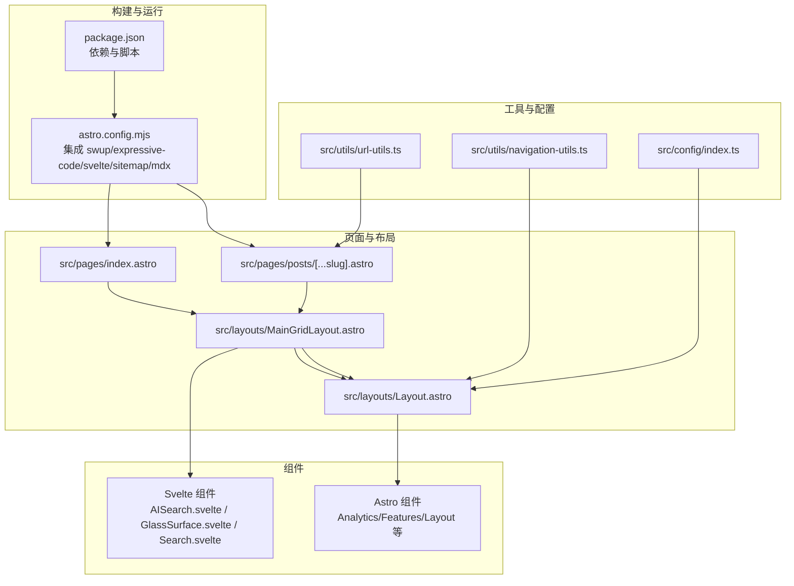
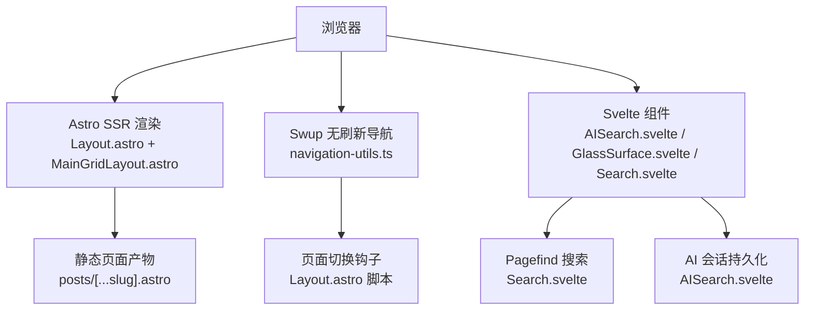
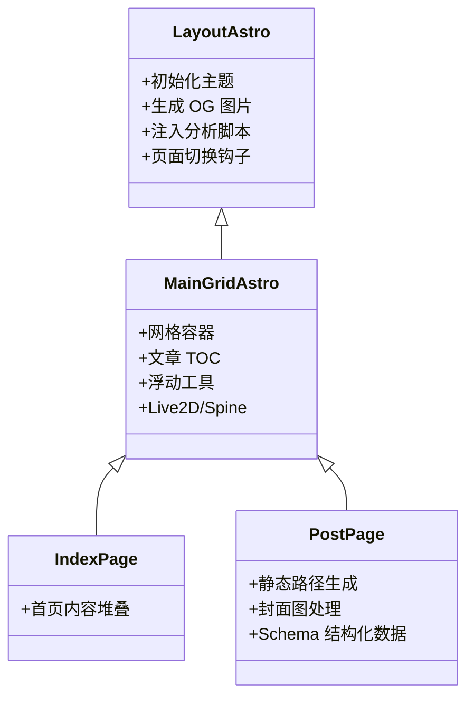
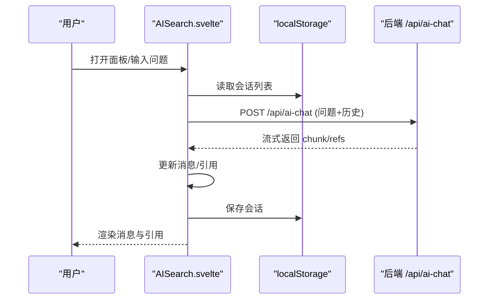
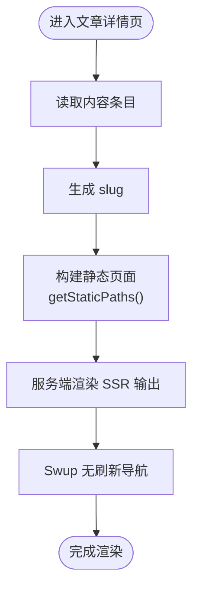
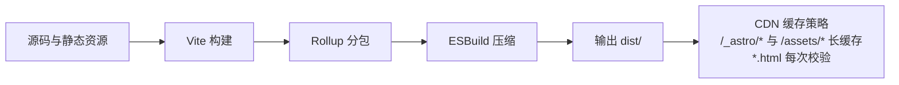
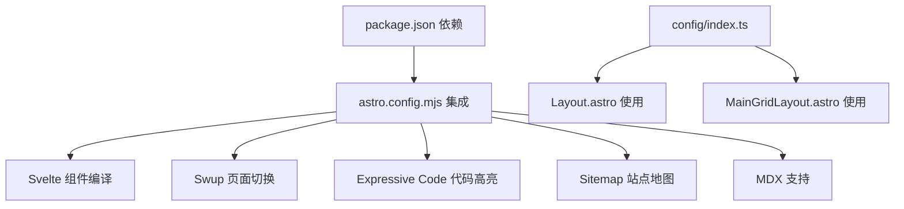

# 前端架构设计

<cite>
**本文档引用的文件**
- [astro.config.mjs](file://astro.config.mjs)
- [svelte.config.js](file://svelte.config.js)
- [package.json](file://package.json)
- [Layout.astro](file://src/layouts/Layout.astro)
- [MainGridLayout.astro](file://src/layouts/MainGridLayout.astro)
- [index.astro](file://src/pages/index.astro)
- [[...slug].astro](file://src/pages/posts/[...slug].astro)
- [navigation-utils.ts](file://src/utils/navigation-utils.ts)
- [url-utils.ts](file://src/utils/url-utils.ts)
- [GlassSurface.svelte](file://src/components/common/GlassSurface.svelte)
- [AISearch.svelte](file://src/components/controls/AISearch.svelte)
- [Search.svelte](file://src/components/controls/Search.svelte)
- [index.ts](file://src/config/index.ts)
</cite>

## 目录
1. [简介](#简介)
2. [项目结构](#项目结构)
3. [核心组件](#核心组件)
4. [架构总览](#架构总览)
5. [详细组件分析](#详细组件分析)
6. [依赖关系分析](#依赖关系分析)
7. [性能考量](#性能考量)
8. [故障排查指南](#故障排查指南)
9. [结论](#结论)
10. [附录](#附录)

## 简介
本文件面向 Firefly-Mod 项目的前端架构设计，围绕基于 Astro 6.x 的混合渲染（SSR 与静态生成）进行深入解析；阐述 Svelte 5 Runes 响应式系统与 Astro 组件的协同方式；梳理布局系统的分层职责（主布局、网格布局、页面布局）；说明前端路由与页面生成策略；并给出静态资源管理与 CDN 优化建议及架构图与组件树。

## 项目结构
项目采用“内容即页面”的 Astro 内容层（Content Layer）与组件化 UI 的混合模式：
- 页面层：通过动态路由生成静态页面（如文章详情页）
- 布局层：通过 Astro 布局组件组合页面结构
- 组件层：包含 Astro 组件与 Svelte 组件，分别承担服务端/客户端职责
- 配置层：集中于 src/config，统一导出站点、导航、字体、音乐等配置
- 工具层：导航、URL 处理、国际化、内容工具等

**图表来源**
- [astro.config.mjs:47-181](file://astro.config.mjs#L47-L181)
- [index.astro:1-19](file://src/pages/index.astro#L1-L19)
- [[...slug].astro](file://src/pages/posts/[...slug].astro#L1-L435)
- [Layout.astro:1-393](file://src/layouts/Layout.astro#L1-L393)
- [MainGridLayout.astro:1-258](file://src/layouts/MainGridLayout.astro#L1-L258)
- [navigation-utils.ts:1-116](file://src/utils/navigation-utils.ts#L1-L116)
- [url-utils.ts:1-55](file://src/utils/url-utils.ts#L1-L55)
- [index.ts:1-66](file://src/config/index.ts#L1-L66)

**章节来源**
- [astro.config.mjs:47-181](file://astro.config.mjs#L47-L181)
- [package.json:1-112](file://package.json#L1-L112)

## 核心组件
- 布局系统
  - Layout.astro：全局 Head 注入、OG 图片生成、主题初始化、脚本与样式加载、页面切换钩子
  - MainGridLayout.astro：网格容器、TOC 管理、浮动工具、Live2D/Spine 模型挂载
- 页面生成
  - index.astro：首页内容堆叠（英雄区、计数器、数据层）
  - posts/[...slug].astro：文章详情页，静态路径生成、封面图处理、Schema 结构化数据、加密文章、相关文章
- 组件生态
  - AISearch.svelte：AI 搜索面板，会话持久化、流式响应、引用文章
  - GlassSurface.svelte：玻璃拟态滤镜组件，响应式尺寸与降级策略
  - Search.svelte：基于 Pagefind 的搜索面板，防抖与定位逻辑
- 导航与路由
  - navigation-utils.ts：统一导航入口，支持 Swup 无刷新跳转与锚点滚动
  - url-utils.ts：URL 规范化、标签/分类/文章链接生成

**章节来源**
- [Layout.astro:1-393](file://src/layouts/Layout.astro#L1-L393)
- [MainGridLayout.astro:1-258](file://src/layouts/MainGridLayout.astro#L1-L258)
- [index.astro:1-19](file://src/pages/index.astro#L1-L19)
- [[...slug].astro](file://src/pages/posts/[...slug].astro#L31-L435)
- [AISearch.svelte:1-594](file://src/components/controls/AISearch.svelte#L1-L594)
- [GlassSurface.svelte:1-391](file://src/components/common/GlassSurface.svelte#L1-L391)
- [Search.svelte:1-245](file://src/components/controls/Search.svelte#L1-L245)
- [navigation-utils.ts:1-116](file://src/utils/navigation-utils.ts#L1-L116)
- [url-utils.ts:1-55](file://src/utils/url-utils.ts#L1-L55)

## 架构总览
整体采用 Astro SSR + 客户端交互增强的混合渲染：
- 构建期
  - 内容层驱动静态页面生成（文章详情页）
  - 插件链路：swup（页面切换）、expressive-code（代码高亮）、sitemap（站点地图）、mdx（MDX 支持）、svelte（Svelte 组件编译）
- 运行期
  - Layout.astro 初始化主题、预连接、OG 图片、页面加载器
  - MainGridLayout.astro 渲染网格与浮动工具，维护 TOC 与侧边栏可见性
  - Svelte 组件在客户端按需加载，提供交互体验

**图表来源**
- [Layout.astro:66-218](file://src/layouts/Layout.astro#L66-L218)
- [MainGridLayout.astro:86-143](file://src/layouts/MainGridLayout.astro#L86-L143)
- [navigation-utils.ts:15-84](file://src/utils/navigation-utils.ts#L15-L84)
- [Search.svelte:75-139](file://src/components/controls/Search.svelte#L75-L139)
- [AISearch.svelte:233-348](file://src/components/controls/AISearch.svelte#L233-L348)

## 详细组件分析

### 布局系统分层设计
- 主布局（Layout.astro）
  - 职责：全局 Head 注入、OG 图片生成、主题初始化、页面加载器、分析脚本、字体管理
  - 特性：根据站点配置决定预连接、预加载、Favicon、主题模式与色调变量注入
- 网格布局（MainGridLayout.astro）
  - 职责：单列主内容容器、文章 TOC 定位与对齐、浮动工具（搜索、AI、隐私、看板娘）
  - 特性：监听 ResizeObserver 实时对齐 TOC 容器高度，适配深浅主题边框
- 页面布局（index.astro / posts/[...slug].astro）
  - 职责：承载具体页面内容，传递标题、描述、语言、OG 类型、文章元信息等给主布局

**图表来源**
- [Layout.astro:1-393](file://src/layouts/Layout.astro#L1-L393)
- [MainGridLayout.astro:1-258](file://src/layouts/MainGridLayout.astro#L1-L258)
- [index.astro:1-19](file://src/pages/index.astro#L1-L19)
- [[...slug].astro](file://src/pages/posts/[...slug].astro#L31-L144)

**章节来源**
- [Layout.astro:33-179](file://src/layouts/Layout.astro#L33-L179)
- [MainGridLayout.astro:43-143](file://src/layouts/MainGridLayout.astro#L43-L143)

### Svelte 5 Runes 与 Astro 组件协同
- AISearch.svelte
  - 使用 $state/$effect/$derived 管理状态与副作用，支持会话持久化、流式响应、引用文章渲染
  - 通过自定义事件与全局变量控制面板开合与焦点
- GlassSurface.svelte
  - 使用 $state/$effect/$props 管理滤镜参数与 DOM 绑定，支持 ResizeObserver 与降级策略
- Search.svelte
  - 使用 $: 响应式表达式与防抖，按需初始化 Pagefind，渲染搜索结果并支持跳转

**图表来源**
- [AISearch.svelte:233-348](file://src/components/controls/AISearch.svelte#L233-L348)
- [AISearch.svelte:81-126](file://src/components/controls/AISearch.svelte#L81-L126)

**章节来源**
- [AISearch.svelte:26-386](file://src/components/controls/AISearch.svelte#L26-L386)
- [GlassSurface.svelte:55-165](file://src/components/common/GlassSurface.svelte#L55-L165)
- [Search.svelte:75-139](file://src/components/controls/Search.svelte#L75-L139)

### 前端路由与页面生成策略
- 静态路径生成
  - posts/[...slug].astro 中通过 getStaticPaths 读取内容目录，将每个条目的 id 转换为 slug，生成静态页面
- URL 规范化
  - url-utils 提供统一的 url、标签/分类/文章链接生成方法，确保 SEO 友好
- 导航策略
  - navigation-utils 提供统一导航入口，优先使用 Swup 无刷新跳转，失败时降级为普通跳转

**图表来源**
- [[...slug].astro](file://src/pages/posts/[...slug].astro#L31-L41)
- [url-utils.ts:23-27](file://src/utils/url-utils.ts#L23-L27)
- [navigation-utils.ts:15-66](file://src/utils/navigation-utils.ts#L15-L66)

**章节来源**
- [[...slug].astro](file://src/pages/posts/[...slug].astro#L31-L144)
- [url-utils.ts:23-54](file://src/utils/url-utils.ts#L23-L54)
- [navigation-utils.ts:15-116](file://src/utils/navigation-utils.ts#L15-L116)

### 静态资源管理与 CDN 优化
- 构建期优化
  - Vite Rollup 分包策略：将数学/绘图/看板娘/GSAP 等第三方库拆分为独立 chunk，便于缓存复用
  - ESBuild 压缩与 drop：移除 console 与 debugger，减小体积
  - CSS 优化：合并与压缩，内联阈值控制
- 部署期缓存策略（示例）
  - /_astro/* → Cache-Control: public, max-age=31536000, immutable（内容哈希，长期缓存）
  - /assets/* → Cache-Control: public, max-age=31536000, immutable（静态资源，长期缓存）
  - *.html → Cache-Control: public, max-age=0, must-revalidate（HTML 文件，始终验证）

**图表来源**
- [astro.config.mjs:256-304](file://astro.config.mjs#L256-L304)

**章节来源**
- [astro.config.mjs:256-304](file://astro.config.mjs#L256-L304)

## 依赖关系分析
- 构建与运行时依赖
  - Astro 6.x、@astrojs/svelte、@swup/astro、astro-expressive-code、@astrojs/sitemap、@astrojs/mdx
  - Svelte 5、TailwindCSS、Pagefind、KaTeX、Mermaid、Three.js、GSAP 等
- 配置聚合
  - config/index.ts 统一导出站点、导航、字体、音乐、看板娘等配置，降低组件导入复杂度

**图表来源**
- [package.json:20-91](file://package.json#L20-L91)
- [astro.config.mjs:66-181](file://astro.config.mjs#L66-L181)
- [index.ts:38-66](file://src/config/index.ts#L38-L66)

**章节来源**
- [package.json:20-91](file://package.json#L20-L91)
- [astro.config.mjs:66-181](file://astro.config.mjs#L66-L181)
- [index.ts:1-66](file://src/config/index.ts#L1-L66)

## 性能考量
- 构建期
  - 启用 queuedRendering 实验特性，优化渲染队列
  - Rollup manualChunks 按功能模块拆分，提升缓存命中率
  - drop console/debugger，减小产物体积
- 运行期
  - Swup 无刷新导航，减少全页重载
  - 主题与字体预连接，缩短首屏等待
  - Pagefind 按需加载，搜索面板懒加载

[本节为通用指导，无需特定文件引用]

## 故障排查指南
- 页面切换异常
  - 检查 Swup 容器与钩子注册（Layout.astro 中的 swup hooks）
  - 确认导航入口 navigateToPage 的 URL 校验与降级逻辑
- 搜索功能不可用
  - 开发环境 Pagefind 不可用，检查初始化事件与防抖逻辑
  - 生产环境确认 pagefind 脚本加载成功
- AI 搜索流式响应中断
  - 检查 /api/ai-chat 接口状态与流式返回格式
  - 确认会话持久化与 AbortController 使用

**章节来源**
- [Layout.astro:276-377](file://src/layouts/Layout.astro#L276-L377)
- [navigation-utils.ts:15-84](file://src/utils/navigation-utils.ts#L15-L84)
- [Search.svelte:112-134](file://src/components/controls/Search.svelte#L112-L134)
- [AISearch.svelte:270-348](file://src/components/controls/AISearch.svelte#L270-L348)

## 结论
本架构以 Astro 6.x 的混合渲染为核心，结合 Svelte 5 Runes 的响应式能力，实现了高性能、可维护的前端体系。通过清晰的布局分层、严格的路由与页面生成策略、完善的静态资源与 CDN 优化，以及组件化的交互体验，整体具备良好的扩展性与可运维性。

## 附录
- 配置聚合入口：config/index.ts
- 构建配置：astro.config.mjs
- Svelte 预处理：svelte.config.js
- 依赖清单：package.json

**章节来源**
- [index.ts:1-66](file://src/config/index.ts#L1-L66)
- [astro.config.mjs:47-307](file://astro.config.mjs#L47-L307)
- [svelte.config.js:1-6](file://svelte.config.js#L1-L6)
- [package.json:1-112](file://package.json#L1-L112)