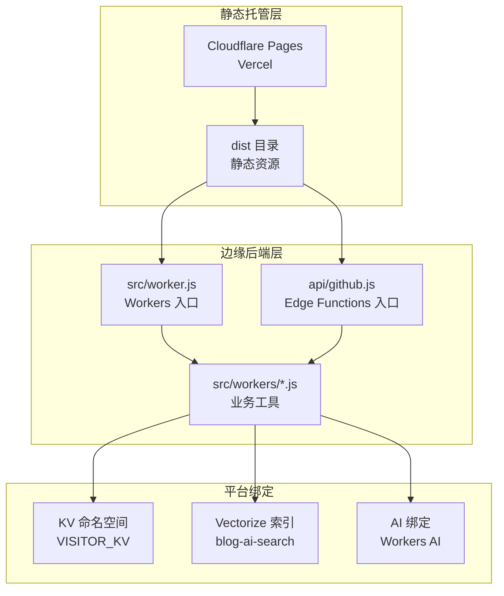
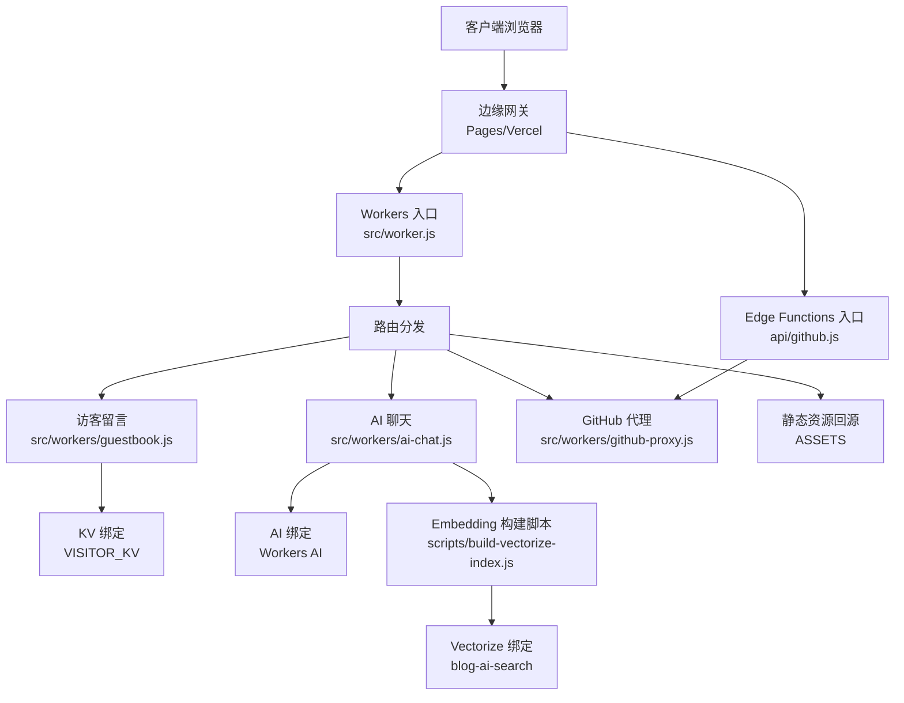
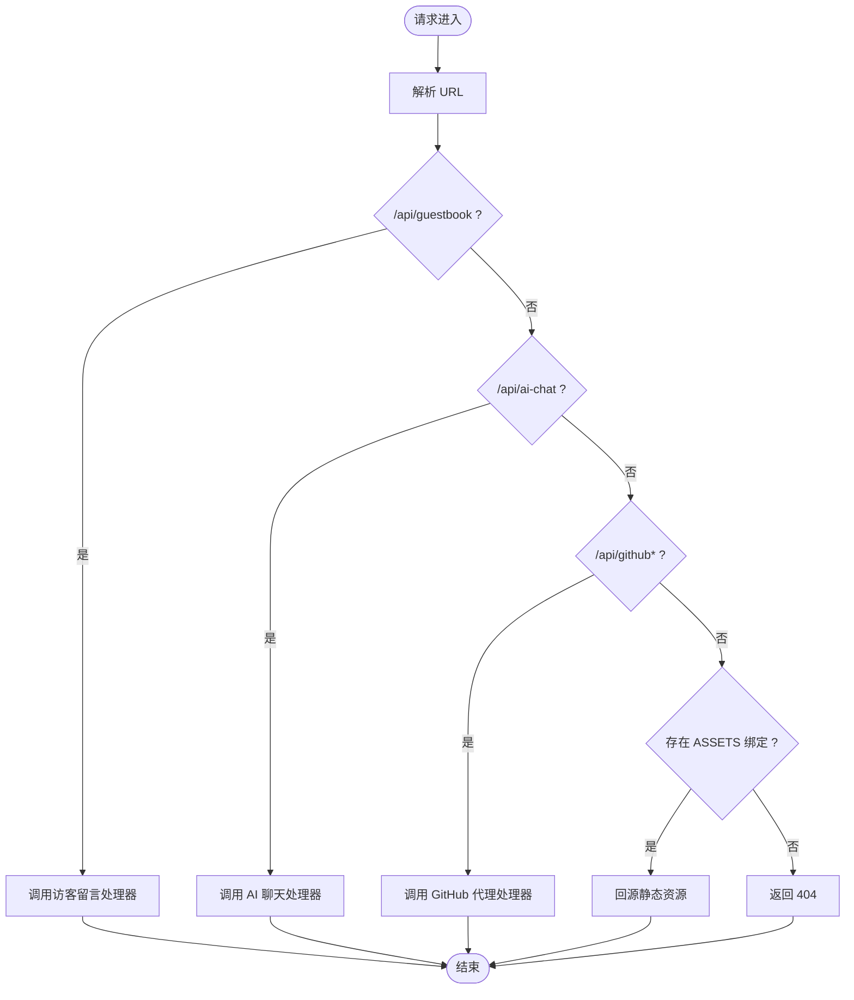
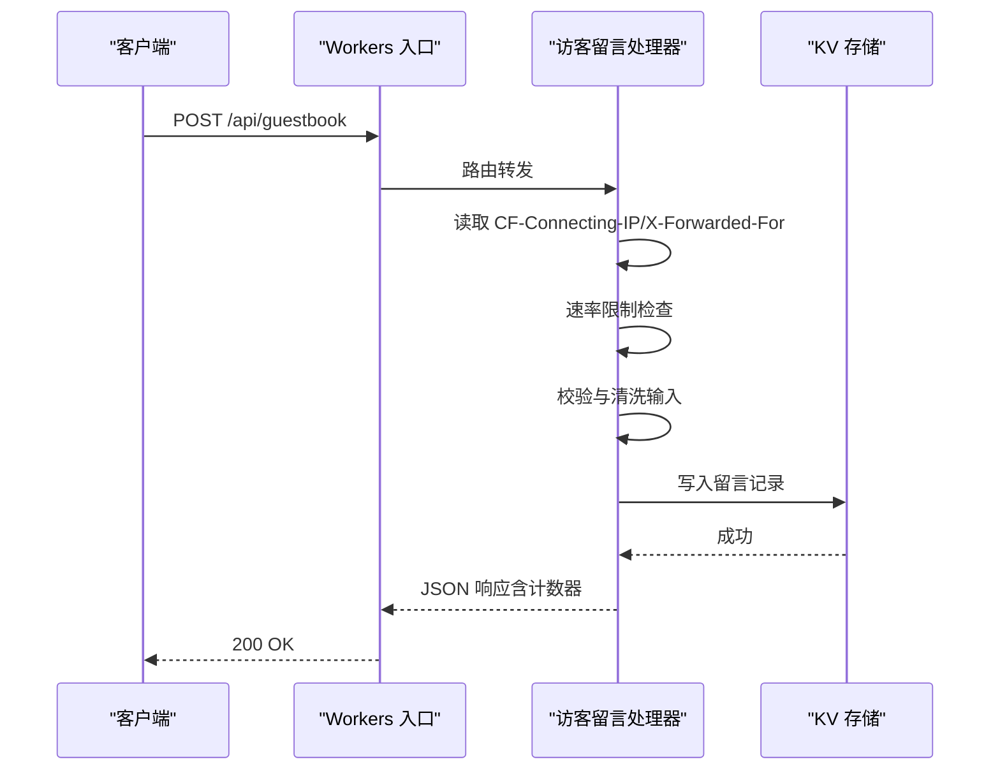
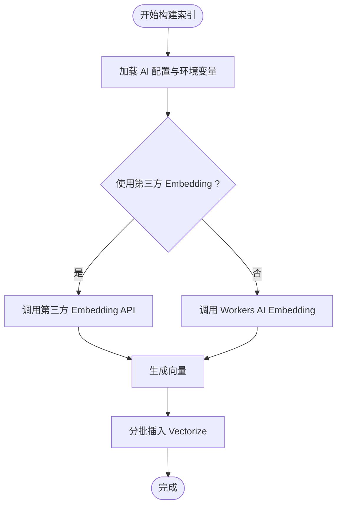
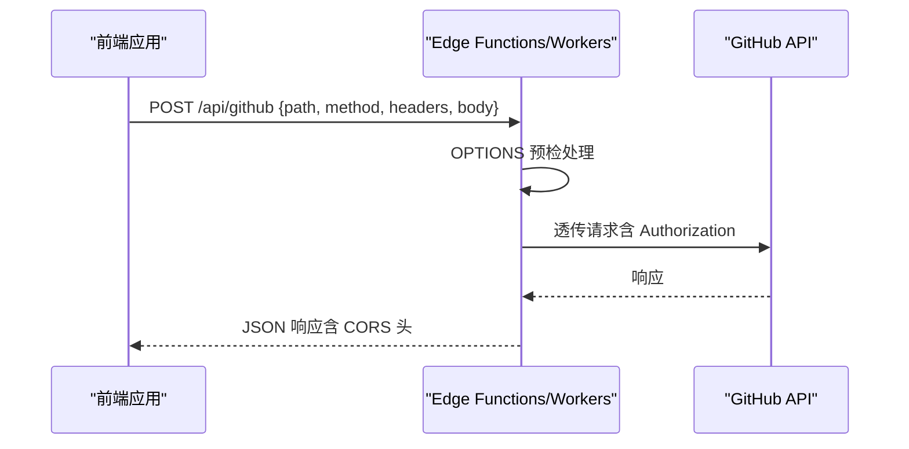
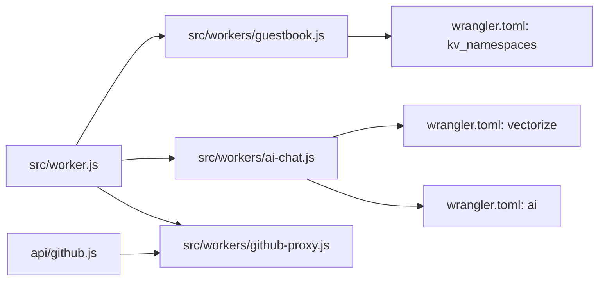

# 后端架构设计

<cite>
**本文档引用的文件**
- [README.md](file://README.md)
- [SKILL.md](file://.trae/skills/fqzlr-blog/SKILL.md)
- [wrangler.toml](file://wrangler.toml)
- [astro.config.mjs](file://astro.config.mjs)
- [src/worker.js](file://src/worker.js)
- [src/workers/ai-chat.js](file://src/workers/ai-chat.js)
- [src/workers/guestbook.js](file://src/workers/guestbook.js)
- [src/workers/github-proxy.js](file://src/workers/github-proxy.js)
- [api/github.js](file://api/github.js)
- [scripts/build-vectorize-index.js](file://scripts/build-vectorize-index.js)
- [src/utils/editMode.ts](file://src/utils/editMode.ts)
- [src/components/features/EncryptedPost.astro](file://src/components/features/EncryptedPost.astro)
- [src/pages/admin/index.astro](file://src/pages/admin/index.astro)
- [src/config/externalMomentsConfig.ts](file://src/config/externalMomentsConfig.ts)
- [src/config/externalNotebooksConfig.ts](file://src/config/externalNotebooksConfig.ts)
- [src/pages/robots.txt.ts](file://src/pages/robots.txt.ts)
</cite>

## 目录
1. [简介](#简介)
2. [项目结构](#项目结构)
3. [核心组件](#核心组件)
4. [架构总览](#架构总览)
5. [详细组件分析](#详细组件分析)
6. [依赖关系分析](#依赖关系分析)
7. [性能考量](#性能考量)
8. [故障排查指南](#故障排查指南)
9. [结论](#结论)
10. [附录](#附录)

## 简介
本项目采用“前端静态 + 边缘无服务器后端”的混合架构：前端使用 Astro 构建静态站点，部署于 Cloudflare Pages 或 Vercel；后端能力通过 Cloudflare Workers 与 Vercel Edge Functions 提供，覆盖 AI 搜索、访客留言、GitHub API 代理、统计埋点等能力。Workers 作为统一入口，集中处理 API 路由与边缘计算任务；同时支持 KV、Vectorize、AI 等 Cloudflare 平台能力，以及与第三方服务（如 Umami、第三方 Embedding API）集成。

## 项目结构
- 静态资源与构建产物：dist 目录由 Astro 构建输出，作为静态托管的根目录。
- Worker 入口：src/worker.js 作为 Cloudflare Workers 的统一入口，负责路由分发与静态资源回源。
- 边缘函数：api/github.js 作为 Vercel Edge Functions 的入口，与 Worker 共享代理逻辑。
- 边缘工具：src/workers/*.js 提供具体业务能力（AI 聊天、访客留言、GitHub 代理）。
- 配置文件：wrangler.toml 定义 Workers 绑定（KV、Vectorize、AI），astro.config.mjs 定义构建与开发代理规则。

图表来源
- [src/worker.js:1-26](file://src/worker.js#L1-L26)
- [api/github.js](file://api/github.js)
- [wrangler.toml:26-35](file://wrangler.toml#L26-L35)

章节来源
- [SKILL.md:304-327](file://.trae/skills/fqzlr-blog/SKILL.md#L304-L327)
- [wrangler.toml:1-35](file://wrangler.toml#L1-L35)
- [astro.config.mjs:245-280](file://astro.config.mjs#L245-L280)

## 核心组件
- Workers 入口与路由分发：统一处理 /api/* 路由，按路径前缀分发至不同处理器；若存在 ASSETS 绑定则回源静态资源。
- 边缘工具模块：
  - AI 聊天：对接 Workers AI 或第三方 LLM，返回流式/非流式响应。
  - 访客留言：KV 存储、输入校验、速率限制、HTML 转义、计数器。
  - GitHub 代理：CORS 透传、鉴权头透传、支持完整 URL 与相对路径两种调用方式。
- 平台绑定：
  - KV：访客留言计数与消息持久化。
  - Vectorize：AI 搜索向量索引，配合 Embedding 构建与查询。
  - AI：Workers AI 接口绑定。
- 部署与缓存：
  - Cloudflare Pages：通过 wrangler.toml 的 assets 字段绑定 dist 目录。
  - Vercel：通过 vercel.json 输出目录指向 dist。
  - 构建期 Rollup 分包与压缩，开发期代理 /api* 到本地 Worker。

章节来源
- [src/worker.js:1-26](file://src/worker.js#L1-L26)
- [src/workers/ai-chat.js](file://src/workers/ai-chat.js)
- [src/workers/guestbook.js:108-153](file://src/workers/guestbook.js#L108-L153)
- [src/workers/github-proxy.js:1-48](file://src/workers/github-proxy.js#L1-L48)
- [wrangler.toml:26-35](file://wrangler.toml#L26-L35)
- [astro.config.mjs:245-280](file://astro.config.mjs#L245-L280)

## 架构总览
整体架构采用“静态站点 + 边缘无服务器”的模式。静态资源由 Pages/Vercel 托管，请求到达边缘后根据路径分发到 Workers 或 Edge Functions；Workers 负责统一路由与平台绑定访问；Edge Functions 与 Workers 共享代理逻辑，保证两端行为一致。

图表来源
- [src/worker.js:1-26](file://src/worker.js#L1-L26)
- [api/github.js](file://api/github.js)
- [src/workers/guestbook.js:108-153](file://src/workers/guestbook.js#L108-L153)
- [src/workers/ai-chat.js](file://src/workers/ai-chat.js)
- [src/workers/github-proxy.js:1-48](file://src/workers/github-proxy.js#L1-L48)
- [scripts/build-vectorize-index.js:62-97](file://scripts/build-vectorize-index.js#L62-L97)
- [wrangler.toml:26-35](file://wrangler.toml#L26-L35)

## 详细组件分析

### Workers 入口与路由分发
- 路由规则：
  - /api/guestbook → 访客留言处理器
  - /api/ai-chat → AI 聊天处理器
  - /api/github 或 /api/github/* → GitHub 代理处理器
  - 其余请求 → 若存在 ASSETS 绑定则回源静态资源
- 设计要点：
  - 单一入口简化运维与可观测性
  - 明确的路径前缀避免冲突
  - 静态资源回源减少后端压力

图表来源
- [src/worker.js:1-26](file://src/worker.js#L1-L26)

章节来源
- [src/worker.js:1-26](file://src/worker.js#L1-L26)

### 访客留言（Guestbook）组件
- 功能范围：创建留言、读取单条、列表分页、输入校验、HTML 转义、速率限制、KV 存储计数与消息。
- 关键流程：
  - IP 识别与速率限制
  - 输入清洗与校验
  - KV 写入与计数器递增
  - 响应头统一设置
- 安全要点：对用户输入进行 HTML 转义，防止 XSS；速率限制缓解垃圾请求。

图表来源
- [src/workers/guestbook.js:108-153](file://src/workers/guestbook.js#L108-L153)

章节来源
- [src/workers/guestbook.js:108-153](file://src/workers/guestbook.js#L108-L153)

### AI 聊天组件
- 功能范围：支持 Workers AI 默认模型与第三方 Embedding API；向量索引构建脚本支持批量插入与删除。
- 关键流程：
  - 选择 Embedding 源（Cloudflare Workers AI 或第三方）
  - 生成向量并批量插入 Vectorize
  - 查询时可结合元数据过滤
- 配置要点：通过环境变量与配置文件控制模型、维度、批次大小等参数。

图表来源
- [scripts/build-vectorize-index.js:62-97](file://scripts/build-vectorize-index.js#L62-L97)
- [scripts/build-vectorize-index.js:177-216](file://scripts/build-vectorize-index.js#L177-L216)
- [scripts/build-vectorize-index.js:226-245](file://scripts/build-vectorize-index.js#L226-L245)

章节来源
- [scripts/build-vectorize-index.js:62-97](file://scripts/build-vectorize-index.js#L62-L97)
- [scripts/build-vectorize-index.js:177-216](file://scripts/build-vectorize-index.js#L177-L216)
- [scripts/build-vectorize-index.js:226-245](file://scripts/build-vectorize-index.js#L226-L245)

### GitHub 代理组件
- 功能范围：解决浏览器 CORS 限制，透传 Authorization 等头部，支持完整 URL 与相对路径两种调用方式。
- 设计要点：前端传递认证信息，服务端不存储密钥；统一 CORS 头部与预检处理。

图表来源
- [src/workers/github-proxy.js:1-48](file://src/workers/github-proxy.js#L1-L48)
- [api/github.js](file://api/github.js)

章节来源
- [src/workers/github-proxy.js:1-48](file://src/workers/github-proxy.js#L1-L48)
- [api/github.js](file://api/github.js)

### 静态资源分发与缓存策略
- 静态托管：Cloudflare Pages 通过 ASSETS 绑定 dist 目录；Vercel 通过 vercel.json 输出目录指向 dist。
- 缓存策略：构建期 Rollup 分包与压缩；开发代理 /api* 到本地 Worker；生产环境由平台配置缓存头（/_astro/*、/assets/*、*.html）。

章节来源
- [astro.config.mjs:245-280](file://astro.config.mjs#L245-L280)
- [wrangler.toml:5-7](file://wrangler.toml#L5-L7)

### 安全架构设计
- 认证授权：
  - 后台管理：管理员密码采用 SHA-256 哈希存储，前端交互包含密码校验与变更流程。
  - GitHub 集成：通过 JWT 与安装令牌获取访问权限，支持单独仓库 Token。
- 数据加密与访问控制：
  - 文章内容加密：前端使用 WebCrypto 对内容进行 AES-GCM 加密，密码在会话内缓存以提升体验。
  - 输入净化：访客留言对输入进行 HTML 转义，降低 XSS 风险。
- 访问控制与合规：
  - robots.txt 禁止爬虫抓取内部资源路径。
  - CORS 头统一设置，支持跨域安全策略。

章节来源
- [src/components/features/EncryptedPost.astro:1-256](file://src/components/features/EncryptedPost.astro#L1-L256)
- [src/workers/guestbook.js:108-153](file://src/workers/guestbook.js#L108-L153)
- [src/utils/editMode.ts:113-150](file://src/utils/editMode.ts#L113-L150)
- [src/pages/admin/index.astro:1376-1400](file://src/pages/admin/index.astro#L1376-L1400)
- [src/pages/robots.txt.ts:1-16](file://src/pages/robots.txt.ts#L1-L16)

## 依赖关系分析
- 组件耦合：
  - Workers 入口与各处理器松耦合，通过路径前缀解耦。
  - Edge Functions 与 Workers 共享代理逻辑，降低维护成本。
- 外部依赖：
  - Cloudflare：KV、Vectorize、AI 绑定。
  - 第三方：Umami 统计、第三方 Embedding API。
- 配置契约：
  - wrangler.toml 定义 KV/Vectorize/AI 绑定名称与索引名。
  - 构建配置定义开发代理与缓存头策略。

图表来源
- [src/worker.js:1-26](file://src/worker.js#L1-L26)
- [api/github.js](file://api/github.js)
- [wrangler.toml:26-35](file://wrangler.toml#L26-L35)

章节来源
- [src/worker.js:1-26](file://src/worker.js#L1-L26)
- [api/github.js](file://api/github.js)
- [wrangler.toml:26-35](file://wrangler.toml#L26-L35)

## 性能考量
- 边缘就近：Workers 与 Edge Functions 在全球节点执行，降低网络延迟。
- 静态资源：/_astro/* 与 /assets/* 长期缓存，HTML 文件按需验证，减少带宽与渲染时间。
- 构建优化：Rollup 分包与压缩，减小首屏体积；按需 vendor 分块。
- AI 搜索：Vectorize 索引与 Embedding 批处理，降低查询延迟与 API 调用次数。
- 速率限制：访客留言接口内置速率限制，缓解突发流量与滥用风险。

章节来源
- [astro.config.mjs:245-280](file://astro.config.mjs#L245-L280)
- [scripts/build-vectorize-index.js:62-97](file://scripts/build-vectorize-index.js#L62-L97)
- [src/workers/guestbook.js:108-153](file://src/workers/guestbook.js#L108-L153)

## 故障排查指南
- Workers 404：
  - 检查 ASSETS 绑定是否存在；确认路径前缀是否匹配。
- GitHub 代理失败：
  - 确认前端是否正确传递 Authorization 头；检查预检 OPTIONS 是否返回 204。
- 访客留言异常：
  - 查看速率限制返回的 Retry-After；核对输入长度与格式；检查 KV 写入状态。
- AI 搜索向量构建失败：
  - 检查 CLOUDFLARE_API_TOKEN 与 ACCOUNT_ID；确认索引名与绑定一致；查看嵌入维度与批次配置。
- 统计埋点：
  - 确认 UMAMI_TOKEN 与站点 ID 配置；检查 UA 与版本头是否正确。

章节来源
- [src/worker.js:1-26](file://src/worker.js#L1-L26)
- [src/workers/github-proxy.js:1-48](file://src/workers/github-proxy.js#L1-L48)
- [src/workers/guestbook.js:108-153](file://src/workers/guestbook.js#L108-L153)
- [scripts/build-vectorize-index.js:62-97](file://scripts/build-vectorize-index.js#L62-L97)
- [wrangler.toml:8-25](file://wrangler.toml#L8-L25)

## 结论
本项目通过“静态站点 + 边缘无服务器”的架构实现了高性能、低运维成本的后端能力。Workers 作为统一入口，结合 KV、Vectorize、AI 等平台能力，满足 AI 搜索、访客留言、GitHub 代理等需求；Edge Functions 与 Workers 共享代理逻辑，确保两端一致性。通过合理的缓存策略、速率限制与安全措施，系统具备良好的扩展性与稳定性。

## 附录
- 部署平台支持与配置差异详见技能说明文档与部署清单。
- 平台绑定与配置文件位置：
  - Cloudflare：wrangler.toml
  - Vercel：vercel.json（由 Astro 配置输出目录）

章节来源
- [README.md:138-181](file://README.md#L138-L181)
- [SKILL.md:304-327](file://.trae/skills/fqzlr-blog/SKILL.md#L304-L327)
- [wrangler.toml:1-35](file://wrangler.toml#L1-L35)