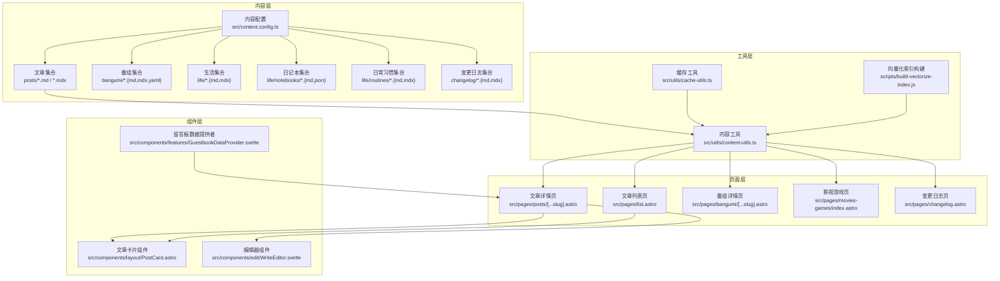
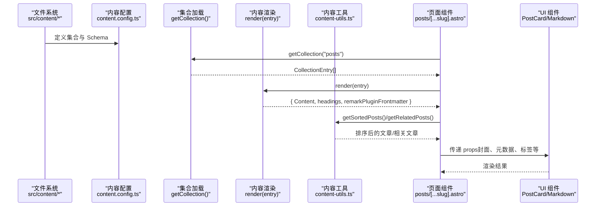
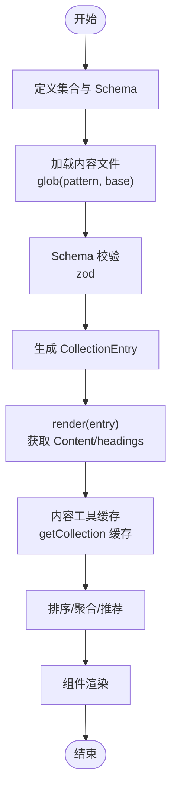
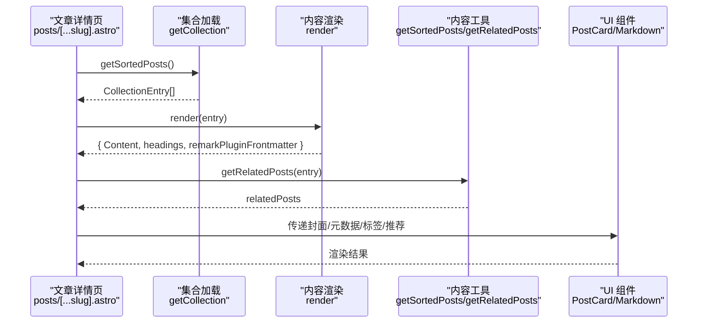
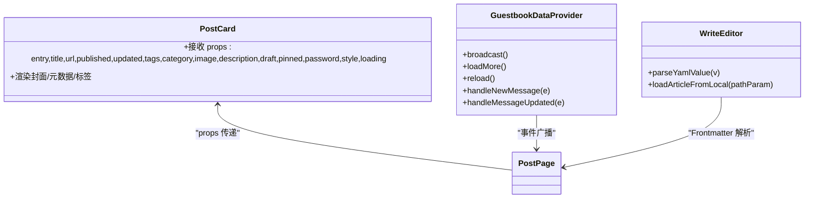
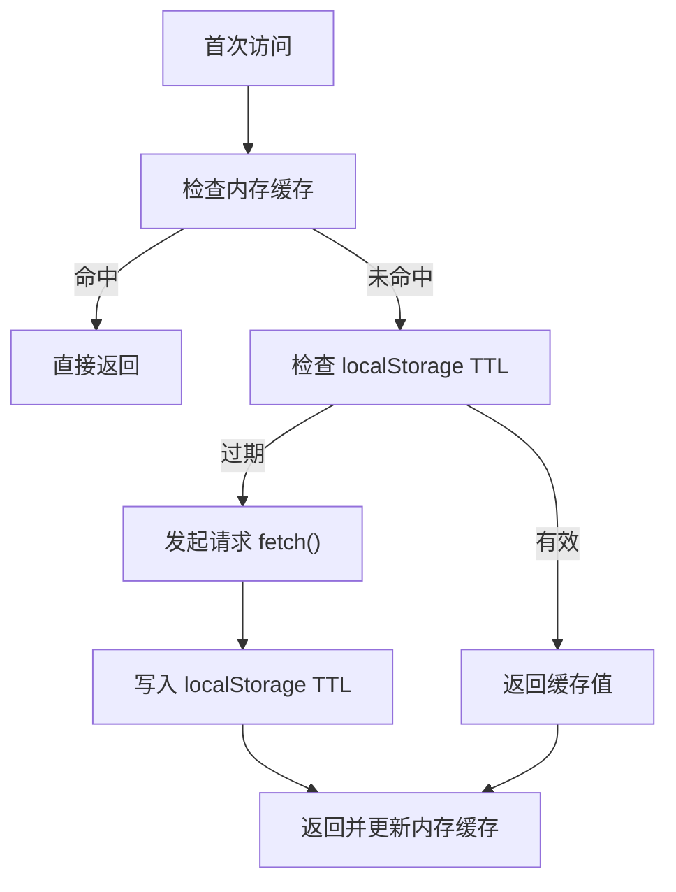
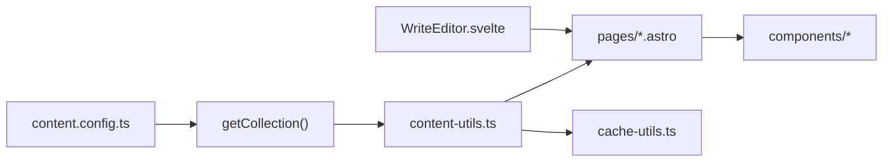

# 数据流设计

<cite>
**本文引用的文件**   
- [src/content.config.ts](file://src/content.config.ts)
- [src/utils/content-utils.ts](file://src/utils/content-utils.ts)
- [src/pages/posts/[...slug].astro](file://src/pages/posts/[...slug].astro)
- [src/pages/list.astro](file://src/pages/list.astro)
- [src/pages/bangumi/[...slug].astro](file://src/pages/bangumi/[...slug].astro)
- [src/pages/movies-games/index.astro](file://src/pages/movies-games/index.astro)
- [src/pages/changelog.astro](file://src/pages/changelog.astro)
- [src/utils/cache-utils.ts](file://src/utils/cache-utils.ts)
- [src/components/layout/PostCard.astro](file://src/components/layout/PostCard.astro)
- [src/components/edit/WriteEditor.svelte](file://src/components/edit/WriteEditor.svelte)
- [_frontmatter.json](file://_frontmatter.json)
- [scripts/build-vectorize-index.js](file://scripts/build-vectorize-index.js)
- [src/components/features/GuestbookDataProvider.svelte](file://src/components/features/GuestbookDataProvider.svelte)
</cite>

## 目录
1. [引言](#引言)
2. [项目结构](#项目结构)
3. [核心组件](#核心组件)
4. [架构总览](#架构总览)
5. [详细组件分析](#详细组件分析)
6. [依赖关系分析](#依赖关系分析)
7. [性能考量](#性能考量)
8. [故障排查指南](#故障排查指南)
9. [结论](#结论)
10. [附录](#附录)

## 引言
本设计文档聚焦于 Firefly-Mod 项目的“数据流设计”，围绕 Astro Content Collections 的内容组织与管理模式展开，系统阐述从内容源到渲染层的完整数据流转过程，覆盖 Markdown 解析、Frontmatter 处理、Schema 校验与查询优化；同时分析组件间的数据传递机制（Props、事件冒泡、状态提升），并给出缓存策略（内存缓存、持久化存储、CDN 缓存）的协调方案。文末提供数据流图与时序图，帮助读者快速把握关键操作的数据变化轨迹，并讨论数据一致性与并发控制。

## 项目结构
项目采用 Astro + Svelte 的混合前端架构，内容通过 Astro Content Collections 统一采集与校验，页面组件负责渲染与交互，工具函数提供缓存与内容聚合逻辑。关键目录与职责概览如下：
- src/content.config.ts：定义各内容集合（posts、bangumi、life、notebooks、routines、changelog 等）及其加载器与 Schema 校验规则
- src/utils/content-utils.ts：对内容集合进行排序、聚合、标签/分类统计、相关文章推荐等计算
- src/pages/*.astro：页面级异步组件，负责调用 getCollection/render，组装页面所需数据并驱动子组件渲染
- src/utils/cache-utils.ts：基于 localStorage 的 TTL 缓存实现，支持并发去抖（in-flight 去重）
- src/components/*：通用组件与业务组件，接收来自页面或工具函数的数据，完成 UI 渲染与交互
- scripts/build-vectorize-index.js：构建向量化索引的构建脚本，用于全文检索增强
- src/components/edit/WriteEditor.svelte：编辑器侧 Frontmatter 解析与本地文件加载逻辑

图表来源
- [src/content.config.ts:1-185](file://src/content.config.ts#L1-L185)
- [src/utils/content-utils.ts:1-269](file://src/utils/content-utils.ts#L1-L269)
- [src/utils/cache-utils.ts:1-103](file://src/utils/cache-utils.ts#L1-L103)
- [src/pages/posts/[...slug].astro:1-435](file://src/pages/posts/[...slug].astro#L1-L435)
- [src/pages/list.astro:1-46](file://src/pages/list.astro#L1-L46)
- [src/pages/bangumi/[...slug].astro:1-39](file://src/pages/bangumi/[...slug].astro#L1-L39)
- [src/pages/movies-games/index.astro:1-47](file://src/pages/movies-games/index.astro#L1-L47)
- [src/pages/changelog.astro:1-53](file://src/pages/changelog.astro#L1-L53)
- [src/components/layout/PostCard.astro:1-53](file://src/components/layout/PostCard.astro#L1-L53)
- [src/components/edit/WriteEditor.svelte:219-260](file://src/components/edit/WriteEditor.svelte#L219-L260)
- [scripts/build-vectorize-index.js:92-139](file://scripts/build-vectorize-index.js#L92-L139)

章节来源
- [src/content.config.ts:1-185](file://src/content.config.ts#L1-L185)
- [src/utils/content-utils.ts:1-269](file://src/utils/content-utils.ts#L1-L269)
- [src/utils/cache-utils.ts:1-103](file://src/utils/cache-utils.ts#L1-L103)
- [src/pages/posts/[...slug].astro:1-435](file://src/pages/posts/[...slug].astro#L1-L435)
- [src/pages/list.astro:1-46](file://src/pages/list.astro#L1-L46)
- [src/pages/bangumi/[...slug].astro:1-39](file://src/pages/bangumi/[...slug].astro#L1-L39)
- [src/pages/movies-games/index.astro:1-47](file://src/pages/movies-games/index.astro#L1-L47)
- [src/pages/changelog.astro:1-53](file://src/pages/changelog.astro#L1-L53)
- [src/components/layout/PostCard.astro:1-53](file://src/components/layout/PostCard.astro#L1-L53)
- [src/components/edit/WriteEditor.svelte:219-260](file://src/components/edit/WriteEditor.svelte#L219-L260)
- [scripts/build-vectorize-index.js:92-139](file://scripts/build-vectorize-index.js#L92-L139)

## 核心组件
- 内容集合定义与校验
  - posts：定义文章字段（标题、发布时间、草稿、描述、封面、标签、分类、语言、置顶、作者、源链接、许可信息、评论开关、排序等），并包含内部导航字段 prevTitle/prevSlug/nextTitle/nextSlug
  - bangumi：支持 md/mdx/yaml/yml，定义番组类型、状态、图片、链接、评分、音乐特有字段等
  - life/notebooks/routines/changelog：分别承载生活记录、日记本、日常习惯与变更日志的结构化数据
- 页面渲染与数据装配
  - 文章详情页：调用 render(entry) 获取 Markdown 内容与 headings，结合封面、作者头像、Schema 结构化数据生成 JSON-LD
  - 列表页：通过 getSortedPosts 获取已排序的文章列表，供虚拟列表与卡片组件消费
  - 番组/影视游戏/变更日志页：统一使用 getCollection 获取集合，再进行过滤、排序与映射
- 工具函数
  - 内容工具：提供文章排序、标签/分类统计、相关文章推荐、标题分词与相似度计算
  - 缓存工具：localStorage TTL 缓存，支持 fetch 去抖，避免重复请求
- 编辑器与 Frontmatter
  - 编辑器侧解析 Frontmatter，支持布尔/数字/日期/字符串等类型转换，并从本地文件系统加载文章

章节来源
- [src/content.config.ts:5-31](file://src/content.config.ts#L5-L31)
- [src/content.config.ts:57-84](file://src/content.config.ts#L57-L84)
- [src/content.config.ts:86-131](file://src/content.config.ts#L86-L131)
- [src/content.config.ts:133-149](file://src/content.config.ts#L133-L149)
- [src/content.config.ts:151-164](file://src/content.config.ts#L151-L164)
- [src/content.config.ts:165-174](file://src/content.config.ts#L165-L174)
- [src/pages/posts/[...slug].astro:31-41](file://src/pages/posts/[...slug].astro#L31-L41)
- [src/pages/list.astro:28](file://src/pages/list.astro#L28)
- [src/pages/bangumi/[...slug].astro:9-15](file://src/pages/bangumi/[...slug].astro#L9-L15)
- [src/pages/movies-games/index.astro:20-22](file://src/pages/movies-games/index.astro#L20-L22)
- [src/pages/changelog.astro:14](file://src/pages/changelog.astro#L14)
- [src/utils/content-utils.ts:9-15](file://src/utils/content-utils.ts#L9-L15)
- [src/utils/content-utils.ts:33-46](file://src/utils/content-utils.ts#L33-L46)
- [src/utils/cache-utils.ts:31-103](file://src/utils/cache-utils.ts#L31-L103)
- [src/components/edit/WriteEditor.svelte:243-260](file://src/components/edit/WriteEditor.svelte#L243-L260)

## 架构总览
下图展示了从内容源到渲染层的关键数据流：内容集合经由 Astro Content Collections 加载与校验，页面异步组件调用 render 获取 Markdown AST 与 headings，随后通过工具函数进行排序、聚合与推荐计算，最终由组件树渲染输出。

图表来源
- [src/content.config.ts:1-185](file://src/content.config.ts#L1-L185)
- [src/pages/posts/[...slug].astro:31-41](file://src/pages/posts/[...slug].astro#L31-L41)
- [src/pages/posts/[...slug].astro:44](file://src/pages/posts/[...slug].astro#L44)
- [src/utils/content-utils.ts:9-15](file://src/utils/content-utils.ts#L9-L15)
- [src/utils/content-utils.ts:33-46](file://src/utils/content-utils.ts#L33-L46)
- [src/components/layout/PostCard.astro:13-44](file://src/components/layout/PostCard.astro#L13-L44)

## 详细组件分析

### 内容集合与元数据处理
- 集合定义
  - posts：严格约束字段类型与默认值，包含内部导航字段 prevTitle/prevSlug/nextTitle/nextSlug，便于上一篇/下一篇的无缝跳转
  - bangumi：动态 Schema 支持 image 字段的联合类型，兼容字符串与对象；枚举状态字段确保数据一致性
  - life/notebooks/routines/changelog：针对不同业务场景提供细粒度字段与默认值
- Frontmatter 处理
  - 页面端通过 render(entry) 获取 remark 插件提供的 words/minutes 等统计信息
  - 编辑器侧通过 parseYamlValue 实现布尔/数字/日期/字符串等类型的 Frontmatter 值解析
  - Front Matter VSCode 插件配置文件 _frontmatter.json 提供可视化编辑体验与字段约束
- 查询优化
  - 内容工具对文章集合进行内存缓存，生产环境过滤草稿，减少重复计算
  - 排序与相关推荐采用预计算与打分策略，降低渲染阶段开销

图表来源
- [src/content.config.ts:5-31](file://src/content.config.ts#L5-L31)
- [src/content.config.ts:57-84](file://src/content.config.ts#L57-L84)
- [src/pages/posts/[...slug].astro:44](file://src/pages/posts/[...slug].astro#L44)
- [src/utils/content-utils.ts:9-15](file://src/utils/content-utils.ts#L9-L15)
- [src/utils/content-utils.ts:33-46](file://src/utils/content-utils.ts#L33-L46)
- [_frontmatter.json:1-67](file://_frontmatter.json#L1-L67)
- [src/components/edit/WriteEditor.svelte:225-240](file://src/components/edit/WriteEditor.svelte#L225-L240)

章节来源
- [src/content.config.ts:5-31](file://src/content.config.ts#L5-L31)
- [src/content.config.ts:57-84](file://src/content.config.ts#L57-L84)
- [src/content.config.ts:86-131](file://src/content.config.ts#L86-L131)
- [src/content.config.ts:133-149](file://src/content.config.ts#L133-L149)
- [src/content.config.ts:151-164](file://src/content.config.ts#L151-L164)
- [src/content.config.ts:165-174](file://src/content.config.ts#L165-L174)
- [src/pages/posts/[...slug].astro:44](file://src/pages/posts/[...slug].astro#L44)
- [src/utils/content-utils.ts:9-15](file://src/utils/content-utils.ts#L9-L15)
- [src/utils/content-utils.ts:33-46](file://src/utils/content-utils.ts#L33-L46)
- [_frontmatter.json:1-67](file://_frontmatter.json#L1-L67)
- [src/components/edit/WriteEditor.svelte:225-240](file://src/components/edit/WriteEditor.svelte#L225-L240)

### 页面渲染与数据装配流程
- 文章详情页
  - 通过 getStaticPaths 生成静态路径，props 中携带 entry
  - render(entry) 返回 Content、headings 与 remark 统计信息
  - 处理封面与头像的本地资源解析，生成 JSON-LD 结构化数据
  - 计算相关文章并传递给推荐组件
- 列表页
  - 调用 getSortedPosts 获取已排序文章，配合图片资源映射与国际化格式化
- 番组/影视游戏/变更日志页
  - 统一使用 getCollection 获取集合，再进行过滤、排序与映射

图表来源
- [src/pages/posts/[...slug].astro:31-41](file://src/pages/posts/[...slug].astro#L31-L41)
- [src/pages/posts/[...slug].astro:44](file://src/pages/posts/[...slug].astro#L44)
- [src/pages/posts/[...slug].astro:143](file://src/pages/posts/[...slug].astro#L143)
- [src/utils/content-utils.ts:33-46](file://src/utils/content-utils.ts#L33-L46)
- [src/utils/content-utils.ts:187-268](file://src/utils/content-utils.ts#L187-L268)
- [src/components/layout/PostCard.astro:13-44](file://src/components/layout/PostCard.astro#L13-L44)

章节来源
- [src/pages/posts/[...slug].astro:31-41](file://src/pages/posts/[...slug].astro#L31-L41)
- [src/pages/posts/[...slug].astro:44](file://src/pages/posts/[...slug].astro#L44)
- [src/pages/posts/[...slug].astro:143](file://src/pages/posts/[...slug].astro#L143)
- [src/pages/list.astro:28](file://src/pages/list.astro#L28)
- [src/pages/bangumi/[...slug].astro:9-15](file://src/pages/bangumi/[...slug].astro#L9-L15)
- [src/pages/movies-games/index.astro:20-22](file://src/pages/movies-games/index.astro#L20-L22)
- [src/pages/changelog.astro:14](file://src/pages/changelog.astro#L14)
- [src/utils/content-utils.ts:33-46](file://src/utils/content-utils.ts#L33-L46)
- [src/utils/content-utils.ts:187-268](file://src/utils/content-utils.ts#L187-L268)
- [src/components/layout/PostCard.astro:13-44](file://src/components/layout/PostCard.astro#L13-L44)

### 组件间数据传递机制
- Props 传递
  - 文章卡片组件接收 CollectionEntry 的 data 字段与 URL、封面等派生信息
  - 文章详情页将封面处理结果、元数据、标签、推荐文章等作为 props 下发
- 事件冒泡与状态提升
  - 留言板数据提供者通过自定义事件广播数据更新，实现跨组件状态同步
  - 编辑器组件在本地加载文章时，解析 Frontmatter 并回填到编辑界面
- 状态提升策略
  - 将全局状态（如留言列表）提升至数据提供者组件，由其统一管理加载、追加、刷新与广播

图表来源
- [src/components/layout/PostCard.astro:13-44](file://src/components/layout/PostCard.astro#L13-L44)
- [src/components/features/GuestbookDataProvider.svelte:48-106](file://src/components/features/GuestbookDataProvider.svelte#L48-L106)
- [src/components/edit/WriteEditor.svelte:225-240](file://src/components/edit/WriteEditor.svelte#L225-L240)
- [src/components/edit/WriteEditor.svelte:243-260](file://src/components/edit/WriteEditor.svelte#L243-L260)

章节来源
- [src/components/layout/PostCard.astro:13-44](file://src/components/layout/PostCard.astro#L13-L44)
- [src/components/features/GuestbookDataProvider.svelte:48-106](file://src/components/features/GuestbookDataProvider.svelte#L48-L106)
- [src/components/edit/WriteEditor.svelte:225-240](file://src/components/edit/WriteEditor.svelte#L225-L240)
- [src/components/edit/WriteEditor.svelte:243-260](file://src/components/edit/WriteEditor.svelte#L243-L260)

### 缓存策略设计
- 内存缓存
  - 内容工具对 getCollection("posts") 的结果进行内存缓存，生产环境过滤草稿，避免重复 IO
- 持久化存储
  - 缓存工具基于 localStorage 实现 TTL 缓存，支持并发去抖（inFlight Map），防止重复请求
- CDN 缓存
  - 页面构建后静态产物可由 CDN 缓存；封面与头像等资源建议开启缓存头与版本化路径，以平衡新鲜度与性能
- 协调机制
  - 编辑器侧本地文件读取与 Frontmatter 解析不依赖网络，避免与线上缓存冲突
  - 构建脚本生成向量化索引，用于搜索增强，建议在 CI 中增量构建并缓存结果

图表来源
- [src/utils/content-utils.ts:9-15](file://src/utils/content-utils.ts#L9-L15)
- [src/utils/cache-utils.ts:34-63](file://src/utils/cache-utils.ts#L34-L63)
- [src/utils/cache-utils.ts:79-101](file://src/utils/cache-utils.ts#L79-L101)

章节来源
- [src/utils/content-utils.ts:9-15](file://src/utils/content-utils.ts#L9-L15)
- [src/utils/cache-utils.ts:34-63](file://src/utils/cache-utils.ts#L34-L63)
- [src/utils/cache-utils.ts:79-101](file://src/utils/cache-utils.ts#L79-L101)

### 数据一致性与并发控制
- 数据一致性
  - 通过 zod Schema 在入库阶段强制字段类型与默认值，减少运行时异常
  - 文章排序与导航字段在生成阶段计算，保证前后文跳转的一致性
- 并发控制
  - 缓存工具的 inFlight Map 避免同一 key 的重复请求
  - 页面渲染阶段的 render(entry) 串行执行，确保内容稳定

章节来源
- [src/content.config.ts:7-30](file://src/content.config.ts#L7-L30)
- [src/utils/cache-utils.ts:65-101](file://src/utils/cache-utils.ts#L65-L101)
- [src/pages/posts/[...slug].astro:44](file://src/pages/posts/[...slug].astro#L44)

## 依赖关系分析
- 内容配置对集合加载与校验具有中心作用，页面与工具函数均依赖其定义
- 页面组件对内容工具存在强依赖，内容工具又依赖集合加载与缓存工具
- 组件层通过 props 与事件实现解耦，数据自上而下传递，事件自下而上冒泡

图表来源
- [src/content.config.ts:1-185](file://src/content.config.ts#L1-L185)
- [src/utils/content-utils.ts:1-269](file://src/utils/content-utils.ts#L1-L269)
- [src/utils/cache-utils.ts:1-103](file://src/utils/cache-utils.ts#L1-L103)
- [src/pages/posts/[...slug].astro:1-435](file://src/pages/posts/[...slug].astro#L1-L435)
- [src/components/edit/WriteEditor.svelte:219-260](file://src/components/edit/WriteEditor.svelte#L219-L260)

章节来源
- [src/content.config.ts:1-185](file://src/content.config.ts#L1-L185)
- [src/utils/content-utils.ts:1-269](file://src/utils/content-utils.ts#L1-L269)
- [src/utils/cache-utils.ts:1-103](file://src/utils/cache-utils.ts#L1-L103)
- [src/pages/posts/[...slug].astro:1-435](file://src/pages/posts/[...slug].astro#L1-L435)
- [src/components/edit/WriteEditor.svelte:219-260](file://src/components/edit/WriteEditor.svelte#L219-L260)

## 性能考量
- 内容加载
  - 使用 glob 加载器限定 base 与 pattern，减少扫描范围
  - 生产环境过滤草稿，降低渲染与传输成本
- 渲染优化
  - 文章详情页仅在需要时加载 KaTeX，避免不必要的资源消耗
  - 列表页采用虚拟列表组件，减少 DOM 数量
- 缓存策略
  - localStorage TTL 缓存与 inFlight 去抖显著降低重复请求
  - 构建脚本生成向量化索引，提升搜索性能
- 资源优化
  - 封面与头像的本地资源解析仅在必要时加载，避免阻塞主渲染

## 故障排查指南
- Frontmatter 类型错误
  - 症状：页面渲染异常或字段缺失
  - 排查：检查 content.config.ts 中对应集合的 Schema 定义，确认字段类型与默认值
- 草稿未显示
  - 症状：草稿文章在生产环境未出现
  - 排查：确认 content-utils.ts 中是否对草稿进行了过滤
- 缓存失效
  - 症状：数据更新后未生效
  - 排查：检查 cache-utils.ts 的 TTL 设置与 key 命名，必要时清理 localStorage
- 编辑器无法解析 Frontmatter
  - 症状：编辑器打开文章失败或字段显示异常
  - 排查：检查 WriteEditor.svelte 的 parseYamlValue 与 loadArticleFromLocal 逻辑，确认文件路径与扩展名

章节来源
- [src/content.config.ts:7-30](file://src/content.config.ts#L7-L30)
- [src/utils/content-utils.ts:9-15](file://src/utils/content-utils.ts#L9-L15)
- [src/utils/cache-utils.ts:34-63](file://src/utils/cache-utils.ts#L34-L63)
- [src/components/edit/WriteEditor.svelte:225-240](file://src/components/edit/WriteEditor.svelte#L225-L240)
- [src/components/edit/WriteEditor.svelte:243-260](file://src/components/edit/WriteEditor.svelte#L243-L260)

## 结论
本设计文档系统梳理了 Firefly-Mod 项目在 Astro Content Collections 体系下的数据流设计：从集合定义、Schema 校验、Frontmatter 处理，到页面渲染与组件传递，再到缓存与并发控制，形成了一套清晰、可维护且具备良好性能特征的数据管线。通过内存缓存、TTL 持久化与 inFlight 去抖，以及合理的资源解析策略，项目在保证数据一致性的同时提升了用户体验与开发效率。

## 附录
- 相关文章推荐算法要点
  - 标签 Jaccard 相似度、标题分词 Jaccard 相似度、6 个月半衰期的时间新鲜度、同分类加分
- 构建向量化索引
  - 读取文章内容与 Frontmatter，过滤草稿，生成哈希与分段，用于全文检索增强

章节来源
- [src/utils/content-utils.ts:187-268](file://src/utils/content-utils.ts#L187-L268)
- [scripts/build-vectorize-index.js:100-139](file://scripts/build-vectorize-index.js#L100-L139)