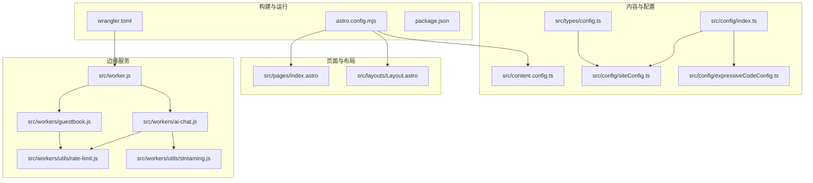
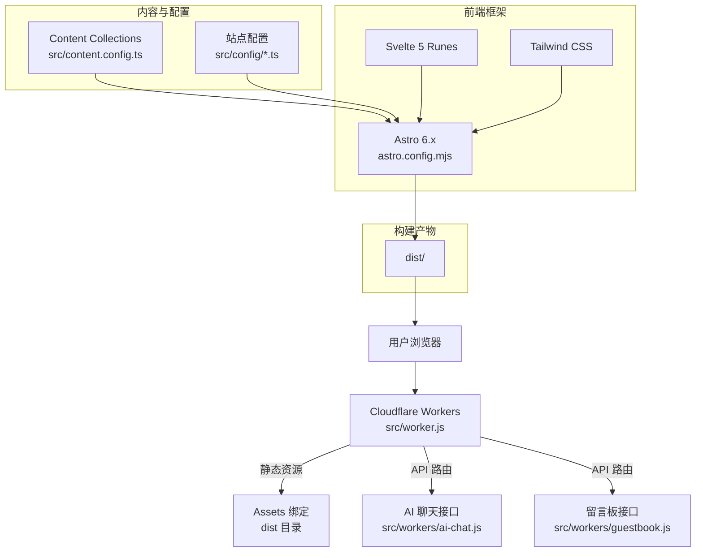
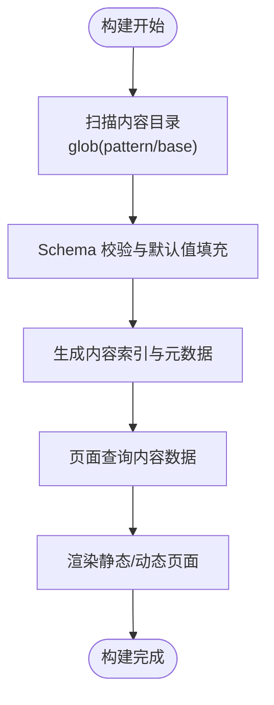
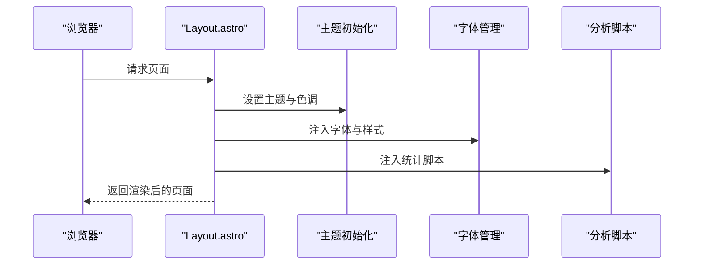
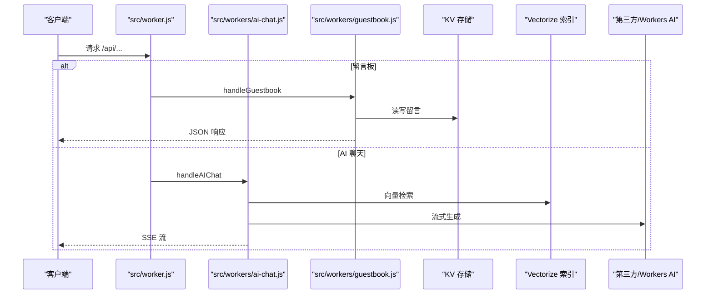
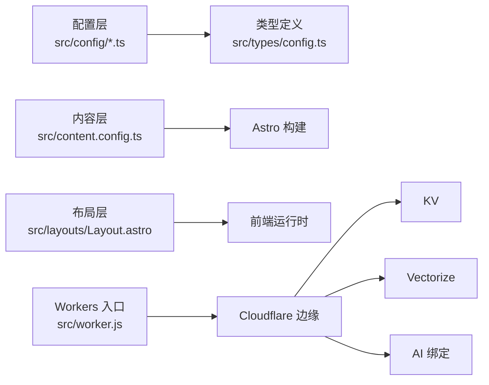

# 架构设计

<cite>
**本文引用的文件**
- [astro.config.mjs](file://astro.config.mjs)
- [content.config.ts](file://src/content.config.ts)
- [package.json](file://package.json)
- [wrangler.toml](file://wrangler.toml)
- [src/worker.js](file://src/worker.js)
- [src/workers/ai-chat.js](file://src/workers/ai-chat.js)
- [src/workers/guestbook.js](file://src/workers/guestbook.js)
- [src/workers/utils/rate-limit.js](file://src/workers/utils/rate-limit.js)
- [src/workers/utils/streaming.js](file://src/workers/utils/streaming.js)
- [src/config/index.ts](file://src/config/index.ts)
- [src/config/siteConfig.ts](file://src/config/siteConfig.ts)
- [src/config/expressiveCodeConfig.ts](file://src/config/expressiveCodeConfig.ts)
- [src/layouts/Layout.astro](file://src/layouts/Layout.astro)
- [src/pages/index.astro](file://src/pages/index.astro)
- [src/types/config.ts](file://src/types/config.ts)
</cite>

## 目录
1. [引言](#引言)
2. [项目结构](#项目结构)
3. [核心组件](#核心组件)
4. [架构总览](#架构总览)
5. [详细组件分析](#详细组件分析)
6. [依赖分析](#依赖分析)
7. [性能考量](#性能考量)
8. [故障排查指南](#故障排查指南)
9. [结论](#结论)
10. [附录](#附录)

## 引言
本项目基于 Astro 6.x 构建，采用“静态生成 + 边缘无服务器”的混合架构，结合 Svelte 5 Runes 响应式系统与 Tailwind CSS 原子化样式，形成高性能、可扩展、易维护的现代化静态站点。项目通过 Astro Content Collections 实现内容驱动的数据流，借助 Cloudflare Workers 提供边缘 API 与 AI 能力，实现“按需 SSR”与“静态预渲染”的协同。

## 项目结构
项目采用“按功能域划分 + 分层组织”的结构：
- 配置层：集中于 src/config 与 src/types，统一管理站点配置、UI 配置与类型声明
- 内容层：src/content 通过 Astro Content Collections 组织文章、动态、生活记录等
- 页面与布局：src/pages 与 src/layouts 提供页面与通用布局
- 组件层：src/components 下按功能域拆分，包含通用组件、特性组件、页面组件等
- 工具与插件：src/utils 与 src/plugins 提供工具函数与 Markdown/Remark/Rehype 插件
- 边缘服务：src/worker.js 与 src/workers/* 提供 Cloudflare Workers 边缘 API
- 构建与运行：astro.config.mjs、wrangler.toml、package.json 管理构建、部署与依赖

图表来源
- [astro.config.mjs:1-307](file://astro.config.mjs#L1-L307)
- [wrangler.toml:1-36](file://wrangler.toml#L1-L36)
- [src/content.config.ts:1-185](file://src/content.config.ts#L1-L185)
- [src/config/index.ts:1-66](file://src/config/index.ts#L1-L66)
- [src/config/siteConfig.ts:1-322](file://src/config/siteConfig.ts#L1-L322)
- [src/config/expressiveCodeConfig.ts:1-33](file://src/config/expressiveCodeConfig.ts#L1-L33)
- [src/layouts/Layout.astro:1-393](file://src/layouts/Layout.astro#L1-L393)
- [src/pages/index.astro:1-19](file://src/pages/index.astro#L1-L19)
- [src/worker.js:1-27](file://src/worker.js#L1-L27)
- [src/workers/ai-chat.js:1-397](file://src/workers/ai-chat.js#L1-L397)
- [src/workers/guestbook.js:1-259](file://src/workers/guestbook.js#L1-L259)
- [src/workers/utils/rate-limit.js:1-46](file://src/workers/utils/rate-limit.js#L1-L46)
- [src/workers/utils/streaming.js:1-33](file://src/workers/utils/streaming.js#L1-L33)

章节来源
- [astro.config.mjs:1-307](file://astro.config.mjs#L1-L307)
- [package.json:1-112](file://package.json#L1-L112)

## 核心组件
- 静态站点生成与混合模式
  - Astro 6.x 配置启用队列渲染、Vite/TailwindCSS、MDX、Expressive Code、Swup SPA 加速等能力，结合 Sitemap、RSS、SEO 元信息，形成“静态优先 + SPA 导航”的混合模式
- 内容组织与数据流
  - Content Collections 将 posts/spec/moments/bangumi/life/notebooks/routines/changelog 等内容源统一建模，Schema 校验与元数据增强，构建期聚合为可查询的数据集合
- 前端技术栈
  - Svelte 5 Runes 提供细粒度响应式与高效更新；Tailwind CSS 原子化样式降低样式耦合与维护成本
- 边缘无服务器
  - Cloudflare Workers 通过 src/worker.js 路由分发至 AI 聊天、留言板、GitHub 代理等服务，结合 KV、Vectorize、AI 绑定实现低延迟与弹性扩缩容

章节来源
- [astro.config.mjs:47-181](file://astro.config.mjs#L47-L181)
- [src/content.config.ts:5-184](file://src/content.config.ts#L5-L184)
- [src/worker.js:5-26](file://src/worker.js#L5-L26)
- [package.json:20-91](file://package.json#L20-L91)

## 架构总览
系统边界与交互概览：
- 客户端请求进入 Cloudflare Workers，命中静态资源则直接返回；命中 API 路径则进入对应处理逻辑
- 静态资源由 Workers 的 Assets 绑定提供，构建产物位于 dist
- 内容与配置通过 Astro 构建期生成静态页面，运行时由 Svelte 组件与 Tailwind 样式提供交互与视觉体验

图表来源
- [wrangler.toml:5-7](file://wrangler.toml#L5-L7)
- [src/worker.js:5-26](file://src/worker.js#L5-L26)
- [src/workers/ai-chat.js:199-396](file://src/workers/ai-chat.js#L199-L396)
- [src/workers/guestbook.js:222-258](file://src/workers/guestbook.js#L222-L258)
- [astro.config.mjs:47-181](file://astro.config.mjs#L47-L181)
- [src/content.config.ts:5-184](file://src/content.config.ts#L5-L184)
- [src/config/index.ts:1-66](file://src/config/index.ts#L1-L66)

## 详细组件分析

### 内容组织与数据流（Astro Content Collections）
- 设计要点
  - 通过 defineCollection 与 glob loader 统一扫描内容目录，结合 zod Schema 进行字段校验与默认值填充
  - 不同类目的内容（文章、动态、番组、生活记录、笔记本、例行事务、更新日志）拥有独立 schema，保证数据一致性与可扩展性
- 数据流
  - 构建期：Content Collections 聚合并生成可查询的数据集合，供页面与组件消费
  - 运行期：页面通过 Astro 的内容 API 获取数据，配合 Svelte 组件渲染

图表来源
- [src/content.config.ts:5-184](file://src/content.config.ts#L5-L184)

章节来源
- [src/content.config.ts:5-184](file://src/content.config.ts#L5-L184)

### 配置系统（集中式配置与类型安全）
- 设计要点
  - 通过 src/config/index.ts 统一导出各类配置，减少组件导入复杂度
  - siteConfig.ts 提供站点基础配置（标题、描述、导航、页面开关、统计、图片优化等）
  - expressiveCodeConfig.ts 管理代码高亮主题与插件配置
  - src/types/config.ts 定义强类型配置接口，保障配置一致性
- 价值
  - 配置集中化、类型安全、易于扩展与维护

章节来源
- [src/config/index.ts:1-66](file://src/config/index.ts#L1-L66)
- [src/config/siteConfig.ts:8-322](file://src/config/siteConfig.ts#L8-L322)
- [src/config/expressiveCodeConfig.ts:9-33](file://src/config/expressiveCodeConfig.ts#L9-L33)
- [src/types/config.ts:10-220](file://src/types/config.ts#L10-L220)

### 前端技术栈与运行时交互
- Svelte 5 Runes
  - 提供细粒度响应式与高效更新，适合复杂交互组件（如音乐可视化、看板娘、动态歌词等）
- Tailwind CSS 原子化样式
  - 通过 Astro 集成的 Tailwind 插件，实现样式快速迭代与主题切换
- 布局与页面
  - Layout.astro 负责 SEO 元信息、主题初始化、分析脚本注入、字体与媒体资源加载
  - index.astro 作为首页入口，组合 HomeHero、HomeTicker、HomeDataLayer、HomePortfolioShutterLayer 等组件

图表来源
- [src/layouts/Layout.astro:66-207](file://src/layouts/Layout.astro#L66-L207)
- [src/config/siteConfig.ts:108-131](file://src/config/siteConfig.ts#L108-L131)
- [src/config/expressiveCodeConfig.ts:9-33](file://src/config/expressiveCodeConfig.ts#L9-L33)

章节来源
- [src/layouts/Layout.astro:1-393](file://src/layouts/Layout.astro#L1-L393)
- [src/pages/index.astro:1-19](file://src/pages/index.astro#L1-L19)

### 边缘无服务器与 API 路由（Cloudflare Workers）
- 架构职责
  - src/worker.js 作为入口，根据路径分发到 AI 聊天、留言板、GitHub 代理等处理函数
  - wrangler.toml 配置主入口、Assets 目录、KV/Vectorize/AI 绑定与环境变量
- AI 聊天服务
  - 支持第三方 API 与 Cloudflare AI，向量检索增强问答，SSE 流式返回
  - 速率限制、跨域、输入校验与错误处理
- 留言板服务
  - KV 存储留言列表与消息，投票防刷，输入净化与校验
- 速率限制与流式处理
  - src/workers/utils/rate-limit.js 提供统一限流策略
  - src/workers/utils/streaming.js 提供第三方与 Workers AI 的流式读取

图表来源
- [src/worker.js:5-26](file://src/worker.js#L5-L26)
- [src/workers/ai-chat.js:199-396](file://src/workers/ai-chat.js#L199-L396)
- [src/workers/guestbook.js:222-258](file://src/workers/guestbook.js#L222-L258)
- [src/workers/utils/rate-limit.js:8-45](file://src/workers/utils/rate-limit.js#L8-L45)
- [src/workers/utils/streaming.js:1-33](file://src/workers/utils/streaming.js#L1-L33)
- [wrangler.toml:26-36](file://wrangler.toml#L26-L36)

章节来源
- [src/worker.js:1-27](file://src/worker.js#L1-L27)
- [src/workers/ai-chat.js:1-397](file://src/workers/ai-chat.js#L1-L397)
- [src/workers/guestbook.js:1-259](file://src/workers/guestbook.js#L1-L259)
- [src/workers/utils/rate-limit.js:1-46](file://src/workers/utils/rate-limit.js#L1-L46)
- [src/workers/utils/streaming.js:1-33](file://src/workers/utils/streaming.js#L1-L33)
- [wrangler.toml:1-36](file://wrangler.toml#L1-L36)

### 构建与部署配置
- Astro 配置
  - 启用 swup SPA 导航、sitemap、expressive-code、svelte、mdx、image 优化、Vite/Tailwind 集成
  - 构建产物 Rollup 分包策略与 esbuild 压缩、CSS 优化、静态资源缓存策略
- 依赖与脚本
  - package.json 管理 Astro、Svelte、Tailwind、插件与工具链版本
  - 脚本包含图标生成、构建、预览、Pagefind 搜索索引生成等

章节来源
- [astro.config.mjs:47-307](file://astro.config.mjs#L47-L307)
- [package.json:5-18](file://package.json#L5-L18)

## 依赖分析
- 组件耦合与内聚
  - 配置层通过 index.ts 统一导出，降低组件导入复杂度，提升内聚性
  - 内容层与页面层解耦，通过内容 API 查询数据，便于测试与演进
  - 边缘服务与前端通过 REST/SSE 接口通信，边界清晰
- 外部依赖与集成
  - Cloudflare Workers 生态：KV、Vectorize、AI、Assets
  - Astro 生态：Svelte、Tailwind、MDX、Expressive Code、Swup、Sitemap、RSS
- 潜在循环依赖
  - 配置与类型文件相互引用，但均为单向导入，无循环依赖风险

图表来源
- [src/config/index.ts:1-66](file://src/config/index.ts#L1-L66)
- [src/types/config.ts:10-220](file://src/types/config.ts#L10-L220)
- [src/content.config.ts:5-184](file://src/content.config.ts#L5-L184)
- [astro.config.mjs:47-181](file://astro.config.mjs#L47-L181)
- [src/layouts/Layout.astro:1-393](file://src/layouts/Layout.astro#L1-L393)
- [src/worker.js:1-27](file://src/worker.js#L1-L27)
- [wrangler.toml:26-36](file://wrangler.toml#L26-L36)

章节来源
- [src/config/index.ts:1-66](file://src/config/index.ts#L1-L66)
- [src/types/config.ts:10-220](file://src/types/config.ts#L10-L220)
- [src/content.config.ts:5-184](file://src/content.config.ts#L5-L184)
- [astro.config.mjs:47-181](file://astro.config.mjs#L47-L181)
- [src/layouts/Layout.astro:1-393](file://src/layouts/Layout.astro#L1-L393)
- [src/worker.js:1-27](file://src/worker.js#L1-L27)
- [wrangler.toml:26-36](file://wrangler.toml#L26-L36)

## 性能考量
- 构建期优化
  - 队列渲染、Rollup 分包、esbuild 压缩、CSS 代码分割与内联阈值控制
  - 图像优化与响应式图片策略，减少首屏阻塞
- 运行期优化
  - Swup SPA 导航减少页面刷新开销
  - 主题与字体预加载策略，降低闪烁与重排
  - 边缘无服务器就近处理 API 请求，降低延迟
- 内容检索与 AI 问答
  - 向量检索与流式返回，兼顾实时性与用户体验
  - 速率限制与跨域控制，保障稳定性与安全性

## 故障排查指南
- Workers 跨域与速率限制
  - 检查 ALLOWED_ORIGINS 与 CORS 头设置；确认 IP 限流键与 TTL
- 留言板输入校验
  - 关注关键字黑名单、长度限制与 HTML 转义
- AI 聊天流式读取
  - 第三方与 Workers AI 的流式解析差异，确保正确处理 SSE 数据帧
- 构建与部署
  - 确认 dist 目录与 Assets 绑定一致；检查 wrangler.toml 中 KV/Vectorize/AI 绑定

章节来源
- [src/workers/ai-chat.js:25-42](file://src/workers/ai-chat.js#L25-L42)
- [src/workers/guestbook.js:13-81](file://src/workers/guestbook.js#L13-L81)
- [src/workers/utils/rate-limit.js:8-45](file://src/workers/utils/rate-limit.js#L8-L45)
- [src/workers/utils/streaming.js:1-33](file://src/workers/utils/streaming.js#L1-L33)
- [wrangler.toml:26-36](file://wrangler.toml#L26-L36)

## 结论
本项目通过 Astro 6.x 的静态生成能力与 Cloudflare Workers 的边缘无服务器模式，实现了高性能、可扩展、可维护的现代静态站点。内容驱动的数据流、集中式配置与类型安全、Svelte 5 Runes 的响应式系统以及 Tailwind CSS 的原子化样式，共同构成了清晰的分层架构与高效的开发体验。在技术权衡上，静态优先与边缘 API 的结合兼顾了 SEO、性能与交互体验，适合中大型个人/团队站点与知识库场景。

## 附录
- 系统边界图（概念性）
  - 客户端与 Workers 边界：请求路由、静态资源与 API 分离
  - 内容与配置边界：构建期内容聚合与运行期查询分离
  - 前端与边缘边界：前端负责渲染与交互，边缘负责数据与业务逻辑