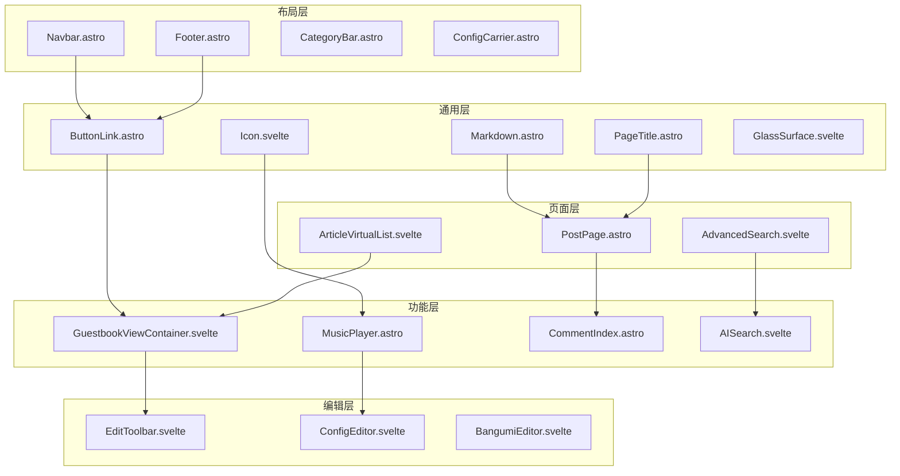
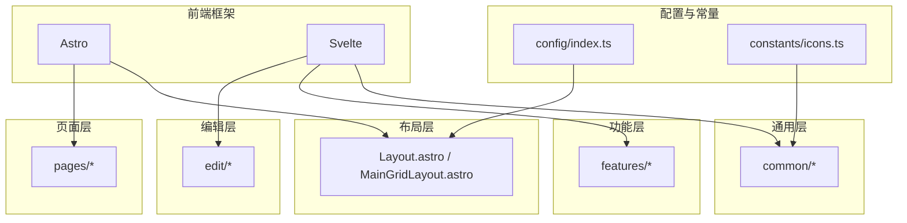
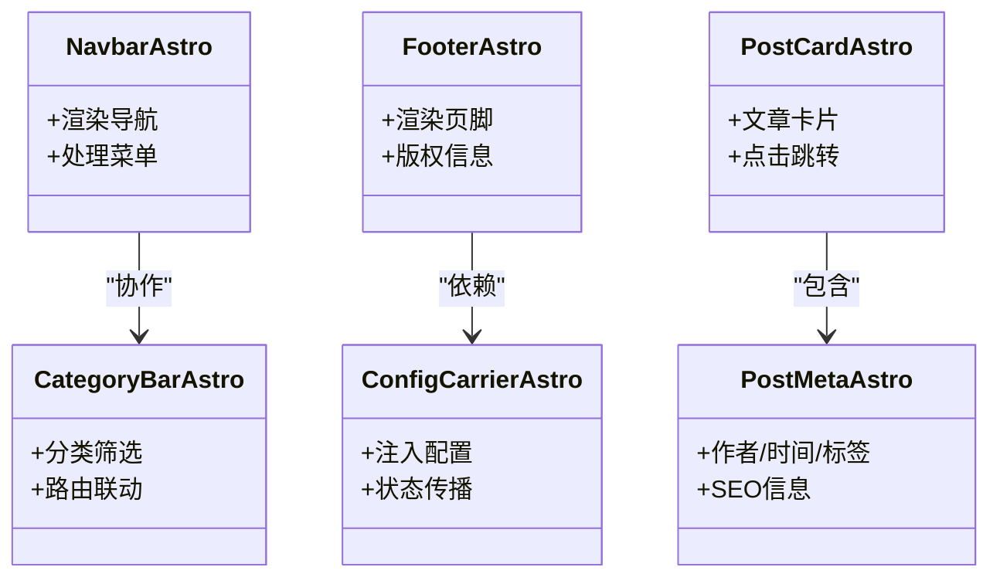
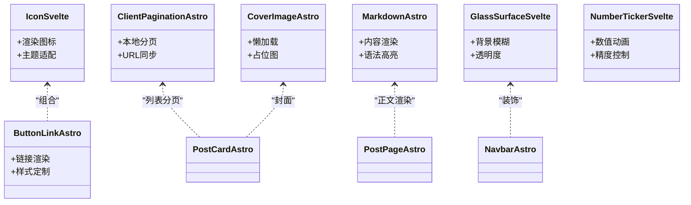
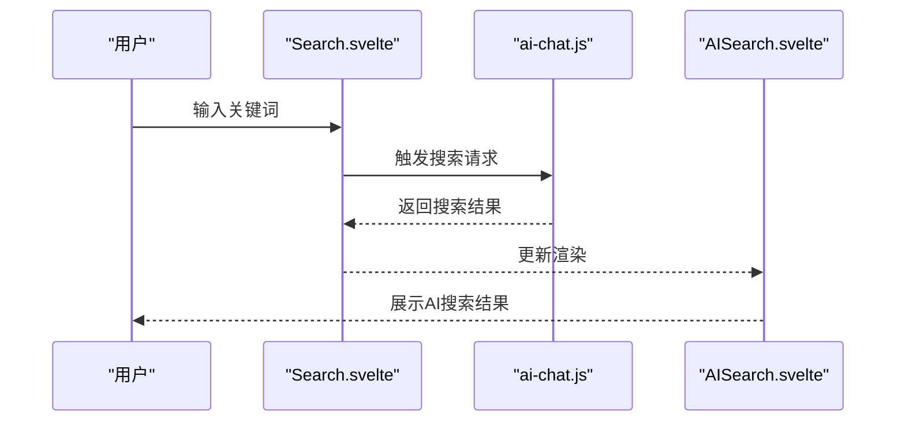
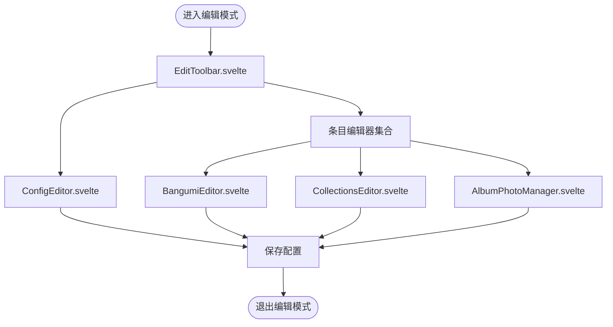
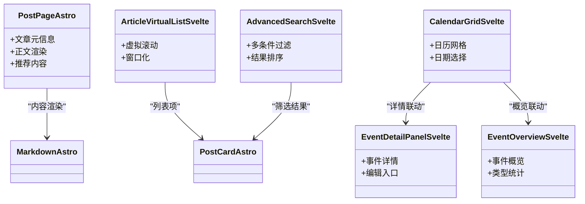
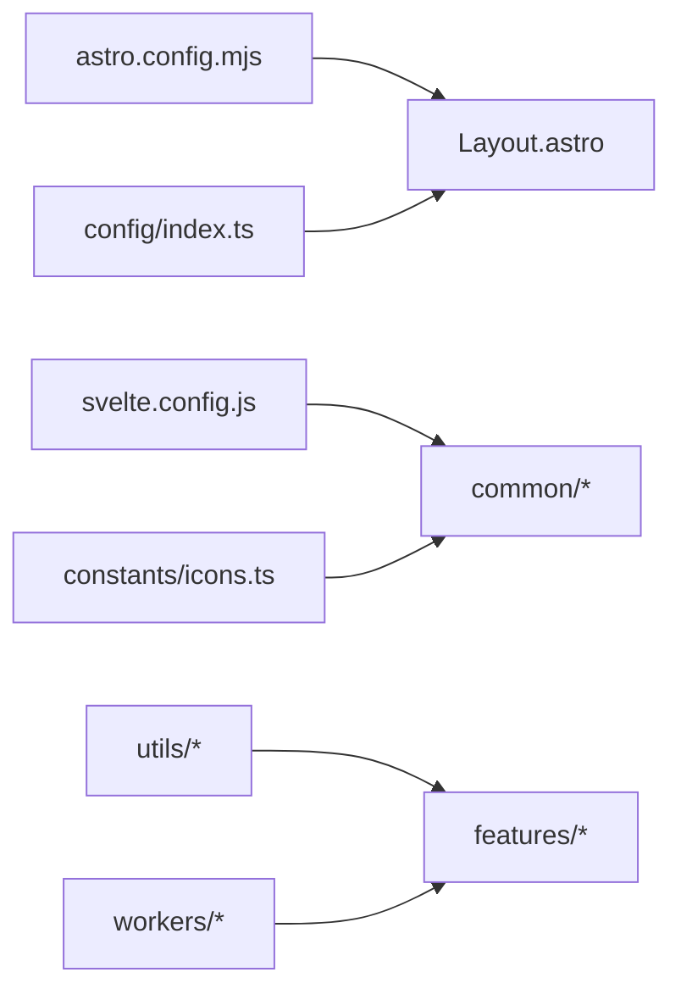

# 组件系统架构

<cite>
**本文引用的文件**
- [GoogleAnalytics.astro](file://src/components/analytics/GoogleAnalytics.astro)
- [La51Analytics.astro](file://src/components/analytics/La51Analytics.astro)
- [UmamiAnalytics.astro](file://src/components/analytics/UmamiAnalytics.astro)
- [Artalk.astro](file://src/components/comment/Artalk.astro)
- [Disqus.astro](file://src/components/comment/Disqus.astro)
- [Giscus.astro](file://src/components/comment/Giscus.astro)
- [Twikoo.astro](file://src/components/comment/Twikoo.astro)
- [Waline.astro](file://src/components/comment/Waline.astro)
- [CommentIndex.astro](file://src/components/comment/index.astro)
- [ButtonLink.astro](file://src/components/common/ButtonLink.astro)
- [ButtonTag.astro](file://src/components/common/ButtonTag.astro)
- [ClientPagination.astro](file://src/components/common/ClientPagination.astro)
- [CoverImage.astro](file://src/components/common/CoverImage.astro)
- [FloatingButton.astro](file://src/components/common/FloatingButton.astro)
- [Icon.astro](file://src/components/common/Icon.astro)
- [Icon.svelte](file://src/components/common/Icon.svelte)
- [ImageWrapper.astro](file://src/components/common/ImageWrapper.astro)
- [Markdown.astro](file://src/components/common/Markdown.astro)
- [PageTitle.astro](file://src/components/common/PageTitle.astro)
- [GlassSurface.svelte](file://src/components/common/GlassSurface.svelte)
- [NumberTicker.svelte](file://src/components/common/NumberTicker.svelte)
- [AISearch.svelte](file://src/components/controls/AISearch.svelte)
- [AnimatedTabs.svelte](file://src/components/controls/AnimatedTabs.svelte)
- [ArchivePanel.svelte](file://src/components/controls/ArchivePanel.svelte)
- [LightDarkSwitch.svelte](file://src/components/controls/LightDarkSwitch.svelte)
- [Search.svelte](file://src/components/controls/Search.svelte)
- [SearchModal.svelte](file://src/components/controls/SearchModal.svelte)
- [AlbumPhotoManager.svelte](file://src/components/edit/AlbumPhotoManager.svelte)
- [BangumiEditor.svelte](file://src/components/edit/BangumiEditor.svelte)
- [BangumiItemEditor.svelte](file://src/components/edit/BangumiItemEditor.svelte)
- [ChangelogEditor.svelte](file://src/components/edit/ChangelogEditor.svelte)
- [CollectionsEditor.svelte](file://src/components/edit/CollectionsEditor.svelte)
- [ConfigEditor.svelte](file://src/components/edit/ConfigEditor.svelte)
- [EditToast.svelte](file://src/components/edit/EditToast.svelte)
- [EditToolbar.svelte](file://src/components/edit/EditToolbar.svelte)
- [FileCodeEditor.svelte](file://src/components/edit/FileCodeEditor.svelte)
- [GuestbookViewContainer.svelte](file://src/components/features/GuestbookViewContainer.svelte)
- [GuestbookViewTabs.svelte](file://src/components/features/GuestbookViewTabs.svelte)
- [GuestbookVirtualList.svelte](file://src/components/features/GuestbookVirtualList.svelte)
- [MusicPlayer.astro](file://src/components/features/MusicPlayer.astro)
- [MusicManager.astro](file://src/components/features/MusicManager.astro)
- [CategoryBar.astro](file://src/components/layout/CategoryBar.astro)
- [ConfigCarrier.astro](file://src/components/layout/ConfigCarrier.astro)
- [DropdownMenu.astro](file://src/components/layout/DropdownMenu.astro)
- [Footer.astro](file://src/components/layout/Footer.astro)
- [HomeHero.astro](file://src/components/layout/HomeHero.astro)
- [Navbar.astro](file://src/components/layout/Navbar.astro)
- [PostCard.astro](file://src/components/layout/PostCard.astro)
- [PostMeta.astro](file://src/components/layout/PostMeta.astro)
- [PostPage.astro](file://src/components/layout/PostPage.astro)
- [ArticleVirtualList.svelte](file://src/components/pages/ArticleVirtualList.svelte)
- [AdvancedSearch.svelte](file://src/components/pages/AdvancedSearch.svelte)
- [CalendarGrid.svelte](file://src/components/pages/calendar/CalendarGrid.svelte)
- [EventDetailPanel.svelte](file://src/components/pages/calendar/EventDetailPanel.svelte)
- [EventOverview.svelte](file://src/components/pages/calendar/EventOverview.svelte)
- [eventTypes.ts](file://src/components/pages/calendar/eventTypes.ts)
- [MusicCard.astro](file://src/components/pages/music/MusicCard.astro)
- [Layout.astro](file://src/layouts/Layout.astro)
- [MainGridLayout.astro](file://src/layouts/MainGridLayout.astro)
- [index.ts](file://src/config/index.ts)
- [editConfig.ts](file://src/config/editConfig.ts)
- [calendarConfig.ts](file://src/config/calendarConfig.ts)
- [musicConfig.ts](file://src/config/musicConfig.ts)
- [siteConfig.ts](file://src/config/siteConfig.ts)
- [constants.ts](file://src/constants/constants.ts)
- [icons.ts](file://src/constants/icons.ts)
- [icon.ts](file://src/constants/icon.ts)
- [content-utils.ts](file://src/utils/content-utils.ts)
- [virtual-list-window.js](file://src/utils/virtual-list-window.js)
- [page-loader-controller.js](file://src/utils/page-loader-controller.js)
- [home-data-layer.js](file://src/utils/home-data-layer.js)
- [home-portfolio-shutter.js](file://src/utils/home-portfolio-shutter.js)
- [guestbook-api.ts](file://src/utils/guestbook-api.ts)
- [guestbook-cache.ts](file://src/utils/guestbook-cache.ts)
- [guestbook-card-stack.ts](file://src/utils/guestbook-card-stack.ts)
- [editMode.ts](file://src/utils/editMode.ts)
- [url-utils.ts](file://src/utils/url-utils.ts)
- [toc-utils.ts](file://src/utils/toc-utils.ts)
- [navigation-utils.ts](file://src/utils/navigation-utils.ts)
- [layout-utils.ts](file://src/utils/layout-utils.ts)
- [date-utils.ts](file://src/utils/date-utils.ts)
- [gallery-utils.ts](file://src/utils/gallery-utils.ts)
- [setting-utils.ts](file://src/utils/setting-utils.ts)
- [cache-utils.ts](file://src/utils/cache-utils.ts)
- [hatch-effect.ts](file://src/utils/hatch-effect.ts)
- [icon-loader.ts](file://src/utils/icon-loader.ts)
- [image-utils.ts](file://src/utils/image-utils.ts)
- [worker.js](file://src/worker.js)
- [ai-chat.js](file://src/workers/ai-chat.js)
- [github-proxy.js](file://src/workers/github-proxy.js)
- [guestbook.js](file://src/workers/guestbook.js)
- [astro.config.mjs](file://astro.config.mjs)
- [svelte.config.js](file://svelte.config.js)
- [package.json](file://package.json)
</cite>

## 目录
1. [引言](#引言)
2. [项目结构](#项目结构)
3. [核心组件](#核心组件)
4. [架构总览](#架构总览)
5. [详细组件分析](#详细组件分析)
6. [依赖分析](#依赖分析)
7. [性能考虑](#性能考虑)
8. [故障排除指南](#故障排除指南)
9. [结论](#结论)
10. [附录](#附录)

## 引言
本文件面向Firefly-Mod项目的组件系统，基于Astro与Svelte构建，系统化梳理组件分层架构（布局组件、通用组件、功能组件、编辑组件）、组合与继承关系、高阶组件设计原则与复用策略、组件间通信机制、生命周期与状态管理、响应式数据绑定与事件处理，并提供架构图与依赖关系图，最后给出可测试性与可维护性设计建议。

## 项目结构
项目采用按功能域分层的组件组织方式：
- 布局组件：负责页面骨架与导航、头部、页脚等基础结构
- 通用组件：跨页面复用的基础UI与工具组件
- 功能组件：承载具体业务能力（如评论、音乐播放、访客簿等）
- 编辑组件：面向内容管理与后台编辑场景
- 页面组件：页面级容器与路由页面
- 配置与常量：站点配置、图标、常量定义
- 工具与工作线程：内容处理、缓存、虚拟列表、页面加载控制等

**图表来源**
- [Navbar.astro](file://src/components/layout/Navbar.astro)
- [Footer.astro](file://src/components/layout/Footer.astro)
- [CategoryBar.astro](file://src/components/layout/CategoryBar.astro)
- [ConfigCarrier.astro](file://src/components/layout/ConfigCarrier.astro)
- [ButtonLink.astro](file://src/components/common/ButtonLink.astro)
- [Icon.svelte](file://src/components/common/Icon.svelte)
- [Markdown.astro](file://src/components/common/Markdown.astro)
- [PageTitle.astro](file://src/components/common/PageTitle.astro)
- [GlassSurface.svelte](file://src/components/common/GlassSurface.svelte)
- [GuestbookViewContainer.svelte](file://src/components/features/GuestbookViewContainer.svelte)
- [MusicPlayer.astro](file://src/components/features/MusicPlayer.astro)
- [CommentIndex.astro](file://src/components/comment/index.astro)
- [AISearch.svelte](file://src/components/controls/AISearch.svelte)
- [EditToolbar.svelte](file://src/components/edit/EditToolbar.svelte)
- [ConfigEditor.svelte](file://src/components/edit/ConfigEditor.svelte)
- [BangumiEditor.svelte](file://src/components/edit/BangumiEditor.svelte)
- [PostPage.astro](file://src/components/layout/PostPage.astro)
- [ArticleVirtualList.svelte](file://src/components/pages/ArticleVirtualList.svelte)
- [AdvancedSearch.svelte](file://src/components/pages/AdvancedSearch.svelte)

**章节来源**
- [Layout.astro](file://src/layouts/Layout.astro)
- [MainGridLayout.astro](file://src/layouts/MainGridLayout.astro)
- [package.json](file://package.json)

## 核心组件
- 布局组件：提供站点骨架与导航，如导航栏、页脚、分类栏、配置载体等，承担全局样式与状态传递职责
- 通用组件：提供按钮、图标、分页、封面图、标题、玻璃拟态等基础UI与工具，强调跨页面复用
- 功能组件：承载评论系统、访客簿视图、音乐播放器、AI搜索等业务能力
- 编辑组件：提供编辑工具栏、配置编辑器、条目编辑器、变更日志编辑器等，服务于后台管理
- 页面组件：文章详情页、文章列表、高级搜索、日历等页面容器

**章节来源**
- [Layout.astro](file://src/layouts/Layout.astro)
- [MainGridLayout.astro](file://src/layouts/MainGridLayout.astro)
- [ButtonLink.astro](file://src/components/common/ButtonLink.astro)
- [Icon.svelte](file://src/components/common/Icon.svelte)
- [GuestbookViewContainer.svelte](file://src/components/features/GuestbookViewContainer.svelte)
- [MusicPlayer.astro](file://src/components/features/MusicPlayer.astro)
- [EditToolbar.svelte](file://src/components/edit/EditToolbar.svelte)
- [PostPage.astro](file://src/components/layout/PostPage.astro)

## 架构总览
整体采用“布局-通用-功能-编辑-页面”的分层架构，结合Astro的静态生成与Svelte的组件化渲染，形成可组合、可扩展、可维护的前端体系。组件通过props与事件进行通信，状态通过Svelte store或Astro数据流管理，部分复杂逻辑通过工具函数与工作线程解耦。

**图表来源**
- [astro.config.mjs](file://astro.config.mjs)
- [svelte.config.js](file://svelte.config.js)
- [config/index.ts](file://src/config/index.ts)
- [constants/icons.ts](file://src/constants/icons.ts)
- [Layout.astro](file://src/layouts/Layout.astro)
- [MainGridLayout.astro](file://src/layouts/MainGridLayout.astro)

## 详细组件分析

### 布局组件分析
- 导航栏与页脚：提供全局导航、菜单面板、下拉菜单等，负责用户路径引导与站点信息展示
- 分类栏与配置载体：承载分类筛选、配置注入等，作为上层功能组件的数据源
- 文章卡片与元信息：用于文章列表与详情页的结构化展示

**图表来源**
- [Navbar.astro](file://src/components/layout/Navbar.astro)
- [Footer.astro](file://src/components/layout/Footer.astro)
- [CategoryBar.astro](file://src/components/layout/CategoryBar.astro)
- [ConfigCarrier.astro](file://src/components/layout/ConfigCarrier.astro)
- [PostCard.astro](file://src/components/layout/PostCard.astro)
- [PostMeta.astro](file://src/components/layout/PostMeta.astro)

**章节来源**
- [Navbar.astro](file://src/components/layout/Navbar.astro)
- [Footer.astro](file://src/components/layout/Footer.astro)
- [CategoryBar.astro](file://src/components/layout/CategoryBar.astro)
- [ConfigCarrier.astro](file://src/components/layout/ConfigCarrier.astro)
- [PostCard.astro](file://src/components/layout/PostCard.astro)
- [PostMeta.astro](file://src/components/layout/PostMeta.astro)

### 通用组件分析
- 图标与按钮：提供统一的图标渲染与链接按钮，支持主题切换与尺寸规范
- 分页与封面：客户端分页、封面图懒加载与占位
- Markdown 渲染：内容渲染与代码高亮集成
- 玻璃拟态与数字滚动：视觉与动效增强

**图表来源**
- [Icon.svelte](file://src/components/common/Icon.svelte)
- [ButtonLink.astro](file://src/components/common/ButtonLink.astro)
- [ClientPagination.astro](file://src/components/common/ClientPagination.astro)
- [CoverImage.astro](file://src/components/common/CoverImage.astro)
- [Markdown.astro](file://src/components/common/Markdown.astro)
- [GlassSurface.svelte](file://src/components/common/GlassSurface.svelte)
- [NumberTicker.svelte](file://src/components/common/NumberTicker.svelte)
- [PostCard.astro](file://src/components/layout/PostCard.astro)
- [PostPage.astro](file://src/components/layout/PostPage.astro)

**章节来源**
- [Icon.svelte](file://src/components/common/Icon.svelte)
- [ButtonLink.astro](file://src/components/common/ButtonLink.astro)
- [ClientPagination.astro](file://src/components/common/ClientPagination.astro)
- [CoverImage.astro](file://src/components/common/CoverImage.astro)
- [Markdown.astro](file://src/components/common/Markdown.astro)
- [GlassSurface.svelte](file://src/components/common/GlassSurface.svelte)
- [NumberTicker.svelte](file://src/components/common/NumberTicker.svelte)

### 功能组件分析
- 评论系统：封装多种评论服务（Artalk、Disqus、Giscus、Twikoo、Waline），通过索引组件聚合与切换
- 访客簿：容器、标签页、虚拟列表与卡片栈组合，支撑高性能列表渲染与交互
- 音乐播放：播放器与管理器分离，支持歌词叠加与可视化场景
- AI搜索：搜索输入与结果展示，结合后端工作线程

**图表来源**
- [Search.svelte](file://src/components/controls/Search.svelte)
- [AISearch.svelte](file://src/components/controls/AISearch.svelte)
- [ai-chat.js](file://src/workers/ai-chat.js)

**章节来源**
- [CommentIndex.astro](file://src/components/comment/index.astro)
- [Artalk.astro](file://src/components/comment/Artalk.astro)
- [Disqus.astro](file://src/components/comment/Disqus.astro)
- [Giscus.astro](file://src/components/comment/Giscus.astro)
- [Twikoo.astro](file://src/components/comment/Twikoo.astro)
- [Waline.astro](file://src/components/comment/Waline.astro)
- [GuestbookViewContainer.svelte](file://src/components/features/GuestbookViewContainer.svelte)
- [GuestbookViewTabs.svelte](file://src/components/features/GuestbookViewTabs.svelte)
- [GuestbookVirtualList.svelte](file://src/components/features/GuestbookVirtualList.svelte)
- [MusicPlayer.astro](file://src/components/features/MusicPlayer.astro)
- [MusicManager.astro](file://src/components/features/MusicManager.astro)
- [AISearch.svelte](file://src/components/controls/AISearch.svelte)

### 编辑组件分析
- 编辑工具栏：提供撤销、重做、保存等操作入口
- 配置编辑器：集中管理站点配置项
- 条目编辑器：针对条目（番组、收藏、相册等）的增删改查
- 文件代码编辑器：Markdown/JSON等文本编辑与预览

**图表来源**
- [EditToolbar.svelte](file://src/components/edit/EditToolbar.svelte)
- [ConfigEditor.svelte](file://src/components/edit/ConfigEditor.svelte)
- [BangumiEditor.svelte](file://src/components/edit/BangumiEditor.svelte)
- [CollectionsEditor.svelte](file://src/components/edit/CollectionsEditor.svelte)
- [AlbumPhotoManager.svelte](file://src/components/edit/AlbumPhotoManager.svelte)

**章节来源**
- [EditToolbar.svelte](file://src/components/edit/EditToolbar.svelte)
- [ConfigEditor.svelte](file://src/components/edit/ConfigEditor.svelte)
- [BangumiEditor.svelte](file://src/components/edit/BangumiEditor.svelte)
- [CollectionsEditor.svelte](file://src/components/edit/CollectionsEditor.svelte)
- [AlbumPhotoManager.svelte](file://src/components/edit/AlbumPhotoManager.svelte)

### 页面组件分析
- 文章详情页：整合文章元信息、正文渲染、推荐与分享
- 列表与搜索：虚拟列表提升大数据量渲染性能；高级搜索提供多维过滤
- 日历：网格、事件概览与详情面板

**图表来源**
- [PostPage.astro](file://src/components/layout/PostPage.astro)
- [Markdown.astro](file://src/components/common/Markdown.astro)
- [ArticleVirtualList.svelte](file://src/components/pages/ArticleVirtualList.svelte)
- [AdvancedSearch.svelte](file://src/components/pages/AdvancedSearch.svelte)
- [CalendarGrid.svelte](file://src/components/pages/calendar/CalendarGrid.svelte)
- [EventDetailPanel.svelte](file://src/components/pages/calendar/EventDetailPanel.svelte)
- [EventOverview.svelte](file://src/components/pages/calendar/EventOverview.svelte)

**章节来源**
- [PostPage.astro](file://src/components/layout/PostPage.astro)
- [ArticleVirtualList.svelte](file://src/components/pages/ArticleVirtualList.svelte)
- [AdvancedSearch.svelte](file://src/components/pages/AdvancedSearch.svelte)
- [CalendarGrid.svelte](file://src/components/pages/calendar/CalendarGrid.svelte)
- [EventDetailPanel.svelte](file://src/components/pages/calendar/EventDetailPanel.svelte)
- [EventOverview.svelte](file://src/components/pages/calendar/EventOverview.svelte)

## 依赖分析
- 框架与构建：Astro负责页面与SSR，Svelte负责交互组件；两者通过各自配置文件管理
- 配置与常量：站点配置、图标、常量集中于config与constants目录，被各组件按需导入
- 工具与工作线程：内容工具、虚拟列表、页面加载控制器、访客簿API与缓存等模块化拆分
- 组件间耦合：通过props与事件解耦，布局层对通用层弱依赖，功能层对通用层弱依赖，编辑层对通用层弱依赖

**图表来源**
- [astro.config.mjs](file://astro.config.mjs)
- [svelte.config.js](file://svelte.config.js)
- [config/index.ts](file://src/config/index.ts)
- [constants/icons.ts](file://src/constants/icons.ts)
- [Layout.astro](file://src/layouts/Layout.astro)
- [utils/content-utils.ts](file://src/utils/content-utils.ts)
- [ai-chat.js](file://src/workers/ai-chat.js)

**章节来源**
- [astro.config.mjs](file://astro.config.mjs)
- [svelte.config.js](file://svelte.config.js)
- [config/index.ts](file://src/config/index.ts)
- [constants/icons.ts](file://src/constants/icons.ts)
- [utils/content-utils.ts](file://src/utils/content-utils.ts)
- [ai-chat.js](file://src/workers/ai-chat.js)

## 性能考虑
- 虚拟列表：文章列表与访客簿采用窗口化渲染，减少DOM节点数量，提升滚动性能
- 客户端分页：避免一次性加载大量数据，降低首屏压力
- 懒加载与占位：封面图与图片容器提供占位与延迟加载，优化资源占用
- 工作线程：AI搜索、GitHub代理、访客簿等耗时任务移至Web Worker，避免阻塞主线程
- 页面加载控制：页面加载控制器统一管理加载状态，减少闪烁与重复请求

**章节来源**
- [ArticleVirtualList.svelte](file://src/components/pages/ArticleVirtualList.svelte)
- [GuestbookVirtualList.svelte](file://src/components/features/GuestbookVirtualList.svelte)
- [virtual-list-window.js](file://src/utils/virtual-list-window.js)
- [page-loader-controller.js](file://src/utils/page-loader-controller.js)
- [CoverImage.astro](file://src/components/common/CoverImage.astro)
- [ai-chat.js](file://src/workers/ai-chat.js)
- [guestbook.js](file://src/workers/guestbook.js)
- [github-proxy.js](file://src/workers/github-proxy.js)

## 故障排除指南
- 评论组件不可用：检查评论服务配置与网络请求，确认索引组件是否正确聚合
- 音乐播放异常：验证播放器与管理器状态同步，检查音频资源可用性
- 编辑器无响应：确认编辑模式开关与工具栏事件绑定，检查配置保存流程
- 列表渲染卡顿：核查虚拟列表参数与窗口大小，确保数据稳定更新
- 图片加载失败：检查封面图懒加载逻辑与占位图回退策略

**章节来源**
- [CommentIndex.astro](file://src/components/comment/index.astro)
- [MusicPlayer.astro](file://src/components/features/MusicPlayer.astro)
- [EditToolbar.svelte](file://src/components/edit/EditToolbar.svelte)
- [ArticleVirtualList.svelte](file://src/components/pages/ArticleVirtualList.svelte)
- [CoverImage.astro](file://src/components/common/CoverImage.astro)

## 结论
Firefly-Mod的组件系统以Astro与Svelte为核心，采用清晰的分层架构与模块化设计，实现了布局、通用、功能、编辑与页面的职责分离。通过props/事件通信、工具函数与工作线程解耦、虚拟列表与懒加载等手段，兼顾了性能与可维护性。建议持续完善单元测试与集成测试覆盖，强化组件契约与错误边界，进一步提升系统的稳定性与可演进性。

## 附录
- 组件通信与状态管理要点
  - 父子组件：通过props传递数据，子组件通过事件向上反馈
  - 兄弟组件：通过共同父组件中转或使用共享状态（store）
  - 跨层级：通过配置载体或全局状态管理，避免深层传递
- 生命周期与事件处理
  - Astro页面生命周期：SSR/CSR阶段的初始化与数据获取
  - Svelte组件生命周期：创建、销毁、响应式更新与事件监听
- 可测试性与可维护性
  - 单元测试：针对工具函数与纯函数
  - 集成测试：组件组合与工作流
  - 可维护性：明确的目录约定、稳定的API契约、完善的注释与文档