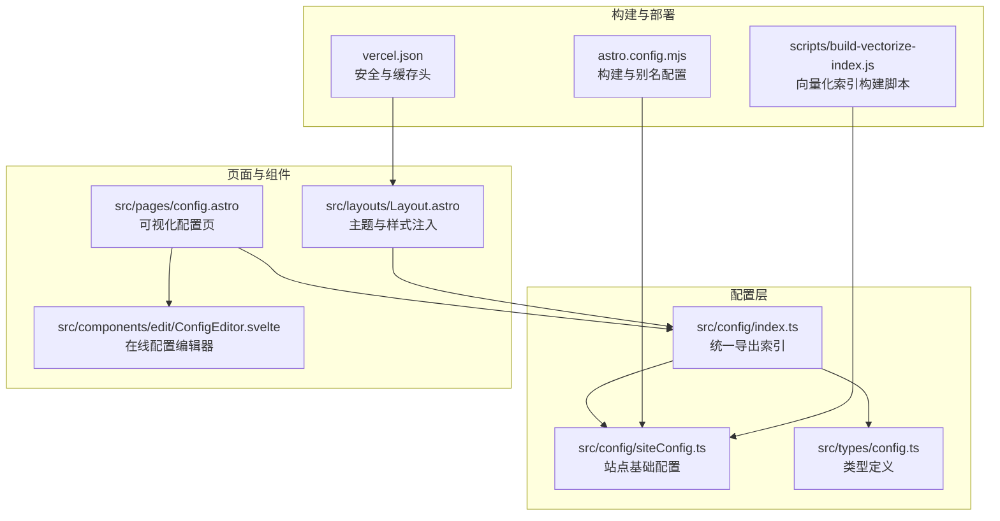
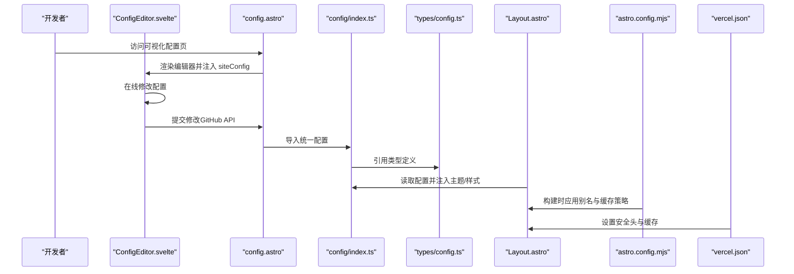
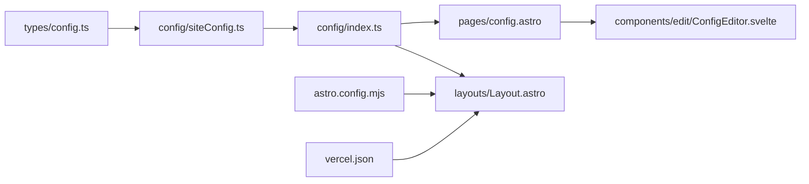
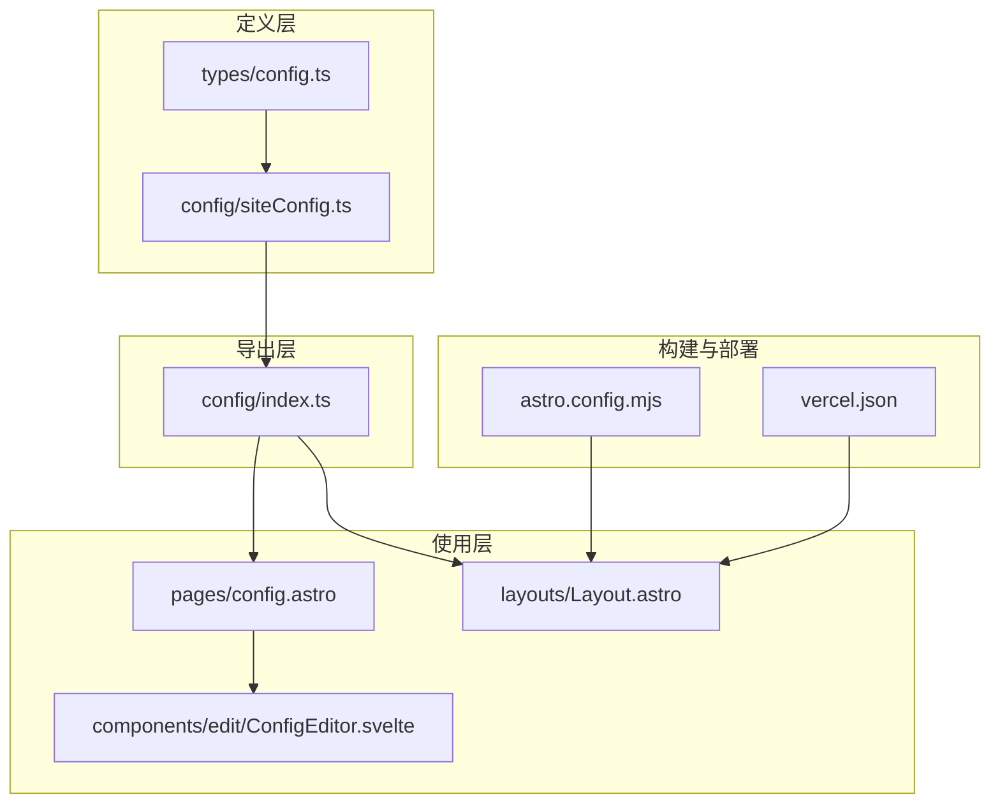
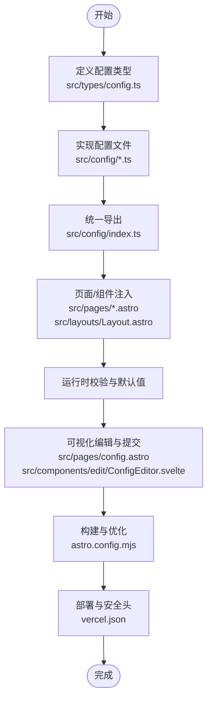

# 配置架构设计

<cite>
**本文引用的文件**
- [src/config/index.ts](file://src/config/index.ts)
- [src/config/README.md](file://src/config/README.md)
- [src/config/siteConfig.ts](file://src/config/siteConfig.ts)
- [src/types/config.ts](file://src/types/config.ts)
- [src/pages/config.astro](file://src/pages/config.astro)
- [src/layouts/Layout.astro](file://src/layouts/Layout.astro)
- [src/components/edit/ConfigEditor.svelte](file://src/components/edit/ConfigEditor.svelte)
- [scripts/build-vectorize-index.js](file://scripts/build-vectorize-index.js)
- [astro.config.mjs](file://astro.config.mjs)
- [vercel.json](file://vercel.json)
- [src/pages/admin/index.astro](file://src/pages/admin/index.astro)
- [src/pages/admin/friends.astro](file://src/pages/admin/friends.astro)
</cite>

## 目录
1. [引言](#引言)
2. [项目结构](#项目结构)
3. [核心组件](#核心组件)
4. [架构总览](#架构总览)
5. [详细组件分析](#详细组件分析)
6. [依赖关系分析](#依赖关系分析)
7. [性能考量](#性能考量)
8. [故障排查指南](#故障排查指南)
9. [结论](#结论)
10. [附录](#附录)

## 引言
本设计文档围绕 Firefly-Mod 项目的“配置驱动”架构展开，系统性阐述配置文件的层次结构、加载顺序、模块化设计原则、动态更新与热重载策略、配置验证与默认值处理机制、配置流转图以及安全性与敏感信息保护策略。目标是帮助开发者快速理解并高效维护配置体系，确保配置的完整性、一致性与可演进性。

## 项目结构
配置系统采用“集中管理、模块化导出”的组织方式，所有配置文件位于 src/config/ 目录，通过统一索引导出，供页面与组件按需导入。类型定义集中在 src/types/config.ts，确保配置在编译期具备强类型约束。

**图表来源**
- [src/config/index.ts:1-66](file://src/config/index.ts#L1-L66)
- [src/config/siteConfig.ts:1-322](file://src/config/siteConfig.ts#L1-L322)
- [src/types/config.ts:1-220](file://src/types/config.ts#L1-L220)
- [src/pages/config.astro:1-45](file://src/pages/config.astro#L1-L45)
- [src/layouts/Layout.astro:152-190](file://src/layouts/Layout.astro#L152-L190)
- [src/components/edit/ConfigEditor.svelte:767-817](file://src/components/edit/ConfigEditor.svelte#L767-L817)
- [astro.config.mjs:245-280](file://astro.config.mjs#L245-L280)
- [vercel.json:1-39](file://vercel.json#L1-L39)
- [scripts/build-vectorize-index.js:32-64](file://scripts/build-vectorize-index.js#L32-L64)

**章节来源**
- [src/config/README.md:1-79](file://src/config/README.md#L1-L79)
- [src/config/index.ts:1-66](file://src/config/index.ts#L1-L66)
- [src/config/siteConfig.ts:1-322](file://src/config/siteConfig.ts#L1-L322)
- [src/types/config.ts:1-220](file://src/types/config.ts#L1-L220)

## 核心组件
- 配置索引与导出：src/config/index.ts 统一导出所有配置，降低组件导入复杂度，提升可维护性。
- 站点基础配置：src/config/siteConfig.ts 定义站点标题、URL、主题色、页面开关、导航栏、分页、统计分析、图像优化等核心参数。
- 类型系统：src/types/config.ts 定义完整的配置类型，覆盖站点、导航、侧边栏、看板娘、评论、字体、公告、音乐、相册、日历、技能、AI 搜索、PlantUML 等模块。
- 可视化配置页：src/pages/config.astro 与 src/components/edit/ConfigEditor.svelte 提供在线编辑与提交能力，修改后通过 GitHub API 提交到仓库。
- 主题与样式注入：src/layouts/Layout.astro 依据配置注入主题色、页面宽度、字体与代码高亮主题等。
- 构建与部署：astro.config.mjs 与 vercel.json 提供构建优化与安全头配置，保障配置变更在构建阶段生效并在运行时稳定呈现。

**章节来源**
- [src/config/index.ts:37-66](file://src/config/index.ts#L37-L66)
- [src/config/siteConfig.ts:8-322](file://src/config/siteConfig.ts#L8-L322)
- [src/types/config.ts:10-220](file://src/types/config.ts#L10-L220)
- [src/pages/config.astro:1-45](file://src/pages/config.astro#L1-L45)
- [src/components/edit/ConfigEditor.svelte:767-817](file://src/components/edit/ConfigEditor.svelte#L767-L817)
- [src/layouts/Layout.astro:152-190](file://src/layouts/Layout.astro#L152-L190)
- [astro.config.mjs:245-280](file://astro.config.mjs#L245-L280)
- [vercel.json:1-39](file://vercel.json#L1-L39)

## 架构总览
配置驱动架构遵循“定义—注入—渲染—校验—持久化”的闭环流程。站点配置作为根节点，通过索引导出至页面与组件；组件在渲染阶段读取配置并注入样式与行为；可视化编辑器支持在线修改并通过页面提交至仓库；构建与部署阶段确保变更生效并保持安全与性能。

**图表来源**
- [src/pages/config.astro:1-45](file://src/pages/config.astro#L1-L45)
- [src/components/edit/ConfigEditor.svelte:767-817](file://src/components/edit/ConfigEditor.svelte#L767-L817)
- [src/config/index.ts:1-66](file://src/config/index.ts#L1-L66)
- [src/types/config.ts:1-220](file://src/types/config.ts#L1-L220)
- [src/layouts/Layout.astro:152-190](file://src/layouts/Layout.astro#L152-L190)
- [astro.config.mjs:245-280](file://astro.config.mjs#L245-L280)
- [vercel.json:1-39](file://vercel.json#L1-L39)

## 详细组件分析

### 配置索引与模块化导出
- 设计要点
  - 统一导出：通过 index.ts 将各模块配置集中导出，组件只需一次导入即可获取所需配置，降低耦合与重复导入。
  - 分层命名：按“核心配置、样式配置、功能配置、组件配置、布局配置”分层导出，便于维护与扩展。
- 关键路径
  - [src/config/index.ts:37-66](file://src/config/index.ts#L37-L66)

**章节来源**
- [src/config/index.ts:1-66](file://src/config/index.ts#L1-L66)
- [src/config/README.md:37-48](file://src/config/README.md#L37-L48)

### 站点基础配置（siteConfig）
- 职责边界
  - 站点元信息：标题、副标题、URL、描述、关键词。
  - 主题与外观：主题色（色相、默认模式）、页面宽度、卡片样式、字体、提醒框主题。
  - 导航与页面开关：导航栏配置、页面开关（友链、赞助、留言、相册、收藏、统计、日历、番剧、书架、影视游戏、音乐、更新日志、动态、后台、日常规划、旅行足迹、笔记本）。
  - 分页与布局：文章列表布局、网格列宽、是否允许切换。
  - 统计分析：Google Analytics、Microsoft Clarity、Umami、51la。
  - 图像优化：输出格式、质量、防盗链域名白名单。
  - 时区与工作时间：站点时区、上下班时间与工作日范围。
- 关键路径
  - [src/config/siteConfig.ts:8-322](file://src/config/siteConfig.ts#L8-L322)
  - [src/types/config.ts:10-220](file://src/types/config.ts#L10-L220)

**章节来源**
- [src/config/siteConfig.ts:8-322](file://src/config/siteConfig.ts#L8-L322)
- [src/types/config.ts:10-220](file://src/types/config.ts#L10-L220)

### 类型系统（types/config.ts）
- 设计要点
  - 强类型覆盖：涵盖站点、导航、侧边栏、看板娘（Spine/Live2D）、评论、字体、公告、音乐、相册、日历、技能、AI 搜索、PlantUML 等模块。
  - 可选字段与默认值：大量字段标记为可选，配合运行时默认值策略保证兼容性。
  - 枚举与联合类型：LIGHT_DARK_MODE、WALLPAPER_MODE 等统一约束取值范围。
- 关键路径
  - [src/types/config.ts:1-220](file://src/types/config.ts#L1-L220)

**章节来源**
- [src/types/config.ts:1-220](file://src/types/config.ts#L1-L220)

### 可视化配置编辑器（ConfigEditor.svelte + config.astro）
- 设计要点
  - 双模式编辑：可视化表单与代码模式（TypeScript），满足不同用户的偏好。
  - 实时注入：页面通过 define:vars 将完整 siteConfig 注入 window.__SITE_CONFIG__，便于客户端读取与调试。
  - 提交流程：修改后通过 GitHub API 提交到仓库，形成“本地编辑—线上提交”的闭环。
- 关键路径
  - [src/pages/config.astro:1-45](file://src/pages/config.astro#L1-L45)
  - [src/components/edit/ConfigEditor.svelte:767-817](file://src/components/edit/ConfigEditor.svelte#L767-L817)

**章节来源**
- [src/pages/config.astro:1-45](file://src/pages/config.astro#L1-L45)
- [src/components/edit/ConfigEditor.svelte:767-817](file://src/components/edit/ConfigEditor.svelte#L767-L817)

### 主题与样式注入（Layout.astro）
- 设计要点
  - 主题色与模式：根据配置与本地存储决定主题模式与色相，注入到 documentElement。
  - 页面宽度与字体：通过 define:vars 传递 page-width 与字体配置。
  - 代码高亮主题：结合 expressiveCodeConfig 注入亮/暗主题。
- 关键路径
  - [src/layouts/Layout.astro:152-190](file://src/layouts/Layout.astro#L152-L190)

**章节来源**
- [src/layouts/Layout.astro:152-190](file://src/layouts/Layout.astro#L152-L190)

### 构建与部署（astro.config.mjs + vercel.json）
- 设计要点
  - 构建优化：别名 resolve、代码分割、Rollup manualChunks、ESBuild 去除 console 与 debugger。
  - 缓存策略：/_astro/* 长期缓存，HTML 每次验证；CDN/平台侧 headers 配置。
  - 安全头：X-Content-Type-Options、X-Frame-Options、X-XSS-Protection、Referrer-Policy。
- 关键路径
  - [astro.config.mjs:245-280](file://astro.config.mjs#L245-L280)
  - [vercel.json:1-39](file://vercel.json#L1-L39)

**章节来源**
- [astro.config.mjs:245-280](file://astro.config.mjs#L245-L280)
- [vercel.json:1-39](file://vercel.json#L1-L39)

### 第三方集成配置（示例：AI 搜索）
- 设计要点
  - 配置文件：aiSearchConfig.ts 定义索引名称、维度、批次大小等。
  - 构建脚本：scripts/build-vectorize-index.js 解析配置并加载 .env 中的敏感信息，执行向量化索引构建。
- 关键路径
  - [scripts/build-vectorize-index.js:32-64](file://scripts/build-vectorize-index.js#L32-L64)

**章节来源**
- [scripts/build-vectorize-index.js:32-64](file://scripts/build-vectorize-index.js#L32-L64)

## 依赖关系分析
配置系统内部依赖清晰，遵循“类型定义—配置文件—索引导出—页面/组件—构建/部署”的单向依赖链路，避免循环依赖，提升可测试性与可维护性。

**图表来源**
- [src/types/config.ts:1-220](file://src/types/config.ts#L1-L220)
- [src/config/siteConfig.ts:1-322](file://src/config/siteConfig.ts#L1-L322)
- [src/config/index.ts:1-66](file://src/config/index.ts#L1-L66)
- [src/pages/config.astro:1-45](file://src/pages/config.astro#L1-L45)
- [src/layouts/Layout.astro:152-190](file://src/layouts/Layout.astro#L152-L190)
- [src/components/edit/ConfigEditor.svelte:767-817](file://src/components/edit/ConfigEditor.svelte#L767-L817)
- [astro.config.mjs:245-280](file://astro.config.mjs#L245-L280)
- [vercel.json:1-39](file://vercel.json#L1-L39)

**章节来源**
- [src/config/index.ts:1-66](file://src/config/index.ts#L1-L66)
- [src/config/siteConfig.ts:1-322](file://src/config/siteConfig.ts#L1-L322)
- [src/types/config.ts:1-220](file://src/types/config.ts#L1-L220)

## 性能考量
- 构建期优化
  - 代码分割：针对大型依赖（如 katex、mermaid、live2d、gsap、AI、Guestbook、Calendar）进行手动分包，减少首屏体积。
  - ESBuild 去除：移除 console 与 debugger，减小产物体积。
- 运行期优化
  - 长期缓存：/_astro/* 与静态资源长期缓存，HTML 每次验证，平衡缓存与新鲜度。
  - 主题与样式注入：通过 define:vars 与 CSS 变量传递配置，避免频繁重排与重绘。
- 图像优化
  - 输出格式与质量：按需选择 avif/webp/both，兼顾体积与兼容性。
  - 防盗链域名白名单：减少 403 错误带来的额外请求与失败成本。

**章节来源**
- [astro.config.mjs:245-280](file://astro.config.mjs#L245-L280)
- [src/config/siteConfig.ts:290-307](file://src/config/siteConfig.ts#L290-L307)

## 故障排查指南
- 页面开关导致 404
  - siteConfig.pages 中的页面开关为 false 时，页面将返回 404。检查对应页面开关与路由映射。
  - 参考路径：[src/pages/changelog.astro:10-12](file://src/pages/changelog.astro#L10-L12)
- 主题与样式未生效
  - 确认 Layout.astro 已正确读取 siteConfig 与 expressiveCodeConfig，并注入到 documentElement。
  - 参考路径：[src/layouts/Layout.astro:152-190](file://src/layouts/Layout.astro#L152-L190)
- 可视化配置编辑器无法保存
  - 确认 config.astro 已将 siteConfig 注入 window.__SITE_CONFIG__，并检查编辑器的提交逻辑。
  - 参考路径：[src/pages/config.astro:31-34](file://src/pages/config.astro#L31-L34)
  - 参考路径：[src/components/edit/ConfigEditor.svelte:767-817](file://src/components/edit/ConfigEditor.svelte#L767-L817)
- 构建失败或向量化索引异常
  - 检查 scripts/build-vectorize-index.js 是否正确解析 aiSearchConfig，并加载 .env 中的敏感信息。
  - 参考路径：[scripts/build-vectorize-index.js:32-64](file://scripts/build-vectorize-index.js#L32-L64)

**章节来源**
- [src/pages/changelog.astro:10-12](file://src/pages/changelog.astro#L10-L12)
- [src/layouts/Layout.astro:152-190](file://src/layouts/Layout.astro#L152-L190)
- [src/pages/config.astro:31-34](file://src/pages/config.astro#L31-L34)
- [src/components/edit/ConfigEditor.svelte:767-817](file://src/components/edit/ConfigEditor.svelte#L767-L817)
- [scripts/build-vectorize-index.js:32-64](file://scripts/build-vectorize-index.js#L32-L64)

## 结论
Firefly-Mod 的配置架构以“类型驱动 + 模块化导出 + 可视化编辑 + 构建期优化”为核心，实现了配置的强类型约束、清晰的职责分离与高效的运行时注入。通过统一索引与严格的类型定义，系统在保证可维护性的同时，也为动态更新与热重载提供了良好基础。建议在后续迭代中进一步完善配置校验与默认值策略，强化安全头与敏感信息保护，并探索运行时配置热重载方案以提升开发体验。

## 附录

### 配置验证与默认值处理机制
- 类型约束：通过 src/types/config.ts 的强类型定义，确保配置字段的合法性与可选性。
- 运行时默认值：组件在读取配置时采用“配置值 ?? 默认值”的策略，保证在缺失配置时仍能正常渲染。
- 页面开关：在页面层面对 siteConfig.pages 进行判断，未启用的页面直接返回 404，避免无效渲染。
- 参考路径
  - [src/types/config.ts:1-220](file://src/types/config.ts#L1-L220)
  - [src/config/siteConfig.ts:168-204](file://src/config/siteConfig.ts#L168-L204)
  - [src/pages/changelog.astro:10-12](file://src/pages/changelog.astro#L10-L12)

**章节来源**
- [src/types/config.ts:1-220](file://src/types/config.ts#L1-L220)
- [src/config/siteConfig.ts:168-204](file://src/config/siteConfig.ts#L168-L204)
- [src/pages/changelog.astro:10-12](file://src/pages/changelog.astro#L10-L12)

### 动态更新与热重载策略
- 现状：配置修改通过可视化编辑器提交后，需重新构建与部署以生效；开发服务器支持热更新，但配置变更不会持久化到仓库。
- 建议：
  - 运行时热重载：在客户端监听配置变化，通过 define:vars 与 CSS 变量动态更新主题与样式，避免整页刷新。
  - 配置持久化：将修改同步到本地存储或临时缓存，结合版本控制在合适时机合并到仓库。
  - 参考路径
    - [src/pages/config.astro:1-45](file://src/pages/config.astro#L1-L45)
    - [src/components/edit/ConfigEditor.svelte:767-817](file://src/components/edit/ConfigEditor.svelte#L767-L817)

**章节来源**
- [src/pages/config.astro:1-45](file://src/pages/config.astro#L1-L45)
- [src/components/edit/ConfigEditor.svelte:767-817](file://src/components/edit/ConfigEditor.svelte#L767-L817)

### 配置架构图与配置流转图
- 配置架构图

- 配置流转图

**图表来源**
- [src/types/config.ts:1-220](file://src/types/config.ts#L1-L220)
- [src/config/siteConfig.ts:1-322](file://src/config/siteConfig.ts#L1-L322)
- [src/config/index.ts:1-66](file://src/config/index.ts#L1-L66)
- [src/pages/config.astro:1-45](file://src/pages/config.astro#L1-L45)
- [src/layouts/Layout.astro:152-190](file://src/layouts/Layout.astro#L152-L190)
- [src/components/edit/ConfigEditor.svelte:767-817](file://src/components/edit/ConfigEditor.svelte#L767-L817)
- [astro.config.mjs:245-280](file://astro.config.mjs#L245-L280)
- [vercel.json:1-39](file://vercel.json#L1-L39)

### 安全性考虑与敏感信息保护
- 安全头配置：vercel.json 设置 X-Content-Type-Options、X-Frame-Options、X-XSS-Protection、Referrer-Policy，提升 XSS 与点击劫持防护。
- 敏感信息隔离：scripts/build-vectorize-index.js 从 .env 加载敏感信息（如 API Key），避免硬编码在仓库中。
- 页面访问控制：siteConfig.pages 控制页面开关，未启用的页面返回 404，减少暴露面。
- 参考路径
  - [vercel.json:1-39](file://vercel.json#L1-L39)
  - [scripts/build-vectorize-index.js:32-64](file://scripts/build-vectorize-index.js#L32-L64)
  - [src/config/siteConfig.ts:168-204](file://src/config/siteConfig.ts#L168-L204)

**章节来源**
- [vercel.json:1-39](file://vercel.json#L1-L39)
- [scripts/build-vectorize-index.js:32-64](file://scripts/build-vectorize-index.js#L32-L64)
- [src/config/siteConfig.ts:168-204](file://src/config/siteConfig.ts#L168-L204)