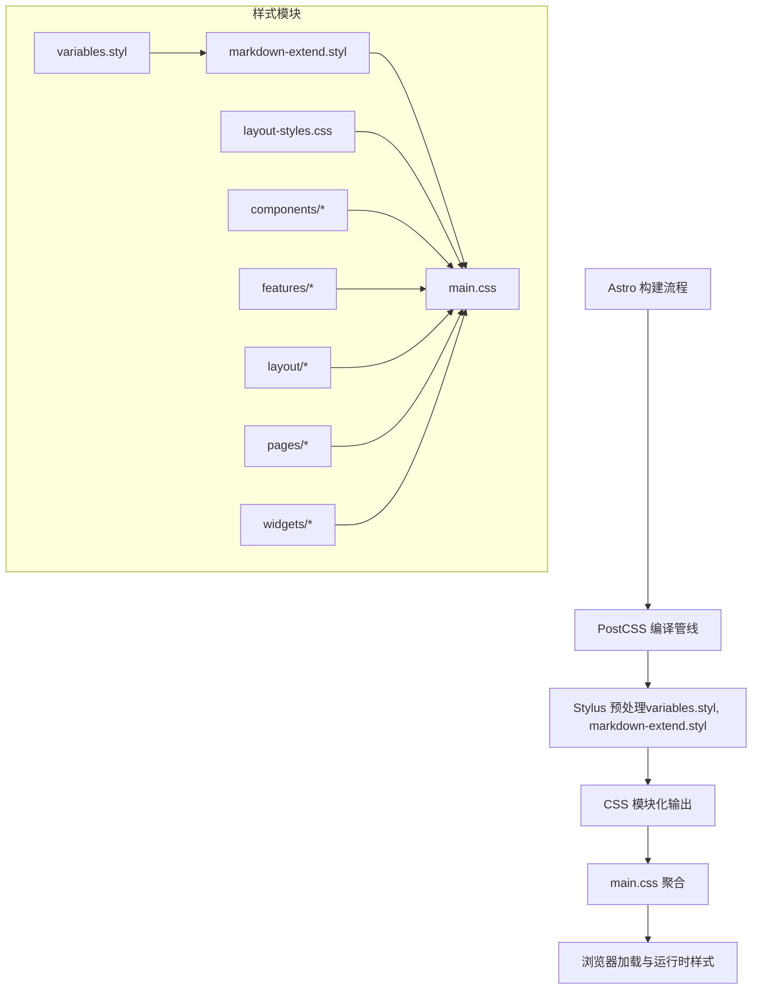
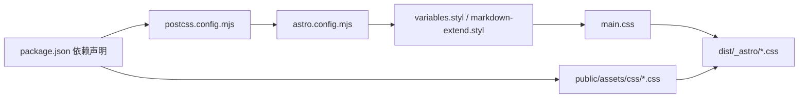

# CSS架构设计

<cite>
**本文档引用的文件**
- [variables.styl](file://src/styles/variables.styl)
- [markdown-extend.styl](file://src/styles/markdown-extend.styl)
- [main.css](file://src/styles/main.css)
- [layout-styles.css](file://src/styles/layout-styles.css)
- [expressive-code.css](file://src/styles/expressive-code.css)
- [fancybox-custom.css](file://src/styles/fancybox-custom.css)
- [custom-scrollbar.css](file://src/styles/custom-scrollbar.css)
- [transition.css](file://src/styles/transition.css)
- [waves.css](file://src/styles/waves.css)
- [toc.css](file://src/styles/toc.css)
- [components/about-canvas.css](file://src/styles/components/about-canvas.css)
- [components/ai-search.css](file://src/styles/components/ai-search.css)
- [components/animated-tabs.css](file://src/styles/components/animated-tabs.css)
- [components/bubble-menu.css](file://src/styles/components/bubble-menu.css)
- [components/button-tag.css](file://src/styles/components/button-tag.css)
- [components/category-bubble-menu.css](file://src/styles/components/category-bubble-menu.css)
- [components/cover-image.css](file://src/styles/components/cover-image.css)
- [components/floating-button.css](file://src/styles/components/floating-button.css)
- [components/floating-dock.css](file://src/styles/components/floating-dock.css)
- [components/floating-lyrics.css](file://src/styles/components/floating-lyrics.css)
- [components/friend-card.css](file://src/styles/components/friend-card.css)
- [components/friend-rules-modal.css](file://src/styles/components/friend-rules-modal.css)
- [components/guestbook-modals.css](file://src/styles/components/guestbook-modals.css)
- [components/home-data-layer.css](file://src/styles/components/home-data-layer.css)
- [components/home-hero.css](file://src/styles/components/home-hero.css)
- [components/home-portfolio-shutter.css](file://src/styles/components/home-portfolio-shutter.css)
- [components/home-section.css](file://src/styles/components/home-section.css)
- [components/home-ticker.css](file://src/styles/components/home-ticker.css)
- [components/live2d-widget.css](file://src/styles/components/live2d-widget.css)
- [components/music-player.css](file://src/styles/components/music-player.css)
- [components/page-loader.css](file://src/styles/components/page-loader.css)
- [components/page-title.css](file://src/styles/components/page-title.css)
- [components/pagination.css](file://src/styles/components/pagination.css)
- [components/post-card.css](file://src/styles/components/post-card.css)
- [components/post-list-actions.css](file://src/styles/components/post-list-actions.css)
- [components/post-page.css](file://src/styles/components/post-page.css)
- [components/privacy-modal.css](file://src/styles/components/privacy-modal.css)
- [components/typewriter.css](file://src/styles/components/typewriter.css)
- [components/widget-layout.css](file://src/styles/components/widget-layout.css)
- [features/movies-games.css](file://src/styles/features/movies-games.css)
- [layout/category-bar.css](file://src/styles/layout/category-bar.css)
- [layout/dropdown-menu.css](file://src/styles/layout/dropdown-menu.css)
- [layout/grid.css](file://src/styles/layout/grid.css)
- [layout/nav-menu-panel.css](file://src/styles/layout/nav-menu-panel.css)
- [layout/navbar-new.css](file://src/styles/layout/navbar-new.css)
- [pages/404.css](file://src/styles/pages/404.css)
- [pages/article-list.css](file://src/styles/pages/article-list.css)
- [pages/calendar.css](file://src/styles/pages/calendar.css)
- [pages/categories.css](file://src/styles/pages/categories.css)
- [pages/friends.css](file://src/styles/pages/friends.css)
- [pages/gallery.css](file://src/styles/pages/gallery.css)
- [pages/music-visualizer.css](file://src/styles/pages/music-visualizer.css)
- [pages/sponsor.css](file://src/styles/pages/sponsor.css)
- [widgets/advertisement.css](file://src/styles/widgets/advertisement.css)
- [widgets/announcement.css](file://src/styles/widgets/announcement.css)
- [widgets/archive-heatmap.css](file://src/styles/widgets/widgets/archive-heatmap.css)
- [widgets/calendar.css](file://src/styles/widgets/calendar.css)
- [widgets/sidebar-toc.css](file://src/styles/widgets/sidebar-toc.css)
- [widgets/terrarium-model.css](file://src/styles/widgets/terrarium-model.css)
- [astro.config.mjs](file://astro.config.mjs)
- [postcss.config.mjs](file://postcss.config.mjs)
- [svelte.config.js](file://svelte.config.js)
- [package.json](file://package.json)
</cite>

## 目录
1. [简介](#简介)
2. [项目结构](#项目结构)
3. [核心组件](#核心组件)
4. [架构总览](#架构总览)
5. [详细组件分析](#详细组件分析)
6. [依赖关系分析](#依赖关系分析)
7. [性能考虑](#性能考虑)
8. [故障排除指南](#故障排除指南)
9. [结论](#结论)

## 简介
本文件系统性梳理 Firefly-Mod 的 CSS 架构设计，重点覆盖以下方面：
- 基于 Stylus 的样式预处理体系：变量系统组织与命名规范、扩展样式模块化策略
- CSS 模块化原则：组件样式、布局样式、页面样式与工具类的分离
- 样式文件组织结构：主样式入口、组件样式分层、第三方样式集成
- CSS-in-JS 使用场景与最佳实践（尤其在 Svelte 组件中）
- 样式继承与覆盖规则：BEM 命名约定的应用与冲突避免
- 样式打包与优化：压缩、去重、按需加载的实现路径

## 项目结构
该项目采用“按功能域分层”的样式组织方式，核心目录为 src/styles，包含：
- 变量与基础样式：variables.styl、main.css、layout-styles.css 等
- 组件级样式：components/ 下按组件拆分的 CSS 文件
- 特性级样式：features/（如电影/游戏专题页）
- 布局级样式：layout/（导航栏、网格、菜单等）
- 页面级样式：pages/（404、文章列表、日历等）
- 小部件样式：widgets/（公告、侧边栏目录、日历等）
- 第三方样式：通过 public/assets/css 或构建产物引入（如 twikoo、highlight）

```mermaid
graph TB
subgraph "样式根目录 src/styles"
V["variables.styl<br/>变量与主题"]
M["main.css<br/>全局入口"]
L["layout-styles.css<br/>布局基线"]
E["expressive-code.css<br/>代码高亮扩展"]
F["fancybox-custom.css<br/>相册增强"]
S["custom-scrollbar.css<br/>滚动条美化"]
T["transition.css<br/>过渡动效"]
W["waves.css<br/>波浪装饰"]
C["toc.css<br/>目录样式"]
subgraph "components/"
CC1["about-canvas.css"]
CC2["ai-search.css"]
CC3["animated-tabs.css"]
CC4["bubble-menu.css"]
CC5["button-tag.css"]
CC6["category-bubble-menu.css"]
CC7["cover-image.css"]
CC8["floating-button.css"]
CC9["floating-dock.css"]
CC10["floating-lyrics.css"]
CC11["friend-card.css"]
CC12["friend-rules-modal.css"]
CC13["guestbook-modals.css"]
CC14["home-data-layer.css"]
CC15["home-hero.css"]
CC16["home-portfolio-shutter.css"]
CC17["home-section.css"]
CC18["home-ticker.css"]
CC19["live2d-widget.css"]
CC20["music-player.css"]
CC21["page-loader.css"]
CC22["page-title.css"]
CC23["pagination.css"]
CC24["post-card.css"]
CC25["post-list-actions.css"]
CC26["post-page.css"]
CC27["privacy-modal.css"]
CC28["typewriter.css"]
CC29["widget-layout.css"]
end
subgraph "features/"
FE1["movies-games.css"]
end
subgraph "layout/"
LA1["category-bar.css"]
LA2["dropdown-menu.css"]
LA3["grid.css"]
LA4["nav-menu-panel.css"]
LA5["navbar-new.css"]
end
subgraph "pages/"
PA1["404.css"]
PA2["article-list.css"]
PA3["calendar.css"]
PA4["categories.css"]
PA5["friends.css"]
PA6["gallery.css"]
PA7["music-visualizer.css"]
PA8["sponsor.css"]
end
subgraph "widgets/"
WI1["advertisement.css"]
WI2["announcement.css"]
WI3["archive-heatmap.css"]
WI4["calendar.css"]
WI5["sidebar-toc.css"]
WI6["terrarium-model.css"]
end
end
V --> M
M --> L
M --> CC1
M --> CC2
M --> FE1
M --> LA1
M --> PA1
M --> WI1
```

图表来源
- [variables.styl](file://src/styles/variables.styl)
- [main.css](file://src/styles/main.css)
- [layout-styles.css](file://src/styles/layout-styles.css)
- [components/about-canvas.css](file://src/styles/components/about-canvas.css)
- [components/ai-search.css](file://src/styles/components/ai-search.css)
- [features/movies-games.css](file://src/styles/features/movies-games.css)
- [layout/category-bar.css](file://src/styles/layout/category-bar.css)
- [pages/404.css](file://src/styles/pages/404.css)
- [widgets/advertisement.css](file://src/styles/widgets/advertisement.css)

章节来源
- [variables.styl](file://src/styles/variables.styl)
- [main.css](file://src/styles/main.css)
- [layout-styles.css](file://src/styles/layout-styles.css)

## 核心组件
- 变量系统与主题：通过 variables.styl 定义颜色、字体、间距、断点、阴影、动画时长等，统一管理设计令牌，供所有样式模块复用。
- 主样式入口：main.css 作为全局样式聚合点，导入变量、布局基线与各功能域样式，确保加载顺序与作用域隔离。
- 基础布局样式：layout-styles.css 提供栅格、容器、对齐等通用布局能力，避免重复定义。
- 扩展与第三方：expressive-code.css、fancybox-custom.css、custom-scrollbar.css 等用于增强代码渲染、相册展示与滚动条体验；部分第三方样式通过 public/assets/css 引入并在构建阶段合并。

章节来源
- [variables.styl](file://src/styles/variables.styl)
- [main.css](file://src/styles/main.css)
- [layout-styles.css](file://src/styles/layout-styles.css)
- [expressive-code.css](file://src/styles/expressive-code.css)
- [fancybox-custom.css](file://src/styles/fancybox-custom.css)
- [custom-scrollbar.css](file://src/styles/custom-scrollbar.css)

## 架构总览
整体采用“变量 → 基础 → 组件/特性/布局/页面/小部件”的层级化组织，配合 PostCSS 生态进行编译与优化，最终由 Astro 在构建时输出到 dist/_astro 与 public/assets。

图表来源
- [astro.config.mjs](file://astro.config.mjs)
- [postcss.config.mjs](file://postcss.config.mjs)
- [variables.styl](file://src/styles/variables.styl)
- [markdown-extend.styl](file://src/styles/markdown-extend.styl)
- [main.css](file://src/styles/main.css)

## 详细组件分析

### 变量系统与命名规范
- 设计令牌集中管理：颜色（主色、强调色、语义色）、字号、行高、字重、间距、圆角、阴影、动画曲线与时长、响应式断点等。
- 命名规范建议：
  - 颜色：primary、secondary、success、warning、danger、info、light、dark、background、text
  - 间距：space-xs 到 space-xxl，或以缩写 space-2xs/3xs/.../5xl
  - 字体：font-size-*、font-weight-*、line-height-*、font-family-base
  - 响应式：breakpoint-sm/md/lg/xl，配合媒体查询使用
  - 动画：duration-fast/slow、easing-standard
- 使用方式：在 CSS/Stylus 中通过变量引用，避免硬编码值；新增变量遵循“领域 + 语义”命名，例如 color-bg-primary、spacing-section、radius-md。

章节来源
- [variables.styl](file://src/styles/variables.styl)

### Stylus 扩展与 Markdown 渲染增强
- markdown-extend.styl：针对 Markdown 渲染结果（如 h1/h2、table、code、blockquote 等）提供统一风格，结合 variables.styl 实现主题一致性。
- 推荐做法：
  - 仅在表达“内容样式”而非“组件样式”的场景使用该文件
  - 与 expressive-code.css 协同，确保代码块在不同主题下可读性一致
  - 避免与组件内联样式冲突，必要时使用更具体的选择器或作用域限定

章节来源
- [markdown-extend.styl](file://src/styles/markdown-extend.styl)
- [expressive-code.css](file://src/styles/expressive-code.css)

### 组件样式模块化策略
- 分层原则：
  - 组件样式：components/ 下每个组件一个独立 CSS 文件，聚焦组件自身视觉与交互
  - 布局样式：layout/ 下管理导航、网格、菜单等跨页面布局元素
  - 页面样式：pages/ 下承载特定页面的定制样式
  - 小部件样式：widgets/ 下管理侧边栏、公告、目录等可复用 UI 片段
  - 特性样式：features/ 下承载专题页面（如电影/游戏）的定制样式
- 命名与选择器：
  - 优先采用 BEM 或类似前缀体系，避免全局污染
  - 类名尽量语义化，如 .c-button、.c-card__header、.c-modal--open
  - 避免深层后代选择器，减少样式耦合
- 作用域与隔离：
  - 在 Svelte 组件中使用 scoped 样式，或通过模块化 CSS（CSS Modules）隔离
  - 在 Astro 组件中，推荐使用样式作用域或 CSS-in-JS（见后文）

章节来源
- [components/button-tag.css](file://src/styles/components/button-tag.css)
- [components/post-card.css](file://src/styles/components/post-card.css)
- [layout/navbar-new.css](file://src/styles/layout/navbar-new.css)
- [pages/article-list.css](file://src/styles/pages/article-list.css)
- [widgets/sidebar-toc.css](file://src/styles/widgets/sidebar-toc.css)

### 样式文件组织与入口
- 主入口：main.css 聚合变量、基础布局与各功能域样式，保证加载顺序与作用域边界清晰
- 基线样式：layout-styles.css 提供通用栅格、容器、对齐等，避免重复定义
- 第三方样式：通过 public/assets/css 引入（如 twikoo、highlight），在构建阶段合并到最终产物
- 加载策略：在 Astro 页面中按需引入，避免不必要的全量加载

章节来源
- [main.css](file://src/styles/main.css)
- [layout-styles.css](file://src/styles/layout-styles.css)
- [public/assets/css/twikoo.css](file://public/assets/css/twikoo.css)
- [public/assets/css/highlight-github-dark.min.css](file://public/assets/css/highlight-github-dark.min.css)

### CSS-in-JS 与 Svelte 样式管理
- 使用场景：
  - 动态样式：根据状态切换的颜色、尺寸、动画参数
  - 事件驱动的局部样式：hover/active 状态下的即时反馈
  - 组件内部的临时样式：避免污染全局命名空间
- 最佳实践：
  - 优先使用 CSS 变量与类名切换，保持样式与逻辑解耦
  - 在 Svelte 中使用 scoped 样式或 CSS Modules，必要时配合内联样式
  - 避免在 JS 中频繁拼接字符串生成样式，优先通过类名控制
  - 对复杂动画使用 CSS 动画，JS 控制状态与触发时机

章节来源
- [svelte.config.js](file://svelte.config.js)

### 样式继承与覆盖规则（含 BEM 应用）
- 继承链路：基础变量 → 布局基线 → 组件样式 → 页面/特性/小部件样式
- 覆盖策略：
  - 低优先级：基础布局与通用样式
  - 中优先级：组件样式（scoped 或模块化）
  - 高优先级：页面/特性/小部件样式（按需引入）
- BEM 建议：
  - 块（Block）：.c-button、.c-card、.c-modal
  - 元素（Element）：.c-button__icon、.c-card__header
  - 修饰符（Modifier）：.c-button--primary、.c-card--featured
  - 避免使用过深的嵌套，优先使用 BEM 修饰符组合
- 冲突规避：
  - 为组件根节点添加唯一且语义化的类名
  - 通过作用域或 CSS Modules 限制样式泄漏
  - 在需要提升优先级时，使用更具体的选择器或 !important（谨慎使用）

章节来源
- [components/floating-button.css](file://src/styles/components/floating-button.css)
- [components/post-card.css](file://src/styles/components/post-card.css)

### 样式打包与优化策略
- 构建配置：
  - PostCSS：负责语法转换、自动前缀、压缩与去重（如 PurgeCSS）
  - Astro：在构建阶段聚合样式，输出至 dist/_astro 与 public/assets
- 压缩与去重：
  - 使用 PostCSS 插件链（如 cssnano）进行压缩与清理
  - 结合构建工具的 Tree Shaking，移除未使用的 CSS
- 按需加载：
  - 将页面/特性专用样式拆分为独立文件，在 Astro 页面中按需引入
  - 第三方样式（如 twikoo、highlight）单独打包，避免阻塞首屏
- 性能建议：
  - 合理拆分样式模块，避免单文件过大
  - 使用 CSS 变量减少重复定义，提高维护效率
  - 避免在关键路径上加载非必要的样式

章节来源
- [postcss.config.mjs](file://postcss.config.mjs)
- [astro.config.mjs](file://astro.config.mjs)
- [package.json](file://package.json)

## 依赖关系分析
- 构建链路依赖：Astro → PostCSS → Stylus → CSS 输出
- 样式依赖：variables.styl → markdown-extend.styl → main.css → 各功能域样式
- 第三方依赖：public/assets/css 下的外部样式库（twikoo、highlight 等）

图表来源
- [package.json](file://package.json)
- [postcss.config.mjs](file://postcss.config.mjs)
- [astro.config.mjs](file://astro.config.mjs)
- [variables.styl](file://src/styles/variables.styl)
- [markdown-extend.styl](file://src/styles/markdown-extend.styl)
- [main.css](file://src/styles/main.css)
- [public/assets/css/twikoo.css](file://public/assets/css/twikoo.css)

章节来源
- [package.json](file://package.json)
- [postcss.config.mjs](file://postcss.config.mjs)
- [astro.config.mjs](file://astro.config.mjs)

## 性能考虑
- 样式体积控制：拆分模块、按需引入、Tree Shaking
- 关键路径优化：将首屏必需样式内联，非关键样式延迟加载
- 动画与重绘：优先使用 transform/opacity 等低成本属性
- 变量与复用：通过 CSS 变量与模块化减少重复计算与传输

## 故障排除指南
- 样式不生效或被覆盖：
  - 检查 main.css 的导入顺序与优先级
  - 确认组件是否使用了作用域或模块化 CSS
  - 避免使用过深的后代选择器导致优先级混乱
- 第三方样式冲突：
  - 将第三方样式放入独立文件，并在 Astro 页面中按需引入
  - 使用作用域或 CSS Modules 隔离第三方样式
- 构建后样式缺失：
  - 检查 astro.config.mjs 与 postcss.config.mjs 的配置
  - 确认 public/assets/css 是否正确复制到 dist/public

章节来源
- [main.css](file://src/styles/main.css)
- [astro.config.mjs](file://astro.config.mjs)
- [postcss.config.mjs](file://postcss.config.mjs)

## 结论
本项目通过 Stylus 变量系统与模块化 CSS 架构，实现了从变量到组件、页面与小部件的完整样式体系。配合 Astro 与 PostCSS 的构建链路，达到样式压缩、去重与按需加载的目标。建议在后续迭代中持续完善变量命名规范、加强作用域隔离与按需加载策略，进一步提升可维护性与性能表现。