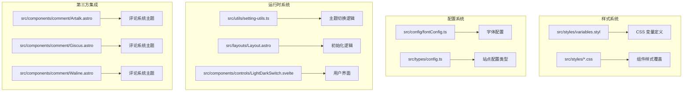
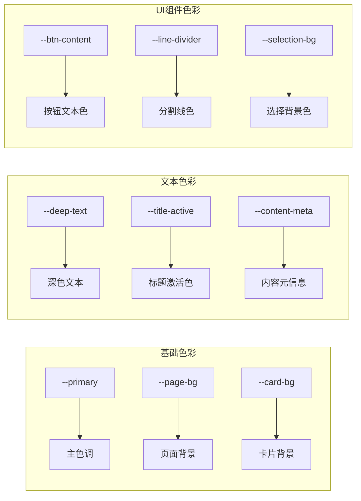
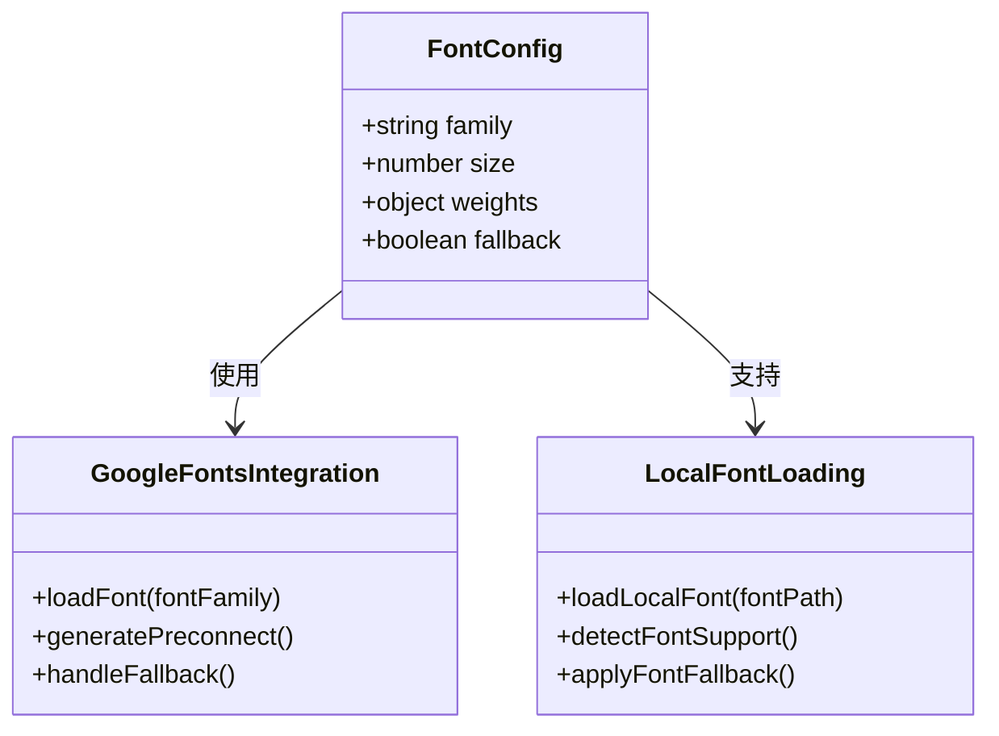
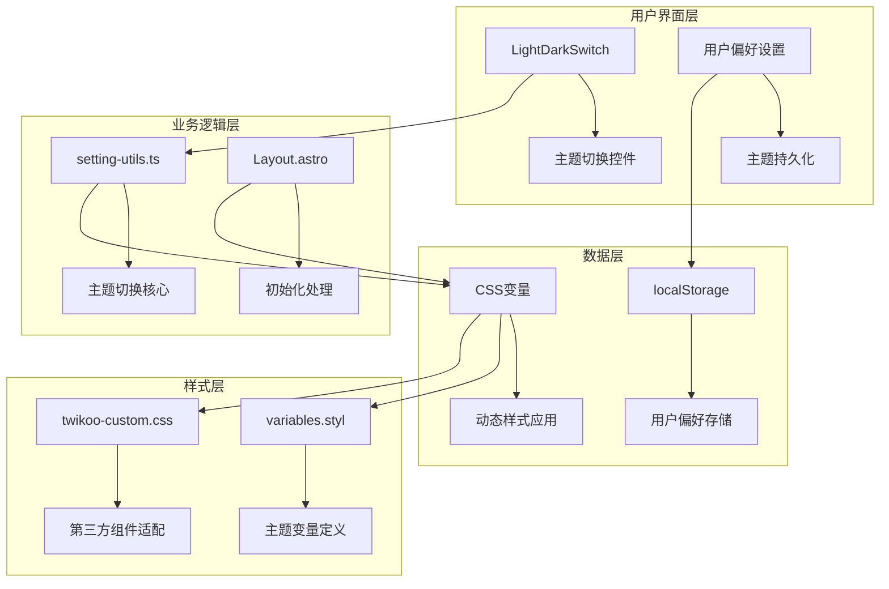
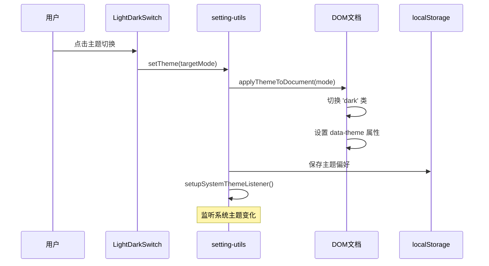
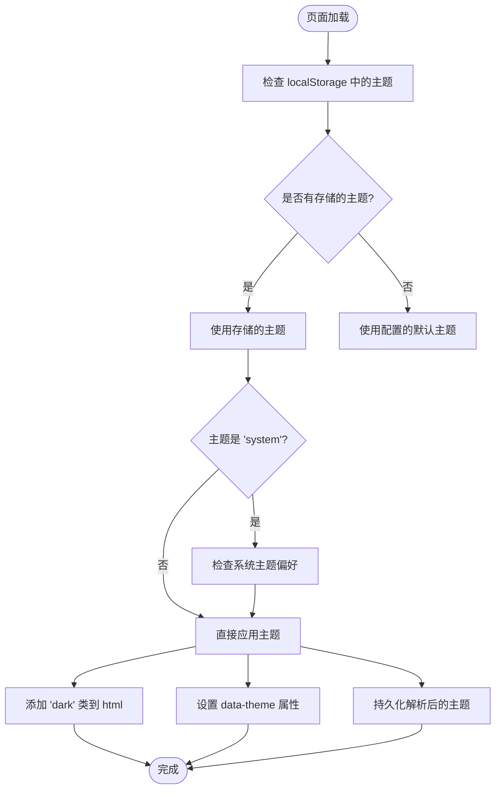
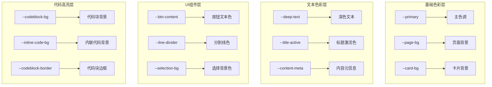
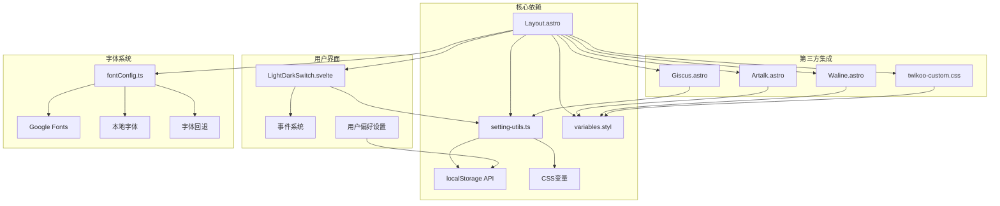

# 主题系统设计

<cite>
**本文档引用的文件**
- [variables.styl](file://src/styles/variables.styl)
- [twikoo-custom.css](file://public/assets/css/twikoo-custom.css)
- [config.ts](file://src/types/config.ts)
- [setting-utils.ts](file://src/utils/setting-utils.ts)
- [Layout.astro](file://src/layouts/Layout.astro)
- [LightDarkSwitch.svelte](file://src/components/controls/LightDarkSwitch.svelte)
- [config.ts](file://src/config/fontConfig.ts)
- [Artalk.astro](file://src/components/comment/Artalk.astro)
- [Giscus.astro](file://src/components/comment/Giscus.astro)
- [Waline.astro](file://src/components/comment/Waline.astro)
</cite>

## 目录
1. [简介](#简介)
2. [项目结构](#项目结构)
3. [核心组件](#核心组件)
4. [架构概览](#架构概览)
5. [详细组件分析](#详细组件分析)
6. [依赖关系分析](#依赖关系分析)
7. [性能考虑](#性能考虑)
8. [故障排除指南](#故障排除指南)
9. [结论](#结论)

## 简介

Firefly-Mod 主题系统是一个基于现代 CSS 变量和 JavaScript 的完整主题解决方案。该系统采用 OKLCH 颜色空间，实现了完整的深色/浅色主题切换功能，支持用户偏好的持久化存储，并提供了灵活的主题定制能力。

## 项目结构

主题系统主要分布在以下几个关键目录中：



**图表来源**
- [variables.styl:1-44](file://src/styles/variables.styl#L1-L44)
- [setting-utils.ts:133-185](file://src/utils/setting-utils.ts#L133-L185)
- [Layout.astro:152-190](file://src/layouts/Layout.astro#L152-L190)

**章节来源**
- [variables.styl:1-44](file://src/styles/variables.styl#L1-L44)
- [config.ts:1-55](file://src/types/config.ts#L1-L55)

## 核心组件

### 主题变量系统

Firefly-Mod 采用了基于 OKLCH 颜色空间的现代色彩系统，提供了完整的主题变量定义：

#### 基础变量定义
- `--radius-large`: 0.75rem - 大圆角半径
- `--content-delay`: 150ms - 内容延迟动画时间

#### 主题色彩变量
系统定义了完整的色彩层次结构：



**图表来源**
- [variables.styl:10-44](file://src/styles/variables.styl#L10-L44)

#### 按钮状态色彩
系统为不同类型的按钮定义了完整的状态色彩体系：
- 悬停状态：`--btn-regular-bg-hover` (oklch 0.94 0 0)
- 激活状态：`--btn-regular-bg-active` (oklch 0.90 0 0)
- 卡片按钮：`--btn-card-bg-hover` (oklch 0.96 0 0)

**章节来源**
- [variables.styl:10-44](file://src/styles/variables.styl#L10-L44)

### 字体系统配置

字体系统采用灵活的配置架构，支持多种字体源：

#### 字体配置结构


**图表来源**
- [config.ts](file://src/config/fontConfig.ts)

#### 字体回退策略
系统实现了智能的字体回退机制：
1. 优先加载配置的字体
2. 自动检测字体支持情况
3. 应用合适的回退字体
4. 保持一致的排版体验

**章节来源**
- [config.ts](file://src/config/fontConfig.ts)

## 架构概览

Firefly-Mod 主题系统采用分层架构设计，确保了良好的可维护性和扩展性：



**图表来源**
- [setting-utils.ts:153-175](file://src/utils/setting-utils.ts#L153-L175)
- [Layout.astro:152-169](file://src/layouts/Layout.astro#L152-L169)

## 详细组件分析

### 主题切换机制

#### JavaScript 主题切换实现



**图表来源**
- [LightDarkSwitch.svelte:50-90](file://src/components/controls/LightDarkSwitch.svelte#L50-L90)
- [setting-utils.ts:153-175](file://src/utils/setting-utils.ts#L153-L175)

#### 初始化流程



**图表来源**
- [Layout.astro:152-169](file://src/layouts/Layout.astro#L152-L169)

**章节来源**
- [LightDarkSwitch.svelte:50-90](file://src/components/controls/LightDarkSwitch.svelte#L50-L90)
- [setting-utils.ts:153-175](file://src/utils/setting-utils.ts#L153-L175)
- [Layout.astro:152-169](file://src/layouts/Layout.astro#L152-L169)

### 第三方组件主题适配

#### 评论系统主题集成

Firefly-Mod 为多个评论系统提供了专门的主题适配：

```mermaid
graph LR
subgraph "Artalk 适配"
A[Artalk.astro] --> B[--at-color-main: var(--primary)]
A --> C[--at-color-bg: var(--card-bg)]
A --> D[--at-color-border: var(--line-divider)]
end
subgraph "Giscus 适配"
E[Giscus.astro] --> F[动态主题切换]
E --> G[消息传递同步]
end
subgraph "Waline 适配"
H[Waline.astro] --> I[深色模式支持]
H --> J[主题配置同步]
end
```

**图表来源**
- [Artalk.astro:12-20](file://src/components/comment/Artalk.astro#L12-L20)
- [Giscus.astro:15-21](file://src/components/comment/Giscus.astro#L15-L21)
- [Waline.astro:11-11](file://src/components/comment/Waline.astro#L11-L11)

#### Twikoo 主题覆盖

Twikoo 评论系统的主题适配体现了 Firefly-Mod 的设计理念：

**章节来源**
- [Artalk.astro:12-20](file://src/components/comment/Artalk.astro#L12-L20)
- [Giscus.astro:15-21](file://src/components/comment/Giscus.astro#L15-L21)
- [Waline.astro:11-11](file://src/components/comment/Waline.astro#L11-L11)
- [twikoo-custom.css:1-270](file://public/assets/css/twikoo-custom.css#L1-L270)

### 主题变量系统

#### 颜色变量组织

系统采用层次化的颜色变量组织方式：



**图表来源**
- [variables.styl:10-44](file://src/styles/variables.styl#L10-L44)

**章节来源**
- [variables.styl:1-44](file://src/styles/variables.styl#L1-L44)

## 依赖关系分析

### 组件耦合关系



**图表来源**
- [Layout.astro:152-190](file://src/layouts/Layout.astro#L152-L190)
- [setting-utils.ts:153-175](file://src/utils/setting-utils.ts#L153-L175)
- [LightDarkSwitch.svelte:50-90](file://src/components/controls/LightDarkSwitch.svelte#L50-L90)

**章节来源**
- [Layout.astro:152-190](file://src/layouts/Layout.astro#L152-L190)
- [setting-utils.ts:153-175](file://src/utils/setting-utils.ts#L153-L175)
- [LightDarkSwitch.svelte:50-90](file://src/components/controls/LightDarkSwitch.svelte#L50-L90)

## 性能考虑

### CSS 变量优化

Firefly-Mod 主题系统充分利用了 CSS 变量的优势：

1. **运行时性能**：CSS 变量在浏览器内部进行了优化，避免了频繁的 DOM 操作
2. **内存效率**：单个 CSS 文件包含所有主题变量，减少了 HTTP 请求
3. **渲染性能**：浏览器可以更好地优化 CSS 变量的计算和缓存

### JavaScript 优化策略

1. **懒加载**：主题切换逻辑按需加载，减少初始包大小
2. **事件节流**：系统主题监听器使用了适当的节流机制
3. **缓存策略**：用户偏好和主题状态在内存中进行缓存

## 故障排除指南

### 常见问题及解决方案

#### 主题切换不生效

**症状**：点击主题切换按钮后界面没有变化

**可能原因**：
1. localStorage 权限问题
2. CSS 变量未正确应用
3. JavaScript 错误阻止了执行

**解决步骤**：
1. 检查浏览器控制台是否有 JavaScript 错误
2. 验证 localStorage 是否可用
3. 确认 CSS 变量文件是否正确加载
4. 检查 `html` 元素是否正确添加了 `dark` 类

#### 系统主题监听失效

**症状**：切换系统主题后网站没有相应变化

**解决方法**：
1. 确认当前主题设置为 "system"
2. 检查 `prefers-color-scheme` 媒体查询是否正常工作
3. 验证 `setupSystemThemeListener` 函数是否被正确调用

#### 字体加载问题

**症状**：页面字体显示异常或加载缓慢

**解决步骤**：
1. 检查 Google Fonts 链接是否可达
2. 验证本地字体文件路径
3. 确认字体回退机制正常工作
4. 检查字体预连接配置

**章节来源**
- [setting-utils.ts:148-185](file://src/utils/setting-utils.ts#L148-L185)
- [Layout.astro:152-169](file://src/layouts/Layout.astro#L152-L169)

## 结论

Firefly-Mod 主题系统通过精心设计的架构实现了现代化的主题管理功能。其基于 OKLCH 颜色空间的色彩系统、灵活的 CSS 变量机制以及完善的第三方组件适配，为用户提供了优秀的主题体验。

系统的主要优势包括：
- **现代化色彩管理**：采用 OKLCH 颜色空间，提供更自然的颜色过渡
- **完整的主题生命周期**：从初始化到持久化的完整流程
- **灵活的扩展性**：易于添加新的主题变量和组件适配
- **优秀的性能表现**：通过 CSS 变量和优化的 JavaScript 实现

未来的发展方向可以包括：
- 更多的预设主题选项
- 动态色彩调整功能
- 更丰富的字体配置选项
- 主题导出/导入功能