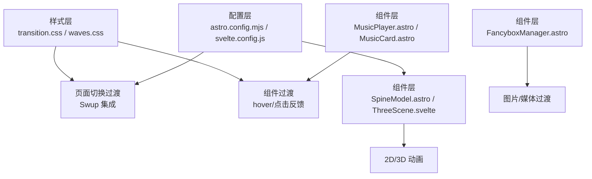
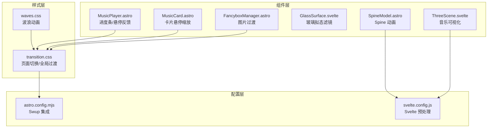
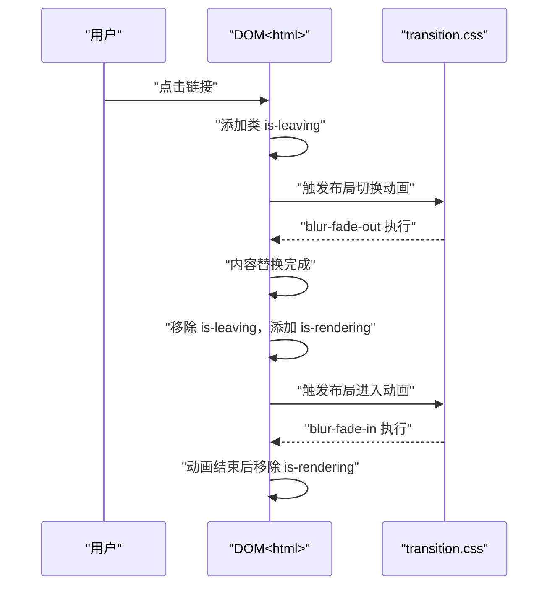
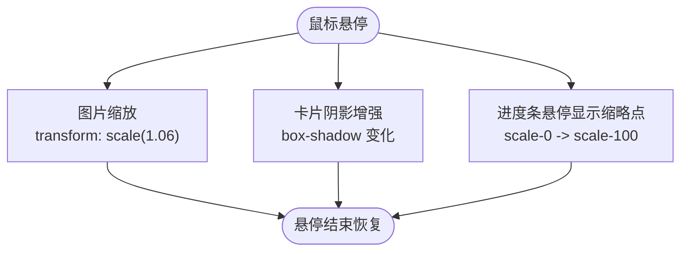
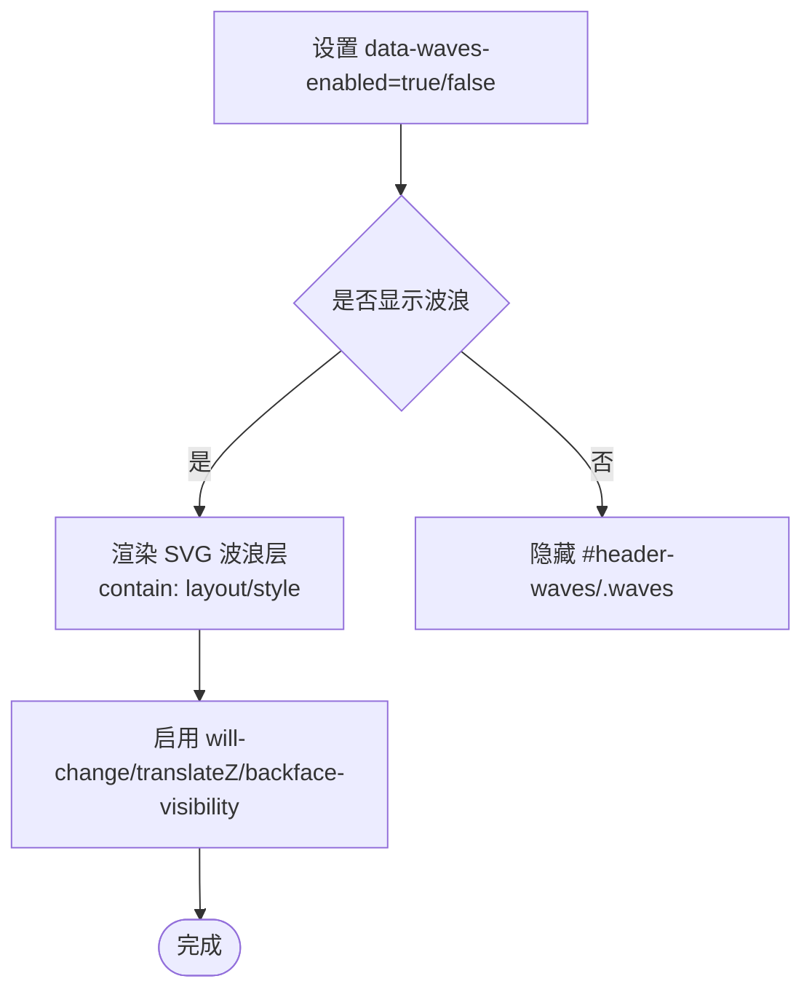
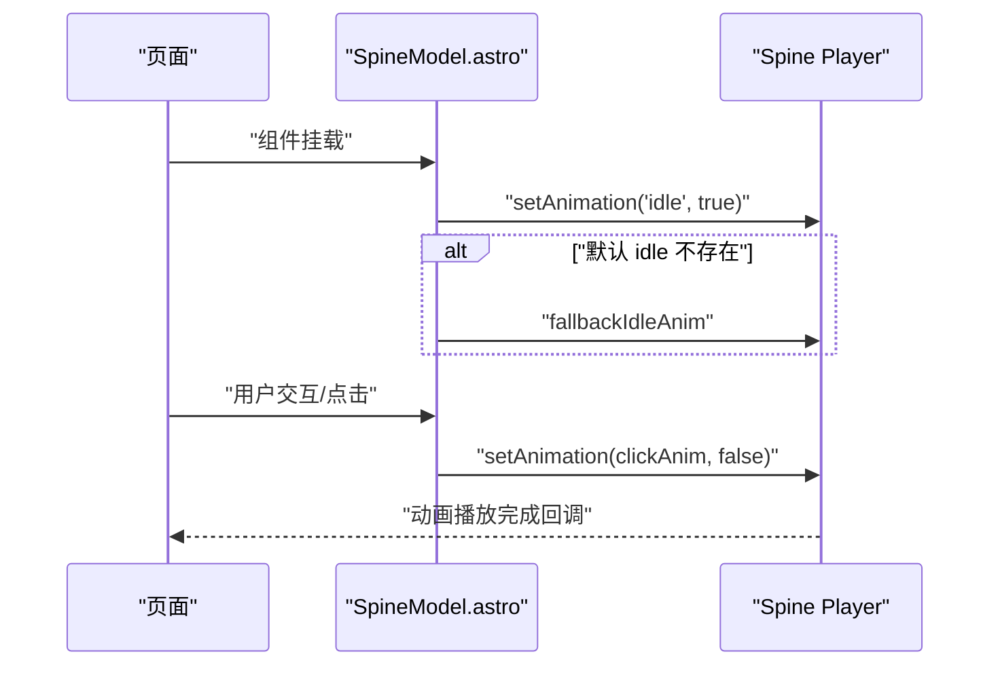
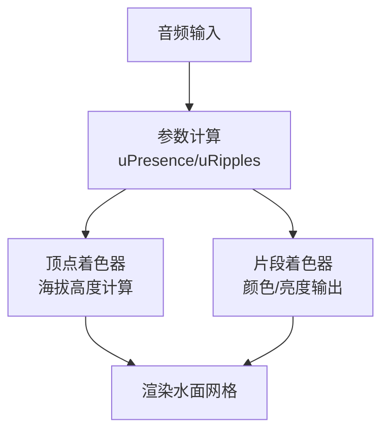
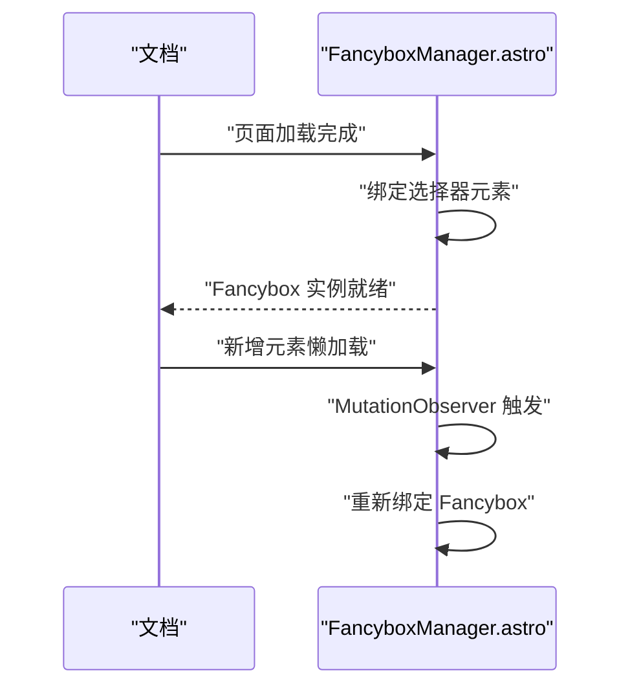
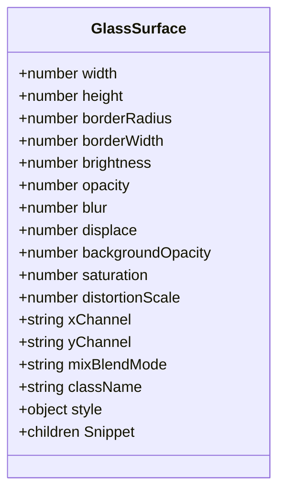
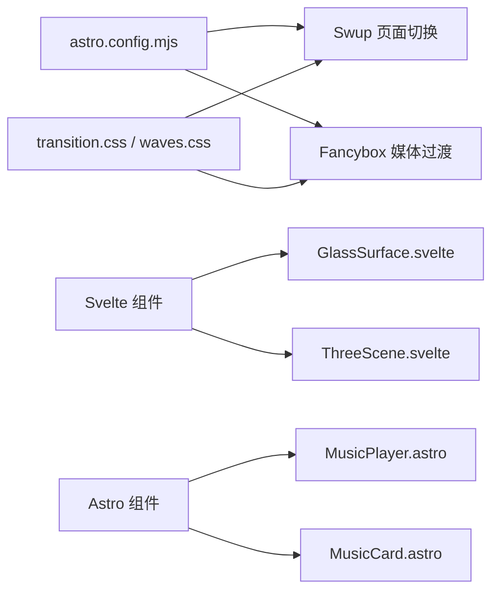

# 动画与过渡效果

<cite>
**本文引用的文件**
- [transition.css](file://src/styles/transition.css)
- [waves.css](file://src/styles/waves.css)
- [MusicPlayer.astro](file://src/components/features/MusicPlayer.astro)
- [MusicCard.astro](file://src/components/pages/music/MusicCard.astro)
- [bangumi.astro](file://src/pages/bangumi.astro)
- [post-page.css](file://src/styles/components/post-page.css)
- [CollectionItemEditor.svelte](file://src/components/edit/CollectionItemEditor.svelte)
- [GlassSurface.svelte](file://src/components/common/GlassSurface.svelte)
- [SpineModel.astro](file://src/components/features/SpineModel.astro)
- [ThreeScene.svelte](file://src/components/features/music-visualizer/ThreeScene.svelte)
- [FancyboxManager.astro](file://src/components/features/FancyboxManager.astro)
- [astro.config.mjs](file://astro.config.mjs)
- [svelte.config.js](file://svelte.config.js)
- [小爱弥斯.model3.json](file://public/pio/models/live2d/小爱弥斯_vts/小爱弥斯.model3.json)
</cite>

## 目录
1. [简介](#简介)
2. [项目结构](#项目结构)
3. [核心组件](#核心组件)
4. [架构概览](#架构概览)
5. [详细组件分析](#详细组件分析)
6. [依赖关系分析](#依赖关系分析)
7. [性能考量](#性能考量)
8. [故障排除指南](#故障排除指南)
9. [结论](#结论)

## 简介
本文件系统性梳理 Firefly-Mod 的动画与过渡效果实现，覆盖 CSS 动画与关键帧、页面切换过渡、交互过渡、JavaScript/Svelte 驱动的动画、Live2D/Spine 2D 动画、WebGL 音乐可视化波纹效果，以及可访问性与性能优化策略。目标是帮助开发者快速理解并扩展动画体系。

## 项目结构
动画与过渡效果主要分布在以下位置：
- 样式层：全局过渡与页面切换、波浪动画、组件级过渡
- 组件层：音乐播放器进度条、卡片悬停缩放、页面切换动画、Live2D/Spine 动画、音乐可视化
- 配置层：Astro 集成 Swup 页面切换、Svelte 预处理

**图表来源**
- [transition.css:1-85](file://src/styles/transition.css#L1-L85)
- [waves.css:1-158](file://src/styles/waves.css#L1-L158)
- [MusicPlayer.astro:92-106](file://src/components/features/MusicPlayer.astro#L92-L106)
- [MusicCard.astro:95-156](file://src/components/pages/music/MusicCard.astro#L95-L156)
- [SpineModel.astro:269-306](file://src/components/features/SpineModel.astro#L269-L306)
- [ThreeScene.svelte:304-350](file://src/components/features/music-visualizer/ThreeScene.svelte#L304-L350)
- [FancyboxManager.astro:52-103](file://src/components/features/FancyboxManager.astro#L52-L103)
- [astro.config.mjs:1-25](file://astro.config.mjs#L1-L25)
- [svelte.config.js:1-5](file://svelte.config.js#L1-L5)

**章节来源**
- [transition.css:1-85](file://src/styles/transition.css#L1-L85)
- [waves.css:1-158](file://src/styles/waves.css#L1-L158)
- [astro.config.mjs:1-25](file://astro.config.mjs#L1-L25)
- [svelte.config.js:1-5](file://svelte.config.js#L1-L5)

## 核心组件
- 页面切换过渡（Swup）：基于 CSS 关键帧的淡入淡出与模糊过渡，配合 is-leaving/is-rendering 状态类驱动。
- 组件过渡：hover 状态平滑过渡、点击反馈缩放、卡片布局切换动画。
- 特殊效果：波浪动画（SVG）、Live2D/Spine 2D 动画、WebGL 音乐可视化波纹。
- JavaScript/Svelte 动画：Svelte 过渡指令与自定义动画逻辑、第三方库（Fancybox）集成。

**章节来源**
- [transition.css:52-85](file://src/styles/transition.css#L52-L85)
- [MusicPlayer.astro:92-106](file://src/components/features/MusicPlayer.astro#L92-L106)
- [MusicCard.astro:95-156](file://src/components/pages/music/MusicCard.astro#L95-L156)
- [post-page.css:45-95](file://src/styles/components/post-page.css#L45-L95)
- [SpineModel.astro:269-306](file://src/components/features/SpineModel.astro#L269-L306)
- [ThreeScene.svelte:304-350](file://src/components/features/music-visualizer/ThreeScene.svelte#L304-L350)
- [FancyboxManager.astro:52-103](file://src/components/features/FancyboxManager.astro#L52-L103)

## 架构概览
整体采用“样式驱动 + 组件驱动 + 第三方库”的混合架构：
- 样式驱动：CSS 关键帧与过渡统一管理页面与组件动画。
- 组件驱动：Svelte 与 Astro 组件结合 JS 逻辑实现动态动画。
- 第三方库：Swup（页面切换）、Fancybox（图片/媒体展示）。

**图表来源**
- [transition.css:1-85](file://src/styles/transition.css#L1-L85)
- [waves.css:1-158](file://src/styles/waves.css#L1-L158)
- [MusicPlayer.astro:92-106](file://src/components/features/MusicPlayer.astro#L92-L106)
- [MusicCard.astro:95-156](file://src/components/pages/music/MusicCard.astro#L95-L156)
- [SpineModel.astro:269-306](file://src/components/features/SpineModel.astro#L269-L306)
- [GlassSurface.svelte:1-57](file://src/components/common/GlassSurface.svelte#L1-L57)
- [ThreeScene.svelte:304-350](file://src/components/features/music-visualizer/ThreeScene.svelte#L304-L350)
- [FancyboxManager.astro:52-103](file://src/components/features/FancyboxManager.astro#L52-L103)
- [astro.config.mjs:1-25](file://astro.config.mjs#L1-L25)
- [svelte.config.js:1-5](file://svelte.config.js#L1-L5)

## 详细组件分析

### 页面切换过渡（Swup）
- 关键帧：blur-fade-out/in 提供离开/进入阶段的模糊与位移过渡。
- 触发机制：通过 html 的 is-leaving/is-rendering 类控制动画执行。
- 可访问性：匹配 prefers-reduced-motion: reduce 时禁用动画。

**图表来源**
- [transition.css:52-85](file://src/styles/transition.css#L52-L85)

**章节来源**
- [transition.css:52-85](file://src/styles/transition.css#L52-L85)

### 组件过渡：hover 与点击反馈
- 音乐播放器进度条：悬停显示缩略点，使用 transition-transform 实现平滑缩放。
- 音乐卡片：hover 时卡片上浮与阴影变化，图片使用 transform: scale 实现缩放。
- 布局切换：卡片组透明度与位移动画，hover 时进一步增强阴影与位移。

**图表来源**
- [MusicPlayer.astro:92-106](file://src/components/features/MusicPlayer.astro#L92-L106)
- [MusicCard.astro:95-156](file://src/components/pages/music/MusicCard.astro#L95-L156)
- [post-page.css:45-95](file://src/styles/components/post-page.css#L45-L95)

**章节来源**
- [MusicPlayer.astro:92-106](file://src/components/features/MusicPlayer.astro#L92-L106)
- [MusicCard.astro:95-156](file://src/components/pages/music/MusicCard.astro#L95-L156)
- [post-page.css:45-95](file://src/styles/components/post-page.css#L45-L95)

### 特殊效果：波浪动画
- 控制方式：通过 html 属性 data-waves-enabled 切换显示；支持壁纸模式 none 时隐藏。
- 性能优化：使用 will-change: transform、transform: translateZ(0)、backface-visibility: hidden 等提升渲染性能。

**图表来源**
- [waves.css:1-158](file://src/styles/waves.css#L1-L158)

**章节来源**
- [waves.css:1-158](file://src/styles/waves.css#L1-L158)

### 特殊效果：Live2D/Spine 2D 动画
- Spine 动画：初始化后设置 idle 循环动画，兜底回退动画，确保模型可用性；支持点击/触摸触发不同动画。
- Live2D 动画：模型配置文件中定义了多种动作序列与淡入淡出时间，用于交互触发。

**图表来源**
- [SpineModel.astro:269-306](file://src/components/features/SpineModel.astro#L269-L306)

**章节来源**
- [SpineModel.astro:269-306](file://src/components/features/SpineModel.astro#L269-L306)
- [小爱弥斯.model3.json:41-58](file://public/pio/models/live2d/小爱弥斯_vts/小爱弥斯.model3.json#L41-L58)

### 特殊效果：WebGL 音乐可视化波纹
- ThreeScene：顶点着色器根据多个波纹叠加计算海拔高度，片段着色器输出颜色与亮度，形成随音乐节律波动的水面效果。
- 参数：uPresence、uRipples、uBaseColor 等统一控制视觉表现。

**图表来源**
- [ThreeScene.svelte:304-350](file://src/components/features/music-visualizer/ThreeScene.svelte#L304-L350)

**章节来源**
- [ThreeScene.svelte:304-350](file://src/components/features/music-visualizer/ThreeScene.svelte#L304-L350)

### 图片与媒体过渡（Fancybox）
- 绑定规则：对文章封面、相册图片、动态图片等元素绑定 Fancybox，统一过渡为 slide。
- 动态元素：通过 MutationObserver 监听 client:visible 懒加载后的元素，动态绑定。

**图表来源**
- [FancyboxManager.astro:52-103](file://src/components/features/FancyboxManager.astro#L52-L103)

**章节来源**
- [FancyboxManager.astro:52-103](file://src/components/features/FancyboxManager.astro#L52-L103)

### Svelte 动画与第三方库集成
- Svelte 预处理：启用 vitePreprocess 以支持 Svelte 组件中的脚本与动画。
- Svelte 动画：GlassSurface 使用大量 CSS 变量与滤镜组合实现拟态与微扰效果，适合在 Svelte 中进行状态驱动的动画。

**图表来源**
- [GlassSurface.svelte:1-57](file://src/components/common/GlassSurface.svelte#L1-L57)

**章节来源**
- [svelte.config.js:1-5](file://svelte.config.js#L1-L5)
- [GlassSurface.svelte:1-57](file://src/components/common/GlassSurface.svelte#L1-L57)

## 依赖关系分析
- 页面切换依赖：Swup 通过 astro.config.mjs 集成，CSS 关键帧负责动画细节。
- 组件动画依赖：Svelte 与 Astro 组件通过 CSS 过渡与 JS 状态共同驱动。
- 第三方库：Fancybox 与 Swup 解耦，分别负责媒体过渡与页面切换。

**图表来源**
- [astro.config.mjs:1-25](file://astro.config.mjs#L1-L25)
- [transition.css:1-85](file://src/styles/transition.css#L1-L85)
- [waves.css:1-158](file://src/styles/waves.css#L1-L158)
- [GlassSurface.svelte:1-57](file://src/components/common/GlassSurface.svelte#L1-L57)
- [ThreeScene.svelte:304-350](file://src/components/features/music-visualizer/ThreeScene.svelte#L304-L350)
- [MusicPlayer.astro:92-106](file://src/components/features/MusicPlayer.astro#L92-L106)
- [MusicCard.astro:95-156](file://src/components/pages/music/MusicCard.astro#L95-L156)

**章节来源**
- [astro.config.mjs:1-25](file://astro.config.mjs#L1-L25)
- [transition.css:1-85](file://src/styles/transition.css#L1-L85)
- [waves.css:1-158](file://src/styles/waves.css#L1-L158)

## 性能考量
- 硬件加速与合成层
  - 使用 transform: translateZ(0)、will-change: transform、backface-visibility: hidden 提升渲染性能。
  - 波浪容器使用 contain: layout style 限制重排范围。
- 帧率与动画时长
  - 过渡时长普遍在 200ms~500ms，使用缓动曲线（如 cubic-bezier）平衡自然感与性能。
- 内存管理
  - 动画结束后及时移除状态类（如 is-leaving/is-rendering），避免残留样式影响后续渲染。
  - 图片/媒体过渡使用 Fancybox 实例管理，避免重复绑定造成内存泄漏。
- 可访问性
  - 响应 prefers-reduced-motion: reduce，完全禁用页面切换与组件过渡动画。

**章节来源**
- [waves.css:19-42](file://src/styles/waves.css#L19-L42)
- [transition.css:64-72](file://src/styles/transition.css#L64-L72)
- [FancyboxManager.astro:92-97](file://src/components/features/FancyboxManager.astro#L92-L97)

## 故障排除指南
- 页面切换无动画
  - 检查 html 是否正确添加/移除 is-leaving/is-rendering 类。
  - 确认 transition.css 中 blur-fade-out/in 关键帧未被覆盖。
- 组件过渡无效
  - 检查 hover 状态下的 transition 属性是否被子元素覆盖（如 :hover 子选择器）。
  - 确认 CSS 优先级与 !important 使用情况。
- Live2D/Spine 动画不播放
  - 确认模型文件中动画名称与配置一致，检查 availableAnimations 集合。
  - 若默认 idle 不存在，确认 fallbackIdleAnim 是否正确设置。
- WebGL 波纹异常
  - 检查音频参数传递（uPresence/uRipples）是否更新，着色器中参数是否正确采样。
- 图片过渡失效
  - 确认动态元素懒加载后是否重新触发绑定；检查 MutationObserver 是否正常工作。

**章节来源**
- [transition.css:52-85](file://src/styles/transition.css#L52-L85)
- [MusicCard.astro:95-156](file://src/components/pages/music/MusicCard.astro#L95-L156)
- [SpineModel.astro:269-306](file://src/components/features/SpineModel.astro#L269-L306)
- [ThreeScene.svelte:304-350](file://src/components/features/music-visualizer/ThreeScene.svelte#L304-L350)
- [FancyboxManager.astro:92-103](file://src/components/features/FancyboxManager.astro#L92-L103)

## 结论
Firefly-Mod 的动画体系以 CSS 关键帧与过渡为基础，结合 Svelte/Astro 组件实现交互驱动的动画，并通过 Swup 与 Fancybox 提供页面与媒体层面的流畅体验。Live2D/Spine 与 WebGL 可视化进一步丰富了动态表现。遵循硬件加速、帧率控制与可访问性原则，可在保证性能的同时提供优秀的用户体验。