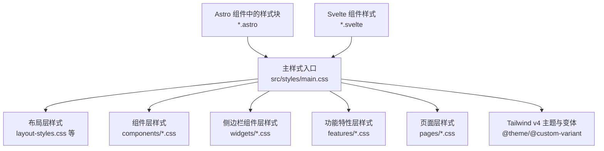
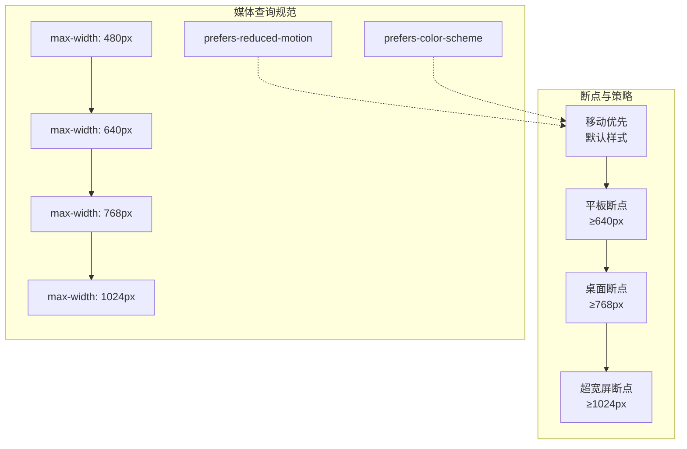
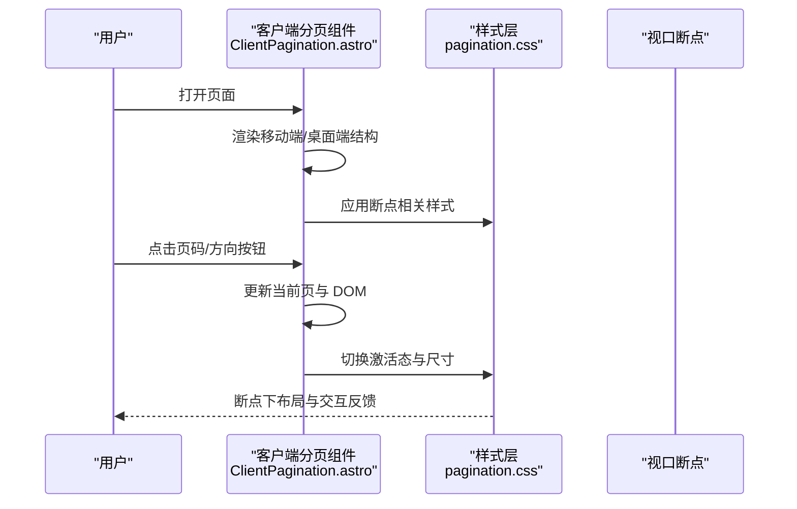
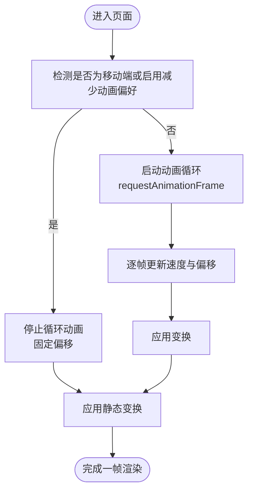
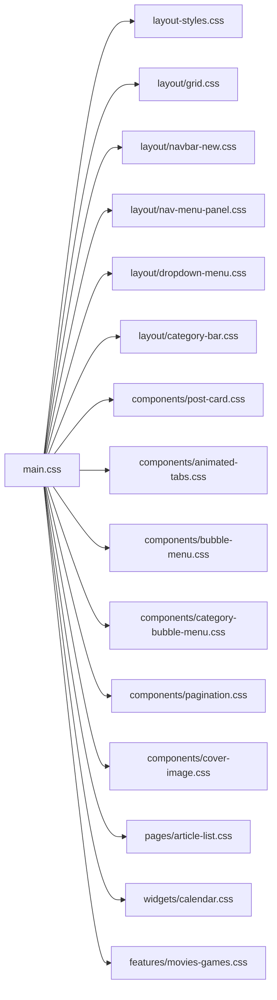

# 响应式设计

<cite>
**本文引用的文件**
- [main.css](file://src/styles/main.css)
- [layout-styles.css](file://src/styles/layout-styles.css)
- [grid.css](file://src/styles/layout/grid.css)
- [navbar-new.css](file://src/styles/layout/navbar-new.css)
- [nav-menu-panel.css](file://src/styles/layout/nav-menu-panel.css)
- [dropdown-menu.css](file://src/styles/layout/dropdown-menu.css)
- [category-bar.css](file://src/styles/layout/category-bar.css)
- [post-card.css](file://src/styles/components/post-card.css)
- [animated-tabs.css](file://src/styles/components/animated-tabs.css)
- [bubble-menu.css](file://src/styles/components/bubble-menu.css)
- [category-bubble-menu.css](file://src/styles/components/category-bubble-menu.css)
- [page-title.css](file://src/styles/components/page-title.css)
- [post-list-actions.css](file://src/styles/components/post-list-actions.css)
- [home-section.css](file://src/styles/components/home-section.css)
- [home-hero.css](file://src/styles/components/home-hero.css)
- [home-data-layer.css](file://src/styles/components/home-data-layer.css)
- [home-portfolio-shutter.css](file://src/styles/components/home-portfolio-shutter.css)
- [home-ticker.css](file://src/styles/components/home-ticker.css)
- [floating-dock.css](file://src/styles/components/floating-dock.css)
- [friend-card.css](file://src/styles/components/friend-card.css)
- [widget-layout.css](file://src/styles/components/widget-layout.css)
- [pagination.css](file://src/styles/components/pagination.css)
- [cover-image.css](file://src/styles/components/cover-image.css)
- [button-tag.css](file://src/styles/components/button-tag.css)
- [typewriter.css](file://src/styles/components/typewriter.css)
- [music-player.css](file://src/styles/components/music-player.css)
- [floating-lyrics.css](file://src/styles/components/floating-lyrics.css)
- [privacy-modal.css](file://src/styles/components/privacy-modal.css)
- [friend-rules-modal.css](file://src/styles/components/friend-rules-modal.css)
- [live2d-widget.css](file://src/styles/components/live2d-widget.css)
- [floating-button.css](file://src/styles/components/floating-button.css)
- [guestbook-modals.css](file://src/styles/components/guestbook-modals.css)
- [about-canvas.css](file://src/styles/components/about-canvas.css)
- [ai-search.css](file://src/styles/components/ai-search.css)
- [calendar.css](file://src/styles/widgets/calendar.css)
- [sidebar-toc.css](file://src/styles/widgets/sidebar-toc.css)
- [archive-heatmap.css](file://src/styles/widgets/archive-heatmap.css)
- [advertisement.css](file://src/styles/widgets/advertisement.css)
- [terrarium-model.css](file://src/styles/widgets/terrarium-model.css)
- [announcement.css](file://src/styles/widgets/announcement.css)
- [movies-games.css](file://src/styles/features/movies-games.css)
- [sponsor.css](file://src/styles/pages/sponsor.css)
- [friends.css](file://src/styles/pages/friends.css)
- [404.css](file://src/styles/pages/404.css)
- [gallery.css](file://src/styles/pages/gallery.css)
- [categories.css](file://src/styles/pages/categories.css)
- [calendar.css](file://src/styles/pages/calendar.css)
- [article-list.css](file://src/styles/pages/article-list.css)
- [bangumi.astro](file://src/pages/bangumi.astro)
- [admin/bangumi.astro](file://src/pages/admin/bangumi.astro)
- [pages/books/index.astro](file://src/pages/books/index.astro)
- [pages/calendar.astro](file://src/pages/calendar.astro)
- [pages/changelog.astro](file://src/pages/changelog.astro)
- [components/pages/books/Bookshelf.astro](file://src/components/pages/books/Bookshelf.astro)
- [components/pages/books/BookCard.astro](file://src/components/pages/books/BookCard.astro)
- [components/pages/music/MusicCard.astro](file://src/components/pages/music/MusicCard.astro)
- [components/pages/bangumi/Card.astro](file://src/components/pages/bangumi/Card.astro)
- [components/moments/MomentCard.astro](file://src/components/moments/MomentCard.astro)
- [components/moments/MomentsCover.astro](file://src/components/moments/MomentsCover.astro)
- [components/features/LogoLoop.svelte](file://src/components/features/LogoLoop.svelte)
- [components/common/CoverImage.astro](file://src/components/common/CoverImage.astro)
- [components/common/ImageWrapper.astro](file://src/components/common/ImageWrapper.astro)
- [components/common/ClientPagination.astro](file://src/components/common/ClientPagination.astro)
- [components/edit/RoutinesEditor.svelte](file://src/components/edit/RoutinesEditor.svelte)
- [markdown.css](file://src/styles/markdown.css)
- [variables.styl](file://src/styles/variables.styl)
- [markdown-extend.styl](file://src/styles/markdown-extend.styl)
- [pagefind-component-ui.css](file://dist/pagefind/pagefind-component-ui.css)
</cite>

## 目录
1. [简介](#简介)
2. [项目结构](#项目结构)
3. [核心组件](#核心组件)
4. [架构总览](#架构总览)
5. [详细组件分析](#详细组件分析)
6. [依赖关系分析](#依赖关系分析)
7. [性能考量](#性能考量)
8. [故障排查指南](#故障排查指南)
9. [结论](#结论)
10. [附录](#附录)

## 简介
本文件系统性梳理 Firefly-Mod 的响应式设计实现，围绕“移动优先”的设计理念，结合基础样式、断点定义、媒体查询规范、弹性布局（Flexbox 与 CSS Grid）应用、触摸设备适配、跨设备测试方法以及响应式图片与视频处理等维度展开。文档同时提供可视化图示与来源标注，帮助读者快速定位到具体实现文件与片段。

## 项目结构
Firefly-Mod 的样式体系采用模块化组织，按“布局层、组件层、侧边栏组件层、功能特性层、页面层”分层导入，统一由主入口进行编排，并通过 Tailwind v4 与自定义变量协同工作，确保在不同设备上的视觉一致性与可维护性。

**图表来源**
- [main.css:1-79](file://src/styles/main.css#L1-L79)

**章节来源**
- [main.css:1-79](file://src/styles/main.css#L1-L79)

## 核心组件
- 布局层：主导航、下拉菜单、分类栏、网格系统等，负责整体骨架与导航行为的响应式表现。
- 组件层：文章卡片、分页、浮动按钮、封面图、AI 搜索、数据卡片等，覆盖常见业务组件的响应式细节。
- 页面层：首页、列表页、专题页等，针对页面级布局与交互进行断点细化。
- 功能特性层：如音乐可视化、Live2D 小部件等，兼顾动画与交互在小屏设备上的体验。
- 侧边栏组件层：日历、目录、归档热力图等，强调在窄屏下的信息密度与可读性。

**章节来源**
- [main.css:16-66](file://src/styles/main.css#L16-L66)

## 架构总览
整体响应式架构以“移动优先 + Tailwind 实现 + 自定义 CSS 媒体查询”为核心路径，断点主要集中在 480px、640px、768px、1024px 等常见设备临界值，辅以 prefers-* 媒体查询提升无障碍与用户偏好适配能力。

[本图为概念性示意，不直接映射具体源码文件，故无“图表来源”]

## 详细组件分析

### 移动优先与断点定义
- 断点分布与命名：项目广泛采用 max-width: 480px、640px、768px、1024px 等断点，配合 min-width: 640px 的“平板及以上”条件，形成清晰的层级。
- prefers-* 查询：对减少动画与颜色偏好进行适配，保障可访问性与节能。
- 设计原则：先在小屏上保证可读性与可用性，再在更大屏幕上扩展布局密度与交互细节。

**章节来源**
- [home-data-layer.css:713](file://src/styles/components/home-data-layer.css#L713-L820)
- [pagefind-component-ui.css:760](file://dist/pagefind/pagefind-component-ui.css#L760-L760)
- [pagefind-component-ui.css:1132](file://dist/pagefind/pagefind-component-ui.css#L1132-L1132)
- [pagefind-component-ui.css:1489](file://dist/pagefind/pagefind-component-ui.css#L1489-L1489)

### 媒体查询使用规范
- 设备宽度断点：在组件与页面样式中集中出现，如 max-width: 640px、768px、1024px，用于控制栅格列数、间距、字号与布局方向。
- 屏幕密度适配：通过 prefers-color-scheme 与 prefers-reduced-motion 提升可访问性与节能。
- 方向变化处理：部分组件在横向/纵向切换时调整布局或隐藏滚动条，保持一致的阅读体验。

**章节来源**
- [bangumi.astro:272-290](file://src/pages/bangumi.astro#L272-L290)
- [admin/bangumi.astro:235-236](file://src/pages/admin/bangumi.astro#L235-L236)
- [pages/books/index.astro:155-164](file://src/pages/books/index.astro#L155-L164)
- [components/pages/books/Bookshelf.astro:57-77](file://src/components/pages/books/Bookshelf.astro#L57-L77)
- [components/pages/music/MusicCard.astro:219-219](file://src/components/pages/music/MusicCard.astro#L219-L219)
- [components/pages/bangumi/Card.astro:293-293](file://src/components/pages/bangumi/Card.astro#L293-L293)
- [components/moments/MomentCard.astro:457-457](file://src/components/moments/MomentCard.astro#L457-L457)
- [components/moments/MomentsCover.astro:141-141](file://src/components/moments/MomentsCover.astro#L141-L141)

### 弹性布局（Flexbox 与 CSS Grid）应用
- Flexbox 场景：多处使用 flex-direction: column 控制移动端纵向排列；在导航与工具栏中通过 flex 居中与对齐，保证在小屏下的紧凑与可触达。
- CSS Grid 场景：在文章列表与书籍书架等页面，使用 grid-template-columns 与 gap 控制响应式栅格，断点下切换为单列或更紧凑的列数。
- 最佳实践：优先使用语义化的容器类名，配合断点前缀（如 sm:/md:/lg:），避免在组件内硬编码尺寸，统一由样式层管理。

**章节来源**
- [layout-styles.css](file://src/styles/layout-styles.css)
- [grid.css](file://src/styles/layout/grid.css)
- [home-data-layer.css:747-781](file://src/styles/components/home-data-layer.css#L747-L781)
- [pages/books/index.astro:155-164](file://src/pages/books/index.astro#L155-L164)
- [components/pages/books/Bookshelf.astro:57-77](file://src/components/pages/books/Bookshelf.astro#L57-L77)

### 触摸设备适配
- 动画与交互：LogoLoop 在小屏或启用“减少动画”偏好时会停止循环动画，降低资源消耗并提升可访问性。
- 可触达性：分页、按钮与菜单项普遍增大触控目标尺寸，减少误触概率。
- 指针类型适配：通过 pointer: coarse 与 hover: none 等媒体查询区分触屏与鼠标环境，优化交互反馈。

**章节来源**
- [components/features/LogoLoop.svelte:112-123](file://src/components/features/LogoLoop.svelte#L112-L123)
- [pagefind-component-ui.css:760](file://dist/pagefind/pagefind-component-ui.css#L760-L760)
- [pagefind-component-ui.css:1480](file://dist/pagefind/pagefind-component-ui.css#L1480-L1480)

### 不同设备类型的测试方法
- 桌面端：检查导航下拉菜单、侧边栏组件、文章列表栅格与工具栏布局是否完整展示。
- 平板端：重点验证断点切换（640px/768px）后的内容密度、滚动条隐藏与布局方向变化。
- 移动端：验证小屏下的可触达性、字体大小、行高与触摸手势的可用性，关注滚动与加载状态。

**章节来源**
- [bangumi.astro:272-290](file://src/pages/bangumi.astro#L272-L290)
- [pages/books/index.astro:155-164](file://src/pages/books/index.astro#L155-L164)
- [components/pages/books/Bookshelf.astro:57-77](file://src/components/pages/books/Bookshelf.astro#L57-L77)

### 响应式图片与视频
- 图片懒加载与解码：在封面图与展示图中使用 loading="lazy" 与 decoding="async"，提升首屏性能。
- 容器自适应：通过 Flexbox 与 Grid 控制图片容器的宽高比与溢出处理，避免布局抖动。
- 媒体查询配合：在不同断点下调整图片尺寸与间距，确保在小屏下不被裁切。

**章节来源**
- [components/common/CoverImage.astro:131-137](file://src/components/common/CoverImage.astro#L131-L137)
- [components/common/ImageWrapper.astro:90](file://src/components/common/ImageWrapper.astro#L90-L90)
- [cover-image.css:14-14](file://src/styles/components/cover-image.css#L14-L14)

### 关键流程与交互序列

#### 分页组件在不同设备上的渲染与交互

**图表来源**
- [components/common/ClientPagination.astro:63-117](file://src/components/common/ClientPagination.astro#L63-L117)
- [pagination.css](file://src/styles/components/pagination.css)

#### LogoLoop 在小屏与减少动画偏好下的行为

**图表来源**
- [components/features/LogoLoop.svelte:112-123](file://src/components/features/LogoLoop.svelte#L112-L123)
- [components/features/LogoLoop.svelte:147-154](file://src/components/features/LogoLoop.svelte#L147-L154)

## 依赖关系分析
样式层通过主入口统一导入各模块样式，Astro 与 Svelte 组件内部的样式块与全局样式共同作用，形成“全局样式 + 组件局部样式”的双层响应式体系。

**图表来源**
- [main.css:1-79](file://src/styles/main.css#L1-L79)

**章节来源**
- [main.css:1-79](file://src/styles/main.css#L1-L79)

## 性能考量
- 减少动画：在小屏或用户偏好开启“减少动画”时，停止不必要的循环动画，降低 CPU/GPU 占用。
- 懒加载与解码：图片懒加载与异步解码提升首屏渲染性能。
- 媒体查询优化：尽量复用断点常量，避免重复计算与冲突。
- 样式体积：通过模块化导入与按需样式，减少未使用规则的体积。

[本节为通用指导，无需特定文件来源]

## 故障排查指南
- 断点不生效：检查媒体查询顺序与断点范围是否重叠，确认 prefers-* 查询与设备实际偏好一致。
- 交互异常：在移动端验证 pointer 类型与 hover 行为差异，必要时使用 hover: none 或 pointer: coarse 进行降级处理。
- 图片错位：核对容器 Flexbox/Grid 设置与图片属性（如 object-fit），并在断点下验证溢出与缩放策略。
- 可访问性问题：确认文本对比度、焦点可见性与键盘导航路径在小屏下仍可用。

[本节为通用指导，无需特定文件来源]

## 结论
Firefly-Mod 的响应式设计以移动优先为核心，结合 Tailwind 与自定义媒体查询，在断点、布局与交互层面形成一致的用户体验。通过模块化样式组织与组件级样式隔离，项目在桌面、平板与移动端均具备良好的可读性与可操作性。建议在后续迭代中持续完善 prefers-* 与无障碍测试，进一步提升跨设备与跨用户的适配质量。

[本节为总结性内容，无需特定文件来源]

## 附录
- 变量与主题：通过 variables.styl 与 @theme 定义主题变量与字体族，确保跨组件风格一致。
- Markdown 扩展：markdown.css 与 markdown-extend.styl 提供文档内容的响应式排版与增强样式。

**章节来源**
- [variables.styl](file://src/styles/variables.styl)
- [markdown-extend.styl](file://src/styles/markdown-extend.styl)
- [markdown.css:1-67](file://src/styles/markdown.css#L1-L67)