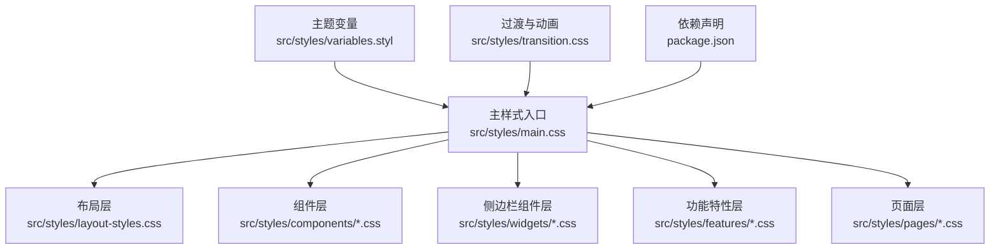
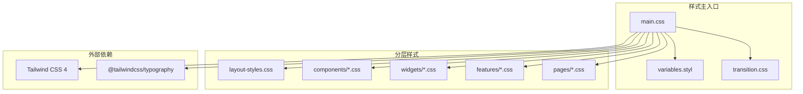
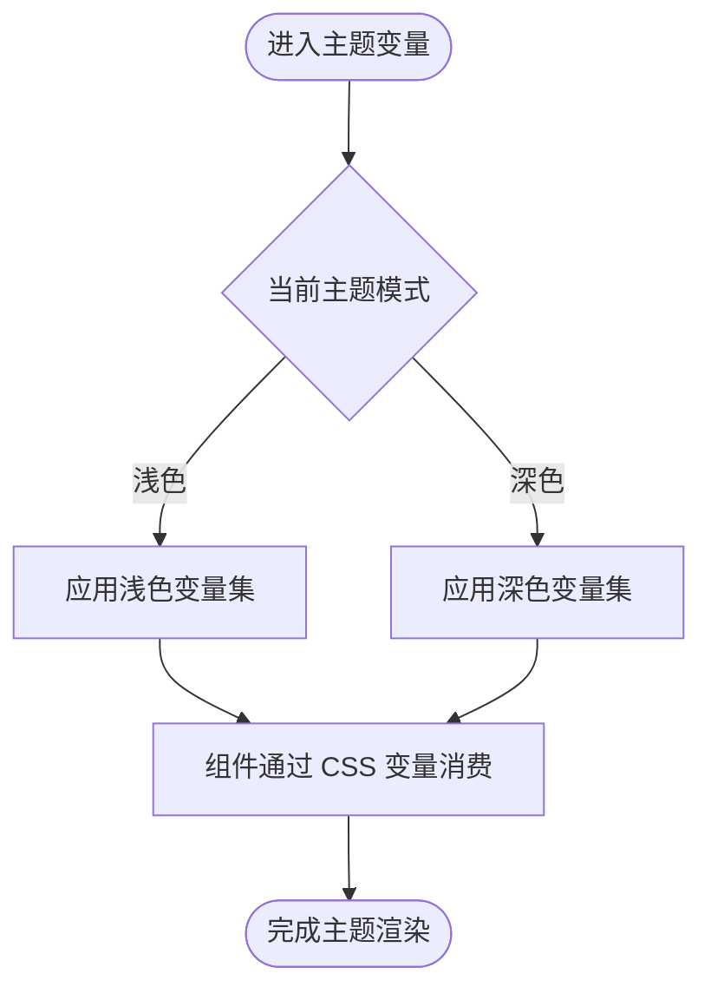
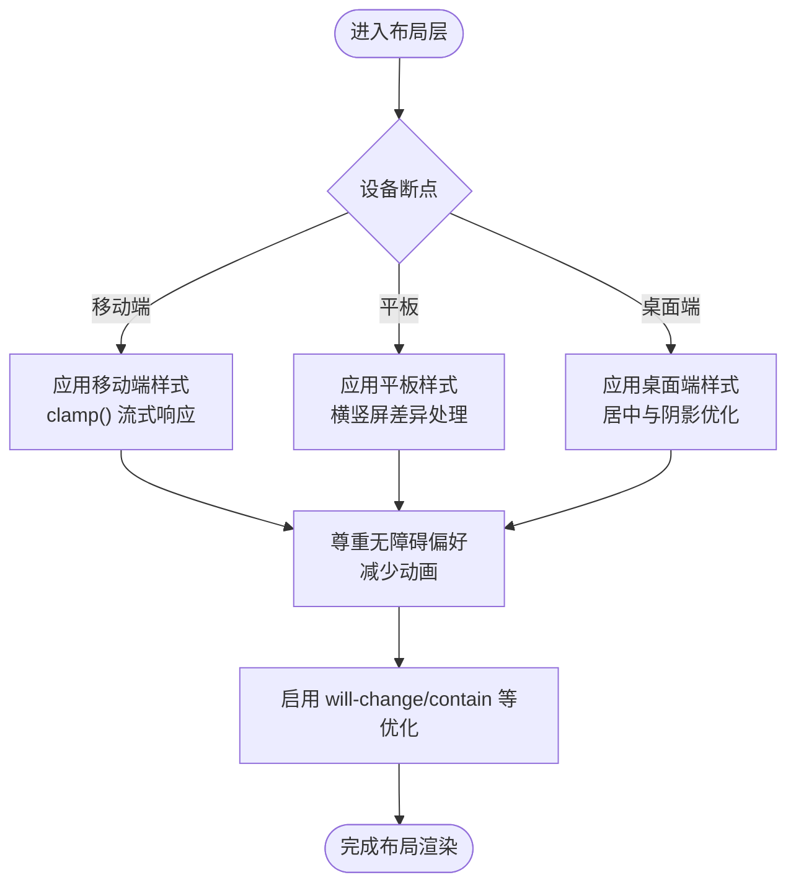
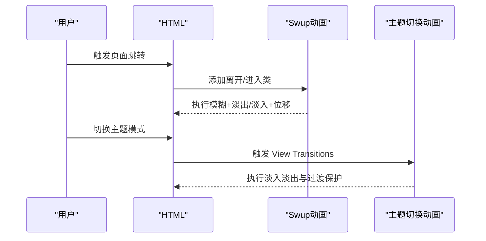
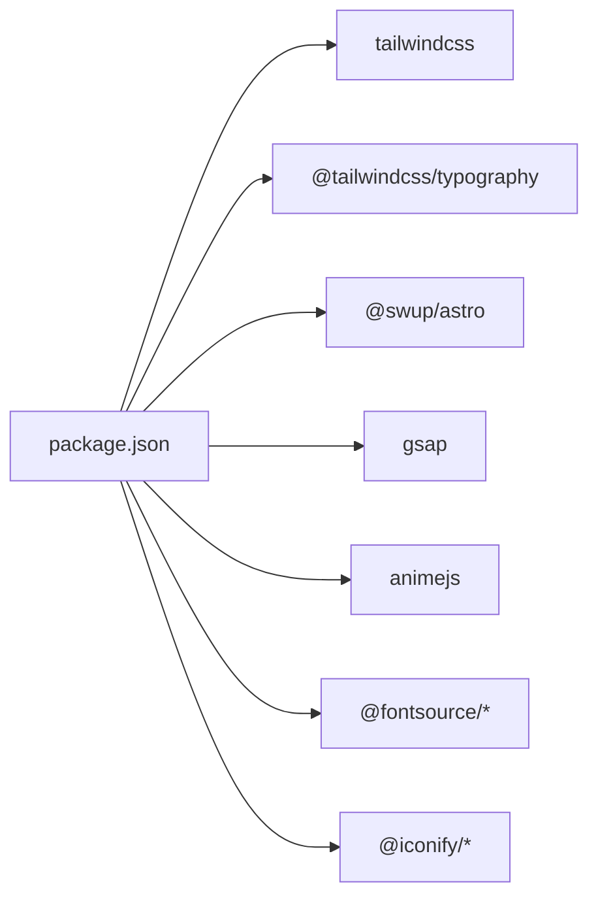

# 样式系统与主题

<cite>
**本文引用的文件**
- [src/styles/main.css](file://src/styles/main.css)
- [src/styles/variables.styl](file://src/styles/variables.styl)
- [src/styles/layout-styles.css](file://src/styles/layout-styles.css)
- [src/styles/transition.css](file://src/styles/transition.css)
- [package.json](file://package.json)
- [src/components/common/GlassSurface.svelte](file://src/components/common/GlassSurface.svelte)
- [src/components/features/Live2DWidget.astro](file://src/components/features/Live2DWidget.astro)
- [src/components/features/SpineModel.astro](file://src/components/features/SpineModel.astro)
- [src/styles/components/live2d-widget.css](file://src/styles/components/live2d-widget.css)
- [src/styles/components/music-player.css](file://src/styles/components/music-player.css)
- [src/styles/widgets/terrarium-model.css](file://src/styles/widgets/terrarium-model.css)
- [src/styles/layout/navbar-new.css](file://src/styles/layout/navbar-new.css)
- [src/styles/layout/nav-menu-panel.css](file://src/styles/layout/nav-menu-panel.css)
- [src/styles/layout/dropdown-menu.css](file://src/styles/layout/dropdown-menu.css)
- [src/styles/layout/category-bar.css](file://src/styles/layout/category-bar.css)
- [src/styles/layout/grid.css](file://src/styles/layout/grid.css)
- [src/styles/custom-scrollbar.css](file://src/styles/custom-scrollbar.css)
- [src/styles/waves.css](file://src/styles/waves.css)
- [src/styles/banner-title.css](file://src/styles/banner-title.css)
- [src/styles/markdown.css](file://src/styles/markdown.css)
- [src/styles/toc.css](file://src/styles/toc.css)
- [src/styles/expressive-code.css](file://src/styles/expressive-code.css)
- [src/styles/fancybox-custom.css](file://src/styles/fancybox-custom.css)
- [src/styles/guestbook.css](file://src/styles/guestbook.css)
- [src/styles/pages/404.css](file://src/styles/pages/404.css)
- [src/styles/pages/article-list.css](file://src/styles/pages/article-list.css)
- [src/styles/pages/calendar.css](file://src/styles/pages/calendar.css)
- [src/styles/pages/categories.css](file://src/styles/pages/categories.css)
- [src/styles/pages/friends.css](file://src/styles/pages/friends.css)
- [src/styles/pages/gallery.css](file://src/styles/pages/gallery.css)
- [src/styles/pages/sponsor.css](file://src/styles/pages/sponsor.css)
- [src/styles/features/movies-games.css](file://src/styles/features/movies-games.css)
- [src/styles/widgets/advertisement.css](file://src/styles/widgets/advertisement.css)
- [src/styles/widgets/announcement.css](file://src/styles/widgets/announcement.css)
- [src/styles/widgets/archive-heatmap.css](file://src/styles/widgets/archive-heatmap.css)
- [src/styles/widgets/calendar.css](file://src/styles/widgets/calendar.css)
- [src/styles/widgets/sidebar-toc.css](file://src/styles/widgets/sidebar-toc.css)
- [src/styles/widgets/terrarium-model.css](file://src/styles/widgets/terrarium-model.css)
- [src/styles/components/about-canvas.css](file://src/styles/components/about-canvas.css)
- [src/styles/components/ai-search.css](file://src/styles/components/ai-search.css)
- [src/styles/components/animated-tabs.css](file://src/styles/components/animated-tabs.css)
- [src/styles/components/bubble-menu.css](file://src/styles/components/bubble-menu.css)
- [src/styles/components/button-tag.css](file://src/styles/components/button-tag.css)
- [src/styles/components/category-bubble-menu.css](file://src/styles/components/category-bubble-menu.css)
- [src/styles/components/cover-image.css](file://src/styles/components/cover-image.css)
- [src/styles/components/floating-button.css](file://src/styles/components/floating-button.css)
- [src/styles/components/floating-dock.css](file://src/styles/components/floating-dock.css)
- [src/styles/components/floating-lyrics.css](file://src/styles/components/floating-lyrics.css)
- [src/styles/components/friend-card.css](file://src/styles/components/friend-card.css)
- [src/styles/components/friend-rules-modal.css](file://src/styles/components/friend-rules-modal.css)
- [src/styles/components/guestbook-modals.css](file://src/styles/components/guestbook-modals.css)
- [src/styles/components/home-data-layer.css](file://src/styles/components/home-data-layer.css)
- [src/styles/components/home-hero.css](file://src/styles/components/home-hero.css)
- [src/styles/components/home-portfolio-shutter.css](file://src/styles/components/home-portfolio-shutter.css)
- [src/styles/components/home-ticker.css](file://src/styles/components/home-ticker.css)
- [src/styles/components/music-player.css](file://src/styles/components/music-player.css)
- [src/styles/components/page-loader.css](file://src/styles/components/page-loader.css)
- [src/styles/components/page-title.css](file://src/styles/components/page-title.css)
- [src/styles/components/pagination.css](file://src/styles/components/pagination.css)
- [src/styles/components/post-card.css](file://src/styles/components/post-card.css)
- [src/styles/components/post-list-actions.css](file://src/styles/components/post-list-actions.css)
- [src/styles/components/post-page.css](file://src/styles/components/post-page.css)
- [src/styles/components/privacy-modal.css](file://src/styles/components/privacy-modal.css)
- [src/styles/components/typewriter.css](file://src/styles/components/typewriter.css)
- [src/styles/components/widget-layout.css](file://src/styles/components/widget-layout.css)
</cite>

## 目录
1. [简介](#简介)
2. [项目结构](#项目结构)
3. [核心组件](#核心组件)
4. [架构总览](#架构总览)
5. [详细组件分析](#详细组件分析)
6. [依赖关系分析](#依赖关系分析)
7. [性能考量](#性能考量)
8. [故障排查指南](#故障排查指南)
9. [结论](#结论)
10. [附录](#附录)

## 简介
本文件系统性梳理 Firefly-Mod 的样式体系与主题设计，围绕基于 Tailwind CSS 4 的原子化样式架构展开，涵盖工具类使用原则、样式组合策略、主题变量系统（颜色、字体、间距、断点）、响应式设计（移动优先、媒体查询、自适应布局）、动画与过渡（CSS 动画、JS 驱动、性能优化）、自定义主题开发指南、样式的模块化组织（组件/全局/工具类分离）、性能优化（压缩、按需加载、关键 CSS 提取），以及样式调试与浏览器兼容性处理。

## 项目结构
样式系统采用“主入口导入 + 层级模块化”的组织方式：
- 主入口集中管理：通过主样式入口统一引入布局层、组件层、侧边栏组件层、功能特性层、页面层等模块样式。
- 主题变量集中管理：使用 Stylus 变量文件集中定义颜色、边框半径、阴影等主题变量，并在深浅色模式下进行差异化覆盖。
- 响应式与过渡：独立文件管理页面切换过渡动画、导航进度条、视口切换动画等。
- 组件与页面样式：按组件/页面维度拆分，便于维护与复用。

图表来源
- [src/styles/main.css:1-839](file://src/styles/main.css#L1-L839)
- [src/styles/variables.styl:1-157](file://src/styles/variables.styl#L1-L157)
- [src/styles/layout-styles.css:1-308](file://src/styles/layout-styles.css#L1-L308)
- [src/styles/transition.css:1-168](file://src/styles/transition.css#L1-L168)
- [package.json:1-112](file://package.json#L1-L112)

章节来源
- [src/styles/main.css:1-839](file://src/styles/main.css#L1-L839)
- [src/styles/variables.styl:1-157](file://src/styles/variables.styl#L1-L157)
- [src/styles/layout-styles.css:1-308](file://src/styles/layout-styles.css#L1-L308)
- [src/styles/transition.css:1-168](file://src/styles/transition.css#L1-L168)
- [package.json:1-112](file://package.json#L1-L112)

## 核心组件
- 主样式入口：集中导入各层样式与 Tailwind v4 配置，定义自定义工具类与主题切换动画。
- 主题变量系统：以 OKLCH 颜色空间为核心，提供浅色/深色两套变量集，确保跨组件一致性与可维护性。
- 响应式与过渡：结合媒体查询与 View Transitions API，提供页面切换与主题切换的流畅体验。
- 动画与交互：页面切换动画（Swup）、加载进度条、渐进式入场动画、导航栏与下拉菜单交互等。

章节来源
- [src/styles/main.css:1-839](file://src/styles/main.css#L1-L839)
- [src/styles/variables.styl:1-157](file://src/styles/variables.styl#L1-L157)
- [src/styles/transition.css:1-168](file://src/styles/transition.css#L1-L168)

## 架构总览
样式系统采用“主入口 + 分层模块 + 主题变量 + 响应式与过渡”的架构，配合 Tailwind CSS 4 的原子化能力与自定义工具类，形成高内聚、低耦合的样式组织方式。

图表来源
- [src/styles/main.css:1-839](file://src/styles/main.css#L1-L839)
- [src/styles/variables.styl:1-157](file://src/styles/variables.styl#L1-L157)
- [src/styles/layout-styles.css:1-308](file://src/styles/layout-styles.css#L1-L308)
- [src/styles/transition.css:1-168](file://src/styles/transition.css#L1-L168)
- [package.json:1-112](file://package.json#L1-L112)

## 详细组件分析

### 主题变量系统与颜色设计
- 颜色模型：采用 OKLCH 颜色空间，保证明度、色度、色相的直观控制；浅色/深色模式分别定义主色、背景、卡片、按钮、链接、滚动条、代码块等变量。
- 模式切换：通过深色模式选择器对变量进行覆盖，确保对比度与可读性；同时提供暗色模式下的滚动条与 admonitions 颜色适配。
- 变量命名：统一使用语义化变量名，如页面背景、卡片背景、按钮状态色、分割线、选区背景等，便于跨组件共享与维护。

图表来源
- [src/styles/variables.styl:1-157](file://src/styles/variables.styl#L1-L157)

章节来源
- [src/styles/variables.styl:1-157](file://src/styles/variables.styl#L1-L157)

### 响应式设计与自适应布局
- 移动优先：以移动端为默认基线，通过媒体查询逐步增强桌面端体验；广泛使用 clamp() 实现流式响应，减少断点数量。
- 横幅与横幅文案：针对不同设备尺寸与方向（横竖屏）进行高度、内边距、字号、行高与阴影的优化，提升可读性与性能。
- 无障碍：尊重用户偏好设置，提供减少动画的降级方案；在移动端禁用入场动画以降低资源消耗。
- 性能优化：对横幅容器启用 will-change、contain、backface-visibility 等属性，减少重绘与回流。

图表来源
- [src/styles/layout-styles.css:1-308](file://src/styles/layout-styles.css#L1-L308)

章节来源
- [src/styles/layout-styles.css:1-308](file://src/styles/layout-styles.css#L1-L308)

### 动画与过渡效果
- 页面切换动画（Swup）：离开/进入阶段分别使用模糊+淡出/淡入+位移的组合动画，结合贝塞尔曲线与滤镜优化视觉连贯性。
- 加载进度条：固定在顶部的进度条，使用缩放变换与阴影增强感知；在减少动画偏好下禁用。
- 视口切换动画：通过 View Transitions API 与自定义 keyframes 实现主题切换时的淡入淡出，同时对复杂元素进行过渡保护与渲染隔离。
- 渐进式入场：元素按序延迟出现，移动端禁用以避免性能问题。

图表来源
- [src/styles/transition.css:1-168](file://src/styles/transition.css#L1-L168)
- [src/styles/main.css:114-246](file://src/styles/main.css#L114-L246)

章节来源
- [src/styles/transition.css:1-168](file://src/styles/transition.css#L1-L168)
- [src/styles/main.css:114-246](file://src/styles/main.css#L114-L246)

### 自定义主题开发指南
- 修改主题变量：在主题变量文件中调整 OKLCH 值或颜色混合比例，即可实现主色、背景、按钮、链接等的整体变化。
- 新增颜色：在变量文件中新增语义化变量名，遵循现有命名规范，避免硬编码颜色值。
- 字体替换：通过 Tailwind v4 的 @theme 自定义字体栈，确保在不同平台与系统上的一致性。
- 断点与间距：在布局层中扩展媒体查询与间距变量，保持与现有流式响应策略一致。

章节来源
- [src/styles/variables.styl:1-157](file://src/styles/variables.styl#L1-L157)
- [src/styles/main.css:73-78](file://src/styles/main.css#L73-L78)

### 样式模块化组织
- 组件样式：每个组件拥有独立的样式文件，便于按需加载与复用；通过语义化类名与 CSS 变量实现主题一致性。
- 全局样式：主入口集中导入，确保加载顺序与依赖关系可控；布局层与过渡层独立管理。
- 工具类：使用 Tailwind v4 的 @utility 定义原子化工具类，如扩展动画、按钮状态等，减少重复样式。

章节来源
- [src/styles/main.css:1-839](file://src/styles/main.css#L1-L839)
- [src/styles/components/*.css](file://src/styles/components/)
- [src/styles/layout/*.css](file://src/styles/layout/)
- [src/styles/widgets/*.css](file://src/styles/widgets/)
- [src/styles/pages/*.css](file://src/styles/pages/)

### 动画与交互细节（组件级）
- 下拉菜单：通过可见性与位移控制显示/隐藏，悬停时切换边框样式与过渡；移动端使用折叠子菜单。
- 导航栏与浮动面板：在主题切换时禁用复杂过渡与滤镜，避免性能抖动；在 View Transitions 模式下进行精细同步。
- 音乐播放器与 Live2D/Spine 模型：通过独立样式文件管理，确保在主题切换时的视觉一致性与性能稳定。

章节来源
- [src/styles/layout/dropdown-menu.css](file://src/styles/layout/dropdown-menu.css)
- [src/styles/layout/navbar-new.css](file://src/styles/layout/navbar-new.css)
- [src/styles/layout/nav-menu-panel.css](file://src/styles/layout/nav-menu-panel.css)
- [src/styles/layout/category-bar.css](file://src/styles/layout/category-bar.css)
- [src/styles/layout/grid.css](file://src/styles/layout/grid.css)
- [src/styles/custom-scrollbar.css](file://src/styles/custom-scrollbar.css)
- [src/styles/waves.css](file://src/styles/waves.css)
- [src/styles/banner-title.css](file://src/styles/banner-title.css)
- [src/styles/markdown.css](file://src/styles/markdown.css)
- [src/styles/toc.css](file://src/styles/toc.css)
- [src/styles/expressive-code.css](file://src/styles/expressive-code.css)
- [src/styles/fancybox-custom.css](file://src/styles/fancybox-custom.css)
- [src/styles/guestbook.css](file://src/styles/guestbook.css)
- [src/styles/pages/404.css](file://src/styles/pages/404.css)
- [src/styles/pages/article-list.css](file://src/styles/pages/article-list.css)
- [src/styles/pages/calendar.css](file://src/styles/pages/calendar.css)
- [src/styles/pages/categories.css](file://src/styles/pages/categories.css)
- [src/styles/pages/friends.css](file://src/styles/pages/friends.css)
- [src/styles/pages/gallery.css](file://src/styles/pages/gallery.css)
- [src/styles/pages/sponsor.css](file://src/styles/pages/sponsor.css)
- [src/styles/features/movies-games.css](file://src/styles/features/movies-games.css)
- [src/styles/widgets/advertisement.css](file://src/styles/widgets/advertisement.css)
- [src/styles/widgets/announcement.css](file://src/styles/widgets/announcement.css)
- [src/styles/widgets/archive-heatmap.css](file://src/styles/widgets/archive-heatmap.css)
- [src/styles/widgets/calendar.css](file://src/styles/widgets/calendar.css)
- [src/styles/widgets/sidebar-toc.css](file://src/styles/widgets/sidebar-toc.css)
- [src/styles/widgets/terrarium-model.css](file://src/styles/widgets/terrarium-model.css)
- [src/styles/components/about-canvas.css](file://src/styles/components/about-canvas.css)
- [src/styles/components/ai-search.css](file://src/styles/components/ai-search.css)
- [src/styles/components/animated-tabs.css](file://src/styles/components/animated-tabs.css)
- [src/styles/components/bubble-menu.css](file://src/styles/components/bubble-menu.css)
- [src/styles/components/button-tag.css](file://src/styles/components/button-tag.css)
- [src/styles/components/category-bubble-menu.css](file://src/styles/components/category-bubble-menu.css)
- [src/styles/components/cover-image.css](file://src/styles/components/cover-image.css)
- [src/styles/components/floating-button.css](file://src/styles/components/floating-button.css)
- [src/styles/components/floating-dock.css](file://src/styles/components/floating-dock.css)
- [src/styles/components/floating-lyrics.css](file://src/styles/components/floating-lyrics.css)
- [src/styles/components/friend-card.css](file://src/styles/components/friend-card.css)
- [src/styles/components/friend-rules-modal.css](file://src/styles/components/friend-rules-modal.css)
- [src/styles/components/guestbook-modals.css](file://src/styles/components/guestbook-modals.css)
- [src/styles/components/home-data-layer.css](file://src/styles/components/home-data-layer.css)
- [src/styles/components/home-hero.css](file://src/styles/components/home-hero.css)
- [src/styles/components/home-portfolio-shutter.css](file://src/styles/components/home-portfolio-shutter.css)
- [src/styles/components/home-ticker.css](file://src/styles/components/home-ticker.css)
- [src/styles/components/music-player.css](file://src/styles/components/music-player.css)
- [src/styles/components/page-loader.css](file://src/styles/components/page-loader.css)
- [src/styles/components/page-title.css](file://src/styles/components/page-title.css)
- [src/styles/components/pagination.css](file://src/styles/components/pagination.css)
- [src/styles/components/post-card.css](file://src/styles/components/post-card.css)
- [src/styles/components/post-list-actions.css](file://src/styles/components/post-list-actions.css)
- [src/styles/components/post-page.css](file://src/styles/components/post-page.css)
- [src/styles/components/privacy-modal.css](file://src/styles/components/privacy-modal.css)
- [src/styles/components/typewriter.css](file://src/styles/components/typewriter.css)
- [src/styles/components/widget-layout.css](file://src/styles/components/widget-layout.css)

## 依赖关系分析
- 核心依赖：Tailwind CSS 4 提供原子化工具类与 @theme/@utility 能力；@tailwindcss/typography 提升排版体验。
- 动画与交互：Swup 提供页面切换动画；GSAP、animejs 等用于复杂 JS 驱动动画（在组件中按需使用）。
- 字体与图标：Roboto、JetBrains Mono 等字体通过 @fontsource-* 引入；Iconify 图标库提供丰富图标资源。
- 构建链路：构建脚本中包含图标生成与 Pagefind 索引生成，样式构建由 Astro/PostCSS/Tailwind 驱动。

图表来源
- [package.json:1-112](file://package.json#L1-L112)

章节来源
- [package.json:1-112](file://package.json#L1-L112)

## 性能考量
- CSS 压缩与按需：Tailwind CSS 4 默认按需输出，建议在生产环境开启压缩与 Tree Shaking，减少未使用样式体积。
- 关键 CSS 提取：将首屏关键样式内联，其余样式异步加载，缩短 FCP。
- 动画性能：在主题切换与页面切换中禁用复杂过渡与滤镜，使用 will-change、contain、backface-visibility 等属性优化渲染。
- 移动端降级：在移动端禁用入场动画，在减少动画偏好下禁用过渡与滤镜，保障流畅体验。
- 图片与横幅：对横幅容器启用硬件加速与流式响应，减少重绘与回流。

章节来源
- [src/styles/layout-styles.css:144-187](file://src/styles/layout-styles.css#L144-L187)
- [src/styles/transition.css:64-72](file://src/styles/transition.css#L64-L72)
- [src/styles/transition.css:140-155](file://src/styles/transition.css#L140-L155)
- [src/styles/main.css:114-246](file://src/styles/main.css#L114-L246)

## 故障排查指南
- 主题切换闪烁或卡顿：检查是否启用了 View Transitions API；确认主题切换保护类是否正确应用，避免复杂元素参与过渡。
- 下拉菜单与浮动面板异常：核对深浅色模式下的过渡与滤镜禁用逻辑，确保在主题切换时不会触发不必要的重绘。
- 页面切换动画异常：验证 Swup 动画类是否正确挂载，检查贝塞尔曲线与持续时间参数是否合理。
- 横幅与布局错位：检查媒体查询断点与流式响应参数，确保在不同设备与方向下的表现一致。
- 字体与图标加载失败：确认 @fontsource 与 Iconify 资源路径与版本，避免跨域与缓存问题。

章节来源
- [src/styles/main.css:114-246](file://src/styles/main.css#L114-L246)
- [src/styles/layout-styles.css:1-308](file://src/styles/layout-styles.css#L1-L308)
- [src/styles/transition.css:1-168](file://src/styles/transition.css#L1-L168)

## 结论
Firefly-Mod 的样式系统以 Tailwind CSS 4 为基础，结合 Stylus 主题变量与模块化组织，实现了高可维护性与强一致性。通过移动优先的响应式策略、完善的动画与过渡机制、以及面向性能的优化手段，系统在多设备与多场景下均能提供优秀的用户体验。开发者可在不破坏整体风格的前提下，通过变量与工具类快速迭代主题与组件样式。

## 附录
- 组件与页面样式清单（部分示例）
  - 布局：导航栏、下拉菜单、分类栏、网格布局、自定义滚动条、波浪装饰、横幅标题等。
  - 组件：文章卡片、分页、浮动按钮、浮动码头、气泡菜单、标签按钮、音乐播放器、Live2D/Spine 模型、隐私模态等。
  - 页面：404、文章列表、日历、分类、友链、画廊、赞助等。
  - 侧边栏组件：日历、侧边目录、归档热力图、公告、广告、生态瓶模型等。
  - 功能特性：电影游戏专题样式等。

章节来源
- [src/styles/layout/*.css](file://src/styles/layout/)
- [src/styles/components/*.css](file://src/styles/components/)
- [src/styles/pages/*.css](file://src/styles/pages/)
- [src/styles/widgets/*.css](file://src/styles/widgets/)
- [src/styles/features/*.css](file://src/styles/features/)