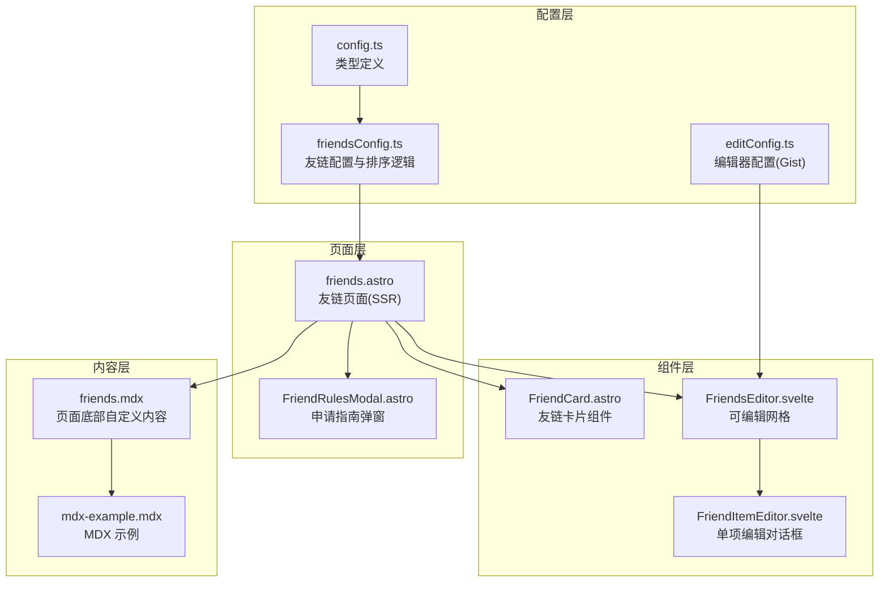
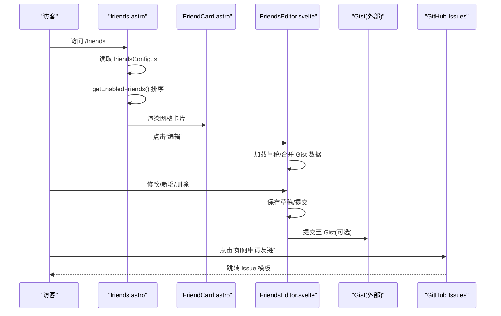
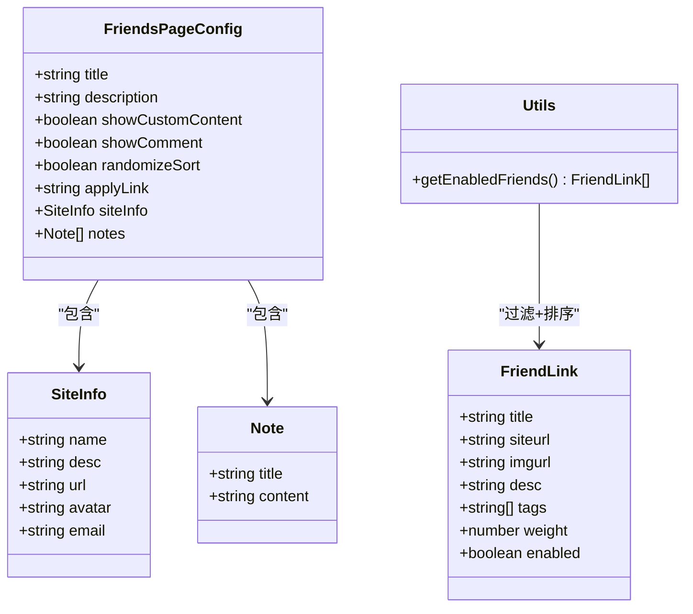
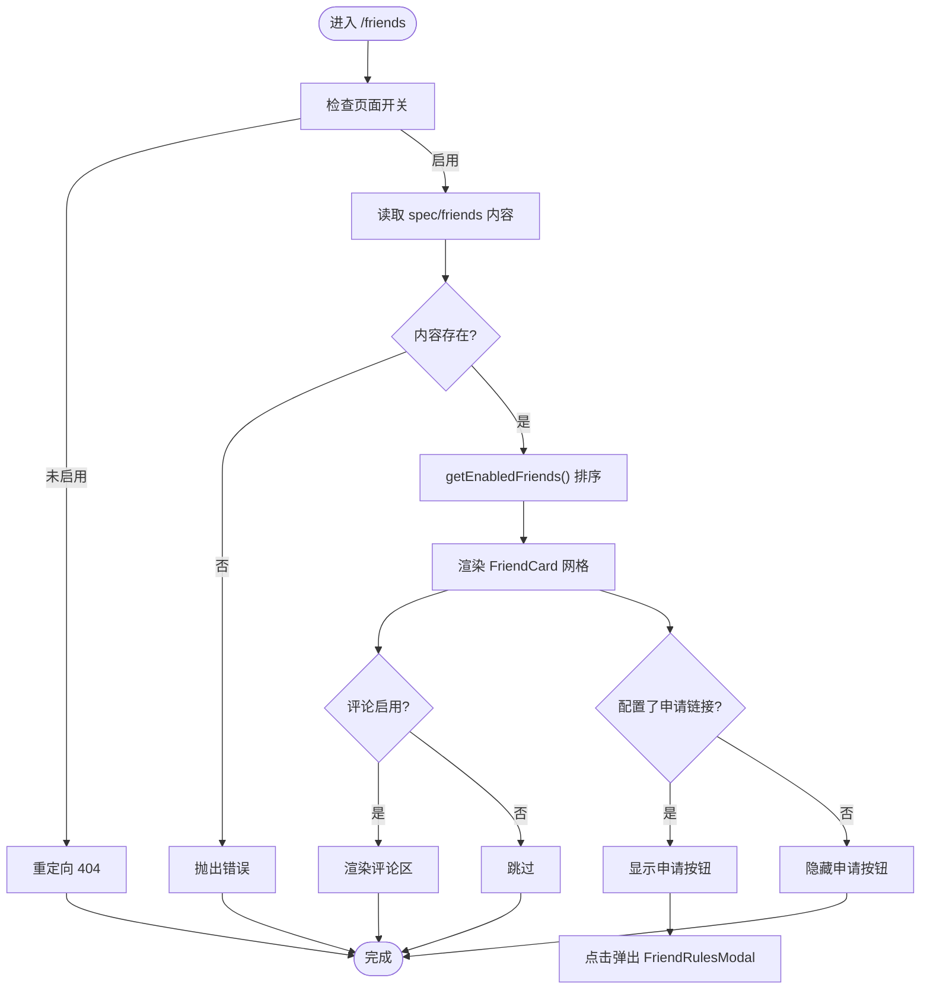
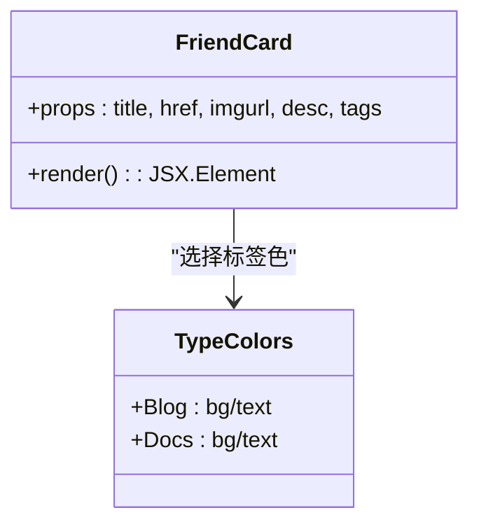
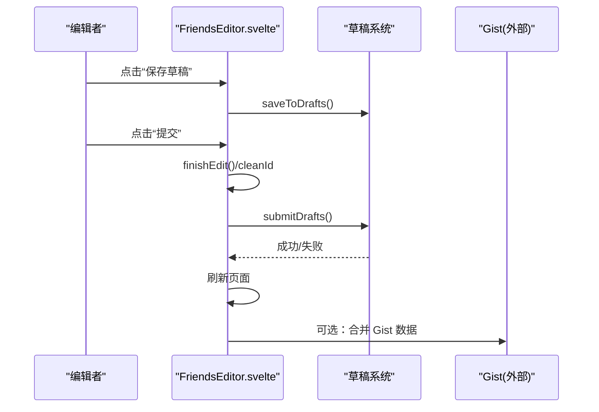
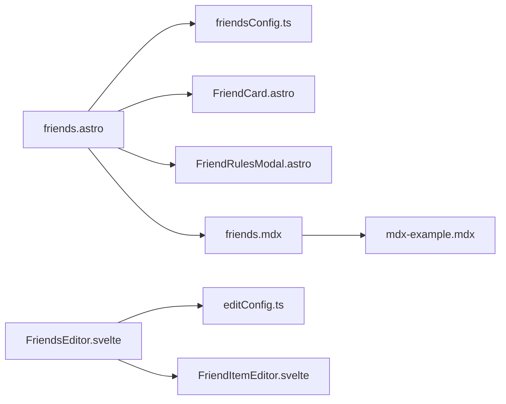

# 友链管理系统

<cite>
**本文引用的文件**
- [friendsConfig.ts](file://src/config/friendsConfig.ts)
- [FriendCard.astro](file://src/components/features/FriendCard.astro)
- [friends.astro](file://src/pages/friends.astro)
- [FriendItemEditor.svelte](file://src/components/edit/FriendItemEditor.svelte)
- [FriendsEditor.svelte](file://src/components/edit/FriendsEditor.svelte)
- [FriendRulesModal.astro](file://src/components/features/FriendRulesModal.astro)
- [friends.mdx](file://src/content/spec/friends.mdx)
- [mdx-example.mdx](file://src/content/posts/mdx-example.mdx)
- [config.ts](file://src/types/config.ts)
- [editConfig.ts](file://src/config/editConfig.ts)
</cite>

## 目录
1. [简介](#简介)
2. [项目结构](#项目结构)
3. [核心组件](#核心组件)
4. [架构总览](#架构总览)
5. [详细组件分析](#详细组件分析)
6. [依赖关系分析](#依赖关系分析)
7. [性能考量](#性能考量)
8. [故障排查指南](#故障排查指南)
9. [结论](#结论)
10. [附录](#附录)

## 简介
本文件为“友链管理系统”的深度技术文档，围绕以下目标展开：
- 友链数据结构设计：FriendLink 接口定义、友链配置参数与数据验证规则
- 友链页面实现：友链卡片组件、网格布局、随机排序与权重管理
- 友链申请自动化流程：GitHub Issue 模板、前端校验、配置文件写入与 CI/CD 工作流
- 友链审核机制：状态管理、手动审批与批量操作
- 自定义内容支持：MDX 内容嵌入与样式定制
- 最佳实践：SEO 优化、安全考虑与性能优化
- 扩展开发与自定义集成指南

## 项目结构
友链系统由“配置层”“页面层”“组件层”“编辑器层”“内容层”构成，采用 Astro + Svelte 的混合架构，结合 Gist 草稿与提交机制实现低门槛的在线编辑体验。

图示来源
- [friendsConfig.ts:1-396](file://src/config/friendsConfig.ts#L1-L396)
- [friends.astro:1-120](file://src/pages/friends.astro#L1-L120)
- [FriendCard.astro:1-82](file://src/components/features/FriendCard.astro#L1-L82)
- [FriendsEditor.svelte:1-701](file://src/components/edit/FriendsEditor.svelte#L1-L701)
- [FriendItemEditor.svelte:1-283](file://src/components/edit/FriendItemEditor.svelte#L1-L283)
- [FriendRulesModal.astro](file://src/components/features/FriendRulesModal.astro)
- [friends.mdx](file://src/content/spec/friends.mdx)
- [mdx-example.mdx](file://src/content/posts/mdx-example.mdx)

章节来源
- [friendsConfig.ts:1-396](file://src/config/friendsConfig.ts#L1-L396)
- [friends.astro:1-120](file://src/pages/friends.astro#L1-L120)

## 核心组件
- 友链数据模型与排序
  - 数据模型：FriendLink 接口定义于类型文件，包含标题、头像、描述、站点地址、标签、权重、启用状态等字段
  - 排序策略：默认按权重降序；若开启随机化，则构建时一次性随机打乱
- 友链页面
  - SSR 渲染：从配置读取启用的友链并排序，生成网格
  - 自定义内容：通过 friends.mdx 支持页面底部 MDX 内容
  - 申请入口：可配置 GitHub Issue 申请链接
- 友链卡片组件
  - 展示：站点名、头像、描述、标签徽章与悬停覆盖层
  - 样式：内置标签色板，支持 Blog/Docs 类型
- 在线编辑器
  - 可编辑网格：拖拽排序、内联编辑、新增/删除、草稿保存与提交
  - Gist 集成：从外部 Gist 合并数据，支持离线草稿与一键提交
- 申请指南弹窗
  - 展示站点信息与注意事项，引导用户按规范申请

章节来源
- [friendsConfig.ts:57-396](file://src/config/friendsConfig.ts#L57-L396)
- [friends.astro:19-108](file://src/pages/friends.astro#L19-L108)
- [FriendCard.astro:1-82](file://src/components/features/FriendCard.astro#L1-L82)
- [FriendsEditor.svelte:1-701](file://src/components/edit/FriendsEditor.svelte#L1-L701)
- [FriendRulesModal.astro](file://src/components/features/FriendRulesModal.astro)
- [friends.mdx](file://src/content/spec/friends.mdx)

## 架构总览
友链系统采用“静态页面 + 在线编辑 + 外部存储”的组合方案：
- 配置驱动：通过 friendsConfig.ts 统一管理友链列表与页面行为
- 页面渲染：friends.astro 作为入口，调用 FriendCard 渲染网格
- 编辑能力：FriendsEditor 提供可视化编辑、草稿与提交
- 内容扩展：friends.mdx 支持 MDX 自定义内容
- 申请流程：页面提供 GitHub Issue 申请链接，配合 CI/CD 实现自动化处理

图示来源
- [friends.astro:36-108](file://src/pages/friends.astro#L36-L108)
- [FriendCard.astro:22-79](file://src/components/features/FriendCard.astro#L22-L79)
- [FriendsEditor.svelte:60-88](file://src/components/edit/FriendsEditor.svelte#L60-L88)
- [friendsConfig.ts:386-396](file://src/config/friendsConfig.ts#L386-L396)

## 详细组件分析

### 数据模型与验证规则
- 接口字段
  - 标题、站点地址、头像、描述、标签数组、权重、启用状态
- 默认值与约束
  - 标签默认值为 Blog；权重默认 10；启用默认 true
  - 前端编辑器对标题与链接进行非空校验
- 排序与过滤
  - 过滤 enabled=true 的项
  - 若 randomizeSort=true 则随机排序；否则按 weight 降序

图示来源
- [config.ts](file://src/types/config.ts)
- [friendsConfig.ts:6-55](file://src/config/friendsConfig.ts#L6-L55)
- [friendsConfig.ts:57-396](file://src/config/friendsConfig.ts#L57-L396)

章节来源
- [config.ts](file://src/types/config.ts)
- [friendsConfig.ts:57-396](file://src/config/friendsConfig.ts#L57-L396)
- [FriendItemEditor.svelte:29-51](file://src/components/edit/FriendItemEditor.svelte#L29-L51)

### 友链页面实现
- 页面加载与校验
  - 检查站点开关，未启用则重定向 404
  - 读取 spec/friends 内容，缺失时报错
  - 依据评论配置与页面配置决定是否渲染评论区
- 网格渲染
  - 调用 getEnabledFriends() 获取排序后的列表
  - 为每个条目渲染 FriendCard，并挂载到 .friend-card 容器
- 申请入口与弹窗
  - 若配置了 applyLink，则显示“如何申请友链”按钮
  - 点击弹出 FriendRulesModal，展示站点信息与注意事项

图示来源
- [friends.astro:19-108](file://src/pages/friends.astro#L19-L108)
- [friendsConfig.ts:386-396](file://src/config/friendsConfig.ts#L386-L396)

章节来源
- [friends.astro:19-108](file://src/pages/friends.astro#L19-L108)

### 友链卡片组件
- 结构要点
  - 外层链接容器，支持 target="_blank" 与 rel="noopener noreferrer"
  - 左侧头像区域，懒加载与错误兜底
  - 右侧标题与描述，悬停覆盖层增强交互
  - 标签徽章：Blog/Docs 使用内置配色
- 样式与可定制性
  - 样式位于独立 CSS 文件，便于主题切换与覆盖
  - 支持通过 data-* 属性与类名进行样式定制

图示来源
- [FriendCard.astro:1-82](file://src/components/features/FriendCard.astro#L1-L82)

章节来源
- [FriendCard.astro:1-82](file://src/components/features/FriendCard.astro#L1-L82)

### 在线编辑器与草稿提交
- 编辑器能力
  - 可视化网格：拖拽排序、内联编辑、新增/删除
  - 草稿系统：本地草稿持久化，支持保存草稿与提交
  - Gist 合并：从外部 Gist 合并数据，避免重复
- 提交流程
  - 提交后刷新页面，确保前端与后端一致
  - 支持外部 Gist 作为“配置源”，便于协作与备份

图示来源
- [FriendsEditor.svelte:230-255](file://src/components/edit/FriendsEditor.svelte#L230-L255)
- [FriendsEditor.svelte:60-88](file://src/components/edit/FriendsEditor.svelte#L60-L88)

章节来源
- [FriendsEditor.svelte:1-701](file://src/components/edit/FriendsEditor.svelte#L1-L701)
- [editConfig.ts](file://src/config/editConfig.ts)

### 申请指南弹窗
- 功能
  - 展示站点信息与注意事项，引导用户按规范提交申请
  - 与页面配置联动，支持多条注意事项
- 交互
  - 通过 data-open-friend-rules 触发
  - 与 applyLink 配合，提供直达 Issue 模板的入口

章节来源
- [FriendRulesModal.astro](file://src/components/features/FriendRulesModal.astro)
- [friendsConfig.ts:24-54](file://src/config/friendsConfig.ts#L24-L54)

### 自定义内容与样式
- MDX 内容
  - 页面底部内容来自 spec/friends.mdx，支持富文本与组件嵌入
  - 可参考 posts/mdx-example.mdx 的示例用法
- 样式定制
  - 友链卡片样式位于独立 CSS 文件，支持深浅主题适配
  - 可通过覆盖类名与变量实现个性化风格

章节来源
- [friends.mdx](file://src/content/spec/friends.mdx)
- [mdx-example.mdx](file://src/content/posts/mdx-example.mdx)
- [FriendCard.astro:81-82](file://src/components/features/FriendCard.astro#L81-L82)

## 依赖关系分析
- 配置依赖
  - friends.astro 依赖 friendsConfig.ts 的排序函数与页面配置
  - FriendCard 依赖类型定义与样式资源
- 编辑器依赖
  - FriendsEditor 依赖编辑器配置与草稿工具
  - FriendItemEditor 作为内联编辑对话框，负责单项校验与保存
- 内容依赖
  - 页面依赖 spec/friends.mdx 的内容存在性
  - MDX 示例提供语法与组件使用参考

图示来源
- [friends.astro:1-18](file://src/pages/friends.astro#L1-L18)
- [friendsConfig.ts:1-14](file://src/config/friendsConfig.ts#L1-L14)
- [FriendsEditor.svelte:1-14](file://src/components/edit/FriendsEditor.svelte#L1-L14)
- [FriendItemEditor.svelte:1-6](file://src/components/edit/FriendItemEditor.svelte#L1-L6)
- [friends.mdx](file://src/content/spec/friends.mdx)
- [mdx-example.mdx](file://src/content/posts/mdx-example.mdx)

章节来源
- [friends.astro:1-18](file://src/pages/friends.astro#L1-L18)
- [FriendsEditor.svelte:1-14](file://src/components/edit/FriendsEditor.svelte#L1-L14)

## 性能考量
- 渲染性能
  - SSR 生成网格，减少首屏 JS 计算
  - 图片懒加载与错误兜底，避免阻塞渲染
- 排序策略
  - 权重排序为 O(n log n)，随机排序为 O(n)
  - 构建时一次性随机化，运行时无需重复计算
- 编辑体验
  - 本地草稿与增量提交，降低网络压力
  - 可选 Gist 合并，避免重复数据

## 故障排查指南
- 页面不可见或 404
  - 检查站点开关与页面配置
  - 确认 spec/friends 内容是否存在
- 友链卡片不显示或样式异常
  - 检查头像 URL 有效性与跨域
  - 确认 CSS 文件加载与主题变量
- 编辑器无法保存/提交
  - 检查浏览器控制台是否有错误
  - 确认草稿系统可用与 Gist 配置正确
- 申请流程异常
  - 确认 applyLink 配置正确
  - 检查 GitHub Issue 模板可用性

章节来源
- [friends.astro:19-28](file://src/pages/friends.astro#L19-L28)
- [FriendCard.astro:40-46](file://src/components/features/FriendCard.astro#L40-L46)
- [FriendsEditor.svelte:239-255](file://src/components/edit/FriendsEditor.svelte#L239-L255)
- [friendsConfig.ts:24-25](file://src/config/friendsConfig.ts#L24-L25)

## 结论
本友链系统以配置为中心、以组件为载体、以编辑器为入口，结合 MDX 内容与 Gist 草稿机制，实现了“易维护、可协作、可扩展”的友链管理方案。通过合理的数据模型、清晰的排序策略与完善的前端校验，既保证了用户体验，也为后续自动化与审核流程提供了良好基础。

## 附录

### 友链申请自动化流程（建议）
- GitHub Issue 模板
  - 在仓库 .github/ISSUE_TEMPLATE 下创建友链申请模板，包含站点名称、链接、头像、描述、标签等字段
- Playwright 校验
  - 在 CI 中使用 Playwright 对提交的 Issue 进行自动化校验（如链接可达性、格式合法性）
- 自动写入配置文件
  - 校验通过后，CI 将新友链条目写入 src/config/friendsConfig.ts 或同步至 Gist
- CI/CD 工作流
  - 触发构建与部署，确保变更生效

### 友链审核机制（建议）
- 状态管理
  - 新增 enabled 字段与审核状态枚举（待审/通过/拒绝）
- 手动审批
  - 管理员在编辑器中勾选启用或禁用
- 批量操作
  - 支持批量启用/禁用、批量移动与导出

### SEO 优化建议
- 页面元信息
  - 使用 friends.astro 设置标题与描述，提升搜索可见性
- 结构化数据
  - 可选：为友链卡片添加结构化标记
- 链接属性
  - 使用 rel="noopener noreferrer" 与 target="_blank"，保障安全性

### 安全考虑
- 输入校验
  - 前端对必填字段进行非空校验；后端可进一步校验 URL 格式与可达性
- 资源加载
  - 头像与外链均需考虑跨域与 HTTPS
- 权限控制
  - 编辑权限仅限授权人员；Gist 合并与提交需鉴权

### 性能优化建议
- 图片优化
  - 使用现代格式与懒加载，必要时引入占位符
- 排序缓存
  - 若数据量大，可在构建阶段缓存排序结果
- 编辑器节流
  - 对频繁输入进行防抖，减少草稿写入频率