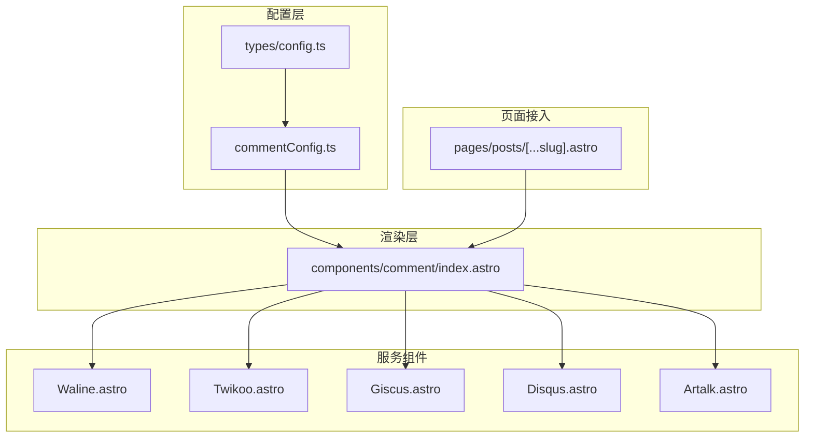
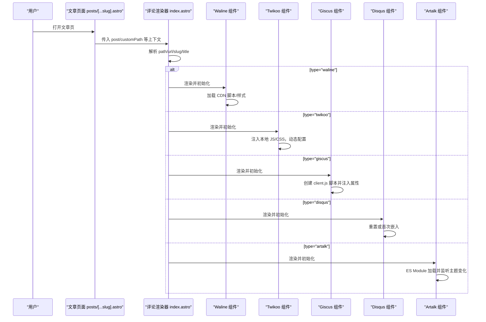
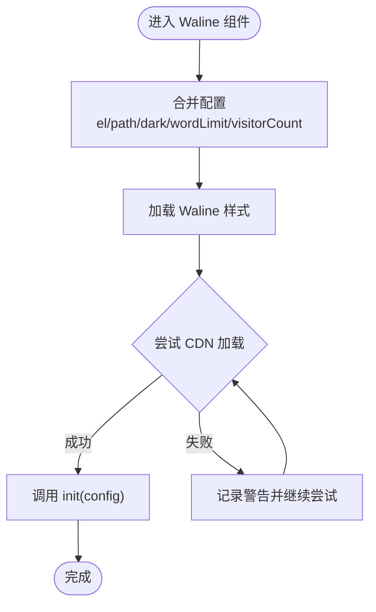
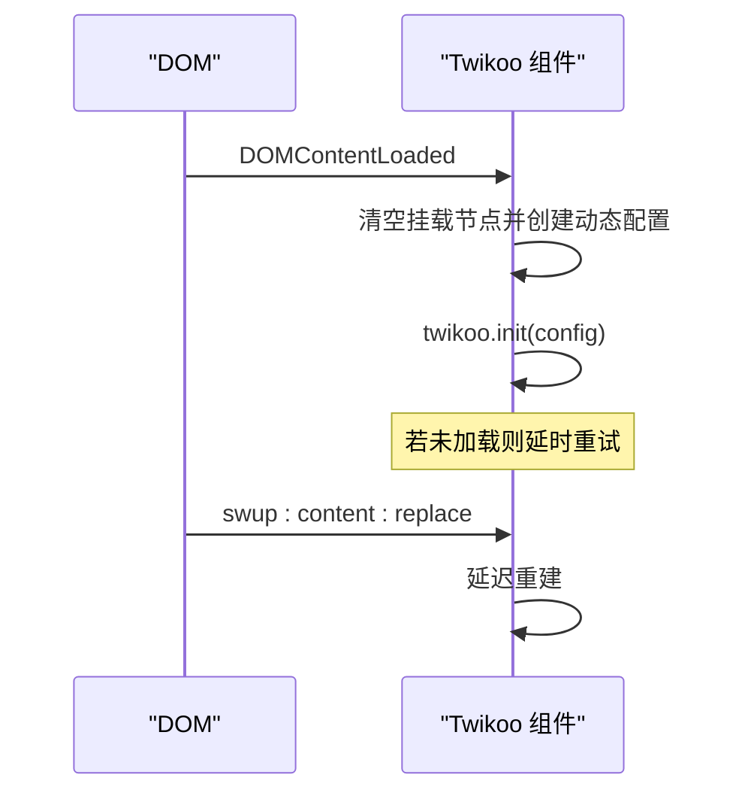
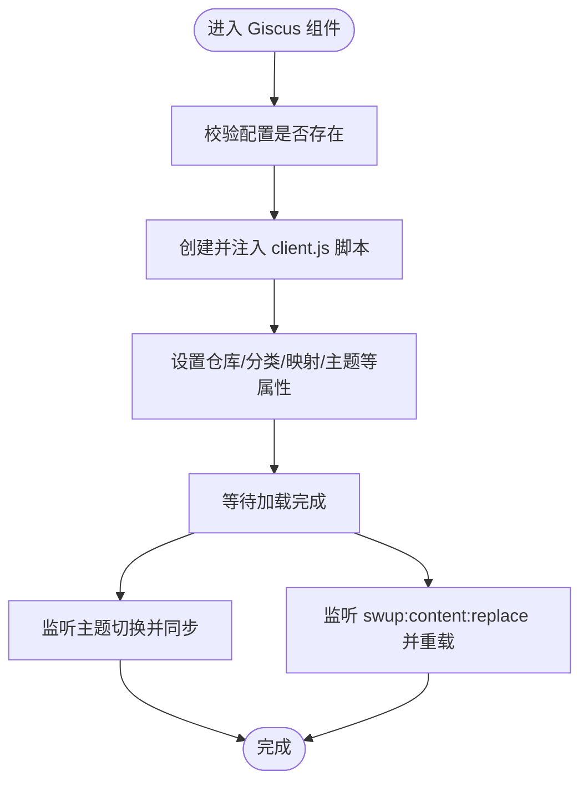
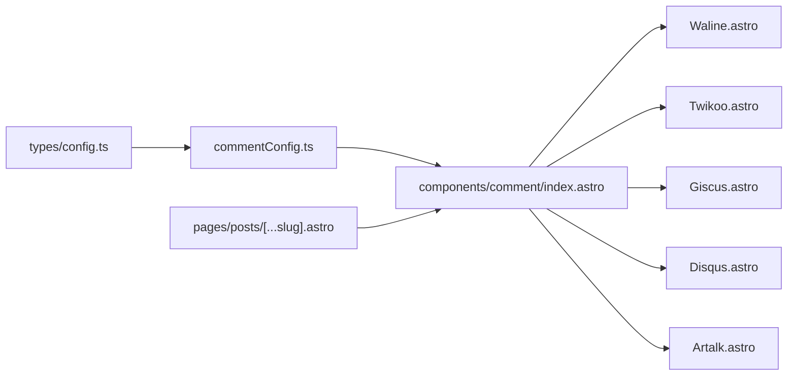

# 多评论系统集成

<cite>
**本文引用的文件**
- [commentConfig.ts](file://src/config/commentConfig.ts)
- [index.astro](file://src/components/comment/index.astro)
- [Waline.astro](file://src/components/comment/Waline.astro)
- [Twikoo.astro](file://src/components/comment/Twikoo.astro)
- [Giscus.astro](file://src/components/comment/Giscus.astro)
- [Disqus.astro](file://src/components/comment/Disqus.astro)
- [Artalk.astro](file://src/components/comment/Artalk.astro)
- [config.ts](file://src/types/config.ts)
- [posts/[...slug].astro](file://src/pages/posts/[...slug].astro)
- [twikoo.css](file://public/assets/css/twikoo.css)
</cite>

## 目录
1. [简介](#简介)
2. [项目结构](#项目结构)
3. [核心组件](#核心组件)
4. [架构总览](#架构总览)
5. [详细组件分析](#详细组件分析)
6. [依赖关系分析](#依赖关系分析)
7. [性能考量](#性能考量)
8. [故障排查指南](#故障排查指南)
9. [结论](#结论)
10. [附录](#附录)

## 简介
本文件面向“多评论系统集成”的技术文档，围绕评论系统配置、各服务集成实现、切换机制、数据与安全、性能优化以及扩展开发进行系统化说明。读者无需深入前端即可理解如何在本项目中启用与切换不同评论服务，同时也能掌握面向扩展与运维的最佳实践。

## 项目结构
评论系统相关的核心文件分布如下：
- 配置层：位于 src/config/commentConfig.ts，集中声明可用评论服务及参数
- 类型层：位于 src/types/config.ts，定义 CommentConfig 的结构与字段约束
- 渲染层：位于 src/components/comment/index.astro，负责按配置动态渲染对应评论组件
- 服务组件：位于 src/components/comment/*.astro，分别封装各评论服务的初始化与生命周期处理
- 页面接入：位于 src/pages/posts/[...slug].astro，引入评论区组件并传递上下文

图表来源
- [commentConfig.ts:1-79](file://src/config/commentConfig.ts#L1-L79)
- [config.ts:303-356](file://src/types/config.ts#L303-L356)
- [index.astro:1-70](file://src/components/comment/index.astro#L1-L70)
- [Waline.astro:1-42](file://src/components/comment/Waline.astro#L1-L42)
- [Twikoo.astro:1-94](file://src/components/comment/Twikoo.astro#L1-L94)
- [Giscus.astro:1-74](file://src/components/comment/Giscus.astro#L1-L74)
- [Disqus.astro:1-50](file://src/components/comment/Disqus.astro#L1-L50)
- [Artalk.astro:1-50](file://src/components/comment/Artalk.astro#L1-L50)
- [posts/[...slug].astro:1-30](file://src/pages/posts/[...slug].astro#L1-L30)

章节来源
- [commentConfig.ts:1-79](file://src/config/commentConfig.ts#L1-L79)
- [config.ts:303-356](file://src/types/config.ts#L303-L356)
- [index.astro:1-70](file://src/components/comment/index.astro#L1-L70)
- [posts/[...slug].astro:1-30](file://src/pages/posts/[...slug].astro#L1-L30)

## 核心组件
- 评论配置中心：commentConfig.ts 提供 type 与各服务的参数集合，决定启用哪一种评论系统
- 评论渲染器：index.astro 依据配置动态选择并渲染对应组件，同时生成页面级唯一标识（path/url/slug/title）
- 服务组件：每个服务组件负责自身初始化、主题适配、SPA 切换后的重载与清理
- 类型约束：config.ts 对 CommentConfig 的字段进行强类型约束，确保配置合法

章节来源
- [commentConfig.ts:3-79](file://src/config/commentConfig.ts#L3-L79)
- [index.astro:13-69](file://src/components/comment/index.astro#L13-L69)
- [config.ts:303-356](file://src/types/config.ts#L303-L356)

## 架构总览
评论系统采用“配置驱动 + 条件渲染 + 生命周期管理”的架构：
- 配置驱动：通过 commentConfig.type 选择评论系统
- 条件渲染：index.astro 在运行时按 type 渲染对应组件
- 生命周期管理：各服务组件处理 CDN 加载、主题同步、Swup SPA 切换后的重建

图表来源
- [index.astro:34-69](file://src/components/comment/index.astro#L34-L69)
- [Waline.astro:8-42](file://src/components/comment/Waline.astro#L8-L42)
- [Twikoo.astro:9-94](file://src/components/comment/Twikoo.astro#L9-L94)
- [Giscus.astro:14-74](file://src/components/comment/Giscus.astro#L14-L74)
- [Disqus.astro:20-50](file://src/components/comment/Disqus.astro#L20-L50)
- [Artalk.astro:8-50](file://src/components/comment/Artalk.astro#L8-L50)

## 详细组件分析

### 配置与类型
- CommentConfig 结构：包含 type 与各服务的可选配置项，如 twikoo、waline、artalk、giscus、disqus
- 参数要点：
  - twikoo：envId、lang、visitorCount
  - waline：serverURL、lang、emoji 数组、login 模式、visitorCount
  - artalk：server、locale、visitorCount
  - giscus：repo/repoId/category/categoryId/mapping/strict/reactionsEnabled/emitMetadata/inputPosition/lang/loading
  - disqus：shortname
- 类型约束：config.ts 对字段进行强类型校验，避免拼写错误与非法值

章节来源
- [commentConfig.ts:3-79](file://src/config/commentConfig.ts#L3-L79)
- [config.ts:303-356](file://src/types/config.ts#L303-L356)

### 渲染器与切换机制
- 动态加载：根据 commentConfig.type 条件渲染对应组件
- 条件渲染：index.astro 使用分支判断，仅渲染当前启用的服务
- 性能优化：
  - 仅在启用评论时渲染容器，减少不必要的 DOM
  - 通过 props 传递 path/url/slug/title，避免重复计算
- 错误兜底：当 type="none" 时展示提示文案与图标

章节来源
- [index.astro:34-69](file://src/components/comment/index.astro#L34-L69)

### Waline 集成
- 初始化流程：
  - 合并配置（含 el、path、dark、字数限制、访问量统计）
  - 通过 CDN 加载样式与脚本，支持多个镜像源回退
- 主题与样式：
  - 通过 CSS 引入 waline 样式
  - 支持深色模式（基于 html.dark）
- 性能与可靠性：
  - 多 CDN 回退加载，提升可用性
  - 通过 define:vars 注入配置，避免全局污染

图表来源
- [Waline.astro:8-42](file://src/components/comment/Waline.astro#L8-L42)

章节来源
- [Waline.astro:1-42](file://src/components/comment/Waline.astro#L1-L42)

### Twikoo 集成
- 初始化流程：
  - 注入本地 twikoo.nocss.js 与样式文件，避免点赞按钮导致页面滚动
  - 动态创建配置（含 el、path），在 DOMContentLoaded 时初始化
- SPA 兼容：
  - 监听 swup:content:replace，在页面切换后延迟重建
  - 防止重复监听，使用全局标记避免事件累积
- 主题与样式：
  - 通过本地样式文件覆盖默认样式，便于主题适配

图表来源
- [Twikoo.astro:9-94](file://src/components/comment/Twikoo.astro#L9-L94)
- [twikoo.css:703-768](file://public/assets/css/twikoo.css#L703-L768)

章节来源
- [Twikoo.astro:1-94](file://src/components/comment/Twikoo.astro#L1-L94)
- [twikoo.css:703-768](file://public/assets/css/twikoo.css#L703-L768)

### Giscus 集成
- 初始化流程：
  - 校验配置存在性，不存在则抛错
  - 动态创建 script 标签，注入 repo/repoId/category 等属性
  - 根据深色/浅色模式设置主题
- 主题同步：
  - 监听主题切换事件，向 iframe 发送 setConfig 主题变更
- SPA 兼容：
  - 监听 swup:content:replace，延迟重新加载

图表来源
- [Giscus.astro:4-74](file://src/components/comment/Giscus.astro#L4-L74)

章节来源
- [Giscus.astro:1-74](file://src/components/comment/Giscus.astro#L1-L74)

### Disqus 集成
- 初始化流程：
  - 读取 shortname，设置页面标识（identifier）、URL、标题
  - 若已存在 DISQUS 实例，则 reset 并重设配置；否则首次嵌入
- SPA 兼容：
  - 通过 reset 重置已有实例，避免重复脚本导致的问题

章节来源
- [Disqus.astro:1-50](file://src/components/comment/Disqus.astro#L1-L50)

### Artalk 集成
- 初始化流程：
  - 合并配置（含 el、site、pageKey、dark、pageTitle、访问量统计）
  - 通过 ES Module 加载并初始化
- 主题同步：
  - 监听 html 根元素 class 变更，动态切换深色模式
- 样式定制：
  - 通过 CSS 变量映射站点主色、背景与边框

章节来源
- [Artalk.astro:1-50](file://src/components/comment/Artalk.astro#L1-L50)

## 依赖关系分析
- 配置依赖：commentConfig.ts 依赖 types/config.ts 中的 CommentConfig 类型定义
- 渲染依赖：index.astro 依赖 commentConfig.ts 与各服务组件
- 服务组件依赖：各组件独立加载外部资源（CDN/本地 JS/CSS），内部处理生命周期
- 页面依赖：文章页引入评论渲染器并传入上下文

图表来源
- [config.ts:303-356](file://src/types/config.ts#L303-L356)
- [commentConfig.ts:1-79](file://src/config/commentConfig.ts#L1-L79)
- [index.astro:1-70](file://src/components/comment/index.astro#L1-L70)
- [posts/[...slug].astro:1-30](file://src/pages/posts/[...slug].astro#L1-L30)

章节来源
- [config.ts:303-356](file://src/types/config.ts#L303-L356)
- [commentConfig.ts:1-79](file://src/config/commentConfig.ts#L1-L79)
- [index.astro:1-70](file://src/components/comment/index.astro#L1-L70)
- [posts/[...slug].astro:1-30](file://src/pages/posts/[...slug].astro#L1-L30)

## 性能考量
- 按需渲染：仅在启用评论时渲染容器，减少首屏负担
- CDN 回退：Waline 使用多个 CDN 源，提升加载成功率
- 样式隔离：Twikoo 使用本地样式文件，避免全局样式冲突
- SPA 兼容：各组件均处理 swup 切换，避免重复初始化与内存泄漏
- 主题同步：Giscus 与 Artalk 主动监听主题变化，避免闪烁

章节来源
- [index.astro:34-69](file://src/components/comment/index.astro#L34-L69)
- [Waline.astro:22-42](file://src/components/comment/Waline.astro#L22-L42)
- [Twikoo.astro:66-94](file://src/components/comment/Twikoo.astro#L66-L94)
- [Giscus.astro:51-74](file://src/components/comment/Giscus.astro#L51-L74)
- [Artalk.astro:33-50](file://src/components/comment/Artalk.astro#L33-L50)

## 故障排查指南
- 配置缺失：
  - giscus/disqus：若未在 commentConfig.ts 中配置相应字段，组件会在运行时报错
- CDN 加载失败：
  - Waline：若所有 CDN 源均加载失败，控制台会输出错误日志
- SPA 切换异常：
  - Twikoo/Giscus：确认 swup hooks 是否正确注册，避免重复监听导致的多次初始化
- 样式冲突：
  - Twikoo：检查本地样式文件是否正确加载，必要时调整覆盖规则
- 主题不一致：
  - Giscus：确认主题切换事件是否触发，iframe 是否收到主题变更消息

章节来源
- [Giscus.astro:4-6](file://src/components/comment/Giscus.astro#L4-L6)
- [Disqus.astro:12-14](file://src/components/comment/Disqus.astro#L12-L14)
- [Waline.astro:37-42](file://src/components/comment/Waline.astro#L37-L42)
- [Twikoo.astro:66-94](file://src/components/comment/Twikoo.astro#L66-L94)
- [twikoo.css:703-768](file://public/assets/css/twikoo.css#L703-L768)

## 结论
本项目通过“配置驱动 + 条件渲染 + 生命周期管理”的架构，实现了对多评论系统的灵活集成与切换。各服务组件在保证功能完备的同时，兼顾了 SPA 兼容性与性能表现。结合类型约束与错误兜底，整体具备良好的可维护性与扩展性。

## 附录

### 评论系统参数速查
- twikoo
  - envId：云开发环境 ID
  - lang：语言（如 zh-CN）
  - visitorCount：是否启用访问量统计
- waline
  - serverURL：服务端地址
  - lang：语言
  - emoji：表情包数组
  - login：登录模式（enable/force/disable）
  - visitorCount：是否启用访问量统计
- artalk
  - server：后端 API 地址
  - locale：语言
  - visitorCount：是否启用访问量统计
- giscus
  - repo/repoId/category/categoryId：仓库与分类信息
  - mapping/strict/reactionsEnabled/emitMetadata：映射与行为
  - inputPosition/lang/loading：输入位置、语言与加载策略
- disqus
  - shortname：站点短名称

章节来源
- [commentConfig.ts:7-79](file://src/config/commentConfig.ts#L7-L79)
- [config.ts:310-355](file://src/types/config.ts#L310-L355)