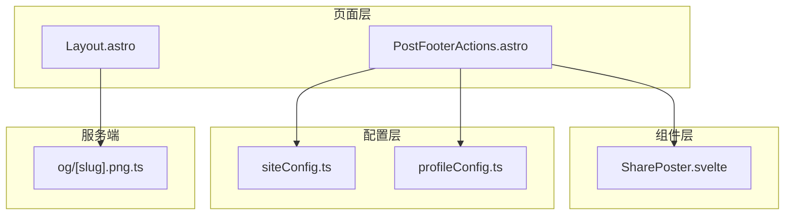
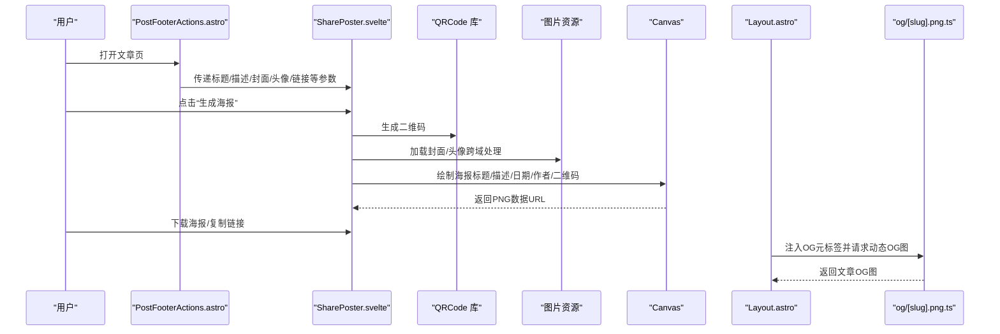
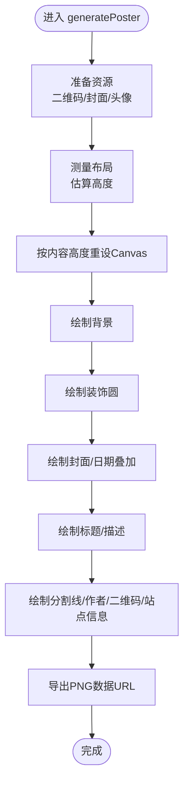
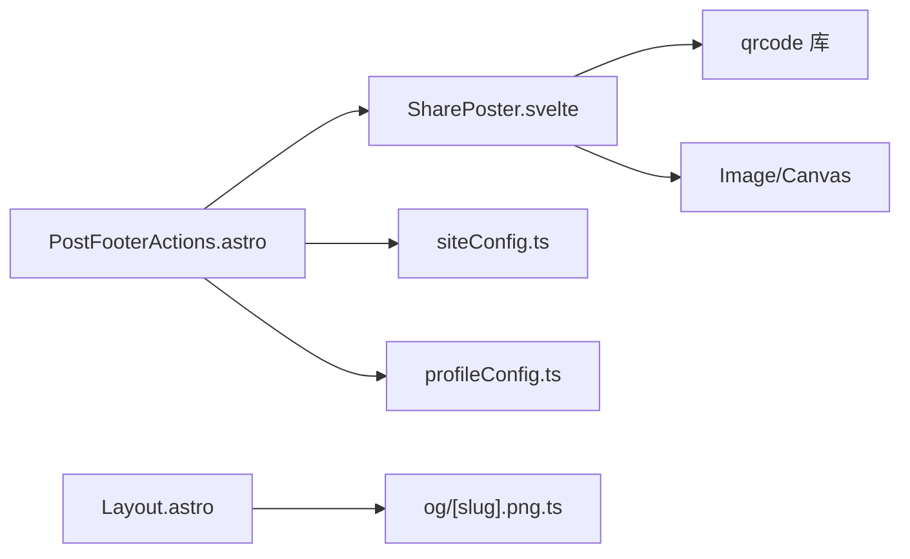

# 社交分享功能

<cite>
**本文引用的文件**
- [SharePoster.svelte](file://src/components/misc/SharePoster.svelte)
- [PostFooterActions.astro](file://src/components/misc/PostFooterActions.astro)
- [siteConfig.ts](file://src/config/siteConfig.ts)
- [profileConfig.ts](file://src/config/profileConfig.ts)
- [Layout.astro](file://src/layouts/Layout.astro)
- [og/[slug].png.ts](file://src/pages/og/[slug].png.ts)
</cite>

## 目录
1. [简介](#简介)
2. [项目结构](#项目结构)
3. [核心组件](#核心组件)
4. [架构总览](#架构总览)
5. [详细组件分析](#详细组件分析)
6. [依赖关系分析](#依赖关系分析)
7. [性能考虑](#性能考虑)
8. [故障排查指南](#故障排查指南)
9. [结论](#结论)
10. [附录](#附录)

## 简介
本文件系统性梳理博客中的社交分享能力，重点覆盖“分享海报生成”、“分享内容定制”、“平台适配”、“统计追踪”、“SEO优化”、“性能优化”以及“扩展开发指南”。读者可据此快速理解并扩展分享功能，满足微信、微博、Twitter、Facebook等平台的分享需求。

## 项目结构
社交分享相关的核心位置如下：
- 分享海报生成组件：src/components/misc/SharePoster.svelte
- 文章页底部分享入口挂载：src/components/misc/PostFooterActions.astro
- 站点配置（含分享海报开关、OG图片开关等）：src/config/siteConfig.ts
- 作者信息配置（头像、昵称等）：src/config/profileConfig.ts
- 页面级SEO元标签注入（OpenGraph/Twitter Cards）：src/layouts/Layout.astro
- OG 图片动态生成接口：src/pages/og/[slug].png.ts

图表来源
- [PostFooterActions.astro:1-119](file://src/components/misc/PostFooterActions.astro#L1-L119)
- [SharePoster.svelte:1-537](file://src/components/misc/SharePoster.svelte#L1-L537)
- [siteConfig.ts:160-167](file://src/config/siteConfig.ts#L160-L167)
- [profileConfig.ts:14-27](file://src/config/profileConfig.ts#L14-L27)
- [Layout.astro:124-128](file://src/layouts/Layout.astro#L124-L128)
- [og/[slug].png.ts](file://src/pages/og/[slug].png.ts)

章节来源
- [PostFooterActions.astro:1-119](file://src/components/misc/PostFooterActions.astro#L1-L119)
- [siteConfig.ts:160-167](file://src/config/siteConfig.ts#L160-L167)
- [profileConfig.ts:14-27](file://src/config/profileConfig.ts#L14-L27)
- [Layout.astro:124-128](file://src/layouts/Layout.astro#L124-L128)
- [og/[slug].png.ts](file://src/pages/og/[slug].png.ts)

## 核心组件
- SharePoster.svelte：负责生成分享海报（Canvas绘制）、二维码生成、下载与复制链接。
- PostFooterActions.astro：在文章页底部挂载分享入口，按配置决定是否显示分享海报。
- siteConfig.ts：控制分享海报开关、OG图片开关、默认OG图等全局配置。
- profileConfig.ts：提供作者头像、昵称等信息，供海报生成使用。
- Layout.astro：注入页面级OG/Twitter元标签，配合OG图片接口生成动态OG图。
- og/[slug].png.ts：服务端动态生成文章OG图，作为页面OG图片源。

章节来源
- [SharePoster.svelte:1-537](file://src/components/misc/SharePoster.svelte#L1-L537)
- [PostFooterActions.astro:1-119](file://src/components/misc/PostFooterActions.astro#L1-L119)
- [siteConfig.ts:160-167](file://src/config/siteConfig.ts#L160-L167)
- [profileConfig.ts:14-27](file://src/config/profileConfig.ts#L14-L27)
- [Layout.astro:124-128](file://src/layouts/Layout.astro#L124-L128)
- [og/[slug].png.ts](file://src/pages/og/[slug].png.ts)

## 架构总览
分享功能由“页面入口 + 组件 + 配置 + SEO + 服务端OG图”构成，形成“客户端生成海报 + 服务端提供OG图”的双通道方案。

图表来源
- [PostFooterActions.astro:76-88](file://src/components/misc/PostFooterActions.astro#L76-L88)
- [SharePoster.svelte:105-445](file://src/components/misc/SharePoster.svelte#L105-L445)
- [Layout.astro:124-128](file://src/layouts/Layout.astro#L124-L128)
- [og/[slug].png.ts](file://src/pages/og/[slug].png.ts)

## 详细组件分析

### SharePoster 组件
- 角色定位：在客户端生成高质量分享海报，支持下载与复制链接。
- 关键流程：
  - 参数接收：标题、作者、描述、发布日期、封面图、页面URL、站点标题、头像。
  - 主题色提取：通过DOM临时元素读取CSS变量，确保海报主色调与站点一致。
  - 资源准备：异步加载二维码、封面图、头像；对跨域图片采用代理兜底。
  - 布局计算：基于比例估算内容高度，避免溢出；标题按字符宽度分行；描述限制最多N行。
  - Canvas绘制：背景、装饰圆、封面图（等比裁剪）、日期叠加、标题/描述、分割线、作者头像、二维码与站点信息。
  - 结果输出：生成PNG数据URL，支持下载与复制链接。
- 交互细节：弹窗展示海报，生成中显示加载动画；下载按钮禁用条件为海报就绪；复制链接即时反馈。

图表来源
- [SharePoster.svelte:105-445](file://src/components/misc/SharePoster.svelte#L105-L445)

章节来源
- [SharePoster.svelte:1-537](file://src/components/misc/SharePoster.svelte#L1-L537)

### PostFooterActions 组件
- 角色定位：在文章页底部统一挂载分享入口，按配置决定是否启用分享海报。
- 关键逻辑：
  - 读取站点配置与作者配置，拼装传递给SharePoster的参数。
  - 条件渲染：当站点开启分享海报时显示按钮；否则不渲染。
  - 参数映射：标题、描述、发布时间、封面、头像、页面URL、站点标题等。

章节来源
- [PostFooterActions.astro:1-119](file://src/components/misc/PostFooterActions.astro#L1-L119)
- [siteConfig.ts:160-167](file://src/config/siteConfig.ts#L160-L167)
- [profileConfig.ts:14-27](file://src/config/profileConfig.ts#L14-L27)

### 配置与SEO
- 站点配置（siteConfig.ts）
  - sharePoster：控制是否启用分享海报功能。
  - generateOgImages：控制是否启用动态OG图片生成。
  - defaultOgImage：默认OG图路径。
- 页面SEO（Layout.astro）
  - 注入Twitter Cards元标签（卡片类型、URL、标题、描述、图片）。
  - OG图片由服务端接口动态生成，作为Twitter图片源。
- OG图片接口（og/[slug].png.ts）
  - 接收文章slug，生成对应OG图，供页面OG元标签引用。

章节来源
- [siteConfig.ts:160-167](file://src/config/siteConfig.ts#L160-L167)
- [Layout.astro:124-128](file://src/layouts/Layout.astro#L124-L128)
- [og/[slug].png.ts](file://src/pages/og/[slug].png.ts)

## 依赖关系分析
- 组件耦合
  - PostFooterActions 依赖 siteConfig 与 profileConfig，向 SharePoster 传递参数。
  - SharePoster 依赖 QRCode 库、浏览器 Image/Canvas API。
  - 页面SEO依赖 Layout 注入的OG/Twitter元标签与 og/[slug].png.ts 生成的OG图。
- 外部依赖
  - QRCode：生成二维码。
  - Weserv 图片代理：跨域图片兜底。
  - 浏览器 Canvas：海报绘制与导出。

图表来源
- [PostFooterActions.astro:76-88](file://src/components/misc/PostFooterActions.astro#L76-L88)
- [SharePoster.svelte:2-6](file://src/components/misc/SharePoster.svelte#L2-L6)
- [siteConfig.ts:160-167](file://src/config/siteConfig.ts#L160-L167)
- [profileConfig.ts:14-27](file://src/config/profileConfig.ts#L14-L27)
- [Layout.astro:124-128](file://src/layouts/Layout.astro#L124-L128)
- [og/[slug].png.ts](file://src/pages/og/[slug].png.ts)

章节来源
- [PostFooterActions.astro:1-119](file://src/components/misc/PostFooterActions.astro#L1-L119)
- [SharePoster.svelte:1-537](file://src/components/misc/SharePoster.svelte#L1-L537)
- [siteConfig.ts:160-167](file://src/config/siteConfig.ts#L160-L167)
- [profileConfig.ts:14-27](file://src/config/profileConfig.ts#L14-L27)
- [Layout.astro:124-128](file://src/layouts/Layout.astro#L124-L128)
- [og/[slug].png.ts](file://src/pages/og/[slug].png.ts)

## 性能考虑
- 图片加载与跨域
  - 对跨域图片失败场景，自动走代理（weserv）兜底，提升成功率。
  - 优先使用WebP/AVIF格式（站点配置中已设定），降低体积。
- Canvas绘制
  - 使用高倍数缩放（scale=2）保证高清输出；按内容动态计算高度，避免过度绘制。
  - 文本分行与行高控制，限制描述行数，减少绘制成本。
- 交互体验
  - 生成中显示加载动画与文案提示，避免用户误操作。
  - 下载按钮仅在海报可用时启用，避免无效操作。
- SEO与OG图
  - 动态OG图由服务端生成，避免客户端渲染阻塞页面首屏。
  - OG图片开关可按需开启，避免本地调试时的长时间渲染。

章节来源
- [SharePoster.svelte:36-57](file://src/components/misc/SharePoster.svelte#L36-L57)
- [siteConfig.ts:295-307](file://src/config/siteConfig.ts#L295-L307)
- [Layout.astro:124-128](file://src/layouts/Layout.astro#L124-L128)
- [og/[slug].png.ts](file://src/pages/og/[slug].png.ts)

## 故障排查指南
- 海报无法生成或空白
  - 检查封面/头像URL是否可访问，确认跨域策略；组件已内置代理兜底逻辑。
  - 确认浏览器Canvas可用，且未被安全策略阻止。
- 二维码不显示
  - 检查传递的URL是否有效；确认QRCode库可用。
- 下载按钮不可用
  - 确认海报已生成（posterImage非空）；检查按钮禁用条件。
- OG图不显示
  - 确认Layout已注入OG/Twitter元标签；检查og/[slug].png.ts接口是否正常返回。
- 复制链接无反应
  - 检查浏览器Clipboard API权限与HTTPS环境要求。

章节来源
- [SharePoster.svelte:447-467](file://src/components/misc/SharePoster.svelte#L447-L467)
- [Layout.astro:124-128](file://src/layouts/Layout.astro#L124-L128)
- [og/[slug].png.ts](file://src/pages/og/[slug].png.ts)

## 结论
该社交分享体系以“客户端海报生成 + 服务端OG图”为核心，结合站点配置与页面SEO元标签，形成完整的内容分发基础能力。通过合理的资源加载策略、Canvas绘制优化与交互提示，既保证了用户体验，也兼顾了性能与可维护性。后续可在平台适配、统计追踪与扩展渠道方面继续增强。

## 附录

### 分享内容定制清单
- 标题生成：优先使用文章标题，必要时回退为站点标题。
- 描述截取：限制最多N行，超出部分省略。
- 缩略图处理：封面图按目标比例裁剪，无封面时绘制主题色背景。
- 元数据设置：作者头像、站点标题、二维码、日期叠加等。

章节来源
- [SharePoster.svelte:59-82](file://src/components/misc/SharePoster.svelte#L59-L82)
- [SharePoster.svelte:220-258](file://src/components/misc/SharePoster.svelte#L220-L258)
- [SharePoster.svelte:299-338](file://src/components/misc/SharePoster.svelte#L299-L338)

### 平台适配要点
- 微信
  - 使用动态OG图作为分享图；标题/描述来自页面元标签。
- 微博
  - 使用标准OG图；若需大图卡片，可参考Twitter Cards配置。
- Twitter
  - 使用Twitter Cards元标签（summary_large_image等）；图片指向OG图。
- Facebook
  - 使用OpenGraph元标签；图片指向OG图。

章节来源
- [Layout.astro:124-128](file://src/layouts/Layout.astro#L124-L128)
- [og/[slug].png.ts](file://src/pages/og/[slug].png.ts)

### 分享统计与用户行为
- 建议在“复制链接”与“下载海报”按钮处埋点，记录点击次数与来源。
- 若接入第三方统计（如Umami/Clarity），可在按钮点击回调中触发事件上报。
- 注意隐私合规与HTTPS环境要求。

章节来源
- [siteConfig.ts:236-280](file://src/config/siteConfig.ts#L236-L280)
- [SharePoster.svelte:460-467](file://src/components/misc/SharePoster.svelte#L460-L467)

### SEO优化要点
- Open Graph：设置og:title、og:description、og:image、og:url。
- Twitter Cards：设置twitter:card、twitter:title、twitter:description、twitter:image。
- 结构化数据：可选Schema.org Article等，提升搜索引擎理解度。

章节来源
- [Layout.astro:124-128](file://src/layouts/Layout.astro#L124-L128)

### 性能优化建议
- 图片压缩：优先WebP/AVIF；按需开启OG图片生成。
- 懒加载：对文章列表中的图片采用懒加载；海报生成延迟到用户主动触发。
- 缓存策略：对OG图与二维码结果进行短期缓存，减少重复生成。

章节来源
- [siteConfig.ts:295-307](file://src/config/siteConfig.ts#L295-L307)
- [SharePoster.svelte:115-125](file://src/components/misc/SharePoster.svelte#L115-L125)

### 扩展开发指南
- 新增分享渠道
  - 在PostFooterActions中新增按钮，构造目标平台URL与参数。
  - 平台参数建议集中管理，便于维护与扩展。
- 自定义海报模板
  - 在SharePoster中扩展绘制逻辑，新增图层或排版。
  - 保持Canvas尺寸与比例稳定，避免导出尺寸异常。
- 第三方统计集成
  - 在按钮点击回调中调用统计SDK，上报事件与属性。
  - 确保HTTPS与权限配置正确。

章节来源
- [PostFooterActions.astro:76-88](file://src/components/misc/PostFooterActions.astro#L76-L88)
- [SharePoster.svelte:447-467](file://src/components/misc/SharePoster.svelte#L447-L467)