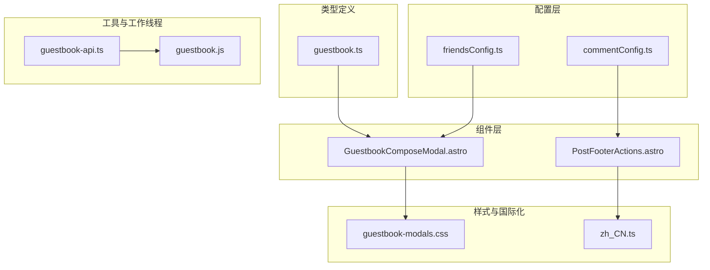
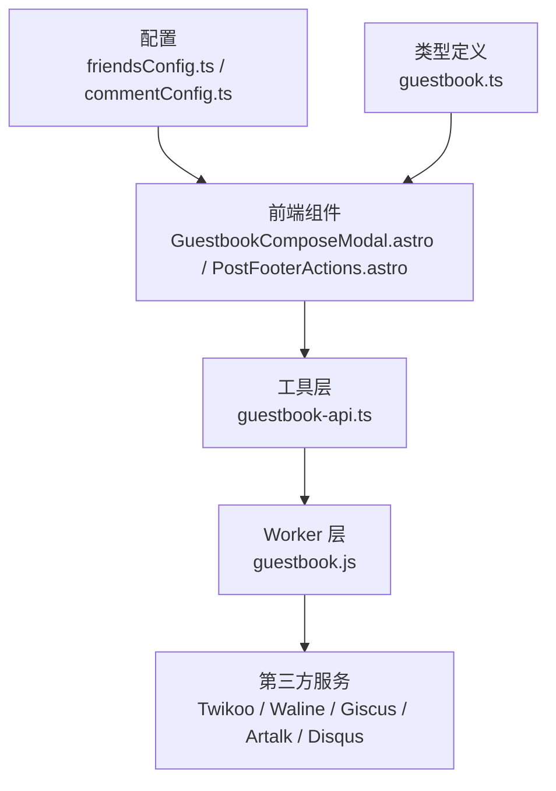
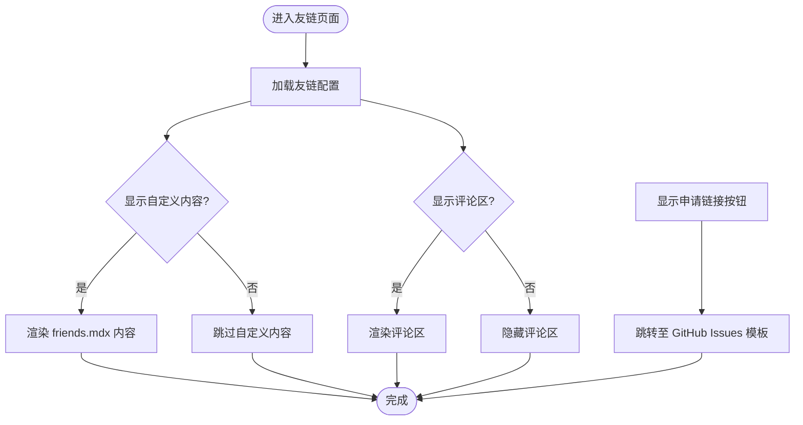
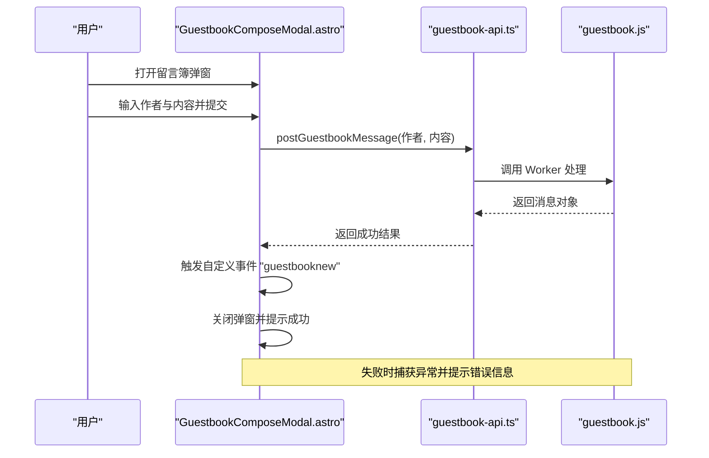
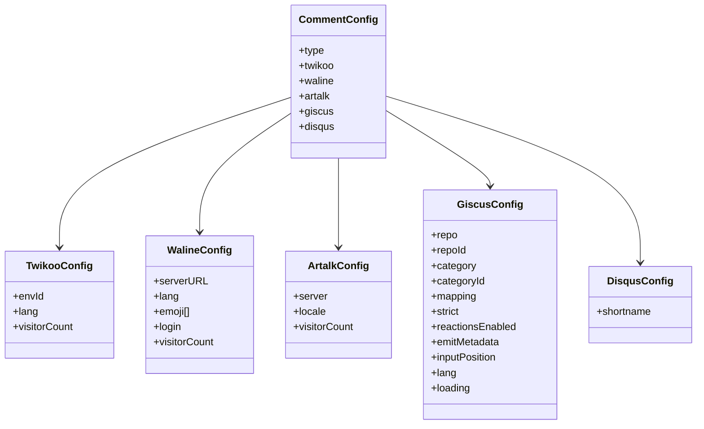
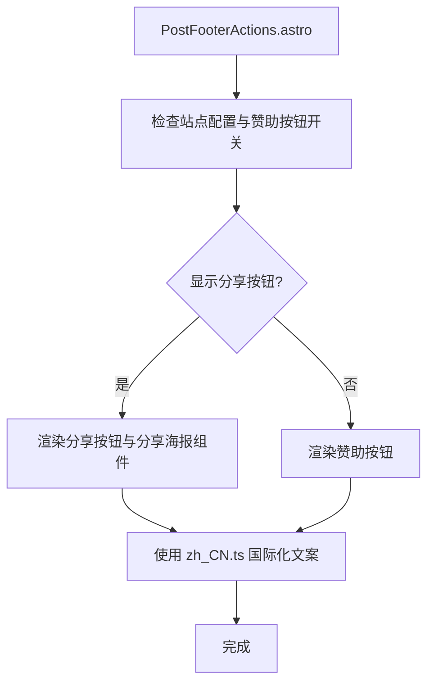
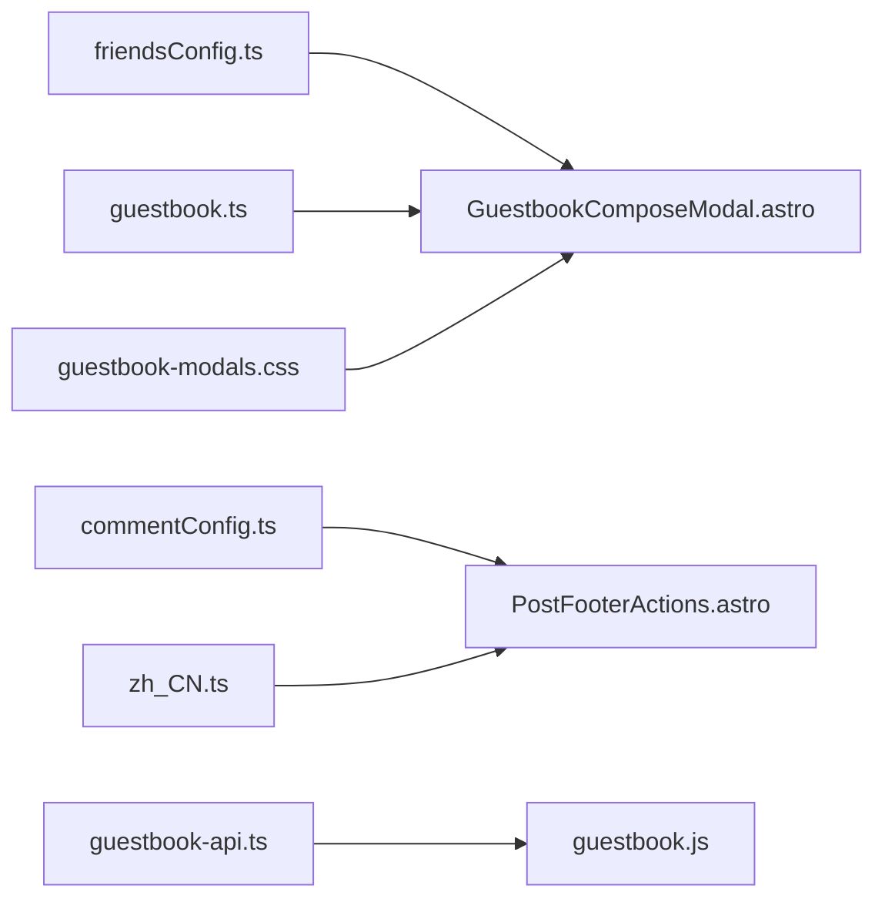

# 社交功能

<cite>
**本文引用的文件**
- [friendsConfig.ts](file://src/config/friendsConfig.ts)
- [commentConfig.ts](file://src/config/commentConfig.ts)
- [guestbook.ts](file://src/types/guestbook.ts)
- [GuestbookComposeModal.astro](file://src/components/features/GuestbookComposeModal.astro)
- [PostFooterActions.astro](file://src/components/misc/PostFooterActions.astro)
- [guestbook-api.ts](file://src/utils/guestbook-api.ts)
- [guestbook.js](file://src/workers/guestbook.js)
- [guestbook-modals.css](file://src/styles/components/guestbook-modals.css)
- [zh_CN.ts](file://src/i18n/languages/zh_CN.ts)
- [friends.mdx](file://src/content/spec/friends.mdx)
</cite>

## 目录
1. [简介](#简介)
2. [项目结构](#项目结构)
3. [核心组件](#核心组件)
4. [架构概览](#架构概览)
5. [详细组件分析](#详细组件分析)
6. [依赖关系分析](#依赖关系分析)
7. [性能考量](#性能考量)
8. [故障排查指南](#故障排查指南)
9. [结论](#结论)
10. [附录](#附录)

## 简介
本文件系统性梳理 Firefly-Mod 博客项目的社交功能模块，覆盖以下方面：
- 友链管理系统：数据结构、自动申请流程、状态管理与页面展示
- 访客留言簿：消息存储、审核机制、回复系统与通知
- 多评论系统集成：Twikoo、Waline、Giscus、Artalk、Disqus 的配置与使用
- 社交分享功能：分享按钮、元数据生成与平台适配
- 安全与合规：垃圾信息过滤、用户验证与内容审核建议
- 统计与追踪：社交数据统计分析与用户行为追踪思路
- 性能优化与缓存策略：前端与后端缓存、CDN 与资源优化
- 扩展开发指南：第三方服务接入与自定义集成方法

## 项目结构
社交功能相关代码主要分布在以下区域：
- 配置层：友链与评论系统的全局配置
- 类型定义：留言簿消息的数据模型
- 组件层：留言簿弹窗、分享按钮等前端组件
- 工具与工作线程：留言簿 API 与 Worker 逻辑
- 国际化与内容：文案与页面内容

**图表来源**
- [friendsConfig.ts:1-39](file://src/config/friendsConfig.ts#L1-L39)
- [commentConfig.ts:1-78](file://src/config/commentConfig.ts#L1-L78)
- [guestbook.ts:1-45](file://src/types/guestbook.ts#L1-L45)
- [GuestbookComposeModal.astro:250-276](file://src/components/features/GuestbookComposeModal.astro#L250-L276)
- [PostFooterActions.astro:46-79](file://src/components/misc/PostFooterActions.astro#L46-L79)
- [guestbook-api.ts](file://src/utils/guestbook-api.ts)
- [guestbook.js](file://src/workers/guestbook.js)
- [guestbook-modals.css:102-183](file://src/styles/components/guestbook-modals.css#L102-L183)
- [zh_CN.ts:247-281](file://src/i18n/languages/zh_CN.ts#L247-L281)

**章节来源**
- [friendsConfig.ts:1-39](file://src/config/friendsConfig.ts#L1-L39)
- [commentConfig.ts:1-78](file://src/config/commentConfig.ts#L1-L78)
- [guestbook.ts:1-45](file://src/types/guestbook.ts#L1-L45)
- [GuestbookComposeModal.astro:250-276](file://src/components/features/GuestbookComposeModal.astro#L250-L276)
- [PostFooterActions.astro:46-79](file://src/components/misc/PostFooterActions.astro#L46-L79)
- [guestbook-modals.css:102-183](file://src/styles/components/guestbook-modals.css#L102-L183)
- [zh_CN.ts:247-281](file://src/i18n/languages/zh_CN.ts#L247-L281)

## 核心组件
- 友链配置与页面展示
  - 通过友链页面配置控制标题、描述、是否显示评论区、是否开启随机排序、申请链接与站点信息等
  - 支持在友链页面底部显示自定义内容（friends.mdx）
- 访客留言簿
  - 定义留言簿消息的数据结构，包含作者、内容、时间、创建时间与投票统计
  - 提供留言簿弹窗组件，负责提交、错误提示与事件分发
  - 提供 Worker 侧留言簿处理逻辑（如缓存、限流、持久化）
- 多评论系统集成
  - 在评论配置中统一声明各系统类型与参数，支持 Twikoo、Waline、Giscus、Artalk、Disqus
- 社交分享
  - 在文章页脚动作中提供分享海报组件，支持生成分享图与社交传播

**章节来源**
- [friendsConfig.ts:6-35](file://src/config/friendsConfig.ts#L6-L35)
- [friends.mdx](file://src/content/spec/friends.mdx)
- [guestbook.ts:1-18](file://src/types/guestbook.ts#L1-L18)
- [GuestbookComposeModal.astro:250-276](file://src/components/features/GuestbookComposeModal.astro#L250-L276)
- [guestbook.js](file://src/workers/guestbook.js)
- [commentConfig.ts:3-78](file://src/config/commentConfig.ts#L3-L78)
- [PostFooterActions.astro:46-79](file://src/components/misc/PostFooterActions.astro#L46-L79)

## 架构概览
社交功能由“配置驱动 + 组件渲染 + 工具与后端”三层构成：
- 配置层：集中管理友链与评论系统开关与参数
- 组件层：负责用户交互（留言簿弹窗、分享按钮）与页面渲染
- 工具与后端：提供 API 调用、Worker 处理与第三方服务对接

**图表来源**
- [friendsConfig.ts:1-39](file://src/config/friendsConfig.ts#L1-L39)
- [commentConfig.ts:1-78](file://src/config/commentConfig.ts#L1-L78)
- [guestbook.ts:1-45](file://src/types/guestbook.ts#L1-L45)
- [GuestbookComposeModal.astro:250-276](file://src/components/features/GuestbookComposeModal.astro#L250-L276)
- [guestbook-api.ts](file://src/utils/guestbook-api.ts)
- [guestbook.js](file://src/workers/guestbook.js)

## 详细组件分析

### 友链管理系统
- 数据结构与页面配置
  - 通过友链页面配置对象控制页面标题、描述、评论区显示、随机排序、申请链接与站点信息
  - 支持在友链页面底部嵌入自定义内容（friends.mdx）
- 自动申请处理
  - 通过配置中的申请链接跳转至 GitHub Issues 模板，实现自动化申请入口
- 状态管理与可视化展示
  - 页面根据配置动态决定是否显示评论区与自定义内容
  - 通过友链规则与注意事项在页面内展示

**图表来源**
- [friendsConfig.ts:6-35](file://src/config/friendsConfig.ts#L6-L35)
- [friends.mdx](file://src/content/spec/friends.mdx)

**章节来源**
- [friendsConfig.ts:6-35](file://src/config/friendsConfig.ts#L6-L35)
- [friends.mdx](file://src/content/spec/friends.mdx)

### 访客留言簿
- 数据模型
  - 留言簿消息包含唯一 ID、作者、内容、时间、创建时间戳与投票统计（赞成/反对/中立）
- 提交流程
  - 弹窗组件收集作者与内容，调用工具层 API 提交
  - 成功后通过自定义事件广播新消息，关闭弹窗；失败时根据状态码与错误信息提示
- Worker 侧处理
  - Worker 负责消息持久化、缓存、限流与索引维护（如按创建时间倒序列表）

**图表来源**
- [GuestbookComposeModal.astro:250-276](file://src/components/features/GuestbookComposeModal.astro#L250-L276)
- [guestbook-api.ts](file://src/utils/guestbook-api.ts)
- [guestbook.js](file://src/workers/guestbook.js)

**章节来源**
- [guestbook.ts:1-18](file://src/types/guestbook.ts#L1-L18)
- [GuestbookComposeModal.astro:250-276](file://src/components/features/GuestbookComposeModal.astro#L250-L276)
- [guestbook-modals.css:102-183](file://src/styles/components/guestbook-modals.css#L102-L183)

### 多评论系统集成
- 配置项
  - 统一在评论配置中声明系统类型与参数，如 Twikoo 的环境 ID、语言与访问量统计开关
  - Waline 支持服务端地址、语言、表情包、登录模式与访问量统计
  - Artalk 支持服务端地址、语言与访问量统计
  - Giscus 支持仓库、分类、映射方式、严格模式、反应功能、元数据、输入位置、语言与懒加载
  - Disqus 支持 shortname
- 使用方式
  - 在页面中根据配置选择对应评论组件进行渲染与初始化

**图表来源**
- [commentConfig.ts:3-78](file://src/config/commentConfig.ts#L3-L78)

**章节来源**
- [commentConfig.ts:3-78](file://src/config/commentConfig.ts#L3-L78)

### 社交分享功能
- 分享按钮与文案
  - 在文章页脚动作中根据站点配置与赞助按钮开关切换“分享”或“赞助”文案
  - 国际化文案支持“分享到社交网络”与描述
- 分享海报组件
  - 通过分享海报组件生成文章分享图，便于社交传播

**图表来源**
- [PostFooterActions.astro:46-79](file://src/components/misc/PostFooterActions.astro#L46-L79)
- [zh_CN.ts:247-281](file://src/i18n/languages/zh_CN.ts#L247-L281)

**章节来源**
- [PostFooterActions.astro:46-79](file://src/components/misc/PostFooterActions.astro#L46-L79)
- [zh_CN.ts:247-281](file://src/i18n/languages/zh_CN.ts#L247-L281)

## 依赖关系分析
- 组件与配置
  - 友链页面配置影响 GuestbookComposeModal 的可见性与行为
  - 评论配置决定页面中评论区的渲染与参数传递
- 工具与 Worker
  - guestbook-api.ts 作为前端调用入口，Worker 作为后端处理单元，二者通过消息与事件通信
- 样式与国际化
  - 留言簿弹窗样式独立于组件，国际化文案贯穿分享与页面文案

**图表来源**
- [friendsConfig.ts:1-39](file://src/config/friendsConfig.ts#L1-L39)
- [commentConfig.ts:1-78](file://src/config/commentConfig.ts#L1-L78)
- [guestbook.ts:1-45](file://src/types/guestbook.ts#L1-L45)
- [GuestbookComposeModal.astro:250-276](file://src/components/features/GuestbookComposeModal.astro#L250-L276)
- [guestbook-api.ts](file://src/utils/guestbook-api.ts)
- [guestbook.js](file://src/workers/guestbook.js)
- [guestbook-modals.css:102-183](file://src/styles/components/guestbook-modals.css#L102-L183)
- [zh_CN.ts:247-281](file://src/i18n/languages/zh_CN.ts#L247-L281)

**章节来源**
- [friendsConfig.ts:1-39](file://src/config/friendsConfig.ts#L1-L39)
- [commentConfig.ts:1-78](file://src/config/commentConfig.ts#L1-L78)
- [guestbook.ts:1-45](file://src/types/guestbook.ts#L1-L45)
- [GuestbookComposeModal.astro:250-276](file://src/components/features/GuestbookComposeModal.astro#L250-L276)
- [guestbook-modals.css:102-183](file://src/styles/components/guestbook-modals.css#L102-L183)
- [zh_CN.ts:247-281](file://src/i18n/languages/zh_CN.ts#L247-L281)

## 性能考量
- 前端性能
  - 留言簿弹窗采用惰性加载与事件解绑，减少不必要的 DOM 与事件绑定
  - 分享海报组件按需加载，避免阻塞首屏
- 缓存策略
  - Worker 侧可对热门留言与索引建立缓存，降低数据库压力
  - 评论系统可利用第三方服务的本地缓存与 CDN 加速
- 资源优化
  - 图片与样式按需引入，CSS 与 JS 拆分与压缩
- 第三方服务
  - 优先选择具备良好 CDN 与跨域配置的服务，减少跨域与慢请求

[本节为通用指导，无需特定文件引用]

## 故障排查指南
- 留言簿提交失败
  - 检查工具层 API 返回的状态码与错误信息，确认 Worker 是否正常响应
  - 查看弹窗组件的错误提示逻辑与事件分发
- 评论系统不可用
  - 核对评论配置中的各项参数是否正确，确认第三方服务可用性
  - 检查页面中评论组件的初始化顺序与依赖
- 分享按钮无响应
  - 确认站点配置与赞助按钮开关设置，检查国际化文案是否正确加载
  - 验证分享海报组件的客户端加载指令

**章节来源**
- [GuestbookComposeModal.astro:250-276](file://src/components/features/GuestbookComposeModal.astro#L250-L276)
- [commentConfig.ts:3-78](file://src/config/commentConfig.ts#L3-L78)
- [zh_CN.ts:247-281](file://src/i18n/languages/zh_CN.ts#L247-L281)

## 结论
Firefly-Mod 的社交功能以配置为中心，结合组件化与 Worker 处理，实现了友链、留言簿与多评论系统的灵活集成。通过清晰的数据模型、事件驱动与缓存策略，系统在保证易用性的同时兼顾性能与可扩展性。建议在生产环境中进一步完善安全与审核机制，并持续评估第三方服务的稳定性与合规性。

[本节为总结性内容，无需特定文件引用]

## 附录
- 开发与部署建议
  - 对 Worker 侧增加健康检查与重试机制
  - 为留言簿与评论区增加速率限制与内容过滤
  - 使用 CDN 缓存静态资源，提升全球访问速度
- 扩展开发指南
  - 新增第三方评论服务时，遵循现有配置结构并在页面中按需渲染
  - 自定义社交分享时，确保元数据完整且平台适配良好

[本节为通用指导，无需特定文件引用]