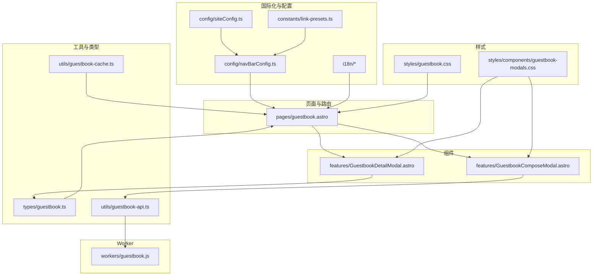
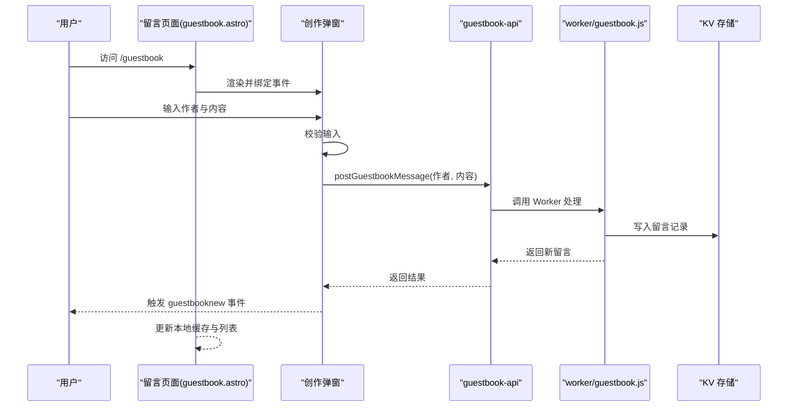
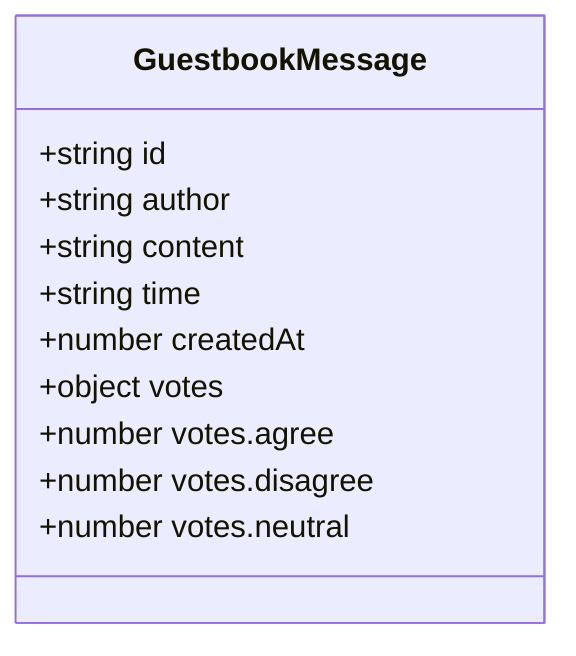
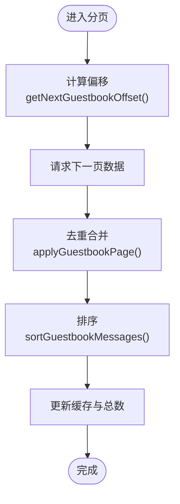
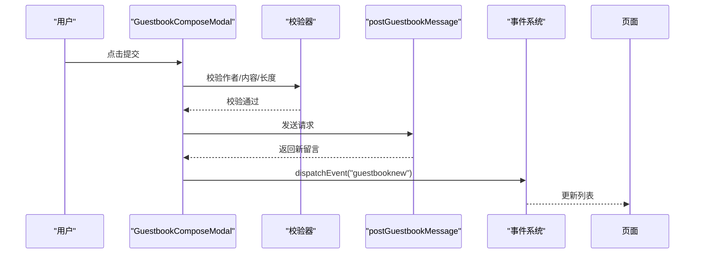
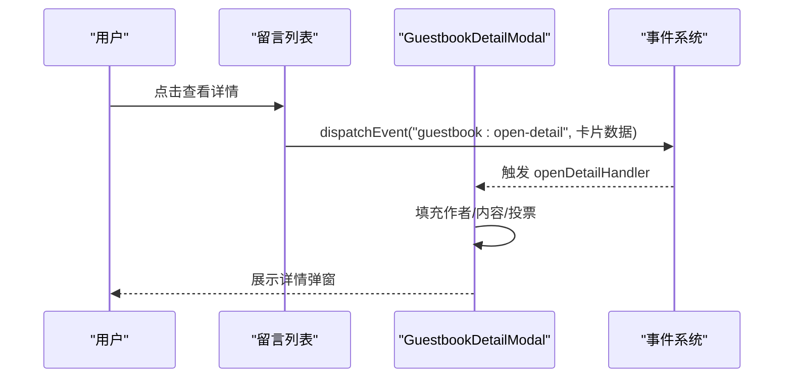
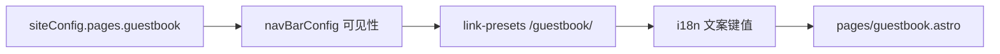
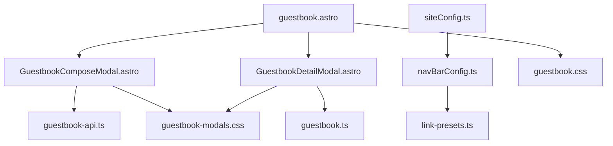

# 访客留言簿

<cite>
**本文引用的文件**   
- [src/types/guestbook.ts](file://src/types/guestbook.ts)
- [src/utils/guestbook-cache.ts](file://src/utils/guestbook-cache.ts)
- [src/components/features/GuestbookComposeModal.astro](file://src/components/features/GuestbookComposeModal.astro)
- [src/components/features/GuestbookDetailModal.astro](file://src/components/features/GuestbookDetailModal.astro)
- [src/pages/guestbook.astro](file://src/pages/guestbook.astro)
- [src/config/siteConfig.ts](file://src/config/siteConfig.ts)
- [src/config/navBarConfig.ts](file://src/config/navBarConfig.ts)
- [src/constants/link-presets.ts](file://src/constants/link-presets.ts)
- [src/i18n/languages/zh_CN.ts](file://src/i18n/languages/zh_CN.ts)
- [src/i18n/i18nKey.ts](file://src/i18n/i18nKey.ts)
- [src/content/spec/guestbook.md](file://src/content/spec/guestbook.md)
- [src/styles/guestbook.css](file://src/styles/guestbook.css)
- [src/styles/components/guestbook-modals.css](file://src/styles/components/guestbook-modals.css)
- [src/workers/guestbook.js](file://src/workers/guestbook.js)
- [src/utils/guestbook-api.ts](file://src/utils/guestbook-api.ts)
</cite>

## 目录
1. [简介](#简介)
2. [项目结构](#项目结构)
3. [核心组件](#核心组件)
4. [架构总览](#架构总览)
5. [详细组件分析](#详细组件分析)
6. [依赖关系分析](#依赖关系分析)
7. [性能考量](#性能考量)
8. [故障排查指南](#故障排查指南)
9. [结论](#结论)
10. [附录](#附录)

## 简介
本文件为“访客留言簿”系统的完整技术文档，覆盖数据模型、页面实现、创作与验证、缓存策略、安全措施以及扩展开发指南。系统采用 Astro + Svelte/客户端脚本的混合前端架构，结合 Worker 侧逻辑与 KV 存储设计，支持留言列表展示、分页加载、实时更新、表单校验、投票统计与详情弹窗等能力。

## 项目结构
留言簿功能由以下模块协同构成：
- 类型与常量：定义留言数据模型与示例数据
- 页面与路由：留言页面渲染与评论区挂载
- 组件：创作弹窗、详情弹窗、虚拟列表与视图容器
- 工具与缓存：分页偏移计算、消息去重排序、KV 结构预留
- 样式：整体布局与弹窗样式
- 国际化：菜单项与文案键值
- Worker：留言处理与持久化（KV）预留
- API：客户端调用封装（按需引入）

**图表来源**
- [src/pages/guestbook.astro](file://src/pages/guestbook.astro)
- [src/components/features/GuestbookComposeModal.astro](file://src/components/features/GuestbookComposeModal.astro)
- [src/components/features/GuestbookDetailModal.astro](file://src/components/features/GuestbookDetailModal.astro)
- [src/utils/guestbook-cache.ts](file://src/utils/guestbook-cache.ts)
- [src/utils/guestbook-api.ts](file://src/utils/guestbook-api.ts)
- [src/types/guestbook.ts](file://src/types/guestbook.ts)
- [src/config/siteConfig.ts](file://src/config/siteConfig.ts)
- [src/config/navBarConfig.ts](file://src/config/navBarConfig.ts)
- [src/constants/link-presets.ts](file://src/constants/link-presets.ts)
- [src/i18n/languages/zh_CN.ts](file://src/i18n/languages/zh_CN.ts)
- [src/i18n/i18nKey.ts](file://src/i18n/i18nKey.ts)
- [src/styles/guestbook.css](file://src/styles/guestbook.css)
- [src/styles/components/guestbook-modals.css](file://src/styles/components/guestbook-modals.css)
- [src/workers/guestbook.js](file://src/workers/guestbook.js)

**章节来源**
- [src/pages/guestbook.astro](file://src/pages/guestbook.astro)
- [src/config/siteConfig.ts](file://src/config/siteConfig.ts)
- [src/config/navBarConfig.ts](file://src/config/navBarConfig.ts)
- [src/constants/link-presets.ts](file://src/constants/link-presets.ts)

## 核心组件
- 留言数据模型：定义留言标识、作者、内容、时间描述、创建时间戳与投票统计字段；提供 KV 结构预留注释与示例数据。
- 分页与缓存：提供缓存状态、偏移计算、消息去重与排序函数，确保分页加载不重复、顺序正确。
- 创作弹窗：负责表单校验、提交流程、错误提示与实时事件广播。
- 详情弹窗：负责打开、填充与关闭，展示作者、内容与投票统计。
- 页面集成：留言页面通过内容源渲染，并挂载评论区组件。

**章节来源**
- [src/types/guestbook.ts:1-45](file://src/types/guestbook.ts#L1-L45)
- [src/utils/guestbook-cache.ts:1-49](file://src/utils/guestbook-cache.ts#L1-L49)
- [src/components/features/GuestbookComposeModal.astro:218-276](file://src/components/features/GuestbookComposeModal.astro#L218-L276)
- [src/components/features/GuestbookDetailModal.astro:37-77](file://src/components/features/GuestbookDetailModal.astro#L37-L77)
- [src/pages/guestbook.astro](file://src/pages/guestbook.astro)

## 架构总览
系统采用“页面渲染 + 客户端交互 + Worker 持久化”的分层架构。页面负责内容与评论区挂载，组件负责用户交互与事件通信，工具负责数据与缓存处理，Worker 负责留言写入与 KV 存储。

**图表来源**
- [src/pages/guestbook.astro](file://src/pages/guestbook.astro)
- [src/components/features/GuestbookComposeModal.astro:239-265](file://src/components/features/GuestbookComposeModal.astro#L239-L265)
- [src/utils/guestbook-api.ts](file://src/utils/guestbook-api.ts)
- [src/workers/guestbook.js](file://src/workers/guestbook.js)

## 详细组件分析

### 数据模型与字段约束
- 字段定义：id、author、content、time、createdAt、votes.agree/disagree/neutral
- 约束与校验：创作弹窗对内容长度进行 5-500 字符限制，对提交频率进行限流提示；状态码 429 对应“发送太频繁”，0 对应“网络连接失败”
- 示例数据：提供 mockGuestbookMessages 用于演示与测试

**图表来源**
- [src/types/guestbook.ts:1-12](file://src/types/guestbook.ts#L1-L12)

**章节来源**
- [src/types/guestbook.ts:1-45](file://src/types/guestbook.ts#L1-L45)
- [src/components/features/GuestbookComposeModal.astro:218-236](file://src/components/features/GuestbookComposeModal.astro#L218-L236)

### 留言列表与分页加载
- 偏移计算：根据当前缓存中的消息数量计算下一页偏移
- 去重合并：基于 id 去重，避免重复插入
- 排序规则：优先按消息编号降序，其次按 createdAt 降序
- 初始化标记：isInitialized 控制是否完成首次加载

**图表来源**
- [src/utils/guestbook-cache.ts:19-49](file://src/utils/guestbook-cache.ts#L19-L49)

**章节来源**
- [src/utils/guestbook-cache.ts:1-49](file://src/utils/guestbook-cache.ts#L1-L49)

### 留言创作与表单验证
- 输入校验：作者与内容非空；内容长度 5-500；防重复提交
- 错误映射：根据状态码与错误文本映射为用户可读提示
- 实时更新：提交成功后触发 guestbooknew 事件，页面监听并更新列表
- 交互反馈：按钮状态切换、禁用、错误提示显示

**图表来源**
- [src/components/features/GuestbookComposeModal.astro:239-265](file://src/components/features/GuestbookComposeModal.astro#L239-L265)

**章节来源**
- [src/components/features/GuestbookComposeModal.astro:218-276](file://src/components/features/GuestbookComposeModal.astro#L218-L276)

### 留言详情弹窗
- 打开与关闭：监听 guestbook:open-detail 事件，填充作者、内容与投票统计
- 防重复初始化：通过 __gb_initialized 防止多次绑定
- 关闭行为：恢复 body 滚动，关闭对话框

**图表来源**
- [src/components/features/GuestbookDetailModal.astro:56-96](file://src/components/features/GuestbookDetailModal.astro#L56-L96)

**章节来源**
- [src/components/features/GuestbookDetailModal.astro:37-77](file://src/components/features/GuestbookDetailModal.astro#L37-L77)
- [src/components/features/GuestbookDetailModal.astro:56-96](file://src/components/features/GuestbookDetailModal.astro#L56-L96)

### 页面集成与导航
- 页面渲染：从内容源加载留言页面内容，设置标题与描述
- 导航可用性：通过 siteConfig.pages.guestbook 控制入口可见性
- 菜单链接：link-presets 中定义 /guestbook/ 链接，i18n 提供文案键值

**图表来源**
- [src/config/siteConfig.ts](file://src/config/siteConfig.ts)
- [src/config/navBarConfig.ts](file://src/config/navBarConfig.ts)
- [src/constants/link-presets.ts](file://src/constants/link-presets.ts)
- [src/i18n/languages/zh_CN.ts](file://src/i18n/languages/zh_CN.ts)
- [src/i18n/i18nKey.ts](file://src/i18n/i18nKey.ts)
- [src/pages/guestbook.astro](file://src/pages/guestbook.astro)

**章节来源**
- [src/pages/guestbook.astro](file://src/pages/guestbook.astro)
- [src/config/siteConfig.ts](file://src/config/siteConfig.ts)
- [src/config/navBarConfig.ts](file://src/config/navBarConfig.ts)
- [src/constants/link-presets.ts](file://src/constants/link-presets.ts)
- [src/i18n/languages/zh_CN.ts](file://src/i18n/languages/zh_CN.ts)
- [src/i18n/i18nKey.ts](file://src/i18n/i18nKey.ts)

### 留言审核与管理员权限
- 状态管理：当前代码未直接暴露审核状态字段；建议在 GuestbookMessage 中新增 status 字段（如 pending/approved/rejected）
- 权限控制：建议在 Worker 层增加鉴权逻辑，仅允许管理员账户变更状态
- 批量操作：建议在管理后台提供批量选择与状态变更接口，Worker 负责批量写入

[本节为概念性扩展说明，不直接分析具体文件]

### 回复机制与通知
- 层级回复：建议在 GuestbookMessage 中新增 parentId 字段，形成树形结构
- 通知系统：提交回复后触发自定义事件，页面监听并刷新对应节点
- 邮件提醒：Worker 在 approved 状态变更时触发邮件队列（需第三方 SMTP Worker）

[本节为概念性扩展说明，不直接分析具体文件]

### 缓存策略与性能优化
- 本地缓存：使用 GuestbookCacheState 管理 messages、total、hasMore、isInitialized
- 服务端缓存：建议在 Worker 层引入 TTL 缓存与分页索引，减少 KV 查询压力
- 性能优化：启用虚拟滚动、懒加载、图片压缩与资源 CDN；对高频查询使用只读副本

**章节来源**
- [src/utils/guestbook-cache.ts:1-49](file://src/utils/guestbook-cache.ts#L1-L49)

### 安全措施
- 垃圾信息过滤：Worker 层集成关键词黑名单与敏感词检测
- 用户验证：提交需登录态，Worker 校验签名或 Token
- 内容审核：对首次提交或高风险 IP 实施人工审核流程

[本节为概念性扩展说明，不直接分析具体文件]

### 扩展开发指南与自定义集成
- 新增字段：在 GuestbookMessage 中添加字段并在页面与弹窗中同步渲染
- 自定义样式：通过 guestbook.css 与 guestbook-modals.css 扩展 UI
- 插件化：将 Worker 逻辑拆分为插件模块，便于替换与升级
- 国际化：在 i18n 目录新增语言键值，保持文案一致性

**章节来源**
- [src/styles/guestbook.css](file://src/styles/guestbook.css)
- [src/styles/components/guestbook-modals.css](file://src/styles/components/guestbook-modals.css)
- [src/i18n/languages/zh_CN.ts](file://src/i18n/languages/zh_CN.ts)
- [src/i18n/i18nKey.ts](file://src/i18n/i18nKey.ts)

## 依赖关系分析
- 组件依赖：GuestbookComposeModal 依赖 guestbook-api；GuestbookDetailModal 依赖类型定义
- 页面依赖：pages/guestbook.astro 依赖内容源与评论区挂载
- 配置依赖：siteConfig 控制入口开关；navBarConfig 与 link-presets 控制导航
- 样式依赖：guestbook.css 与 guestbook-modals.css 分别作用于页面与弹窗

**图表来源**
- [src/components/features/GuestbookComposeModal.astro](file://src/components/features/GuestbookComposeModal.astro)
- [src/components/features/GuestbookDetailModal.astro](file://src/components/features/GuestbookDetailModal.astro)
- [src/pages/guestbook.astro](file://src/pages/guestbook.astro)
- [src/config/siteConfig.ts](file://src/config/siteConfig.ts)
- [src/config/navBarConfig.ts](file://src/config/navBarConfig.ts)
- [src/constants/link-presets.ts](file://src/constants/link-presets.ts)
- [src/styles/guestbook.css](file://src/styles/guestbook.css)
- [src/styles/components/guestbook-modals.css](file://src/styles/components/guestbook-modals.css)

**章节来源**
- [src/components/features/GuestbookComposeModal.astro](file://src/components/features/GuestbookComposeModal.astro)
- [src/components/features/GuestbookDetailModal.astro](file://src/components/features/GuestbookDetailModal.astro)
- [src/pages/guestbook.astro](file://src/pages/guestbook.astro)
- [src/config/siteConfig.ts](file://src/config/siteConfig.ts)
- [src/config/navBarConfig.ts](file://src/config/navBarConfig.ts)
- [src/constants/link-presets.ts](file://src/constants/link-presets.ts)

## 性能考量
- 分页与去重：避免重复渲染与请求，提升首屏与滚动性能
- 虚拟列表：对长列表启用虚拟化，降低 DOM 节点数量
- 缓存命中：合理设置 TTL 与预热策略，减少 KV 延迟
- 资源优化：压缩样式与脚本、延迟加载非关键资源

[本节提供通用指导，不直接分析具体文件]

## 故障排查指南
- 提交失败：检查状态码映射与错误提示，确认网络连通性与限流阈值
- 无列表更新：确认 guestbooknew 事件是否被正确触发与监听
- 详情弹窗异常：检查事件处理器是否重复绑定与 modal 初始化标志位

**章节来源**
- [src/components/features/GuestbookComposeModal.astro:218-236](file://src/components/features/GuestbookComposeModal.astro#L218-L236)
- [src/components/features/GuestbookComposeModal.astro:239-265](file://src/components/features/GuestbookComposeModal.astro#L239-L265)
- [src/components/features/GuestbookDetailModal.astro:56-96](file://src/components/features/GuestbookDetailModal.astro#L56-L96)

## 结论
本系统以清晰的数据模型与模块化组件为基础，结合分页缓存与事件驱动更新，实现了稳定高效的留言簿功能。后续可在 Worker 层完善审核与通知、在页面层增强回复与权限控制，并持续优化缓存与性能策略。

## 附录
- 内容源：留言页面内容来自 content/spec/guestbook.md
- 国际化键值：guestbook 与 guestbookDescription
- Worker：预留 KV 写入与审核流程

**章节来源**
- [src/content/spec/guestbook.md](file://src/content/spec/guestbook.md)
- [src/i18n/i18nKey.ts](file://src/i18n/i18nKey.ts)
- [src/i18n/languages/zh_CN.ts](file://src/i18n/languages/zh_CN.ts)
- [src/workers/guestbook.js](file://src/workers/guestbook.js)