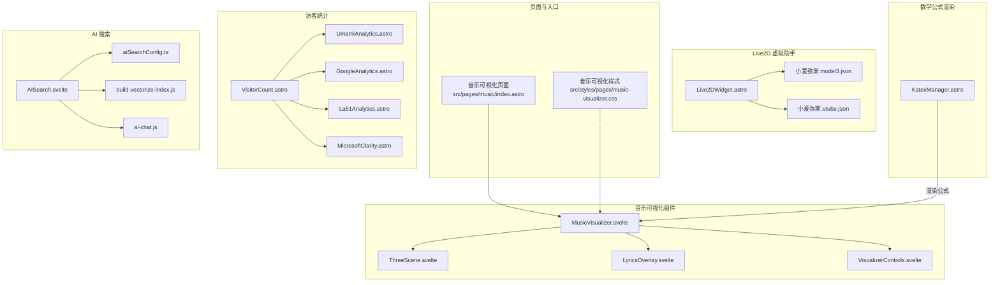
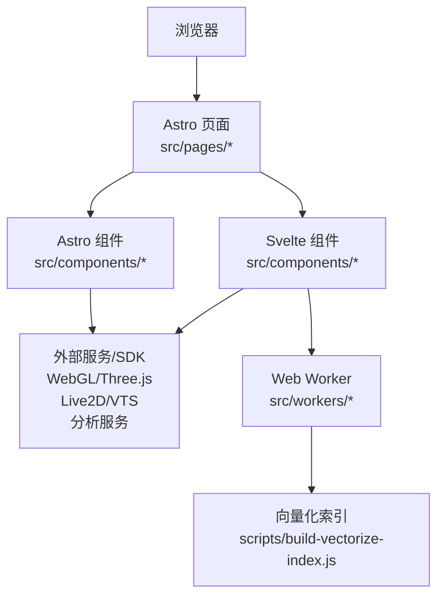
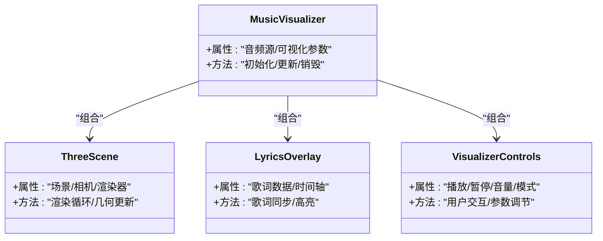
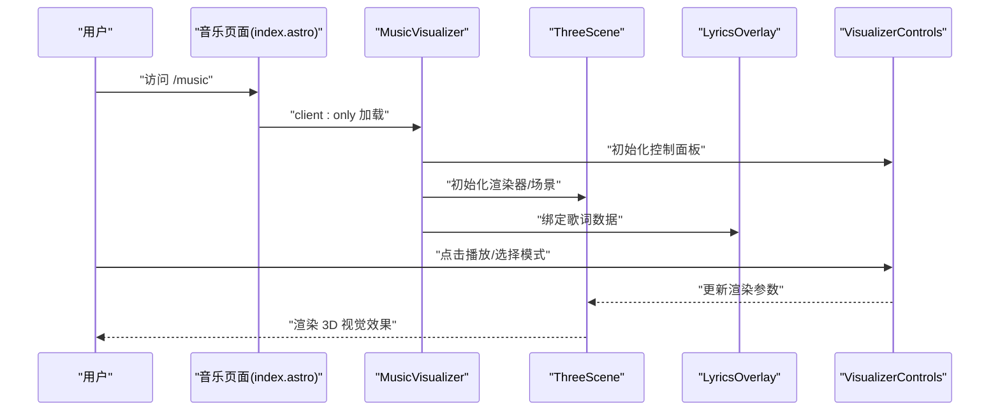
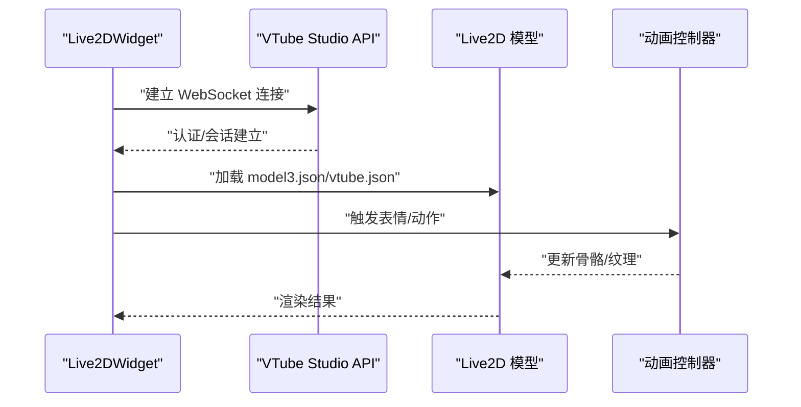
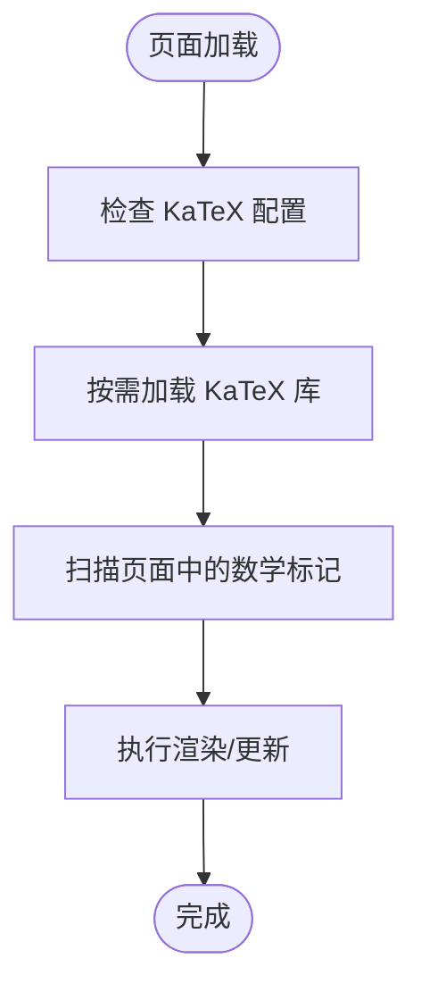
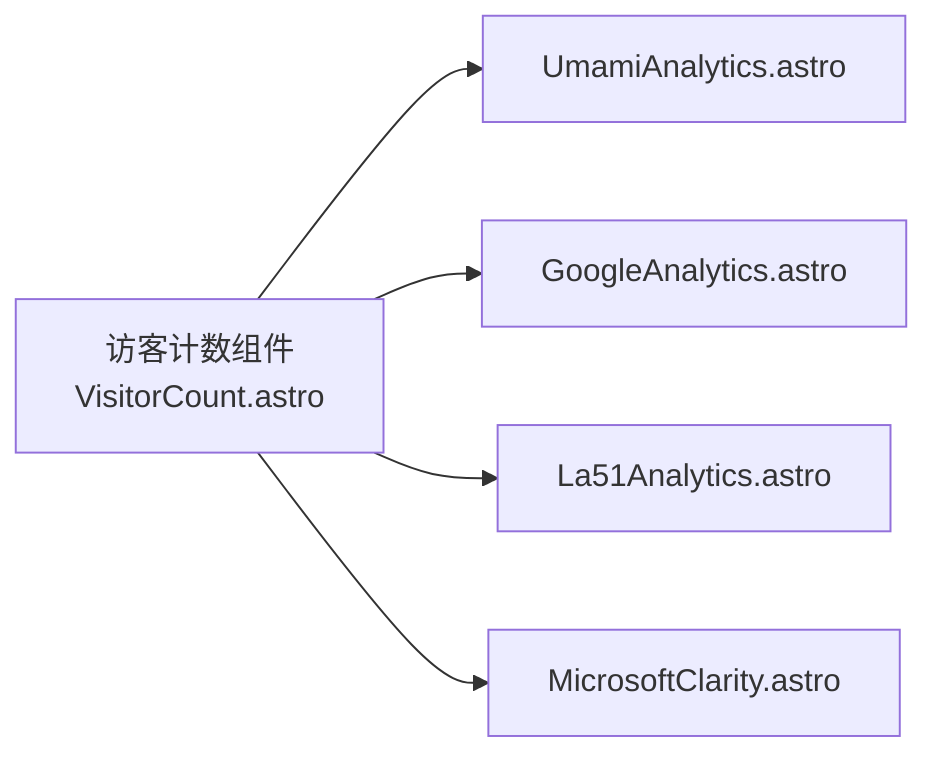
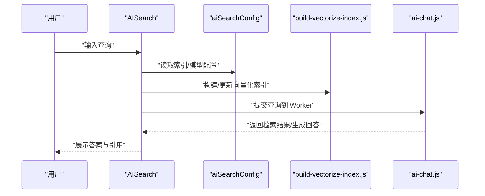
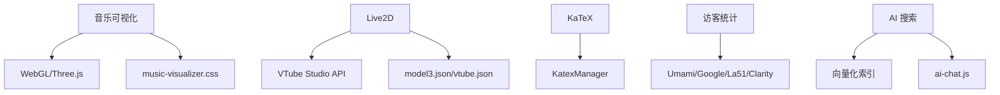

# 功能组件

<cite>
**本文引用的文件**
- [src/pages/music/index.astro](file://src/pages/music/index.astro)
- [src/styles/pages/music-visualizer.css](file://src/styles/pages/music-visualizer.css)
- [src/components/features/music-visualizer/MusicVisualizer.svelte](file://src/components/features/music-visualizer/MusicVisualizer.svelte)
- [src/components/features/music-visualizer/ThreeScene.svelte](file://src/components/features/music-visualizer/ThreeScene.svelte)
- [src/components/features/music-visualizer/LyricsOverlay.svelte](file://src/components/features/music-visualizer/LyricsOverlay.svelte)
- [src/components/features/music-visualizer/VisualizerControls.svelte](file://src/components/features/music-visualizer/VisualizerControls.svelte)
- [src/components/features/Live2DWidget.astro](file://src/components/features/Live2DWidget.astro)
- [public/pio/models/live2d/小爱弥斯_vts/小爱弥斯.model3.json](file://public/pio/models/live2d/小爱弥斯_vts/小爱弥斯.model3.json)
- [public/pio/models/live2d/小爱弥斯_vts/小爱弥斯.vtube.json](file://public/pio/models/live2d/小爱弥斯_vts/小爱弥斯.vtube.json)
- [src/components/features/KatexManager.astro](file://src/components/features/KatexManager.astro)
- [src/components/common/VisitorCount.astro](file://src/components/common/VisitorCount.astro)
- [src/components/analytics/UmamiAnalytics.astro](file://src/components/analytics/UmamiAnalytics.astro)
- [src/components/analytics/GoogleAnalytics.astro](file://src/components/analytics/GoogleAnalytics.astro)
- [src/components/analytics/La51Analytics.astro](file://src/components/analytics/La51Analytics.astro)
- [src/components/analytics/MicrosoftClarity.astro](file://src/components/analytics/MicrosoftClarity.astro)
- [src/components/controls/AISearch.svelte](file://src/components/controls/AISearch.svelte)
- [src/config/aiSearchConfig.ts](file://src/config/aiSearchConfig.ts)
- [scripts/build-vectorize-index.js](file://scripts/build-vectorize-index.js)
- [src/workers/ai-chat.js](file://src/workers/ai-chat.js)
</cite>

## 目录
1. [简介](#简介)
2. [项目结构](#项目结构)
3. [核心组件](#核心组件)
4. [架构总览](#架构总览)
5. [详细组件分析](#详细组件分析)
6. [依赖关系分析](#依赖关系分析)
7. [性能考虑](#性能考虑)
8. [故障排除指南](#故障排除指南)
9. [结论](#结论)
10. [附录](#附录)

## 简介
本文件系统性梳理博客项目中的特色功能组件，重点覆盖以下方面：
- 音乐可视化：基于 Three.js 的 3D 场景、歌词叠加层与可视化控制面板
- Live2D 虚拟助手：VTube Studio 驱动的 Live2D 模型集成与动画控制系统
- 数学公式渲染：KaTeX 渲染管理器与页面级集成
- 访客统计与分析：多平台分析服务（Umami、GA、La51、Microsoft Clarity）
- AI 搜索：向量化索引构建与 Worker 侧对话交互

文档旨在帮助开发者快速理解各组件的架构设计、实现模式、外部依赖集成方式，并提供配置、扩展、错误处理与性能优化建议。

## 项目结构
功能组件主要分布在以下目录：
- 页面入口与样式：src/pages/* 与 src/styles/*
- 功能组件：src/components/features/*
- 控制与通用组件：src/components/controls/* 与 src/components/common/*
- 分析与访客统计：src/components/analytics/*
- 配置与脚本：src/config/* 与 scripts/*
- Web Worker：src/workers/*

图表来源
- [src/pages/music/index.astro:1-18](file://src/pages/music/index.astro#L1-L18)
- [src/styles/pages/music-visualizer.css:1-375](file://src/styles/pages/music-visualizer.css#L1-L375)
- [src/components/features/music-visualizer/MusicVisualizer.svelte](file://src/components/features/music-visualizer/MusicVisualizer.svelte)
- [src/components/features/music-visualizer/ThreeScene.svelte](file://src/components/features/music-visualizer/ThreeScene.svelte)
- [src/components/features/music-visualizer/LyricsOverlay.svelte](file://src/components/features/music-visualizer/LyricsOverlay.svelte)
- [src/components/features/music-visualizer/VisualizerControls.svelte](file://src/components/features/music-visualizer/VisualizerControls.svelte)
- [src/components/features/Live2DWidget.astro](file://src/components/features/Live2DWidget.astro)
- [public/pio/models/live2d/小爱弥斯_vts/小爱弥斯.model3.json](file://public/pio/models/live2d/小爱弥斯_vts/小爱弥斯.model3.json)
- [public/pio/models/live2d/小爱弥斯_vts/小爱弥斯.vtube.json](file://public/pio/models/live2d/小爱弥斯_vts/小爱弥斯.vtube.json)
- [src/components/features/KatexManager.astro](file://src/components/features/KatexManager.astro)
- [src/components/common/VisitorCount.astro](file://src/components/common/VisitorCount.astro)
- [src/components/analytics/UmamiAnalytics.astro](file://src/components/analytics/UmamiAnalytics.astro)
- [src/components/analytics/GoogleAnalytics.astro](file://src/components/analytics/GoogleAnalytics.astro)
- [src/components/analytics/La51Analytics.astro](file://src/components/analytics/La51Analytics.astro)
- [src/components/analytics/MicrosoftClarity.astro](file://src/components/analytics/MicrosoftClarity.astro)
- [src/components/controls/AISearch.svelte](file://src/components/controls/AISearch.svelte)
- [src/config/aiSearchConfig.ts](file://src/config/aiSearchConfig.ts)
- [scripts/build-vectorize-index.js](file://scripts/build-vectorize-index.js)
- [src/workers/ai-chat.js](file://src/workers/ai-chat.js)

章节来源
- [src/pages/music/index.astro:1-18](file://src/pages/music/index.astro#L1-L18)
- [src/styles/pages/music-visualizer.css:1-375](file://src/styles/pages/music-visualizer.css#L1-L375)

## 核心组件
本节概述四大类功能组件及其职责边界：
- 音乐可视化：提供沉浸式 3D 音乐可视化页面，包含音频分析、频谱可视化、歌词叠加与控制面板
- Live2D 虚拟助手：通过 VTube Studio 接口驱动 Live2D 模型，支持表情与动作切换
- 数学公式渲染：统一管理 KaTeX 渲染，确保页面内数学表达式正确显示
- 访客统计与分析：集成多平台分析服务，提供访客计数与行为追踪
- AI 搜索：基于向量化索引与 Worker 的智能问答流程

章节来源
- [src/pages/music/index.astro:1-18](file://src/pages/music/index.astro#L1-L18)
- [src/components/features/Live2DWidget.astro](file://src/components/features/Live2DWidget.astro)
- [src/components/features/KatexManager.astro](file://src/components/features/KatexManager.astro)
- [src/components/common/VisitorCount.astro](file://src/components/common/VisitorCount.astro)
- [src/components/controls/AISearch.svelte](file://src/components/controls/AISearch.svelte)

## 架构总览
整体采用“页面入口 + 组件组合 + 外部服务”的分层架构：
- 页面层：Astro 页面负责路由与静态资源加载
- 组件层：Svelte/Astro 组件封装 UI 与状态逻辑
- 外部集成层：WebGL/Three.js、Live2D SDK、分析服务、Worker 等
- 数据与索引层：向量化索引构建与检索

图表来源
- [src/pages/music/index.astro:1-18](file://src/pages/music/index.astro#L1-L18)
- [src/components/features/music-visualizer/MusicVisualizer.svelte](file://src/components/features/music-visualizer/MusicVisualizer.svelte)
- [src/components/features/Live2DWidget.astro](file://src/components/features/Live2DWidget.astro)
- [src/components/controls/AISearch.svelte](file://src/components/controls/AISearch.svelte)
- [scripts/build-vectorize-index.js](file://scripts/build-vectorize-index.js)
- [src/workers/ai-chat.js](file://src/workers/ai-chat.js)

## 详细组件分析

### 音乐可视化组件
该组件由页面入口与多个 Svelte 子组件构成，形成完整的 3D 可视化体验。

图表来源
- [src/components/features/music-visualizer/MusicVisualizer.svelte](file://src/components/features/music-visualizer/MusicVisualizer.svelte)
- [src/components/features/music-visualizer/ThreeScene.svelte](file://src/components/features/music-visualizer/ThreeScene.svelte)
- [src/components/features/music-visualizer/LyricsOverlay.svelte](file://src/components/features/music-visualizer/LyricsOverlay.svelte)
- [src/components/features/music-visualizer/VisualizerControls.svelte](file://src/components/features/music-visualizer/VisualizerControls.svelte)

实现要点与流程
- 页面入口负责条件跳转与样式注入，确保全屏沉浸式体验
- Three.js 场景负责实时渲染与几何更新；歌词叠加层根据音频时间轴同步显示
- 控制面板提供播放控制、可视化模式切换与参数调节
- 样式文件对全局布局进行屏蔽与覆盖，保证可视化区域无干扰

图表来源
- [src/pages/music/index.astro:1-18](file://src/pages/music/index.astro#L1-L18)
- [src/components/features/music-visualizer/MusicVisualizer.svelte](file://src/components/features/music-visualizer/MusicVisualizer.svelte)
- [src/components/features/music-visualizer/ThreeScene.svelte](file://src/components/features/music-visualizer/ThreeScene.svelte)
- [src/components/features/music-visualizer/LyricsOverlay.svelte](file://src/components/features/music-visualizer/LyricsOverlay.svelte)
- [src/components/features/music-visualizer/VisualizerControls.svelte](file://src/components/features/music-visualizer/VisualizerControls.svelte)

章节来源
- [src/pages/music/index.astro:1-18](file://src/pages/music/index.astro#L1-L18)
- [src/styles/pages/music-visualizer.css:1-375](file://src/styles/pages/music-visualizer.css#L1-L375)

### Live2D 虚拟助手
Live2D 组件通过 VTube Studio 接口与模型文件驱动虚拟助手，实现交互式动画与表情切换。

图表来源
- [src/components/features/Live2DWidget.astro](file://src/components/features/Live2DWidget.astro)
- [public/pio/models/live2d/小爱弥斯_vts/小爱弥斯.model3.json](file://public/pio/models/live2d/小爱弥斯_vts/小爱弥斯.model3.json)
- [public/pio/models/live2d/小爱弥斯_vts/小爱弥斯.vtube.json](file://public/pio/models/live2d/小爱弥斯_vts/小爱弥斯.vtube.json)

实现要点与流程
- 组件负责生命周期管理、事件绑定与渲染调度
- 模型文件定义了外观、物理与动画映射规则
- 通过 VTube Studio API 实现手势/头部追踪与实时驱动

章节来源
- [src/components/features/Live2DWidget.astro](file://src/components/features/Live2DWidget.astro)

### 数学公式渲染（KaTeX）
KaTeX 管理器在页面中统一注册与渲染数学公式，确保跨组件一致性。

图表来源
- [src/components/features/KatexManager.astro](file://src/components/features/KatexManager.astro)

实现要点与流程
- 在页面中引入管理器后，自动扫描并渲染数学表达式
- 支持动态更新与主题适配

章节来源
- [src/components/features/KatexManager.astro](file://src/components/features/KatexManager.astro)

### 访客统计与分析
访客统计组件通过多种分析服务实现多维度数据采集与展示。

图表来源
- [src/components/common/VisitorCount.astro](file://src/components/common/VisitorCount.astro)
- [src/components/analytics/UmamiAnalytics.astro](file://src/components/analytics/UmamiAnalytics.astro)
- [src/components/analytics/GoogleAnalytics.astro](file://src/components/analytics/GoogleAnalytics.astro)
- [src/components/analytics/La51Analytics.astro](file://src/components/analytics/La51Analytics.astro)
- [src/components/analytics/MicrosoftClarity.astro](file://src/components/analytics/MicrosoftClarity.astro)

实现要点与流程
- 访客计数组件负责展示与更新统计数据
- 各分析组件分别接入对应平台 API，实现埋点与上报

章节来源
- [src/components/common/VisitorCount.astro](file://src/components/common/VisitorCount.astro)
- [src/components/analytics/UmamiAnalytics.astro](file://src/components/analytics/UmamiAnalytics.astro)
- [src/components/analytics/GoogleAnalytics.astro](file://src/components/analytics/GoogleAnalytics.astro)
- [src/components/analytics/La51Analytics.astro](file://src/components/analytics/La51Analytics.astro)
- [src/components/analytics/MicrosoftClarity.astro](file://src/components/analytics/MicrosoftClarity.astro)

### AI 搜索组件
AI 搜索结合向量化索引与 Worker 实现高效检索与对话。

图表来源
- [src/components/controls/AISearch.svelte](file://src/components/controls/AISearch.svelte)
- [src/config/aiSearchConfig.ts](file://src/config/aiSearchConfig.ts)
- [scripts/build-vectorize-index.js](file://scripts/build-vectorize-index.js)
- [src/workers/ai-chat.js](file://src/workers/ai-chat.js)

实现要点与流程
- 配置文件定义索引路径、模型参数与检索策略
- 构建脚本生成向量化索引以提升检索效率
- Worker 负责离线/异步推理，避免阻塞主线程

章节来源
- [src/components/controls/AISearch.svelte](file://src/components/controls/AISearch.svelte)
- [src/config/aiSearchConfig.ts](file://src/config/aiSearchConfig.ts)
- [scripts/build-vectorize-index.js](file://scripts/build-vectorize-index.js)
- [src/workers/ai-chat.js](file://src/workers/ai-chat.js)

## 依赖关系分析
- 音乐可视化依赖 WebGL/Three.js 与音频分析库；样式通过全局覆盖实现沉浸式布局
- Live2D 依赖 VTube Studio WebSocket 与模型文件；组件与模型解耦，便于替换
- 数学公式渲染依赖 KaTeX；页面级管理器确保一致性
- 分析组件依赖第三方平台 API；组件间相互独立，可按需启用
- AI 搜索依赖向量化索引与 Worker；构建脚本与运行时 Worker 解耦

图表来源
- [src/styles/pages/music-visualizer.css:1-375](file://src/styles/pages/music-visualizer.css#L1-L375)
- [src/components/features/music-visualizer/MusicVisualizer.svelte](file://src/components/features/music-visualizer/MusicVisualizer.svelte)
- [src/components/features/Live2DWidget.astro](file://src/components/features/Live2DWidget.astro)
- [public/pio/models/live2d/小爱弥斯_vts/小爱弥斯.model3.json](file://public/pio/models/live2d/小爱弥斯_vts/小爱弥斯.model3.json)
- [public/pio/models/live2d/小爱弥斯_vts/小爱弥斯.vtube.json](file://public/pio/models/live2d/小爱弥斯_vts/小爱弥斯.vtube.json)
- [src/components/features/KatexManager.astro](file://src/components/features/KatexManager.astro)
- [src/components/common/VisitorCount.astro](file://src/components/common/VisitorCount.astro)
- [src/components/controls/AISearch.svelte](file://src/components/controls/AISearch.svelte)
- [scripts/build-vectorize-index.js](file://scripts/build-vectorize-index.js)
- [src/workers/ai-chat.js](file://src/workers/ai-chat.js)

## 性能考虑
- 音乐可视化
  - 使用 requestAnimationFrame 控制渲染频率，避免过度消耗 GPU/CPU
  - 合理设置音频分析窗口长度与采样率，平衡延迟与精度
  - 对歌词渲染进行节流/防抖，减少 DOM 更新开销
- Live2D
  - 限制动画帧率，避免高频骨骼更新导致卡顿
  - 按需加载模型纹理与动画资源，减少首屏压力
- 数学公式渲染
  - 按需渲染，避免整页重绘；利用缓存与懒加载
- 分析组件
  - 合并请求批次，降低网络开销；在移动端启用降采样
- AI 搜索
  - 构建阶段离线执行，运行时仅做检索与拼接
  - Worker 并行处理多个查询，主线程保持响应

## 故障排除指南
- 音乐可视化无画面或卡顿
  - 检查 WebGL 支持与驱动版本；确认 Three.js 初始化顺序
  - 降低渲染分辨率或关闭高成本效果
- Live2D 不显示或动画异常
  - 确认 VTube Studio 服务可用且端口开放
  - 校验 model3.json 与 vtube.json 完整性与路径正确
- 数学公式不渲染
  - 确认 KaTeX 库加载成功；检查页面是否正确引入管理器
- 分析组件无数据
  - 校验平台密钥与站点 ID；检查隐私设置与拦截器
- AI 搜索无结果
  - 重建向量化索引；检查 Worker 是否正常加载与通信

章节来源
- [src/components/features/music-visualizer/MusicVisualizer.svelte](file://src/components/features/music-visualizer/MusicVisualizer.svelte)
- [src/components/features/Live2DWidget.astro](file://src/components/features/Live2DWidget.astro)
- [src/components/features/KatexManager.astro](file://src/components/features/KatexManager.astro)
- [src/components/common/VisitorCount.astro](file://src/components/common/VisitorCount.astro)
- [src/components/controls/AISearch.svelte](file://src/components/controls/AISearch.svelte)

## 结论
本项目通过模块化的组件设计与清晰的分层架构，实现了从视觉、交互到数据分析与智能检索的完整功能闭环。音乐可视化、Live2D 助手、KaTeX 渲染与分析组件均具备良好的可扩展性与可维护性；AI 搜索通过向量化索引与 Worker 的配合，提供了高效的检索与对话能力。建议在后续迭代中持续关注性能优化与跨平台兼容性，并完善错误监控与日志体系。

## 附录
- 配置与扩展建议
  - 音乐可视化：新增可视化模式时，优先扩展控制面板与 Three.js 几何管线
  - Live2D：通过替换模型文件与 vtube.json 实现角色切换；保持动画映射一致
  - KaTeX：按需调整渲染阈值与主题变量，提升阅读体验
  - 分析组件：按需启用平台，避免重复埋点；统一事件命名规范
  - AI 搜索：定期重建索引；为 Worker 增加超时与重试机制
- 错误处理与监控
  - 为外部 API 调用增加重试与降级策略
  - 为 Worker 通信增加心跳检测与断线重连
  - 为渲染组件增加异常捕获与回退方案