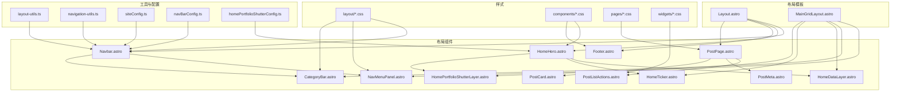
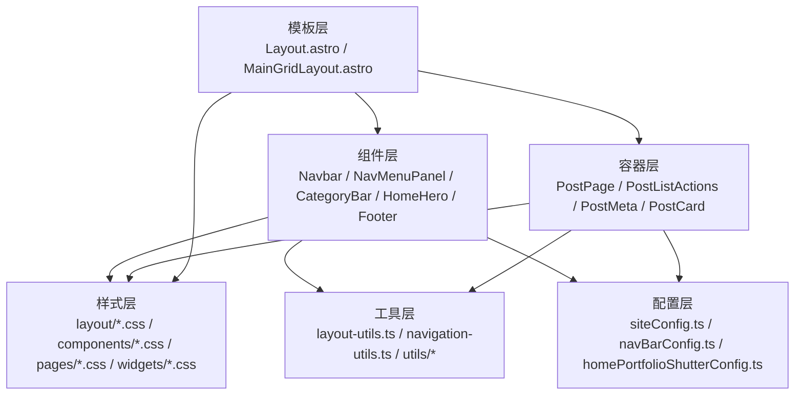
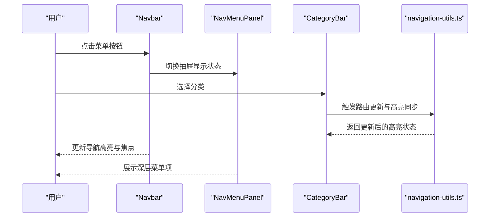
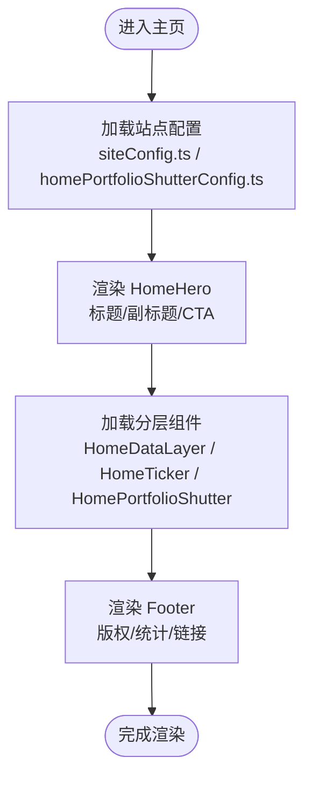
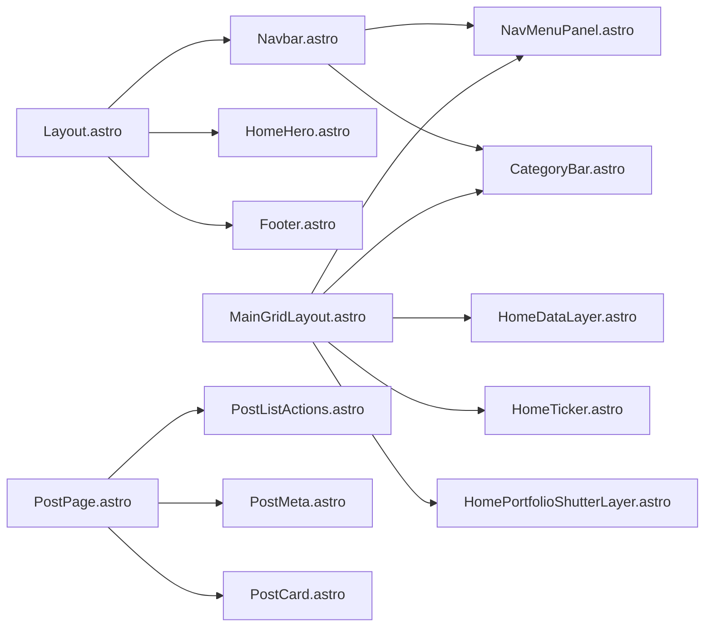

# 布局组件

<cite>
**本文引用的文件**
- [Layout.astro](file://src/layouts/Layout.astro)
- [MainGridLayout.astro](file://src/layouts/MainGridLayout.astro)
- [Navbar.astro](file://src/components/layout/Navbar.astro)
- [NavMenuPanel.astro](file://src/components/layout/NavMenuPanel.astro)
- [CategoryBar.astro](file://src/components/layout/CategoryBar.astro)
- [HomeHero.astro](file://src/components/layout/HomeHero.astro)
- [Footer.astro](file://src/components/layout/Footer.astro)
- [HomeDataLayer.astro](file://src/components/layout/HomeDataLayer.astro)
- [HomeTicker.astro](file://src/components/layout/HomeTicker.astro)
- [HomePortfolioShutterLayer.astro](file://src/components/layout/HomePortfolioShutterLayer.astro)
- [PostPage.astro](file://src/components/layout/PostPage.astro)
- [PostListActions.astro](file://src/components/layout/PostListActions.astro)
- [PostMeta.astro](file://src/components/layout/PostMeta.astro)
- [PostCard.astro](file://src/components/layout/PostCard.astro)
- [grid.css](file://src/styles/layout/grid.css)
- [navbar-new.css](file://src/styles/layout/navbar-new.css)
- [nav-menu-panel.css](file://src/styles/layout/nav-menu-panel.css)
- [category-bar.css](file://src/styles/layout/category-bar.css)
- [home-hero.css](file://src/styles/layout/home-hero.css)
- [dropdown-menu.css](file://src/styles/layout/dropdown-menu.css)
- [layout-styles.css](file://src/styles/layout-styles.css)
- [layout-utils.ts](file://src/utils/layout-utils.ts)
- [navigation-utils.ts](file://src/utils/navigation-utils.ts)
- [siteConfig.ts](file://src/config/siteConfig.ts)
- [navBarConfig.ts](file://src/config/navBarConfig.ts)
- [footerConfig.ts](file://src/config/footerConfig.ts)
- [homePortfolioShutterConfig.ts](file://src/config/homePortfolioShutterConfig.ts)
- [home-data-layer.css](file://src/styles/components/home-data-layer.css)
- [home-ticker.css](file://src/styles/components/home-ticker.css)
- [home-portfolio-shutter.css](file://src/styles/components/home-portfolio-shutter.css)
- [post-page.css](file://src/styles/components/post-page.css)
- [page-loader.css](file://src/styles/components/page-loader.css)
- [page-title.css](file://src/styles/components/page-title.css)
- [pagination.css](file://src/styles/components/pagination.css)
- [typewriter.css](file://src/styles/components/typewriter.css)
- [widget-layout.css](file://src/styles/components/widget-layout.css)
- [music-player.css](file://src/styles/components/music-player.css)
- [floating-button.css](file://src/styles/components/floating-button.css)
- [animated-tabs.css](file://src/styles/components/animated-tabs.css)
- [ai-search.css](file://src/styles/components/ai-search.css)
- [cover-image.css](file://src/styles/components/cover-image.css)
- [button-tag.css](file://src/styles/components/button-tag.css)
- [guestbook-modals.css](file://src/styles/components/guestbook-modals.css)
- [friend-card.css](file://src/styles/components/friend-card.css)
- [calendar.css](file://src/styles/pages/calendar.css)
- [article-list.css](file://src/styles/pages/article-list.css)
- [categories.css](file://src/styles/pages/categories.css)
- [friends.css](file://src/styles/pages/friends.css)
- [gallery.css](file://src/styles/pages/gallery.css)
- [sponsor.css](file://src/styles/pages/sponsor.css)
- [music-visualizer.css](file://src/styles/features/music-visualizer.css)
- [terrarium-model.css](file://src/styles/widgets/terrarium-model.css)
- [advertisement.css](file://src/styles/widgets/advertisement.css)
- [announcement.css](file://src/styles/widgets/announcement.css)
- [archive-heatmap.css](file://src/styles/widgets/archive-heatmap.css)
- [sidebar-toc.css](file://src/styles/widgets/sidebar-toc.css)
- [fancybox-custom.css](file://src/styles/fancybox-custom.css)
- [expressive-code.css](file://src/styles/expressive-code.css)
- [markdown-extend.styl](file://src/styles/markdown-extend.styl)
- [main.css](file://src/styles/main.css)
- [variables.styl](file://src/styles/variables.styl)
- [transition.css](file://src/styles/transition.css)
- [waves.css](file://src/styles/waves.css)
- [custom-scrollbar.css](file://src/styles/custom-scrollbar.css)
- [banner-title.css](file://src/styles/banner-title.css)
- [collections.css](file://src/styles/collections.css)
- [guestbook.css](file://src/styles/guestbook.css)
- [page-loader-controller.js](file://src/utils/page-loader-controller.js)
- [virtual-list-window.js](file://src/utils/virtual-list-window.js)
- [hatch-effect.ts](file://src/utils/hatch-effect.ts)
- [logo-loop.js](file://src/utils/logo-loop.js)
- [home-data-layer.js](file://src/utils/home-data-layer.js)
- [home-portfolio-shutter.js](file://src/utils/home-portfolio-shutter.js)
- [content-utils.ts](file://src/utils/content-utils.ts)
- [date-utils.ts](file://src/utils/date-utils.ts)
- [url-utils.ts](file://src/utils/url-utils.ts)
- [setting-utils.ts](file://src/utils/setting-utils.ts)
- [tag-graph-data.ts](file://src/utils/tag-graph-data.ts)
- [toc-utils.ts](file://src/utils/toc-utils.ts)
- [gallery-utils.ts](file://src/utils/gallery-utils.ts)
- [image-utils.ts](file://src/utils/image-utils.ts)
- [icon-loader.ts](file://src/utils/icon-loader.ts)
- [crypto-utils.ts](file://src/utils/crypto-utils.ts)
- [cache-utils.ts](file://src/utils/cache-utils.ts)
- [draftHelpers.ts](file://src/utils/draftHelpers.ts)
- [editMode.ts](file://src/utils/editMode.ts)
- [lunar-utils.ts](file://src/utils/lunar-utils.ts)
- [calendar-events.ts](file://src/utils/calendar-events.ts)
- [guestbook-api.ts](file://src/utils/guestbook-api.ts)
- [guestbook-cache.ts](file://src/utils/guestbook-cache.ts)
- [guestbook-card-stack.ts](file://src/utils/guestbook-card-stack.ts)
- [navigation-utils.ts](file://src/utils/navigation-utils.ts)
- [page-loader-controller.js](file://src/utils/page-loader-controller.js)
- [virtual-list-window.js](file://src/utils/virtual-list-window.js)
- [hatch-effect.ts](file://src/utils/hatch-effect.ts)
- [logo-loop.js](file://src/utils/logo-loop.js)
- [home-data-layer.js](file://src/utils/home-data-layer.js)
- [home-portfolio-shutter.js](file://src/utils/home-portfolio-shutter.js)
- [content-utils.ts](file://src/utils/content-utils.ts)
- [date-utils.ts](file://src/utils/date-utils.ts)
- [url-utils.ts](file://src/utils/url-utils.ts)
- [setting-utils.ts](file://src/utils/setting-utils.ts)
- [tag-graph-data.ts](file://src/utils/tag-graph-data.ts)
- [toc-utils.ts](file://src/utils/toc-utils.ts)
- [gallery-utils.ts](file://src/utils/gallery-utils.ts)
- [image-utils.ts](file://src/utils/image-utils.ts)
- [icon-loader.ts](file://src/utils/icon-loader.ts)
- [crypto-utils.ts](file://src/utils/crypto-utils.ts)
- [cache-utils.ts](file://src/utils/cache-utils.ts)
- [draftHelpers.ts](file://src/utils/draftHelpers.ts)
- [editMode.ts](file://src/utils/editMode.ts)
- [lunar-utils.ts](file://src/utils/lunar-utils.ts)
- [calendar-events.ts](file://src/utils/calendar-events.ts)
- [guestbook-api.ts](file://src/utils/guestbook-api.ts)
- [guestbook-cache.ts](file://src/utils/guestbook-cache.ts)
- [guestbook-card-stack.ts](file://src/utils/guestbook-card-stack.ts)
- [navigation-utils.ts](file://src/utils/navigation-utils.ts)
</cite>

## 目录
1. [简介](#简介)
2. [项目结构](#项目结构)
3. [核心组件](#核心组件)
4. [架构总览](#架构总览)
5. [详细组件分析](#详细组件分析)
6. [依赖分析](#依赖分析)
7. [性能考虑](#性能考虑)
8. [故障排除指南](#故障排除指南)
9. [结论](#结论)
10. [附录](#附录)

## 简介
本文件系统性梳理博客项目的布局组件体系，重点覆盖主布局、网格布局、页面容器、导航栏、页眉与页脚等核心模块。文档从设计理念、架构模式、组件职责、交互逻辑、状态管理、嵌套关系与数据传递、样式覆盖与自定义扩展、性能优化与 SEO 考量等方面进行深入解析，帮助开发者快速理解并高效扩展布局能力。

## 项目结构
布局相关代码主要分布在以下位置：
- 布局模板层：src/layouts（主布局与网格布局）
- 布局组件层：src/components/layout（导航、页眉、页脚、主页分层组件）
- 页面容器层：src/components/layout 下的 PostPage、PostListActions、PostMeta、PostCard 等
- 样式层：src/styles/layout、src/styles/components、src/styles/pages、src/styles/widgets
- 工具层：src/utils 下的布局与导航相关工具函数
- 配置层：src/config 下的站点配置、导航配置、主页分层配置等

图表来源
- [Layout.astro](file://src/layouts/Layout.astro)
- [MainGridLayout.astro](file://src/layouts/MainGridLayout.astro)
- [Navbar.astro](file://src/components/layout/Navbar.astro)
- [NavMenuPanel.astro](file://src/components/layout/NavMenuPanel.astro)
- [CategoryBar.astro](file://src/components/layout/CategoryBar.astro)
- [HomeHero.astro](file://src/components/layout/HomeHero.astro)
- [Footer.astro](file://src/components/layout/Footer.astro)
- [HomeDataLayer.astro](file://src/components/layout/HomeDataLayer.astro)
- [HomeTicker.astro](file://src/components/layout/HomeTicker.astro)
- [HomePortfolioShutterLayer.astro](file://src/components/layout/HomePortfolioShutterLayer.astro)
- [PostPage.astro](file://src/components/layout/PostPage.astro)
- [PostListActions.astro](file://src/components/layout/PostListActions.astro)
- [PostMeta.astro](file://src/components/layout/PostMeta.astro)
- [PostCard.astro](file://src/components/layout/PostCard.astro)
- [layout-utils.ts](file://src/utils/layout-utils.ts)
- [navigation-utils.ts](file://src/utils/navigation-utils.ts)
- [siteConfig.ts](file://src/config/siteConfig.ts)
- [navBarConfig.ts](file://src/config/navBarConfig.ts)
- [homePortfolioShutterConfig.ts](file://src/config/homePortfolioShutterConfig.ts)

章节来源
- [Layout.astro](file://src/layouts/Layout.astro)
- [MainGridLayout.astro](file://src/layouts/MainGridLayout.astro)

## 核心组件
本节概述布局系统的三大支柱：
- 主布局组件：负责全局骨架、页眉、页脚与主体区域的组织，统一站点风格与导航入口。
- 网格布局组件：基于 CSS Grid 的页面容器，用于文章列表、相册、分类等需要规则化排布的页面。
- 页面容器组件：针对具体页面（如文章详情）的容器，承载文章元信息、操作区与内容区。

关键职责划分：
- 主布局：统一头部与底部、主导航、面包屑、主题切换、搜索、评论等。
- 网格布局：提供可复用的栅格容器与断点适配，减少重复样式与布局计算。
- 页面容器：封装文章页的标题、元信息、目录、分享、推荐等内容区块。

章节来源
- [Layout.astro](file://src/layouts/Layout.astro)
- [MainGridLayout.astro](file://src/layouts/MainGridLayout.astro)
- [PostPage.astro](file://src/components/layout/PostPage.astro)
- [PostListActions.astro](file://src/components/layout/PostListActions.astro)
- [PostMeta.astro](file://src/components/layout/PostMeta.astro)
- [PostCard.astro](file://src/components/layout/PostCard.astro)

## 架构总览
布局系统采用“模板 + 组件 + 容器”的分层架构：
- 模板层（Layout.astro、MainGridLayout.astro）：定义全局骨架与网格容器。
- 组件层（Navbar、NavMenuPanel、CategoryBar、HomeHero、Footer 等）：提供可组合的 UI 片段与交互。
- 容器层（PostPage、PostListActions、PostMeta、PostCard）：承载页面级内容与行为。
- 样式层：通过 CSS Modules 与原子化类名实现主题化与响应式。
- 工具层：提供导航、布局、内容处理等通用能力。
- 配置层：集中管理站点信息、导航菜单、主页分层等配置项。

图表来源
- [Layout.astro](file://src/layouts/Layout.astro)
- [MainGridLayout.astro](file://src/layouts/MainGridLayout.astro)
- [Navbar.astro](file://src/components/layout/Navbar.astro)
- [NavMenuPanel.astro](file://src/components/layout/NavMenuPanel.astro)
- [CategoryBar.astro](file://src/components/layout/CategoryBar.astro)
- [HomeHero.astro](file://src/components/layout/HomeHero.astro)
- [Footer.astro](file://src/components/layout/Footer.astro)
- [PostPage.astro](file://src/components/layout/PostPage.astro)
- [PostListActions.astro](file://src/components/layout/PostListActions.astro)
- [PostMeta.astro](file://src/components/layout/PostMeta.astro)
- [PostCard.astro](file://src/components/layout/PostCard.astro)
- [layout-utils.ts](file://src/utils/layout-utils.ts)
- [navigation-utils.ts](file://src/utils/navigation-utils.ts)
- [siteConfig.ts](file://src/config/siteConfig.ts)
- [navBarConfig.ts](file://src/config/navBarConfig.ts)
- [homePortfolioShutterConfig.ts](file://src/config/homePortfolioShutterConfig.ts)

## 详细组件分析

### 主布局组件（Layout.astro）
- 设计理念：以最小必要元素构建稳定骨架，确保导航、页眉、主体与页脚的一致性与可维护性。
- 关键功能：
  - 包裹全局导航（Navbar）、页眉（HomeHero 或页面特定标题）、主体内容与页脚（Footer）。
  - 提供主题切换、语言切换、搜索入口、评论挂载点等通用能力。
  - 支持页面加载过渡效果与无障碍标签。
- 数据流：接收页面上下文（如标题、描述、URL），注入到页眉与导航组件；通过配置文件控制导航菜单与站点信息。

章节来源
- [Layout.astro](file://src/layouts/Layout.astro)

### 网格布局组件（MainGridLayout.astro）
- 设计理念：提供可复用的网格容器，支持断点下的列数与间距自适应，降低重复布局代码。
- 关键功能：
  - 定义网格轨道与间距，支持内容区、侧边栏、标签云等多列布局。
  - 与 CategoryBar、HomeDataLayer、HomeTicker、HomePortfolioShutterLayer 等组件协同，形成主页分层视图。
- 数据流：接收子组件传入的内容块，按网格规则排列；通过配置控制是否显示侧边栏与分层组件。

章节来源
- [MainGridLayout.astro](file://src/layouts/MainGridLayout.astro)
- [grid.css](file://src/styles/layout/grid.css)

### 页面容器组件（PostPage、PostListActions、PostMeta、PostCard）
- PostPage：文章详情页容器，承载标题、元信息、目录、分享、推荐、评论等。
- PostListActions：文章列表页的操作区（如排序、筛选、分页）。
- PostMeta：文章元信息展示（作者、日期、分类、标签、阅读时长等）。
- PostCard：文章卡片，用于列表或网格中的缩略展示。
- 数据流：从内容层获取文章元数据与正文片段，渲染为可点击的卡片或详情页。

章节来源
- [PostPage.astro](file://src/components/layout/PostPage.astro)
- [PostListActions.astro](file://src/components/layout/PostListActions.astro)
- [PostMeta.astro](file://src/components/layout/PostMeta.astro)
- [PostCard.astro](file://src/components/layout/PostCard.astro)
- [post-page.css](file://src/styles/components/post-page.css)
- [page-title.css](file://src/styles/components/page-title.css)
- [pagination.css](file://src/styles/components/pagination.css)

### 导航栏组件（Navbar、NavMenuPanel、CategoryBar）
- Navbar：主导航条，包含站点标识、主导航菜单、搜索、主题切换、用户入口等。
- NavMenuPanel：侧边/抽屉式菜单面板，承载分类、归档、友链等深层导航。
- CategoryBar：分类标签栏，用于文章列表页的分类筛选与快速跳转。
- 交互逻辑与状态管理：
  - 使用工具函数处理移动端菜单开关、滚动吸附、焦点管理与键盘导航。
  - 通过配置文件控制菜单项、图标与文案；支持国际化。
  - 在页面切换后保持导航高亮与面包屑一致性。
- 数据传递机制：
  - 从配置层读取导航树与站点信息，向 Navbar 注入菜单数据。
  - CategoryBar 接收当前分类参数，驱动筛选与高亮。
  - NavMenuPanel 作为独立面板，通过事件或状态回调与 Navbar 解耦。

图表来源
- [Navbar.astro](file://src/components/layout/Navbar.astro)
- [NavMenuPanel.astro](file://src/components/layout/NavMenuPanel.astro)
- [CategoryBar.astro](file://src/components/layout/CategoryBar.astro)
- [navigation-utils.ts](file://src/utils/navigation-utils.ts)

章节来源
- [Navbar.astro](file://src/components/layout/Navbar.astro)
- [NavMenuPanel.astro](file://src/components/layout/NavMenuPanel.astro)
- [CategoryBar.astro](file://src/components/layout/CategoryBar.astro)
- [navbar-new.css](file://src/styles/layout/navbar-new.css)
- [nav-menu-panel.css](file://src/styles/layout/nav-menu-panel.css)
- [category-bar.css](file://src/styles/layout/category-bar.css)
- [dropdown-menu.css](file://src/styles/layout/dropdown-menu.css)
- [layout-styles.css](file://src/styles/layout-styles.css)
- [navigation-utils.ts](file://src/utils/navigation-utils.ts)
- [navBarConfig.ts](file://src/config/navBarConfig.ts)

### 页眉与页脚组件（HomeHero、Footer）
- HomeHero：主页头部视觉层，包含标题、副标题、CTA、动态分层组件（DataLayer、Ticker、PortfolioShutter）。
- Footer：站点页脚，包含版权、统计、社交链接、快速导航等。
- 响应式设计与动态渲染：
  - 通过 CSS Grid 与 Flex 混合布局实现响应式断点。
  - 分层组件按需加载，避免首屏阻塞。
  - 支持主题切换下的颜色与对比度调整。
- 数据流：从配置层读取站点信息、公告、统计等，动态渲染到页眉与页脚。

图表来源
- [HomeHero.astro](file://src/components/layout/HomeHero.astro)
- [Footer.astro](file://src/components/layout/Footer.astro)
- [HomeDataLayer.astro](file://src/components/layout/HomeDataLayer.astro)
- [HomeTicker.astro](file://src/components/layout/HomeTicker.astro)
- [HomePortfolioShutterLayer.astro](file://src/components/layout/HomePortfolioShutterLayer.astro)
- [siteConfig.ts](file://src/config/siteConfig.ts)
- [homePortfolioShutterConfig.ts](file://src/config/homePortfolioShutterConfig.ts)
- [home-hero.css](file://src/styles/layout/home-hero.css)
- [home-data-layer.css](file://src/styles/components/home-data-layer.css)
- [home-ticker.css](file://src/styles/components/home-ticker.css)
- [home-portfolio-shutter.css](file://src/styles/components/home-portfolio-shutter.css)

章节来源
- [HomeHero.astro](file://src/components/layout/HomeHero.astro)
- [Footer.astro](file://src/components/layout/Footer.astro)
- [HomeDataLayer.astro](file://src/components/layout/HomeDataLayer.astro)
- [HomeTicker.astro](file://src/components/layout/HomeTicker.astro)
- [HomePortfolioShutterLayer.astro](file://src/components/layout/HomePortfolioShutterLayer.astro)
- [siteConfig.ts](file://src/config/siteConfig.ts)
- [homePortfolioShutterConfig.ts](file://src/config/homePortfolioShutterConfig.ts)

### 布局嵌套关系与数据传递
- 嵌套关系：
  - Layout.astro 作为根容器，内含 Navbar、HomeHero、Footer 与主体内容。
  - MainGridLayout.astro 作为网格容器，内含 NavMenuPanel、CategoryBar 与主页分层组件。
  - PostPage 容器内含 PostListActions、PostMeta、PostCard 等。
- 数据传递：
  - 通过 props 与 slots 传递页面上下文与内容块。
  - 通过配置文件与工具函数共享状态（如主题、语言、导航树）。
  - 通过事件与回调实现组件间解耦通信。

章节来源
- [Layout.astro](file://src/layouts/Layout.astro)
- [MainGridLayout.astro](file://src/layouts/MainGridLayout.astro)
- [PostPage.astro](file://src/components/layout/PostPage.astro)
- [navBarConfig.ts](file://src/config/navBarConfig.ts)
- [layout-utils.ts](file://src/utils/layout-utils.ts)

## 依赖分析
- 组件耦合：
  - Navbar 与 NavMenuPanel、CategoryBar 存在交互耦合，但通过配置与工具函数降低紧耦合。
  - 主页分层组件（HomeDataLayer、HomeTicker、HomePortfolioShutter）与 HomeHero 松耦合，按需加载。
  - 页面容器组件与内容层通过类型与接口解耦。
- 外部依赖：
  - 样式依赖于 CSS Modules 与原子化类名，便于主题化与覆盖。
  - 工具函数提供导航、布局、内容处理等通用能力，减少重复代码。
- 潜在循环依赖：
  - 通过单向数据流与事件驱动避免循环依赖风险。

图表来源
- [Layout.astro](file://src/layouts/Layout.astro)
- [MainGridLayout.astro](file://src/layouts/MainGridLayout.astro)
- [Navbar.astro](file://src/components/layout/Navbar.astro)
- [NavMenuPanel.astro](file://src/components/layout/NavMenuPanel.astro)
- [CategoryBar.astro](file://src/components/layout/CategoryBar.astro)
- [HomeHero.astro](file://src/components/layout/HomeHero.astro)
- [Footer.astro](file://src/components/layout/Footer.astro)
- [HomeDataLayer.astro](file://src/components/layout/HomeDataLayer.astro)
- [HomeTicker.astro](file://src/components/layout/HomeTicker.astro)
- [HomePortfolioShutterLayer.astro](file://src/components/layout/HomePortfolioShutterLayer.astro)
- [PostPage.astro](file://src/components/layout/PostPage.astro)
- [PostListActions.astro](file://src/components/layout/PostListActions.astro)
- [PostMeta.astro](file://src/components/layout/PostMeta.astro)
- [PostCard.astro](file://src/components/layout/PostCard.astro)

章节来源
- [layout-utils.ts](file://src/utils/layout-utils.ts)
- [navigation-utils.ts](file://src/utils/navigation-utils.ts)
- [navBarConfig.ts](file://src/config/navBarConfig.ts)
- [siteConfig.ts](file://src/config/siteConfig.ts)

## 性能考虑
- 渲染性能：
  - 使用虚拟列表与窗口化技术处理长列表（如文章列表、相册）。
  - 分层组件按需加载，避免首屏阻塞。
  - 图片懒加载与响应式尺寸计算，减少带宽与内存占用。
- 交互性能：
  - 导航与菜单使用轻量事件监听，避免高频重绘。
  - 页面过渡使用 CSS 动画与硬件加速属性。
- 缓存与预取：
  - 内容缓存与索引预热，提升二次访问速度。
  - 关键资源预加载与 DNS 预解析。
- SEO 优化：
  - 结构化数据与 Open Graph 标签生成。
  - 语义化 HTML 与可访问性标签。
  - 动态标题与描述随页面变化而更新。

章节来源
- [virtual-list-window.js](file://src/utils/virtual-list-window.js)
- [page-loader-controller.js](file://src/utils/page-loader-controller.js)
- [page-loader.css](file://src/styles/components/page-loader.css)
- [image-utils.ts](file://src/utils/image-utils.ts)
- [gallery-utils.ts](file://src/utils/gallery-utils.ts)
- [content-utils.ts](file://src/utils/content-utils.ts)
- [seo-related utilities](file://src/utils/navigation-utils.ts)

## 故障排除指南
- 导航异常：
  - 检查导航配置是否正确加载，确认菜单项与路由映射一致。
  - 使用导航工具函数验证高亮与焦点状态。
- 样式冲突：
  - 使用原子化类名与 CSS Modules 避免全局污染。
  - 通过覆盖层样式定位问题，逐步缩小范围。
- 性能问题：
  - 检查长列表是否启用虚拟化。
  - 确认图片与资源是否懒加载与压缩。
- 主题切换无效：
  - 核对主题变量与 CSS 自定义属性是否生效。
  - 检查主题切换事件是否正确触发。

章节来源
- [navigation-utils.ts](file://src/utils/navigation-utils.ts)
- [layout-utils.ts](file://src/utils/layout-utils.ts)
- [layout-styles.css](file://src/styles/layout-styles.css)
- [main.css](file://src/styles/main.css)

## 结论
该布局系统通过清晰的分层设计与可插拔组件，实现了高可维护性与强扩展性的前端骨架。主布局、网格布局与页面容器各司其职，配合导航、页眉与页脚组件，形成完整的用户体验闭环。借助工具层与配置层的支持，系统在性能与 SEO 方面也具备良好基础。建议在扩展新功能时遵循现有分层与数据流模式，确保一致的开发体验与运行效率。

## 附录
- 自定义扩展方法：
  - 新增导航项：在导航配置中添加菜单项，组件自动渲染。
  - 新增主页分层：在主页配置中注册新的分层组件，按需加载。
  - 新增页面容器：参考 PostPage 的结构，封装页面级内容与操作。
- 样式覆盖技巧：
  - 使用 CSS Modules 与原子化类名，优先使用覆盖层样式而非全局样式。
  - 通过主题变量与媒体查询实现响应式与主题化。
- SEO 优化要点：
  - 动态设置页面标题、描述与 Open Graph 图片。
  - 语义化标签与结构化数据，提升搜索引擎友好度。