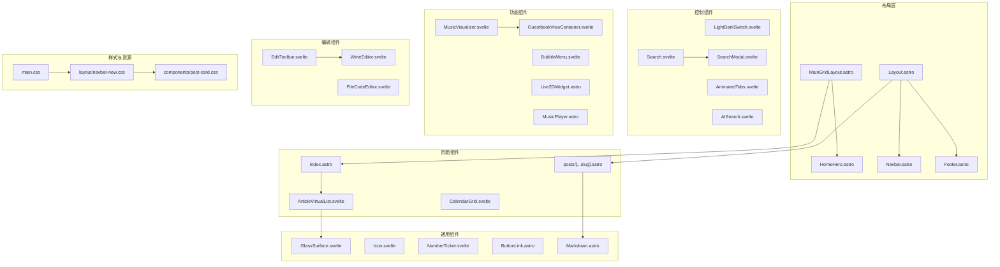
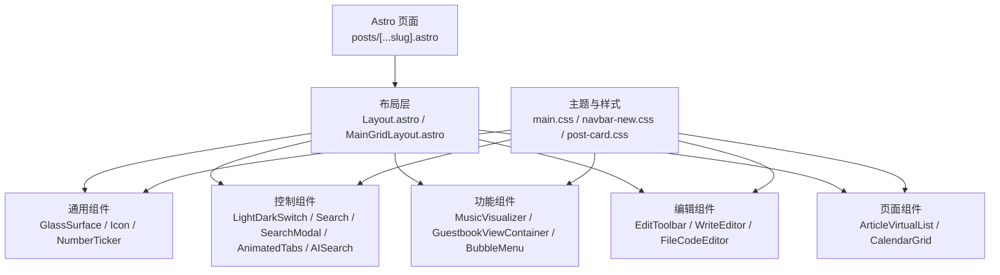
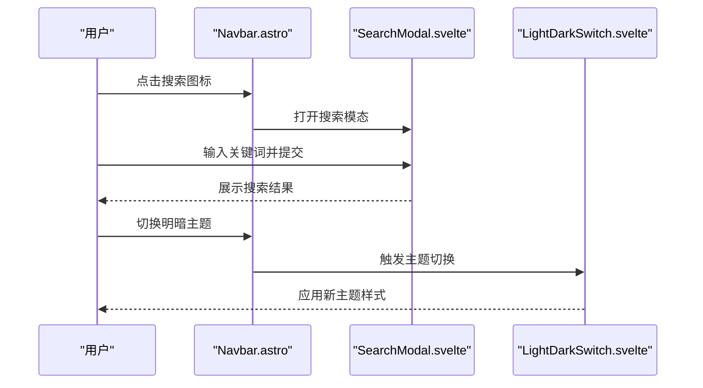
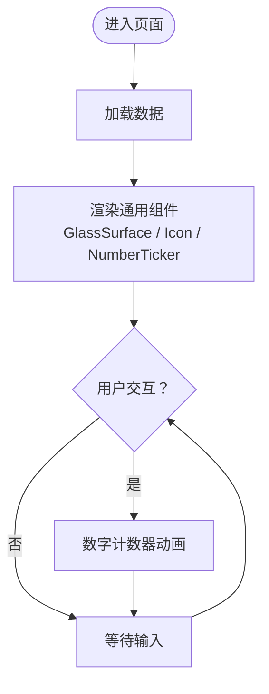
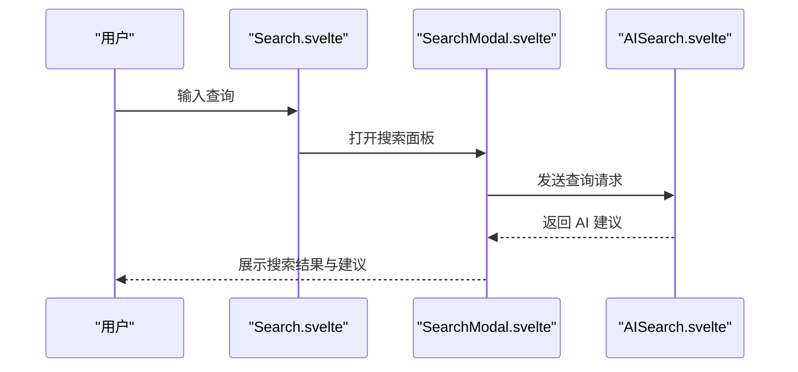
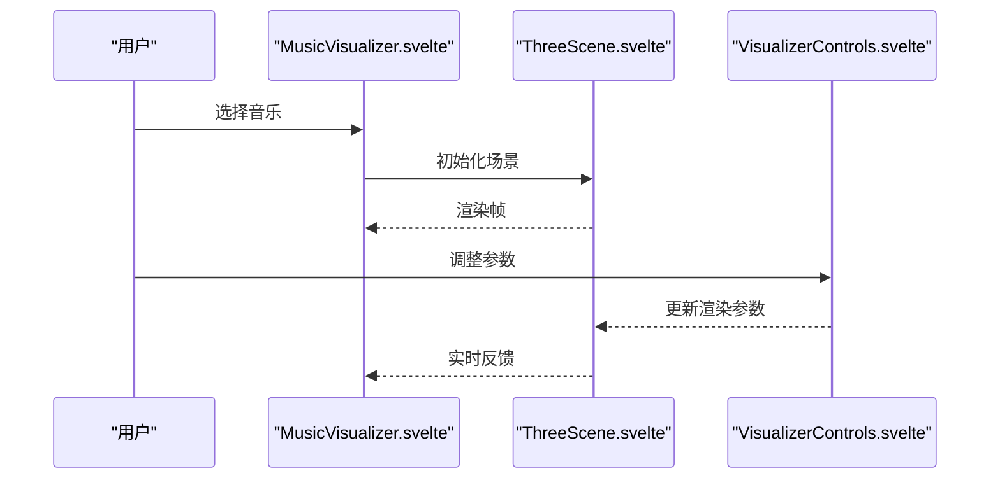
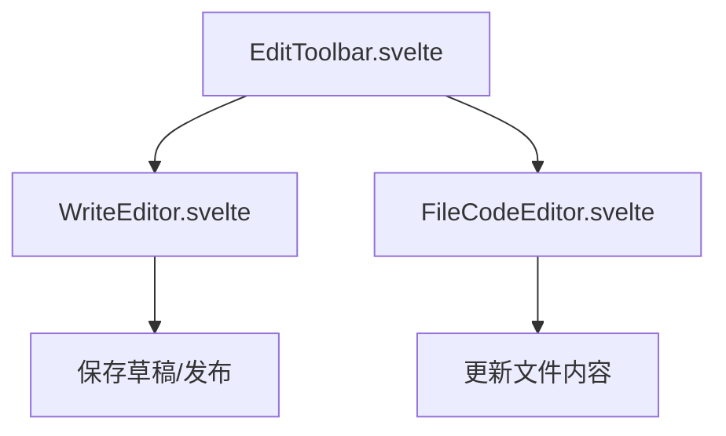
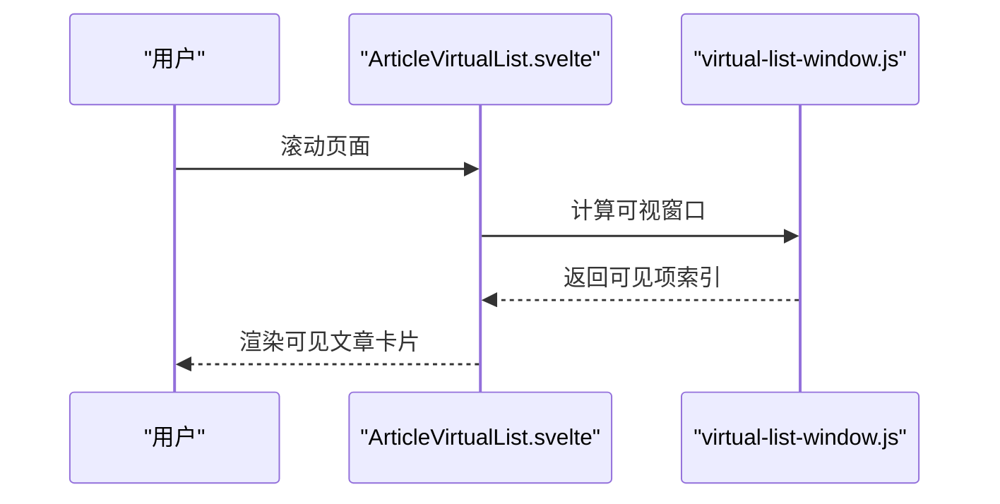
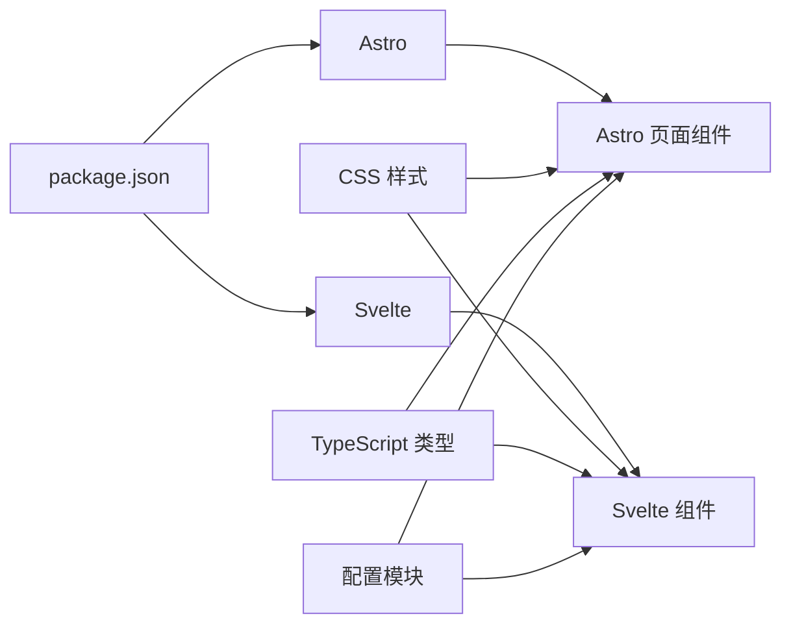

# 组件系统

<cite>
**本文引用的文件**
- [package.json](file://package.json)
- [astro.config.mjs](file://astro.config.mjs)
- [svelte.config.js](file://svelte.config.js)
- [src/components/common/GlassSurface.svelte](file://src/components/common/GlassSurface.svelte)
- [src/components/common/Icon.svelte](file://src/components/common/Icon.svelte)
- [src/components/common/NumberTicker.svelte](file://src/components/common/NumberTicker.svelte)
- [src/components/controls/LightDarkSwitch.svelte](file://src/components/controls/LightDarkSwitch.svelte)
- [src/components/controls/Search.svelte](file://src/components/controls/Search.svelte)
- [src/components/controls/SearchModal.svelte](file://src/components/controls/SearchModal.svelte)
- [src/components/controls/AnimatedTabs.svelte](file://src/components/controls/AnimatedTabs.svelte)
- [src/components/controls/AISearch.svelte](file://src/components/controls/AISearch.svelte)
- [src/components/edit/EditToolbar.svelte](file://src/components/edit/EditToolbar.svelte)
- [src/components/edit/WriteEditor.svelte](file://src/components/edit/WriteEditor.svelte)
- [src/components/features/music-visualizer/MusicVisualizer.svelte](file://src/components/features/music-visualizer/MusicVisualizer.svelte)
- [src/components/features/music-visualizer/ThreeScene.svelte](file://src/components/features/music-visualizer/ThreeScene.svelte)
- [src/components/features/music-visualizer/VisualizerControls.svelte](file://src/components/features/music-visualizer/VisualizerControls.svelte)
- [src/components/features/BubbleMenu.svelte](file://src/components/features/BubbleMenu.svelte)
- [src/components/features/GuestbookViewContainer.svelte](file://src/components/features/GuestbookViewContainer.svelte)
- [src/components/features/GuestbookVirtualList.svelte](file://src/components/features/GuestbookVirtualList.svelte)
- [src/components/layout/HomeHero.astro](file://src/components/layout/HomeHero.astro)
- [src/components/layout/Navbar.astro](file://src/components/layout/Navbar.astro)
- [src/components/layout/Footer.astro](file://src/components/layout/Footer.astro)
- [src/components/pages/ArticleVirtualList.svelte](file://src/components/pages/ArticleVirtualList.svelte)
- [src/components/pages/calendar/CalendarGrid.svelte](file://src/components/pages/calendar/CalendarGrid.svelte)
- [src/components/pages/gallery/NetworkAlbum.svelte](file://src/components/pages/gallery/NetworkAlbum.svelte)
- [src/components/pages/bangumi/BangumiSection.astro](file://src/components/pages/bangumi/BangumiSection.astro)
- [src/components/widget/Calendar.astro](file://src/components/widget/Calendar.astro)
- [src/components/comment/index.astro](file://src/components/comment/index.astro)
- [src/components/analytics/GoogleAnalytics.astro](file://src/components/analytics/GoogleAnalytics.astro)
- [src/components/misc/SharePoster.svelte](file://src/components/misc/SharePoster.svelte)
- [src/layouts/Layout.astro](file://src/layouts/Layout.astro)
- [src/layouts/MainGridLayout.astro](file://src/layouts/MainGridLayout.astro)
- [src/pages/posts/[...slug].astro](file://src/pages/posts/[...slug].astro)
- [src/pages/index.astro](file://src/pages/index.astro)
- [src/utils/virtual-list-window.js](file://src/utils/virtual-list-window.js)
- [src/utils/home-portfolio-shutter.js](file://src/utils/home-portfolio-shutter.js)
- [src/utils/logo-loop.js](file://src/utils/logo-loop.js)
- [src/utils/page-loader-controller.js](file://src/utils/page-loader-controller.js)
- [src/styles/main.css](file://src/styles/main.css)
- [src/styles/layout/navbar-new.css](file://src/styles/layout/navbar-new.css)
- [src/styles/layout/category-bar.css](file://src/styles/layout/category-bar.css)
- [src/styles/components/post-card.css](file://src/styles/components/post-card.css)
- [src/styles/components/floating-button.css](file://src/styles/components/floating-button.css)
- [src/styles/components/music-player.css](file://src/styles/components/music-player.css)
- [src/styles/components/guestbook-modals.css](file://src/styles/components/guestbook-modals.css)
- [src/types/config.ts](file://src/types/config.ts)
- [src/types/post.ts](file://src/types/post.ts)
- [src/types/bangumi.ts](file://src/types/bangumi.ts)
- [src/types/guestbook.ts](file://src/types/guestbook.ts)
- [src/config/index.ts](file://src/config/index.ts)
- [src/config/siteConfig.ts](file://src/config/siteConfig.ts)
- [src/config/navBarConfig.ts](file://src/config/navBarConfig.ts)
- [src/config/musicConfig.ts](file://src/config/musicConfig.ts)
- [src/config/pioConfig.ts](file://src/config/pioConfig.ts)
- [src/config/editConfig.ts](file://src/config/editConfig.ts)
- [src/config/calendarConfig.ts](file://src/config/calendarConfig.ts)
- [src/config/coverImageConfig.ts](file://src/config/coverImageConfig.ts)
- [src/constants/constants.ts](file://src/constants/constants.ts)
- [src/constants/icons.ts](file://src/constants/icons.ts)
- [src/i18n/translation.ts](file://src/i18n/translation.ts)
- [src/i18n/languages/en.ts](file://src/i18n/languages/en.ts)
- [src/i18n/languages/zh_CN.ts](file://src/i18n/languages/zh_CN.ts)
- [src/plugins/remark-mermaid.js](file://src/plugins/remark-mermaid.js)
- [src/plugins/rehype-mermaid.mjs](file://src/plugins/rehype-mermaid.mjs)
- [src/workers/guestbook.js](file://src/workers/guestbook.js)
- [src/workers/ai-chat.js](file://src/workers/ai-chat.js)
</cite>

## 目录
1. [简介](#简介)
2. [项目结构](#项目结构)
3. [核心组件](#核心组件)
4. [架构总览](#架构总览)
5. [详细组件分析](#详细组件分析)
6. [依赖分析](#依赖分析)
7. [性能考量](#性能考量)
8. [故障排查指南](#故障排查指南)
9. [结论](#结论)
10. [附录](#附录)

## 简介
本文件系统性梳理 Firefly-Mod 的组件体系，围绕 Astro + Svelte 的混合架构展开，重点覆盖以下方面：
- 分层结构：布局组件、通用组件、功能组件、编辑组件、页面组件的职责划分与协作关系
- Svelte 5 Runes 响应式系统在组件中的应用：状态管理、事件处理、生命周期钩子
- 组件开发最佳实践：Props 传递、事件冒泡、组件组合与复用策略
- 样式系统、动画效果与交互设计
- 组件间通信机制与数据流设计
- 组件测试、性能优化与可访问性
- 开发工具链与调试技巧

## 项目结构
该站点采用 Astro 作为页面与内容渲染引擎，结合 Svelte 组件实现交互与动态行为；样式通过 CSS Modules 与全局样式组织；类型定义与配置集中于 src/config、src/types 与 src/constants。

图表来源
- [src/layouts/Layout.astro](file://src/layouts/Layout.astro)
- [src/layouts/MainGridLayout.astro](file://src/layouts/MainGridLayout.astro)
- [src/components/layout/HomeHero.astro](file://src/components/layout/HomeHero.astro)
- [src/components/layout/Navbar.astro](file://src/components/layout/Navbar.astro)
- [src/components/layout/Footer.astro](file://src/components/layout/Footer.astro)
- [src/components/common/GlassSurface.svelte](file://src/components/common/GlassSurface.svelte)
- [src/components/common/Icon.svelte](file://src/components/common/Icon.svelte)
- [src/components/common/NumberTicker.svelte](file://src/components/common/NumberTicker.svelte)
- [src/components/controls/LightDarkSwitch.svelte](file://src/components/controls/LightDarkSwitch.svelte)
- [src/components/controls/Search.svelte](file://src/components/controls/Search.svelte)
- [src/components/controls/SearchModal.svelte](file://src/components/controls/SearchModal.svelte)
- [src/components/controls/AnimatedTabs.svelte](file://src/components/controls/AnimatedTabs.svelte)
- [src/components/controls/AISearch.svelte](file://src/components/controls/AISearch.svelte)
- [src/components/features/music-visualizer/MusicVisualizer.svelte](file://src/components/features/music-visualizer/MusicVisualizer.svelte)
- [src/components/features/GuestbookViewContainer.svelte](file://src/components/features/GuestbookViewContainer.svelte)
- [src/components/edit/EditToolbar.svelte](file://src/components/edit/EditToolbar.svelte)
- [src/components/edit/WriteEditor.svelte](file://src/components/edit/WriteEditor.svelte)
- [src/components/pages/ArticleVirtualList.svelte](file://src/components/pages/ArticleVirtualList.svelte)
- [src/components/pages/calendar/CalendarGrid.svelte](file://src/components/pages/calendar/CalendarGrid.svelte)
- [src/styles/main.css](file://src/styles/main.css)
- [src/styles/layout/navbar-new.css](file://src/styles/layout/navbar-new.css)
- [src/styles/components/post-card.css](file://src/styles/components/post-card.css)

章节来源
- [astro.config.mjs](file://astro.config.mjs)
- [svelte.config.js](file://svelte.config.js)
- [package.json](file://package.json)

## 核心组件
- 布局组件：负责页面骨架与导航，如导航栏、页脚、主页英雄区等，统一站点视觉与交互基线
- 通用组件：可复用的基础 UI 元素，如图标、玻璃拟态容器、数字计数器、分页、Markdown 渲染器等
- 控制组件：用户交互入口与面板，如主题切换、搜索框与模态、标签页、AI 搜索等
- 功能组件：承载特定业务能力，如音乐可视化、访客簿视图、气泡菜单、Live2D 小部件等
- 编辑组件：面向作者的创作与管理工具，如编辑工具栏、写作编辑器、文件代码编辑器等
- 页面组件：具体页面的数据列表、网格、卡片等，如文章虚拟列表、日历网格等

章节来源
- [src/components/layout/Navbar.astro](file://src/components/layout/Navbar.astro)
- [src/components/layout/Footer.astro](file://src/components/layout/Footer.astro)
- [src/components/common/GlassSurface.svelte](file://src/components/common/GlassSurface.svelte)
- [src/components/common/Icon.svelte](file://src/components/common/Icon.svelte)
- [src/components/common/NumberTicker.svelte](file://src/components/common/NumberTicker.svelte)
- [src/components/controls/LightDarkSwitch.svelte](file://src/components/controls/LightDarkSwitch.svelte)
- [src/components/controls/Search.svelte](file://src/components/controls/Search.svelte)
- [src/components/controls/SearchModal.svelte](file://src/components/controls/SearchModal.svelte)
- [src/components/controls/AnimatedTabs.svelte](file://src/components/controls/AnimatedTabs.svelte)
- [src/components/controls/AISearch.svelte](file://src/components/controls/AISearch.svelte)
- [src/components/features/music-visualizer/MusicVisualizer.svelte](file://src/components/features/music-visualizer/MusicVisualizer.svelte)
- [src/components/features/GuestbookViewContainer.svelte](file://src/components/features/GuestbookViewContainer.svelte)
- [src/components/features/BubbleMenu.svelte](file://src/components/features/BubbleMenu.svelte)
- [src/components/edit/EditToolbar.svelte](file://src/components/edit/EditToolbar.svelte)
- [src/components/edit/WriteEditor.svelte](file://src/components/edit/WriteEditor.svelte)
- [src/components/pages/ArticleVirtualList.svelte](file://src/components/pages/ArticleVirtualList.svelte)
- [src/components/pages/calendar/CalendarGrid.svelte](file://src/components/pages/calendar/CalendarGrid.svelte)

## 架构总览
整体采用“页面（Astro）+ 交互（Svelte）”的混合模式：
- 页面与路由由 Astro 提供，内容通过 Astro 组件与 Markdown/MDX 渲染
- 交互与动态行为由 Svelte 组件承担，利用 Runes 实现响应式状态与高效更新
- 样式与主题通过 CSS 与变量系统统一管理，支持明暗主题切换
- 数据与配置通过 TypeScript 类型与配置模块集中管理，确保一致性与可维护性

图表来源
- [src/pages/posts/[...slug].astro](file://src/pages/posts/[...slug].astro)
- [src/layouts/Layout.astro](file://src/layouts/Layout.astro)
- [src/layouts/MainGridLayout.astro](file://src/layouts/MainGridLayout.astro)
- [src/components/common/GlassSurface.svelte](file://src/components/common/GlassSurface.svelte)
- [src/components/common/Icon.svelte](file://src/components/common/Icon.svelte)
- [src/components/common/NumberTicker.svelte](file://src/components/common/NumberTicker.svelte)
- [src/components/controls/LightDarkSwitch.svelte](file://src/components/controls/LightDarkSwitch.svelte)
- [src/components/controls/Search.svelte](file://src/components/controls/Search.svelte)
- [src/components/controls/SearchModal.svelte](file://src/components/controls/SearchModal.svelte)
- [src/components/controls/AnimatedTabs.svelte](file://src/components/controls/AnimatedTabs.svelte)
- [src/components/controls/AISearch.svelte](file://src/components/controls/AISearch.svelte)
- [src/components/features/music-visualizer/MusicVisualizer.svelte](file://src/components/features/music-visualizer/MusicVisualizer.svelte)
- [src/components/features/GuestbookViewContainer.svelte](file://src/components/features/GuestbookViewContainer.svelte)
- [src/components/edit/EditToolbar.svelte](file://src/components/edit/EditToolbar.svelte)
- [src/components/edit/WriteEditor.svelte](file://src/components/edit/WriteEditor.svelte)
- [src/components/pages/ArticleVirtualList.svelte](file://src/components/pages/ArticleVirtualList.svelte)
- [src/components/pages/calendar/CalendarGrid.svelte](file://src/components/pages/calendar/CalendarGrid.svelte)
- [src/styles/main.css](file://src/styles/main.css)
- [src/styles/layout/navbar-new.css](file://src/styles/layout/navbar-new.css)
- [src/styles/components/post-card.css](file://src/styles/components/post-card.css)

## 详细组件分析

### 布局组件
- 导航栏（Navbar.astro）：承载主导航、搜索入口、主题切换等，是用户进入站点的主要通道
- 页脚（Footer.astro）：版权、社交链接、站点信息等
- 主页英雄区（HomeHero.astro）：首页焦点展示区域，通常包含标题、副标题与行动按钮
- 主布局（Layout.astro / MainGridLayout.astro）：统一页面骨架，协调侧边栏、主内容区与页脚

图表来源
- [src/components/layout/Navbar.astro](file://src/components/layout/Navbar.astro)
- [src/components/controls/SearchModal.svelte](file://src/components/controls/SearchModal.svelte)
- [src/components/controls/LightDarkSwitch.svelte](file://src/components/controls/LightDarkSwitch.svelte)

章节来源
- [src/components/layout/Navbar.astro](file://src/components/layout/Navbar.astro)
- [src/components/layout/Footer.astro](file://src/components/layout/Footer.astro)
- [src/components/layout/HomeHero.astro](file://src/components/layout/HomeHero.astro)
- [src/layouts/Layout.astro](file://src/layouts/Layout.astro)
- [src/layouts/MainGridLayout.astro](file://src/layouts/MainGridLayout.astro)

### 通用组件
- 玻璃拟态容器（GlassSurface.svelte）：用于卡片、浮层背景，提升层次感
- 图标（Icon.svelte）：统一图标渲染，支持尺寸、颜色、语义化属性
- 数字计数器（NumberTicker.svelte）：数值动画过渡，常用于统计数据展示
- Markdown 渲染（Markdown.astro）：对内容进行 Markdown 解析与安全处理
- 分页（ClientPagination.astro / Pagination.astro）：客户端分页与服务端分页组件

图表来源
- [src/components/common/GlassSurface.svelte](file://src/components/common/GlassSurface.svelte)
- [src/components/common/Icon.svelte](file://src/components/common/Icon.svelte)
- [src/components/common/NumberTicker.svelte](file://src/components/common/NumberTicker.svelte)
- [src/components/common/Markdown.astro](file://src/components/common/Markdown.astro)

章节来源
- [src/components/common/GlassSurface.svelte](file://src/components/common/GlassSurface.svelte)
- [src/components/common/Icon.svelte](file://src/components/common/Icon.svelte)
- [src/components/common/NumberTicker.svelte](file://src/components/common/NumberTicker.svelte)
- [src/components/common/Markdown.astro](file://src/components/common/Markdown.astro)

### 控制组件
- 主题切换（LightDarkSwitch.svelte）：切换明暗主题，持久化到本地存储或上下文
- 搜索（Search.svelte / SearchModal.svelte）：提供搜索输入与结果展示，支持快捷键与无障碍
- 标签页（AnimatedTabs.svelte）：带过渡动画的选项卡，提升切换体验
- AI 搜索（AISearch.svelte）：集成外部 AI 能力，提供智能检索建议

图表来源
- [src/components/controls/Search.svelte](file://src/components/controls/Search.svelte)
- [src/components/controls/SearchModal.svelte](file://src/components/controls/SearchModal.svelte)
- [src/components/controls/AISearch.svelte](file://src/components/controls/AISearch.svelte)

章节来源
- [src/components/controls/LightDarkSwitch.svelte](file://src/components/controls/LightDarkSwitch.svelte)
- [src/components/controls/Search.svelte](file://src/components/controls/Search.svelte)
- [src/components/controls/SearchModal.svelte](file://src/components/controls/SearchModal.svelte)
- [src/components/controls/AnimatedTabs.svelte](file://src/components/controls/AnimatedTabs.svelte)
- [src/components/controls/AISearch.svelte](file://src/components/controls/AISearch.svelte)

### 功能组件
- 音乐可视化（MusicVisualizer.svelte / ThreeScene.svelte / VisualizerControls.svelte）：音频驱动的可视化场景与控制面板
- 访客簿视图（GuestbookViewContainer.svelte / GuestbookVirtualList.svelte）：访客簿列表与虚拟滚动
- 气泡菜单（BubbleMenu.svelte）：上下文相关的操作菜单
- Live2D 小部件（Live2DWidget.astro）：Live2D 模型交互展示

图表来源
- [src/components/features/music-visualizer/MusicVisualizer.svelte](file://src/components/features/music-visualizer/MusicVisualizer.svelte)
- [src/components/features/music-visualizer/ThreeScene.svelte](file://src/components/features/music-visualizer/ThreeScene.svelte)
- [src/components/features/music-visualizer/VisualizerControls.svelte](file://src/components/features/music-visualizer/VisualizerControls.svelte)

章节来源
- [src/components/features/music-visualizer/MusicVisualizer.svelte](file://src/components/features/music-visualizer/MusicVisualizer.svelte)
- [src/components/features/music-visualizer/ThreeScene.svelte](file://src/components/features/music-visualizer/ThreeScene.svelte)
- [src/components/features/music-visualizer/VisualizerControls.svelte](file://src/components/features/music-visualizer/VisualizerControls.svelte)
- [src/components/features/GuestbookViewContainer.svelte](file://src/components/features/GuestbookViewContainer.svelte)
- [src/components/features/GuestbookVirtualList.svelte](file://src/components/features/GuestbookVirtualList.svelte)
- [src/components/features/BubbleMenu.svelte](file://src/components/features/BubbleMenu.svelte)

### 编辑组件
- 编辑工具栏（EditToolbar.svelte）：提供常用编辑操作入口
- 写作编辑器（WriteEditor.svelte）：Markdown 编辑与预览
- 文件代码编辑器（FileCodeEditor.svelte）：文件内容编辑与保存

图表来源
- [src/components/edit/EditToolbar.svelte](file://src/components/edit/EditToolbar.svelte)
- [src/components/edit/WriteEditor.svelte](file://src/components/edit/WriteEditor.svelte)
- [src/components/edit/FileCodeEditor.svelte](file://src/components/edit/FileCodeEditor.svelte)

章节来源
- [src/components/edit/EditToolbar.svelte](file://src/components/edit/EditToolbar.svelte)
- [src/components/edit/WriteEditor.svelte](file://src/components/edit/WriteEditor.svelte)
- [src/components/edit/FileCodeEditor.svelte](file://src/components/edit/FileCodeEditor.svelte)

### 页面组件
- 文章虚拟列表（ArticleVirtualList.svelte）：大数据量文章列表的高性能渲染
- 日历网格（CalendarGrid.svelte）：日程与事件的网格展示
- Bangumi 页面（BangumiSection.astro）：番组页面的分区展示
- 网络相册（NetworkAlbum.svelte）：网络相册的图片浏览与管理

图表来源
- [src/components/pages/ArticleVirtualList.svelte](file://src/components/pages/ArticleVirtualList.svelte)
- [src/utils/virtual-list-window.js](file://src/utils/virtual-list-window.js)

章节来源
- [src/components/pages/ArticleVirtualList.svelte](file://src/components/pages/ArticleVirtualList.svelte)
- [src/components/pages/calendar/CalendarGrid.svelte](file://src/components/pages/calendar/CalendarGrid.svelte)
- [src/components/pages/bangumi/BangumiSection.astro](file://src/components/pages/bangumi/BangumiSection.astro)
- [src/components/pages/gallery/NetworkAlbum.svelte](file://src/components/pages/gallery/NetworkAlbum.svelte)

## 依赖分析
- 构建与运行时依赖：Astro 提供页面与内容渲染，Svelte 提供交互与状态管理
- 样式依赖：全局样式与组件局部样式协同，主题切换影响所有组件外观
- 类型与配置：通过 TypeScript 类型与配置模块约束数据结构与行为
- 插件生态：Mermaid、PlantUML 等插件扩展内容渲染能力

图表来源
- [package.json](file://package.json)
- [astro.config.mjs](file://astro.config.mjs)
- [svelte.config.js](file://svelte.config.js)
- [src/styles/main.css](file://src/styles/main.css)
- [src/types/config.ts](file://src/types/config.ts)

章节来源
- [package.json](file://package.json)
- [astro.config.mjs](file://astro.config.mjs)
- [svelte.config.js](file://svelte.config.js)
- [src/types/config.ts](file://src/types/config.ts)

## 性能考量
- 虚拟滚动：文章列表与访客簿采用虚拟滚动，仅渲染可视区域，降低 DOM 与重绘压力
- 主题切换：通过 CSS 变量与类名切换实现即时切换，避免全站重绘
- 图片与媒体：封面图、Live2D、Spine 模型等资源按需加载与懒加载策略
- 事件节流与防抖：搜索与滚动事件使用节流/防抖，减少高频触发
- Web Workers：访客簿与 AI 聊天等计算密集任务迁移至 Worker，保持主线程流畅
- 缓存：内容缓存与本地缓存策略，减少重复请求与渲染

章节来源
- [src/utils/virtual-list-window.js](file://src/utils/virtual-list-window.js)
- [src/components/features/GuestbookVirtualList.svelte](file://src/components/features/GuestbookVirtualList.svelte)
- [src/workers/guestbook.js](file://src/workers/guestbook.js)
- [src/workers/ai-chat.js](file://src/workers/ai-chat.js)

## 故障排查指南
- 组件不显示或样式异常：检查主题切换是否生效、CSS 是否正确引入、组件是否被正确包裹在布局中
- 搜索无结果：确认 SearchModal 与 AISearch 的数据源配置、网络请求是否成功
- 音乐可视化无响应：检查 ThreeScene 初始化与音频源绑定、VisualizerControls 参数更新
- 编辑器无法保存：核对 EditToolbar 的保存逻辑、WriteEditor 的内容同步与 FileCodeEditor 的写入权限
- 页面空白或白屏：检查 Astro 页面组件的 props 传递、Markdown 渲染错误与插件冲突
- 性能问题：启用浏览器性能面板，定位重排/重绘热点，评估虚拟滚动与事件处理策略

章节来源
- [src/components/controls/SearchModal.svelte](file://src/components/controls/SearchModal.svelte)
- [src/components/controls/AISearch.svelte](file://src/components/controls/AISearch.svelte)
- [src/components/features/music-visualizer/ThreeScene.svelte](file://src/components/features/music-visualizer/ThreeScene.svelte)
- [src/components/edit/EditToolbar.svelte](file://src/components/edit/EditToolbar.svelte)
- [src/components/edit/WriteEditor.svelte](file://src/components/edit/WriteEditor.svelte)
- [src/components/common/Markdown.astro](file://src/components/common/Markdown.astro)

## 结论
Firefly-Mod 的组件系统以 Astro 为页面与内容基础，Svelte 为交互与动态核心，形成清晰的分层与职责边界。通过 Runes 响应式系统与合理的数据流设计，组件具备良好的可维护性与扩展性。配合完善的样式体系、动画与交互设计，以及性能优化与可访问性考虑，能够为用户提供一致且高效的浏览与创作体验。

## 附录
- 开发工具链与调试技巧
  - 使用 Astro Dev Server 进行热重载与实时预览
  - 在 Svelte 中启用严格模式与类型检查，借助 IDE 提示与断点调试
  - 使用浏览器开发者工具监控网络、性能与内存使用
  - 对关键路径（首屏、搜索、编辑）进行性能基准测试
- 组件测试建议
  - 为交互组件编写单元测试，验证状态变更与事件触发
  - 为页面组件编写集成测试，覆盖路由与数据流
  - 使用可访问性测试工具（如 axe-core）检测 WCAG 合规性
- 最佳实践清单
  - Props 传递遵循单向数据流，事件向上冒泡由父组件处理
  - 组件组合优先使用 slot 与透传属性，减少耦合
  - 使用 CSS 变量与主题系统，避免硬编码颜色与尺寸
  - 对高频交互使用节流/防抖，对大数据集使用虚拟滚动
  - 为关键交互提供键盘可达性与屏幕阅读器支持