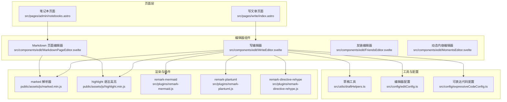
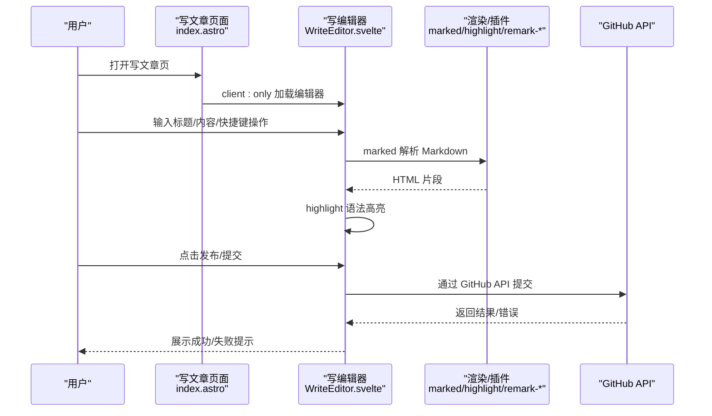
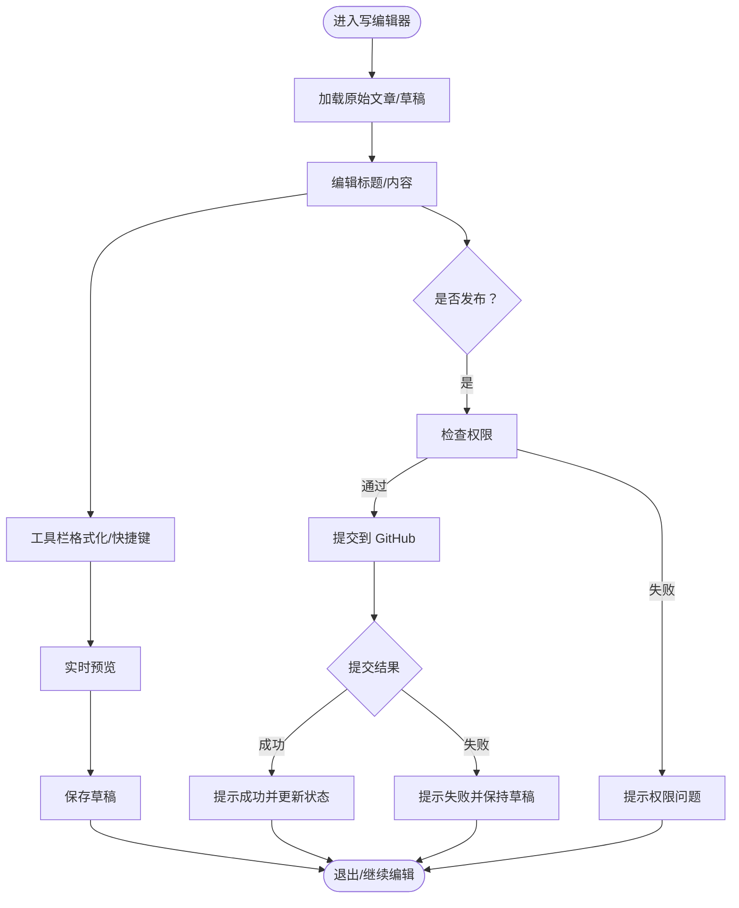
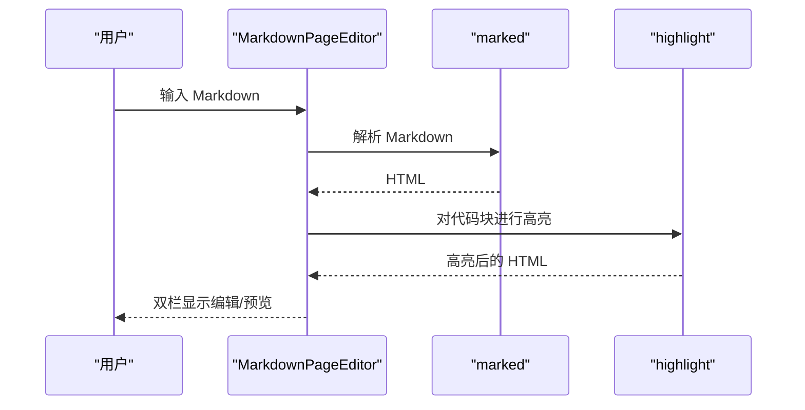
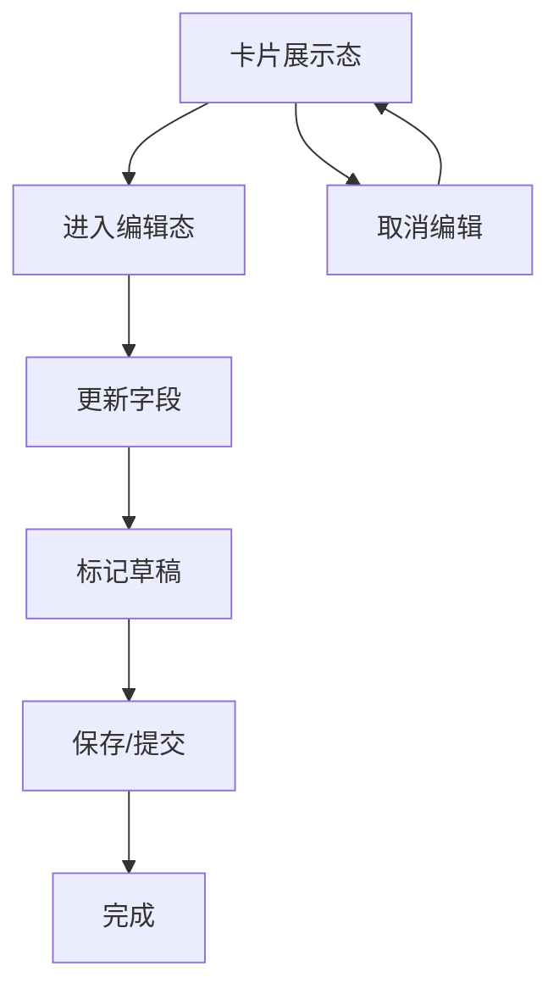
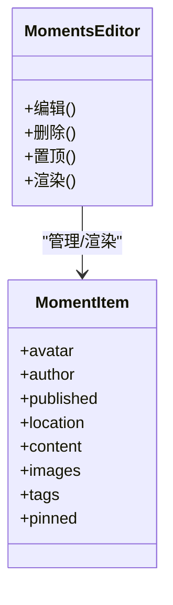
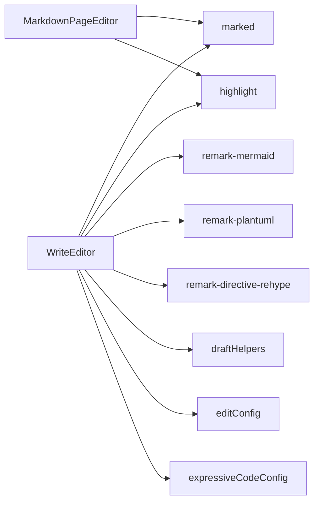

# 编辑组件

<cite>
**本文引用的文件**
- [src/pages/write/index.astro](file://src/pages/write/index.astro)
- [src/components/edit/WriteEditor.svelte](file://src/components/edit/WriteEditor.svelte)
- [src/components/edit/MarkdownPageEditor.svelte](file://src/components/edit/MarkdownPageEditor.svelte)
- [src/components/edit/FriendsEditor.svelte](file://src/components/edit/FriendsEditor.svelte)
- [src/components/edit/MomentsEditor.svelte](file://src/components/edit/MomentsEditor.svelte)
- [src/pages/admin/notebooks.astro](file://src/pages/admin/notebooks.astro)
- [public/assets/js/marked.min.js](file://public/assets/js/marked.min.js)
- [public/assets/js/highlight.min.js](file://public/assets/js/highlight.min.js)
- [src/plugins/remark-mermaid.js](file://src/plugins/remark-mermaid.js)
- [src/plugins/remark-plantuml.js](file://src/plugins/remark-plantuml.js)
- [src/plugins/remark-directive-rehype.js](file://src/plugins/remark-directive-rehype.js)
- [src/utils/draftHelpers.ts](file://src/utils/draftHelpers.ts)
- [src/config/editConfig.ts](file://src/config/editConfig.ts)
- [src/config/expressiveCodeConfig.ts](file://src/config/expressiveCodeConfig.ts)
</cite>

## 目录
1. [简介](#简介)
2. [项目结构](#项目结构)
3. [核心组件](#核心组件)
4. [架构总览](#架构总览)
5. [详细组件分析](#详细组件分析)
6. [依赖关系分析](#依赖关系分析)
7. [性能考虑](#性能考虑)
8. [故障排除指南](#故障排除指南)
9. [结论](#结论)
10. [附录](#附录)

## 简介
本文件系统性梳理博客系统的“编辑组件”体系，覆盖富文本编辑器、代码编辑器、Markdown 编辑器等多形态编辑能力，深入解析状态管理（内容同步、撤销重做、草稿持久化）、插件系统与扩展机制（语法高亮、Mermaid/PlantUML 图表渲染、指令转换）、配置与主题定制、以及与后端 API 的交互模式（GitHub API 提交、权限校验）。同时提供性能优化与用户体验改进建议。

## 项目结构
编辑相关的核心文件主要分布在以下位置：
- 页面入口：写文章页面，负责挂载写编辑器组件
- 编辑器组件：写编辑器、Markdown 页面编辑器、友链编辑器、动态内容编辑器等
- 插件与渲染：Markdown 解析、语法高亮、图表渲染等
- 工具与配置：草稿工具、编辑器配置、主题与可表达代码配置

**图表来源**
- [src/pages/write/index.astro](file://src/pages/write/index.astro)
- [src/pages/admin/notebooks.astro](file://src/pages/admin/notebooks.astro)
- [src/components/edit/WriteEditor.svelte](file://src/components/edit/WriteEditor.svelte)
- [src/components/edit/MarkdownPageEditor.svelte](file://src/components/edit/MarkdownPageEditor.svelte)
- [src/components/edit/FriendsEditor.svelte](file://src/components/edit/FriendsEditor.svelte)
- [src/components/edit/MomentsEditor.svelte](file://src/components/edit/MomentsEditor.svelte)
- [public/assets/js/marked.min.js](file://public/assets/js/marked.min.js)
- [public/assets/js/highlight.min.js](file://public/assets/js/highlight.min.js)
- [src/plugins/remark-mermaid.js](file://src/plugins/remark-mermaid.js)
- [src/plugins/remark-plantuml.js](file://src/plugins/remark-plantuml.js)
- [src/plugins/remark-directive-rehype.js](file://src/plugins/remark-directive-rehype.js)
- [src/utils/draftHelpers.ts](file://src/utils/draftHelpers.ts)
- [src/config/editConfig.ts](file://src/config/editConfig.ts)
- [src/config/expressiveCodeConfig.ts](file://src/config/expressiveCodeConfig.ts)

**章节来源**
- [src/pages/write/index.astro](file://src/pages/write/index.astro)
- [src/pages/admin/notebooks.astro](file://src/pages/admin/notebooks.astro)

## 核心组件
- 写编辑器（WriteEditor）：支持标题输入、Markdown 编辑、实时预览、快捷键、草稿与发布流程、GitHub API 提交流程、权限校验与错误提示。
- Markdown 页面编辑器（MarkdownPageEditor）：双栏编辑/预览、格式化按钮、键盘快捷键、草稿恢复与保存。
- 友链编辑器（FriendsEditor）：卡片式展示与内联编辑态切换、字段校验与草稿标记。
- 动态内容编辑器（MomentsEditor）：动态内容卡片的增删改查、置顶、标签与图片展示。
- 页面级编辑器（notebooks.astro）：笔记本条目编辑、Markdown 渲染与提交。

这些组件共同构成“编辑组件体系”，统一使用 Markdown 作为内容模型，结合 marked 与 highlight 实现渲染与高亮，并通过插件扩展 Mermaid/PlantUML 等图表渲染能力。

**章节来源**
- [src/components/edit/WriteEditor.svelte](file://src/components/edit/WriteEditor.svelte)
- [src/components/edit/MarkdownPageEditor.svelte](file://src/components/edit/MarkdownPageEditor.svelte)
- [src/components/edit/FriendsEditor.svelte](file://src/components/edit/FriendsEditor.svelte)
- [src/components/edit/MomentsEditor.svelte](file://src/components/edit/MomentsEditor.svelte)
- [src/pages/admin/notebooks.astro](file://src/pages/admin/notebooks.astro)

## 架构总览
编辑组件的运行时架构围绕“页面 → 编辑器 → 渲染/插件 → 工具/配置”的层次展开。页面负责初始化与主题注入，编辑器负责内容输入与状态管理，渲染层负责 Markdown 到 HTML 的转换与高亮，插件层提供图表与指令扩展，工具层提供草稿与持久化，配置层提供主题与行为开关。

**图表来源**
- [src/pages/write/index.astro](file://src/pages/write/index.astro)
- [src/components/edit/WriteEditor.svelte](file://src/components/edit/WriteEditor.svelte)
- [public/assets/js/marked.min.js](file://public/assets/js/marked.min.js)
- [public/assets/js/highlight.min.js](file://public/assets/js/highlight.min.js)
- [src/plugins/remark-mermaid.js](file://src/plugins/remark-mermaid.js)
- [src/plugins/remark-plantuml.js](file://src/plugins/remark-plantuml.js)
- [src/plugins/remark-directive-rehype.js](file://src/plugins/remark-directive-rehype.js)

## 详细组件分析

### 写编辑器（WriteEditor）
- 功能要点
  - 标题输入与内容编辑：支持标题输入框与 Markdown 文本域，实时预览面板。
  - 工具栏与快捷键：格式化按钮、Ctrl+S 保存草稿、Tab 插入缩进、粘贴拦截提示。
  - 发布流程：认证状态检查、草稿快照生成、调用发布接口、更新 SHA、清理草稿、提示反馈。
  - 错误处理：网络异常、权限不足、解析错误等分支处理与用户提示。
- 状态管理
  - 原始内容快照、编辑模式、保存状态、加载状态、权限状态、预览模式等。
  - 与草稿工具协作，实现本地草稿的保存与恢复。
- 插件与渲染
  - 使用 marked 进行 Markdown 解析，highlight 进行代码高亮。
  - 通过 remark-mermaid、remark-plantuml、remark-directive-rehype 扩展图表与指令渲染。
- 主题与配置
  - 页面注入主题色变量，编辑器样式适配深浅色主题。
  - 编辑器配置与可表达代码配置用于控制渲染细节与主题风格。

**图表来源**
- [src/components/edit/WriteEditor.svelte](file://src/components/edit/WriteEditor.svelte)
- [src/utils/draftHelpers.ts](file://src/utils/draftHelpers.ts)
- [src/config/editConfig.ts](file://src/config/editConfig.ts)
- [src/config/expressiveCodeConfig.ts](file://src/config/expressiveCodeConfig.ts)

**章节来源**
- [src/components/edit/WriteEditor.svelte](file://src/components/edit/WriteEditor.svelte)
- [src/pages/write/index.astro](file://src/pages/write/index.astro)
- [public/assets/js/marked.min.js](file://public/assets/js/marked.min.js)
- [public/assets/js/highlight.min.js](file://public/assets/js/highlight.min.js)
- [src/plugins/remark-mermaid.js](file://src/plugins/remark-mermaid.js)
- [src/plugins/remark-plantuml.js](file://src/plugins/remark-plantuml.js)
- [src/plugins/remark-directive-rehype.js](file://src/plugins/remark-directive-rehype.js)
- [src/utils/draftHelpers.ts](file://src/utils/draftHelpers.ts)
- [src/config/editConfig.ts](file://src/config/editConfig.ts)
- [src/config/expressiveCodeConfig.ts](file://src/config/expressiveCodeConfig.ts)

### Markdown 页面编辑器（MarkdownPageEditor）
- 功能要点
  - 双栏布局：左侧编辑区、右侧预览区，支持响应式切换。
  - 工具栏：加粗、斜体、代码块、列表、链接、图片、分割线等常用格式。
  - 键盘快捷键：Tab 插入空格、Ctrl+S 保存草稿。
  - 草稿恢复：启动时从本地存储恢复草稿。
- 状态管理
  - 编辑态/展示态切换、原始内容备份、当前内容、预览内容、草稿标识。
- 渲染与高亮
  - 使用 marked 进行 Markdown 到 HTML 的转换；highlight 进行代码块高亮。

**图表来源**
- [src/components/edit/MarkdownPageEditor.svelte](file://src/components/edit/MarkdownPageEditor.svelte)
- [public/assets/js/marked.min.js](file://public/assets/js/marked.min.js)
- [public/assets/js/highlight.min.js](file://public/assets/js/highlight.min.js)

**章节来源**
- [src/components/edit/MarkdownPageEditor.svelte](file://src/components/edit/MarkdownPageEditor.svelte)

### 友链编辑器（FriendsEditor）
- 功能要点
  - 卡片展示态与编辑态切换：展示友链基本信息与头像占位符；编辑态为内联表单。
  - 字段更新：标题、描述、站点 URL、标签等，支持草稿标记。
  - 图片加载错误处理：头像加载失败时隐藏图片。
- 状态管理
  - 卡片数据结构、草稿状态、标签颜色映射。

**图表来源**
- [src/components/edit/FriendsEditor.svelte](file://src/components/edit/FriendsEditor.svelte)

**章节来源**
- [src/components/edit/FriendsEditor.svelte](file://src/components/edit/FriendsEditor.svelte)

### 动态内容编辑器（MomentsEditor）
- 功能要点
  - 动态内容卡片：头像、用户名、发布时间、位置、内容文本、图片网格、标签等。
  - 操作按钮：编辑、删除、置顶等。
- 状态管理
  - 数据项数组、置顶状态、标签集合、图片列表等。

**图表来源**
- [src/components/edit/MomentsEditor.svelte](file://src/components/edit/MomentsEditor.svelte)

**章节来源**
- [src/components/edit/MomentsEditor.svelte](file://src/components/edit/MomentsEditor.svelte)

### 页面级编辑器（notebooks.astro）
- 功能要点
  - 笔记本条目编辑：工具栏按钮、Markdown 输入区、预览区、提交按钮。
  - 样式与主题：深浅色主题下的编辑器与预览区样式适配。
- 状态管理
  - 当前条目内容、预览内容、列表展示、编辑栏可见性等。

**章节来源**
- [src/pages/admin/notebooks.astro](file://src/pages/admin/notebooks.astro)

## 依赖关系分析
- 组件依赖
  - 写编辑器依赖 marked、highlight、remark-* 插件、草稿工具、编辑器配置与可表达代码配置。
  - Markdown 页面编辑器依赖 marked、highlight。
  - 友链与动态内容编辑器为纯前端组件，依赖通用样式与图标库。
- 外部依赖
  - marked：Markdown 解析。
  - highlight：代码高亮。
  - remark-mermaid、remark-plantuml、remark-directive-rehype：图表与指令扩展。
- 配置与主题
  - editConfig.ts：编辑器行为与功能开关。
  - expressiveCodeConfig.ts：可表达代码渲染主题与样式。
  - 页面通过 data-theme-hue 注入主题色，编辑器样式适配深浅色。

**图表来源**
- [src/components/edit/WriteEditor.svelte](file://src/components/edit/WriteEditor.svelte)
- [src/components/edit/MarkdownPageEditor.svelte](file://src/components/edit/MarkdownPageEditor.svelte)
- [public/assets/js/marked.min.js](file://public/assets/js/marked.min.js)
- [public/assets/js/highlight.min.js](file://public/assets/js/highlight.min.js)
- [src/plugins/remark-mermaid.js](file://src/plugins/remark-mermaid.js)
- [src/plugins/remark-plantuml.js](file://src/plugins/remark-plantuml.js)
- [src/plugins/remark-directive-rehype.js](file://src/plugins/remark-directive-rehype.js)
- [src/utils/draftHelpers.ts](file://src/utils/draftHelpers.ts)
- [src/config/editConfig.ts](file://src/config/editConfig.ts)
- [src/config/expressiveCodeConfig.ts](file://src/config/expressiveCodeConfig.ts)

**章节来源**
- [src/components/edit/WriteEditor.svelte](file://src/components/edit/WriteEditor.svelte)
- [src/components/edit/MarkdownPageEditor.svelte](file://src/components/edit/MarkdownPageEditor.svelte)
- [public/assets/js/marked.min.js](file://public/assets/js/marked.min.js)
- [public/assets/js/highlight.min.js](file://public/assets/js/highlight.min.js)
- [src/plugins/remark-mermaid.js](file://src/plugins/remark-mermaid.js)
- [src/plugins/remark-plantuml.js](file://src/plugins/remark-plantuml.js)
- [src/plugins/remark-directive-rehype.js](file://src/plugins/remark-directive-rehype.js)
- [src/utils/draftHelpers.ts](file://src/utils/draftHelpers.ts)
- [src/config/editConfig.ts](file://src/config/editConfig.ts)
- [src/config/expressiveCodeConfig.ts](file://src/config/expressiveCodeConfig.ts)

## 性能考虑
- 渲染优化
  - 使用虚拟滚动或分页加载大量动态内容，避免一次性渲染过多节点。
  - 在 Markdown 解析与高亮阶段采用节流/防抖，减少频繁重排。
- 资源加载
  - 将 marked、highlight 等外部脚本按需加载，避免阻塞首屏。
  - 图片懒加载与占位符，提升列表渲染性能。
- 存储与草稿
  - 草稿仅保存必要字段，避免大体积内容频繁写入本地存储。
  - 定期清理过期草稿，限制草稿数量与大小。
- 网络请求
  - 发布/提交采用幂等与去重策略，避免重复提交。
  - 对网络异常进行指数退避与重试，提升稳定性。

## 故障排除指南
- 发布失败
  - 检查权限：确认密钥导入与 GitHub App 权限配置正确。
  - 检查网络：确保网络连通，查看浏览器开发者工具中的请求与响应。
  - 查看日志：编辑器会捕获解析错误并输出到控制台，定位具体问题。
- 预览不更新
  - 确认 Markdown 解析逻辑正常，检查 marked 版本与配置。
  - 检查 highlight 是否对代码块进行了高亮，若失败则回退为普通文本。
- 草稿丢失
  - 确认本地存储可用，检查草稿工具的序列化/反序列化逻辑。
  - 若跨设备/浏览器使用，建议迁移到服务端草稿存储方案。

**章节来源**
- [src/components/edit/WriteEditor.svelte](file://src/components/edit/WriteEditor.svelte)
- [src/utils/draftHelpers.ts](file://src/utils/draftHelpers.ts)

## 结论
本编辑组件体系以 Markdown 为核心，结合 marked、highlight 与 remark-* 插件，实现了从基础编辑到图表渲染的完整闭环。通过草稿工具与配置体系，兼顾了易用性与可扩展性。后续可在性能优化、跨设备同步与更丰富的插件生态方面持续演进。

## 附录
- 配置项与主题定制
  - 编辑器配置：通过 editConfig.ts 控制编辑器行为与功能开关。
  - 可表达代码配置：通过 expressiveCodeConfig.ts 控制渲染主题与样式。
  - 页面主题：通过 data-theme-hue 注入主题色，编辑器样式适配深浅色。
- 插件系统与扩展
  - Mermaid/PlantUML：通过 remark-mermaid、remark-plantuml 实现图表渲染。
  - 指令转换：通过 remark-directive-rehype 实现自定义指令到 HTML 的转换。
- API 交互模式
  - GitHub API：写编辑器通过认证后提交文章，返回结果并更新本地状态。
  - 权限验证：密钥导入与权限检查贯穿发布流程，失败时给出明确提示。

**章节来源**
- [src/config/editConfig.ts](file://src/config/editConfig.ts)
- [src/config/expressiveCodeConfig.ts](file://src/config/expressiveCodeConfig.ts)
- [src/plugins/remark-mermaid.js](file://src/plugins/remark-mermaid.js)
- [src/plugins/remark-plantuml.js](file://src/plugins/remark-plantuml.js)
- [src/plugins/remark-directive-rehype.js](file://src/plugins/remark-directive-rehype.js)
- [src/components/edit/WriteEditor.svelte](file://src/components/edit/WriteEditor.svelte)