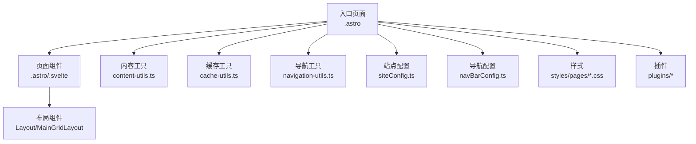
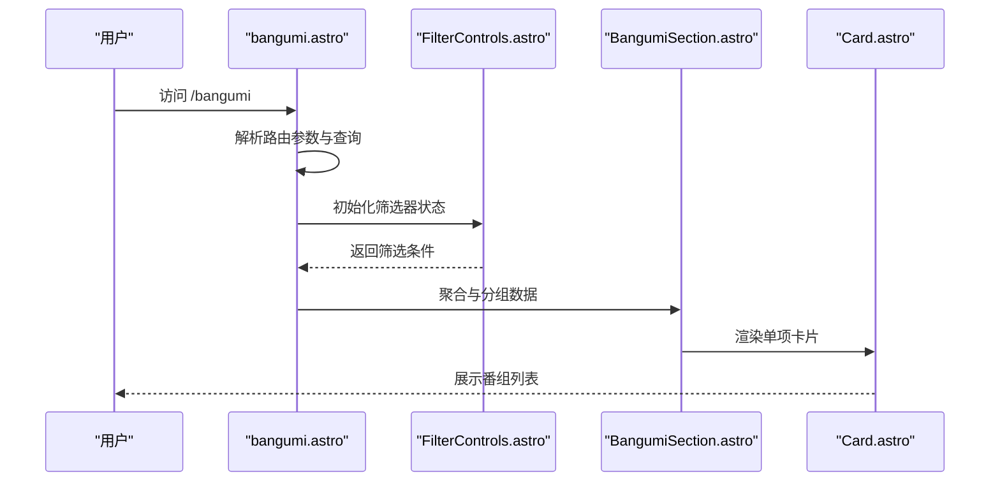
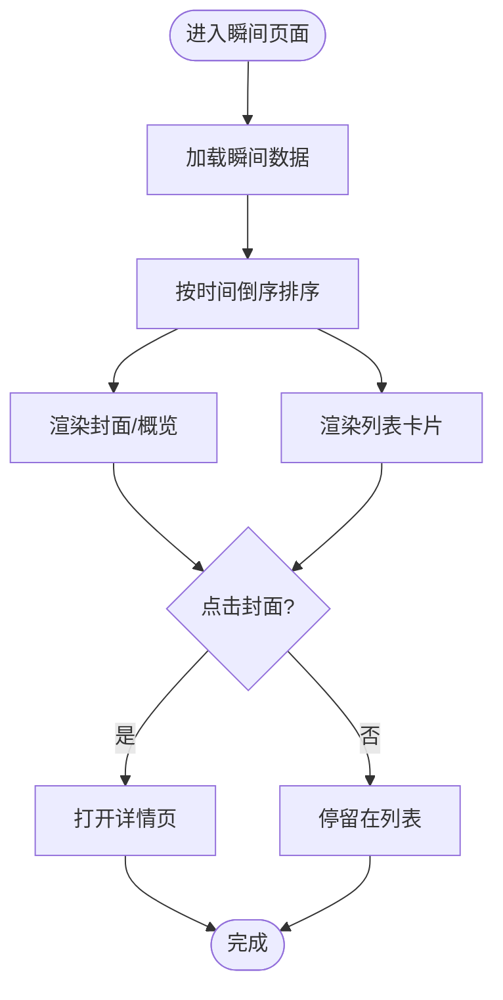
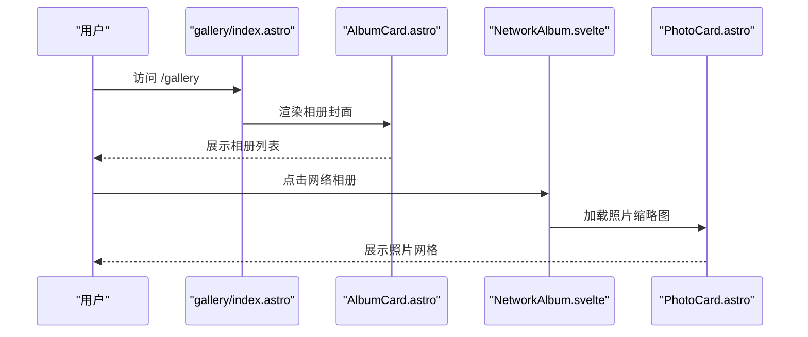
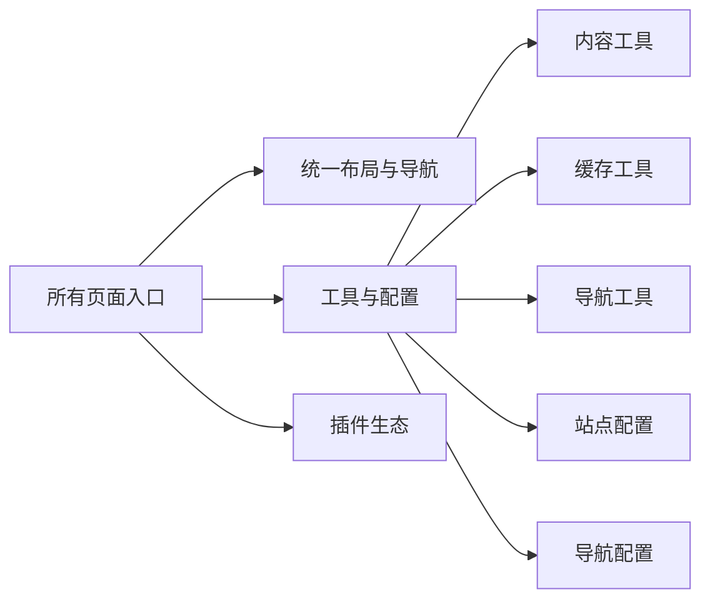

# 页面组件

<cite>
**本文引用的文件**
- [src/pages/index.astro](file://src/pages/index.astro)
- [src/pages/bangumi.astro](file://src/pages/bangumi.astro)
- [src/pages/moments.astro](file://src/pages/moments.astro)
- [src/pages/gallery/index.astro](file://src/pages/gallery/index.astro)
- [src/pages/books/index.astro](file://src/pages/books/index.astro)
- [src/pages/music/index.astro](file://src/pages/music/index.astro)
- [src/pages/calendar.astro](file://src/pages/calendar.astro)
- [src/pages/search.astro](file://src/pages/search.astro)
- [src/pages/archive.astro](file://src/pages/archive.astro)
- [src/pages/categories.astro](file://src/pages/categories.astro)
- [src/pages/about.astro](file://src/pages/about.astro)
- [src/pages/friends.astro](file://src/pages/friends.astro)
- [src/pages/guestbook.astro](file://src/pages/guestbook.astro)
- [src/pages/sponsor.astro](file://src/pages/sponsor.astro)
- [src/pages/rss.astro](file://src/pages/rss.astro)
- [src/pages/rss.xml.ts](file://src/pages/rss.xml.ts)
- [src/pages/og/[...slug].png.ts](file://src/pages/og/[...slug].png.ts)
- [src/pages/posts/[...slug].astro](file://src/pages/posts/[...slug].astro)
- [src/pages/bangumi/[...slug].astro](file://src/pages/bangumi/[...slug].astro)
- [src/pages/books/[...slug].astro](file://src/pages/books/[...slug].astro)
- [src/pages/life/notebooks/[...slug].astro](file://src/pages/life/notebooks/[...slug].astro)
- [src/pages/gallery/[album].astro](file://src/pages/gallery/[album].astro)
- [src/layouts/Layout.astro](file://src/layouts/Layout.astro)
- [src/layouts/MainGridLayout.astro](file://src/layouts/MainGridLayout.astro)
- [src/components/layout/Navbar.astro](file://src/components/layout/Navbar.astro)
- [src/components/layout/Footer.astro](file://src/components/layout/Footer.astro)
- [src/components/common/Pagination.astro](file://src/components/common/Pagination.astro)
- [src/components/common/ClientPagination.astro](file://src/components/common/ClientPagination.astro)
- [src/components/pages/bangumi/BangumiSection.astro](file://src/components/pages/bangumi/BangumiSection.astro)
- [src/components/pages/bangumi/Card.astro](file://src/components/pages/bangumi/Card.astro)
- [src/components/pages/bangumi/FilterControls.astro](file://src/components/pages/bangumi/FilterControls.astro)
- [src/components/pages/bangumi/TabNav.astro](file://src/components/pages/bangumi/TabNav.astro)
- [src/components/pages/gallery/AlbumCard.astro](file://src/components/pages/gallery/AlbumCard.astro)
- [src/components/pages/gallery/NetworkAlbum.svelte](file://src/components/pages/gallery/NetworkAlbum.svelte)
- [src/components/pages/gallery/PhotoCard.astro](file://src/components/pages/gallery/PhotoCard.astro)
- [src/components/pages/moments/MomentCard.astro](file://src/components/pages/moments/MomentCard.astro)
- [src/components/pages/moments/MomentsCover.astro](file://src/components/pages/moments/MomentsCover.astro)
- [src/utils/content-utils.ts](file://src/utils/content-utils.ts)
- [src/utils/cache-utils.ts](file://src/utils/cache-utils.ts)
- [src/utils/navigation-utils.ts](file://src/utils/navigation-utils.ts)
- [src/config/siteConfig.ts](file://src/config/siteConfig.ts)
- [src/config/navBarConfig.ts](file://src/config/navBarConfig.ts)
- [src/styles/pages/article-list.css](file://src/styles/pages/article-list.css)
- [src/styles/pages/gallery.css](file://src/styles/pages/gallery.css)
- [src/styles/pages/calendar.css](file://src/styles/pages/calendar.css)
- [src/plugins/remark-reading-time.mjs](file://src/plugins/remark-reading-time.mjs)
- [src/plugins/remark-excerpt.js](file://src/plugins/remark-excerpt.js)
- [src/plugins/remark-image-grid.js](file://src/plugins/remark-image-grid.js)
- [src/plugins/rehype-figure.mjs](file://src/plugins/rehype-figure.mjs)
- [src/plugins/rehype-external-links.mjs](file://src/plugins/rehype-external-links.mjs)
- [src/plugins/rehype-mermaid.mjs](file://src/plugins/rehype-mermaid.mjs)
- [src/plugins/remark-mermaid.js](file://src/plugins/remark-mermaid.js)
- [src/plugins/remark-plantuml.js](file://src/plugins/remark-plantuml.js)
- [src/plugins/rehype-plantuml.mjs](file://src/plugins/rehype-plantuml.mjs)
- [src/plugins/mermaid-render-script.js](file://src/plugins/mermaid-render-script.js)
- [src/plugins/plantuml-render-script.js](file://src/plugins/plantuml-render-script.js)
- [src/plugins/plantuml-encoder.js](file://src/plugins/plantuml-encoder.js)
- [src/components/analytics/GoogleAnalytics.astro](file://src/components/analytics/GoogleAnalytics.astro)
- [src/components/analytics/La51Analytics.astro](file://src/components/analytics/La51Analytics.astro)
- [src/components/analytics/MicrosoftClarity.astro](file://src/components/analytics/MicrosoftClarity.astro)
- [src/components/analytics/UmamiAnalytics.astro](file://src/components/analytics/UmamiAnalytics.astro)
</cite>

## 目录
1. [引言](#引言)
2. [项目结构](#项目结构)
3. [核心组件](#核心组件)
4. [架构总览](#架构总览)
5. [详细组件分析](#详细组件分析)
6. [依赖关系分析](#依赖关系分析)
7. [性能考虑](#性能考虑)
8. [故障排除指南](#故障排除指南)
9. [结论](#结论)
10. [附录](#附录)

## 引言
本文件系统性梳理博客系统的页面级组件，覆盖番组页面、瞬间页面、画廊页面等特定内容类型，并深入解析数据获取与渲染流程、SEO 与元数据管理、路由与导航集成、缓存与性能优化、以及响应式与移动端适配策略。目标是帮助开发者快速理解页面组件的设计模式与实现要点，便于扩展与维护。

## 项目结构
页面组件主要位于 src/pages 与 src/components/pages 下，采用 Astro + Svelte 的混合技术栈，结合工具函数与样式模块，形成清晰的分层架构：
- 页面入口：各功能页面以 .astro 文件作为入口，负责路由参数解析、数据聚合与布局装配。
- 页面组件：在 src/components/pages 下按功能域拆分（如 bangumi、gallery、moments），封装可复用的卡片、筛选器、导航等 UI。
- 布局与通用控件：通过 src/layouts 与 src/components/common 提供统一布局、分页、标题等基础能力。
- 数据与工具：src/utils 提供内容处理、缓存、导航等工具；src/plugins 提供 Markdown/HTML 扩展与渲染增强。
- 样式：页面样式集中在 src/styles/pages，按页面维度组织，确保主题一致性与可维护性。

```mermaid
graph TB
subgraph "页面入口"
P_index["首页<br/>index.astro"]
P_bangumi["番组索引<br/>bangumi.astro"]
P_moments["瞬间索引<br/>moments.astro"]
P_gallery["画廊索引<br/>gallery/index.astro"]
P_books["书架索引<br/>books/index.astro"]
P_music["音乐索引<br/>music/index.astro"]
P_calendar["日历<br/>calendar.astro"]
P_search["搜索<br/>search.astro"]
P_archive["归档<br/>archive.astro"]
P_categories["分类<br/>categories.astro"]
P_about["关于<br/>about.astro"]
P_friends["友链<br/>friends.astro"]
P_guestbook["留言板<br/>guestbook.astro"]
P_sponsor["赞助<br/>sponsor.astro"]
P_rss["RSS订阅<br/>rss.astro"]
P_og["OG图生成<br/>og/[...slug].png.ts"]
end
subgraph "页面组件"
C_bangumi_section["BangumiSection.astro"]
C_bangumi_card["Card.astro"]
C_bangumi_filter["FilterControls.astro"]
C_bangumi_tabnav["TabNav.astro"]
C_gallery_album["AlbumCard.astro"]
C_gallery_network["NetworkAlbum.svelte"]
C_gallery_photo["PhotoCard.astro"]
C_moments_card["MomentCard.astro"]
C_moments_cover["MomentsCover.astro"]
end
subgraph "布局与通用"
L_layout["Layout.astro"]
L_maingrid["MainGridLayout.astro"]
L_navbar["Navbar.astro"]
L_footer["Footer.astro"]
L_pagination["Pagination.astro"]
L_clientpagination["ClientPagination.astro"]
end
subgraph "工具与配置"
U_content["content-utils.ts"]
U_cache["cache-utils.ts"]
U_nav["navigation-utils.ts"]
C_site["siteConfig.ts"]
C_navbar["navBarConfig.ts"]
end
P_index --> L_layout
P_bangumi --> L_layout
P_moments --> L_layout
P_gallery --> L_layout
P_books --> L_layout
P_music --> L_layout
P_calendar --> L_layout
P_search --> L_layout
P_archive --> L_layout
P_categories --> L_layout
P_about --> L_layout
P_friends --> L_layout
P_guestbook --> L_layout
P_sponsor --> L_layout
P_rss --> L_layout
P_og --> L_layout
P_bangumi --> C_bangumi_section
P_bangumi --> C_bangumi_card
P_bangumi --> C_bangumi_filter
P_bangumi --> C_bangumi_tabnav
P_gallery --> C_gallery_album
P_gallery --> C_gallery_network
P_gallery --> C_gallery_photo
P_moments --> C_moments_card
P_moments --> C_moments_cover
L_layout --> L_maingrid
L_layout --> L_navbar
L_layout --> L_footer
L_layout --> L_pagination
L_layout --> L_clientpagination
P_index --> U_content
P_bangumi --> U_content
P_gallery --> U_content
P_moments --> U_content
P_calendar --> U_content
P_search --> U_content
P_archive --> U_content
P_categories --> U_content
P_index --> U_cache
P_bangumi --> U_cache
P_gallery --> U_cache
P_moments --> U_cache
P_calendar --> U_cache
P_search --> U_cache
P_archive --> U_cache
P_categories --> U_cache
P_index --> C_site
P_bangumi --> C_site
P_gallery --> C_site
P_moments --> C_site
P_calendar --> C_site
P_search --> C_site
P_archive --> C_site
P_categories --> C_site
```

图表来源
- [src/pages/index.astro](file://src/pages/index.astro)
- [src/pages/bangumi.astro](file://src/pages/bangumi.astro)
- [src/pages/moments.astro](file://src/pages/moments.astro)
- [src/pages/gallery/index.astro](file://src/pages/gallery/index.astro)
- [src/pages/books/index.astro](file://src/pages/books/index.astro)
- [src/pages/music/index.astro](file://src/pages/music/index.astro)
- [src/pages/calendar.astro](file://src/pages/calendar.astro)
- [src/pages/search.astro](file://src/pages/search.astro)
- [src/pages/archive.astro](file://src/pages/archive.astro)
- [src/pages/categories.astro](file://src/pages/categories.astro)
- [src/pages/about.astro](file://src/pages/about.astro)
- [src/pages/friends.astro](file://src/pages/friends.astro)
- [src/pages/guestbook.astro](file://src/pages/guestbook.astro)
- [src/pages/sponsor.astro](file://src/pages/sponsor.astro)
- [src/pages/rss.astro](file://src/pages/rss.astro)
- [src/pages/og/[...slug].png.ts](file://src/pages/og/[...slug].png.ts)
- [src/layouts/Layout.astro](file://src/layouts/Layout.astro)
- [src/layouts/MainGridLayout.astro](file://src/layouts/MainGridLayout.astro)
- [src/components/layout/Navbar.astro](file://src/components/layout/Navbar.astro)
- [src/components/layout/Footer.astro](file://src/components/layout/Footer.astro)
- [src/components/common/Pagination.astro](file://src/components/common/Pagination.astro)
- [src/components/common/ClientPagination.astro](file://src/components/common/ClientPagination.astro)
- [src/components/pages/bangumi/BangumiSection.astro](file://src/components/pages/bangumi/BangumiSection.astro)
- [src/components/pages/bangumi/Card.astro](file://src/components/pages/bangumi/Card.astro)
- [src/components/pages/bangumi/FilterControls.astro](file://src/components/pages/bangumi/FilterControls.astro)
- [src/components/pages/bangumi/TabNav.astro](file://src/components/pages/bangumi/TabNav.astro)
- [src/components/pages/gallery/AlbumCard.astro](file://src/components/pages/gallery/AlbumCard.astro)
- [src/components/pages/gallery/NetworkAlbum.svelte](file://src/components/pages/gallery/NetworkAlbum.svelte)
- [src/components/pages/gallery/PhotoCard.astro](file://src/components/pages/gallery/PhotoCard.astro)
- [src/components/pages/moments/MomentCard.astro](file://src/components/pages/moments/MomentCard.astro)
- [src/components/pages/moments/MomentsCover.astro](file://src/components/pages/moments/MomentsCover.astro)
- [src/utils/content-utils.ts](file://src/utils/content-utils.ts)
- [src/utils/cache-utils.ts](file://src/utils/cache-utils.ts)
- [src/utils/navigation-utils.ts](file://src/utils/navigation-utils.ts)
- [src/config/siteConfig.ts](file://src/config/siteConfig.ts)
- [src/config/navBarConfig.ts](file://src/config/navBarConfig.ts)

章节来源
- [src/pages/index.astro](file://src/pages/index.astro)
- [src/pages/bangumi.astro](file://src/pages/bangumi.astro)
- [src/pages/moments.astro](file://src/pages/moments.astro)
- [src/pages/gallery/index.astro](file://src/pages/gallery/index.astro)
- [src/pages/books/index.astro](file://src/pages/books/index.astro)
- [src/pages/music/index.astro](file://src/pages/music/index.astro)
- [src/pages/calendar.astro](file://src/pages/calendar.astro)
- [src/pages/search.astro](file://src/pages/search.astro)
- [src/pages/archive.astro](file://src/pages/archive.astro)
- [src/pages/categories.astro](file://src/pages/categories.astro)
- [src/pages/about.astro](file://src/pages/about.astro)
- [src/pages/friends.astro](file://src/pages/friends.astro)
- [src/pages/guestbook.astro](file://src/pages/guestbook.astro)
- [src/pages/sponsor.astro](file://src/pages/sponsor.astro)
- [src/pages/rss.astro](file://src/pages/rss.astro)
- [src/pages/og/[...slug].png.ts](file://src/pages/og/[...slug].png.ts)

## 核心组件
- 页面入口组件：每个页面以 .astro 文件为入口，负责：
  - 解析路由参数与查询条件（如 slug、album、category 等）。
  - 调用内容工具函数进行数据聚合与过滤。
  - 选择合适的布局与组件进行渲染。
- 页面组件库：
  - 番组页面：BangumiSection、Card、FilterControls、TabNav。
  - 画廊页面：AlbumCard、NetworkAlbum、PhotoCard。
  - 瞬间页面：MomentCard、MomentsCover。
- 布局与导航：Layout、MainGridLayout、Navbar、Footer、Pagination、ClientPagination。
- 工具与配置：content-utils、cache-utils、navigation-utils、siteConfig、navBarConfig。

章节来源
- [src/components/pages/bangumi/BangumiSection.astro](file://src/components/pages/bangumi/BangumiSection.astro)
- [src/components/pages/bangumi/Card.astro](file://src/components/pages/bangumi/Card.astro)
- [src/components/pages/bangumi/FilterControls.astro](file://src/components/pages/bangumi/FilterControls.astro)
- [src/components/pages/bangumi/TabNav.astro](file://src/components/pages/bangumi/TabNav.astro)
- [src/components/pages/gallery/AlbumCard.astro](file://src/components/pages/gallery/AlbumCard.astro)
- [src/components/pages/gallery/NetworkAlbum.svelte](file://src/components/pages/gallery/NetworkAlbum.svelte)
- [src/components/pages/gallery/PhotoCard.astro](file://src/components/pages/gallery/PhotoCard.astro)
- [src/components/pages/moments/MomentCard.astro](file://src/components/pages/moments/MomentCard.astro)
- [src/components/pages/moments/MomentsCover.astro](file://src/components/pages/moments/MomentsCover.astro)
- [src/layouts/Layout.astro](file://src/layouts/Layout.astro)
- [src/layouts/MainGridLayout.astro](file://src/layouts/MainGridLayout.astro)
- [src/components/layout/Navbar.astro](file://src/components/layout/Navbar.astro)
- [src/components/layout/Footer.astro](file://src/components/layout/Footer.astro)
- [src/components/common/Pagination.astro](file://src/components/common/Pagination.astro)
- [src/components/common/ClientPagination.astro](file://src/components/common/ClientPagination.astro)
- [src/utils/content-utils.ts](file://src/utils/content-utils.ts)
- [src/utils/cache-utils.ts](file://src/utils/cache-utils.ts)
- [src/utils/navigation-utils.ts](file://src/utils/navigation-utils.ts)
- [src/config/siteConfig.ts](file://src/config/siteConfig.ts)
- [src/config/navBarConfig.ts](file://src/config/navBarConfig.ts)

## 架构总览
页面组件遵循“入口页面 + 页面组件 + 布局 + 工具”的分层架构。入口页面负责路由与数据准备，页面组件负责具体展示，布局提供统一外观，工具提供数据与缓存支持。

图表来源
- [src/pages/index.astro](file://src/pages/index.astro)
- [src/layouts/Layout.astro](file://src/layouts/Layout.astro)
- [src/layouts/MainGridLayout.astro](file://src/layouts/MainGridLayout.astro)
- [src/utils/content-utils.ts](file://src/utils/content-utils.ts)
- [src/utils/cache-utils.ts](file://src/utils/cache-utils.ts)
- [src/utils/navigation-utils.ts](file://src/utils/navigation-utils.ts)
- [src/config/siteConfig.ts](file://src/config/siteConfig.ts)
- [src/config/navBarConfig.ts](file://src/config/navBarConfig.ts)
- [src/styles/pages/article-list.css](file://src/styles/pages/article-list.css)
- [src/styles/pages/gallery.css](file://src/styles/pages/gallery.css)
- [src/styles/pages/calendar.css](file://src/styles/pages/calendar.css)
- [src/plugins/remark-reading-time.mjs](file://src/plugins/remark-reading-time.mjs)
- [src/plugins/remark-excerpt.js](file://src/plugins/remark-excerpt.js)
- [src/plugins/remark-image-grid.js](file://src/plugins/remark-image-grid.js)
- [src/plugins/rehype-figure.mjs](file://src/plugins/rehype-figure.mjs)
- [src/plugins/rehype-external-links.mjs](file://src/plugins/rehype-external-links.mjs)
- [src/plugins/rehype-mermaid.mjs](file://src/plugins/rehype-mermaid.mjs)
- [src/plugins/remark-mermaid.js](file://src/plugins/remark-mermaid.js)
- [src/plugins/remark-plantuml.js](file://src/plugins/remark-plantuml.js)
- [src/plugins/rehype-plantuml.mjs](file://src/plugins/rehype-plantuml.mjs)
- [src/plugins/mermaid-render-script.js](file://src/plugins/mermaid-render-script.js)
- [src/plugins/plantuml-render-script.js](file://src/plugins/plantuml-render-script.js)
- [src/plugins/plantuml-encoder.js](file://src/plugins/plantuml-encoder.js)

## 详细组件分析

### 番组页面（bangumi）
- 设计模式：采用 Section + Card + Filter + Tab 的组合模式，将列表、筛选、标签页解耦，提升可维护性与复用性。
- 数据获取与渲染：
  - 入口页面解析路由参数，调用内容工具聚合番组数据。
  - FilterControls 提供状态驱动的筛选器，BangumiSection 负责分组与排序，Card 渲染单项。
- SEO 与元数据：使用站点配置生成标题、描述、关键词等元数据。
- 路由与导航：支持动态路由 [...slug]，配合导航工具生成面包屑与侧边导航。
- 性能优化：利用缓存工具对聚合结果进行缓存，减少重复计算；客户端分页降低首屏压力。
- 响应式与移动端：卡片网格自适应列数，筛选器在窄屏时折叠为抽屉或下拉。

图表来源
- [src/pages/bangumi.astro](file://src/pages/bangumi.astro)
- [src/components/pages/bangumi/FilterControls.astro](file://src/components/pages/bangumi/FilterControls.astro)
- [src/components/pages/bangumi/BangumiSection.astro](file://src/components/pages/bangumi/BangumiSection.astro)
- [src/components/pages/bangumi/Card.astro](file://src/components/pages/bangumi/Card.astro)

章节来源
- [src/pages/bangumi.astro](file://src/pages/bangumi.astro)
- [src/components/pages/bangumi/BangumiSection.astro](file://src/components/pages/bangumi/BangumiSection.astro)
- [src/components/pages/bangumi/Card.astro](file://src/components/pages/bangumi/Card.astro)
- [src/components/pages/bangumi/FilterControls.astro](file://src/components/pages/bangumi/FilterControls.astro)
- [src/components/pages/bangumi/TabNav.astro](file://src/components/pages/bangumi/TabNav.astro)
- [src/utils/content-utils.ts](file://src/utils/content-utils.ts)
- [src/utils/cache-utils.ts](file://src/utils/cache-utils.ts)
- [src/config/siteConfig.ts](file://src/config/siteConfig.ts)
- [src/styles/pages/article-list.css](file://src/styles/pages/article-list.css)

### 瞬间页面（moments）
- 设计模式：MomentsCover 作为封面/概览，MomentCard 用于列表项，二者组合实现“封面 + 列表”双视图。
- 数据获取与渲染：从内容源读取瞬间条目，按时间倒序排列；支持封面图与摘要展示。
- SEO 与元数据：继承站点配置，生成统一的页面标题与描述。
- 路由与导航：支持动态路由 [...slug] 以进入单条瞬间详情。
- 性能优化：封面图懒加载，列表虚拟滚动（若启用）；缓存最近更新数据。
- 响应式与移动端：卡片宽度自适应，窄屏时切换为单列显示。

图表来源
- [src/pages/moments.astro](file://src/pages/moments.astro)
- [src/components/pages/moments/MomentsCover.astro](file://src/components/pages/moments/MomentsCover.astro)
- [src/components/pages/moments/MomentCard.astro](file://src/components/pages/moments/MomentCard.astro)

章节来源
- [src/pages/moments.astro](file://src/pages/moments.astro)
- [src/components/pages/moments/MomentsCover.astro](file://src/components/pages/moments/MomentsCover.astro)
- [src/components/pages/moments/MomentCard.astro](file://src/components/pages/moments/MomentCard.astro)
- [src/utils/content-utils.ts](file://src/utils/content-utils.ts)
- [src/config/siteConfig.ts](file://src/config/siteConfig.ts)
- [src/styles/pages/article-list.css](file://src/styles/pages/article-list.css)

### 画廊页面（gallery）
- 设计模式：AlbumCard 展示相册封面，PhotoCard 展示照片缩略图，NetworkAlbum 支持网络相册联动。
- 数据获取与渲染：根据 album 参数加载对应相册资源，支持瀑布流/网格布局。
- SEO 与元数据：基于相册标题与描述生成 OG 标签与页面元信息。
- 路由与导航：/gallery/[album] 动态路由，支持相册内导航与返回列表。
- 性能优化：图片懒加载与占位符，缩略图尺寸控制，按需加载更多。
- 响应式与移动端：网格列数随屏幕宽度调整，触摸滑动支持。

图表来源
- [src/pages/gallery/index.astro](file://src/pages/gallery/index.astro)
- [src/components/pages/gallery/AlbumCard.astro](file://src/components/pages/gallery/AlbumCard.astro)
- [src/components/pages/gallery/NetworkAlbum.svelte](file://src/components/pages/gallery/NetworkAlbum.svelte)
- [src/components/pages/gallery/PhotoCard.astro](file://src/components/pages/gallery/PhotoCard.astro)

章节来源
- [src/pages/gallery/index.astro](file://src/pages/gallery/index.astro)
- [src/pages/gallery/[album].astro](file://src/pages/gallery/[album].astro)
- [src/components/pages/gallery/AlbumCard.astro](file://src/components/pages/gallery/AlbumCard.astro)
- [src/components/pages/gallery/NetworkAlbum.svelte](file://src/components/pages/gallery/NetworkAlbum.svelte)
- [src/components/pages/gallery/PhotoCard.astro](file://src/components/pages/gallery/PhotoCard.astro)
- [src/utils/content-utils.ts](file://src/utils/content-utils.ts)
- [src/config/siteConfig.ts](file://src/config/siteConfig.ts)
- [src/styles/pages/gallery.css](file://src/styles/pages/gallery.css)

### 其他页面（文章、书籍、音乐、日历、搜索、归档、分类、关于、友链、留言、赞助、RSS）
- 文章详情页：posts/[...slug].astro，负责解析文章路径、生成阅读元数据、渲染正文与相关推荐。
- 书籍/音乐/电影游戏：对应 index 页面提供列表与筛选，支持按类别/标签/时间排序。
- 日历：calendar.astro，基于事件类型与日期生成日程视图。
- 搜索：search.astro，结合全文检索与内容工具进行结果聚合与高亮。
- 归档/分类：archive.astro、categories.astro，按时间线与标签维度聚合内容。
- 关于/友链/留言/赞助：静态页面，结合组件与样式实现信息展示与交互。
- RSS：rss.astro、rss.xml.ts，输出标准 RSS 订阅格式。

章节来源
- [src/pages/posts/[...slug].astro](file://src/pages/posts/[...slug].astro)
- [src/pages/books/index.astro](file://src/pages/books/index.astro)
- [src/pages/music/index.astro](file://src/pages/music/index.astro)
- [src/pages/calendar.astro](file://src/pages/calendar.astro)
- [src/pages/search.astro](file://src/pages/search.astro)
- [src/pages/archive.astro](file://src/pages/archive.astro)
- [src/pages/categories.astro](file://src/pages/categories.astro)
- [src/pages/about.astro](file://src/pages/about.astro)
- [src/pages/friends.astro](file://src/pages/friends.astro)
- [src/pages/guestbook.astro](file://src/pages/guestbook.astro)
- [src/pages/sponsor.astro](file://src/pages/sponsor.astro)
- [src/pages/rss.astro](file://src/pages/rss.astro)
- [src/pages/rss.xml.ts](file://src/pages/rss.xml.ts)

## 依赖关系分析
- 入口页面与页面组件：通过 Astro 的组件导入机制连接，页面组件可复用性强。
- 布局与通用控件：所有页面共享 Layout 与 Navbar/Footer，保证一致的导航体验。
- 工具与配置：内容工具负责数据聚合与过滤，缓存工具负责性能优化，导航工具负责面包屑与路由跳转，站点配置与导航配置提供元数据与菜单。
- 插件生态：Markdown/HTML 扩展插件增强内容渲染能力，Mermaid/PlantUML 插件支持图表与时序图。

图表来源
- [src/layouts/Layout.astro](file://src/layouts/Layout.astro)
- [src/layouts/MainGridLayout.astro](file://src/layouts/MainGridLayout.astro)
- [src/components/layout/Navbar.astro](file://src/components/layout/Navbar.astro)
- [src/components/layout/Footer.astro](file://src/components/layout/Footer.astro)
- [src/utils/content-utils.ts](file://src/utils/content-utils.ts)
- [src/utils/cache-utils.ts](file://src/utils/cache-utils.ts)
- [src/utils/navigation-utils.ts](file://src/utils/navigation-utils.ts)
- [src/config/siteConfig.ts](file://src/config/siteConfig.ts)
- [src/config/navBarConfig.ts](file://src/config/navBarConfig.ts)
- [src/plugins/remark-reading-time.mjs](file://src/plugins/remark-reading-time.mjs)
- [src/plugins/remark-excerpt.js](file://src/plugins/remark-excerpt.js)
- [src/plugins/remark-image-grid.js](file://src/plugins/remark-image-grid.js)
- [src/plugins/rehype-figure.mjs](file://src/plugins/rehype-figure.mjs)
- [src/plugins/rehype-external-links.mjs](file://src/plugins/rehype-external-links.mjs)
- [src/plugins/rehype-mermaid.mjs](file://src/plugins/rehype-mermaid.mjs)
- [src/plugins/remark-mermaid.js](file://src/plugins/remark-mermaid.js)
- [src/plugins/remark-plantuml.js](file://src/plugins/remark-plantuml.js)
- [src/plugins/rehype-plantuml.mjs](file://src/plugins/rehype-plantuml.mjs)
- [src/plugins/mermaid-render-script.js](file://src/plugins/mermaid-render-script.js)
- [src/plugins/plantuml-render-script.js](file://src/plugins/plantuml-render-script.js)
- [src/plugins/plantuml-encoder.js](file://src/plugins/plantuml-encoder.js)

章节来源
- [src/layouts/Layout.astro](file://src/layouts/Layout.astro)
- [src/utils/content-utils.ts](file://src/utils/content-utils.ts)
- [src/utils/cache-utils.ts](file://src/utils/cache-utils.ts)
- [src/utils/navigation-utils.ts](file://src/utils/navigation-utils.ts)
- [src/config/siteConfig.ts](file://src/config/siteConfig.ts)
- [src/config/navBarConfig.ts](file://src/config/navBarConfig.ts)
- [src/plugins/remark-reading-time.mjs](file://src/plugins/remark-reading-time.mjs)
- [src/plugins/remark-excerpt.js](file://src/plugins/remark-excerpt.js)
- [src/plugins/remark-image-grid.js](file://src/plugins/remark-image-grid.js)
- [src/plugins/rehype-figure.mjs](file://src/plugins/rehype-figure.mjs)
- [src/plugins/rehype-external-links.mjs](file://src/plugins/rehype-external-links.mjs)
- [src/plugins/rehype-mermaid.mjs](file://src/plugins/rehype-mermaid.mjs)
- [src/plugins/remark-mermaid.js](file://src/plugins/remark-mermaid.js)
- [src/plugins/remark-plantuml.js](file://src/plugins/remark-plantuml.js)
- [src/plugins/rehype-plantuml.mjs](file://src/plugins/rehype-plantuml.mjs)
- [src/plugins/mermaid-render-script.js](file://src/plugins/mermaid-render-script.js)
- [src/plugins/plantuml-render-script.js](file://src/plugins/plantuml-render-script.js)
- [src/plugins/plantuml-encoder.js](file://src/plugins/plantuml-encoder.js)

## 性能考虑
- 缓存策略：
  - 使用缓存工具对聚合结果进行短期缓存，避免重复读取与计算。
  - 图片与静态资源利用浏览器缓存与 CDN 缓存策略。
- 分页与懒加载：
  - 客户端分页与服务端分页结合，减少一次性渲染量。
  - 图片懒加载与骨架屏占位，改善感知性能。
- 渲染优化：
  - 列表虚拟化（如启用）降低 DOM 节点数量。
  - 组件拆分与细粒度更新，避免全量重绘。
- 资源压缩与延迟加载：
  - 插件链路中启用外部链接、图片、Mermaid/PlantUML 等优化。
- SEO 与结构化数据：
  - 通过站点配置与页面元数据生成结构化数据，提升搜索可见性。
  - OG 图生成接口为社交分享提供高质量预览图。

章节来源
- [src/utils/cache-utils.ts](file://src/utils/cache-utils.ts)
- [src/components/common/ClientPagination.astro](file://src/components/common/ClientPagination.astro)
- [src/components/common/Pagination.astro](file://src/components/common/Pagination.astro)
- [src/plugins/rehype-figure.mjs](file://src/plugins/rehype-figure.mjs)
- [src/plugins/rehype-external-links.mjs](file://src/plugins/rehype-external-links.mjs)
- [src/plugins/rehype-mermaid.mjs](file://src/plugins/rehype-mermaid.mjs)
- [src/plugins/remark-mermaid.js](file://src/plugins/remark-mermaid.js)
- [src/plugins/remark-plantuml.js](file://src/plugins/remark-plantuml.js)
- [src/plugins/rehype-plantuml.mjs](file://src/plugins/rehype-plantuml.mjs)
- [src/pages/og/[...slug].png.ts](file://src/pages/og/[...slug].png.ts)
- [src/config/siteConfig.ts](file://src/config/siteConfig.ts)

## 故障排除指南
- 页面空白或渲染异常：
  - 检查入口页面是否正确导入布局与组件。
  - 确认内容工具返回的数据结构与页面组件期望一致。
- 路由不生效或 404：
  - 核对动态路由参数是否正确传递到页面组件。
  - 检查导航工具生成的链接与实际路径匹配情况。
- SEO 元数据缺失：
  - 确认站点配置中的标题、描述、关键词设置完整。
  - 检查页面是否正确注入元数据与 OG 标签。
- 性能问题：
  - 启用缓存工具并检查缓存命中率。
  - 对图片与脚本进行压缩与懒加载优化。
- 插件渲染错误：
  - 检查插件顺序与依赖版本，确保 Markdown/HTML 扩展按预期执行。

章节来源
- [src/layouts/Layout.astro](file://src/layouts/Layout.astro)
- [src/utils/content-utils.ts](file://src/utils/content-utils.ts)
- [src/utils/navigation-utils.ts](file://src/utils/navigation-utils.ts)
- [src/config/siteConfig.ts](file://src/config/siteConfig.ts)
- [src/utils/cache-utils.ts](file://src/utils/cache-utils.ts)
- [src/plugins/rehype-figure.mjs](file://src/plugins/rehype-figure.mjs)
- [src/plugins/rehype-external-links.mjs](file://src/plugins/rehype-external-links.mjs)
- [src/plugins/rehype-mermaid.mjs](file://src/plugins/rehype-mermaid.mjs)
- [src/plugins/remark-mermaid.js](file://src/plugins/remark-mermaid.js)
- [src/plugins/remark-plantuml.js](file://src/plugins/remark-plantuml.js)
- [src/plugins/rehype-plantuml.mjs](file://src/plugins/rehype-plantuml.mjs)

## 结论
页面组件通过清晰的分层与模块化设计，实现了高内聚、低耦合的内容展示体系。借助工具与插件生态，页面具备良好的可扩展性与性能表现。建议在新增页面时遵循现有模式，优先复用布局与组件，确保一致的用户体验与开发效率。

## 附录
- SEO 最佳实践：
  - 为每页设置唯一标题与描述，使用结构化数据标记内容类型。
  - 生成 OG 图与 Twitter Card，提升社交分享效果。
  - 保持 URL 语义化与稳定，配合面包屑导航提升可访问性。
- 响应式与移动端：
  - 使用 CSS Grid/Flexbox 实现自适应布局。
  - 在窄屏设备上简化交互层级，优先展示核心内容。
- 路由与导航：
  - 统一使用导航配置生成菜单与面包屑，确保多语言与多入口的一致性。