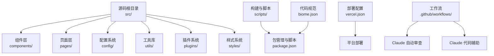
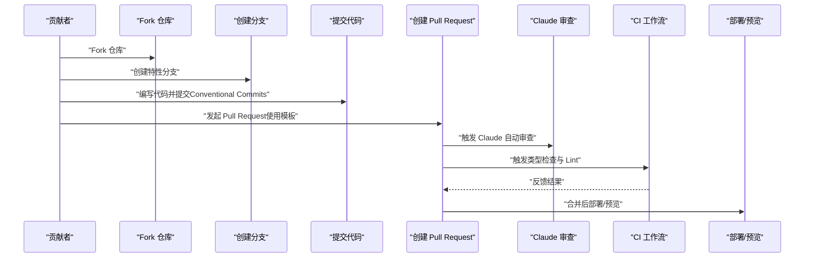
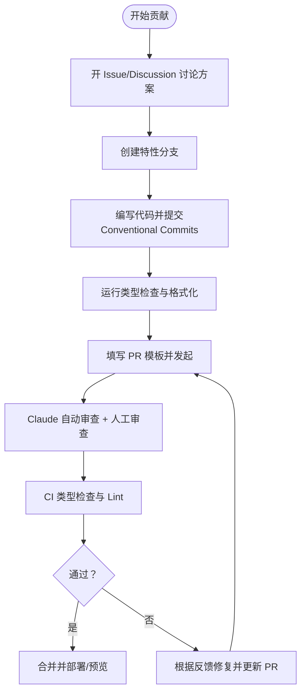
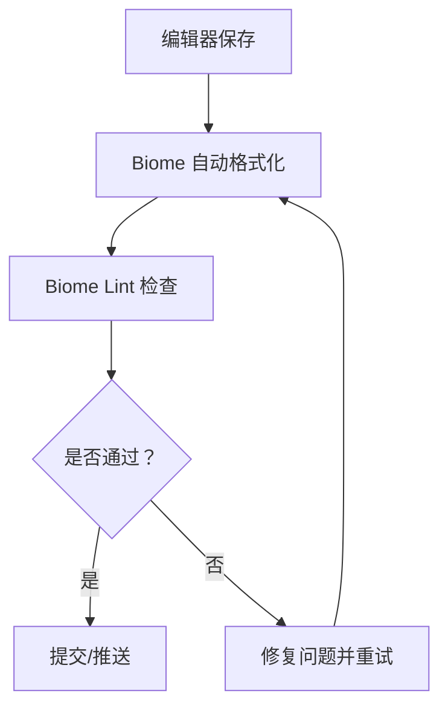
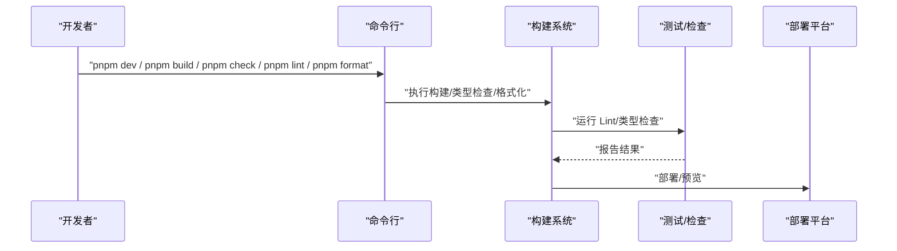
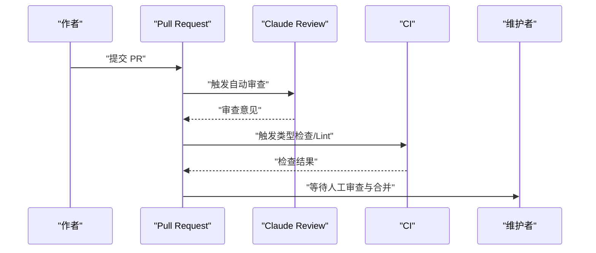
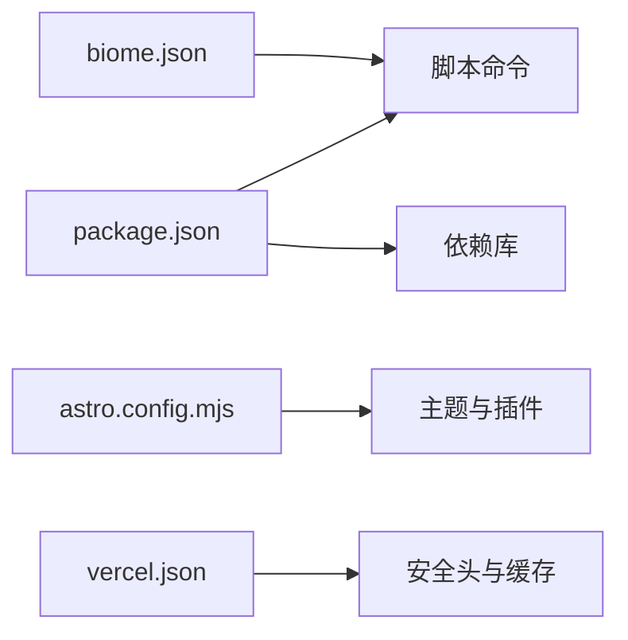

# 贡献指南

<cite>
**本文引用的文件**
- [CONTRIBUTING.md](file://CONTRIBUTING.md)
- [LICENSE](file://LICENSE)
- [.github/pull_request_template.md](file://.github/pull_request_template.md)
- [package.json](file://package.json)
- [biome.json](file://biome.json)
- [README.md](file://README.md)
- [astro.config.mjs](file://astro.config.mjs)
- [src/config/expressiveCodeConfig.ts](file://src/config/expressiveCodeConfig.ts)
- [scripts/build-vectorize-index.js](file://scripts/build-vectorize-index.js)
- [.trae/skills/fqzlr-blog/SKILL.md](file://.trae/skills/fqzlr-blog/SKILL.md)
- [vercel.json](file://vercel.json)
- [.github/workflows/claude.yml](file://.github/workflows/claude.yml)
- [.github/workflows/claude-review.yml](file://.github/workflows/claude-review.yml)
</cite>

## 目录
1. [简介](#简介)
2. [项目结构](#项目结构)
3. [核心组件](#核心组件)
4. [架构总览](#架构总览)
5. [详细组件分析](#详细组件分析)
6. [依赖分析](#依赖分析)
7. [性能考虑](#性能考虑)
8. [故障排查指南](#故障排查指南)
9. [结论](#结论)
10. [附录](#附录)

## 简介
本贡献指南面向希望参与 Firefly-Mod 项目的开发者，涵盖开源协议与版权要求、贡献流程、代码规范与质量标准、开发环境搭建与测试流程、问题报告与功能请求规范、代码审查流程与社区参与方式，以及维护者职责与治理结构。项目采用 MIT 许可证，鼓励在遵循许可证条款的前提下进行协作。

## 项目结构
该项目基于 Astro + Svelte 的静态站点与边缘计算（Cloudflare Workers/Vercel）混合架构，包含前端组件、配置系统、内容层、构建与部署脚本、以及 GitHub Actions 自动化工作流。贡献者应重点关注以下目录与文件：
- 源码与组件：src/components、src/pages、src/config、src/utils、src/plugins、src/styles
- 配置与主题：astro.config.mjs、src/config/expressiveCodeConfig.ts
- 构建与脚本：scripts/、package.json、biome.json
- 部署与平台：vercel.json、wrangler.toml（Cloudflare Workers）、.github/workflows/

图表来源
- [README.md:32-82](file://README.md#L32-L82)
- [astro.config.mjs:52-99](file://astro.config.mjs#L52-L99)
- [src/config/expressiveCodeConfig.ts:1-32](file://src/config/expressiveCodeConfig.ts#L1-L32)
- [package.json:1-112](file://package.json#L1-L112)
- [biome.json:1-66](file://biome.json#L1-L66)
- [vercel.json:1-39](file://vercel.json#L1-L39)

章节来源
- [README.md:32-82](file://README.md#L32-L82)
- [.trae/skills/fqzlr-blog/SKILL.md:40-252](file://.trae/skills/fqzlr-blog/SKILL.md#L40-L252)

## 核心组件
- 贡献流程与规范
  - 提交前沟通：重大变更需先开 Issue 或 Discussion 讨论方向一致性
  - PR 聚焦单一目的，使用 Conventional Commits 规范
  - 提交前运行类型检查与格式化命令
- 代码规范与质量
  - 使用 Biome 进行格式化与 Lint，推荐在 IDE 中启用自动格式化与导入整理
  - 针对 Astro/Svelte/Vue 等框架的规则覆盖与忽略策略已在配置中明确
- 开发与构建
  - 开发服务器、构建、预览、类型检查、图标生成、向量索引构建等常用命令
  - 构建流程：图标生成 → Astro 构建 → Pagefind 索引生成
- 部署与平台
  - Vercel 部署配置与安全头设置
  - Cloudflare Workers 与 KV/Vectorize/AI 绑定（需在 Dashboard 创建资源）

章节来源
- [CONTRIBUTING.md:5-20](file://CONTRIBUTING.md#L5-L20)
- [package.json:5-18](file://package.json#L5-L18)
- [biome.json:20-66](file://biome.json#L20-L66)
- [README.md:32-82](file://README.md#L32-L82)
- [vercel.json:1-39](file://vercel.json#L1-L39)

## 架构总览
下图展示贡献者从 Fork 到 PR 合并的关键流程，以及 CI/CD 与平台部署的衔接。

图表来源
- [CONTRIBUTING.md:5-20](file://CONTRIBUTING.md#L5-L20)
- [.github/pull_request_template.md:1-38](file://.github/pull_request_template.md#L1-L38)
- [.github/workflows/claude-review.yml:1-46](file://.github/workflows/claude-review.yml#L1-L46)
- [.github/workflows/claude.yml:1-43](file://.github/workflows/claude.yml#L1-L43)
- [README.md:126-136](file://README.md#L126-L136)

## 详细组件分析

### 贡献流程与 PR 模板
- 提交前沟通：重大改动需先开 Issue/Discussion，确保与项目方向一致
- PR 聚焦单一目标，使用 Conventional Commits，便于历史清晰
- 提交前运行类型检查与格式化命令
- PR 模板包含类型选择、自检清单、关联 Issue、变更描述、测试说明、截图与附加说明

图表来源
- [CONTRIBUTING.md:5-20](file://CONTRIBUTING.md#L5-L20)
- [.github/pull_request_template.md:1-38](file://.github/pull_request_template.md#L1-L38)
- [.github/workflows/claude-review.yml:1-46](file://.github/workflows/claude-review.yml#L1-L46)

章节来源
- [CONTRIBUTING.md:5-20](file://CONTRIBUTING.md#L5-L20)
- [.github/pull_request_template.md:1-38](file://.github/pull_request_template.md#L1-L38)

### 代码规范与质量标准
- 使用 Biome 进行格式化与 Lint，启用导入整理与推荐规则
- 针对 Astro/Svelte/Vue 的规则覆盖与忽略策略已在配置中明确
- 建议在 IDE 中启用自动格式化与导入整理，减少手动干预
- 代码高亮主题与折叠等配置由 expressive-code 驱动

图表来源
- [biome.json:20-66](file://biome.json#L20-L66)
- [src/config/expressiveCodeConfig.ts:1-32](file://src/config/expressiveCodeConfig.ts#L1-L32)

章节来源
- [biome.json:20-66](file://biome.json#L20-L66)
- [src/config/expressiveCodeConfig.ts:1-32](file://src/config/expressiveCodeConfig.ts#L1-L32)

### 开发环境搭建与测试流程
- 安装与启动
  - 使用 pnpm（强制安装限制）
  - 开发服务器、构建、预览、类型检查、图标生成、向量索引构建等常用命令
- 测试与验证
  - 类型检查：Astro 类型检查与 TypeScript 类型检查
  - Lint 与格式化：Biome
  - 友链可达性巡检：Playwright 驱动的每日定时任务
- 部署
  - Vercel：构建命令、输出目录、安全头、Clean URLs
  - Cloudflare：Workers、KV/Vectorize/AI 绑定与 wrangler.toml 配置

图表来源
- [README.md:32-82](file://README.md#L32-L82)
- [package.json:5-18](file://package.json#L5-L18)
- [vercel.json:1-39](file://vercel.json#L1-L39)

章节来源
- [README.md:32-82](file://README.md#L32-L82)
- [package.json:5-18](file://package.json#L5-L18)
- [vercel.json:1-39](file://vercel.json#L1-L39)

### 问题报告与功能请求
- Issue 模板：建议在 Issue 中描述背景、期望行为、实际行为、复现步骤与环境信息
- Bug 报告：包含最小复现、日志/截图、版本信息与影响范围
- 功能提案：阐述动机、预期收益、实现思路与兼容性影响
- 与 PR 的关系：功能提案可在 PR 中进一步细化与落地

章节来源
- [.github/pull_request_template.md:1-38](file://.github/pull_request_template.md#L1-L38)
- [README.md:126-136](file://README.md#L126-L136)

### 代码审查标准与流程
- 审查清单
  - 是否聚焦单一目标
  - 是否遵循 Conventional Commits
  - 是否通过类型检查与 Lint
  - 是否提供测试说明与截图（UI 变更）
  - 是否更新相关文档与配置
- AI 辅助审查
  - Claude Review 工作流自动对 PR 进行代码审查
  - Claude 代码工作流支持在评论中提及 @claude 获取 AI 响应
- 反馈处理与合并
  - 根据审查意见迭代修复
  - 通过后由维护者合并至主分支

图表来源
- [.github/workflows/claude-review.yml:1-46](file://.github/workflows/claude-review.yml#L1-L46)
- [.github/workflows/claude.yml:1-43](file://.github/workflows/claude.yml#L1-L43)
- [CONTRIBUTING.md:5-20](file://CONTRIBUTING.md#L5-L20)

章节来源
- [.github/workflows/claude-review.yml:1-46](file://.github/workflows/claude-review.yml#L1-L46)
- [.github/workflows/claude.yml:1-43](file://.github/workflows/claude.yml#L1-L43)
- [CONTRIBUTING.md:5-20](file://CONTRIBUTING.md#L5-L20)

### 社区参与与治理
- 讨论区与 Issue：重大变更前先开 Discussion/Issue 讨论
- 文档改进：更新 README、配置说明与贡献指南
- 翻译贡献：国际化文件位于 src/i18n/，按现有语言文件扩展
- 维护者职责：负责审查 PR、发布版本、维护 CI/CD 与平台配置

章节来源
- [CONTRIBUTING.md:5-20](file://CONTRIBUTING.md#L5-L20)
- [.trae/skills/fqzlr-blog/SKILL.md:40-252](file://.trae/skills/fqzlr-blog/SKILL.md#L40-L252)

## 依赖分析
- 包管理与脚本
  - 使用 pnpm，强制安装限制
  - 常用脚本：dev、build、preview、check、type-check、format、lint、icons、build-index
- 代码规范
  - Biome 配置启用格式化与 Lint，针对不同文件类型与框架的规则覆盖
- 构建与插件
  - Astro 配置启用图像优化、实验性队列渲染与 expressive-code 主题
- 部署与平台
  - Vercel 配置安全头与缓存策略
  - Cloudflare Workers 与 KV/Vectorize/AI 绑定（需在 Dashboard 创建资源）

图表来源
- [package.json:1-112](file://package.json#L1-L112)
- [biome.json:1-66](file://biome.json#L1-L66)
- [astro.config.mjs:52-99](file://astro.config.mjs#L52-L99)
- [vercel.json:1-39](file://vercel.json#L1-L39)

章节来源
- [package.json:1-112](file://package.json#L1-L112)
- [biome.json:1-66](file://biome.json#L1-L66)
- [astro.config.mjs:52-99](file://astro.config.mjs#L52-L99)
- [vercel.json:1-39](file://vercel.json#L1-L39)

## 性能考虑
- 构建性能
  - 实验性队列渲染已启用，有助于页面切换性能优化
  - 图像优化配置启用，建议合理设置响应式布局
- 代码质量
  - Biome 推荐规则与导入整理可减少冗余与潜在性能问题
- 部署性能
  - Vercel 安全头与缓存策略提升安全性与加载速度
  - Cloudflare Workers 与 KV/Vectorize/AI 绑定需合理配置维度与批大小

章节来源
- [astro.config.mjs:52-99](file://astro.config.mjs#L52-L99)
- [biome.json:20-66](file://biome.json#L20-L66)
- [vercel.json:1-39](file://vercel.json#L1-L39)

## 故障排查指南
- 常见问题
  - pnpm 版本不匹配：确保使用 pnpm（preinstall 限制）
  - 类型检查失败：运行 pnpm check 或 pnpm type-check
  - Lint 错误：运行 pnpm lint 或 pnpm format
  - 构建失败：确认图标生成脚本与 Pagefind 步骤
- 友链巡检
  - 使用 Playwright 的定时任务进行可达性巡检，异常自动创建 Issue
- 平台部署
  - Cloudflare：确认 KV/Vectorize/AI 绑定与 Dashboard 资源创建
  - Vercel：确认构建命令、输出目录与安全头配置

章节来源
- [README.md:32-82](file://README.md#L32-L82)
- [README.md:126-136](file://README.md#L126-L136)
- [vercel.json:1-39](file://vercel.json#L1-L39)

## 结论
本指南总结了 Firefly-Mod 项目的贡献流程、代码规范、开发与部署实践、审查与治理机制。遵循 MIT 许可证条款与贡献流程，结合 Biome 与 CI/CD 工具链，可高效协作并保持代码质量与一致性。

## 附录
- 开源协议与版权
  - 许可证：MIT
  - 版权归属：saicaca、CuteLeaf
- 常用命令速查
  - 开发：pnpm dev
  - 构建：pnpm build
  - 预览：pnpm preview
  - 类型检查：pnpm check / pnpm type-check
  - 格式化：pnpm format
  - Lint：pnpm lint
  - 图标生成：pnpm icons
  - 向量索引：pnpm build-index
- 配置与主题
  - expressive-code 主题与折叠配置
  - Astro 图像优化与实验性选项
  - Vercel 安全头与缓存策略

章节来源
- [LICENSE:1-23](file://LICENSE#L1-L23)
- [README.md:32-82](file://README.md#L32-L82)
- [src/config/expressiveCodeConfig.ts:1-32](file://src/config/expressiveCodeConfig.ts#L1-L32)
- [astro.config.mjs:52-99](file://astro.config.mjs#L52-L99)
- [vercel.json:1-39](file://vercel.json#L1-L39)