# 内容显示配置

<cite>
**本文档引用的文件**
- [coverImageConfig.ts](file://src/config/coverImageConfig.ts)
- [fontConfig.ts](file://src/config/fontConfig.ts)
- [sponsorConfig.ts](file://src/config/sponsorConfig.ts)
- [licenseConfig.ts](file://src/config/licenseConfig.ts)
- [config/index.ts](file://src/config/index.ts)
- [config/types.ts](file://src/types/config.ts)
- [CoverImage.astro](file://src/components/common/CoverImage.astro)
- [FontManager.astro](file://src/components/features/FontManager.astro)
- [License.astro](file://src/components/misc/License.astro)
- [sponsor.css](file://src/styles/pages/sponsor.css)
- [PostPage.astro](file://src/components/layout/PostPage.astro)
- [image-utils.ts](file://src/utils/image-utils.ts)
- [astro.config.mjs](file://astro.config.mjs)
</cite>

## 目录
1. [简介](#简介)
2. [项目结构](#项目结构)
3. [核心组件](#核心组件)
4. [架构概览](#架构概览)
5. [详细组件分析](#详细组件分析)
6. [依赖关系分析](#依赖关系分析)
7. [性能考虑](#性能考虑)
8. [故障排除指南](#故障排除指南)
9. [结论](#结论)

## 简介

本文档深入解析博客系统的"内容显示配置"，涵盖封面图配置、字体配置、赞助商配置、许可证配置等核心显示功能。通过对配置文件、组件实现和工具函数的全面分析，为开发者提供完整的配置指南和最佳实践。

该系统采用模块化的配置管理方式，通过统一的配置索引文件导出所有配置项，配合专门的组件实现配置逻辑，实现了高度可定制的内容显示效果。

## 项目结构

内容显示配置相关的文件组织遵循清晰的模块化原则：

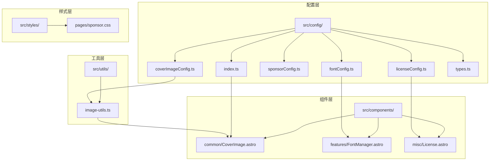

**图表来源**
- [config/index.ts:1-66](file://src/config/index.ts#L1-L66)
- [config/types.ts:475-483](file://src/types/config.ts#L475-L483)

**章节来源**
- [config/index.ts:1-66](file://src/config/index.ts#L1-L66)
- [config/types.ts:1-100](file://src/types/config.ts#L1-L100)

## 核心组件

### 配置文件架构

系统采用强类型的配置管理模式，所有配置项都通过TypeScript接口定义，确保类型安全性和开发体验。

#### 配置类型系统

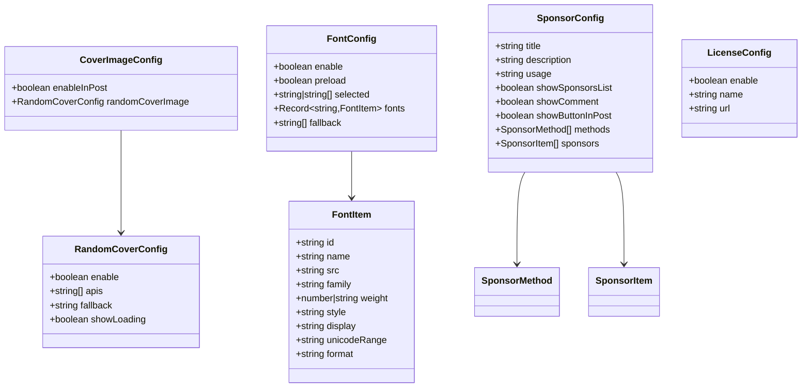

**图表来源**
- [config/types.ts:475-483](file://src/types/config.ts#L475-L483)
- [config/types.ts:462-468](file://src/types/config.ts#L462-L468)
- [config/types.ts:442-459](file://src/types/config.ts#L442-L459)
- [config/types.ts:297-301](file://src/types/config.ts#L297-L301)

### 统一配置导出

配置索引文件提供了统一的导出接口，简化了组件导入流程：

| 配置类别 | 导出文件 | 主要用途 |
|---------|---------|----------|
| 样式配置 | backgroundWallpaper, calendarConfig | 页面装饰和日历功能 |
| 功能配置 | commentConfig, expressiveCodeConfig, fontConfig | 核心功能开关 |
| 组件配置 | musicPlayerConfig, navBarConfig, pioConfig | 交互组件配置 |
| 布局配置 | sidebarLayoutConfig, siteConfig, skillsConfig | 页面布局控制 |

**章节来源**
- [config/index.ts:37-66](file://src/config/index.ts#L37-L66)

## 架构概览

内容显示配置系统采用"配置驱动"的设计理念，通过配置文件定义行为，组件负责实现具体功能。

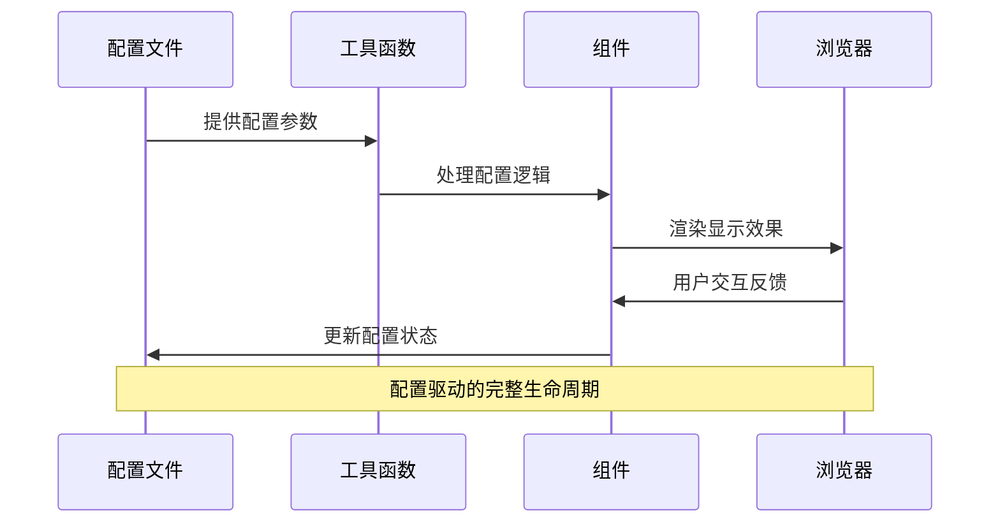

**图表来源**
- [coverImageConfig.ts:18-36](file://src/config/coverImageConfig.ts#L18-L36)
- [fontConfig.ts:2-84](file://src/config/fontConfig.ts#L2-L84)
- [sponsorConfig.ts:3-81](file://src/config/sponsorConfig.ts#L3-L81)

## 详细组件分析

### 封面图配置系统

#### 配置参数详解

封面图系统提供了灵活的封面图显示策略：

| 参数 | 类型 | 默认值 | 描述 |
|------|------|--------|------|
| enableInPost | boolean | true | 是否在文章详情页显示封面图 |
| randomCoverImage.enable | boolean | false | 是否启用随机封面图功能 |
| randomCoverImage.apis | string[] | 3个API | 随机图API列表 |
| randomCoverImage.fallback | string | "assets/images/cover.avif" | 回退图片路径 |
| randomCoverImage.showLoading | boolean | false | 是否显示加载动画 |

#### 实现机制分析

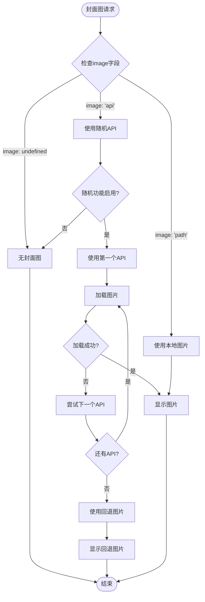

**图表来源**
- [coverImageConfig.ts:18-36](file://src/config/coverImageConfig.ts#L18-L36)
- [image-utils.ts:35-76](file://src/utils/image-utils.ts#L35-L76)

#### 组件实现细节

CoverImage组件实现了完整的封面图加载逻辑：

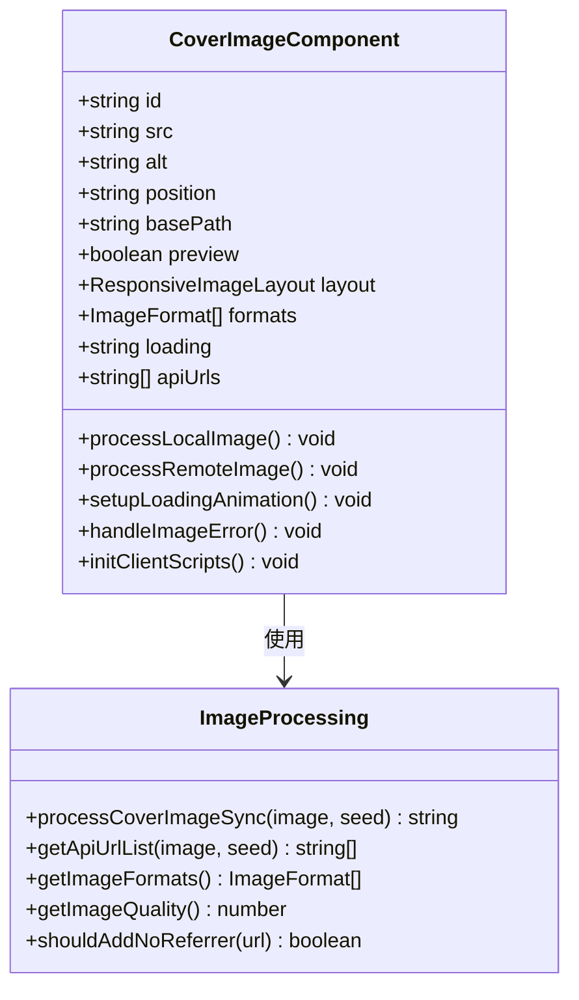

**图表来源**
- [CoverImage.astro:15-40](file://src/components/common/CoverImage.astro#L15-L40)
- [image-utils.ts:35-76](file://src/utils/image-utils.ts#L35-L76)

**章节来源**
- [coverImageConfig.ts:1-37](file://src/config/coverImageConfig.ts#L1-L37)
- [CoverImage.astro:1-274](file://src/components/common/CoverImage.astro#L1-L274)
- [image-utils.ts:1-125](file://src/utils/image-utils.ts#L1-L125)

### 字体配置系统

#### 字体管理架构

字体系统提供了多样的字体选择和优化方案：

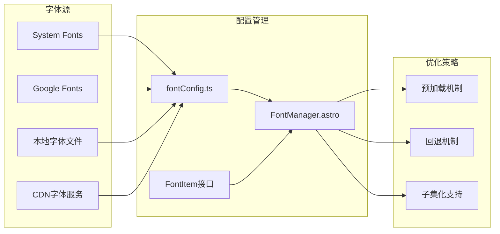

**图表来源**
- [fontConfig.ts:15-73](file://src/config/fontConfig.ts#L15-L73)
- [FontManager.astro:1-168](file://src/components/features/FontManager.astro#L1-L168)

#### 字体配置参数

| 参数 | 类型 | 默认值 | 描述 |
|------|------|--------|------|
| enable | boolean | true | 是否启用自定义字体 |
| preload | boolean | true | 是否预加载字体文件 |
| selected | string \| string[] | ["aazongyiyuan"] | 选中的字体ID |
| fonts.system | FontItem | 系统字体 | 系统默认字体 |
| fonts.inter | FontItem | Google Fonts | Inter字体 |
| fonts.aazongyiyuan | FontItem | 本地字体 | Aa综艺圆字体 |
| fallback | string[] | 系统回退字体 | 字体回退列表 |

#### 字体加载优化

FontManager组件实现了智能的字体加载策略：

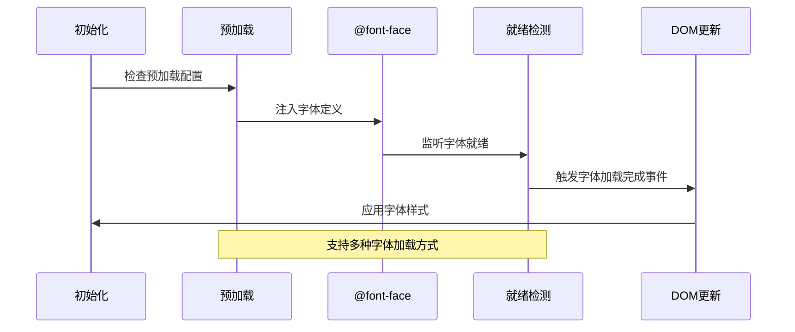

**图表来源**
- [FontManager.astro:101-116](file://src/components/features/FontManager.astro#L101-L116)
- [FontManager.astro:154-167](file://src/components/features/FontManager.astro#L154-L167)

**章节来源**
- [fontConfig.ts:1-85](file://src/config/fontConfig.ts#L1-L85)
- [FontManager.astro:1-168](file://src/components/features/FontManager.astro#L1-L168)

### 赞助商配置系统

#### 配置结构设计

赞助系统提供了完整的赞助展示解决方案：

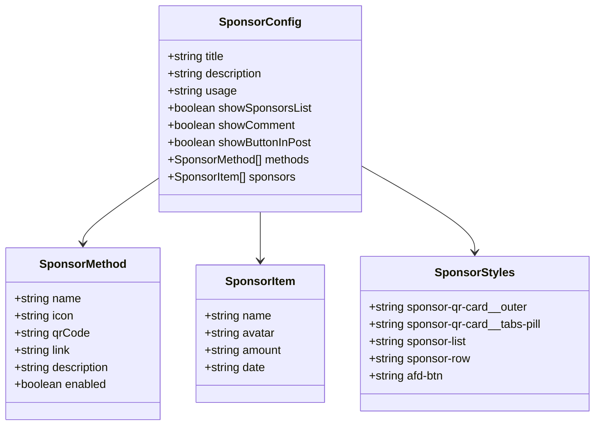

**图表来源**
- [sponsorConfig.ts:3-81](file://src/config/sponsorConfig.ts#L3-L81)
- [sponsor.css:18-452](file://src/styles/pages/sponsor.css#L18-L452)

#### 赞助展示策略

系统支持多种赞助展示方式：

| 展示方式 | 配置参数 | 适用场景 |
|---------|---------|----------|
| 赞助列表 | showSponsorsList | 展示赞助者信息 |
| 支付方式 | methods[] | 提供多种支付渠道 |
| 评论集成 | showComment | 结合评论系统 |
| 文章底部 | showButtonInPost | 文章详情页展示 |

**章节来源**
- [sponsorConfig.ts:1-82](file://src/config/sponsorConfig.ts#L1-L82)
- [sponsor.css:1-452](file://src/styles/pages/sponsor.css#L1-L452)

### 许可证配置系统

#### 许可证显示机制

许可证系统提供了简洁的版权信息展示：

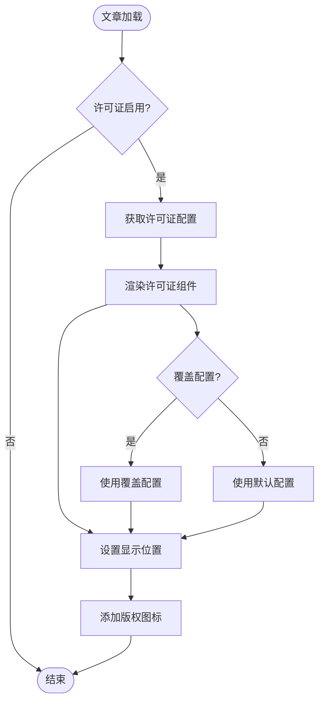

**图表来源**
- [licenseConfig.ts:3-10](file://src/config/licenseConfig.ts#L3-L10)
- [License.astro:20-26](file://src/components/misc/License.astro#L20-L26)

**章节来源**
- [licenseConfig.ts:1-11](file://src/config/licenseConfig.ts#L1-L11)
- [License.astro:1-71](file://src/components/misc/License.astro#L1-L71)

## 依赖关系分析

### 配置依赖图

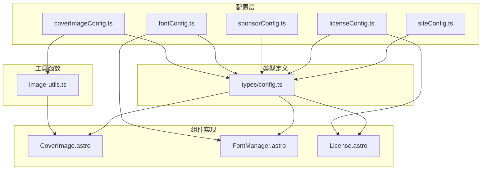

**图表来源**
- [config/types.ts:475-483](file://src/types/config.ts#L475-L483)
- [image-utils.ts:1-125](file://src/utils/image-utils.ts#L1-L125)

### 组件间协作

各组件通过配置文件建立松耦合的依赖关系：

| 组件 | 依赖配置 | 主要职责 |
|------|---------|----------|
| CoverImage.astro | coverImageConfig, siteConfig | 封面图渲染和加载 |
| FontManager.astro | fontConfig, siteConfig | 字体管理和优化 |
| License.astro | licenseConfig, profileConfig | 许可证信息展示 |
| PostPage.astro | siteConfig | 文章列表布局控制 |

**章节来源**
- [config/types.ts:462-468](file://src/types/config.ts#L462-L468)
- [config/types.ts:297-301](file://src/types/config.ts#L297-L301)

## 性能考虑

### 图片加载优化

系统实现了多层次的图片加载优化策略：

**图表来源**
- [PostPage.astro:74-76](file://src/components/layout/PostPage.astro#L74-L76)
- [image-utils.ts:78-106](file://src/utils/image-utils.ts#L78-L106)

### 字体加载优化

字体系统采用了先进的加载策略：

| 优化技术 | 实现方式 | 性能收益 |
|---------|---------|----------|
| 预加载 | `<link rel="preload">` | 减少首次渲染延迟 |
| font-display | `swap`策略 | 避免字体闪烁 |
| @font-face | 动态注入 | 支持多种字体格式 |
| 回退机制 | 系统字体回退 | 确保显示稳定性 |

### 响应式设计

系统支持多设备的响应式显示：

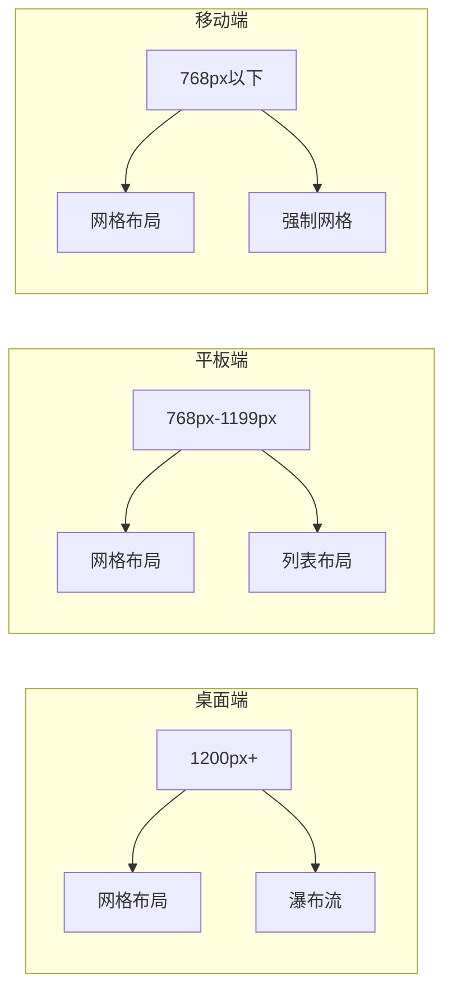

**图表来源**
- [PostPage.astro:82-109](file://src/components/layout/PostPage.astro#L82-L109)

## 故障排除指南

### 常见问题诊断

#### 封面图加载失败

**症状**: 封面图显示为回退图片或加载动画持续

**可能原因**:
1. 随机API不可用
2. 网络连接问题
3. 图片格式不支持

**解决方案**:
1. 检查API可用性
2. 验证网络连接
3. 确认图片格式支持

#### 字体加载异常

**症状**: 页面显示为系统默认字体

**可能原因**:
1. 字体文件加载失败
2. CORS跨域问题
3. 字体格式不兼容

**解决方案**:
1. 检查字体文件路径
2. 配置正确的CORS头
3. 使用兼容的字体格式

#### 赞助信息显示问题

**症状**: 赞助列表不显示或支付方式不可用

**可能原因**:
1. 配置参数错误
2. 图片资源缺失
3. JavaScript错误

**解决方案**:
1. 验证配置文件语法
2. 检查图片资源路径
3. 查看浏览器控制台错误

**章节来源**
- [CoverImage.astro:216-274](file://src/components/common/CoverImage.astro#L216-L274)
- [FontManager.astro:154-167](file://src/components/features/FontManager.astro#L154-L167)

## 结论

内容显示配置系统通过模块化的设计和强类型的安全保障，为博客平台提供了灵活而强大的显示控制能力。系统的关键优势包括：

1. **配置驱动**: 通过配置文件精确控制显示行为
2. **性能优化**: 实现了多层次的加载优化策略
3. **类型安全**: TypeScript接口确保配置的正确性
4. **响应式设计**: 支持多设备的自适应显示
5. **扩展性强**: 模块化架构便于功能扩展

该系统为开发者提供了完整的配置指南和最佳实践，能够满足各种内容展示需求，同时保持良好的性能表现和用户体验。