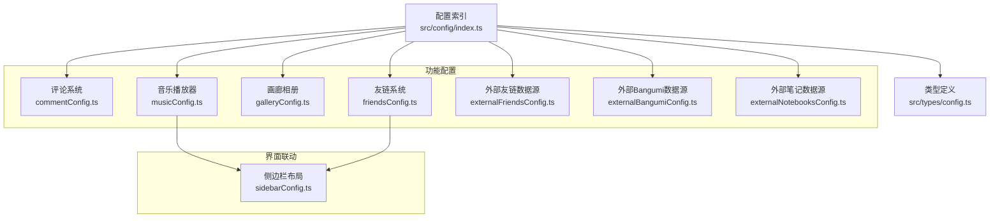
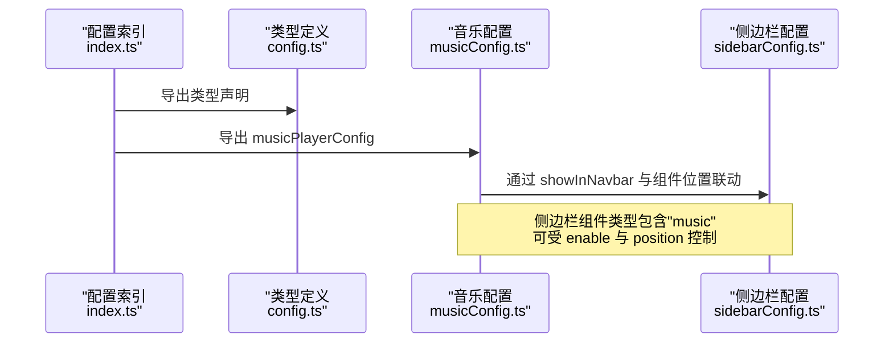
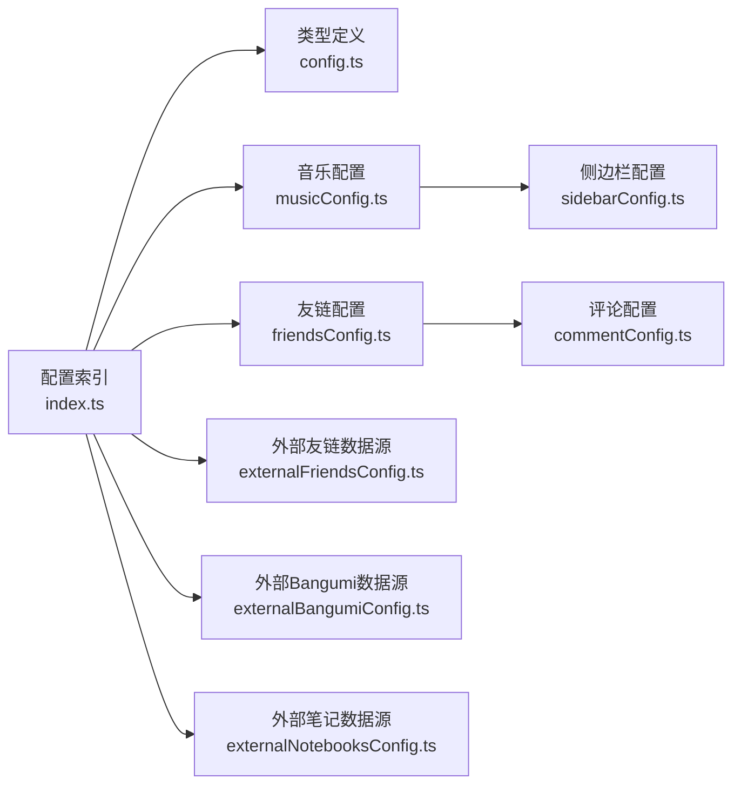

# 功能模块配置

<cite>
**本文引用的文件**
- [commentConfig.ts](file://src/config/commentConfig.ts)
- [musicConfig.ts](file://src/config/musicConfig.ts)
- [galleryConfig.ts](file://src/config/galleryConfig.ts)
- [friendsConfig.ts](file://src/config/friendsConfig.ts)
- [index.ts](file://src/config/index.ts)
- [config.ts](file://src/types/config.ts)
- [sidebarConfig.ts](file://src/config/sidebarConfig.ts)
- [externalFriendsConfig.ts](file://src/config/externalFriendsConfig.ts)
- [externalBangumiConfig.ts](file://src/config/externalBangumiConfig.ts)
- [externalNotebooksConfig.ts](file://src/config/externalNotebooksConfig.ts)
</cite>

## 目录
1. [简介](#简介)
2. [项目结构](#项目结构)
3. [核心组件](#核心组件)
4. [架构总览](#架构总览)
5. [详细组件分析](#详细组件分析)
6. [依赖分析](#依赖分析)
7. [性能考量](#性能考量)
8. [故障排查指南](#故障排查指南)
9. [结论](#结论)
10. [附录](#附录)

## 简介
本文件面向“功能模块配置”的使用与维护，聚焦以下模块的配置说明与最佳实践：
- 评论系统：commentConfig.ts
- 音乐播放器：musicConfig.ts
- 画廊相册：galleryConfig.ts
- 友链系统：friendsConfig.ts（含页面配置与友链列表）
- 外部数据源：externalFriendsConfig.ts、externalBangumiConfig.ts、externalNotebooksConfig.ts
- 配置导出索引：index.ts
- 类型定义：config.ts
- 侧边栏联动：sidebarConfig.ts

目标涵盖：
- 各模块启用/禁用开关、第三方服务集成与密钥配置
- 配置项的含义、取值范围与默认行为
- 最佳实践与安全建议
- 模块间依赖关系与潜在冲突
- 调试方法与常见问题定位

## 项目结构
功能模块配置集中于 src/config 目录，类型定义位于 src/types/config.ts，统一导出入口位于 src/config/index.ts。模块与侧边栏、导航栏存在运行时联动。

图表来源
- [index.ts:1-66](file://src/config/index.ts#L1-L66)
- [config.ts:304-356](file://src/types/config.ts#L304-L356)
- [musicConfig.ts:1-62](file://src/config/musicConfig.ts#L1-L62)
- [galleryConfig.ts:1-62](file://src/config/galleryConfig.ts#L1-L62)
- [friendsConfig.ts:1-396](file://src/config/friendsConfig.ts#L1-L396)
- [externalFriendsConfig.ts:1-9](file://src/config/externalFriendsConfig.ts#L1-L9)
- [externalBangumiConfig.ts:1-8](file://src/config/externalBangumiConfig.ts#L1-L8)
- [externalNotebooksConfig.ts:1-83](file://src/config/externalNotebooksConfig.ts#L1-L83)
- [sidebarConfig.ts:1-222](file://src/config/sidebarConfig.ts#L1-L222)

章节来源
- [index.ts:1-66](file://src/config/index.ts#L1-L66)
- [config.ts:304-356](file://src/types/config.ts#L304-L356)

## 核心组件
本节概述四大核心功能模块的配置要点与典型用法。

- 评论系统（commentConfig.ts）
  - 支持类型：none、twikoo、waline、giscus、disqus、artalk
  - 关键项：type、各平台子配置（如 envId、serverURL、repo、shortname 等）
  - 语言与访问量统计：lang、visitorCount
  - 使用建议：按需启用，注意隐私与合规；giscus 需正确配置仓库与分类

- 音乐播放器（musicConfig.ts）
  - 模式：meting（第三方 API）或 local（本地资源）
  - 关键项：mode、volume、playMode、showLyrics、showInNavbar
  - meting 子配置：api、server、type、id、auth、fallbackApis
  - 本地播放：playlist 数组（name、artist、url、cover、lrc）
  - 使用建议：合理设置默认音量与播放模式；本地资源需放置于 public 目录

- 画廊相册（galleryConfig.ts）
  - albums：相册元信息数组（id、name、description、date、location、tags、cover）
  - columnWidth：瀑布流最小列宽
  - networkAlbum：网络相册获取数量限制与默认数量
  - 使用建议：相册目录与 id 对应；图片格式遵循项目支持清单

- 友链系统（friendsConfig.ts）
  - 页面配置：friendsPageConfig（title、description、showCustomContent、showComment、randomizeSort、applyLink、siteInfo、notes）
  - 友链列表：FriendLink[]（title、imgurl、desc、siteurl、tags、weight、enabled）
  - 排序逻辑：getEnabledFriends（按 enabled 过滤，支持按 weight 或随机排序）
  - 使用建议：启用评论需先在 commentConfig.ts 配置；权重数值越大越靠前

章节来源
- [commentConfig.ts:1-79](file://src/config/commentConfig.ts#L1-L79)
- [musicConfig.ts:1-62](file://src/config/musicConfig.ts#L1-L62)
- [galleryConfig.ts:1-62](file://src/config/galleryConfig.ts#L1-L62)
- [friendsConfig.ts:1-396](file://src/config/friendsConfig.ts#L1-L396)

## 架构总览
功能模块配置通过统一导出入口供组件按需引入，类型定义确保配置项的强类型约束。音乐播放器与友链组件可通过侧边栏布局配置决定是否在导航栏或侧边栏显示。

图表来源
- [index.ts:56-56](file://src/config/index.ts#L56-L56)
- [config.ts:793-841](file://src/types/config.ts#L793-L841)
- [sidebarConfig.ts:58-66](file://src/config/sidebarConfig.ts#L58-L66)

## 详细组件分析

### 评论系统配置（commentConfig.ts）
- 启用/禁用与类型
  - type：none/twikoo/waline/giscus/disqus/artalk
  - 不同类型对应不同的子配置对象（twikoo、waline、giscus、disqus、artalk）
- 关键配置项
  - twikoo：envId（服务端地址）、lang、visitorCount
  - waline：serverURL、lang、emoji 列表、login（enable/force/disable）、visitorCount
  - artalk：server、locale、visitorCount
  - giscus：repo、repoId、category、categoryId、mapping、strict、reactionsEnabled、emitMetadata、inputPosition、lang、loading
  - disqus：shortname
- 第三方服务与密钥
  - giscus：需在 GitHub Discussions 中创建仓库与分类，获取 repo、repoId、categoryId 等
  - twikoo：envId 指向后端环境地址
  - waline：serverURL 指向后端地址
  - disqus：shortname 为站点短名
- 最佳实践与安全
  - 选择合规的评论服务，关注隐私政策与数据留存
  - giscus 与 disqus 为托管服务，无需自建后端；twikoo/waline 需自行部署后端
  - 避免在前端暴露敏感密钥；必要时通过代理或后端转发
- 冲突与依赖
  - 同时启用多个评论系统通常无直接冲突，但页面仅展示当前 type 对应的实现
  - 若启用评论页面，需确保对应第三方服务可用且配置正确

章节来源
- [commentConfig.ts:1-79](file://src/config/commentConfig.ts#L1-L79)
- [config.ts:304-356](file://src/types/config.ts#L304-L356)

### 音乐播放器配置（musicConfig.ts）
- 模式与入口
  - mode：meting 或 local
  - showInNavbar：是否在导航栏显示入口
- 关键配置项
  - volume：默认音量（0-1）
  - playMode：list/one/random
  - showLyrics：是否显示歌词
  - meting：api、server（netease/tencent/kugou/xiami/baidu）、type（song/playlist/album/search/artist）、id、auth、fallbackApis
  - local：playlist（name、artist、url、cover、lrc）
- 与侧边栏联动
  - 侧边栏组件类型包含 "music"，其 enable 与 position 决定是否显示与位置
- 最佳实践与安全
  - meting API 为第三方接口，建议配置 fallbackApis 以提升稳定性
  - 本地资源需放置于 public 目录，确保静态资源可访问
  - 合理设置默认音量与播放模式，避免影响用户体验
- 冲突与依赖
  - 与导航栏/侧边栏组件共同决定 UI 展示
  - 与外部音乐服务的可用性相关，需监控第三方 API 状态

章节来源
- [musicConfig.ts:1-62](file://src/config/musicConfig.ts#L1-L62)
- [config.ts:793-841](file://src/types/config.ts#L793-L841)
- [sidebarConfig.ts:58-66](file://src/config/sidebarConfig.ts#L58-L66)

### 画廊相册配置（galleryConfig.ts）
- 相册元信息
  - albums：每项包含 id、name、description、date、location、tags、cover
  - id 与 public/gallery 下的目录名一致
- 布局与网络相册
  - columnWidth：瀑布流最小列宽
  - networkAlbum：maxQuantity（单次获取上限）、defaultQuantity（默认获取数量）
- 最佳实践与安全
  - 图片格式遵循项目支持清单（jpg/png/webp/avif/gif）
  - 确保 public/gallery 下对应相册目录存在且图片可访问
- 冲突与依赖
  - 与相册页面组件配合使用，依赖 public 目录下的静态资源

章节来源
- [galleryConfig.ts:1-62](file://src/config/galleryConfig.ts#L1-L62)
- [config.ts:890-901](file://src/types/config.ts#L890-L901)

### 友链系统配置（friendsConfig.ts）
- 页面配置（friendsPageConfig）
  - title、description、showCustomContent、showComment、randomizeSort、applyLink、siteInfo、notes
- 友链列表（FriendLink[]）
  - title、imgurl、desc、siteurl、tags、weight、enabled
- 排序逻辑（getEnabledFriends）
  - 过滤 enabled=true 的友链
  - 若 randomizeSort=true，按随机顺序返回；否则按 weight 降序
- 与评论系统的依赖
  - showComment 需先在 commentConfig.ts 启用评论系统
- 最佳实践与安全
  - 权重越大越靠前；启用随机排序会忽略权重
  - applyLink 指向友链申请模板，便于自动化流程
  - siteInfo 用于申请指南弹窗，提供站点基本信息
- 冲突与依赖
  - 与友链页面组件配合使用；若启用评论，需确保第三方服务可用

章节来源
- [friendsConfig.ts:1-396](file://src/config/friendsConfig.ts#L1-L396)
- [config.ts:782-791](file://src/types/config.ts#L782-L791)
- [config.ts:759-767](file://src/types/config.ts#L759-L767)

### 外部数据源配置
- 外部友链数据源（externalFriendsConfig.ts）
  - enable：是否启用
  - gistId：GitHub Gist ID
  - fileName：friends.json
- 外部 Bangumi 数据源（externalBangumiConfig.ts）
  - enable：是否启用
  - gistId：GitHub Gist ID
  - fileName：bangumi.json
- 外部笔记数据源（externalNotebooksConfig.ts）
  - enable：是否启用
  - notebookGists：笔记本名到 Gist ID 的映射
  - templates：模板集合（id、icon、name、title、content）
  - adminPasswordHash：后台登录密码 SHA-256 哈希
  - githubToken：优先从环境变量读取
- 最佳实践与安全
  - Gist 为公开或私有均可，私有需提供有效 token
  - 密码哈希与 token 应通过环境变量注入，避免硬编码
- 冲突与依赖
  - 与对应页面组件配合使用；需确保网络可达与权限正确

章节来源
- [externalFriendsConfig.ts:1-9](file://src/config/externalFriendsConfig.ts#L1-L9)
- [externalBangumiConfig.ts:1-8](file://src/config/externalBangumiConfig.ts#L1-L8)
- [externalNotebooksConfig.ts:1-83](file://src/config/externalNotebooksConfig.ts#L1-L83)

## 依赖分析
- 统一导出与类型约束
  - index.ts 将各配置模块统一导出，组件通过单一入口引入，降低重复导入成本
  - config.ts 定义了各模块的类型，保证配置项的强类型校验
- 运行时联动
  - sidebarConfig.ts 中的组件配置与 musicConfig.ts 的 showInNavbar 共同决定音乐播放器的 UI 展示
  - friendsPageConfig 的 showComment 依赖 commentConfig.ts 的启用状态
- 外部依赖
  - 评论系统依赖第三方服务（如 GitHub Discussions、Twikoo/Waline 后端、Disqus）
  - 音乐播放器依赖 meting API 或本地静态资源
  - 画廊相册依赖 public/gallery 下的静态资源
  - 外部数据源依赖 GitHub Gist 与可选的 GitHub Token

图表来源
- [index.ts:37-66](file://src/config/index.ts#L37-L66)
- [config.ts:304-356](file://src/types/config.ts#L304-L356)
- [sidebarConfig.ts:58-66](file://src/config/sidebarConfig.ts#L58-L66)
- [friendsConfig.ts:16-17](file://src/config/friendsConfig.ts#L16-L17)

章节来源
- [index.ts:37-66](file://src/config/index.ts#L37-L66)
- [config.ts:304-356](file://src/types/config.ts#L304-L356)

## 性能考量
- 音乐播放器
  - meting API：建议配置备用 API，降低单点故障风险
  - 本地资源：合理组织音频与封面资源，避免过大文件导致加载缓慢
- 画廊相册
  - 控制瀑布流列宽与图片尺寸，平衡视觉密度与加载性能
  - 网络相册获取数量限制与默认数量需结合带宽与延迟权衡
- 评论系统
  - 选择就近的托管服务或自建后端，减少跨域与网络抖动
  - 合理设置语言与访问量统计，避免不必要的请求
- 外部数据源
  - Gist 请求频率与缓存策略需结合实际流量评估
  - 私有 Gist 需确保 token 有效与网络稳定

## 故障排查指南
- 评论系统
  - 症状：评论区不可用或报错
  - 排查：检查 commentConfig.ts 的 type 与对应子配置是否正确；giscus 需确认仓库、分类与 ID；twikoo/waline 需确认后端地址与网络连通性
- 音乐播放器
  - 症状：无法播放或显示空白
  - 排查：确认 musicConfig.ts 的 mode 与资源路径；meting API 是否可用；fallbackApis 是否配置；本地资源是否放置于 public 目录
- 画廊相册
  - 症状：相册页面空白或图片不显示
  - 排查：确认 galleryConfig.ts 的 albums.id 与 public/gallery 下目录一致；图片格式是否受支持；columnWidth 是否过小导致溢出
- 友链系统
  - 症状：友链页面异常或评论未显示
  - 排查：friendsPageConfig 的 showComment 是否启用；commentConfig.ts 是否已配置；getEnabledFriends 的排序逻辑是否符合预期
- 外部数据源
  - 症状：外部数据未加载
  - 排查：externalFriendsConfig.ts/externalBangumiConfig.ts/externalNotebooksConfig.ts 的 gistId 与 fileName 是否正确；GitHub Token 是否有效；网络连通性与权限

章节来源
- [commentConfig.ts:1-79](file://src/config/commentConfig.ts#L1-L79)
- [musicConfig.ts:1-62](file://src/config/musicConfig.ts#L1-L62)
- [galleryConfig.ts:1-62](file://src/config/galleryConfig.ts#L1-L62)
- [friendsConfig.ts:1-396](file://src/config/friendsConfig.ts#L1-L396)
- [externalFriendsConfig.ts:1-9](file://src/config/externalFriendsConfig.ts#L1-L9)
- [externalBangumiConfig.ts:1-8](file://src/config/externalBangumiConfig.ts#L1-L8)
- [externalNotebooksConfig.ts:1-83](file://src/config/externalNotebooksConfig.ts#L1-L83)

## 结论
功能模块配置通过强类型定义与统一导出，提供了清晰、可维护的配置体系。评论系统、音乐播放器、画廊相册与友链系统均具备明确的启用/禁用开关与第三方服务集成点。建议在生产环境中：
- 优先使用托管型评论服务，简化运维复杂度
- 为音乐播放器配置备用 API 与本地资源兜底
- 严格管理外部数据源的凭据与缓存策略
- 通过侧边栏与页面配置精细化控制模块展示

## 附录
- 配置项速查
  - 评论系统：type、各平台子配置、语言与访问量统计
  - 音乐播放器：mode、volume、playMode、showLyrics、showInNavbar、meting/local 子配置
  - 画廊相册：albums、columnWidth、networkAlbum
  - 友链系统：friendsPageConfig、FriendLink[]、getEnabledFriends
  - 外部数据源：gistId、fileName、templates、adminPasswordHash、githubToken