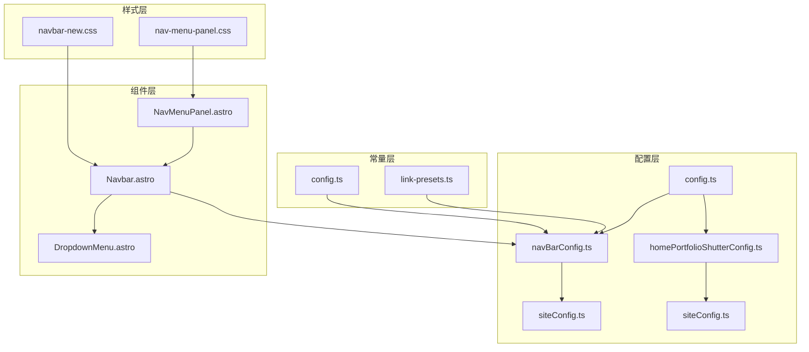
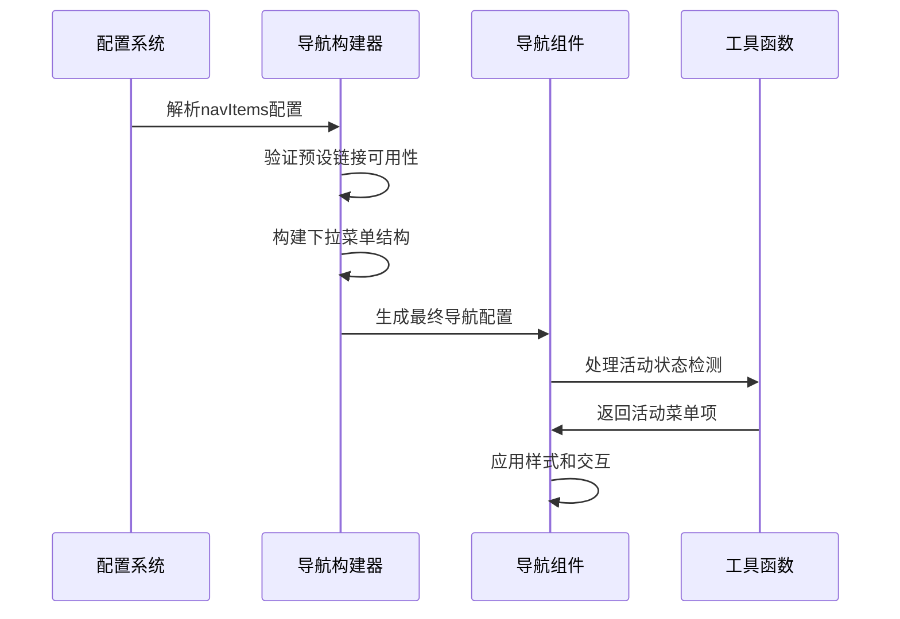
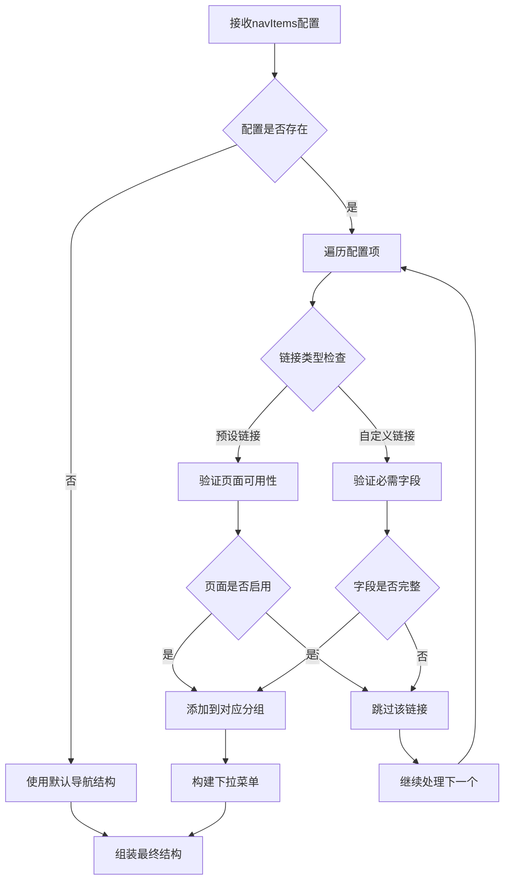
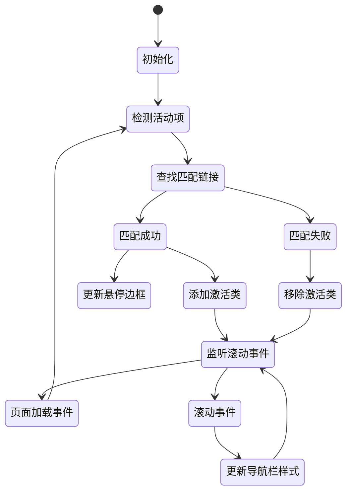
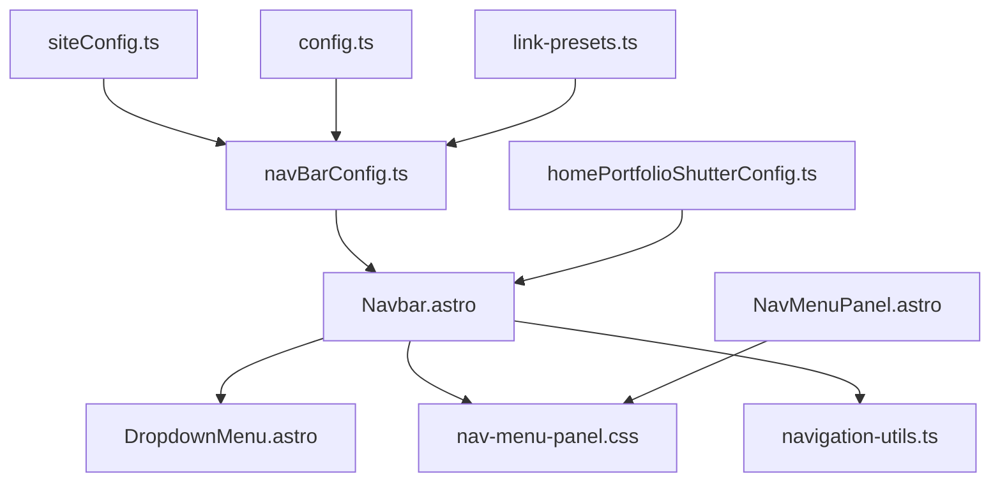

# 导航栏配置

<cite>
**本文档引用的文件**
- [navBarConfig.ts](file://src/config/navBarConfig.ts)
- [homePortfolioShutterConfig.ts](file://src/config/homePortfolioShutterConfig.ts)
- [siteConfig.ts](file://src/config/siteConfig.ts)
- [Navbar.astro](file://src/components/layout/Navbar.astro)
- [NavMenuPanel.astro](file://src/components/layout/NavMenuPanel.astro)
- [config.ts](file://src/types/config.ts)
- [link-presets.ts](file://src/constants/link-presets.ts)
- [navigation-utils.ts](file://src/utils/navigation-utils.ts)
- [nav-menu-panel.css](file://src/styles/layout/nav-menu-panel.css)
</cite>

## 目录
1. [简介](#简介)
2. [项目结构](#项目结构)
3. [核心组件](#核心组件)
4. [架构概览](#架构概览)
5. [详细组件分析](#详细组件分析)
6. [依赖关系分析](#依赖关系分析)
7. [性能考虑](#性能考虑)
8. [故障排除指南](#故障排除指南)
9. [结论](#结论)

## 简介

本文件详细介绍了博客系统的导航栏配置体系，包括导航菜单配置、作品集展示配置、自定义样式配置、响应式导航配置以及导航状态管理机制。文档基于实际代码实现，提供了完整的配置说明和最佳实践指导。

## 项目结构

导航栏配置涉及以下关键文件：

**图表来源**
- [navBarConfig.ts:1-391](file://src/config/navBarConfig.ts#L1-L391)
- [Navbar.astro:1-306](file://src/components/layout/Navbar.astro#L1-L306)
- [NavMenuPanel.astro:1-236](file://src/components/layout/NavMenuPanel.astro#L1-L236)

## 核心组件

### 导航栏配置核心功能

导航栏配置系统由三个主要组件构成：

1. **导航菜单配置** - 定义菜单项、链接地址、图标设置
2. **下拉菜单结构** - 管理多级菜单层次结构
3. **作品集展示配置** - 控制首页作品集轮播展示

### 导航菜单配置详解

导航菜单支持两种配置模式：

#### 预设链接配置
系统内置了丰富的预设链接类型，包括：
- 基础页面：首页、关于、归档、分类、标签等
- 社交功能：友链、留言簿、赞助、QQ群等
- 个人中心：日记、时刻、相册、音乐等
- 外部链接：跨站跳转支持

#### 自定义链接配置
支持完全自定义的链接配置，包括：
- 自定义名称和URL
- 图标设置
- 外部链接标记
- 分组归属（顶级、文章、联系我、我的）

**章节来源**
- [navBarConfig.ts:126-161](file://src/config/navBarConfig.ts#L126-L161)
- [navBarConfig.ts:174-263](file://src/config/navBarConfig.ts#L174-L263)
- [link-presets.ts:5-155](file://src/constants/link-presets.ts#L5-L155)

## 架构概览

导航栏系统采用模块化设计，各组件职责明确：

**图表来源**
- [navBarConfig.ts:174-263](file://src/config/navBarConfig.ts#L174-L263)
- [Navbar.astro:148-209](file://src/components/layout/Navbar.astro#L148-L209)

## 详细组件分析

### 导航栏配置构建器

导航栏配置构建器负责将配置转换为可渲染的导航结构：

#### 配置验证流程

**图表来源**
- [navBarConfig.ts:182-230](file://src/config/navBarConfig.ts#L182-L230)
- [navBarConfig.ts:51-98](file://src/config/navBarConfig.ts#L51-L98)

#### 默认导航结构
系统提供默认的导航结构，包含：
- 顶级导航：首页、收藏、文章下拉
- 文章下拉：归档、分类、文章列表
- 联系我下拉：友链、留言簿、QQ群
- 我的下拉：所有个人相关内容

**章节来源**
- [navBarConfig.ts:126-161](file://src/config/navBarConfig.ts#L126-L161)
- [navBarConfig.ts:269-380](file://src/config/navBarConfig.ts#L269-L380)

### 导航组件实现

导航组件负责渲染和交互逻辑：

#### 活动状态管理
导航组件实现了智能的活动状态检测机制：

**图表来源**
- [Navbar.astro:148-209](file://src/components/layout/Navbar.astro#L148-L209)
- [Navbar.astro:213-245](file://src/components/layout/Navbar.astro#L213-L245)

#### 响应式设计
导航组件支持多设备适配：

| 设备类型 | 断点 | 特性 |
|---------|------|------|
| 桌面端 | ≥1024px | 完整导航栏显示，悬停激活 |
| 平板端 | 768px-1023px | 导航栏简化，部分功能隐藏 |
| 移动端 | <768px | 抽屉菜单，汉堡按钮 |

**章节来源**
- [Navbar.astro:94-115](file://src/components/layout/Navbar.astro#L94-L115)
- [NavMenuPanel.astro:144-235](file://src/components/layout/NavMenuPanel.astro#L144-L235)

### 作品集展示配置

作品集展示配置控制首页的动态展示效果：

#### 配置参数说明
| 参数名 | 类型 | 描述 | 默认值 |
|--------|------|------|--------|
| enabled | boolean | 是否启用作品集展示 | true |
| kicker | string | 标语文字 | "The End" |
| title | string | 主标题 | "愿你每一天 都闪闪发光" |
| description | string | 描述文字 | "岁岁常欢愉，万事皆胜意" |
| scrollDistance | number | 滚动距离阈值 | 6000 |
| panels | array | 展示面板数组 | 5个面板 |
| interlude | object | 插入动画段 | 三层布局 |

#### 展示面板结构
每个面板包含：
- 标题和英文标题
- 描述文字
- 展示图片
- 替代文本

**章节来源**
- [homePortfolioShutterConfig.ts:22-91](file://src/config/homePortfolioShutterConfig.ts#L22-L91)

### 样式配置系统

导航栏支持多种样式定制选项：

#### 导航栏外观配置
- Logo设置：支持图标、本地图片、网络图片
- 标题配置：自定义导航栏标题
- 对齐方式：左对齐或居中对齐
- 主题跟随：图标和标题跟随主题色
- 固定导航：导航栏固定在顶部

#### 移动端抽屉样式
- 遮罩层：半透明黑色背景
- 侧滑动画：缓动曲线过渡
- 个人信息区域：头像、姓名、职业
- 链接样式：悬停效果、激活状态

**章节来源**
- [siteConfig.ts:109-131](file://src/config/siteConfig.ts#L109-L131)
- [nav-menu-panel.css:6-44](file://src/styles/layout/nav-menu-panel.css#L6-L44)

## 依赖关系分析

导航栏配置系统具有清晰的依赖层次：

**图表来源**
- [navBarConfig.ts:1-10](file://src/config/navBarConfig.ts#L1-L10)
- [Navbar.astro:1-12](file://src/components/layout/Navbar.astro#L1-L12)

### 组件耦合度分析

导航栏系统采用松耦合设计：
- 配置层与渲染层分离
- 依赖注入机制
- 类型安全保证
- 可测试性强

**章节来源**
- [config.ts:64-97](file://src/types/config.ts#L64-L97)
- [config.ts:260-279](file://src/types/config.ts#L260-L279)

## 性能考虑

### 导航性能优化策略

#### 配置构建优化
- 预设链接映射缓存
- 条件渲染减少DOM节点
- 懒加载非关键资源

#### 运行时性能优化
- requestAnimationFrame滚动处理
- 事件委托减少监听器数量
- CSS过渡动画硬件加速

#### 内存管理
- 事件处理器清理
- DOM引用及时释放
- 避免内存泄漏

### 最佳实践建议

1. **配置优化**
   - 合理使用预设链接而非自定义链接
   - 控制下拉菜单层级深度
   - 优化图标资源大小

2. **渲染优化**
   - 使用虚拟滚动处理大量链接
   - 实施防抖处理滚动事件
   - 合理使用CSS变量

3. **用户体验**
   - 提供加载状态指示
   - 实现快速跳转功能
   - 保持交互响应性

## 故障排除指南

### 常见问题及解决方案

#### 导航链接不显示
**症状**：配置的链接在导航栏中不出现
**可能原因**：
- 页面开关未启用
- 链接配置格式错误
- 预设链接键名不正确

**解决步骤**：
1. 检查 `siteConfig.pages` 中对应的页面开关
2. 验证 `navItems` 配置格式
3. 确认预设链接键名拼写正确

#### 活动状态不正确
**症状**：当前页面的导航项未高亮显示
**可能原因**：
- 路径匹配规则不正确
- 页面加载事件未触发
- 样式类名冲突

**解决步骤**：
1. 检查 `detectActiveItem` 函数逻辑
2. 确认 `astro:page-load` 事件绑定
3. 验证CSS类名冲突情况

#### 移动端菜单无法打开
**症状**：移动端汉堡按钮点击无效
**可能原因**：
- 事件监听器未正确绑定
- CSS样式冲突
- JavaScript执行错误

**解决步骤**：
1. 检查 `initNavDrawer` 函数执行
2. 验证CSS类名状态切换
3. 查看浏览器控制台错误信息

**章节来源**
- [navBarConfig.ts:51-98](file://src/config/navBarConfig.ts#L51-L98)
- [Navbar.astro:148-209](file://src/components/layout/Navbar.astro#L148-L209)
- [NavMenuPanel.astro:144-235](file://src/components/layout/NavMenuPanel.astro#L144-L235)

## 结论

导航栏配置系统提供了完整的导航解决方案，具有以下特点：

1. **灵活配置**：支持预设链接和自定义链接混合配置
2. **响应式设计**：全面适配各种设备和屏幕尺寸
3. **性能优化**：采用多种优化策略确保流畅体验
4. **易于维护**：模块化设计便于扩展和修改
5. **类型安全**：完整的TypeScript类型定义

通过合理配置和使用，可以构建出既美观又实用的导航系统，为用户提供优秀的浏览体验。