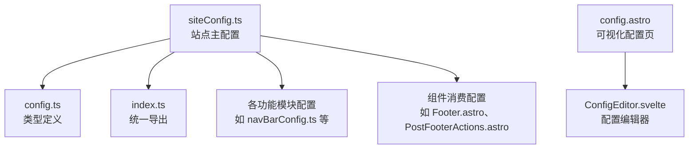
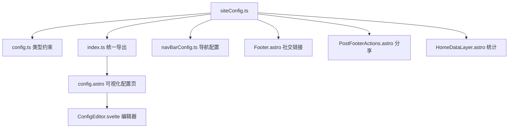
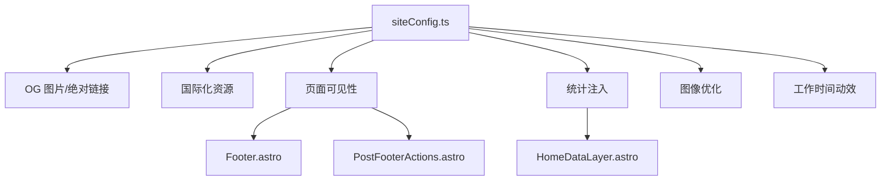

# 核心站点配置

<cite>
**本文引用的文件**
- [siteConfig.ts](file://src/config/siteConfig.ts)
- [config.ts](file://src/types/config.ts)
- [index.ts](file://src/config/index.ts)
- [config.astro](file://src/pages/config.astro)
- [ConfigEditor.svelte](file://src/components/edit/ConfigEditor.svelte)
- [navBarConfig.ts](file://src/config/navBarConfig.ts)
- [PostFooterActions.astro](file://src/components/misc/PostFooterActions.astro)
- [Footer.astro](file://src/components/layout/Footer.astro)
- [HomeDataLayer.astro](file://src/components/layout/HomeDataLayer.astro)
</cite>

## 目录
1. [简介](#简介)
2. [项目结构](#项目结构)
3. [核心组件](#核心组件)
4. [架构总览](#架构总览)
5. [详细组件分析](#详细组件分析)
6. [依赖关系分析](#依赖关系分析)
7. [性能考量](#性能考量)
8. [故障排查指南](#故障排查指南)
9. [结论](#结论)
10. [附录](#附录)

## 简介
本文件面向维护者与开发者，系统化解读核心站点配置 siteConfig.ts 的全部配置项，涵盖站点基本信息、SEO 设置、导航与页面开关、主题与外观、统计分析、图像优化、工作时间与提醒框等模块。文档提供各配置项的数据类型、默认值、可选范围、配置示例与实际应用场景，解释配置项之间的依赖关系与相互影响，并给出配置验证规则与错误处理机制，以及配置迁移与版本兼容性建议。

## 项目结构
siteConfig.ts 作为站点主配置入口，位于 src/config/ 目录，配合类型定义 src/types/config.ts 提供强类型约束；通过 src/config/index.ts 统一导出，便于组件按需导入。可视化配置页面位于 src/pages/config.astro，编辑器组件为 src/components/edit/ConfigEditor.svelte。

图表来源
- [siteConfig.ts:1-322](file://src/config/siteConfig.ts#L1-L322)
- [config.ts:10-220](file://src/types/config.ts#L10-L220)
- [index.ts:38-63](file://src/config/index.ts#L38-L63)
- [config.astro:1-45](file://src/pages/config.astro#L1-L45)
- [ConfigEditor.svelte:767-817](file://src/components/edit/ConfigEditor.svelte#L767-L817)

章节来源
- [siteConfig.ts:1-322](file://src/config/siteConfig.ts#L1-L322)
- [config.ts:10-220](file://src/types/config.ts#L10-L220)
- [index.ts:38-63](file://src/config/index.ts#L38-L63)

## 核心组件
本节对 siteConfig.ts 的关键配置域进行逐项解析，包括数据类型、默认值、可选值范围、典型场景与注意事项。

- 基础信息
  - title: 站点主标题，字符串类型。默认值见配置文件。典型场景：页面标题、Open Graph 标题、RSS 标题等。
  - subtitle: 副标题，字符串类型。默认值见配置文件。典型场景：首页副标题、SEO 描述补充。
  - site_url: 站点根 URL，字符串类型，建议以斜杠结尾。默认值见配置文件。典型场景：绝对链接拼接、OG 图片生成、RSS 链接。
  - description: 站点描述，字符串类型。默认值见配置文件。典型场景：meta description、SEO 摘要。
  - keywords: 关键词数组，字符串数组类型。默认值见配置文件。典型场景：meta keywords、SEO 辅助。
  - lang: 站点语言，枚举类型："en" | "zh_CN" | "zh_TW" | "ja" | "ru"。默认值见配置文件。典型场景：html lang 属性、国际化资源选择。

- 主题与外观
  - themeColor.hue: 主色调色相（0-360），数值类型。默认值见配置文件。典型场景：动态 CSS 变量计算、主题色生成。
  - themeColor.fixed: 是否固定主题色选择器，布尔类型。默认值见配置文件。典型场景：简化用户操作或强制统一风格。
  - themeColor.defaultMode: 默认模式，可选 LIGHT_MODE、DARK_MODE、SYSTEM_MODE。默认值见配置文件。典型场景：系统跟随、浅色/深色偏好。
  - pageWidth: 页面整体宽度（rem），数值类型。默认值见配置文件。典型场景：内容区宽度控制、单栏/双栏布局视觉平衡。
  - card.border: 卡片边框与阴影开关，布尔类型。默认值见配置文件。典型场景：提升卡片立体感。
  - card.followTheme: 卡片风格是否跟随主题色相，布尔类型。默认值见配置文件。典型场景：动态色彩卡片。

- 导航栏配置
  - navbar.logo: 导航栏 Logo，对象类型，支持 icon/image/url 三种类型。默认值见配置文件。典型场景：品牌识别、头像、图标。
  - navbar.title: 导航栏标题，字符串类型。默认值见配置文件。典型场景：移动端标题、无障碍标签。
  - navbar.widthFull: 全宽导航栏，布尔类型。默认值见配置文件。典型场景：全屏视觉效果。
  - navbar.menuAlign: 菜单对齐方式，"left" | "center"。默认值见配置文件。典型场景：桌面端布局美观。
  - navbar.followTheme: 导航栏图标与标题是否跟随主题色，布尔类型。默认值见配置文件。典型场景：动态色彩导航。
  - navbar.stickyNavbar: 导航栏是否固定在顶部，布尔类型。默认值见配置文件。典型场景：提升可用性。

- 时间与工作时间
  - siteStartDate: 站点开始日期，字符串，"YYYY-MM-DD"。默认值见配置文件。典型场景：运行天数统计。
  - timezone: 时区，IANA 时区字符串。默认值见配置文件。典型场景：RSS/日历/番组时间一致性。
  - workHours.start/end/workDays: 上下班时间与工作日范围，数值与数组类型。默认值见配置文件。典型场景：首页头像涟漪动效、状态按钮。

- 提醒框与文章元信息
  - rehypeCallouts.theme: 提醒框主题，"github" | "obsidian" | "vitepress"。默认值见配置文件。典型场景：Markdown 提示块风格。
  - showLastModified: 是否显示“上次编辑时间”卡片，布尔类型。默认值见配置文件。典型场景：文章时效性提示。
  - outdatedThreshold: 文章过期阈值（天），数值类型。默认值见配置文件。典型场景：超过阈值才显示“上次编辑”。

- 分享与 OG 图片
  - sharePoster: 是否开启分享海报功能，布尔类型。默认值见配置文件。典型场景：社交分享卡片生成。
  - generateOgImages: 是否生成 OpenGraph 图片，布尔类型。默认值见配置文件。典型场景：文章详情页 OG 图片渲染。
  - defaultOgImage: 默认 OG 图片路径，字符串类型。默认值见配置文件。典型场景：未指定 OG 图时的回退。

- 页面开关
  - pages.*: 各页面开关，布尔类型。默认值见配置文件。典型场景：友链、赞助、留言、相册、收藏、统计、日历、番组、书架、影视游戏、音乐、更新日志、动态、后台、日常规划、旅行足迹、笔记本等。

- 文章列表布局
  - postListLayout.defaultMode/mobileDefaultMode: 列表/网格布局与移动端默认模式，"list" | "grid"。默认值见配置文件。典型场景：移动端体验优化。
  - postListLayout.showTags: 是否显示标签，布尔类型。默认值见配置文件。典型场景：信息密度控制。
  - postListLayout.descriptionLines: 简介显示行数，数值类型。默认值见配置文件。典型场景：摘要长度控制。
  - postListLayout.allowSwitch: 是否允许用户切换布局，布尔类型。默认值见配置文件。典型场景：个性化体验。
  - postListLayout.grid.masonry/columnWidth: 网格瀑布流与最小宽度，布尔与数值类型。默认值见配置文件。典型场景：图片墙布局优化。

- 分页
  - pagination.postsPerPage: 每页文章数，数值类型。默认值见配置文件。典型场景：列表性能与用户体验平衡。

- 统计分析
  - analytics.googleAnalyticsId: Google Analytics ID，字符串类型。默认值见配置文件。典型场景：流量统计。
  - analytics.microsoftClarityId: Microsoft Clarity ID，字符串类型。默认值见配置文件。典型场景：用户行为可视化。
  - analytics.umamiAnalytics.websiteId/shareId/scriptUrl: Umami 网站 ID、分享页 ID、脚本地址，字符串类型。默认值见配置文件。典型场景：隐私友好统计。
  - analytics.umamiAnalytics.trackOutboundLinks/collectWebVitals: 是否追踪出站链接与收集 Web Vitals，布尔类型。默认值见配置文件。典型场景：转化追踪与性能监控。
  - analytics.umamiAnalytics.replays.enabled/sampleRate/maskLevel/maxDuration/blockSelector: 会话回放配置，布尔、数值与字符串类型。默认值见配置文件。典型场景：用户行为复盘与隐私保护。
  - analytics.la51Analytics.Id/sdkUrl/ck/autoTrack/hashMode/screenRecord: 51la 统计配置，字符串与布尔类型。默认值见配置文件。典型场景：国内统计合规与录屏。

- 热力图
  - heatmap.github.enabled/username: GitHub 贡献热力图开关与用户名，布尔与字符串类型。默认值见配置文件。典型场景：个人贡献可视化。

- 图像优化
  - imageOptimization.formats: 输出图片格式，"avif" | "webp" | "both"。默认值见配置文件。典型场景：体积与兼容性平衡。
  - imageOptimization.quality: 压缩质量（1-100），数值类型。默认值见配置文件。典型场景：带宽与清晰度权衡。
  - imageOptimization.noReferrerDomains: 为特定域名图片添加 referrerpolicy=no-referrer，字符串数组类型。默认值见配置文件。典型场景：解决防盗链 403。

- 字体与语言
  - font: 字体配置对象，来自 fontConfig.ts。默认值见配置文件。典型场景：自定义字体加载与回退策略。
  - lang: 站点语言，枚举类型。默认值见配置文件。典型场景：i18n 资源选择。

- 备案与公安网备
  - beian/policeBeian: 备案号与公安网备号，字符串类型。默认值见配置文件。典型场景：中国大陆合规展示。

章节来源
- [siteConfig.ts:8-321](file://src/config/siteConfig.ts#L8-L321)
- [config.ts:10-220](file://src/types/config.ts#L10-L220)

## 架构总览
siteConfig.ts 作为单一事实来源，被多处组件与页面消费：
- 可视化配置页面 config.astro 通过 ConfigEditor.svelte 提供在线编辑能力。
- Footer.astro、PostFooterActions.astro 等组件依据 pages.* 与 sharePoster 等开关决定 UI 行为。
- HomeDataLayer.astro 读取 analytics.umamiAnalytics 以集成统计数据。
- navBarConfig.ts 与 siteConfig.navbar 配合，驱动导航菜单与链接行为。

图表来源
- [siteConfig.ts:1-322](file://src/config/siteConfig.ts#L1-L322)
- [config.ts:10-220](file://src/types/config.ts#L10-L220)
- [index.ts:38-63](file://src/config/index.ts#L38-L63)
- [config.astro:1-45](file://src/pages/config.astro#L1-L45)
- [ConfigEditor.svelte:767-817](file://src/components/edit/ConfigEditor.svelte#L767-L817)
- [navBarConfig.ts:1-47](file://src/config/navBarConfig.ts#L1-L47)
- [Footer.astro:34-68](file://src/components/layout/Footer.astro#L34-L68)
- [PostFooterActions.astro:46-79](file://src/components/misc/PostFooterActions.astro#L46-L79)
- [HomeDataLayer.astro:48-54](file://src/components/layout/HomeDataLayer.astro#L48-L54)

## 详细组件分析

### 站点基本信息与 SEO
- 数据类型与默认值
  - title/subtitle/description: 字符串类型，见配置文件默认值。
  - keywords: 字符串数组类型，见配置文件默认值。
  - site_url: 字符串类型，见配置文件默认值。
  - lang: 枚举类型，见类型定义。
- 配置示例与场景
  - SEO 优化：合理设置 description 与 keywords，结合 site_url 与 defaultOgImage 提升社交分享质量。
  - 多语言：通过 lang 切换 i18n 资源，确保 meta 与界面一致。
- 依赖关系
  - site_url 与 OG 图片生成、RSS 链接密切相关。
  - lang 与导航、统计等模块的国际化资源绑定。

章节来源
- [siteConfig.ts:8-321](file://src/config/siteConfig.ts#L8-L321)
- [config.ts:10-17](file://src/types/config.ts#L10-L17)

### 导航栏与页面开关
- 数据类型与默认值
  - navbar.logo: 对象类型，type 支持 "icon"|"image"|"url"，见配置文件默认值。
  - pages.*: 布尔开关，见配置文件默认值。
- 配置示例与场景
  - logo 选择：优先使用本地优化图片，兼顾加载性能与品牌识别。
  - 页面开关：根据业务需求启用/禁用友链、赞助、留言、相册等功能页。
- 依赖关系
  - pages.* 影响 Footer.astro、PostFooterActions.astro 等组件的可见性与行为。
  - navBarConfig.ts 与 siteConfig.navbar 协同，决定导航菜单项与链接。

章节来源
- [siteConfig.ts:108-204](file://src/config/siteConfig.ts#L108-L204)
- [config.ts:64-97](file://src/types/config.ts#L64-L97)
- [Footer.astro:34-68](file://src/components/layout/Footer.astro#L34-L68)
- [PostFooterActions.astro:46-79](file://src/components/misc/PostFooterActions.astro#L46-L79)
- [navBarConfig.ts:1-47](file://src/config/navBarConfig.ts#L1-L47)

### 主题色与外观
- 数据类型与默认值
  - themeColor.hue: 数值类型，范围 0-360；fixed/defaultMode: 布尔与枚举类型，见配置文件默认值。
  - pageWidth: 数值类型；card.border/followTheme: 布尔类型，见配置文件默认值。
- 配置示例与场景
  - hue 设定：选择品牌色相，结合 followTheme 实现卡片动态色彩。
  - pageWidth：在单栏布局时适当降低宽度以提升阅读体验。
- 依赖关系
  - themeColor 与 card.* 影响全局样式变量与卡片视觉。

章节来源
- [siteConfig.ts:33-54](file://src/config/siteConfig.ts#L33-L54)
- [config.ts:19-34](file://src/types/config.ts#L19-L34)

### 时间与工作时间
- 数据类型与默认值
  - siteStartDate: 字符串，"YYYY-MM-DD"；timezone: 字符串（IANA）；workHours.start/end/workDays: 数值与数组类型，见配置文件默认值。
- 配置示例与场景
  - timezone：确保 RSS、日历、番组时间与预期一致。
  - workHours：首页头像涟漪动效与状态按钮基于工作日与时间段判断。
- 依赖关系
  - timezone 与各模块的时间处理逻辑耦合。

章节来源
- [siteConfig.ts:133-146](file://src/config/siteConfig.ts#L133-L146)
- [config.ts:39-43](file://src/types/config.ts#L39-L43)
- [config.ts:176-182](file://src/types/config.ts#L176-L182)

### 提醒框与文章元信息
- 数据类型与默认值
  - rehypeCallouts.theme: "github"|"obsidian"|"vitepress"；showLastModified/outdatedThreshold: 布尔与数值类型，见配置文件默认值。
- 配置示例与场景
  - 主题选择：根据团队偏好选择 github/obsidian/vitepress 风格。
  - 过期阈值：对长期未更新文章进行提示，避免误导读者。
- 依赖关系
  - 与 Markdown 渲染管线与文章详情页 UI 绑定。

章节来源
- [siteConfig.ts:148-158](file://src/config/siteConfig.ts#L148-L158)
- [config.ts:46-48](file://src/types/config.ts#L46-L48)
- [config.ts:99-100](file://src/types/config.ts#L99-L100)

### 分享与 OG 图片
- 数据类型与默认值
  - sharePoster/generateOgImages: 布尔类型；defaultOgImage: 字符串类型，见配置文件默认值。
- 配置示例与场景
  - sharePoster：在文章页启用分享海报按钮，提升社交传播。
  - generateOgImages：谨慎开启，渲染耗时较长，适合生产环境或 CI。
- 依赖关系
  - 与文章详情页 UI 与服务端 OG 图片生成流程相关。

章节来源
- [siteConfig.ts:160-167](file://src/config/siteConfig.ts#L160-L167)
- [config.ts:56-57](file://src/types/config.ts#L56-L57)

### 文章列表布局与分页
- 数据类型与默认值
  - postListLayout.defaultMode/mobileDefaultMode: "list"|"grid"；showTags/descriptionLines/allowSwitch: 布尔与数值类型；grid.masonry/columnWidth: 布尔与数值类型，见配置文件默认值。
  - pagination.postsPerPage: 数值类型，见配置文件默认值。
- 配置示例与场景
  - 移动端默认 list，桌面端 grid，结合 masonry 与 columnWidth 优化图片墙。
  - descriptionLines 控制摘要长度，避免信息过载。
- 依赖关系
  - 影响文章列表组件的渲染与交互。

章节来源
- [siteConfig.ts:209-234](file://src/config/siteConfig.ts#L209-L234)
- [config.ts:127-146](file://src/types/config.ts#L127-L146)

### 统计分析
- 数据类型与默认值
  - analytics.googleAnalyticsId/microsoftClarityId: 字符串类型；umamiAnalytics.websiteId/shareId/scriptUrl/trackOutboundLinks/collectWebVitals/replays.*: 字符串、布尔与数值类型；la51Analytics.*: 字符串与布尔类型，见配置文件默认值。
- 配置示例与场景
  - Umami：启用隐私友好统计与会话回放，合理设置采样率与隐私遮罩级别。
  - 51la：国内合规统计，可配置 SDK 地址与录屏功能。
- 依赖关系
  - HomeDataLayer.astro 读取 umamiAnalytics 以注入统计数据。

章节来源
- [siteConfig.ts:236-280](file://src/config/siteConfig.ts#L236-L280)
- [config.ts:148-174](file://src/types/config.ts#L148-L174)
- [HomeDataLayer.astro:48-54](file://src/components/layout/HomeDataLayer.astro#L48-L54)

### 热力图与图像优化
- 数据类型与默认值
  - heatmap.github.enabled/username: 布尔与字符串类型；imageOptimization.formats/quality/noReferrerDomains: 枚举、数值与字符串数组类型，见配置文件默认值。
- 配置示例与场景
  - GitHub 热力图：启用后展示贡献历史可视化。
  - 图像优化：推荐 "webp" 或 "both"，质量 70-85，针对防盗链域名设置 no-referrer。
- 依赖关系
  - 与第三方服务与图片加载策略相关。

章节来源
- [siteConfig.ts:282-307](file://src/config/siteConfig.ts#L282-L307)
- [config.ts:190-219](file://src/types/config.ts#L190-L219)

### 字体与语言
- 数据类型与默认值
  - font: FontConfig 类型，来自 fontConfig.ts；lang: 枚举类型，见类型定义。
- 配置示例与场景
  - 字体：启用自定义字体并设置回退字体，提升排版一致性。
  - 语言：lang 与 i18n 资源联动。
- 依赖关系
  - 与全局样式与国际化资源绑定。

章节来源
- [siteConfig.ts:309-314](file://src/config/siteConfig.ts#L309-L314)
- [config.ts:36-17](file://src/types/config.ts#L36-L17)

### 备案与公安网备
- 数据类型与默认值
  - beian/policeBeian: 字符串类型，见配置文件默认值。
- 配置示例与场景
  - 中国大陆合规要求：填写备案号与公安网备号。
- 依赖关系
  - 与页脚展示逻辑相关。

章节来源
- [siteConfig.ts:316-321](file://src/config/siteConfig.ts#L316-L321)
- [config.ts:184-188](file://src/types/config.ts#L184-L188)

## 依赖关系分析
siteConfig.ts 的配置项之间存在以下依赖与影响：
- site_url 与 OG 图片、RSS 链接、绝对路径拼接紧密耦合。
- lang 与导航、统计等模块的国际化资源绑定。
- pages.* 决定 Footer.astro、PostFooterActions.astro 等组件的可见性与行为。
- analytics.* 与 HomeDataLayer.astro 的数据注入与展示。
- imageOptimization.* 影响图片加载性能与防盗链策略。
- workHours.* 与首页头像动效、状态按钮逻辑相关。

图表来源
- [siteConfig.ts:15-16](file://src/config/siteConfig.ts#L15-L16)
- [siteConfig.ts:136-146](file://src/config/siteConfig.ts#L136-L146)
- [siteConfig.ts:160-167](file://src/config/siteConfig.ts#L160-L167)
- [siteConfig.ts:236-280](file://src/config/siteConfig.ts#L236-L280)
- [siteConfig.ts:282-307](file://src/config/siteConfig.ts#L282-L307)
- [Footer.astro:34-68](file://src/components/layout/Footer.astro#L34-L68)
- [PostFooterActions.astro:46-79](file://src/components/misc/PostFooterActions.astro#L46-L79)
- [HomeDataLayer.astro:48-54](file://src/components/layout/HomeDataLayer.astro#L48-L54)

章节来源
- [siteConfig.ts:15-16](file://src/config/siteConfig.ts#L15-L16)
- [siteConfig.ts:136-146](file://src/config/siteConfig.ts#L136-L146)
- [siteConfig.ts:160-167](file://src/config/siteConfig.ts#L160-L167)
- [siteConfig.ts:236-280](file://src/config/siteConfig.ts#L236-L280)
- [siteConfig.ts:282-307](file://src/config/siteConfig.ts#L282-L307)
- [Footer.astro:34-68](file://src/components/layout/Footer.astro#L34-L68)
- [PostFooterActions.astro:46-79](file://src/components/misc/PostFooterActions.astro#L46-L79)
- [HomeDataLayer.astro:48-54](file://src/components/layout/HomeDataLayer.astro#L48-L54)

## 性能考量
- OG 图片生成：generateOgImages 开启会显著增加渲染时间，建议在生产环境或 CI 中启用，本地开发阶段关闭。
- 图像优化：优先选择 "webp" 或 "both"，质量 70-85；合理设置 noReferrerDomains 解决防盗链问题。
- 统计分析：Umami 会话回放采样率与隐私遮罩级别需权衡数据价值与隐私合规。
- 分页与布局：合理设置 pagination.postsPerPage 与 postListLayout.grid.columnWidth，避免过度渲染导致性能下降。

## 故障排查指南
- 配置验证与错误处理
  - 可视化编辑：通过 config.astro 与 ConfigEditor.svelte 提供的表单校验与实时反馈，减少配置错误。
  - 统计注入：HomeDataLayer.astro 读取 analytics.umamiAnalytics，若 scriptUrl 或 shareId 为空，统计数据将不可用。
  - 图像加载：若出现防盗链 403，检查 imageOptimization.noReferrerDomains 是否正确配置目标域名。
  - 页面开关：若某功能页不可见，检查对应 pages.* 开关与 navBarConfig.ts 的链接配置。
- 常见问题
  - OG 图片不显示：确认 generateOgImages 已开启且 defaultOgImage 路径有效。
  - 时区不一致：检查 timezone 设置，确保 RSS、日历、番组时间与预期一致。
  - 分享按钮缺失：检查 sharePoster 开关与 PostFooterActions.astro 的条件渲染逻辑。

章节来源
- [config.astro:1-45](file://src/pages/config.astro#L1-L45)
- [ConfigEditor.svelte:767-817](file://src/components/edit/ConfigEditor.svelte#L767-L817)
- [HomeDataLayer.astro:48-54](file://src/components/layout/HomeDataLayer.astro#L48-L54)
- [PostFooterActions.astro:46-79](file://src/components/misc/PostFooterActions.astro#L46-L79)

## 结论
siteConfig.ts 提供了博客站点的核心配置能力，涵盖 SEO、导航、主题、统计、图像优化、时间与时区等多个维度。通过类型定义与统一导出，确保配置的强类型约束与跨组件一致性。建议在生产环境中谨慎开启高开销功能（如 OG 图片生成），并结合 pages.* 与 navBarConfig.ts 实现灵活的功能与导航控制。

## 附录
- 配置迁移与版本兼容性
  - 新增字段：遵循 config.ts 中的 SiteConfig 类型定义，新增字段需同步更新类型声明。
  - 枚举与默认值：lang、themeColor.defaultMode、postListLayout.defaultMode 等采用枚举或受限集合，升级时保持向后兼容。
  - 统计配置：analytics.* 字段可能随第三方服务变更，建议定期核对脚本地址与参数。
  - 图像优化：formats 与 quality 的取值范围与默认值需参考类型定义，避免超出范围导致构建失败。

章节来源
- [config.ts:10-220](file://src/types/config.ts#L10-L220)
- [index.ts:38-63](file://src/config/index.ts#L38-L63)