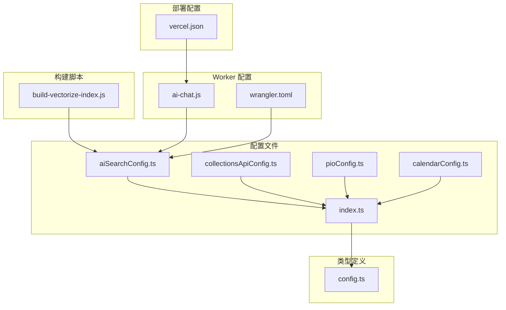
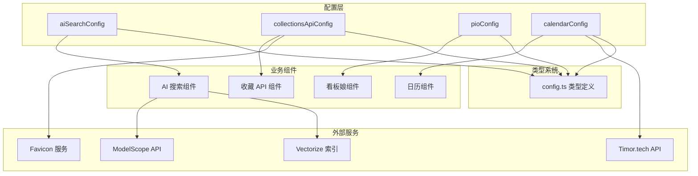
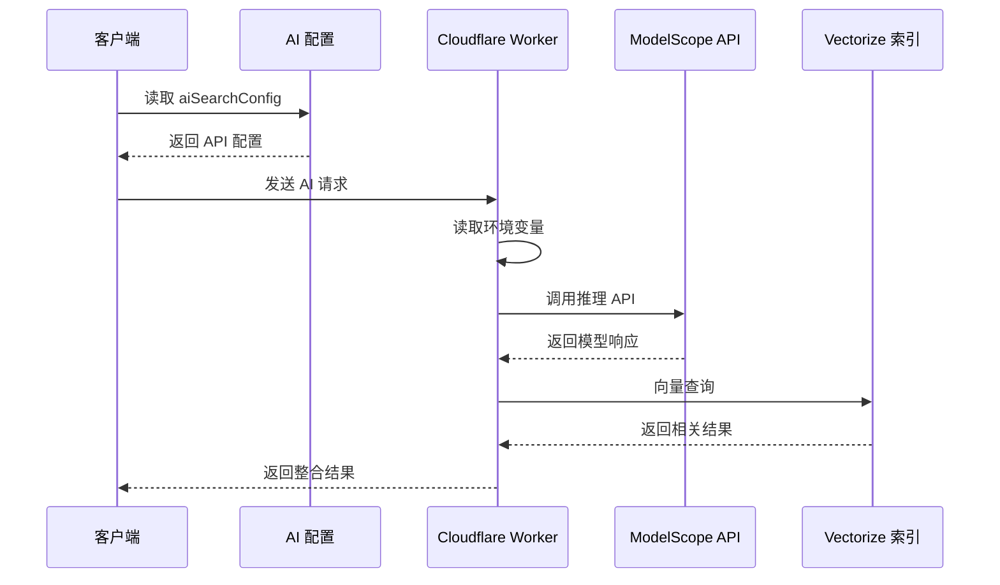
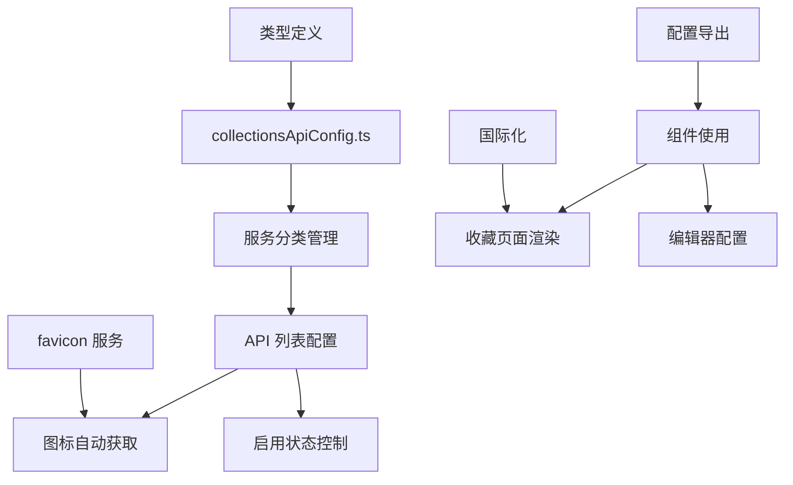
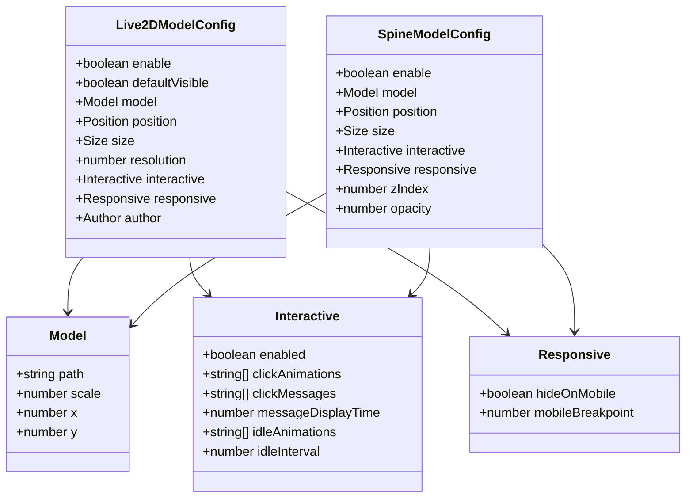
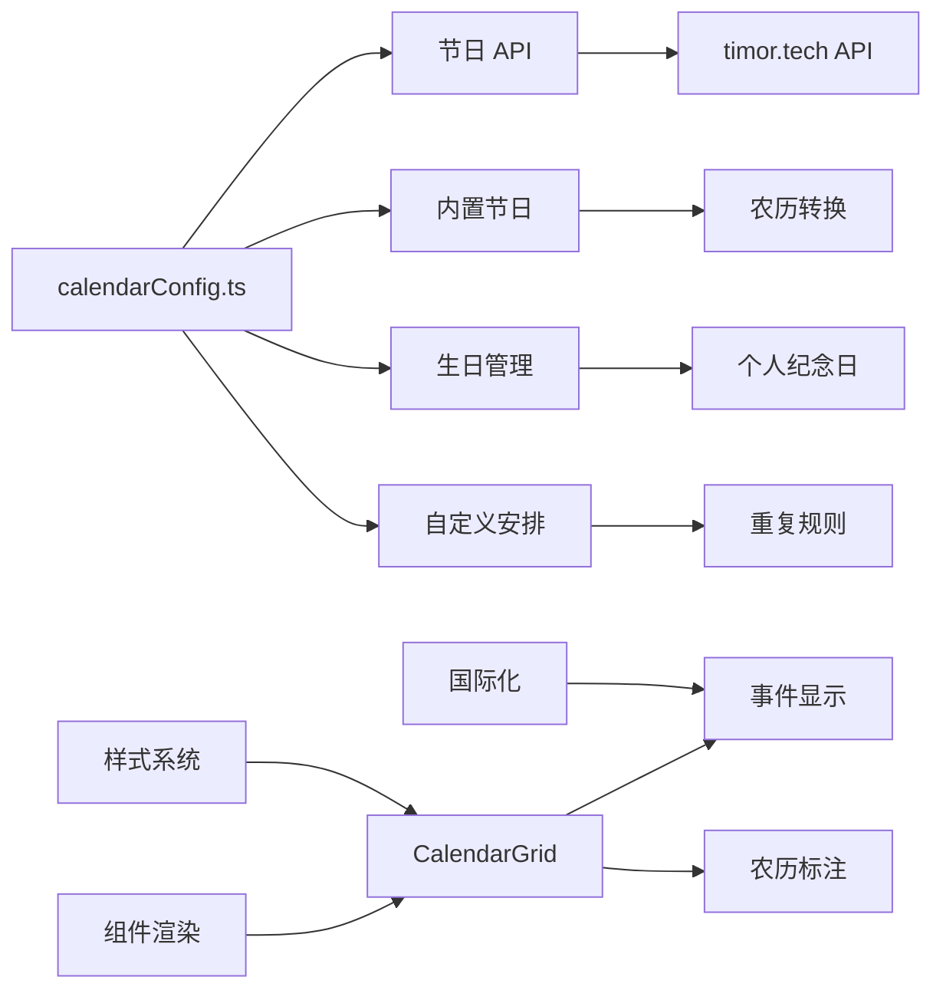
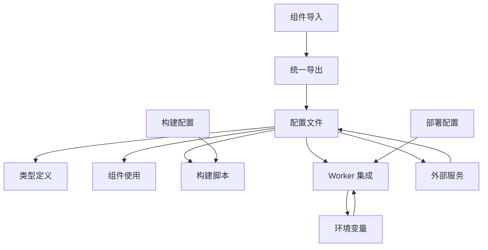

# 系统集成配置

<cite>
**本文档引用的文件**
- [aiSearchConfig.ts](file://src/config/aiSearchConfig.ts)
- [collectionsApiConfig.ts](file://src/config/collectionsApiConfig.ts)
- [pioConfig.ts](file://src/config/pioConfig.ts)
- [calendarConfig.ts](file://src/config/calendarConfig.ts)
- [index.ts](file://src/config/index.ts)
- [config.ts](file://src/types/config.ts)
- [build-vectorize-index.js](file://scripts/build-vectorize-index.js)
- [ai-chat.js](file://src/workers/ai-chat.js)
- [wrangler.toml](file://wrangler.toml)
- [vercel.json](file://vercel.json)
- [CalendarGrid.svelte](file://src/components/pages/calendar/CalendarGrid.svelte)
- [Live2DWidget.astro](file://src/components/features/Live2DWidget.astro)
- [CollectionsEditor.svelte](file://src/components/edit/CollectionsEditor.svelte)
</cite>

## 目录
1. [简介](#简介)
2. [项目结构](#项目结构)
3. [核心组件](#核心组件)
4. [架构概览](#架构概览)
5. [详细组件分析](#详细组件分析)
6. [依赖关系分析](#依赖关系分析)
7. [性能考虑](#性能考虑)
8. [故障排查指南](#故障排查指南)
9. [结论](#结论)

## 简介

本文件详细介绍了 my-blog 项目中的系统集成配置，重点关注与外部系统的集成配置文件。这些配置文件涵盖了 AI 搜索、内容集合 API、看板娘模型、日历等多个外部系统集成场景。文档将深入分析每个配置文件的作用、关键参数、安全配置、性能优化以及故障排查方法。

## 项目结构

项目采用模块化的配置管理方式，所有配置集中在 `src/config/` 目录下，通过 `index.ts` 统一导出，便于组件按需导入。

**图表来源**
- [index.ts:1-66](file://src/config/index.ts#L1-L66)
- [config.ts:1-800](file://src/types/config.ts#L1-L800)

**章节来源**
- [index.ts:1-66](file://src/config/index.ts#L1-L66)
- [config.ts:1-800](file://src/types/config.ts#L1-L800)

## 核心组件

### AI 搜索配置 (aiSearchConfig.ts)

AI 搜索配置是整个 AI 集成的核心，负责管理第三方 AI API 的连接和向量化搜索功能。

**关键配置项：**
- API 地址：指向 ModelScope 的推理 API 服务
- 模型配置：DeepSeek V4 Flash 对话模型和 Qwen Embedding 模型
- 向量维度：1024 维度与 Vectorize 索引保持一致
- 批处理大小：500 的向量上传批次和 50 的嵌入请求批次

**章节来源**
- [aiSearchConfig.ts:1-30](file://src/config/aiSearchConfig.ts#L1-L30)

### 内容集合 API 配置 (collectionsApiConfig.ts)

内容集合 API 配置管理各种外部服务的收藏和集成，包括网络测速、图片处理、AI 聊天、AI 工具等服务。

**主要分类：**
- 测试数据：中科大测速、ITDOG 网络工具
- 图片处理：在线图像工具箱、SauceNAO 以图搜图
- AI 聊天：豆包、ChatGPT、Claude、Gemini、Grok
- AI 工具：AI Arena、ModelScope、PromptPilot 等
- BOT：多种聊天机器人框架
- UI 组件库：shadcn/ui、HeroUI、Uiverse 等
- 知识库：Java 全栈知识体系、力扣 LeetCode 等
- API 服务：Zerochan、阿里云 API 市场、高德地图 API 等

**章节来源**
- [collectionsApiConfig.ts:1-453](file://src/config/collectionsApiConfig.ts#L1-L453)

### 看板娘配置 (pioConfig.ts)

看板娘配置支持 Live2D 和 Spine 两种 3D 模型格式，提供丰富的交互体验。

**Live2D 配置特点：**
- 模型路径：`/pio/models/live2d/小爱弥斯_vts/小爱弥斯.model3.json`
- 交互功能：点击动画、随机消息、待机动画
- 移动端适配：可配置移动端隐藏和断点
- 性能优化：支持设备像素比设置，最高 2 倍

**Spine 配置特点：**
- 模型路径：`/pio/models/spine/firefly/1310.json`
- 动画系统：表情、动作、待机状态
- 位置控制：四个角落的灵活定位
- 层级管理：1000 的 z-index 确保显示层级

**章节来源**
- [pioConfig.ts:1-157](file://src/config/pioConfig.ts#L1-L157)

### 日历配置 (calendarConfig.ts)

日历配置管理节日、生日和自定义安排的集成，支持公历和农历日期。

**核心功能：**
- 节日 API：timor.tech 中国法定节假日 API
- 内置节日：春节、元宵节、端午节等传统节日
- 生日管理：个人生日和建站纪念日
- 自定义安排：支持一次性、每周、每月、每年重复
- 农历支持：自动转换农历为公历日期

**章节来源**
- [calendarConfig.ts:1-123](file://src/config/calendarConfig.ts#L1-L123)

## 架构概览

系统采用分层架构，配置文件位于底层，通过统一的导出接口为上层组件提供服务。

**图表来源**
- [index.ts:38-66](file://src/config/index.ts#L38-L66)
- [config.ts:561-626](file://src/types/config.ts#L561-L626)

## 详细组件分析

### AI 搜索集成分析

AI 搜索集成为整个系统的核心智能功能，涉及多个层面的配置和集成。

**图表来源**
- [ai-chat.js:44-50](file://src/workers/ai-chat.js#L44-L50)
- [aiSearchConfig.ts:8-29](file://src/config/aiSearchConfig.ts#L8-L29)

**配置要点：**
- API 密钥管理：通过环境变量 `AI_API_KEY` 注入
- CORS 配置：动态允许的源列表
- 速率限制：基于 IP 的限流机制
- 错误处理：API 调用失败时的降级策略

**章节来源**
- [ai-chat.js:1-50](file://src/workers/ai-chat.js#L1-L50)
- [build-vectorize-index.js:40-64](file://scripts/build-vectorize-index.js#L40-L64)

### 内容集合 API 集成分析

内容集合 API 配置实现了对外部服务的统一管理和集成。

**图表来源**
- [collectionsApiConfig.ts:4:1-4:4](file://src/config/collectionsApiConfig.ts#L4-L4)
- [index.ts:43-44](file://src/config/index.ts#L43-L44)

**集成特点：**
- 自动图标获取：通过 favicon.im 服务获取网站图标
- 分类组织：按功能类型自动分类管理
- 状态控制：每个服务可独立启用/禁用
- 国际化支持：标题和描述支持多语言

**章节来源**
- [collectionsApiConfig.ts:1-453](file://src/config/collectionsApiConfig.ts#L1-L453)
- [CollectionsEditor.svelte](file://src/components/edit/CollectionsEditor.svelte)

### 看板娘集成分析

看板娘系统支持两种 3D 模型格式，提供丰富的交互体验。

**图表来源**
- [config.ts:595-626](file://src/types/config.ts#L595-L626)
- [config.ts:561-593](file://src/types/config.ts#L561-L593)

**实现细节：**
- Live2D 模型：支持 Cubism 2 和 3+ 格式
- Spine 模型：基于骨骼动画系统
- 交互系统：点击、待机、消息显示
- 性能优化：设备像素比适配和移动端优化

**章节来源**
- [pioConfig.ts:85-157](file://src/config/pioConfig.ts#L85-L157)
- [Live2DWidget.astro:1-42](file://src/components/features/Live2DWidget.astro#L1-L42)

### 日历集成分析

日历系统集成了多种数据源，提供完整的日程管理功能。

**图表来源**
- [calendarConfig.ts:4:1-4:6](file://src/config/calendarConfig.ts#L4-L6)
- [CalendarGrid.svelte](file://src/components/pages/calendar/CalendarGrid.svelte)

**数据流处理：**
- 构建时：从 timor.tech API 拉取节日数据并缓存
- 运行时：无网络依赖，使用缓存数据
- 农历支持：自动转换农历日期为公历
- 重复规则：支持一次性、每周、每月、每年重复

**章节来源**
- [calendarConfig.ts:1-123](file://src/config/calendarConfig.ts#L1-L123)
- [CalendarGrid.svelte](file://src/components/pages/calendar/CalendarGrid.svelte)

## 依赖关系分析

系统配置之间的依赖关系体现了清晰的分层架构。

**图表来源**
- [index.ts:1-66](file://src/config/index.ts#L1-L66)
- [config.ts:1-800](file://src/types/config.ts#L1-L800)

**依赖特点：**
- 单向依赖：配置 -> 类型 -> 组件
- 松耦合：各配置文件相互独立
- 动态导入：组件按需加载配置
- 版本同步：构建脚本与配置文件保持同步

**章节来源**
- [index.ts:1-66](file://src/config/index.ts#L1-L66)
- [config.ts:1-800](file://src/types/config.ts#L1-L800)

## 性能考虑

### 缓存策略

系统采用了多层次的缓存策略来优化性能：

1. **构建时缓存**：日历节日数据在构建时拉取并缓存
2. **静态资源缓存**：favicon 图标和看板娘模型文件
3. **API 响应缓存**：Worker 层面的请求缓存

### 性能优化措施

- **批处理优化**：AI 向量上传使用 500 的批大小
- **内存管理**：看板娘模型按需加载，支持延迟初始化
- **网络优化**：favicon 服务减少网络请求
- **渲染优化**：日历组件使用虚拟滚动和懒加载

## 故障排查指南

### 常见问题及解决方案

**AI API 集成问题：**
1. 检查环境变量 `AI_API_KEY` 是否正确设置
2. 验证 API 密钥权限和配额
3. 查看 Worker 日志中的 CORS 错误
4. 确认 API 地址可达性和网络连通性

**向量索引问题：**
1. 验证 `vectorizeDim` 与索引维度一致
2. 检查 `indexName` 配置是否正确
3. 确认批处理大小设置合理
4. 查看构建脚本的错误日志

**看板娘显示问题：**
1. 检查模型文件路径是否正确
2. 验证 Canvas 元素是否正常加载
3. 查看浏览器控制台的资源加载错误
4. 确认移动端适配配置

**日历数据问题：**
1. 检查 timor.tech API 的可用性
2. 验证农历转换逻辑
3. 确认本地缓存文件完整性
4. 查看构建时的日志输出

**章节来源**
- [ai-chat.js:17-42](file://src/workers/ai-chat.js#L17-L42)
- [build-vectorize-index.js:32-38](file://scripts/build-vectorize-index.js#L32-L38)

### 监控配置

系统集成了多种监控和调试功能：

- **Worker 性能监控**：通过 Cloudflare Workers Analytics
- **API 调用监控**：记录请求响应时间和错误率
- **资源加载监控**：跟踪看板娘模型和 favicon 的加载情况
- **日志记录**：详细的错误日志和调试信息

**章节来源**
- [vercel.json:6-39](file://vercel.json#L6-L39)

## 结论

本系统集成配置展现了现代前端应用的完整外部服务集成方案。通过模块化的配置管理、清晰的类型定义、完善的错误处理和性能优化策略，实现了稳定可靠的外部系统集成。

关键优势包括：
- **统一配置管理**：所有集成配置集中管理，便于维护和更新
- **类型安全保障**：完整的 TypeScript 类型定义确保配置正确性
- **性能优化**：多层缓存和批处理优化提升用户体验
- **故障恢复**：完善的错误处理和降级策略保证系统稳定性

建议在实际部署中：
1. 定期检查外部 API 的可用性和配额限制
2. 监控配置变更对系统的影响
3. 根据实际使用情况调整性能参数
4. 建立配置备份和版本控制机制