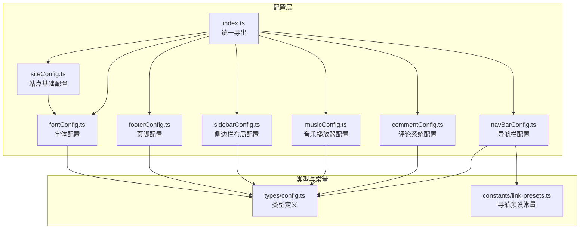
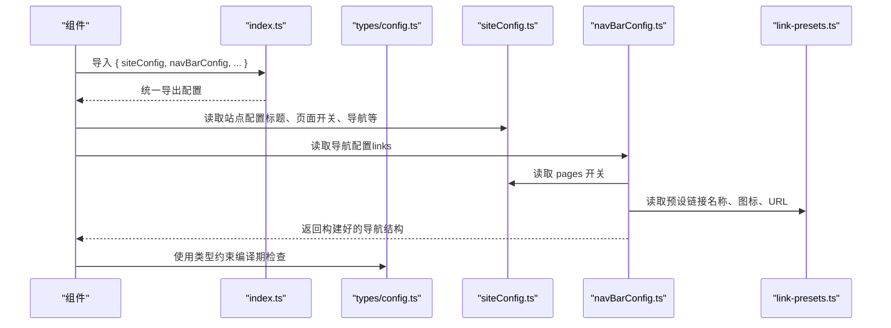
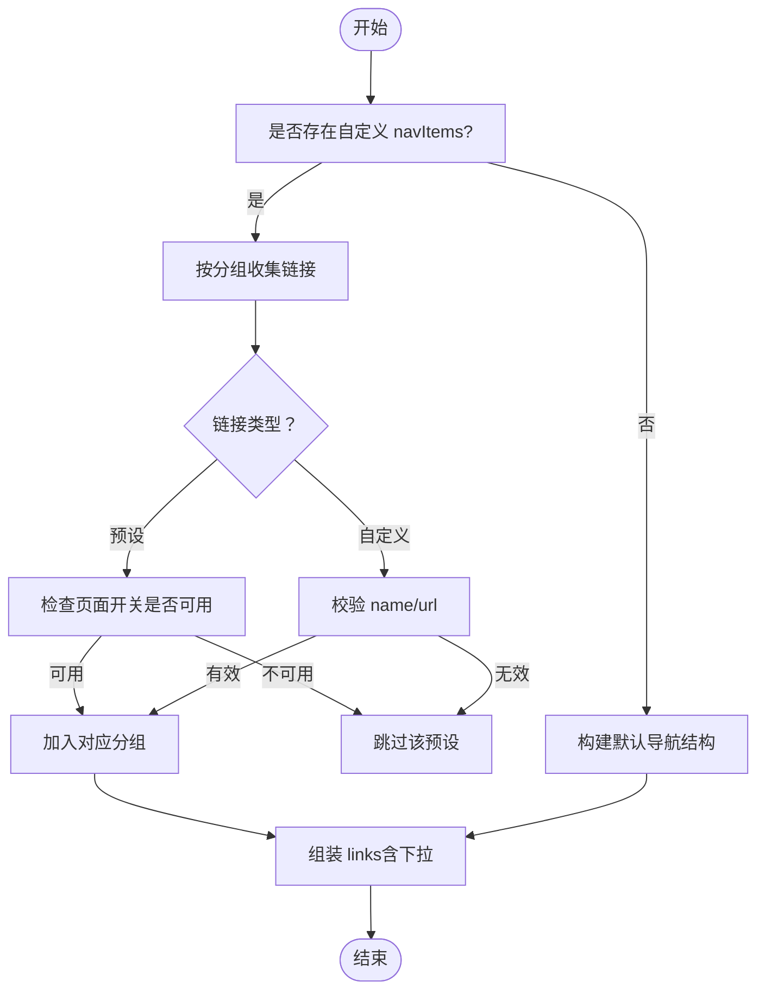
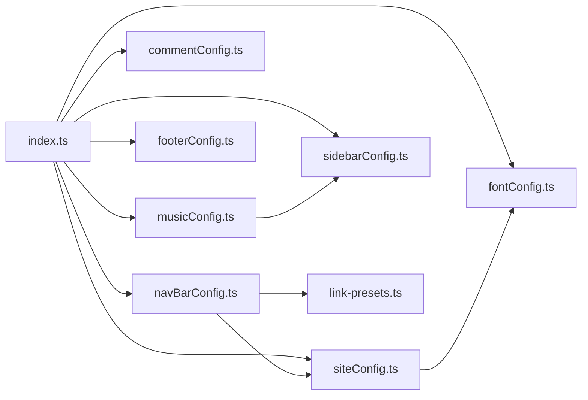

# 配置系统

<cite>
**本文引用的文件**
- [src/config/index.ts](file://src/config/index.ts)
- [src/config/siteConfig.ts](file://src/config/siteConfig.ts)
- [src/config/navBarConfig.ts](file://src/config/navBarConfig.ts)
- [src/config/commentConfig.ts](file://src/config/commentConfig.ts)
- [src/config/musicConfig.ts](file://src/config/musicConfig.ts)
- [src/config/sidebarConfig.ts](file://src/config/sidebarConfig.ts)
- [src/config/footerConfig.ts](file://src/config/footerConfig.ts)
- [src/config/fontConfig.ts](file://src/config/fontConfig.ts)
- [src/config/README.md](file://src/config/README.md)
- [src/types/config.ts](file://src/types/config.ts)
- [src/constants/link-presets.ts](file://src/constants/link-presets.ts)
</cite>

## 目录
1. [简介](#简介)
2. [项目结构](#项目结构)
3. [核心组件](#核心组件)
4. [架构总览](#架构总览)
5. [详细组件分析](#详细组件分析)
6. [依赖关系分析](#依赖关系分析)
7. [性能考量](#性能考量)
8. [故障排查指南](#故障排查指南)
9. [结论](#结论)
10. [附录](#附录)

## 简介
本文件系统性阐述 Firefly-Mod 的统一配置架构与实现方式，重点围绕 barrel 文件 index.ts 如何集中导出所有配置，以及各配置文件的职责边界、参数含义、默认值参考与使用示例。文档还解释了配置的优先级与覆盖规则、安全修改策略、配置验证与错误处理、调试技巧、最佳实践与常见陷阱。

## 项目结构
配置系统采用“模块化 + barrel 导出”的组织方式：
- 每个功能域拥有独立配置文件（如站点、导航、评论、音乐、侧边栏、字体、页脚等）
- 通过 src/config/index.ts 统一导出，便于组件一次性导入多个配置，减少重复导入
- 类型定义集中在 src/types/config.ts，确保配置与组件之间的契约稳定

**图表来源**
- [src/config/index.ts:1-66](file://src/config/index.ts#L1-L66)
- [src/config/siteConfig.ts:1-322](file://src/config/siteConfig.ts#L1-L322)
- [src/config/navBarConfig.ts:1-391](file://src/config/navBarConfig.ts#L1-L391)
- [src/config/commentConfig.ts:1-79](file://src/config/commentConfig.ts#L1-L79)
- [src/config/musicConfig.ts:1-62](file://src/config/musicConfig.ts#L1-L62)
- [src/config/sidebarConfig.ts:1-222](file://src/config/sidebarConfig.ts#L1-L222)
- [src/config/fontConfig.ts:1-85](file://src/config/fontConfig.ts#L1-L85)
- [src/config/footerConfig.ts:1-9](file://src/config/footerConfig.ts#L1-L9)
- [src/types/config.ts:1-800](file://src/types/config.ts#L1-L800)
- [src/constants/link-presets.ts:1-155](file://src/constants/link-presets.ts#L1-L155)

**章节来源**
- [src/config/README.md:1-79](file://src/config/README.md#L1-L79)
- [src/config/index.ts:1-66](file://src/config/index.ts#L1-L66)

## 核心组件
- 统一导出（barrel）：src/config/index.ts 将所有配置以命名导出形式集中导出，组件只需一次导入即可获取所需配置，降低耦合与重复导入成本
- 类型契约：src/types/config.ts 定义了所有配置的 TypeScript 类型，保证配置与组件之间的强类型约束
- 导航预设：src/constants/link-presets.ts 提供导航栏预设链接的名称、图标与 URL，navBarConfig.ts 基于此构建导航结构
- 站点配置：src/config/siteConfig.ts 是核心站点配置，涵盖标题、描述、主题色、导航、页面开关、分析、图像优化、字体等
- 导航配置：src/config/navBarConfig.ts 基于 siteConfig.ts 的 pages 开关与 navbar.navItems 自定义配置，动态构建导航结构
- 评论配置：src/config/commentConfig.ts 提供多种评论系统（Twikoo、Waline、Giscus、Artalk、Disqus）的配置入口
- 音乐配置：src/config/musicConfig.ts 提供音乐播放器入口显示、播放模式、音量、歌词、Meting API 与本地音乐列表配置
- 侧边栏配置：src/config/sidebarConfig.ts 控制侧边栏组件的启用、位置、响应式折叠阈值等
- 字体配置：src/config/fontConfig.ts 定义字体启用、预加载、选择字体、回退字体等
- 页脚配置：src/config/footerConfig.ts 控制页脚 HTML 注入开关

**章节来源**
- [src/config/index.ts:4-66](file://src/config/index.ts#L4-L66)
- [src/types/config.ts:10-220](file://src/types/config.ts#L10-L220)
- [src/constants/link-presets.ts:5-154](file://src/constants/link-presets.ts#L5-L154)
- [src/config/siteConfig.ts:8-322](file://src/config/siteConfig.ts#L8-L322)
- [src/config/navBarConfig.ts:174-391](file://src/config/navBarConfig.ts#L174-L391)
- [src/config/commentConfig.ts:3-79](file://src/config/commentConfig.ts#L3-L79)
- [src/config/musicConfig.ts:4-62](file://src/config/musicConfig.ts#L4-L62)
- [src/config/sidebarConfig.ts:6-222](file://src/config/sidebarConfig.ts#L6-L222)
- [src/config/fontConfig.ts:2-85](file://src/config/fontConfig.ts#L2-L85)
- [src/config/footerConfig.ts:3-9](file://src/config/footerConfig.ts#L3-L9)

## 架构总览
统一配置架构通过 barrel 文件集中导出，形成“配置即契约”的设计：组件通过 index.ts 获取配置，类型由 types/config.ts 保障，导航预设由 constants/link-presets.ts 提供。站点配置 siteConfig.ts 作为中枢，驱动导航、页面开关、分析、图像优化等子系统。

**图表来源**
- [src/config/index.ts:37-66](file://src/config/index.ts#L37-L66)
- [src/config/siteConfig.ts:108-131](file://src/config/siteConfig.ts#L108-L131)
- [src/config/navBarConfig.ts:174-391](file://src/config/navBarConfig.ts#L174-L391)
- [src/constants/link-presets.ts:5-154](file://src/constants/link-presets.ts#L5-L154)
- [src/types/config.ts:10-280](file://src/types/config.ts#L10-L280)

## 详细组件分析

### 统一配置索引（barrel）与优先级
- 统一导出：index.ts 将类型与配置集中导出，组件只需一次导入即可获取多个配置
- 优先级与覆盖规则：
  - 站点配置 siteConfig.ts 为中枢，决定页面开关、导航结构、分析、图像优化等
  - 导航配置 navBarConfig.ts 依据 siteConfig.pages 的开关与 navbar.navItems 自定义配置动态构建
  - 评论、音乐、侧边栏等配置独立，但受 siteConfig 的页面开关间接影响（如 pages.musicPage 控制音乐页面开关）
  - 字体配置 fontConfig.ts 与站点配置 siteConfig.font 组合，决定最终字体渲染
- 安全修改建议：
  - 修改 siteConfig.pages 时，确保 navBarConfig.ts 的可用性判断逻辑仍有效
  - 修改 navBarConfig.ts 的 navItems 时，确保 LinkPreset 映射与 link-presets.ts 保持一致
  - 修改音乐播放器配置时，确认 sidebarConfig.ts 对应组件启用状态

**章节来源**
- [src/config/index.ts:37-66](file://src/config/index.ts#L37-L66)
- [src/config/navBarConfig.ts:47-98](file://src/config/navBarConfig.ts#L47-L98)
- [src/config/navBarConfig.ts:174-263](file://src/config/navBarConfig.ts#L174-L263)
- [src/config/siteConfig.ts:169-204](file://src/config/siteConfig.ts#L169-L204)
- [src/config/sidebarConfig.ts:58-66](file://src/config/sidebarConfig.ts#L58-L66)

### 站点配置（siteConfig.ts）
- 核心职责：站点标题、副标题、URL、描述、关键词、主题色、页面宽度、卡片样式、Favicon、导航栏、站点起始日期与时区、提醒框、分享海报、OpenGraph、页面开关、分类导航栏、文章列表布局、分页、统计分析、热力图、图像优化、字体、语言、备案号等
- 关键参数与默认值参考：
  - themeColor.hue：默认 165（青绿色系）
  - themeColor.defaultMode：默认 “light”
  - pageWidth：默认 100（rem）
  - card.border：默认 true
  - card.followTheme：默认 false
  - navbar.widthFull：默认 false
  - navbar.menuAlign：默认 “center”
  - navbar.stickyNavbar：默认 true
  - pages.*：多项页面开关默认 true/false，具体见 pages 字段
  - postListLayout.defaultMode：默认 “list”
  - pagination.postsPerPage：默认 10
  - imageOptimization.formats：默认 “webp”
  - imageOptimization.quality：默认 85
  - lang：默认 “zh_CN”
- 实际使用示例：在组件中导入 siteConfig，读取 title、subtitle、themeColor、navbar 等字段，用于渲染页面标题、主题色与导航栏

**章节来源**
- [src/config/siteConfig.ts:8-322](file://src/config/siteConfig.ts#L8-L322)
- [src/types/config.ts:10-220](file://src/types/config.ts#L10-L220)

### 导航栏配置（navBarConfig.ts）
- 核心职责：基于 siteConfig.pages 与 navbar.navItems 构建导航结构，支持预设链接与自定义链接，控制分组（顶级、文章下拉、联系我、我的）
- 关键参数与默认值参考：
  - navItems：默认空数组，表示使用默认结构
  - 预设可用性：isPresetAvailable 根据 pages.* 开关判断
  - 默认导航项顺序：getDefaultNavItems 按硬编码顺序构建
  - 搜索配置：navBarSearchConfig.method 默认 PageFind
- 实际使用示例：组件导入 navBarConfig.links，遍历渲染导航菜单；若需自定义导航，可在 siteConfig.navbar.navItems 中配置

**图表来源**
- [src/config/navBarConfig.ts:174-263](file://src/config/navBarConfig.ts#L174-L263)
- [src/config/navBarConfig.ts:269-380](file://src/config/navBarConfig.ts#L269-L380)
- [src/config/navBarConfig.ts:47-98](file://src/config/navBarConfig.ts#L47-L98)

**章节来源**
- [src/config/navBarConfig.ts:1-391](file://src/config/navBarConfig.ts#L1-L391)
- [src/constants/link-presets.ts:5-154](file://src/constants/link-presets.ts#L5-L154)

### 评论系统配置（commentConfig.ts）
- 核心职责：统一管理多种评论系统（Twikoo、Waline、Giscus、Artalk、Disqus），提供默认配置与可选参数
- 关键参数与默认值参考：
  - type：默认 “twikoo”
  - twikoo.envId：默认演示地址
  - waline.serverURL：默认演示地址
  - giscus.repo/repoId/category 等：默认演示值
  - artalk.server：默认演示地址
  - disqus.shortname：默认 “firefly”
- 实际使用示例：在评论组件中根据 commentConfig.type 选择渲染对应评论系统，并传入相应配置

**章节来源**
- [src/config/commentConfig.ts:3-79](file://src/config/commentConfig.ts#L3-L79)
- [src/types/config.ts:304-356](file://src/types/config.ts#L304-L356)

### 音乐播放器配置（musicConfig.ts）
- 核心职责：控制音乐播放器入口显示、播放模式、音量、歌词、Meting API 与本地音乐列表
- 关键参数与默认值参考：
  - showInNavbar：默认 true
  - mode：默认 “meting”
  - volume：默认 0.6
  - playMode：默认 “list”
  - showLyrics：默认 true
  - meting.api：默认官方 API
  - meting.server：默认 “netease”
  - meting.type：默认 “playlist”
  - meting.id：默认演示歌单 ID
- 实际使用示例：在组件中读取 musicPlayerConfig.mode 与 meting.*，决定使用 Meting API 或本地音乐列表；结合 sidebarConfig.ts 的音乐组件启用状态控制显示

**章节来源**
- [src/config/musicConfig.ts:4-62](file://src/config/musicConfig.ts#L4-L62)
- [src/types/config.ts:793-806](file://src/types/config.ts#L793-L806)

### 侧边栏布局配置（sidebarConfig.ts）
- 核心职责：控制侧边栏启用、位置、平板端显示策略、组件列表与响应式折叠阈值
- 关键参数与默认值参考：
  - enable：默认 true
  - position：默认 “both”
  - tabletSidebar：默认 “left”
  - showBothSidebarsOnPostPage：默认 true
  - leftComponents/rightComponents/mobileBottomComponents：默认启用 profile、announcement、music、categories、tags、advertisement 等组件，并设置 showOnPostPage/showOnNonPostPage 与响应式折叠阈值
- 实际使用示例：在布局组件中读取 sidebarLayoutConfig，按 position 与组件 enable 状态渲染侧边栏与移动端底部组件

**章节来源**
- [src/config/sidebarConfig.ts:6-222](file://src/config/sidebarConfig.ts#L6-L222)
- [src/types/config.ts:524-532](file://src/types/config.ts#L524-L532)

### 字体配置（fontConfig.ts）
- 核心职责：控制字体启用、预加载、选择字体、回退字体与字体源（CDN 或本地）
- 关键参数与默认值参考：
  - enable：默认 true
  - preload：默认 true
  - selected：默认 ["aazongyiyuan"]
  - fallback：默认系统字体回退列表
  - fonts：内置系统字体、Inter、Aa综艺圆、MiSans 等
- 实际使用示例：在组件中读取 fontConfig.selected 与 fontConfig.fonts，结合 siteConfig.font 渲染页面字体

**章节来源**
- [src/config/fontConfig.ts:2-85](file://src/config/fontConfig.ts#L2-L85)
- [src/config/siteConfig.ts:311-311](file://src/config/siteConfig.ts#L311-L311)
- [src/types/config.ts:462-468](file://src/types/config.ts#L462-L468)

### 页脚配置（footerConfig.ts）
- 核心职责：控制页脚 HTML 注入开关
- 关键参数与默认值参考：
  - enable：默认 false
- 实际使用示例：在页脚组件中根据 footerConfig.enable 决定是否注入自定义 HTML

**章节来源**
- [src/config/footerConfig.ts:3-9](file://src/config/footerConfig.ts#L3-L9)
- [src/types/config.ts:470-473](file://src/types/config.ts#L470-L473)

## 依赖关系分析
- 组件对配置的依赖：通过 index.ts 统一导入，减少跨文件导入复杂度
- 配置间的耦合：
  - navBarConfig.ts 依赖 siteConfig.pages 与 link-presets.ts
  - siteConfig.ts 依赖 fontConfig.ts
  - musicConfig.ts 与 sidebarConfig.ts 协同控制音乐组件显示
- 外部依赖：评论系统依赖第三方服务（Twikoo、Waline、Giscus、Artalk、Disqus）

**图表来源**
- [src/config/index.ts:37-66](file://src/config/index.ts#L37-L66)
- [src/config/navBarConfig.ts:1-10](file://src/config/navBarConfig.ts#L1-L10)
- [src/config/siteConfig.ts:2-2](file://src/config/siteConfig.ts#L2-L2)
- [src/config/musicConfig.ts:1-1](file://src/config/musicConfig.ts#L1-L1)
- [src/config/sidebarConfig.ts:1-1](file://src/config/sidebarConfig.ts#L1-L1)
- [src/config/fontConfig.ts:1-1](file://src/config/fontConfig.ts#L1-L1)
- [src/config/footerConfig.ts:1-1](file://src/config/footerConfig.ts#L1-L1)
- [src/constants/link-presets.ts:1-3](file://src/constants/link-presets.ts#L1-L3)

**章节来源**
- [src/config/index.ts:37-66](file://src/config/index.ts#L37-L66)
- [src/config/navBarConfig.ts:1-10](file://src/config/navBarConfig.ts#L1-L10)
- [src/config/siteConfig.ts:2-2](file://src/config/siteConfig.ts#L2-L2)

## 性能考量
- 图像优化：siteConfig.imageOptimization.formats 与 quality 控制输出格式与压缩质量，合理设置可平衡体积与质量
- 字体加载：fontConfig.preload 与 selected 字体数量影响首屏渲染，建议使用 CDN 字体并控制字体数量
- 分析与统计：siteConfig.analytics.* 配置过多统计可能增加请求与资源消耗，按需启用
- 导航与组件：navBarConfig 与 sidebarConfig 的组件启用与折叠阈值直接影响 DOM 结构与渲染开销

[本节为通用指导，无需列出章节来源]

## 故障排查指南
- 导航不显示或异常：
  - 检查 siteConfig.pages 对应页面开关是否开启
  - 若使用自定义 navItems，确认每项的 id、type、parent、name/url 是否合法
- 评论系统不工作：
  - 确认 commentConfig.type 与对应后端配置（如 giscus 的 repo/repoId）正确
  - 检查网络与第三方服务可用性
- 音乐播放器不显示：
  - 确认 musicPlayerConfig.showInNavbar 与 sidebarConfig 中音乐组件 enable 状态
  - 检查 meting API 可达性或切换为 local 模式
- 字体渲染异常：
  - 检查 fontConfig.selected 与 fonts 中字体源是否可达
  - 避免使用过大本地字体文件，建议使用 CDN
- 页脚 HTML 未生效：
  - 确认 footerConfig.enable 已启用

**章节来源**
- [src/config/navBarConfig.ts:174-263](file://src/config/navBarConfig.ts#L174-L263)
- [src/config/commentConfig.ts:3-79](file://src/config/commentConfig.ts#L3-L79)
- [src/config/musicConfig.ts:4-62](file://src/config/musicConfig.ts#L4-L62)
- [src/config/fontConfig.ts:2-85](file://src/config/fontConfig.ts#L2-L85)
- [src/config/footerConfig.ts:3-9](file://src/config/footerConfig.ts#L3-L9)

## 结论
Firefly-Mod 的配置系统通过 barrel 文件集中导出、类型契约与模块化设计，实现了清晰的职责划分与稳定的组件契约。遵循本文的优先级与覆盖规则、安全修改策略、验证与调试方法，可高效地定制站点功能，同时避免破坏其他模块。

[本节为总结，无需列出章节来源]

## 附录
- 使用方式：
  - 推荐使用统一导入：import { siteConfig, navBarConfig, musicPlayerConfig, ... } from '@/config'
  - 直接导入单个配置：import { siteConfig } from '@/config/siteConfig'
- 配置文件清单与职责概览见 src/config/README.md

**章节来源**
- [src/config/README.md:37-79](file://src/config/README.md#L37-L79)