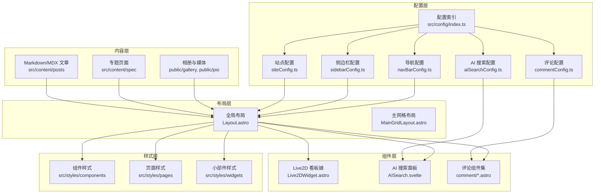
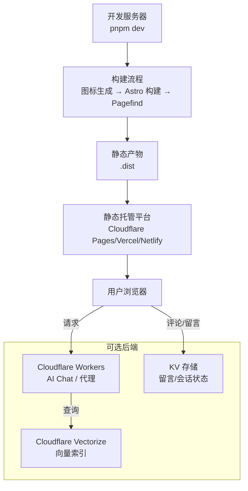
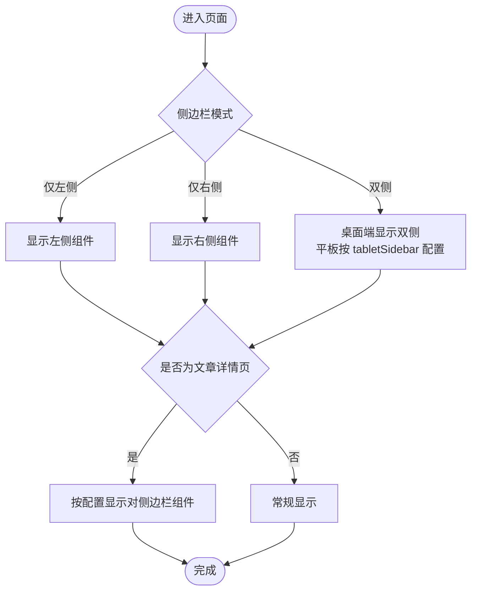
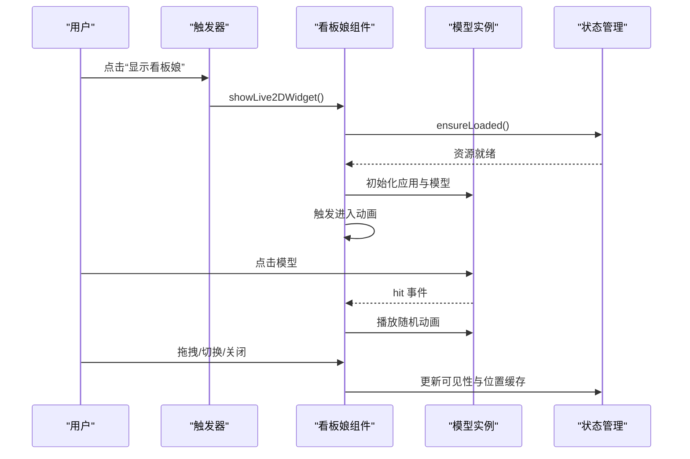
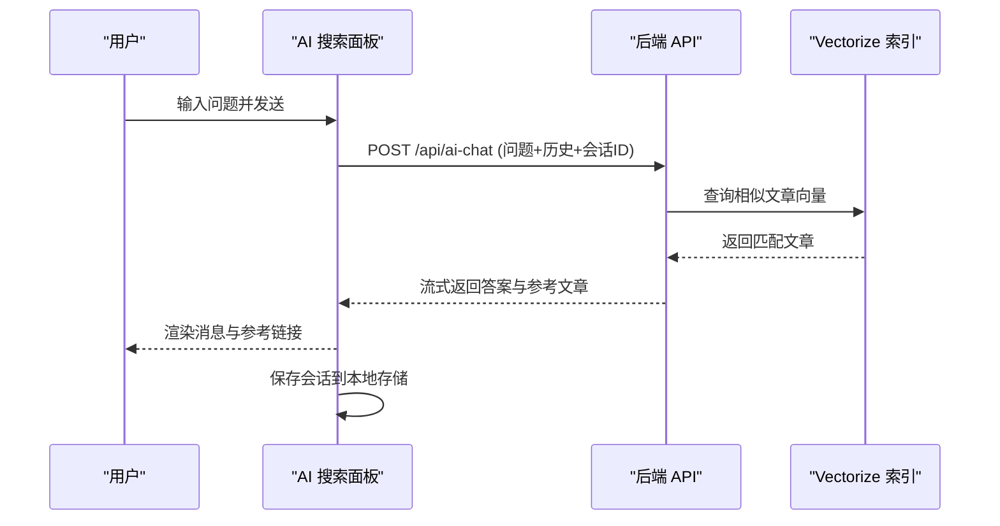
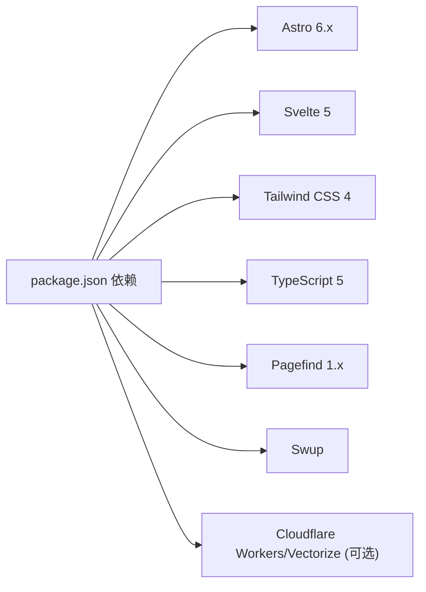

# 项目概述

<cite>
**本文档引用的文件**
- [README.md](file://README.md)
- [package.json](file://package.json)
- [astro.config.mjs](file://astro.config.mjs)
- [src/config/index.ts](file://src/config/index.ts)
- [src/layouts/Layout.astro](file://src/layouts/Layout.astro)
- [src/config/siteConfig.ts](file://src/config/siteConfig.ts)
- [src/config/sidebarConfig.ts](file://src/config/sidebarConfig.ts)
- [src/config/navBarConfig.ts](file://src/config/navBarConfig.ts)
- [src/config/aiSearchConfig.ts](file://src/config/aiSearchConfig.ts)
- [src/components/features/Live2DWidget.astro](file://src/components/features/Live2DWidget.astro)
- [src/config/commentConfig.ts](file://src/config/commentConfig.ts)
- [src/components/controls/AISearch.svelte](file://src/components/controls/AISearch.svelte)
</cite>

## 目录
1. [引言](#引言)
2. [项目结构](#项目结构)
3. [核心组件](#核心组件)
4. [架构总览](#架构总览)
5. [详细组件分析](#详细组件分析)
6. [依赖分析](#依赖分析)
7. [性能考虑](#性能考虑)
8. [故障排查指南](#故障排查指南)
9. [结论](#结论)
10. [附录](#附录)

## 引言
Firefly-Mod 是从 Firefly 分支出的个性化博客魔改版本，现已独立演进。项目基于 Astro 6.x 静态站点生成器，采用 Svelte 5 组件与 Tailwind CSS 4 样式体系，构建为纯静态博客。其核心目标是提供现代化、高性能、可扩展的个人知识管理与内容展示平台，兼顾易用性与技术深度。

项目在 Firefly 基础上的升级体现在：
- 采用 Astro 6.x 与 Svelte 5，结合 Tailwind CSS 4，形成稳定且现代化的技术栈
- 引入双侧边栏布局、Live2D/Spine 看板娘、AI 语义搜索（RAG）、多评论系统支持等增强功能
- 通过模块化的配置系统与丰富的组件生态，实现高度可定制的站点体验

与同类博客系统相比，Firefly-Mod 的差异化优势包括：
- 前端组件化与 SSR/SSG 结合，兼顾首屏性能与交互体验
- AI 语义搜索与客户端全文搜索并存，满足不同场景需求
- 多评论系统可插拔配置，便于迁移与扩展
- Live2D/Spine 看板娘与音乐可视化等富媒体特性，提升用户粘性

**章节来源**
- [README.md:12-16](file://README.md#L12-L16)
- [README.md:18-31](file://README.md#L18-L31)

## 项目结构
项目采用“内容驱动 + 配置中心 + 组件化布局”的组织方式：
- 内容层：Markdown/MDX 文章、专题页面、相册与多媒体资源
- 配置层：集中于 src/config，覆盖站点、导航、侧边栏、评论、AI 搜索等
- 布局层：src/layouts 提供全局布局与网格布局模板
- 组件层：src/components 下按功能域划分，如 analytics、comment、features、layout、pages、widget 等
- 样式层：src/styles 按组件/页面/小部件维度组织 CSS
- 工具与脚本：scripts 目录提供图标生成、索引构建、文章创建等自动化工具

**图表来源**
- [src/config/index.ts:1-66](file://src/config/index.ts#L1-L66)
- [src/layouts/Layout.astro:1-393](file://src/layouts/Layout.astro#L1-L393)
- [src/config/siteConfig.ts:1-322](file://src/config/siteConfig.ts#L1-L322)
- [src/config/sidebarConfig.ts:1-222](file://src/config/sidebarConfig.ts#L1-L222)
- [src/config/navBarConfig.ts:1-391](file://src/config/navBarConfig.ts#L1-L391)
- [src/config/aiSearchConfig.ts:1-30](file://src/config/aiSearchConfig.ts#L1-L30)
- [src/config/commentConfig.ts:1-79](file://src/config/commentConfig.ts#L1-L79)
- [src/components/features/Live2DWidget.astro:1-800](file://src/components/features/Live2DWidget.astro#L1-L800)
- [src/components/controls/AISearch.svelte:1-594](file://src/components/controls/AISearch.svelte#L1-L594)

**章节来源**
- [README.md:85-115](file://README.md#L85-L115)
- [astro.config.mjs:47-181](file://astro.config.mjs#L47-L181)

## 核心组件
- 双侧边栏布局：支持 left/right/both 三种模式，平板端可单独配置显示哪一侧，文章详情页可按需显示对侧边栏组件
- Live2D/Spine 看板娘：可拖拽、切换动画组、显示作者信息，支持移动端工具栏与位置记忆
- AI 语义搜索：集成 Cloudflare Vectorize 的 RAG 搜索，支持会话历史、流式输出与参考文章
- 多评论系统：支持 Twikoo、Waline、Giscus、Artalk、Disqus 等，配置灵活可插拔
- Swup 页面过渡：提供平滑的 SPA 风格页面切换动画与进度条
- Pagefind 客户端全文搜索：轻量级全文检索，与 AI 搜索互补
- 音乐可视化与歌词悬浮：可选的音乐播放器与 3D 可视化组件
- 代码高亮与可折叠区块：基于 Expressive Code 的增强代码块体验

**章节来源**
- [src/config/sidebarConfig.ts:6-26](file://src/config/sidebarConfig.ts#L6-L26)
- [src/components/features/Live2DWidget.astro:1-800](file://src/components/features/Live2DWidget.astro#L1-L800)
- [src/components/controls/AISearch.svelte:1-594](file://src/components/controls/AISearch.svelte#L1-L594)
- [src/config/commentConfig.ts:3-78](file://src/config/commentConfig.ts#L3-L78)
- [astro.config.mjs:66-87](file://astro.config.mjs#L66-L87)
- [README.md:16](file://README.md#L16)

## 架构总览
项目采用“静态站点 + 前端组件 + 可选后端服务”的混合架构：
- 构建阶段：图标生成 → Astro 构建 → Pagefind 索引生成
- 运行时：Astro 生成静态 HTML/CSS/JS，Svelte 组件在浏览器端交互，必要时通过 Cloudflare Workers 提供 AI 搜索与代理能力
- 数据与状态：站点配置集中管理，评论与留言依赖外部服务或 KV 存储，AI 会话与看板娘状态本地持久化

**图表来源**
- [README.md:66](file://README.md#L66)
- [README.md:149](file://README.md#L149)
- [astro.config.mjs:244-250](file://astro.config.mjs#L244-L250)

**章节来源**
- [README.md:32-64](file://README.md#L32-L64)
- [package.json:5-19](file://package.json#L5-L19)

## 详细组件分析

### 双侧边栏布局
- 布局模式：支持仅左侧、仅右侧、双侧同时显示；平板端可独立配置显示哪一侧
- 组件挂载：左侧与右侧组件列表分别定义，支持 sticky 与 top 两类位置；移动端底部组件独立配置
- 文章详情页：可按配置在文章页额外显示对侧边栏组件，便于目录与统计展示

**图表来源**
- [src/config/sidebarConfig.ts:6-26](file://src/config/sidebarConfig.ts#L6-L26)
- [src/config/sidebarConfig.ts:36-157](file://src/config/sidebarConfig.ts#L36-L157)
- [src/config/sidebarConfig.ts:159-222](file://src/config/sidebarConfig.ts#L159-L222)

**章节来源**
- [src/config/sidebarConfig.ts:6-222](file://src/config/sidebarConfig.ts#L6-L222)

### Live2D 看板娘
- 资源加载：延迟加载 Cubism Core 与 Pixi.js，支持错误重试与状态持久化
- 交互：点击模型触发动画、拖拽移动、切换动画组、显示作者信息
- 生命周期：进入/退出动画、空闲定时器、移动端工具栏、位置记忆与可见性缓存

**图表来源**
- [src/components/features/Live2DWidget.astro:270-366](file://src/components/features/Live2DWidget.astro#L270-L366)
- [src/components/features/Live2DWidget.astro:378-465](file://src/components/features/Live2DWidget.astro#L378-L465)
- [src/components/features/Live2DWidget.astro:602-704](file://src/components/features/Live2DWidget.astro#L602-L704)

**章节来源**
- [src/components/features/Live2DWidget.astro:1-800](file://src/components/features/Live2DWidget.astro#L1-L800)

### AI 语义搜索（RAG）
- 配置中心：统一管理模型、Embedding、向量维度与索引名称
- 前端交互：Svelte 组件提供会话管理、输入框、消息列表与参考文章展示
- 流式输出：通过 AbortController 支持中断，本地存储会话历史
- 向量化索引：构建脚本支持增量与全量重建，依赖 Cloudflare Vectorize

**图表来源**
- [src/config/aiSearchConfig.ts:8-29](file://src/config/aiSearchConfig.ts#L8-L29)
- [src/components/controls/AISearch.svelte:233-348](file://src/components/controls/AISearch.svelte#L233-L348)

**章节来源**
- [src/config/aiSearchConfig.ts:1-30](file://src/config/aiSearchConfig.ts#L1-L30)
- [src/components/controls/AISearch.svelte:1-594](file://src/components/controls/AISearch.svelte#L1-L594)

### 多评论系统支持
- 配置聚合：统一在 commentConfig 中定义各系统参数，支持切换与迁移
- 组件化：各评论系统以 Astro 组件形式引入，按配置动态渲染
- 兼容性：支持访客匿名、第三方登录、表情包、访问量统计等功能

**章节来源**
- [src/config/commentConfig.ts:1-79](file://src/config/commentConfig.ts#L1-L79)

### 导航与页面开关
- 导航构建：根据 siteConfig.pages 动态生成导航项，支持预设与自定义链接
- 页面开关：通过 siteConfig.pages 控制特定页面的可见性，实现灵活的功能开关

**章节来源**
- [src/config/navBarConfig.ts:47-98](file://src/config/navBarConfig.ts#L47-L98)
- [src/config/navBarConfig.ts:174-263](file://src/config/navBarConfig.ts#L174-L263)
- [src/config/siteConfig.ts:168-204](file://src/config/siteConfig.ts#L168-L204)

## 依赖分析
- 构建与运行时：Astro 6.x、Svelte 5、Tailwind CSS 4、TypeScript 5、Node.js ≥ 22、pnpm ≥ 9
- 前端交互：Swup 提供页面过渡，Pagefind 提供客户端全文搜索
- 样式与主题：Expressive Code 提供代码高亮与可折叠区块，Tailwind 4 提供原子化样式
- 可选后端：Cloudflare Workers 与 Vectorize 用于 AI 搜索与向量索引

**图表来源**
- [package.json:20-91](file://package.json#L20-L91)
- [package.json:93-111](file://package.json#L93-L111)

**章节来源**
- [package.json:1-112](file://package.json#L1-L112)
- [astro.config.mjs:47-181](file://astro.config.mjs#L47-L181)

## 性能考虑
- 构建优化：Rollup manualChunks 按功能拆分 vendor 包，减少首屏阻塞；esbuild 压缩与 drop console/debugger
- 资源缓存：静态资源长期缓存，HTML 每次校验；Tailwind CSS 代码分割与最小化
- 交互优化：Swup 页面过渡与进度条，减少白屏；Live2D 资源懒加载与 ticker 停止节省性能
- 搜索性能：Pagefind 客户端索引与 AI 搜索向量索引并存，按需选择

**章节来源**
- [astro.config.mjs:256-304](file://astro.config.mjs#L256-L304)
- [astro.config.mjs:268-299](file://astro.config.mjs#L268-L299)
- [src/components/features/Live2DWidget.astro:547-551](file://src/components/features/Live2DWidget.astro#L547-L551)

## 故障排查指南
- 构建失败：确认 Node.js ≥ 22、pnpm ≥ 9；检查 preinstall 限制与依赖安装
- AI 搜索异常：核对 Cloudflare API Token 与 Account ID；确保 Vectorize 索引名称与配置一致
- 评论系统不可用：检查评论后端地址与鉴权配置；确认 KV 存储绑定
- Live2D 加载失败：检查网络与 CDN 可达性；查看控制台错误与资源加载状态
- Pagefind 索引缺失：执行构建流程中的 pagefind 步骤；确认 dist 目录正确

**章节来源**
- [README.md:83](file://README.md#L83)
- [README.md:149](file://README.md#L149)
- [README.md:175-181](file://README.md#L175-L181)

## 结论
Firefly-Mod 通过 Astro 6.x 与 Svelte 5 的现代化技术栈，结合 Tailwind CSS 4 与丰富的前端组件生态，构建出兼具美观与实用性的个人博客平台。其双侧边栏布局、Live2D 看板娘、AI 语义搜索与多评论系统等特色功能，显著提升了用户体验与内容表达能力。项目在保证高性能的同时，提供了高度可定制的配置体系与清晰的部署路径，适合不同层次的用户使用与二次开发。

## 附录
- 快速开始命令与构建流程见 README 的“快速开始”与“常用命令”章节
- 配置系统入口与职责参见 README 的“配置系统”章节
- 部署清单与环境变量要求参见 README 的“部署清单”章节

**章节来源**
- [README.md:32-82](file://README.md#L32-L82)
- [README.md:85-115](file://README.md#L85-L115)
- [README.md:138-198](file://README.md#L138-L198)