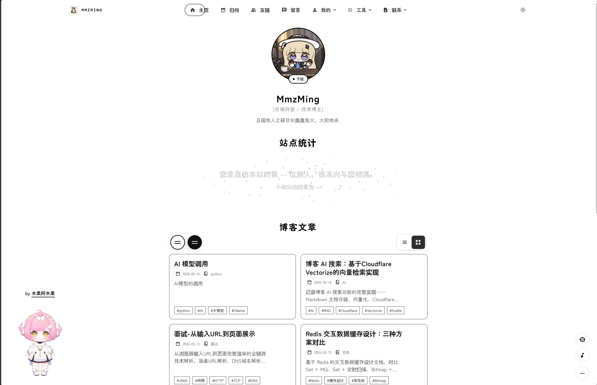

# Firefly-Mod

> 基于 [Firefly](https://github.com/CuteLeaf/Firefly) 的个人博客魔改版 `V1.3.0`




## 项目概述

Firefly-Mod 是从 [Firefly](https://github.com/CuteLeaf/Firefly) 分支出的个性化魔改版本，已脱离原分支独立演进。基于 Astro 6.x SSG 静态站点生成，搭配 Svelte 5 组件和 Tailwind CSS 4 样式系统，构建为纯静态博客。

核心特性：双侧边栏组件化布局、上下班状态感知、Live2D/Spine 看板娘、Bangumi 追番集成、相册系统、收藏 API、Waline/Twikoo/Giscus 等多评论系统支持、Swup 页面过渡动画、Pagefind 客户端全文搜索。

## 技术栈

| 层级 | 技术 | 版本 |
|------|------|------|
| 框架 | Astro (SSG) | 6.x |
| UI 组件 | Svelte | 5.x |
| 样式 | Tailwind CSS | 4.x |
| 类型 | TypeScript | 5.x |
| 格式化/Lint | Biome | 2.x |
| 页面过渡 | Swup | — |
| 全文搜索 | Pagefind | 1.x |
| 包管理 | pnpm | ≥ 9 |
| 运行时 | Node.js | ≥ 22 |

## 快速开始

```bash
# 安装依赖
pnpm install

# 启动开发服务器 (localhost:4321)
pnpm dev

# 构建生产产物到 ./dist/
pnpm build

# 预览构建产物
pnpm preview

## 开发测试
# 构建AI索引
pnpm build-index

# 登录Cloudflare Workers AI
npx wrangler login

# 构建到cf测试
npx wrangler deploy
```

构建流程为三步：图标生成 → `astro build` → `pagefind --site dist`。

## 常用命令

| 用途 | 命令 |
|------|------|
| 开发服务器 | `pnpm dev` |
| 构建 | `pnpm build` |
| 预览构建产物 | `pnpm preview` |
| 类型检查 | `pnpm check` 或 `pnpm type-check` |
| 格式化代码 | `pnpm format` |
| Lint + 自动修复 | `pnpm lint` |
| 新建博客文章 | `pnpm new-post <filename>` |
| 重新生成图标 | `pnpm icons` |

强制使用 pnpm（`preinstall` 脚本限制）。

## 架构

### 内容系统

博客文章存放在 `src/content/posts/`，支持 `.md`/`.mdx` 格式，通过 Astro content collections 加载（定义在 `src/content.config.ts`）。Frontmatter 字段：`title`、`published`、`draft`、`tags`、`category`、`pinned`、`comment`、`password` 等。`spec` 集合（`src/content/spec/`）用于特殊页面内容（关于、友链、留言板）。

### 布局系统

- `src/layouts/Layout.astro` — 基础布局：`<html>`、`<head>`、全局样式、分析代码、favicon、壁纸设置、Swup 容器
- `src/layouts/MainGridLayout.astro` — 继承 Layout，添加侧边栏栅格系统（Navbar、SideBar、响应式布局），大多数页面使用此布局

### 侧边栏组件系统

通过 `src/config/sidebarConfig.ts` 配置。支持 `left`/`right`/`both` 三种位置。每个侧边栏包含有序组件列表，组件可独立开关，可配置在文章页/非文章页的显示。移动端（<768px）有独立的 `mobileBottomComponents` 列表。

可用组件：`profile`、`announcement`、`music`、`categories`、`tags`、`stats`、`calendar`、`sidebarToc`、`advertisement`。

### 组件目录

| 目录 | 职责 |
|------|------|
| `src/components/layout/` | 结构性组件：Navbar、Footer、SideBar、PostCard、PostPage、CategoryBar、DropdownMenu |
| `src/components/widget/` | 侧边栏组件：Profile、Announcement、Music、Calendar、Categories、Tags、SiteStats、Advertisement |
| `src/components/features/` | 可选功能：Live2DWidget、SpineModel、MusicPlayer、SakuraEffect、EncryptedPost、TypewriterText |
| `src/components/controls/` | 交互控件：Search、FloatingTOC、LightDarkSwitch、DisplaySettings、WallpaperSwitch、BackToTop |
| `src/components/common/` | 通用组件：Pagination、CoverImage、WidgetLayout、FloatingButton、Icon、ImageWrapper |
| `src/components/misc/` | License、RecommendedPost、SharePoster |
| `src/components/analytics/` | GoogleAnalytics、UmamiAnalytics、MicrosoftClarity、La51Analytics |
| `src/components/comment/` | 评论系统集成 |

### 配置系统

所有配置集中在 `src/config/`，通过 `@/config`（barrel 文件 `index.ts` 统一导出）导入。

| 配置文件 | 职责 |
|----------|------|
| `siteConfig.ts` | 核心配置：语言、主题色、壁纸模式、页面开关、文章列表布局、分页、分析、图片优化、字体 |
| `sidebarConfig.ts` | 侧边栏布局与组件配置 |
| `navBarConfig.ts` | 导航栏链接与搜索配置（根据页面开关动态生成） |
| `profileConfig.ts` | 头像、昵称、签名、社交链接 |
| `commentConfig.ts` | 评论系统配置（Waline/Twikoo/Giscus/Artalk/Disqus） |
| `musicConfig.ts` | 音乐播放器配置（Meting API / 本地音乐） |
| `pioConfig.ts` | Live2D / Spine 看板娘配置 |
| `fontConfig.ts` | 自定义字体配置 |
| `galleryConfig.ts` | 相册配置 |
| `friendsConfig.ts` | 友链配置 |
| `sponsorConfig.ts` | 赞助页配置 |
| `sakuraConfig.ts` | 樱花特效配置 |
| `backgroundWallpaper.ts` | 壁纸配置 |
| `adConfig.ts` | 广告栏配置 |
| `licenseConfig.ts` | 文章许可证配置 |
| `footerConfig.ts` | 页脚配置 |
| `coverImageConfig.ts` | 封面图配置 |
| `expressiveCodeConfig.ts` | 代码块渲染配置 |
| `plantumlConfig.ts` | PlantUML 配置 |
| `collectionsApiConfig.ts` | 收藏 API 配置 |

### Markdown 插件流水线

定义在 `astro.config.mjs`。

**Remark 插件**（解析阶段，按顺序）：remarkMath → remarkReadingTime → remarkImageGrid → remarkExcerpt → remarkDirective → remarkSectionize → parseDirectiveNode → remarkMermaid → remarkPlantuml

**Rehype 插件**（HTML 转换阶段）：rehypeKatex → rehypeCallouts → rehypeSlug → rehypeMermaid → rehypePlantuml → rehypeFigure → rehypeExternalLinks → rehypeEmailProtection → rehypeComponents → rehypeAutolinkHeadings

自定义插件位于 `src/plugins/`。

### 国际化 (i18n)

翻译键定义在 `src/i18n/i18nKey.ts`（const enum）。语言文件在 `src/i18n/languages/`（zh_CN、zh_TW、en、ja、ru）。使用 `i18n(key)` 函数（来自 `src/i18n/translation.ts`），读取 `siteConfig.lang` 并按 zh_CN → en 顺序回退。

### 样式系统

- Tailwind CSS v4 + `@tailwindcss/vite` 插件
- 全局样式：`src/styles/main.css`，Stylus 变量：`src/styles/variables.styl`
- PostCSS 流水线（`postcss.config.mjs`）：postcss-import → postcss-nesting
- 主题色通过 `Layout.astro` 中从 `siteConfig.themeColor.hue` 生成的 CSS 自定义属性设置

### 路径别名

定义在 `tsconfig.json`：

| 别名 | 映射 |
|------|------|
| `@components/*` | `src/components/*` |
| `@assets/*` | `src/assets/*` |
| `@constants/*` | `src/constants/*` |
| `@utils/*` | `src/utils/*` |
| `@i18n/*` | `src/i18n/*` |
| `@layouts/*` | `src/layouts/*` |
| `@/*` | `src/*` |

## 主要功能配置

### 上下班状态

```typescript
// src/config/siteConfig.ts
workHours: {
  start: 9,
  end: 18,
  workDays: [1, 2, 3, 4, 5, 6],
},
```

侧边栏头像根据当前时间自动切换工作/休息状态，支持配置不同的上下班头像。

### 页面开关

```typescript
// src/config/siteConfig.ts
pages: {
  friends: true,
  sponsor: true,
  guestbook: true,
  bangumi: true,
  gallery: true,
  collections: true,
  stats: true,
},
```

设为 `false` 的页面返回 404，导航栏链接同步隐藏。

### 评论系统

支持 5 种评论系统，通过 `commentConfig.type` 切换：`waline`、`twikoo`、`giscus`、`artalk`、`disqus`。设为 `none` 则不启用。

### 看板娘

支持 Live2D（Cubism 2/3+）和 Spine 两种模型格式，可配置位置、尺寸、交互消息、移动端隐藏等。Live2D 模型需遵守作者版权协议。

## CI/CD 工作流

| 工作流 | 触发条件 | 说明 |
|--------|----------|------|
| `ci.yml` | push/PR 到 master | Astro 类型检查 + Biome Lint 代码质量检查 |
| `cron-check.yml` | 每日 08:00 + 手动触发 | 友链可达性巡检，使用 Playwright 逐个访问，异常自动创建 Issue 报告 |
| `friend-link-checker.yml` | Issue 创建/评论 | 通过 Issue 自动处理友链申请，提取信息并提交 PR |
| `claude.yml` / `claude-review.yml` | Issue/PR 评论 | AI 辅助代码审查和问题响应 |

注意：建议在 GitHub 仓库设置中关闭邮箱订阅，避免 CI 工作流频繁触发邮件通知。

## 构建注意事项

- `pnpm build` 三步流程：图标生成脚本 → `astro build` → `pagefind --site dist`
- Vite 构建移除 `console.log` 和 `debugger`（esbuild `drop` 选项）
- 图片优化仅对 `src/` 目录下的图片生效，`public/` 目录的图片不会被 Astro 优化
- `generateOgImages: true` 构建耗时较长，默认关闭
- 修改 `rehypeCallouts.theme` 或 `plantumlConfig` 后需重启开发服务器
- CI 在 push/PR 到 master 时运行 biome 检查

## 关键工具函数

| 文件 | 职责 |
|------|------|
| `src/utils/setting-utils.ts` | 显示设置管理（主题、壁纸、布局模式），持久化到 localStorage |
| `src/utils/toc-utils.ts` | 目录生成 |
| `src/utils/responsive-utils.ts` | 侧边栏栅格类、响应式断点 |
| `src/utils/content-utils.ts` | 文章排序、过滤、分页 |
| `src/utils/image-utils.ts` | 图片格式、质量、referrer 策略 |
| `src/utils/url-utils.ts` | URL 处理工具 |

## Swup 页面过渡

Swup 启用了特定容器（`#swup-container`、`#left-sidebar-dynamic`、`#right-sidebar-dynamic`、`#floating-toc-wrapper` 等）。锚点链接跳过 popstate 处理，由浏览器原生处理。`animateHistoryBrowsing: false` — 历史导航不播放动画。

## Biome 配置

格式化使用 tab 缩进、双引号。Svelte/Astro/Vue 文件放宽 lint 规则（允许 `let`、未使用变量等）。CI 中通过 `biome ci ./src --reporter=github` 检查。`src/constants/icons.ts` 被排除在 biome 检查之外（自动生成文件）。

## Live2D 版权声明

Live2D 模型作者为 B 站用户 [木果阿木果](https://space.bilibili.com/886695)，使用需遵守以下规则：

- 使用前必须征得作者同意
- 必须标明作者信息和来源地址
- 模型设计版权归属库洛
- 模型可用于鸣潮相关视频和直播（需标注来源）
- 禁止商用盈利，禁止二次上传转载引流

## 灵感项目

- [fuwari](https://github.com/saicaca/fuwari)
- [hexo-theme-shoka](https://github.com/amehime/hexo-theme-shoka)
- [astro-koharu](https://github.com/cosZone/astro-koharu)
- [Mizuki](https://github.com/matsuzaka-yuki/Mizuki)

## 许可协议

最初 Fork 自 [saicaca/fuwari](https://github.com/saicaca/fuwari)。

**版权声明：**

- Copyright (c) 2024 [saicaca](https://github.com/saicaca) - [fuwari](https://github.com/saicaca/fuwari)
- Copyright (c) 2025 [CuteLeaf](https://github.com/CuteLeaf) - [Firefly](https://github.com/CuteLeaf/Firefly)

根据 MIT 开源协议，可自由使用、修改、分发代码，但需保留上述版权声明。
