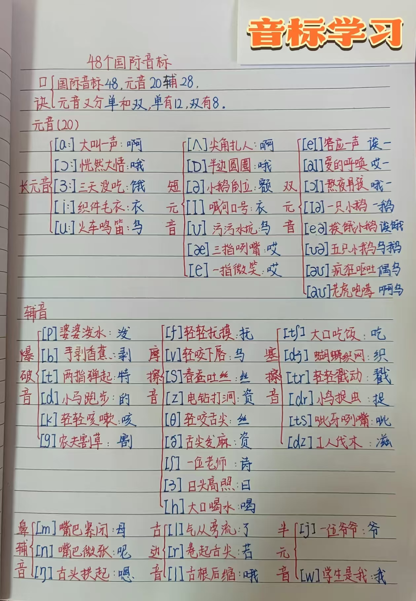

​​

  <iframe 
    src="https://player.bilibili.com/player.html?isOutside=true&aid=116152256694277&bvid=BV1qSAzzAEAr&cid=36369203606&p=1&autoplay=0" 
    scrolling="no" 
    border="0" 
    frameborder="no" 
    framespacing="0" 
    allowfullscreen="true" 
    style="position: absolute; width: 100%; height: 100%;" 
    allow="encrypted-media; picture-in-picture"
  ></iframe>

