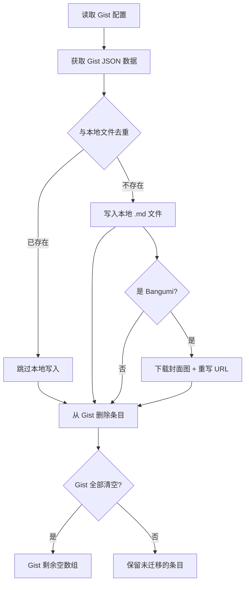

# Gist 数据迁移工具使用指南

博客的部分数据（说说、友链、影视、笔记本）存储在 GitHub Gist 中，通过客户端 JS 获取并渲染。当数据量增大或需要离线使用时，可以使用迁移工具将 Gist 数据转移到本地 Content Collection 中。

迁移完成后，Gist 中的数据会被清空，前端不再渲染远程数据，避免本地 + 远端重复显示。

## 前提条件

### 设置 GitHub Token

迁移脚本需要 Token 才能从 Gist 中删除已迁移的条目：

```bash
# Linux / macOS
export GITHUB_TOKEN=ghp_你的Token

# Windows PowerShell
$env:GITHUB_TOKEN="ghp_你的Token"

# Windows CMD
set GITHUB_TOKEN=ghp_你的Token
```

Token 需要 `gist` 权限。在 GitHub → Settings → Developer settings → Personal access tokens 中创建。

:::tip[没有 Token？]
没有 Token 也能运行，数据会写入本地，但不会从 Gist 中删除。你需要手动清空 Gist，否则前端会重复渲染。
:::

## 使用方式

### 通过 CLI 菜单

```bash
pnpm cli gist-migrate
```

交互式选择迁移类型和预览模式。

### 直接运行

```bash
# 预览模式（不写入不删除，仅显示会做什么）
node scripts/backup-gist/index.js --dry-run

# 迁移全部数据
node scripts/backup-gist/index.js

# 只迁移某一类
node scripts/backup-gist/index.js moments      # 说说
node scripts/backup-gist/index.js friends      # 友链
node scripts/backup-gist/index.js bangumi      # 影视/书籍/音乐/游戏
node scripts/backup-gist/index.js notebooks    # 笔记本
```

:::caution[建议先预览]
首次运行建议先加 `--dry-run` 参数预览，确认无误后再正式执行。
:::

## 四类数据说明

### 说说（Moments）

| 项 | 值 |
|---|---|
| Gist 文件 | `moments.json` |
| 本地目录 | `src/content/moments/` |
| 文件命名 | `{日期}.md`，冲突自动加后缀 |
| 去重依据 | `published` 日期 |

Gist 中的说说如果没有 `author` 和 `avatar` 字段，脚本会自动补全为默认值：

```yaml
---
published: 2026-06-10 08:00:00
author: 团子和蛋糕
avatar: https://re.tsh520.cn/zl/tx.webp
tags:
  - 日常
---

今天天气真好
```

### 友链（Friends）

| 项 | 值 |
|---|---|
| Gist 文件 | `friends.json` |
| 本地目录 | `src/content/friends/` |
| 文件命名 | `{序号}-{slug}.md` |
| 去重依据 | `siteurl` |

```yaml
---
title: 某博客
imgurl: https://example.com/avatar.png
desc: 一个有趣的博客
siteurl: https://example.com
tags:
  - Blog
weight: 5
---
```

### 影视（Bangumi）

| 项 | 值 |
|---|---|
| Gist 文件 | `bangumi.json` |
| 本地目录 | `src/content/bangumi/{category}/` |
| 文件命名 | `{中文标题}.md` |
| 去重依据 | `title` |
| 封面图 | 自动下载 + URL 重写 |

脚本会自动从 TMDB 下载封面图到 `scripts/fetch-media/img-anime/`，并将 URL 重写为自定义图床地址。

:::note[Category 映射]
Gist 中的 `movie`、`tv`、`documentary` 不是 Astro schema 的有效枚举值，脚本会自动映射为 `category: anime` + 对应 `subcategory`。
:::

```yaml
---
title: 你的名字
category: anime
status: 2
image: https://ph.0824.uk/file/anime/你的名字.jpg
score: 10
tags:
  - 动画
---
```

### 笔记本（Notebooks）

| 项 | 值 |
|---|---|
| Gist 文件 | 每个笔记本独立一个 Gist |
| 本地目录 | `src/content/life/notebooks/{笔记本名}/` |
| 文件命名 | `{标题}.md` |
| 去重依据 | `id` 字段 |

```yaml
---
date: 2026-06-10
name: 今天的事
---

## 今天
玩了一天
```

## 封面图处理

### 自动下载

迁移 Bangumi 时，脚本自动从 TMDB 下载封面图。下载完成后需要手动上传到图床：

```
scripts/fetch-media/img-anime/  →  上传到  →  https://ph.0824.uk/file/anime/
```

### 手动补下载

如果迁移时图片下载失败（如网络不通），可以单独运行：

```bash
node scripts/backup-gist/download-images.js
```

## 工作流程



## 常见问题

### 重复运行会出问题吗？

不会。脚本会检测本地已有文件并跳过，已从 Gist 删除的条目下次运行时自然不存在。

### 迁移后前端还有重复数据？

检查 Gist 是否已被清空。如果 Gist 中仍有数据，前端的客户端 JS 会继续获取并渲染。确保 Gist 中的数组为空 `[]`。

### 封面图下载失败？

1. 检查网络是否能访问 `image.tmdb.org`
2. 如果不通，运行 `node scripts/backup-gist/download-images.js` 单独重试
3. 如果仍然失败，手动下载图片放入 `scripts/fetch-media/img-anime/`
4. 最后将图片上传到图床

### 如何回滚？

迁移后的文件在 `git status` 中显示为未跟踪文件：

```bash
# 删除迁移的文件（保留 git 已跟踪的文件）
git clean -f src/content/moments/ src/content/friends/ src/content/bangumi/ src/content/life/notebooks/
```

:::danger[回滚注意]
Gist 中的数据已被删除，回滚后需要手动恢复 Gist 内容。
:::
